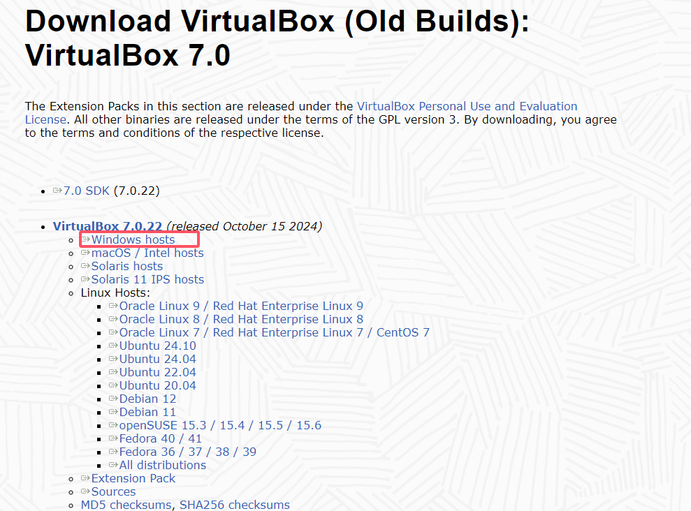
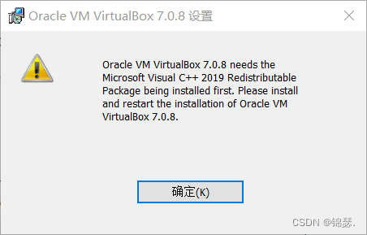

1. 在官网下载VirtualBox的安装包。官网下载地址如下：

[Download_Old_Builds_7_0 – Oracle VirtualBox](https://www.virtualbox.org/wiki/Download_Old_Builds_7_0)

2. 在安装时候出现这个错误

按照提示的意思是需要安装 Microsoft Visual C++ 2019。那么按照提示依次安装。

3. 安装Microsoft Visual C++ 2019。下载的官网地址为：

[最新受支持的 Visual C++ 可再发行程序包下载](https://learn.microsoft.com/zh-cn/cpp/windows/latest-supported-vc-redist?view=msvc-170)

安装好之后重新安装VirtualBox 即可安装好。

