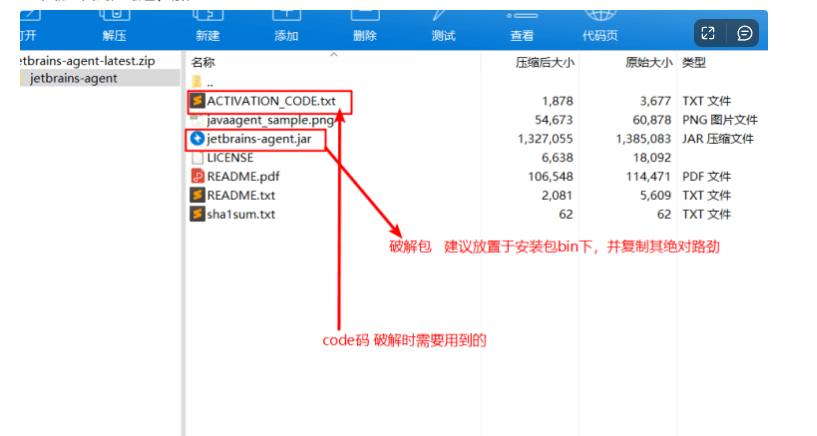
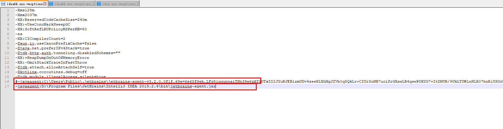
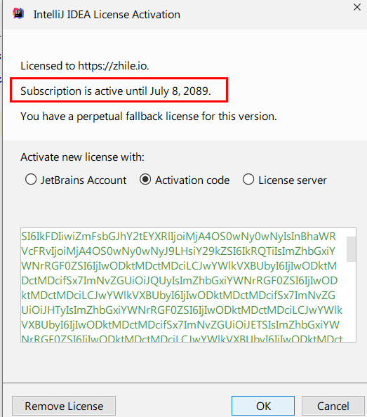

1. 下载IDEA地址：

[Other Versions - IntelliJ IDEA](https://www.jetbrains.com/idea/download/other.html)

2. 下载破解包

[jetbrains-agent-latest.zip](https://www.yuque.com/attachments/yuque/0/2022/zip/22334924/1666493917891-84ff6631-4a6d-4b30-a52c-4fabb2a845ef.zip)

       下载上面的压缩包，解压后

3. 将破解包放在IDAEA的安装目录的/bin目录下面

4. 打开`C:\Users\admin\.IntelliJIdea2019.2\config`文件

5. 编辑idea64.exe.vmoptions文件，在最后一行添加：`-javaagent:D:\Program Files\JetBrains\IntelliJ IDEA 2019.2.4\bin\jetbrains-agent.jar`

如果原来有-javaagent则注释掉，不然IDEA会启动失败

后面的路径请配置自己的路径

6. 打开IDEA

idea.exe是32位，如果点击这个，则会报如下错误

而我们在本地运行`java -version`发现jdk是64位的

所以需要运行64位的idea

所以点击下面 的idea64.exe运行

7. 和以前一样，在Activation Code将破解包中的ACTIVATION_CODE.txt内容拷贝进去，至此则破解成功

