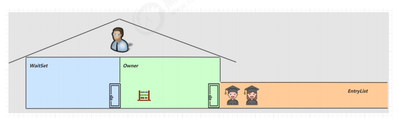

**<font style="color:#DF2A3F;">笔记来源：</font>**[**<font style="color:#DF2A3F;">黑马程序员深入学习Java并发编程，JUC并发编程全套教程</font>**](https://www.bilibili.com/video/BV16J411h7Rd/?spm_id_from=333.337.search-card.all.click&vd_source=e8046ccbdc793e09a75eb61fe8e84a30)


应用背景：

为了避免临界区的竞态条件发生，有多种手段可以达到目的。

+ 阻塞式的解决方案：synchronized、Lock
+ 非阻塞式的解决方案：原子变量

本次课使用阻塞式的解决方案：synchronized，来解决上述问题，即俗称的【对象锁】，**它采用互斥的方式让同一时刻至多只有一个线程能持有【对象锁】，其它线程再想获取这个【对象锁】时就会阻塞住**。这样就能保证拥有锁的线程可以安全的执行临界区内的代码，不用担心线程上下文切换

  
**注意**

虽然 java 中互斥和同步都可以采用 synchronized 关键字来完成，但它们还是有区别的：

+ 互斥是保证临界区的竞态条件发生，同一时刻只能有一个线程执行临界区代码
+ 同步是由于线程执行的先后、顺序不同、需要一个线程等待其它线程运行到某个点

# 1 synchronized应用
**语法：**

```java
synchronized(对象) // 线程1， 线程2(blocked)
{
 临界区
}
```

**解决代码：**

```java
static int counter = 0;
static final Object room = new Object();
public static void main(String[] args) throws InterruptedException {
    Thread t1 = new Thread(() -> {
        for (int i = 0; i < 5000; i++) {
            synchronized (room) {
                counter++;
            }
        }
    }, "t1");
    Thread t2 = new Thread(() -> {
        for (int i = 0; i < 5000; i++) {
            synchronized (room) {
                counter--;
            }
        }
    }, "t2");
    t1.start();
    t2.start();
    t1.join();
    t2.join();
    log.debug("{}",counter);
}
```

你可以做这样的类比：



1. synchronized(对象) 中的对象，可以想象为一个房间（room），有唯一入口（门）房间只能一次进入一人进行计算，线程 t1，t2 想象成两个人
2. 当线程 t1 执行到 synchronized(room) 时就好比 t1 进入了这个房间，并锁住了门拿走了钥匙，在门内执行count++ 代码
3. 这时候如果 t2 也运行到了 synchronized(room) 时，它发现门被锁住了，只能在门外等待，发生了上下文切换，阻塞住了
4. **这中间即使 t1 的 cpu 时间片不幸用完，被踢出了门外（不要错误理解为锁住了对象就能一直执行下去哦），这时门还是锁住的，t1 仍拿着钥匙，t2 线程还在阻塞状态进不来，只有下次轮到 t1 自己再次获得时间片时才能开门进入**
5. **当 t1 执行完 **`**synchronized{}**`** 块内的代码，这时候才会从 obj 房间出来并解开门上的锁，唤醒 t2 线程把钥匙给他。t2 线程这时才可以进入 obj 房间，锁住了门拿上钥匙，执行它的 count-- 代码**

  
用图来表示：


思考  
synchronized 实际是用对象锁保证了临界区内代码的原子性，临界区内的代码对外是不可分割的，不会被线程切换所打断。

> 如果把 synchronized(obj) 放在 for 循环的外面，如何理解？-- 原子性  
如果 t1 synchronized(obj1) 而 t2 synchronized(obj2) 会怎样运作？-- 锁对象  
如果 t1 synchronized(obj) 而 t2 没有加会怎么样？如何理解？-- 锁对象
>

# 2 面向对象改进
把需要保护的共享变量放入一个类

```java
class Room {
    int value = 0;

    public void increment() {
        synchronized (this) {
            value++;
        }
    }

    public void decrement() {
        synchronized (this) {
            value--;
        }
    }
    public int get() {
        synchronized (this) {
            return value;
        }
    }
}

@Slf4j
public class Test1 {
 
    public static void main(String[] args) throws InterruptedException {
        Room room = new Room();
        Thread t1 = new Thread(() -> {
            for (int j = 0; j < 5000; j++) {
                room.increment();
            }
        }, "t1");
        Thread t2 = new Thread(() -> {
            for (int j = 0; j < 5000; j++) {
                room.decrement();
            }
        }, "t2");
        t1.start();
        t2.start();
        t1.join();
        t2.join();
        log.debug("count: {}" , room.get());
    }
}
```

# 3 方法上的 synchronized
```java
class Test{
    public synchronized void test() {
 
    }
}
//等价于
class Test{
    public void test() {
        synchronized(this) {
 
        }
    }
}
```


```java
class Test{
    public synchronized static void test() {
    }
}
//等价于
class Test{
    public static void test() {
        synchronized(Test.class) {
 
        }
    }
}
```

不加 synchronzied 的方法就好比不遵守规则的人，不去老实排队（好比翻窗户进去的）

# 4 线程八锁
其实就是考察 synchronized 锁住的是哪个对象

  
**<font style="color:#E8323C;">情况1</font>**：12 或 21

```java
@Slf4j(topic = "c.Number")
class Number{
    public synchronized void a() {
        log.debug("1");
    }
    public synchronized void b() {
        log.debug("2");
    }
}
public static void main(String[] args) {
    Number n1 = new Number();
    new Thread(()->{ n1.a(); }).start();
    new Thread(()->{ n1.b(); }).start();
}
```

都是对象锁，this，所以两种情况


**<font style="color:#E8323C;">情况2</font>**：1s后12，或 2 1s后 1

```java
@Slf4j(topic = "c.Number")
class Number{
    public synchronized void a() {
        sleep(1);
        log.debug("1");
    }
    public synchronized void b() {
        log.debug("2");
    }
}
public static void main(String[] args) {
    Number n1 = new Number();
    new Thread(()->{ n1.a(); }).start();
    new Thread(()->{ n1.b(); }).start();
}
```

都是对象锁，this，所以两种情况


**<font style="color:#E8323C;">情况3</font>**：3 1s 12 或 23 1s 1 或 32 1s 1

```java
@Slf4j(topic = "c.Number")
class Number{
    public synchronized void a() {
        sleep(1);
        log.debug("1");
    }
    public synchronized void b() {
        log.debug("2");
    }
    public void c() {
        log.debug("3");
    }
}

public static void main(String[] args) {
    Number n1 = new Number();
    new Thread(()->{ n1.a(); }).start();
    new Thread(()->{ n1.b(); }).start();
    new Thread(()->{ n1.c(); }).start();
}
```

线程1和线程2是同一把锁，都是this，所以有两种情况，方法c没有锁，所以和a或者b并发


**<font style="color:#E8323C;">情况4</font>**：2 1s 后 1

```java
@Slf4j(topic = "c.Number")
class Number{
    public synchronized void a() {
        sleep(1);
        log.debug("1");
    }
    public synchronized void b() {
        log.debug("2");
    }
}
public static void main(String[] args) {
    Number n1 = new Number();
    Number n2 = new Number();
    new Thread(()->{ n1.a(); }).start();
    new Thread(()->{ n2.b(); }).start();
}
```

两个都是对象锁，都是this，不过是两个对象，线程1用的n1，线程2用的是n2，所以不是同一把锁，所以只有一种情况


**<font style="color:#E8323C;">情况5</font>**：2 1s 后 1

```java
@Slf4j(topic = "c.Number")
class Number{
    public static synchronized void a() {
        sleep(1);
        log.debug("1");
    }
    public synchronized void b() {
        log.debug("2");
    }
public static void main(String[] args) {
    Number n1 = new Number();
    new Thread(()->{ n1.a(); }).start();
    new Thread(()->{ n1.b(); }).start();
}
```

a方法用的是类锁，b方法用是this锁，不是同一把锁，所以并发执行，只有一种情况


**<font style="color:#E8323C;">情况6</font>**：1s 后12， 或 2 1s后 1

```java
@Slf4j(topic = "c.Number")
class Number{
    public static synchronized void a() {
        sleep(1);
        log.debug("1");
    }
    public static synchronized void b() {
        log.debug("2");
    }
}
public static void main(String[] args) {
    Number n1 = new Number();
    new Thread(()->{ n1.a(); }).start();
    new Thread(()->{ n1.b(); }).start();
}
```

两个线程都用的是类锁，同一把锁，所以谁先获得锁，谁先执行，所以有两种情况


**<font style="color:#E8323C;">情况7</font>**：2 1s 后 1

```java
@Slf4j(topic = "c.Number")
class Number{
    public static synchronized void a() {
        sleep(1);
        log.debug("1");
    }
    public synchronized void b() {
        log.debug("2");
    }
}
public static void main(String[] args) {
    Number n1 = new Number();
    Number n2 = new Number();
    new Thread(()->{ n1.a(); }).start();
    new Thread(()->{ n2.b(); }).start();
}
```

a方法用的是类锁，b方法用的是对象锁，是this，不是同一把锁，所以两个是并发进行的，只有一种情况


**<font style="color:#E8323C;">情况8</font>**：1s 后12， 或 2 1s后 1

```java
@Slf4j(topic = "c.Number")
class Number{
    public static synchronized void a() {
        sleep(1);
        log.debug("1");
    }
    public static synchronized void b() {
        log.debug("2");
    }
}
public static void main(String[] args) {
    Number n1 = new Number();
    Number n2 = new Number();
    new Thread(()->{ n1.a(); }).start();
    new Thread(()->{ n2.b(); }).start();
}
```

两个线程用的是同一把锁，都是类锁，所以出现两种情况

    - 

