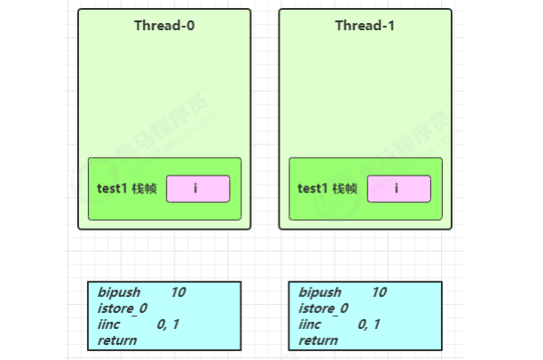
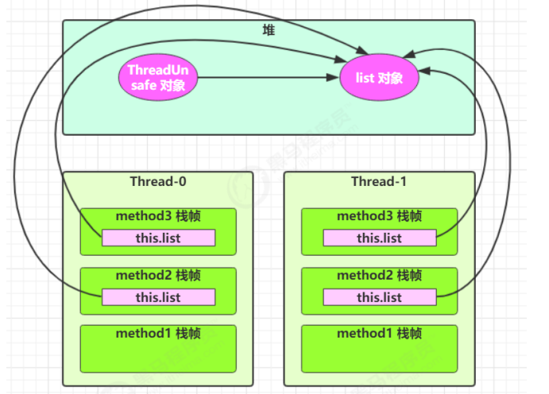
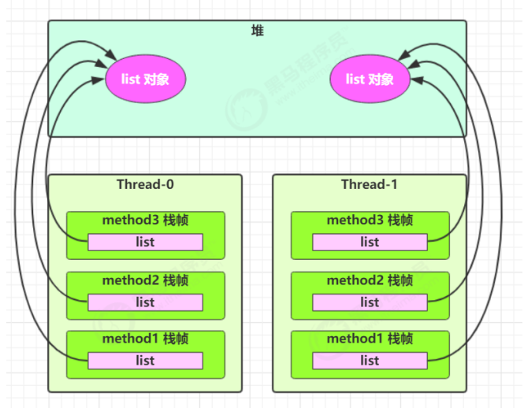

**<font style="color:#DF2A3F;">笔记来源：</font>**[**<font style="color:#DF2A3F;">黑马程序员深入学习Java并发编程，JUC并发编程全套教程</font>**](https://www.bilibili.com/video/BV16J411h7Rd/?spm_id_from=333.337.search-card.all.click&vd_source=e8046ccbdc793e09a75eb61fe8e84a30)

<font style="color:#E8323C;"></font>

<font style="color:#E8323C;">在分析之前，我们先来思考两个问题？</font>

<font style="color:#E8323C;">问题一：成员变量和静态变量是否线程安全？</font>

+ 如果它们没有共享，则线程安全
+ 如果它们被共享了，根据它们的状态是否能够改变，又分两种情况 
    - 如果只有读操作，则线程安全
    - 如果有读写操作，则这段代码是临界区，需要考虑线程安全


<font style="color:#E8323C;">问题二：局部变量是否线程安全？</font>

+ 局部变量是线程安全的
+ 但局部变量引用的对象则未必 
    - 如果该对象没有逃离方法的作用访问，它是线程安全的
    - 如果该对象逃离方法的作用范围，需要考虑线程安全

# 1 局部变量线程安全分析
```java
public static void test1() {
    int i = 10;
    i++; 
}
```

每个线程调用 test1() 方法时局部变量`i`，会在每个线程的栈帧内存中被创建多份，因此不存在共享。字节码分析如下：

```java
public static void test1();
    descriptor: ()V
    flags: ACC_PUBLIC, ACC_STATIC
    Code:
        stack=1, locals=1, args_size=0
            0: bipush   10
            2: istore_0
            3: iinc     0, 1
            6: return
        LineNumberTable:
            line 10: 0
            line 11: 3
            line 12: 6
        LocalVariableTable:
            Start Length Slot Name Signature
                3      4    0    i  I
```

如图  


局部变量的引用稍有不同。

  
先看一个成员变量的例子，示例代码如下：

```java
class ThreadUnsafe {
    
    ArrayList<String> list = new ArrayList<>();
    
    public void method1(int loopNumber) {
        for (int i = 0; i < loopNumber; i++) {
            // { 临界区, 会产生竞态条件
            method2();
            method3();
            // } 临界区
        }
    }
    
    private void method2() {
        list.add("1");
    }
    
    private void method3() {
        list.remove(0);
    }
}
```


执行代码如下

```java
static final int THREAD_NUMBER = 2;
static final int LOOP_NUMBER = 200;

public static void main(String[] args) {
    
    ThreadUnsafe test = new ThreadUnsafe();
    
    for (int i = 0; i < THREAD_NUMBER; i++) {
        new Thread(() -> {
            test.method1(LOOP_NUMBER);
        }, "Thread" + i).start();
    }
}
```


其中一种情况是，如果线程2 还未 add，线程1 remove 就会报错：

```java
Exception in thread "Thread1" java.lang.IndexOutOfBoundsException: Index: 0, Size: 0 
    at java.util.ArrayList.rangeCheck(ArrayList.java:657) 
    at java.util.ArrayList.remove(ArrayList.java:496) 
    at cn.itcast.n6.ThreadUnsafe.method3(TestThreadSafe.java:35) 
    at cn.itcast.n6.ThreadUnsafe.method1(TestThreadSafe.java:26) 
    at cn.itcast.n6.TestThreadSafe.lambda

$$
main
$$
0(TestThreadSafe.java:14) 
    at java.lang.Thread.run(Thread.java:748)
```


分析：

+ 无论哪个线程中的 method2 引用的都是同一个对象中的 list 成员变量
+ method3 与 method2 分析相同




将 list 修改为局部变量

```java
class ThreadSafe {
    
    public final void method1(int loopNumber) {
        ArrayList<String> list = new ArrayList<>();
        for (int i = 0; i < loopNumber; i++) {
            method2(list);
            method3(list);
        }
    }
    
    private void method2(ArrayList<String> list) {
        list.add("1");
    }
    
    private void method3(ArrayList<String> list) {
        list.remove(0);
    }
}
```

那么就不会有上述问题了。分析：

+ list 是局部变量，每个线程调用时会创建其不同实例，没有共享
+ 而 method2 的参数是从 method1 中传递过来的，与 method1 中引用同一个对象
+ method3 的参数分析与 method2 相同





再思考一个问题：方法访问修饰符带来的思考，如果把 method2 和 method3 的方法修改为 public 会不会代理线程安全问题？

+ 情况1：有其它线程调用 method2 和 method3
+ 情况2：在 情况1 的基础上，为 ThreadSafe 类添加子类，子类覆盖 method2 或 method3 方法，即

```java
class ThreadSafe {
    public final void method1(int loopNumber) {
        ArrayList<String> list = new ArrayList<>();
        for (int i = 0; i < loopNumber; i++) {
            method2(list);
            method3(list);
        }
    }
    private void method2(ArrayList<String> list) {
        list.add("1");
    }
    private void method3(ArrayList<String> list) {
        list.remove(0);
    }
}
class ThreadSafeSubClass extends ThreadSafe{
    @Override
    public void method3(ArrayList<String> list) {
        new Thread(() -> {
            list.remove(0);
        }).start();
    }
}
```

从这个例子可以看出 private 或 final 提供【安全】的意义所在，请体会开闭原则中的【闭】。

# 2 常见线程安全类
`String``Integer``StringBuffer``Random``Vector``Hashtable``java.util.concurrent`包下的类

这里说它们是线程安全的是指，多个线程调用它们同一个实例的某个方法时，是线程安全的。也可以理解为

```java
Hashtable table = new Hashtable();

new Thread(()->{
    table.put("key", "value1");
}).start();

new Thread(()->{
    table.put("key", "value2");
}).start();
```

**注意：**它们的每个方法是原子的，但注意它们多个方法的组合不是原子的，见后面分析

## 2.1 线程安全类方法的组合
分析下面代码是否线程安全？

```java
Hashtable table = new Hashtable();
// 线程1，线程2
if( table.get("key") == null) {
    table.put("key", value);
}
```


## 2.2 可变类线程安全性
String、Integer 等都是不可变类，因为其内部的状态不可以改变，因此它们的方法都是线程安全的。或许有疑问，String 有 replace，substring 等方法【可以】改变值啊，那么这些方法又是如何保证线程安全的呢？因为 String 每次要改变字符串的时候，都是创建一个新的字符串。

```java
public class Immutable{
    private int value = 0;
    public Immutable(int value){
        this.value = value;
    }
    public int getValue(){
        eturn this.value;
    }
}
```

如果想增加一个添加的方法呢？

```java
public class Immutable{
    private int value = 0;
    public Immutable(int value){
        this.value = value;
    }
    public int getValue(){
        return this.value;
    }
 
    public Immutable add(int v){
        return new Immutable(this.value + v);
    } 
}
```

# 3 实例分析
**实例一：**

```java
//Servlet 是运行在Tomcat环境下的，每一种Servlet是只有一个实例的，是被tomcat的多个线程共享的。
//因此Servlet里的成员变量都会存在共享问题
public class MyServlet extends HttpServlet {
    
    // 是否安全？ 否
    Map<String,Object> map = new HashMap<>();
    
    // 是否安全？ 是
    String S1 = "...";
    
    // 是否安全？ 是
    final String S2 = "...";
    
    // 是否安全？ 否
    Date D1 = new Date();
    
    // 是否安全？ 否，因为加了final只是保证这个D1这个引用的对象不可变。
    // 但是Date里面的相关属性还是可以变的，因为Date不是不可变类
    final Date D2 = new Date();
 
    public void doGet(HttpServletRequest request, HttpServletResponse response) {
        // 使用上述变量
    }
}
```


**实例二：**

```java
public class MyServlet extends HttpServlet {
    // 是否安全？不是。因为MyServlet只会被创建一份，所以userService作为一个属性，也只会被创建一份。
    // 所以userService也会被共享，userService被共享，他里面有一个count也是被共享的。
    private UserService userService = new UserServiceImpl();
 
    public void doGet(HttpServletRequest request, HttpServletResponse response) {
        userService.update(...);
    }
}
public class UserServiceImpl implements UserService {
    // 记录调用次数
    private int count = 0;
 
    public void update() {
        // ...  这就是临界区，多个线程对这个代码进行修改
        count++;
    }
}
```


**实例三**<font style="color:#000000;">：</font>

```java
@Aspect
@Component
public class MyAspect {
    // 是否安全？   否 spring里面的对象没有加scope的话，都是单例的
    // 既然是单例，说明 MyAspect 会被共享，那里面的这个成员变量也会被共享。所以并发修改就会引发安全问题。
    // 如何解决：可以做一个环绕通知，让这些成员变量变成一个局部变量。
    private long start = 0L;
 
    @Before("execution(* *(..))")
    public void before() {
        start = System.nanoTime();
    }
 
    @After("execution(* *(..))")
    public void after() {
        long end = System.nanoTime();
        System.out.println("cost time:" + (end-start));
    }
}
```


**<font style="color:#000000;">案例四：</font>**

```java

public class MyServlet extends HttpServlet {
    // 是否安全   是
    private UserService userService = new UserServiceImpl();
 
    public void doGet(HttpServletRequest request, HttpServletResponse response) {
        userService.update(...);
    }
}
public class UserServiceImpl implements UserService {
    // 是否安全   是
    private UserDao userDao = new UserDaoImpl();
 
    public void update() {
        userDao.update();
    }
}
public class UserDaoImpl implements UserDao { 
    public void update() {
        String sql = "update user set password = ? where username = ?";
        // 是否安全   是
        try (Connection conn = DriverManager.getConnection("","","")){
            // ...
        } catch (Exception e) {
            // ...
        }
    }
}
```


**<font style="color:#000000;">案例五：</font>**

```java
public class MyServlet extends HttpServlet {
    // 是否安全  
    private UserService userService = new UserServiceImpl();
 
    public void doGet(HttpServletRequest request, HttpServletResponse response) {
        userService.update(...);
    }
}
public class UserServiceImpl implements UserService {
    // 是否安全
    private UserDao userDao = new UserDaoImpl();
 
    public void update() {
        userDao.update();
    }
}

public class UserDaoImpl implements UserDao {
    // 是否安全   servlet 只有一份，所以 userService只有一份，所以UserDao只有一份，所以Connection只有一份
    // 所以 connection 会被多个线程共享，所以会存在线程并发安全问题，所以不安全。
    private Connection conn = null;
    public void update() throws SQLException {
        String sql = "update user set password = ? where username = ?";
        conn = DriverManager.getConnection("","","");
        // ...
        conn.close();
    }
}
```


**<font style="color:#000000;">案例六：</font>**

```java
public class MyServlet extends HttpServlet {
    // 是否安全
    private UserService userService = new UserServiceImpl();
 
    public void doGet(HttpServletRequest request, HttpServletResponse response) {
        userService.update(...);
    }
}
public class UserServiceImpl implements UserService { 
    public void update() {
        UserDao userDao = new UserDaoImpl();
        userDao.update();
    }
}
public class UserDaoImpl implements UserDao {
    // 是否安全   userDao在userServie中作为一个局部变量存在，每一个线程来了都会被创建一份UserDao。
    // 每一个创建的新的UserDao，里面的成员变量都是不一样的，所以不会被共享，所以线程安全。
    private Connection = null;
    public void update() throws SQLException {
        String sql = "update user set password = ? where username = ?";
        conn = DriverManager.getConnection("","","");
        // ...
        conn.close();
    }
}
```


**<font style="color:#000000;">案例七：</font>**

```java
public abstract class Test {
 
    public void bar() {
        // 是否安全。虽然是局部变量，但是暴露给其他方法，其他方法是不确定的。
        // 在此案例中，这个局部变量也不是线程安全的。
        SimpleDateFormat sdf = new SimpleDateFormat("yyyy-MM-dd HH:mm:ss");
        foo(sdf);
    }
 
    public abstract foo(SimpleDateFormat sdf);
 
 
    public static void main(String[] args) {
        new Test().bar();
    }
}
```

其中 foo 的行为是不确定的，可能导致不安全的发生，被称之为**外星方法**

```java
public void foo(SimpleDateFormat sdf) {
    
    String dateStr = "1999-10-11 00:00:00";
    
    for (int i = 0; i < 20; i++) {
        new Thread(() -> {
            try {
                sdf.parse(dateStr);
            } catch (ParseException e) {
                e.printStackTrace();
            }
        }).start();
    }
}
```

请比较 JDK 中 String 类的实现。String类是 final 的，不能被继承，所以也其里面的方法也不会被重写，就避免了被重写引发的线程不安全问题。

  
**<font style="color:#000000;">案例八：</font>**

```java
private static Integer i = 0;

public static void main(String[] args) throws InterruptedException {
    
    List<Thread> list = new ArrayList<>();
    
    for (int j = 0; j < 2; j++) {
        Thread thread = new Thread(() -> {
            for (int k = 0; k < 5000; k++) {
                synchronized (i) {
                    i++;
                }
            }
        }, "" + j);
        list.add(thread);
    }
    
    list.stream().forEach(t -> t.start());
    
    list.stream().forEach(t -> {
        try {
            t.join();
        } catch (InterruptedException e) {
            e.printStackTrace();
        }
    });
    
    log.debug("{}", i);
}
```

输出总是小于 10000。

下面是GPT分析代码的结果：

:::info
1. 初始化与线程创建：
    - 静态整数`i`被初始化为0。
    - 创建了两个线程，每个线程都将使i递增 5000 次。
2. 递增逻辑：
    - 在每个线程的 run 方法中，使用了`synchronized (i)`来保护自增操作（i++）。
    - 因为 Integer 是不可变的，每次自增实际上都创建了一个新的 Integer 实例。
3. 线程安全问题：
    - 尽管每次自增操作都是在 synchronized 块中完成的，看起来是线程安全的，但实际上存在问题。
    - synchronized 块锁定的是`i`当前所引用的 Integer 对象，但是随着`i`的递增，`i`的引用会改变，指向一个新的 Integer 对象。
4. 锁更替问题：
    - 当一个线程完成自增操作（i++）时，它释放了对旧 Integer 实例的锁定，并让`i`指向一个新的实例。
    - 另一个线程可能在旧实例上获得锁立刻之后，导致两个线程各自持有不同的锁，这会允许它们同时进入各自的同步块。
5. 结果不确定性：
    - 由于`i`作为锁对象不断变化，不同线程可能对不同 Integer 实例进行操作。
    - 这导致并发执行时出现线程安全问题，因为递增操作不是真正串行化的。
    - 最终输出的结果可能小于预期的 10000，因为递增操作可能会丢失。
6. 线程结束与输出：
    - 使用了forEach 结合 join 方法等待所有线程完成，这确保了所有递增操作完成后才进行输出。
7. 正确的同步方法：
    - 为避免这个问题，最好使用一个单独的、不变的锁对象。
    - 创建一个`private static final Object lock = new Object();`并用它来同步对i的递增操作。
    - 这保证了无论i如何变化，锁始终是同一个，从而确保了线程之间的正确同步。

:::


