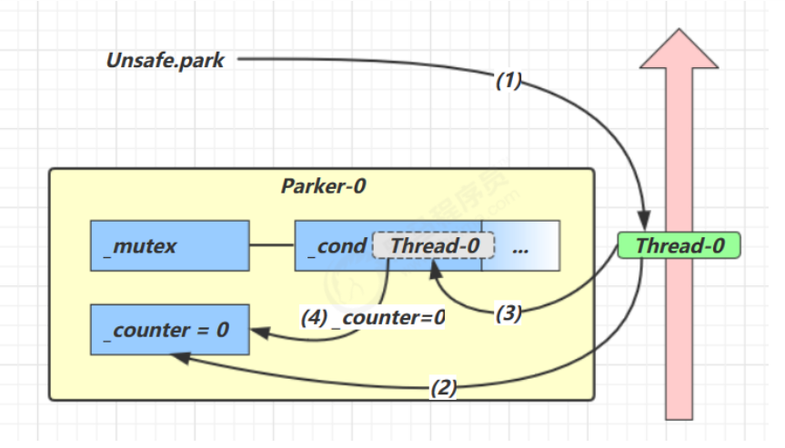
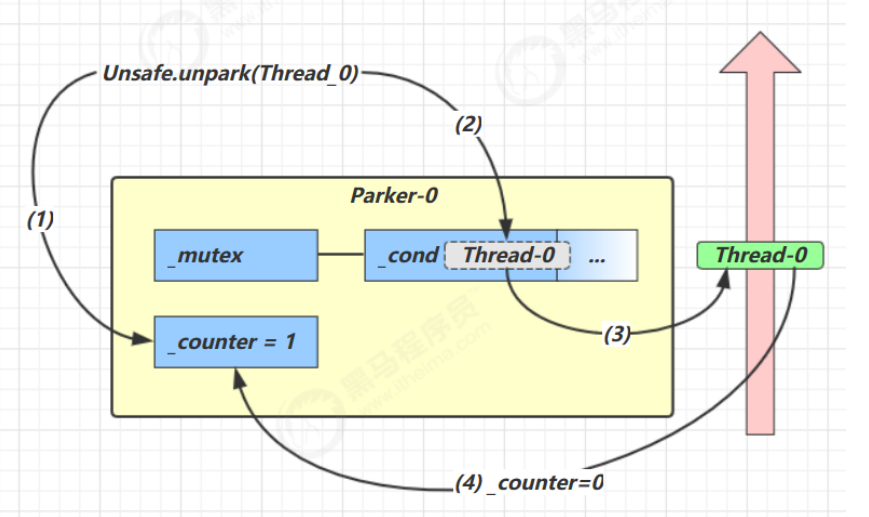
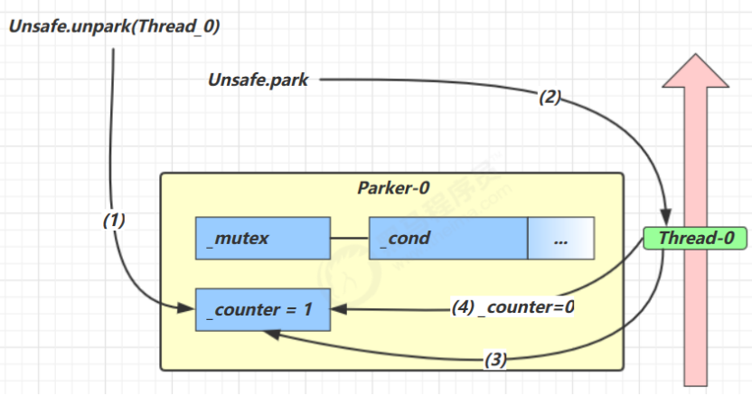

**<font style="color:#DF2A3F;">笔记来源：</font>**[**<font style="color:#DF2A3F;">黑马程序员深入学习Java并发编程，JUC并发编程全套教程</font>**](https://www.bilibili.com/video/BV16J411h7Rd/?spm_id_from=333.337.search-card.all.click&vd_source=e8046ccbdc793e09a75eb61fe8e84a30)

## 1 基本使用
它们是 LockSupport 类中的方法

```java
// 暂停当前线程
LockSupport.park(); 

// 恢复某个线程的运行
LockSupport.unpark(暂停线程对象)
```

****

**先 park 再 unpark**

```java
Thread t1 = new Thread(() -> {
    log.debug("start...");
    sleep(1);
    
    log.debug("park...");
    LockSupport.park();
    log.debug("resume...");
},"t1");
t1.start();

sleep(2);
log.debug("unpark...");
LockSupport.unpark(t1);
```

输出

```java
18:42:52.585 c.TestParkUnpark [t1] - start... 
18:42:53.589 c.TestParkUnpark [t1] - park... 
18:42:54.583 c.TestParkUnpark [main] - unpark... 
18:42:54.583 c.TestParkUnpark [t1] - resume...
```


**先 unpark 再 park**

```java
Thread t1 = new Thread(() -> {
    log.debug("start...");
    sleep(2);
    
    log.debug("park...");
    LockSupport.park();
    log.debug("resume...");
}, "t1");
t1.start();

sleep(1);
log.debug("unpark...");
LockSupport.unpark(t1);
```

输出

```java
18:43:50.765 c.TestParkUnpark [t1] - start... 
18:43:51.764 c.TestParkUnpark [main] - unpark... 
18:43:52.769 c.TestParkUnpark [t1] - park... 
18:43:52.769 c.TestParkUnpark [t1] - resume...
```

**<font style="color:#E8323C;">特点</font>**：与 Object 的 wait & notify 相比

+ wait 与 notify 和 notifyAll 必须配合 Object Monitor 一起使用，而 park，unpark 不必
+ park & unpark 是以线程为单位来【阻塞】和【唤醒】线程。而 notify 只能随机唤醒一个等待线程，notifyAll 是唤醒所有等待线程，就不那么【精确】
+ park & unpark 可以先 unpark，而 wait & notify 不能先 notify

## 2 park unpark原理
每个线程都有自己的一个 Parker 对象，由三部分组成 `_counter`， `_cond`和 `_mutex` 打个比喻

+ 线程就像一个旅人，Parker 就像他随身携带的背包，条件变量就好比背包中的帐篷。_counter 就好比背包中的备用干粮（0 为耗尽，1 为充足）
+ 调用park 就是要看需不需要停下来歇息 
    - 如果备用干粮耗尽，那么钻进帐篷歇息
    - 如果备用干粮充足，那么不需停留，继续前进
+ 调用 unpark，就好比令干粮充足 
    - 如果这时线程还在帐篷，就唤醒让他继续前进
    - 如果这时线程还在运行，那么下次他调用 park 时，仅是消耗掉备用干粮，不需停留继续前进 
        * 因为背包空间有限，多次调用 unpark 仅会补充一份备用干粮  



1. 当前线程调用 Unsafe.park() 方法
2. 检查 _counter ，本情况为 0，这时，获得 _mutex 互斥锁
3. 线程进入 _cond 条件变量阻塞
4. 设置 _counter = 0





1. 调用 Unsafe.unpark(Thread_0) 方法，设置 _counter 为 1
2. 唤醒 _cond 条件变量中的 Thread_0
3. Thread_0 恢复运行
4. 设置 _counter 为 0





1. 调用 Unsafe.unpark(Thread_0) 方法，设置 _counter 为 1
2. 当前线程调用 Unsafe.park() 方法
3. 检查 _counter ，本情况为 1，这时线程无需阻塞，继续运行
4. 设置 _counter 为 0

