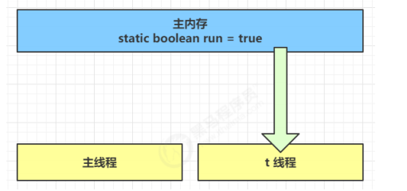
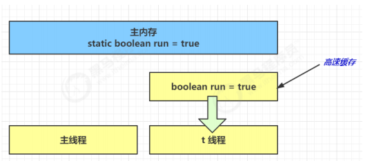
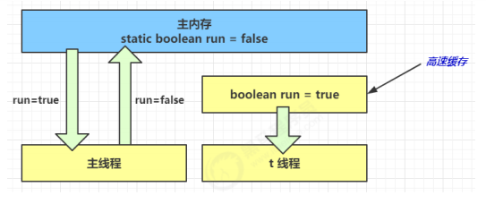
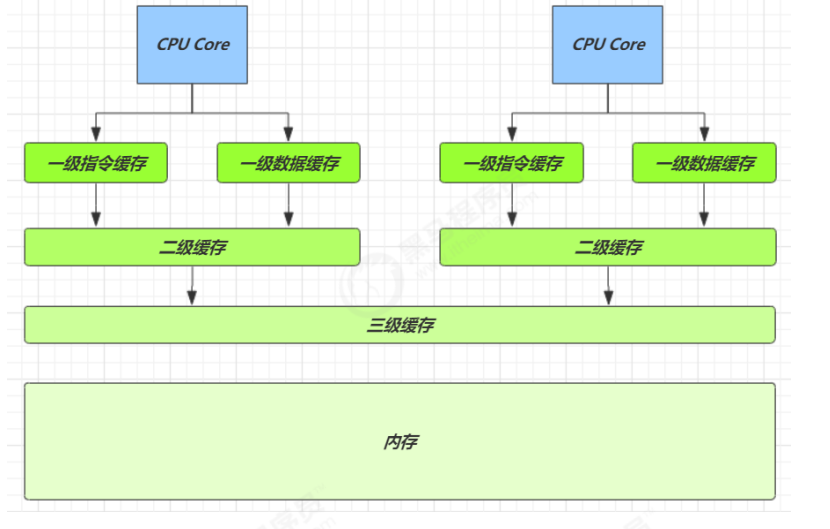
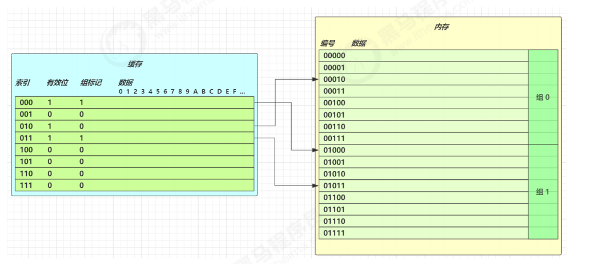
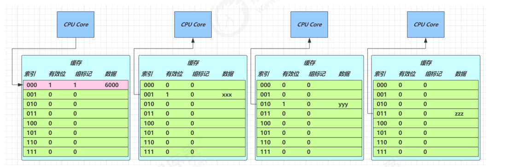
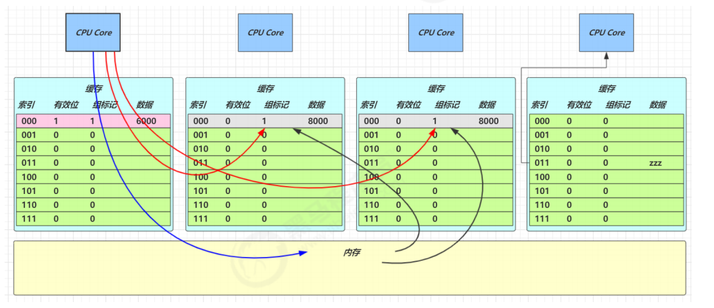

**<font style="color:#DF2A3F;">笔记来源：</font>**[**<font style="color:#DF2A3F;">黑马程序员深入学习Java并发编程，JUC并发编程全套教程</font>**](https://www.bilibili.com/video/BV16J411h7Rd/?spm_id_from=333.337.search-card.all.click&vd_source=e8046ccbdc793e09a75eb61fe8e84a30)


## 1 背景
退不出的循环：先来看一个现象，main 线程对 run 变量的修改对于 t 线程不可见，导致了 t 线程无法停止：

```java
static boolean run = true;
public static void main(String[] args) throws InterruptedException {
    Thread t = new Thread(()->{
        while(run){
            // ....
        }
    });

    t.start();
    sleep(1);
    run = false; // 线程t不会如预想的停下来
}
```

为什么呢？分析一下：

1. 初始状态， t 线程刚开始从主内存读取了 run 的值到工作内存。 



2. 因为 t 线程要频繁从主内存中读取 run 的值，JIT 编译器会将 run 的值缓存至自己工作内存中的高速缓存中，减少对主存中 run 的访问，提高效率 



3. 1 秒之后，main 线程修改了 run 的值，并同步至主存，而 t 是从自己工作内存中的高速缓存中读取这个变量的值，结果永远是旧值 



## 2 解决方法
**volatile**（易变关键字）：<font style="color:#01B2BC;">它可以用来修饰成员变量和静态成员变量</font><font style="color:#DF2A3F;">，他可以避免线程从自己的工作缓存中查找变量的值，必须到主存中获取它的值，线程操作 volatile 变量都是直接操作主存</font>

## 3 可见性vs原子性
前面例子体现的实际就是可见性，它保证的是在多个线程之间，一个线程对 volatile 变量的修改对另一个线程可见， 不能保证原子性，仅用在一个写线程，多个读线程的情况。上例从字节码理解是这样的：

```java
getstatic run // 线程 t 获取 run true 
getstatic run // 线程 t 获取 run true 
getstatic run // 线程 t 获取 run true 
getstatic run // 线程 t 获取 run true 
putstatic run // 线程 main 修改 run 为 false， 仅此一次
getstatic run // 线程 t 获取 run false
```

比较一下之前我们将线程安全时举的例子：两个线程一个`i++`，一个`i--` ，只能保证看到最新值，不能解决指令交错的情况：

```java
// 假设i的初始值为0 
getstatic i // 线程2-获取静态变量i的值 线程内i=0 
getstatic i // 线程1-获取静态变量i的值 线程内i=0 
iconst_1    // 线程1-准备常量1 
iadd        // 线程1-自增 线程内i=1 
putstatic i // 线程1-将修改后的值存入静态变量i 静态变量i=1 
iconst_1    // 线程2-准备常量1 
isub        // 线程2-自减 线程内i=-1 
putstatic i // 线程2-将修改后的值存入静态变量i 静态变量i=-1
```

**<font style="color:#E8323C;">注意：</font>**synchronized 语句块既可以保证代码块的原子性，也同时保证代码块内变量的可见性。但缺点是synchronized 是属于重量级操作，性能相对更低

如果在前面示例的死循环中加入`System.out.println()`会发现即使不加 volatile 修饰符，线程 t 也能正确看到对 run 变量的修改了，想一想为什么？

## 4 CPU缓存结构原理
### 4.1 CPU 缓存结构原理


查看 cpu 缓存

```bash
root@yihang01 ~ lscpu
Architecture:           x86_64
CPU op-mode(s):         32-bit, 64-bit
Byte Order:             Little Endian
CPU(s):                 1
On-line CPU(s) list:    0
Thread(s) per core:     1
Core(s) per socket:     1
Socket(s):              1
NUMA node(s):           1
Vendor ID:              GenuineIntel
CPU family:             6
Model:                  142
Model name:             Intel(R) Core(TM) i7-8565U CPU @ 1.80GHz
Stepping:               11
CPU MHz:                1992.002
BogoMIPS:               3984.00
Hypervisor vendor:      VMware
Virtualization type:    full
L1d cache:              32K
L1i cache:              32K
L2 cache:               256K
L3 cache:               8192K
NUMA node0 CPU(s):      0
```

速度比较

| 从 cpu 到 | 大约需要的时钟周期 |
| --- | --- |
| 寄存器 | 1 cycle |
| L1 | 3~4 cycle |
| L2 | 10~20 cycle |
| L3 | 40~45 cycle |
| 内存 | 120~240 cycle |


查看 cpu 缓存行

```bash
root@yihang01 ~ cat /sys/devices/system/cpu/cpu0/cache/index0/coherency_line_size
64
```

cpu 拿到的内存地址格式是这样的

```plain
[高位组标记][低位索引][偏移量]
```



### 4.2 CPU 缓存读
读取数据流程如下：

+ 根据低位，计算在缓存中的索引
+ 判断是否有效
    - 0 去内存读取新数据更新缓存行
    - 1 再对比高位组标记是否一致
        * 一致，根据偏移量返回缓存数据
        * 不一致，去内存读取新数据更新缓存行

### 4.3 CPU 缓存一致性
<font style="color:#E8323C;">MESI 协议</font>

1. E、S、M 状态的缓存行都可以满足 CPU 的读请求
2. E 状态的缓存行，有写请求，会将状态改为 M，这时并不触发向主存的写
3. E 状态的缓存行，必须监听该缓存行的读操作，如果有，要变为 S 状态



4. M 状态的缓存行，必须监听该缓存行的读操作，如果有，先将其它缓存（S 状态）中该缓存行变成 I 状态（即6的流程），写入主存，自己变为 S 状态
5. S 状态的缓存行，有写请求，走 4. 的流程
6. S 状态的缓存行，必须监听该缓存行的失效操作，如果有，自己变为 I 状态
7. I 状态的缓存行，有读请求，必须从主存读取



### 4.4 内存屏障
Memory Barrier（Memory Fence）

+ 可见性
    - 写屏障（sfence）保证在该屏障之前的，对共享变量的改动，都同步到主存当中
    - 而读屏障（lfence）保证在该屏障之后，对共享变量的读取，加载的是主存中最新数据
+ 有序性
    - 写屏障会确保指令重排序时，不会将写屏障之前的代码排在写屏障之后
    - 读屏障会确保指令重排序时，不会将读屏障之后的代码排在读屏障之前

## 5 模式之两阶段终止
Two Phase Termination  
在一个线程 T1 中如何“优雅”终止线程 T2?这里的【优雅】指的是给 T2 一个料理后事的机会。

### 5.1 错误思路
+ 使用线程对象的 stop() 方法停止线程 
    - stop 方法会真正杀死线程，如果这时线程锁住了共享资源，那么当它被杀死后就再也没有机会释放锁， 其它线程将永远无法获取锁
+ 使用 System.exit(int) 方法停止线程：目的仅是停止一个线程，但这种做法会让整个程序都停止

### 5.2 两阶段终止模式


**<font style="color:#E8323C;">利用 isInterrupted</font>**  
interrupt 可以打断正在执行的线程，无论这个线程是在 sleep，wait，还是正常运行

```java
class TPTInterrupt { 
    private Thread thread;
    public void start(){
        thread = new Thread(() -> {
        while(true) {
            Thread current = Thread.currentThread(); 
            if(current.isInterrupted()) {
                log.debug("料理后事");
                break; 
            }
            try {
                Thread.sleep(1000); 
                log.debug("将结果保存");
            } catch (InterruptedException e) { 
                current.interrupt();
            }
        // 执行监控操作 }
        },"监控线程");
        thread.start();
    }
    public void stop() { 
        thread.interrupt();
    } 
}
```


调用

```java
TPTInterrupt t = new TPTInterrupt(); 
t.start();
Thread.sleep(3500); 
log.debug("stop"); 
t.stop();
```

<font style="color:rgb(51,51,51);">结果 </font>

```java
11:49:42.915 c.TwoPhaseTermination [监控线程] - 将结果保存
11:49:43.919 c.TwoPhaseTermination [监控线程] - 将结果保存
11:49:44.919 c.TwoPhaseTermination [监控线程] - 将结果保存
11:49:45.413 c.TestTwoPhaseTermination [main] - stop 
11:49:45.413 c.TwoPhaseTermination [监控线程] - 料理后事
```

**<font style="color:#E8323C;">利用停止标记 </font>**

```java
// 停止标记用 volatile 是为了保证该变量在多个线程之间的可见性
// 我们的例子中，即主线程把它修改为 true 对 t1 线程可见
class TPTVolatile {
 	private Thread thread;
 	private volatile boolean stop = false;
 	public void start(){
 		thread = new Thread(() -> {
 			while(true) {
 				Thread current = Thread.currentThread();
 				if(stop) {
 					log.debug("料理后事");
 					break;
 				}
 				try {
 					Thread.sleep(1000);
 					log.debug("将结果保存");
 				} catch (InterruptedException e) {
            	}
    			// 执行监控操作
 			}
 		},"监控线程");
 		thread.start();
 	}
 	public void stop() {
 		stop = true;
 		thread.interrupt();
    }
}
```


调用

```java
TPTVolatile t = new TPTVolatile();
t.start();
Thread.sleep(3500);
log.debug("stop");
t.stop();
```

<font style="color:rgb(51,51,51);">结果 </font>

```java
11:54:52.003 c.TPTVolatile [监控线程] - 将结果保存 
11:54:53.006 c.TPTVolatile [监控线程] - 将结果保存 
11:54:54.007 c.TPTVolatile [监控线程] - 将结果保存 
11:54:54.502 c.TestTwoPhaseTermination [main] - stop 
11:54:54.502 c.TPTVolatile [监控线程] - 料理后事 
```

## 6 同步模式之Balking
### 6.1 定义
<font style="color:rgb(51,51,51);">Balking （犹豫）模式用在一个线程发现另一个线程或本线程已经做了某一件相同的事，那么本线程就无需再做 了，直接结束返回</font>

### 6.2 实现
<font style="color:rgb(51,51,51);">例如：</font>

```java
public class MonitorService {
 	// 用来表示是否已经有线程已经在执行启动了
 	private volatile boolean starting;
 	public void start() {
 		log.info("尝试启动监控线程...");
 		synchronized (this) {
 			if (starting) {
 				return;
 			}
 			starting = true;
 		}
 
 		// 真正启动监控线程...
 	}
}
```

<font style="color:rgb(51,51,51);">当前端页面多次点击按钮调用</font><font style="color:rgb(51,51,51);"> start </font><font style="color:rgb(51,51,51);">时 </font>

<font style="color:rgb(51,51,51);">输出</font>

```java
[http-nio-8080-exec-1] cn.itcast.monitor.service.MonitorService - 该监控线程已启动?(false)
[http-nio-8080-exec-1] cn.itcast.monitor.service.MonitorService - 监控线程已启动...
[http-nio-8080-exec-2] cn.itcast.monitor.service.MonitorService - 该监控线程已启动?(true)
[http-nio-8080-exec-3] cn.itcast.monitor.service.MonitorService - 该监控线程已启动?(true)
[http-nio-8080-exec-4] cn.itcast.monitor.service.MonitorService - 该监控线程已启动?(true)
```

<font style="color:rgb(51,51,51);">它还经常用来实现线程安全的单例</font>

```java
public final class Singleton {
 	private Singleton() {
 	}
 	private static Singleton INSTANCE = null;
 	public static synchronized Singleton getInstance() {
 		if (INSTANCE != null) {
 			return INSTANCE;
 		}
 
 		INSTANCE = new Singleton();
 		return INSTANCE;
 	}
}
```

<font style="color:rgb(51,51,51);">对比一下保护性暂停模式：保护性暂停模式用在一个线程等待另一个线程的执行结果，当条件不满足时线程等待。</font>

