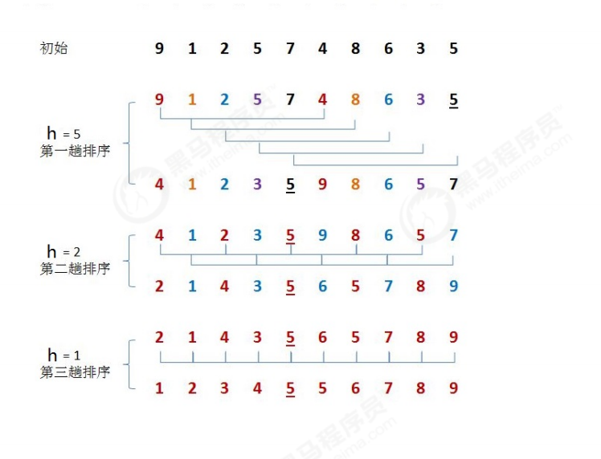
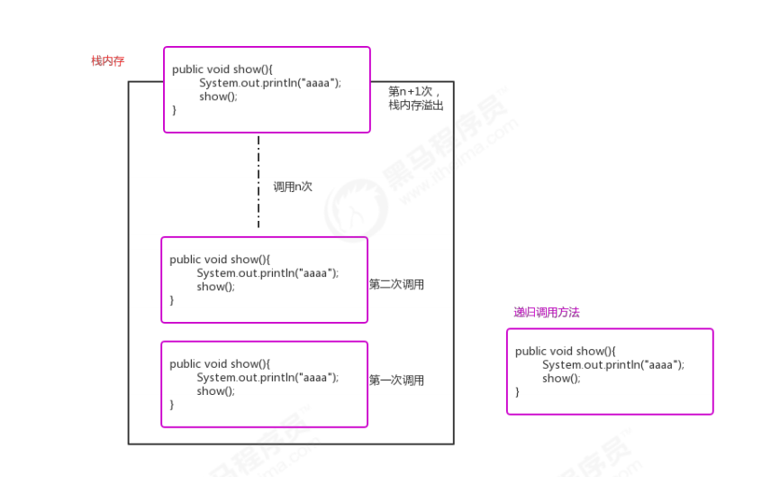
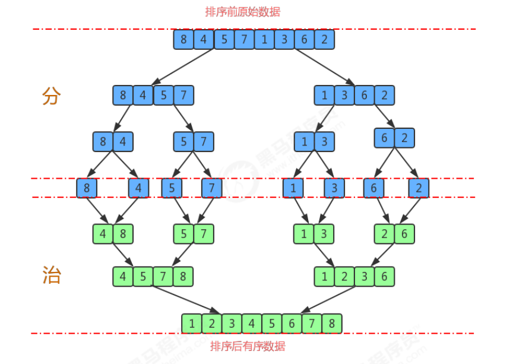
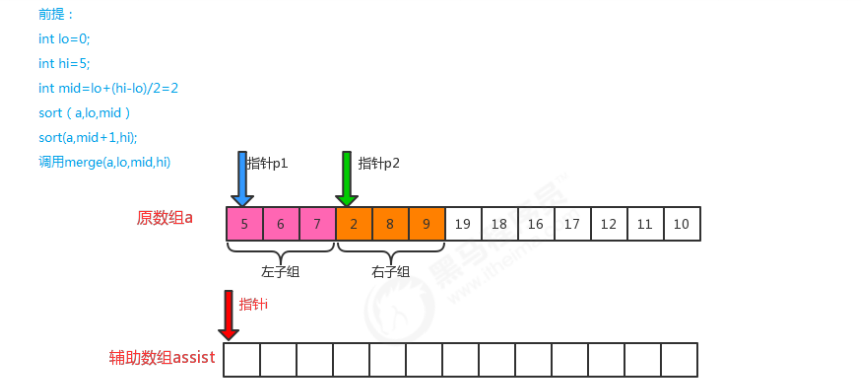
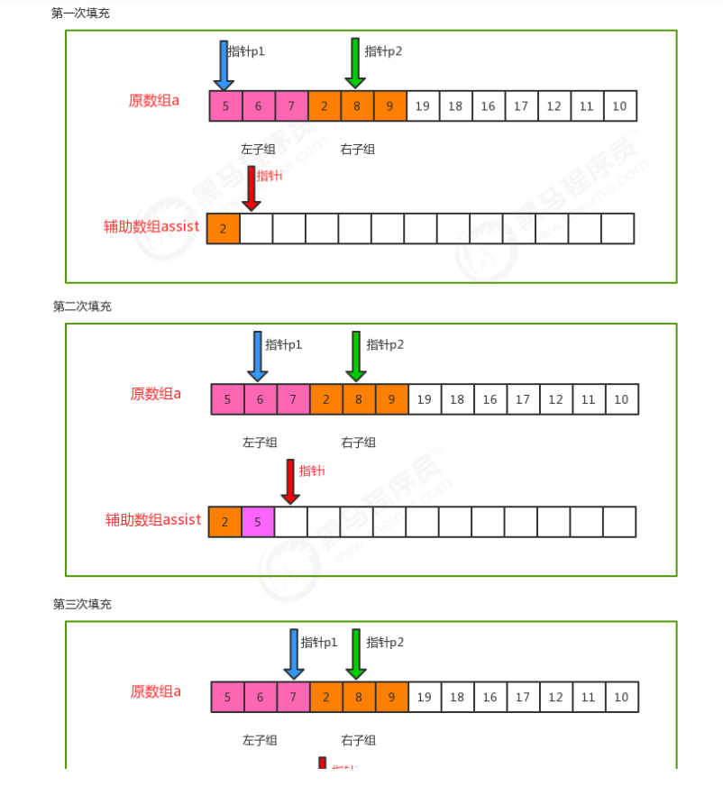

**<font style="color:#DF2A3F;">笔记来源：</font>**[**<font style="color:#DF2A3F;">黑马程序员Java数据结构与java算法全套教程，数据结构+算法教程全资料发布，包含154张java数据结构图</font>**](https://www.bilibili.com/video/BV1iJ411E7xW?p=2&vd_source=e8046ccbdc793e09a75eb61fe8e84a30)

  
之前我们学习过基础排序，包括冒泡排序，选择排序还有插入排序，并且对他们在最坏情况下的时间复杂度做了分析，发现都是O(N^2)，而平方阶通过我们之前学习算法分析我们知道，随着输入规模的增大，时间成本将急剧上  
升，所以这些基本排序方法不能处理更大规模的问题，接下来我们学习一些高级的排序算法，争取降低算法的时间复杂度最高阶次幂。

# 1 希尔排序
希尔排序是插入排序的一种，又称“缩小增量排序”，是插入排序算法的一种更高效的改进版本。  
  
前面学习插入排序的时候，我们会发现一个很不友好的事儿，如果已排序的分组元素为{2,5,7,9,10}，未排序的分组元素为{1,8}，那么下一个待插入元素为1，我们需要拿着1从后往前，依次和10,9,7,5,2进行交换位置，才能完成真  
正的插入，每次交换只能和相邻的元素交换位置。那如果我们要提高效率，直观的想法就是一次交换，能把1放到更前面的位置，比如一次交换就能把1插到2和5之间，这样一次交换1就向前走了5个位置，可以减少交换的次数，  
这样的需求如何实现呢？接下来我们来看看希尔排序的原理。

  
需求：

```java
排序前：{9,1,2,5,7,4,8,6,3,5}
排序后：{1,2,3,4,5,5,6,7,8,9}
```

排序原理：  
1.选定一个增长量h，按照增长量h作为数据分组的依据，对数据进行分组；  
2.对分好组的每一组数据完成插入排序；  
3.减小增长量，最小减为1，重复第二步操作。

  
增长量h的确定：增长量h的值每一固定的规则，我们这里采用以下规则：

```java
int h=1 
while(h<5){ 
    h=2h+1；//3,7 
}
//循环结束后我们就可以确定h的最大值； 
//h的减小规则为： h=h/2
```

希尔排序的API设计：

| 类名  | Shell |
| --- | --- |
| 构造方法 |  Shell()：创建Shell对象 |
| 成员方法 | 1.public static void sort(Comparable[] a)：对数组内的元素进行排序   2.private static boolean greater(Comparable v,Comparable w):判断v是否大于w   3.private static void exch(Comparable[] a,int i,int j)：交换a数组中，索引i和索引j处的值 |


希尔排序的代码实现：

```java
 //排序代码 
public class Shell { 
    // 对数组a中的元素进行排序 
    public static void sort(Comparable[] a){ 
        int N = a.length; 
        
        //确定增长量h的最大值 
        int h=1; 
        while(h<N/2){ 
            h=h*2+1; 
        }
        
        //当增长量h小于1，排序结束 
        while(h>=1){ 
            //找到待插入的元素 
            for (int i=h;i<N;i++){ 
                //a[i]就是待插入的元素 
                //把a[i]插入到a[i-h],a[i-2h],a[i-3h]...序列中 
                for (int j=i;j>=h;j-=h){ 
                    //a[j]就是待插入元素，依次和a[j-h],a[j-2h],a[j-3h]进行比较，如果a[j]小，那么 交换位置，如果不小于，a[j]大，则插入完成。 
                    if (greater(a[j-h],a[j])){ 
                        exch(a,j,j-h); 
                    }
                    else{
                        break; 
                    } 
                } 
            } 
        	h/=2; 
        } 
    }
    
    // 比较v元素是否大于w元素 
    private static boolean greater(Comparable v,Comparable w){ 
        return v.compareTo(w)>0; 
    }
    //数组元素i和j交换位置 
    private static void exch(Comparable[] a,int i,int j){ 
        Comparable t = a[i]; a[i]=a[j]; a[j]=t; 
    } 
}

//测试代码 
public class Test { 
    public static void main(String[] args) { 
        Integer[] a = {9,1,2,5,7,4,8,6,3,5} ; 
        Shell.sort(a); 
        System.out.println(Arrays.toString(a)); 
    } 
}

```

**希尔排序的时间复杂度分析**  
在希尔排序中，增长量h并没有固定的规则，有很多论文研究了各种不同的递增序列，但都无法证明某个序列是最好的，对于希尔排序的时间复杂度分析，已经超出了我们课程设计的范畴，所以在这里就不做分析了。  
我们可以使用事后分析法对希尔排序和插入排序做性能比较。  
在资料的测试数据文件夹下有一个reverse_shell_insertion.txt文件，里面存放的是从100000到1的逆向数据，我们可以根据这个批量数据完成测试。测试的思想：在执行排序前前记录一个时间，在排序完成后记录一个时间，两个时间的时间差就是排序的耗时。  
希尔排序和插入排序性能比较测试代码：

```java
public class SortCompare { 
    public static void main(String[] args) throws Exception{
        ArrayList list = new ArrayList<>(); 
        //读取reverse_arr.txt文件 
        BufferedReader reader = new BufferedReader(new InputStreamReader(new FileInputStream("reverse_shell_insertion.txt"))); 
        String line=null; 
        while((line=reader.readLine())!=null){ 
            //把每一个数字存入到集合中
        	list.add(Integer.valueOf(line)); 
        }
        reader.close(); 
        //把集合转换成数组 
        Integer[] arr = new Integer[list.size()]; 
        list.toArray(arr); 
        
        testInsertion(arr);//使用插入排序耗时：20859 
        // testShell(arr);//使用希尔排序耗时：31 
    }
    
    public static void testInsertion(Integer[] arr){ 
        //使用插入排序完成测试 
        long start = System.currentTimeMillis();
        Insertion.sort(arr); 
        long end= System.currentTimeMillis();
        System.out.println("使用插入排序耗时："+(end-start)); 
    }
    
    public static void testShell(Integer[] arr){ 
        //使用希尔排序完成测试 
        long start = System.currentTimeMillis(); 
        Shell.sort(arr); 
        long end = System.currentTimeMillis(); 
        System.out.println("使用希尔排序耗时："+(end-start)); 
    } 
}

public void show(){ 
    System.out.println("aaaa"); 
    show(); 
}
```

通过测试发现，在处理大批量数据时，希尔排序的性能确实高于插入排序。

# 2 归并排序
## 2.1 递归
正式学习归并排序之前，我们得先学习一下递归算法。

  
定义：定义方法时，在方法内部调用方法本身，称之为递归.  
作用：  
它通常把一个大型复杂的问题，层层转换为一个与原问题相似的，规模较小的问题来求解。递归策略只需要少量的程序就可以描述出解题过程所需要的多次重复计算，大大地减少了程序的代码量。  
注意事项：  
在递归中，不能无限制的调用自己，必须要有边界条件，能够让递归结束，因为每一次递归调用都会在栈内存开辟新的空间，重新执行方法，如果递归的层级太深，很容易造成栈内存溢出。

  
需求：  
请定义一个方法，使用递归完成求N的阶乘；  
代码实现：

```java
//分析： 
1!: 	1 
2!: 	2*1=2*1! 
3!: 	3*2*1=3*2! 
4!: 	4*3*2*1=4*3! 

... 
n!: 	n*(n-1)*(n-2)...*2*1=n*(n-1)! 
//所以，假设有一个方法factorial(n)用来求n的阶乘，那么n的阶乘还可以表示为n*factorial(n-1)
```

代码实现

```java
public class Test { 
    public static void main(String[] args) throws Exception { 
        int result = factorial(5); 
        System.out.println(result); 
    }
    
    public static int factorial(int n){ 
        if (n1==1){
            return 1; 
        }
        return n*factorial(n-1); 
    } 
} 
```

## 2.2 归并排序
归并排序是建立在归并操作上的一种有效的排序算法，该算法是采用分治法的一个非常典型的应用。将已有序的子序列合并，得到完全有序的序列；即先使每个子序列有序，再使子序列段间有序。若将两个有序表合并成一个有序表，称为二路归并。

  
需求：

```java
排序前：{8,4,5,7,1,3,6,2}
排序后：{1,2,3,4,5,6,7,8}
```

排序原理：  
1.尽可能的一组数据拆分成两个元素相等的子组，并对每一个子组继续拆分，直到拆分后的每个子组的元素个数是1为止。  
2.将相邻的两个子组进行合并成一个有序的大组；  
3.不断的重复步骤2，直到最终只有一个组为止。  


归并排序API设计：

| 类名 | Merge |
| --- | --- |
| <font style="background-color:#FFFFFF;">构造方法</font> | <font style="background-color:#FFFFFF;">Merge()：创建Merge对象</font> |
| <font style="background-color:#FFFFFF;">成员方法</font> | <font style="background-color:#FFFFFF;">1.public static void sort(Comparable[] a)：对数组内的元素进行排序   </font><font style="background-color:#FFFFFF;">2.private static void sort(Comparable[] a, int lo, int hi)：对数组a中从索引lo到索引hi之间的元素进行排序   </font><font style="background-color:#FFFFFF;">3.private static void merge(Comparable[] a, int lo, int mid, int hi):从索引lo到所以mid为一个子组，从索引mid+1到索    引   hi为另一个子组，把数组a中的这两个子组的数据合并成一个有序的大组（从索引lo到索引hi）   </font><font style="background-color:#FFFFFF;">4.private static boolean less(Comparable v,Comparable w):判断v是否小于w   </font><font style="background-color:#FFFFFF;">5.private static void exch(Comparable[] a,int i,int j)：交换a数组中，索引i和索引j处的值成员变量</font> |
| <font style="color:rgb(51,51,51);">成员变量</font> | <font style="background-color:#FFFFFF;">1.private static Comparable[] assist：完成归并操作需要的辅助数组</font> |


<font style="background-color:#FFFFFF;">归并原理：</font>






