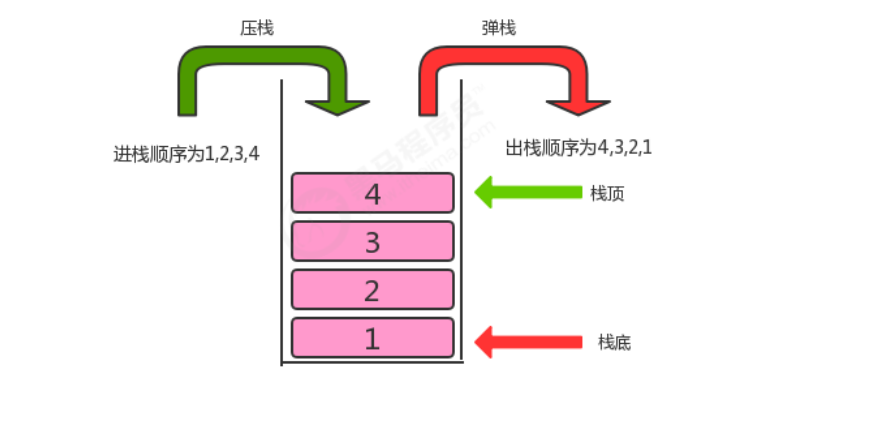

**<font style="color:#DF2A3F;">笔记来源：</font>**[**<font style="color:#DF2A3F;">黑马程序员Java数据结构与java算法全套教程，数据结构+算法教程全资料发布，包含154张java数据结构图</font>**](https://www.bilibili.com/video/BV1iJ411E7xW?p=2&vd_source=e8046ccbdc793e09a75eb61fe8e84a30)

# 198. <font style="color:rgb(20.000000%, 20.000000%, 20.000000%);">1 栈概述 </font>
## <font style="color:rgb(20.000000%, 20.000000%, 20.000000%);">1.1 生活中的栈 </font>
<font style="color:rgb(20.000000%, 20.000000%, 20.000000%);">存储货物或供旅客住宿的地方,可引申为仓库、中转站 。例如我们现在生活中的酒店，在古时候叫客栈，是供旅客 休息的地方，旅客可以进客栈休息，休息完毕后就离开客栈。 </font>

## <font style="background-color:rgb(100.000000%, 100.000000%, 100.000000%);"></font><font style="color:rgb(20.000000%, 20.000000%, 20.000000%);background-color:rgb(100.000000%, 100.000000%, 100.000000%);">1.2 计算机中的栈 </font>
<font style="color:rgb(20.000000%, 20.000000%, 20.000000%);background-color:rgb(100.000000%, 100.000000%, 100.000000%);">我们把生活中的栈的概念引入到计算机中，就是供数据休息的地方，它是一种数据结构，数据既可以进入到栈中，又可以从栈中出去。 </font>

<font style="color:rgb(20.000000%, 20.000000%, 20.000000%);">栈是一种基于先进后出(FILO)的数据结构，是一种只能在一端进行插入和删除操作的特殊线性表。它按照先进后出 的原则存储数据，先进入的数据被压入栈底，最后的数据在栈顶，需要读数据的时候从栈顶开始弹出数据(最后一 个数据被第一个读出来)。 </font>

<font style="color:rgb(20.000000%, 20.000000%, 20.000000%);background-color:rgb(100.000000%, 100.000000%, 100.000000%);">我们称数据进入到栈的动作为</font><font style="color:#E8323C;background-color:rgb(100.000000%, 100.000000%, 100.000000%);">压栈</font><font style="color:rgb(20.000000%, 20.000000%, 20.000000%);background-color:rgb(100.000000%, 100.000000%, 100.000000%);">，数据从栈中出去的动作为</font><font style="color:#E8323C;background-color:rgb(100.000000%, 100.000000%, 100.000000%);">弹栈</font><font style="color:rgb(20.000000%, 20.000000%, 20.000000%);background-color:rgb(100.000000%, 100.000000%, 100.000000%);">。 </font>

<font style="color:rgb(20.000000%, 20.000000%, 20.000000%);"> </font><font style="color:rgb(20.000000%, 20.000000%, 20.000000%);">						 							 						</font>

# 199. <font style="color:rgb(20.000000%, 20.000000%, 20.000000%);">2. 栈的实现 </font>
## <font style="color:rgb(20.000000%, 20.000000%, 20.000000%);">2.1 栈API设计 </font>
| <font style="color:rgb(20.000000%, 20.000000%, 20.000000%);">类名 </font> | <font style="color:rgb(20.000000%, 20.000000%, 20.000000%);">Stack</font> |
| --- | --- |
| <font style="color:rgb(20.000000%, 20.000000%, 20.000000%);">构造方法 </font> | <font style="color:rgb(20.000000%, 20.000000%, 20.000000%);">Stack():创建Stack对象 	</font>		 |
| <br/><font style="color:rgb(20.000000%, 20.000000%, 20.000000%);">成员方法 </font> | <font style="color:rgb(20.000000%, 20.000000%, 20.000000%);background-color:rgb(100.000000%, 100.000000%, 100.000000%);">1.public boolean isEmpty():判断栈是否为空，是返回true，否返回false</font><br/><font style="color:rgb(20.000000%, 20.000000%, 20.000000%);background-color:rgb(100.000000%, 100.000000%, 100.000000%);">2.public int size():获取栈中元素的个数</font><br/><font style="color:rgb(20.000000%, 20.000000%, 20.000000%);background-color:rgb(100.000000%, 100.000000%, 100.000000%);">3.public T pop():弹出栈顶元素</font><br/><font style="color:rgb(20.000000%, 20.000000%, 20.000000%);background-color:rgb(100.000000%, 100.000000%, 100.000000%);">4.public void push(T t):向栈中压入元素t </font> |
| <font style="color:rgb(20.000000%, 20.000000%, 20.000000%);">成员变量 </font> | <font style="color:rgb(20.000000%, 20.000000%, 20.000000%);">1.private Node head:记录首结点 </font><br/><font style="color:rgb(20.000000%, 20.000000%, 20.000000%);">2.private int N:当前栈的元素个数  </font> |


## <font style="color:rgb(20.000000%, 20.000000%, 20.000000%);">2.2 栈代码实现  					</font>
```java
//栈代码
import java.util.Iterator; 
public class Stack<T> implements Iterable<T>{ 
	//记录首结点 
	private Node head; 
	
	//栈中元素的个数 
	private int N; 
	
	public Stack() {
		head = new Node(null,null); 
		N=0; 
	} 
	//判断当前栈中元素个数是否为0 
	public boolean isEmpty(){ 
		return N==0; 
	} 
	
	//把t元素压入栈
	public void push(T t){ 
		Node oldNext = head.next;
		Node node = new Node(t, oldNext); 
		head.next = node;
		//个数+1
		N++; 
	} 
	//弹出栈顶元素 
	public T pop(){ 
		Node oldNext = head.next; 
		if (oldNext==null){ 
			return null; 
		} 
		//删除首个元素
		head.next = head.next.next; 
		//个数-1
		N--;
		return oldNext.item; 
	} 
	//获取栈中元素的个数 
	public int size(){ 
		return N; 
	} 

	@Override 
	public Iterator<T> iterator() { 
		return new SIterator(); 
	} 
	
	private class SIterator implements Iterator<T>{ 
		private Node n = head;

		@Override
		public boolean hasNext() { 
			return n.next!=null; 
		} 
		
		@Override 
		public T next() {
			Node node = n.next; 
			n = n.next;
			return node.item; 
		}	 
} 

	
	private class Node{ public T item; 
		public Node next; 
		public Node(T item, Node next) { 
			this.item = item;
			this.next = next; 
		} 
	} 
} 
//测试代码
public class Test { 
	public static void main(String[] args) throws Exception { 
		Stack<String> stack = new Stack<>();
		stack.push("a"); 
 		stack.push("b"); 
		stack.push("c"); 
		stack.push("d");
		for (String str : stack) { 
			System.out.print(str+" "); 
		} 
		System.out.println("-----------------------------"); 
		String result = stack.pop(); 
		System.out.println("弹出了元素:"+result); 
		System.out.println(stack.size()); 
	} 
} 
```

<font style="color:rgb(20.000000%, 20.000000%, 20.000000%);"> </font>

# 200. <font style="color:rgb(20.000000%, 20.000000%, 20.000000%);">3 案例</font>
## <font style="color:rgb(20.000000%, 20.000000%, 20.000000%);">3.1 括号匹配问题 </font>
<font style="color:rgb(20.000000%, 20.000000%, 20.000000%);">问题描述: </font>

```java
给定一个字符串，里边可能包含"()"小括号和其他字符，请编写程序检查该字符串的中的小括号是否成对出现。
	
例如:
	
"(上海)(长安)":正确匹配 
"上海((长安))":正确匹配 
"上海(长安(北京)(深圳)南京)":正确匹配 
"上海(长安))":错误匹配 
"((上海)长安":错误匹配 
```

<font style="color:rgb(20.000000%, 20.000000%, 20.000000%);">示例代码: </font>

```java
public class BracketsMatch {
	public static void main(String[] args) { 
		String str = "(上海(长安)())";
		boolean match = isMatch(str); 
		System.out.println(str+"中的括号是否匹配:"+match); 
	} 
	
	/**
	* 判断str中的括号是否匹配
	* @param str 括号组成的字符串
	* @return 如果匹配，返回true，如果不匹配，返回false 
	*/ 
	public static boolean isMatch(String str){ 
		return false; 
	} 
} 
```

 <font style="color:rgb(20.000000%, 20.000000%, 20.000000%);">请完善 isMath方法。 分析: </font>	

<font style="background-color:rgb(100.000000%, 100.000000%, 100.000000%);">			 						</font>

<font style="color:rgb(20.000000%, 20.000000%, 20.000000%);background-color:rgb(100.000000%, 100.000000%, 100.000000%);">代码实现: </font>

```java
public class BracketsMatch {
	public static void main(String[] args) { 
		String str = "(fdafds(fafds)())";
		boolean match = isMatch(str);
		System.out.println(str + "中的括号是否匹配:" + match); 
	} 

	/**
	* 判断str中的括号是否匹配
	* @param str 括号组成的字符串
	* @return 如果匹配，返回true，如果不匹配，返回false 
	*/ 
	public static boolean isMatch(String str) { 
		//1.创建一个栈用来存储左括号 
		Stack<String> chars = new Stack<>(); 
		//2.从左往右遍历字符串，拿到每一个字符 
		for (int i = 0; i < str.length(); i++) {
			String currChar = str.charAt(i) + ""; 
			//3.判断该字符是不是左括号，如果是，放入栈中存储 
			if (currChar.equals("(")) { 
				chars.push(currChar);
			} else if (currChar.equals(")")) {//4.判断该字符是不是右括号，如果不是，继续下一次循环
				//5.如果该字符是右括号，则从栈中弹出一个元素t;
				String t = chars.pop(); 
				//6.判断元素t是否为null，如果不是，则证明有对应的左括号，如果不是，则证明没有对应的左括号
				if (t == null) { 
					return false; 
				} 
			} 
		} 
		//7.循环结束后，判断栈中还有没有剩余的左括号，如果有，则不匹配，如果没有，则匹配 
		if (chars.size() == 0) { 
			return true;
		} else { 
			return false; 
		} 
	} 
} 
 															 																	 										 															
```

## <font style="color:rgb(20.000000%, 20.000000%, 20.000000%);background-color:rgb(100.000000%, 100.000000%, 100.000000%);">3.2 逆波兰表达式求值问题 </font>
<font style="background-color:rgb(100.000000%, 100.000000%, 100.000000%);"></font><font style="color:rgb(20.000000%, 20.000000%, 20.000000%);background-color:rgb(100.000000%, 100.000000%, 100.000000%);">逆波兰表达式求值问题是我们计算机中经常遇到的一类问题，要研究明白这个问题，首先我们得搞清楚什么是逆波 兰表达式?要搞清楚逆波兰表达式，我们得从中缀表达式说起。 </font>

<font style="background-color:rgb(100.000000%, 100.000000%, 100.000000%);"> </font>

**<font style="color:#E8323C;background-color:rgb(100.000000%, 100.000000%, 100.000000%);">中缀表达式: </font>**

<font style="color:rgb(20.000000%, 20.000000%, 20.000000%);background-color:rgb(100.000000%, 100.000000%, 100.000000%);">中缀表达式就是我们平常生活中使用的表达式，例如:</font><font style="color:rgb(20.000000%, 20.000000%, 20.000000%);background-color:rgb(100.000000%, 100.000000%, 100.000000%);">1+3*2,2-(1+3)</font><font style="color:rgb(20.000000%, 20.000000%, 20.000000%);background-color:rgb(100.000000%, 100.000000%, 100.000000%);">等等，中缀表达式的特点是:二元运算符总 是置于两个操作数中间。 </font>

<font style="color:rgb(20.000000%, 20.000000%, 20.000000%);background-color:rgb(100.000000%, 100.000000%, 100.000000%);"></font>

<font style="color:rgb(20.000000%, 20.000000%, 20.000000%);background-color:rgb(100.000000%, 100.000000%, 100.000000%);">中缀表达式是人们最喜欢的表达式方式，因为简单，易懂。但是对于计算机来说就不是这样了，因为中缀表达式的 运算顺序不具有规律性。不同的运算符具有不同的优先级，如果计算机执行中缀表达式，需要解析表达式语义，做 大量的优先级相关操作。 </font>

<font style="color:rgb(20.000000%, 20.000000%, 20.000000%);background-color:rgb(100.000000%, 100.000000%, 100.000000%);"></font>

**<font style="color:#E8323C;background-color:rgb(100.000000%, 100.000000%, 100.000000%);">逆波兰表达式(后缀表达式):</font>**<font style="color:rgb(20.000000%, 20.000000%, 20.000000%);background-color:rgb(100.000000%, 100.000000%, 100.000000%);">  
</font><font style="color:rgb(20.000000%, 20.000000%, 20.000000%);background-color:rgb(100.000000%, 100.000000%, 100.000000%);">逆波兰表达式是波兰逻辑学家J・卢卡西维兹(J・ Lukasewicz)于1929年首先提出的一种表达式的表示方法，后缀表达式的特点:运算符总是放在跟它相关的操作数之后。 </font>

| <font style="color:rgb(20.000000%, 20.000000%, 20.000000%);">中缀表达式 </font> | <font style="color:rgb(20.000000%, 20.000000%, 20.000000%);">逆波兰表达式 </font> |
| --- | --- |
| <font style="color:rgb(20.000000%, 20.000000%, 20.000000%);background-color:rgb(100.000000%, 100.000000%, 100.000000%);">a+b </font> | <font style="color:rgb(20.000000%, 20.000000%, 20.000000%);background-color:rgb(100.000000%, 100.000000%, 100.000000%);">ab+ </font> |
| <font style="color:rgb(20.000000%, 20.000000%, 20.000000%);background-color:rgb(97.300000%, 97.300000%, 97.300000%);">a+(b-c) </font> | <font style="color:rgb(20.000000%, 20.000000%, 20.000000%);background-color:rgb(97.300000%, 97.300000%, 97.300000%);">abc-+ </font> |
| <font style="color:rgb(20.000000%, 20.000000%, 20.000000%);background-color:rgb(100.000000%, 100.000000%, 100.000000%);">a+(b-c)*d </font> | <font style="color:rgb(20.000000%, 20.000000%, 20.000000%);background-color:rgb(100.000000%, 100.000000%, 100.000000%);">abc-d*+ </font> |
| <font style="color:rgb(20.000000%, 20.000000%, 20.000000%);background-color:rgb(97.300000%, 97.300000%, 97.300000%);">a*(b-c)+d </font> | <font style="color:rgb(20.000000%, 20.000000%, 20.000000%);background-color:rgb(97.300000%, 97.300000%, 97.300000%);">abc-*d+ </font> |


<font style="color:rgb(20.000000%, 20.000000%, 20.000000%);background-color:rgb(100.000000%, 100.000000%, 100.000000%);">需求: </font>

<font style="color:rgb(20.000000%, 20.000000%, 20.000000%);background-color:rgb(100.000000%, 100.000000%, 100.000000%);">给定一个只包含加减乘除四种运算的逆波兰表达式的数组表示方式，求出该逆波兰表达式的结果。</font>

```java
										 										 										 										 										 										 									
public class ReversePolishNotation {
	public static void main(String[] args) { 
		//中缀表达式3*(17-15)+18/6的逆波兰表达式如下
		String[] notation = {"3", "17", "15", "-", "*","18", "6","/","+"}; 
		int result = caculate(notation); 
		System.out.println("逆波兰表达式的结果为:"+result); 
	} 
	/**
	* @param notaion 逆波兰表达式的数组表示方式 * @return 逆波兰表达式的计算结果
	*/ 
	public static int caculate(String[] notaion){ 
		return -1; 
	}	 
} 
 							
```

<font style="color:rgb(20.000000%, 20.000000%, 20.000000%);background-color:rgb(100.000000%, 100.000000%, 100.000000%);">完善</font><font style="color:rgb(20.000000%, 20.000000%, 20.000000%);background-color:rgb(100.000000%, 100.000000%, 100.000000%);">caculate</font><font style="color:rgb(20.000000%, 20.000000%, 20.000000%);background-color:rgb(100.000000%, 100.000000%, 100.000000%);">方法，计算出逆波兰表达式的结果。 </font>

<font style="color:rgb(20.000000%, 20.000000%, 20.000000%);background-color:rgb(100.000000%, 100.000000%, 100.000000%);">分析: </font>

```java
1.创建一个栈对象oprands存储操作数 
2.从左往右遍历逆波兰表达式，得到每一个字符串 
3.判断该字符串是不是运算符，如果不是，把该该操作数压入oprands栈中 
4.如果是运算符，则从oprands栈中弹出两个操作数o1,o2 
5.使用该运算符计算o1和o2，得到结果result 
6.把该结果压入oprands栈中 
7.遍历结束后，拿出栈中最终的结果返回 
```


<font style="background-color:rgb(100.000000%, 100.000000%, 100.000000%);">				 						</font>

<font style="color:rgb(20.000000%, 20.000000%, 20.000000%);background-color:rgb(100.000000%, 100.000000%, 100.000000%);">代码实现: </font>

```java
public class ReversePolishNotation {
	
	public static void main(String[] args) { 
		//中缀表达式3*(17-15)+18/6的逆波兰表达式如下
		String[] notation = {"3", "17", "15", "-", "*", "18", "6", "/", "+"}; 
		int result = caculate(notation); 
		System.out.println("逆波兰表达式的结果为:" + result); 
	} 
	
	/**
	* @param notaion 逆波兰表达式的数组表示方式 * @return 逆波兰表达式的计算结果
	*/ 
	public static int caculate(String[] notaion) { 
		//1.创建一个栈对象oprands存储操作数 
		Stack<Integer> oprands = new Stack<>(); 
		
		//2.从左往右遍历逆波兰表达式，得到每一个字符串 
		for (int i = 0; i < notaion.length; i++) { 
			String curr = notaion[i]; 
			//3.判断该字符串是不是运算符，如果不是，把该该操作数压入oprands栈中 
			Integer o1;
			Integer o2;
			Integer result;
			switch (curr) { 
				case "+": 
					//4.如果是运算符，则从oprands栈中弹出两个操作数o1,o2 
					o1 = oprands.pop();
					o2 = oprands.pop(); 
					//5.使用该运算符计算o1和o2，得到结果result
					result = o2 + o1;
					//6.把该结果压入oprands栈中
					oprands.push(result);
					break; 
				case "-": 
					//4.如果是运算符，则从oprands栈中弹出两个操作数o1,o2 
					o1 = oprands.pop();
					o2 = oprands.pop(); 
					//5.使用该运算符计算o1和o2，得到结果result
					result = o2 - o1;
					//6.把该结果压入oprands栈中
					oprands.push(result);
					break; 
				case "*": 
					//4.如果是运算符，则从oprands栈中弹出两个操作数o1,o2 
					o1 = oprands.pop();
					o2 = oprands.pop(); 
					//5.使用该运算符计算o1和o2，得到结果result
					result = o2 * o1;
					//6.把该结果压入oprands栈中
					oprands.push(result);
					break; 
				case "/": 
					//4.如果是运算符，则从oprands栈中弹出两个操作数o1,o2 
					o1 = oprands.pop(); 
					o2 = oprands.pop(); 
					//5.使用该运算符计算o1和o2，得到结果result 
					result = o2 / o1; 
					//6.把该结果压入oprands栈中 
					oprands.push(result);
					break; 
				default: 
					oprands.push(Integer.parseInt(curr)); 
					break; 
			} 
		} 
		//7.遍历结束后，拿出栈中最终的结果返回 
		Integer result = oprands.pop(); 
		return result; 
	} 
} 
```


