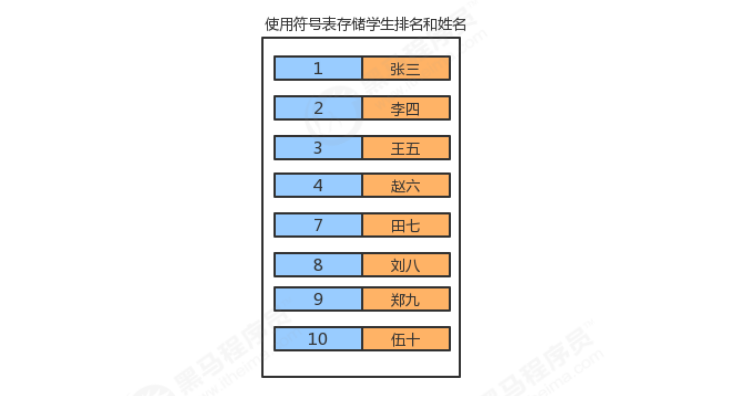

**<font style="color:#DF2A3F;">笔记来源：</font>**[**<font style="color:#DF2A3F;">黑马程序员Java数据结构与java算法全套教程，数据结构+算法教程全资料发布，包含154张java数据结构图</font>**](https://www.bilibili.com/video/BV1iJ411E7xW?p=2&vd_source=e8046ccbdc793e09a75eb61fe8e84a30)

<font style="color:rgb(51,51,51);"></font>

<font style="color:rgb(51,51,51);">符号表最主要的目的就是将一个键和一个值联系起来，符号表能够将存储的数据元素是一个键和一个值共同组成的 键值对数据，我们可以根据键来查找对应的值。 </font>



<font style="color:rgb(51,51,51);">符号表中，键具有唯一性。 </font><font style="color:rgb(51,51,51);"></font>

<font style="color:rgb(51,51,51);">符号表在实际生活中的使用场景是非常广泛的，见下表： </font>

| <font style="color:rgb(51,51,51);">应用 </font> | <font style="color:rgb(51,51,51);">查找目的 </font> | <font style="color:rgb(51,51,51);">键 </font> | <font style="color:rgb(51,51,51);">值 </font> |
| --- | --- | --- | --- |
| <font style="color:rgb(51,51,51);">字典 </font> | <font style="color:rgb(51,51,51);">找出单词的释义 </font> | <font style="color:rgb(51,51,51);">单词 </font> | <font style="color:rgb(51,51,51);">释义 </font> |
| <font style="color:rgb(51,51,51);">图书索引 </font> | <font style="color:rgb(51,51,51);">找出某个术语相关的页码 </font> | <font style="color:rgb(51,51,51);">术语 </font> | <font style="color:rgb(51,51,51);">一串页码 </font> |
| <font style="color:rgb(51,51,51);">网络搜索 </font> | <font style="color:rgb(51,51,51);">找出某个关键字对应的网页 </font> | <font style="color:rgb(51,51,51);">关键字</font> | <font style="color:rgb(51,51,51);">网页名称</font> |


# 201. <font style="color:rgb(51,51,51);">1 符号表API设计 </font>
**<font style="color:rgb(51,51,51);">结点类： </font>**

| <font style="color:rgb(51,51,51);">类名 </font> | <font style="color:rgb(51,51,51);">Node<Key,Value> </font> |
| --- | --- |
| <font style="color:rgb(51,51,51);">构造方法 </font> | <font style="color:rgb(51,51,51);">Node(Key key,Value value,Node next)：创建Node对象 </font> |
| <font style="color:rgb(51,51,51);">成员变量 </font> | <font style="color:rgb(51,51,51);">1.public Key key:存储键 </font><br/><font style="color:rgb(51,51,51);">2.public Value value:</font><font style="color:rgb(51,51,51);">存储值 </font><br/><font style="color:rgb(51,51,51);">3.public Node next:存储下一个结点</font> |


**<font style="color:rgb(51,51,51);">符号表：</font>**

| **<font style="color:rgb(51,51,51);">类名 </font>** | **<font style="color:rgb(51,51,51);">SymbolTable<Key,Value> </font>** |
| --- | --- |
| <font style="color:rgb(51,51,51);">构造方法 </font> | <font style="color:rgb(51,51,51);">SymbolTable()：创建SymbolTable对象 </font> |
| <font style="color:rgb(51,51,51);">成员方法 </font> | <font style="color:rgb(51,51,51);">1.public Value get(Key key)：根据键key，找对应的值 </font><br/><font style="color:rgb(51,51,51);">2.public void put(Key key,Value val):</font><font style="color:rgb(51,51,51);">向符号表中插入一个键值对 </font><br/><font style="color:rgb(51,51,51);">3.public void delete(Key key):</font><font style="color:rgb(51,51,51);">删除键为</font><font style="color:rgb(51,51,51);">key</font><font style="color:rgb(51,51,51);">的键值对 </font><br/><font style="color:rgb(51,51,51);">4.public int size()：获取符号表的大小 </font> |
| <font style="color:rgb(51,51,51);">成员变量 </font> | <font style="color:rgb(51,51,51);">1.private Node head:记录首结点 </font><br/><font style="color:rgb(51,51,51);">2.private int N:记录符号表中键值对的个数 </font> |


# 202. <font style="color:rgb(51,51,51);">2 符号表实现 </font>
```java
//符号表 
public class SymbolTable<Key,Value> { 
	//记录首结点 
	private Node head; 
	//记录符号表中元素的个数 
	private int N; 
    
	public SymbolTable() { 
		head = new Node(null,null,null); 
		N=0; 
	}
    
	//获取符号表中键值对的个数 
	public int size(){ 
		return N; 
	}
    
	//往符号表中插入键值对 
	public void put(Key key,Value value){ 
		//先从符号表中查找键为key的键值对 
		Node n = head; 
		while(n.next!=null){ 
			n = n.next; 
			if (n.key.equals(key)){ 
				n.value=value; 
				return; 
			} 
		}
        
		//符号表中没有键为key的键值对 
		Node oldFirst = head.next; 
		Node newFirst = new Node(key,value,oldFirst); 
		head.next = newFirst; 
        //个数+1
    	N++; 
	}

    //删除符号表中键为key的键值对 
	public void delete(Key key){ 
		Node n = head; 
		while(n.next!=null){ 
			if (n.next.key.equals(key)){ 
				n.next = n.next.next; 
				N--; 
				return; 
			}
			n = n.next; 
		} 
	}

    //从符号表中获取key对应的值 
	public Value get(Key key){ 
		Node n = head; 
		while(n.next!=null){ 
			n = n.next; 
			if (n.key.equals(key)){ 
				return n.value; 
			} 
		}
		return null; 
	}

    private class Node{ 
		//键
		public Key key; 
		//值
		public Value value; 
		//下一个结点 
		public Node next; 
		public Node(Key key, Value value, Node next) { 
			this.key = key; 
			this.value = value; 
			this.next = next; 
		} 
	} 
}

//测试类 
public class Test { 
	public static void main(String[] args) throws Exception { 
		SymbolTable<Integer, String> st = new SymbolTable<>(); 
		st.put(1, "张三"); 
		st.put(3, "李四"); 
		st.put(5, "王五"); 
		System.out.println(st.size()); 
		st.put(1,"老三"); 
    	System.out.println(st.get(1)); 
		System.out.println(st.size()); 
		st.delete(1); 
		System.out.println(st.size()); 
	} 
}
```

# 203. <font style="color:rgb(51,51,51);">3 有序符号表 </font>
<font style="color:rgb(51,51,51);">刚才实现的符号表，我们可以称之为无序符号表，因为在插入的时候，并没有考虑键值对的顺序，而在实际生活 中，有时候我们需要根据键的大小进行排序，插入数据时要考虑顺序，那么接下来我们就实现一下有序符号表。 </font>

```java
//有序符号表 
public class OrderSymbolTable<Key extends Comparable<Key>,Value> { 
	//记录首结点 
	private Node head; 
	
    //记录符号表中元素的个数 
	private int N; 

    public OrderSymbolTable() { 
		head = new Node(null,null,null); 
		N=0; 
	}

    //获取符号表中键值对的个数 
	public int size(){ 
		return N; 
	}

    //往符号表中插入键值对 
	public void put(Key key,Value value){ 
		//记录当前结点 
		Node curr = head.next; 
		//记录上一个结点 
		Node pre = head; 
        
		//1.如果key大于当前结点的key，则一直寻找下一个结点 
		while(curr!=null && key.compareTo(curr.key)>0){ 
			pre = curr; 
			curr = curr.next; 
		}

        //2.如果当前结点curr的key和将要插入的key一样，则替换 
		if (curr!=null && curr.key.compareTo(key)==0){ 
			curr.value=value; 
			return; 
		}

        //3.没有找到相同的key，把新结点插入到curr之前 
		Node newNode = new Node(key, value, curr); 
		pre.next = newNode; 
	}

    //删除符号表中键为key的键值对 
	public void delete(Key key){ 
		Node n = head; 
		while(n.next!=null){ 
			if (n.next.key.equals(key)){ 
				n.next = n.next.next; 
				N--; 
				return; 
			}
			n = n.next; 
		} 
	}

    //从符号表中获取key对应的值 
	public Value get(Key key){ 
		Node n = head; 
		while(n.next!=null){ 
			n = n.next; 
			if (n.key.equals(key)){ 
				return n.value; 
			} 
		}
		return null; 
	}

    private class Node{ 
		//键
		public Key key; 
		//值
		public Value value; 
		//下一个结点 
		public Node next; 
        
		public Node(Key key, Value value, Node next) { 
			this.key = key; 
			this.value = value; 
			this.next = next; 
		} 
	} 
}

//测试代码 
public class Test { 
	public static void main(String[] args) throws Exception { 
    	OrderSymbolTable<Integer, String> bt = new OrderSymbolTable<>(); 
		bt.put(4, "二哈"); 
		bt.put(3, "张三"); 
		bt.put(1, "李四"); 
		bt.put(1, "aa"); 
		bt.put(5, "王五"); 
	} 
} 

```


