**<font style="color:#DF2A3F;">笔记来源：</font>**[**<font style="color:#DF2A3F;">黑马程序员Java数据结构与java算法全套教程，数据结构+算法教程全资料发布，包含154张java数据结构图</font>**](https://www.bilibili.com/video/BV1iJ411E7xW?p=2&vd_source=e8046ccbdc793e09a75eb61fe8e84a30)

**<font style="color:#DF2A3F;"></font>**

之前我们已经使用顺序存储结构实现了线性表，我们会发现虽然顺序表的查询很快，时间复杂度为O(1),但是增删的效率是比较低的，因为每一次增删操作都伴随着大量的数据元素移动。这个问题有没有解决方案呢？有，我们可以使用另外一种存储结构实现线性表，链式存储结构。

链表是一种物理存储单元上非连续、非顺序的存储结构，其物理结构不能只管的表示数据元素的逻辑顺序，数据元素的逻辑顺序是通过链表中的指针链接次序实现的。链表由一系列的结点（链表中的每一个元素称为结点）组成，结点可以在运行时动态生成。

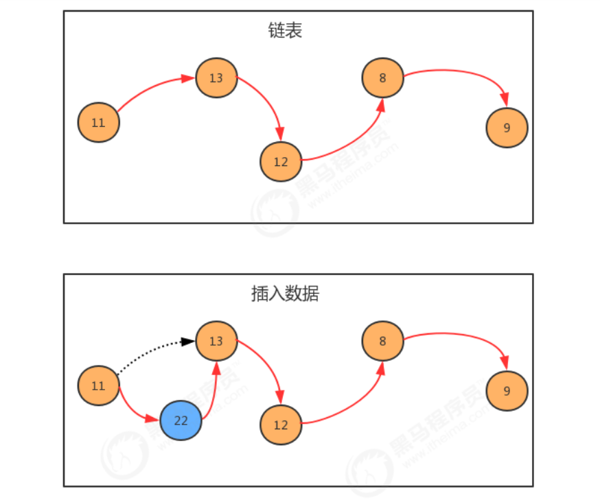

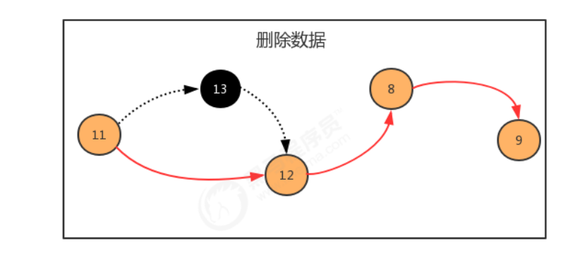

那我们如何使用链表呢？按照面向对象的思想，我们可以设计一个类，来描述结点这个事物，用一个属性描述这个结点存储的元素，用来另外一个属性描述这个结点的下一个结点。

**结点API设计：**

| 类名 | Node |
| --- | --- |
| 构造方法 | Node(T t,Node next)：创建Node对象 |
| 成员变量 | T item:存储数据   Node next：指向下一个结点 |


结点类实现：

```java
public class Node<T> { 
    //存储元素 
    public T item; 
    //指向下一个结点 
    public Node next; 
    public Node(T item, Node next) { 
        this.item = item; 
        this.next = next; 
    } 
}
```


生成链表：

```java
public static void main(String[] args) throws Exception { 
    //构建结点 
    Node<Integer> first = new Node<Integer>(11, null); 
    Node<Integer> second = new Node<Integer>(13, null); 
    Node<Integer> third = new Node<Integer>(12, null); 
    Node<Integer> fourth = new Node<Integer>(8, null); 
    Node<Integer> fifth = new Node<Integer>(9, null); 
    
    //生成链表 
    first.next = second; 
    second.next = third; 
    third.next = fourth; 
    fourth.next = fifth; 
}
```


# 1 单向链表
单向链表是链表的一种，它由多个结点组成，每个结点都由一个数据域和一个指针域组成，数据域用来存储数据，指针域用来指向其后继结点。链表的头结点的数据域不存储数据，指针域指向第一个真正存储数据的结点。

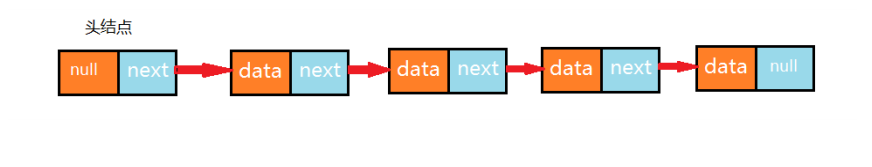

## 1.1 单向链表API设计
| 类名 | LinkList |
| --- | --- |
| 构造方法 | LinkList()：创建LinkList对象 |
| 成员方法 | 1.public void clear()：空置线性表   2.publicboolean isEmpty()：判断线性表是否为空，是返回true，否返回false   3.public int length():获取线性表中元素的个数   4.public T get(int i):读取并返回线性表中的第i个元素的值   5.public void insert(T t)：往线性表中添加一个元素；   6.public void insert(int i,T t)：在线性表的第i个元素之前插入一个值为t的数据元素。   7.public T remove(int i):删除并返回线性表中第i个数据元素。   8.public int indexOf(T t):返回线性表中首次出现的指定的数据元素的位序号，若不存在，则返回-1。 |
| 成员内部类 | private class Node:结点类 |
| 成员变量 | 1.private Node head:记录首结点   2.private int N:记录链表的长度 |


## 1.2 单向链表代码实现
```java
//单向列表代码 
import java.util.Iterator; 

public class LinkList<T> implements Iterable<T> { 
    //记录头结点 
    private Node head; 
    
    //记录链表的长度 
    private int N; 

    public LinkList(){ 
        //初始化头结点 
        head = new Node(null,null); 
        N=0; 
    }
    //清空链表 
    public void clear(){ 
        head.next=null; 
        head.item=null; 
        N=0; 
    }
    
    //获取链表的长度 
    public int length(){ 
        return N; 
    }
    
    //判断链表是否为空 
    public boolean isEmpty(){ 
        return N==0; 
    }
    
    //获取指定位置i出的元素 
    public T get(int i){ 
        if (i<0||i>=N){ 
            throw new RuntimeException("位置不合法！");
        }
        Node n = head.next; 
        for (int index = 0; index < i; index++) { 
            n = n.next; 
        }
        return n.item; 
    }
    
    //向链表中添加元素t 
    public void insert(T t){ 
        //找到最后一个节点 
        Node n = head;
        while(n.next!=null){
             n = n.next; 
        }
        Node newNode = new Node(t, null); 
        n.next = newNode; 
        //链表长度+1 
        N++; 
    }
    
    //向指定位置i处，添加元素t 
    public void insert(int i,T t){ 
        if (i<0||i>=N){ 
            throw new RuntimeException("位置不合法！"); 
        }
        //寻找位置i之前的结点 
        Node pre = head; 
        for (int index = 0; index <=i-1; index++) { 
            pre = pre.next; 
        }
        //位置i的结点 
        Node curr = pre.next; 
        //构建新的结点，让新结点指向位置i的结点 
        Node newNode = new Node(t, curr); 
        //让之前的结点指向新结点 
        pre.next = newNode; 
        //长度+1 
        N++; 
    }
    
    //删除指定位置i处的元素，并返回被删除的元素 
    public T remove(int i){ 
        if (i<0 || i>=N){ 
            throw new RuntimeException("位置不合法"); 
        }
        
        //寻找i之前的元素 
        Node pre = head; 
        for (int index = 0; index <=i-1; index++) { 
            pre = pre.next; 
        }
        
        //当前i位置的结点 
        Node curr = pre.next; 
        
        //前一个结点指向下一个结点，删除当前结点 
        pre.next = curr.next; 
        
        //长度-1 
        N--; 
        return curr.item; 
    }
    
    //查找元素t在链表中第一次出现的位置 
    public int indexOf(T t){ 
        Node n = head; 
        for (int i = 0;n.next!=null;i++){ 
            n = n.next; 
            if (n.item.equals(t)){ 
                return i; 
            } 
        }
        return -1; 
    }
    //结点类 
    private class Node{ 
        //存储数据
        T item; 
        //下一个结点 
        Node next; 
        public Node(T item, Node next) { 
            this.item = item; 
            this.next = next; 
        }
    }
    
    @Override 
    public Iterator iterator() { 
        return new LIterator(); 
    }
    
    private class LIterator implements Iterator<T>{ 
        private Node n; 
        public LIterator() { 
            this.n = head; 
        }
        
        @Override 
        public boolean hasNext() { 
            return n.next!=null; 
        }
        
        @Override 
        public T next() { 
            n = n.next; 
            return n.item; 
        } 
    } 
}

//测试代码 
public class Test { 
    public static void main(String[] args) throws Exception { 
        LinkList<String> list = new LinkList<>(); 
        list.insert(0,"张三"); 
        list.insert(1,"李四"); 
        list.insert(2,"王五"); 
        list.insert(3,"赵六"); 
        
        //测试length方法 
        for (String s : list) { 
            System.out.println(s); 
        }
        System.out.println(list.length()); 
        System.out.println("-------------------"); 
        
        //测试get方法 
        System.out.println(list.get(2)); 
        System.out.println("------------------------"); 
        
        //测试remove方法 
        String remove = list.remove(1); 
        System.out.println(remove); 
        System.out.println(list.length()); 
        System.out.println("----------------");; 
        
        for (String s : list) { 
            System.out.println(s); 
        } 

    } 
}
```


# 2 双向链表
双向链表也叫双向表，是链表的一种，它由多个结点组成，每个结点都由一个数据域和两个指针域组成，数据域用来存储数据，其中一个指针域用来指向其后继结点，另一个指针域用来指向前驱结点。链表的头结点的数据域不存储数据，指向前驱结点的指针域值为null，指向后继结点的指针域指向第一个真正存储数据的结点。

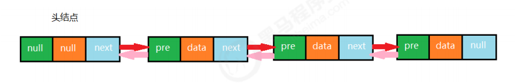

按照面向对象的思想，我们需要设计一个类，来描述结点这个事物。由于结点是属于链表的，所以我们把结点类作为链表类的一个内部类来实现


## 2.1 结点API设计
| 类名 |  Node |
| --- | --- |
| <font style="color:rgb(51,51,51);">构造方法 </font> | <font style="color:rgb(51,51,51);">Node(T t,Node pre,Node next)：创建Node对象</font> |
| <font style="color:rgb(51,51,51);">成员变量</font> | <font style="color:rgb(51,51,51);">T item:存储数据   </font><font style="color:rgb(51,51,51);">Node next：指向下一个结点   </font><font style="color:rgb(51,51,51);">Node pre:指向上一个结点</font> |


## 2.2 双向链表API设计
| 类名 | TowWayLinkList |
| --- | --- |
| 构造方法 | TowWayLinkList()：创建TowWayLinkList对象 |
| 成员方法 | 1.public void clear()：空置线性表   2.publicboolean isEmpty()：判断线性表是否为空，是返回true，否返回false   3.public int length():获取线性表中元素的个数   4.public T get(int i):读取并返回线性表中的第i个元素的值   5.public void insert(T t)：往线性表中添加一个元素；   6.public void insert(int i,T t)：在线性表的第i个元素之前插入一个值为t的数据元素。   7.public T remove(int i):删除并返回线性表中第i个数据元素。   8.public int indexOf(T t):返回线性表中首次出现的指定的数据元素的位序号，若不存在，则返回-1。   9.public T getFirst():获取第一个元素   10.public T getLast():获取最后一个元素 |
| 成员内部类 | private class Node:结点类 |
| 成员变量 | 1.private Node first:记录首结点   2.private Node last:记录尾结点   3.private int N:记录链表的长度 |


## 2.3 双向链表代码实现


```java
//双向链表代码 
import java.util.Iterator; 

public class TowWayLinkList<T> implements Iterable<T>{ 
    //首结点 
    private Node head; 
    
    //最后一个结点 
    private Node last; 
    
    //链表的长度 
    private int N; 
    
    public TowWayLinkList() { 
        last = null; 
        head = new Node(null,null,null); 
        N=0; 
    }
    
    //清空链表 
    public void clear(){ 
        last=null; 
        head.next=last; 
        head.pre=null; 
        head.item=null; 
        N=0; 
    }
    //获取链表长度 
    public int length(){ 
        return N; 
    }
    //判断链表是否为空 
    public boolean isEmpty(){ 
        return N==0; 
    }
    //插入元素t 
    public void insert(T t){ 
        if (last==null){ 
            last = new Node(t,head,null); 
            head.next = last; 
        }else{
            Node oldLast = last; 
            Node node = new Node(t, oldLast, null); 
            oldLast.next = node; 
            last = node; 
        }
        //长度+1 
        N++; 
    }
    
    //向指定位置i处插入元素t 
    public void insert(int i,T t){ 
        if (i<0 || i>=N){ 
            throw new RuntimeException("位置不合法"); 
        }
        
        //找到位置i的前一个结点 
        Node pre = head; 
        for (int index = 0; index < i; index++) { 
            pre = pre.next; 
        }
        //当前结点 
        Node curr = pre.next; 
        
        //构建新结点 
        Node newNode = new Node(t, pre, curr); 
        curr.pre= newNode; 
        pre.next = newNode; 
        //长度+1 
        N++; 
    }
    //获取指定位置i处的元素 
    public T get(int i){ 
        if (i<0||i>=N){ 
            throw new RuntimeException("位置不合法"); 
        }
        //寻找当前结点 
        Node curr = head.next; 
        for (int index = 0; index <i; index++) { 
            curr = curr.next; 
        }
        return curr.item;
        
    }
    //找到元素t在链表中第一次出现的位置 
    public int indexOf(T t){ 
        Node n= head; 
        for (int i=0;n.next!=null;i++){ 
            n = n.next; 
            if (n.next.equals(t)){ 
                return i;
            } 
        }
        return -1; 
    }
    //删除位置i处的元素，并返回该元素 
    public T remove(int i){ 
        if (i<0 || i>=N){ 
            throw new RuntimeException("位置不合法"); 
        }
        //寻找i位置的前一个元素 
        Node pre = head; 
        for (int index = 0; index <i ; index++) { 
            pre = pre.next;
        }
        //i位置的元素 
        Node curr = pre.next; 
        //i位置的下一个元素 
        Node curr_next = curr.next; 
        pre.next = curr_next; 
        curr_next.pre = pre; 
        //长度-1； 
        N--; 
        return curr.item; 
    }
    //获取第一个元素 
    public T getFirst(){ 
        if (isEmpty()){ 
            return null; 
        }
        return head.next.item;
    } 
    //获取最后一个元素 
    public T getLast(){ 
        if (isEmpty()){ 
            return null; 
        }
        return last.item; 
    }
    
    @Override 
    public Iterator<T> iterator() { 
        return new TIterator(); 
    }
    
    private class TIterator implements Iterator{ 
        private Node n = head; 
        
        @Override 
        public boolean hasNext() { 
            return n.next!=null; 
        }
        
        @Override 
        public Object next() { 
            n = n.next; 
            return n.item; 
        } 
    }
    
    //结点类 
    private class Node{ 
        public Node(T item, Node pre, Node next) { 
            this.item = item; 
            this.pre = pre; 
            this.next = next; 
        }
        //存储数据 
        public T item; 
        
        //指向上一个结点 
        public Node pre; 
        //指向下一个结点 
        public Node next; 
    } 
}

//测试代码 
public class Test { 
    public static void main(String[] args) throws Exception { 
        TowWayLinkList<String> list = new TowWayLinkList<>(); 
        list.insert("乔峰"); 
        list.insert("虚竹"); 
        list.insert("段誉"); 
        list.insert(1,"鸠摩智"); 
        list.insert(3,"叶二娘"); 
        
        for (String str : list) { 
            System.out.println(str); 
        }
        
        System.out.println("----------------------");
        String tow = list.get(2); 
        System.out.println(tow); 
        System.out.println("-------------------------"); 
        String remove = list.remove(3); 
        System.out.println(remove); 
        System.out.println(list.length()); 
        System.out.println("--------------------"); 
        System.out.println(list.getFirst()); 
        System.out.println(list.getLast()); 
    } 
}
```


## 2.4 java中LinkedList实现


java中LinkedList集合也是使用双向链表实现，并提供了增删改查等相关方法  
1.底层是否用双向链表实现；  
2.结点类是否有三个域


# 3 链表的复杂度分析


get(int i):每一次查询，都需要从链表的头部开始，依次向后查找，随着数据元素N的增多，比较的元素越多，时间复杂度为O(n)  
insert(int i,T t):每一次插入，需要先找到i位置的前一个元素，然后完成插入操作，随着数据元素N的增多，查找的元素越多，时间复杂度为O(n);  
remove(int i):每一次移除，需要先找到i位置的前一个元素，然后完成插入操作，随着数据元素N的增多，查找的元素越多，时间复杂度为O(n)

相比较顺序表，链表插入和删除的时间复杂度虽然一样，但仍然有很大的优势，因为链表的物理地址是不连续的，它不需要预先指定存储空间大小，或者在存储过程中涉及到扩容等操作,,同时它并没有涉及的元素的交换。

相比较顺序表，链表的查询操作性能会比较低。因此，如果我们的程序中查询操作比较多，建议使用顺序表，增删操作比较多，建议使用链表。


# 4 链表反转


单链表的反转，是面试中的一个高频题目。  
需求：  
原链表中数据为：1->2->3>4  
反转后链表中数据为：4->3->2->1


反转API：  
public void reverse()：对整个链表反转  
public Node reverse(Node curr)：反转链表中的某个结点curr,并把反转后的curr结点返回

使用递归可以完成反转，递归反转其实就是从原链表的第一个存数据的结点开始，依次递归调用反转每一个结点，直到把最后一个结点反转完毕，整个链表就反转完毕。

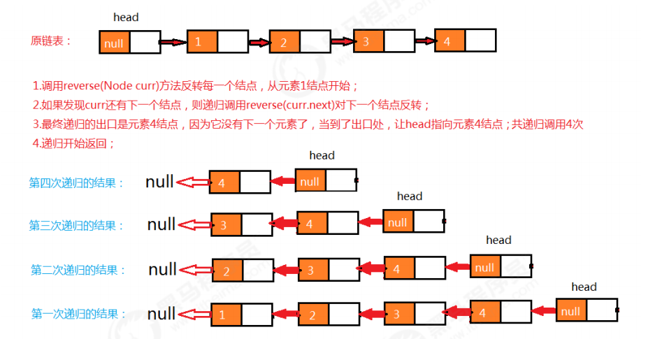

代码:


```java
public void reverse(){ 
    if (N==0){ 
        //当前是空链表，不需要反转 
        return; 
    }
    reverse(head.next); 
} 

/** 
*
* @param curr 当前遍历的结点 
* @return 反转后当前结点上一个结点 
*/
public Node reverse(Node curr){ 
    //已经到了最后一个元素 
    if (curr.next==null){ 
        //反转后，头结点应该指向原链表中的最后一个元素 
        head.next=curr; 
        return curr; 
    }
    //当前结点的上一个结点 
    Node pre = reverse(curr.next); 
    pre.next = curr; 
    
    //当前结点的下一个结点设为null 
    curr.next=null; 
    //返回当前结点 
    return curr; 
}

//测试代码 
public class Test { 
    public static void main(String[] args) throws Exception { 
        LinkList<Integer> list = new LinkList<>(); 
        list.insert(1); 
        list.insert(2); 
        list.insert(3); 
        list.insert(4); 
        
        for (Integer i : list) { 
            System.out.print(i+" "); 
        }
        System.out.println(); 
        
        System.out.println("--------------------"); 
        list.reverse(); 
        for (Integer i : list) { 
            System.out.print(i+" ");
        } 
    } 
}
```


# 5 快慢指针


快慢指针指的是定义两个指针，这两个指针的移动速度一块一慢，以此来制造出自己想要的差值，这个差值可以然我们找到链表上相应的结点。一般情况下，快指针的移动步长为慢指针的两倍

## 5.1 中间值问题
我们先来看下面一段代码，然后完成需求。

```java
//测试类 
public class Test { 
    public static void main(String[] args) throws Exception { 
        Node<String> first = new Node<String>("aa", null); 
        Node<String> second = new Node<String>("bb", null); 
        Node<String> third = new Node<String>("cc", null); 
        Node<String> fourth = new Node<String>("dd", null); 
        Node<String> fifth = new Node<String>("ee", null); 
        Node<String> six = new Node<String>("ff", null); 
        Node<String> seven = new Node<String>("gg", null); 
        
        //完成结点之间的指向
    	first.next = second; 
        second.next = third; 
        third.next = fourth; 
        fourth.next = fifth; 
        fifth.next = six; 
        six.next = seven; 
        
        //查找中间值 
        String mid = getMid(first); 
        System.out.println("中间值为："+mid); 
    }
    /**
	* @param first 链表的首结点 
	* @return 链表的中间结点的值 
	*/ 
    public static String getMid(Node<String> first) { 
        return null; 
    }
    //结点类
    private static class Node<T> { 
        //存储数据 
        T item; 
        //下一个结点 
        Node next; 
        public Node(T item, Node next) { 
            this.item = item; this.next = next; 
        } 
    } 
} 
```

<font style="color:#E8323C;">需求：</font>

请完善测试类Test中的getMid方法，可以找出链表的中间元素值并返回。

利用快慢指针，我们把一个链表看成一个跑道，假设a的速度是b的两倍，那么当a跑完全程后，b刚好跑一半，以此来达到找到中间节点的目的。

如下图，最开始，slow与fast指针都指向链表第一个节点，然后slow每次移动一个指针，fast每次移动两个指针。

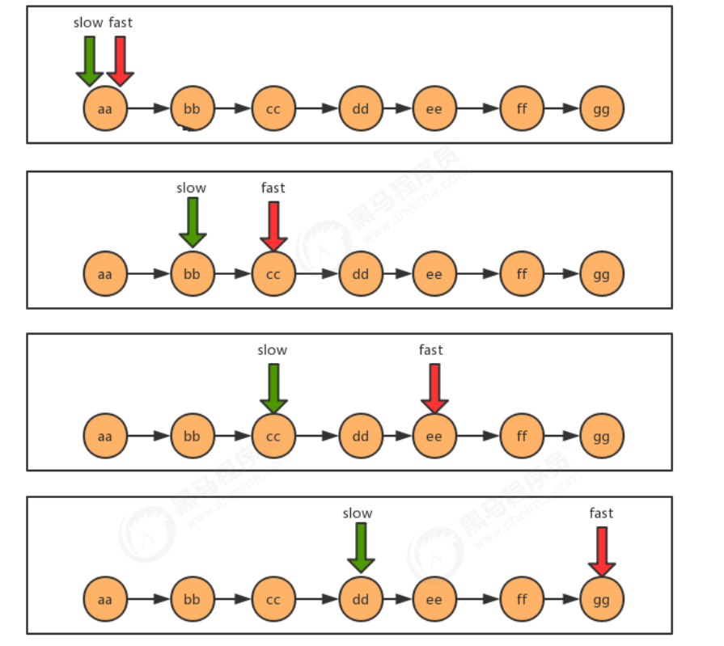

代码：

```java
/**
* @param first 链表的首结点 
* @return 链表的中间结点的值 
*/ 
public static String getMid(Node<String> first) { 
    Node<String> slow = first; 
    Node<String> fast = first; 
    while(fast!=null && fast.next!=null){ 
        fast=fast.next.next; 
        slow=slow.next; 
    }
    return slow.item; 
}
```

## 5.2 单向链表是否有环问题
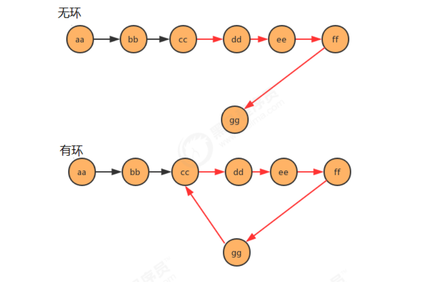

看下面代码，完成需求：

```java
//测试类 
public class Test { 
    public static void main(String[] args) throws Exception { 
        Node<String> first = new Node<String>("aa", null); 
        Node<String> second = new Node<String>("bb", null); 
        Node<String> third = new Node<String>("cc", null); 
        Node<String> fourth = new Node<String>("dd", null); 
        Node<String> fifth = new Node<String>("ee", null); 
        Node<String> six = new Node<String>("ff", null); 
        Node<String> seven = new Node<String>("gg", null); 
        
        //完成结点之间的指向 
        first.next = second; 
        second.next = third; 
        third.next = fourth; 
        fourth.next = fifth; 
        fifth.next = six; 
        six.next = seven; 
        //产生环 
        seven.next = third;
        
        //判断链表是否有环 
        boolean circle = isCircle(first); 
    	System.out.println("first链表中是否有环："+circle); }
    
    /**
	* 判断链表中是否有环 
	* @param first 链表首结点 
	* @return ture为有环，false为无环 
	*/ 
    public static boolean isCircle(Node<String> first) { 
        return false; }
    
    //结点类 
    private static class Node<T> { 
        //存储数据 T item; 
        //下一个结点
        Node next; 
        public Node(T item, Node next) { 
            this.item = item; 
            this.next = next; 
        } 
    } 
}
```


需求：

请完善测试类Test中的isCircle方法，返回链表中是否有环。

使用快慢指针的思想，还是把链表比作一条跑道，链表中有环，那么这条跑道就是一条圆环跑道，在一条圆环跑道中，两个人有速度差，那么迟早两个人会相遇，只要相遇那么就说明有环。

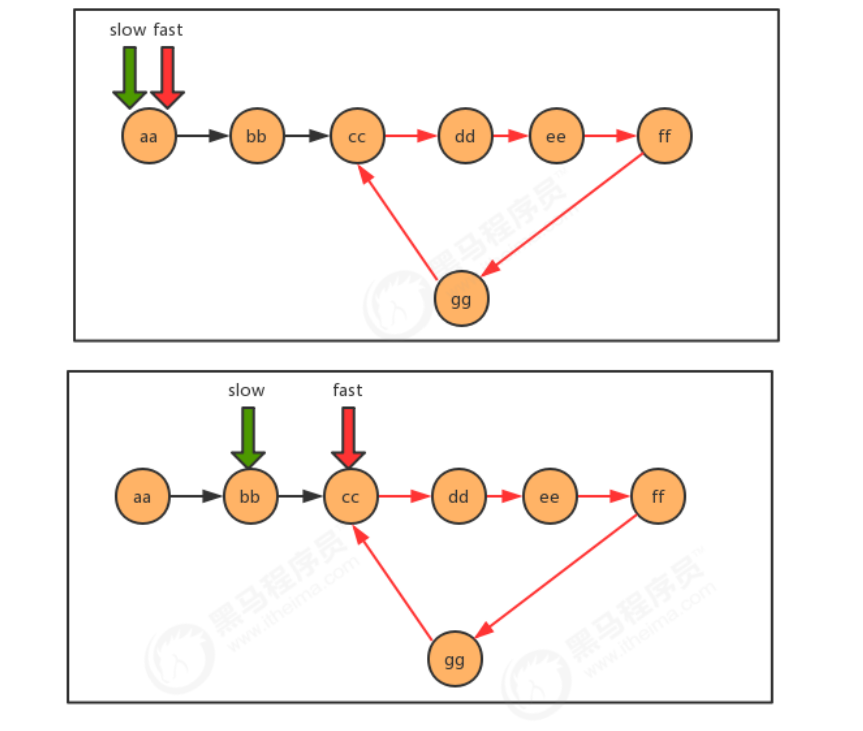

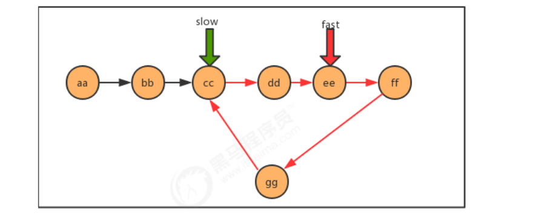

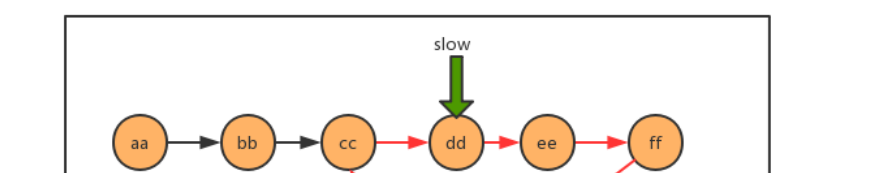

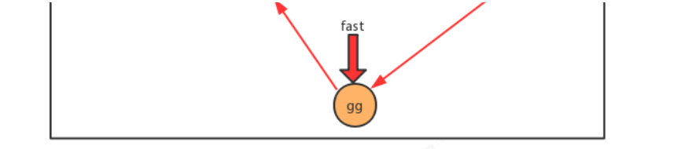

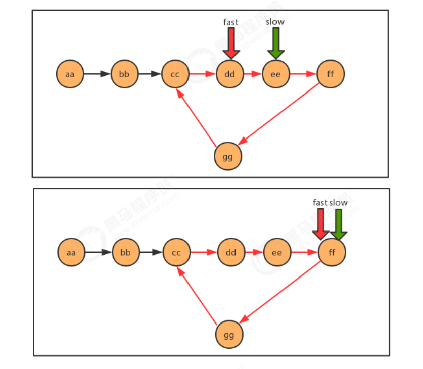


代码：

```java
/**
* 判断链表中是否有环 
* @param first 链表首结点 
* @return ture为有环，false为无环 
*/ 

public static boolean isCircle(Node<String> first) {
    Node<String> slow = first; 
    Node<String> fast = first; 
    while(fast!=null && fast.next!=null){ 
        fast = fast.next.next; 
        slow = slow.next; 1234567891011
        if (fast.equals(slow)){ 
            return true; } 
    	}
    return false; 
}


```


## 5.3 有环链表入口问题
同样看下面这段代码，完成需求：

```java
//测试类 
public class Test { 
    public static void main(String[] args) throws Exception { 
        Node<String> first = new Node<String>("aa", null); 
        Node<String> second = new Node<String>("bb", null); 
        Node<String> third = new Node<String>("cc", null); 
        Node<String> fourth = new Node<String>("dd", null); 
        Node<String> fifth = new Node<String>("ee", null); 
        Node<String> six = new Node<String>("ff", null); 
        Node<String> seven = new Node<String>("gg", null); 
        
        //完成结点之间的指向 
        first.next = second; 
        second.next = third; 
        third.next = fourth; 
        fourth.next = fifth; 
        fifth.next = six; 
        six.next = seven; 
        
        //产生环 
        seven.next = third; 
        
        //查找环的入口结点 
        Node<String> entrance = getEntrance(first); 
        System.out.println("first链表中环的入口结点元素为："+entrance.item); 
    }
    /**
	* 查找有环链表中环的入口结点 
	* @param first 链表首结点 
	* @return 环的入口结点 */ 
    public static Node getEntrance(Node<String> first) { 
        return null; 
    }
    //结点类 
    private static class Node<T> { 
        //存储数据 
        T item; 
        //下一个结点 
    	Node next; 
        public Node(T item, Node next) { 
            this.item = item; 
            this.next = next;
        } 
    } 
}
```

需求：

请完善Test类中的getEntrance方法，查找有环链表中环的入口结点。

当快慢指针相遇时，我们可以判断到链表中有环，这时重新设定一个新指针指向链表的起点，且步长与慢指针一样为1，则慢指针与“新”指针相遇的地方就是环的入口。证明这一结论牵涉到数论的知识，这里略，只讲实现。

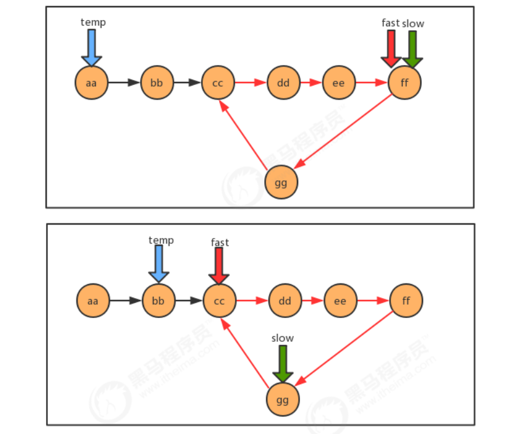

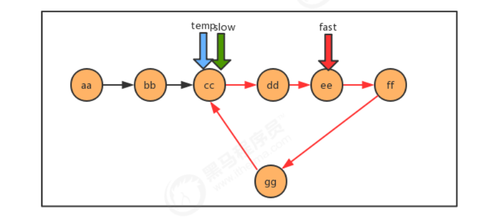

代码：

```java
/**
* 查找有环链表中环的入口结点 
* @param first 链表首结点 
* @return 环的入口结点 
*/ 

public static Node getEntrance(Node<String> first) { 
    Node<String> slow = first; 
    Node<String> fast = first; 
    Node<String> temp = null; 
    
    while(fast!=null && fast.next!=null){ 
        fast = fast.next.next; slow=slow.next; 
        if (fast.equals(slow)){ 
            temp = first; 
            continue; 
        }
        if (temp!=null){ 
            temp=temp.next; 
            if (temp.equals(slow)){ 
                return temp; 
            } 
        } 
    }
    return null; 
}

```


## 5.4 循环链表
循环链表，顾名思义，链表整体要形成一个圆环状。在单向链表中，最后一个节点的指针为null，不指向任何结点，因为没有下一个元素了。要实现循环链表，我们只需要让单向链表的最后一个节点的指针指向头结点即可。

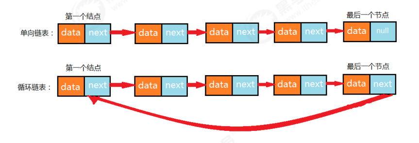

循环链表的构建：

```java

public class Test { 
    public static void main(String[] args) throws Exception { 
        //构建结点 
        Node<Integer> first = new Node<Integer>(1, null);
        Node<Integer> second = new Node<Integer>(2, null);
        Node<Integer> third = new Node<Integer>(3, null);
        Node<Integer> fourth = new Node<Integer>(4, null); 
        Node<Integer> fifth = new Node<Integer>(5, null);
        Node<Integer> six = new Node<Integer>(6, null); 
        Node<Integer> seven = new Node<Integer>(7, null); 


    	//构建单链表 
        first.next = second; 
        second.next = third; 
        third.next = fourth; 
        fourth.next = fifth; 
        fifth.next = six; 
        six.next = seven; 
        
        //构建循环链表,让最后一个结点指向第一个结点 
        seven.next = first; 
    } 
}
```


## 5.5 约瑟夫问题
问题描述：

传说有这样一个故事，在罗马人占领乔塔帕特后，39 个犹太人与约瑟夫及他的朋友躲到一个洞中，39个犹太人决定宁愿死也不要被敌人抓到，于是决定了一个自杀方式，41个人排成一个圆圈，第一个人从1开始报数，依次往

后，如果有人报数到3，那么这个人就必须自杀，然后再由他的下一个人重新从1开始报数，直到所有人都自杀身亡为止。然而约瑟夫和他的朋友并不想遵从。于是，约瑟夫要他的朋友先假装遵从，他将朋友与自己安排在第16个与第31个位置，从而逃过了这场死亡游戏 。

问题转换：

+ 41个人坐一圈，第一个人编号为1，第二个人编号为2，第n个人编号为n。
+ 1.编号为1的人开始从1报数，依次向后，报数为3的那个人退出圈；
+ 2.自退出那个人开始的下一个人再次从1开始报数，以此类推；
+ 3.求出最后退出的那个人的编号。

图示：

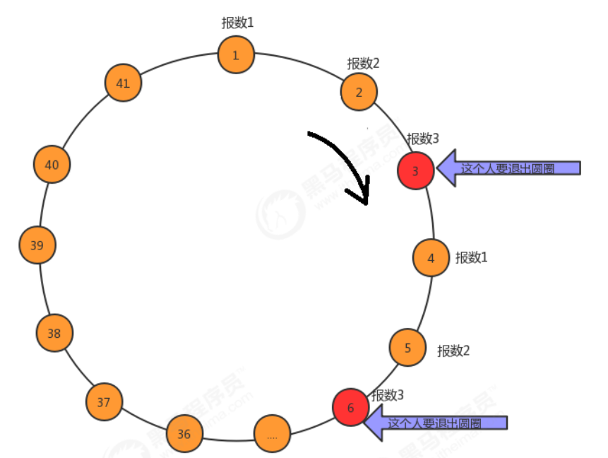


解题思路：

+ 1.构建含有41个结点的单向循环链表，分别存储1~41的值，分别代表这41个人；
+ 2.使用计数器count，记录当前报数的值；
+ 3.遍历链表，每循环一次，count++；
+ 4.判断count的值，如果是3，则从链表中删除这个结点并打印结点的值，把count重置为0；

代码: 

```java
public class Test { 
    public static void main(String[] args) throws Exception { 
        //1.构建循环链表 
        Node<Integer> first = null; 
        //记录前一个结点 
        Node<Integer> pre = null; 
        for (int i = 1; i <= 41; i++) { 
            //第一个元素 
            if (i==1){ 
                first = new Node(i,null); 
                pre = first;
                continue; 
            }
            Node<Integer> node = new Node<>(i,null); 
            pre.next = node; 
            pre = node; 
            if (i==41){ 
                //构建循环链表，让最后一个结点指向第一个结点 
                pre.next=first; 
            } 
        }
        
        //2.使用count，记录当前的报数值 
        int count=0;
        
        //3.遍历链表，每循环一次，
        count++ Node<Integer> n = first; 
        Node<Integer> before = null; 
        while(n!=n.next){ 
            //4.判断count的值，如果是3，则从链表中删除这个结点并打印结点的值，把count重置为0； 
            count++; 
            if (count==3){ 
                //删除当前结点 
                before.next = n.next; 
                System.out.print(n.item+","); 
                count=0; 
                n = n.next; 
            }else{
                before=n;
                n = n.next;
            } 
        }
        /*打印剩余的最后那个人*/ 
        System.out.println(n.item); 
    } 
} 
```


