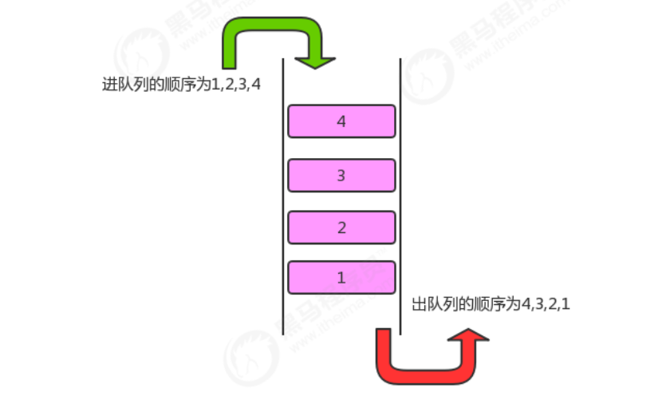

**<font style="color:#DF2A3F;">笔记来源：</font>**[**<font style="color:#DF2A3F;">黑马程序员Java数据结构与java算法全套教程，数据结构+算法教程全资料发布，包含154张java数据结构图</font>**](https://www.bilibili.com/video/BV1iJ411E7xW?p=2&vd_source=e8046ccbdc793e09a75eb61fe8e84a30)

**<font style="color:#DF2A3F;"></font>**

队列是一种基于先进先出(FIFO)的数据结构，是一种只能在一端进行插入,在另一端进行删除操作的特殊线性表，它按照先进先出的原则存储数据，先进入的数据，在读取数据时先读被读出来。



# 1 队列的API设计
| 类名 |  Queue |
| --- | --- |
| 构造方法 | Queue()：创建Queue对象 |
| 成员方法 | 1. public boolean isEmpty()：判断队列是否为空，是返回true，否返回false<br/>2. public int size():获取队列中元素的个数<br/>3. public T dequeue():从队列中拿出一个元素<br/>4. public void enqueue(T t)：往队列中插入一个元素 |
| 成员变量 | 1. private Node head:记录首结点<br/>2. private int N:当前栈的元素个数<br/>3. private Node last:记录最后一个结点 |


 

# 2 队列的实现
```java
//队列代码 
import java.util.Iterator; 
public class Queue<T> implements Iterable<T>{ 
    //记录首结点 
    private Node head; 
    //记录最后一个结点 
    private Node last; 
    //记录队列中元素的个数 
    private int N; 
    
    public Queue() { 
        head = new Node(null,null); 
        last=null;
        N=0; 
    }
    
    //判断队列是否为空 
    public boolean isEmpty(){ 
        return N==0; 
    }
    
    //返回队列中元素的个数 
    public int size(){ 
        return N; 
    }
    
    //向队列中插入元素t 
    public void enqueue(T t){ 
        if (last==null){ 
            last = new Node(t,null); 
            head.next=last; 
        }else{
            Node oldLast = last; 
            last = new Node(t,null);
            oldLast.next=last; 
        }
        //个数+1 
        N++; 
    }
    
    //从队列中拿出一个元素 
    public T dequeue(){ 
        if (isEmpty()){ 
            return null; 
        }
        Node oldFirst = head.next; 
        head.next = oldFirst.next; 
        N--; 
        if (isEmpty()){ 
            last=null; 
        }
        return oldFirst.item; 
    }
    
    @Override 
    public Iterator<T> iterator() { 
        return new QIterator(); 
    }
    
    private class QIterator implements Iterator<T>{ 
        private Node n = head; 
        
        @Override public boolean hasNext() {
            return n.next!=null; 
        }
        
        @Override 
        public T next() { 
            Node node = n.next; 
            n = n.next; 
            return node.item; 
        } 
    }
    
    private class Node{ 
        public T item; 
        public Node next; 
        public Node(T item, Node next) { 
            this.item = item; 
            this.next = next; 
        } 
    } 
} 

//测试代码 
public class Test { 
    public static void main(String[] args) throws Exception { 
        Queue<String> queue = new Queue<>(); 
        queue.enqueue("a"); 
        queue.enqueue("b"); 
        queue.enqueue("c"); 
        queue.enqueue("d"); 
        
        for (String str : queue) { 
            System.out.print(str+" "); 
        }
        System.out.println("-----------------------------"); 
        
        String result = queue.dequeue(); 
        System.out.println("出列了元素："+result); 
        System.out.println(queue.size()); 
    } 
} 
```


