**<font style="color:#DF2A3F;">笔记来源：</font>**[**<font style="color:#DF2A3F;">黑马程序员Java数据结构与java算法全套教程，数据结构+算法教程全资料发布，包含154张java数据结构图</font>**](https://www.bilibili.com/video/BV1iJ411E7xW?p=2&vd_source=e8046ccbdc793e09a75eb61fe8e84a30)

# 205. <font style="color:rgb(51,51,51);">1 堆的定义 </font>
<font style="color:rgb(51,51,51);">堆是计算机科学中一类特殊的数据结构的统称，堆通常可以被看做是一棵完全二叉树的数组对象。 </font>

**<font style="color:rgb(51,51,51);">堆的特性： </font>**

1. <font style="color:rgb(51,51,51);">它是完全二叉树，除了树的最后一层结点不需要是满的，其它的每一层从左到右都是满的，如果最后一层结点不是满的，那么要求左满右不满。 </font>

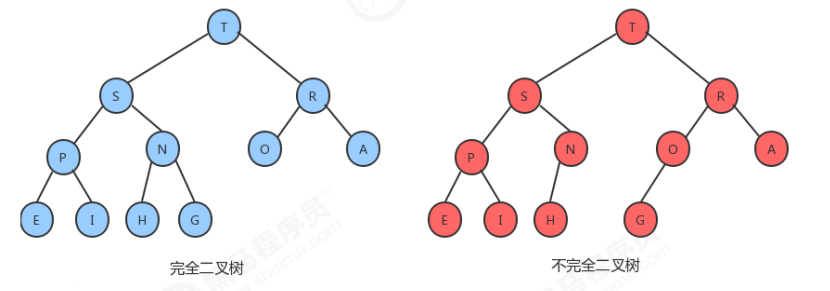

2. <font style="color:rgb(51,51,51);">它通常用数组来实现。 </font>

<font style="color:rgb(51,51,51);">具体方法就是将二叉树的结点按照层级顺序放入数组中，根结点在位置1，它的子结点在位置2和3，而子结点的子结点则分别在位置4,5,6和7，以此类推。 </font>

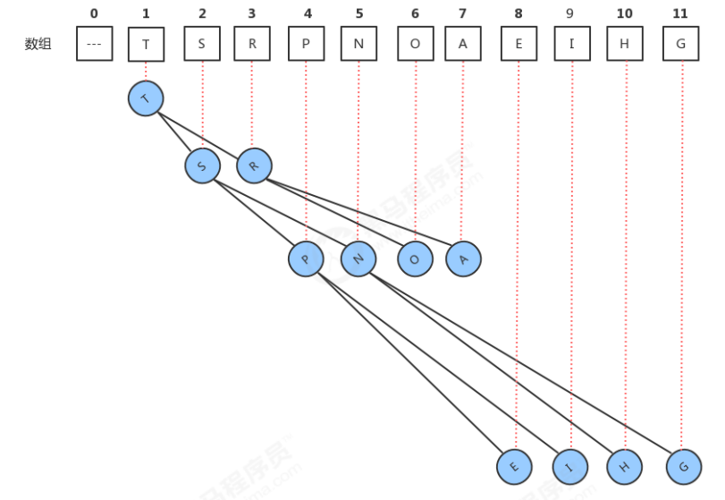

<font style="color:rgb(51,51,51);">如果一个结点的位置为k，则它的父结点的位置为[k/2],而它的两个子结点的位置则分别为2k和2k+1。这样，在不使用指针的情况下，我们也可以通过计算数组的索引在树中上下移动：从a[k]向上一层，就令k等于k/2,向下一层就令k等于2k或2k+1。 </font>

3. <font style="color:rgb(51,51,51);">每个结点都大于等于它的两个子结点。这里要注意堆中仅仅规定了每个结点大于等于它的两个子结点，但这两个子结点的顺序并没有做规定，跟我们之前学习的二叉查找树是有区别的。 </font>

# 206. <font style="color:rgb(51,51,51);">2 堆的API设计 </font>
| **<font style="color:rgb(51,51,51);">类名 </font>** | **<font style="color:rgb(51,51,51);">Heap</font>** |
| --- | --- |
| <font style="color:rgb(51,51,51);">构造方法 </font> | <font style="color:rgb(51,51,51);">Heap(int capacity)：创建容量为capacity的Heap对象 </font> |
| <font style="color:rgb(51,51,51);">成员方法 </font> | 1. <font style="color:rgb(51,51,51);">private boolean less(int i,int j)：判断堆中索引i处的元素是否小于索引j处的元素 </font><br/>2. <font style="color:rgb(51,51,51);">private void exch(int i,int j):交换堆中i索引和j索引处的值 </font><br/>3. <font style="color:rgb(51,51,51);">public T delMax():删除堆中最大的元素,并返回这个最大元素 </font><br/>4. <font style="color:rgb(51,51,51);">public void insert(T t)：往堆中插入一个元素 </font><br/>5. <font style="color:rgb(51,51,51);">private void swim(int k):使用上浮算法，使索引k处的元素能在堆中处于一个正确的位置 </font><br/>6. <font style="color:rgb(51,51,51);">private void sink(int k):使用下沉算法，使索引k处的元素能在堆中处于一个正确的位置 </font> |
| <font style="color:rgb(51,51,51);">成员变量</font> | 1. <font style="color:rgb(51,51,51);">private T[] imtes : 用来存储元素的数组 </font><br/>2. <font style="color:rgb(51,51,51);">private int N：记录堆中元素的个数 </font> |


# 207. <font style="color:rgb(51,51,51);">3 堆的实现 </font>
## <font style="color:rgb(51,51,51);">3.1 insert插入方法的实现 </font>
<font style="color:rgb(51,51,51);">堆是用数组完成数据元素的存储的，由于数组的底层是一串连续的内存地址，所以我们要往堆中插入数据，我们只能往数组中从索引0处开始，依次往后存放数据，但是堆中对元素的顺序是有要求的，每一个结点的数据要大于等于它的两个子结点的数据，所以每次插入一个元素，都会使得堆中的数据顺序变乱，这个时候我们就需要通过一些方法让刚才插入的这个数据放入到合适的位置。 </font>

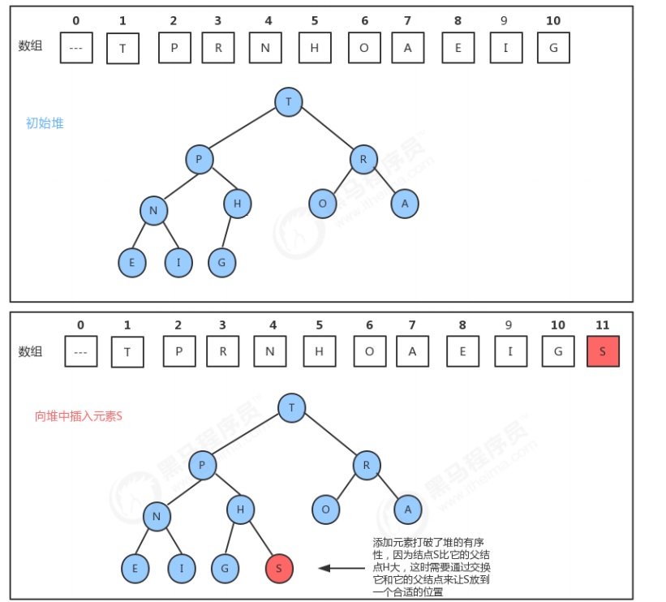

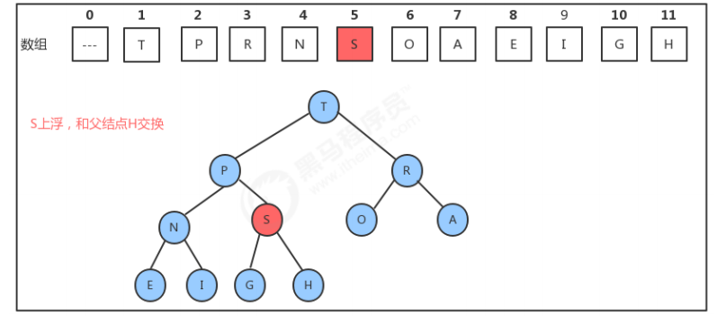

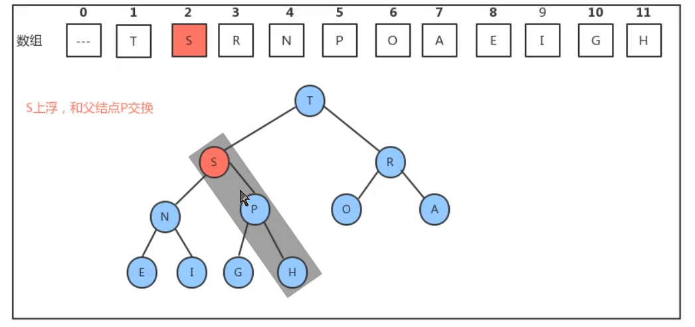

<font style="color:rgb(51,51,51);">所以，如果往堆中新插入元素，我们只需要不断的比较新结点a[k]和它的父结点a[k/2]的大小，然后根据结果完成数据元素的交换，就可以完成堆的有序调整。 </font>

## <font style="color:rgb(51,51,51);">4.2 delMax删除最大元素方法的实现 </font>
<font style="color:rgb(51,51,51);">由堆的特性我们可以知道，索引1处的元素，也就是根结点就是最大的元素，当我们把根结点的元素删除后，需要有一个新的根结点出现，这时我们可以暂时把堆中最后一个元素放到索引1处，充当根结点，但是它有可能不满足堆的有序性需求，这个时候我们就需要通过一些方法，让这个新的根结点放入到合适的位置。 </font>

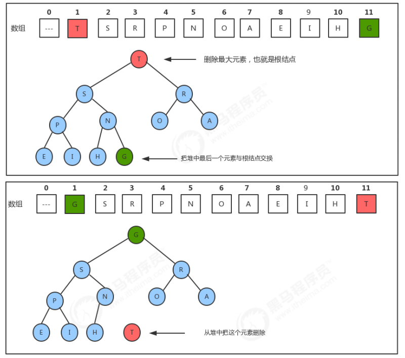


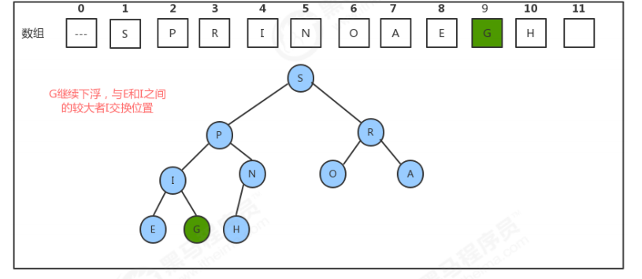

<font style="color:rgb(51,51,51);">所以，当删除掉最大元素后，只需要将最后一个元素放到索引1处，并不断的拿着当前结点a[k]与它的子结点a[2k]和a[2k+1]中的较大者交换位置，即可完成堆的有序调整。 </font>

## <font style="color:rgb(51,51,51);">4.3 堆的实现代码 </font>
```java
//堆代码 
public class Heap<T extends Comparable<T>> { 
	//存储堆中的元素 
	private T[] items; 

    //记录堆中元素的个数 
	private int N; 
	
    public Heap(int capacity) { 
		items = (T[]) new Comparable[capacity+1]; 
		N=0; 
	} 

    //判断堆中索引i处的元素是否小于索引j处的元素 
	private boolean less(int i,int j){ 
		return items[i].compareTo(items[j])<0; 
	} 

    //交换堆中i索引和j索引处的值 
	private void exch(int i,int j){ 
    	T tmp = items[i]; 
		items[i] = items[j]; 
		items[j] = tmp; 
	} 

    //往堆中插入一个元素 
	public void insert(T t){ 
		items[++N] = t; 
		swim(N); 
	} 

    //删除堆中最大的元素,并返回这个最大元素 
	public T delMax(){ 
		T max = items[1]; 
		//交换索引1处和索引N处的值 
		exch(1,N); 
		//删除最后位置上的元素 
		items[N]=null; 
		N--;//个数-1 
		sink(1); 
		return max; 
	} 

    //使用上浮算法，使索引k处的元素能在堆中处于一个正确的位置 
	private void swim(int k){ 
		//如果已经到了根结点，就不需要循环了 
		while(k>1){ 
			//比较当前结点和其父结点 
			if(less(k/2,k)){ 
				//父结点小于当前结点，需要交换 
				exch(k/2,k); 
			} 
			k = k/2; 
		} 
	} 

    //使用下沉算法，使索引k处的元素能在堆中处于一个正确的位置 
	private void sink(int k){ 
		//如果当前已经是最底层了，就不需要循环了 
		while(2*k<=N){ 
			//找到子结点中的较大者 
			int max; 
			if (2*k+1<=N){//存在右子结点 
				if (less(2*k,2*k+1)){ 
					max = 2*k+1; 
				}else{ 
					max = 2*k; 
				} 
			}else{//不存在右子结点 
				max = 2*k; 
			} 
        	//比较当前结点和子结点中的较大者，如果当前结点不小，则结束循环 
			if (!less(k,max)){ 
				break; 
			} 
			//当前结点小，则交换， 
			exch(k,max); 
			k = max; 
		} 
	} 
} 

//测试代码 
public class Test { 
	public static void main(String[] args) throws Exception { 
		Heap<String> heap = new Heap<String>(20); 
		heap.insert("S"); 
		heap.insert("G"); 
		heap.insert("I"); 
		heap.insert("E"); 
		heap.insert("N"); 
		heap.insert("H"); 
		heap.insert("O"); 
		heap.insert("A"); 
		heap.insert("T"); 
		heap.insert("P"); 
		heap.insert("R"); 
		String del; 
		while((del=heap.delMax())!=null){ 
			System.out.print(del+","); 
		} 
	} 
} 
```

# 208. <font style="color:rgb(51,51,51);">4 堆排序 </font>
<font style="color:rgb(51,51,51);">给定一个数组： </font>`<font style="color:rgb(51,51,51);">String[] arr = {"S","O","R","T","E","X","A","M","P","L","E"} </font>`

<font style="color:rgb(51,51,51);">请对数组中的字符按从小到大排序。 </font>

**<font style="color:rgb(51,51,51);">实现步骤： </font>**

```java
1.构造堆； 
2.得到堆顶元素，这个值就是最大值； 
3.交换堆顶元素和数组中的最后一个元素，此时所有元素中的最大元素已经放到合适的位置； 
4.对堆进行调整，重新让除了最后一个元素的剩余元素中的最大值放到堆顶； 
5.重复2~4这个步骤，直到堆中剩一个元素为止。 
```

**<font style="color:rgb(51,51,51);">API设计：</font>**

| **<font style="color:rgb(51,51,51);">类名</font>** | **<font style="color:rgb(51,51,51);">HeapSort</font>** |
| --- | --- |
| <font style="color:rgb(51,51,51);">成员方法 </font> | 1. <font style="color:rgb(51,51,51);">public static void sort(Comparable[] source)：对source数组中的数据从小到大排序 </font><br/>2. <font style="color:rgb(51,51,51);">private static void createHeap(Comparable[] source, Comparable[] heap):根据原数组source，构造出堆heap </font><br/>3. <font style="color:rgb(51,51,51);">private static boolean less(Comparable[] heap, int i, int j)：判断heap堆中索引i处的元素是否小于索引j处的元素 </font><br/>4. <font style="color:rgb(51,51,51);">private static void exch(Comparable[] heap, int i, int j):交换heap堆中i索引和j索引处的值 </font><br/>5. <font style="color:rgb(51,51,51);">private static void sink(Comparable[] heap, int target, int range):在heap堆中，对target处的元素做下沉，范围是0~range。 </font> |


## <font style="color:rgb(51,51,51);">4.1 堆构造过程 </font>
<font style="color:rgb(51,51,51);">堆的构造，最直观的想法就是另外再创建一个和新数组数组，然后从左往右遍历原数组，每得到一个元素后，添加到新数组中，并通过上浮，对堆进行调整，最后新的数组就是一个堆。 </font>

<font style="color:rgb(51,51,51);">上述的方式虽然很直观，也很简单，但是我们可以用更聪明一点的办法完成它。创建一个新数组，把原数组0~length-1的数据拷贝到新数组的1~length处，再从新数组长度的一半处开始往1索引处扫描（从右往左），然后 </font>

<font style="color:rgb(51,51,51);">对扫描到的每一个元素做下沉调整即可。 </font>

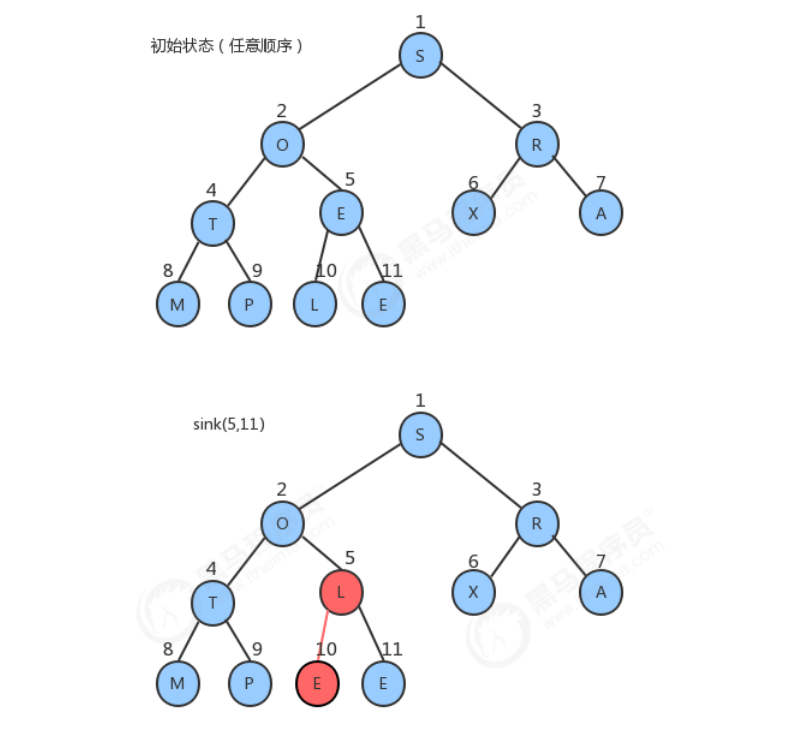

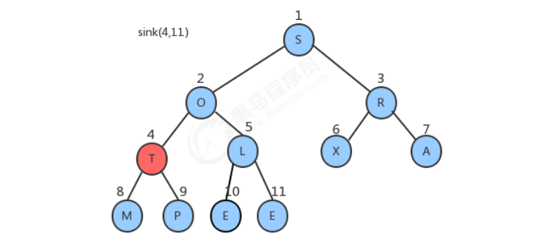

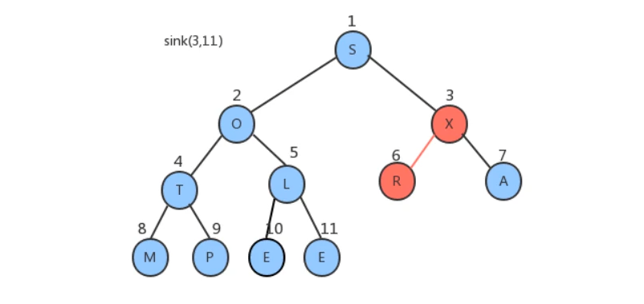

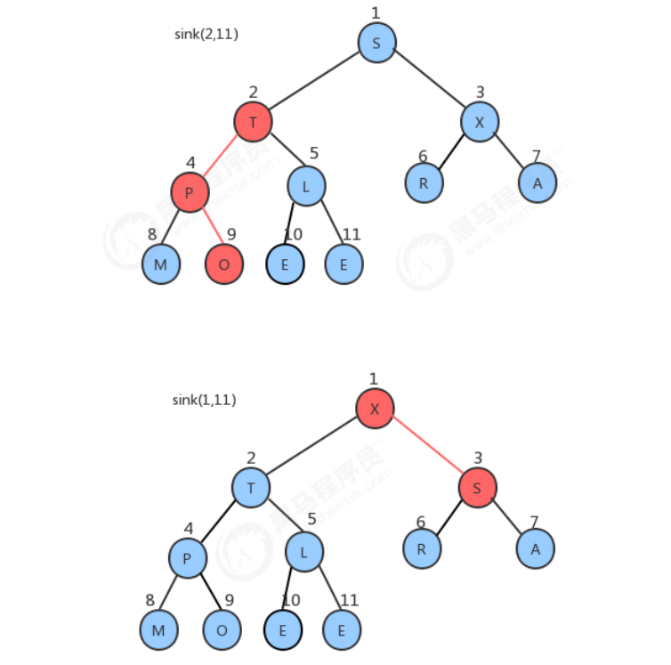

## <font style="color:rgb(51,51,51);">4.2 堆排序过程 </font>
<font style="color:rgb(51,51,51);">对构造好的堆，我们只需要做类似于堆的删除操作，就可以完成排序。 </font>

1. <font style="color:rgb(51,51,51);">将堆顶元素和堆中最后一个元素交换位置； </font>
2. <font style="color:rgb(51,51,51);">通过对堆顶元素下沉调整堆，把最大的元素放到堆顶(此时最后一个元素不参与堆的调整，因为最大的数据已经到了数组的最右边) </font>
3. <font style="color:rgb(51,51,51);">重复1~2步骤，直到堆中剩最后一个元素。 </font>

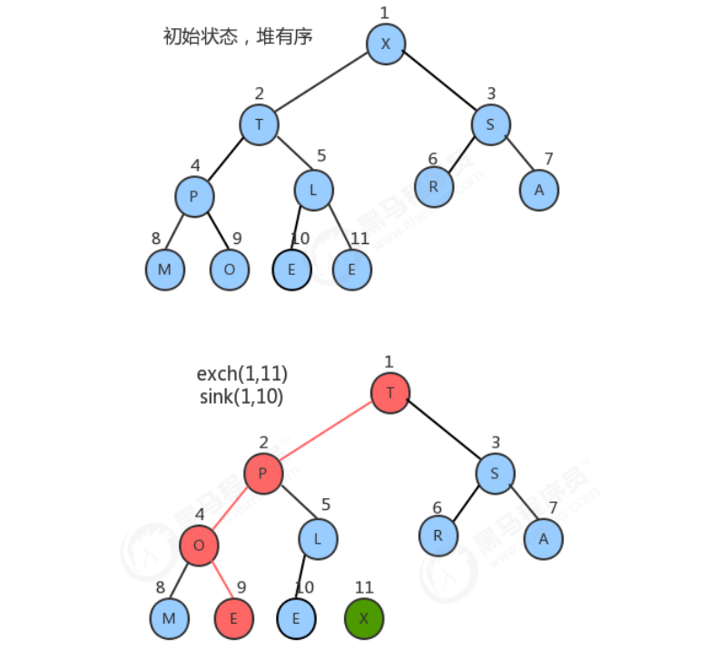

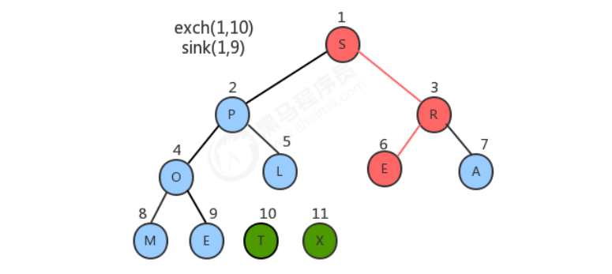

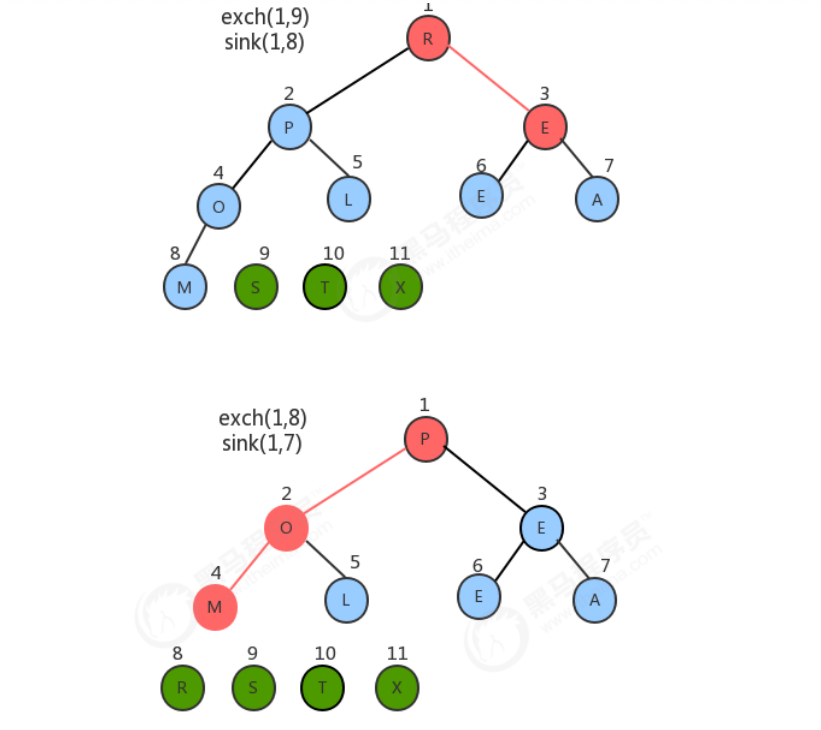


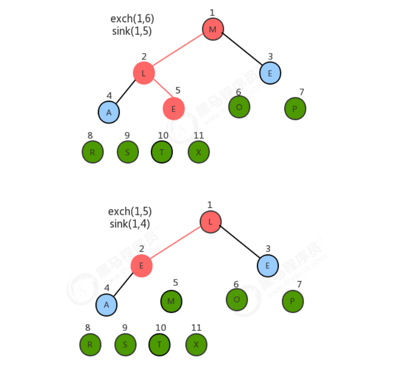

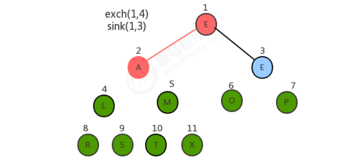

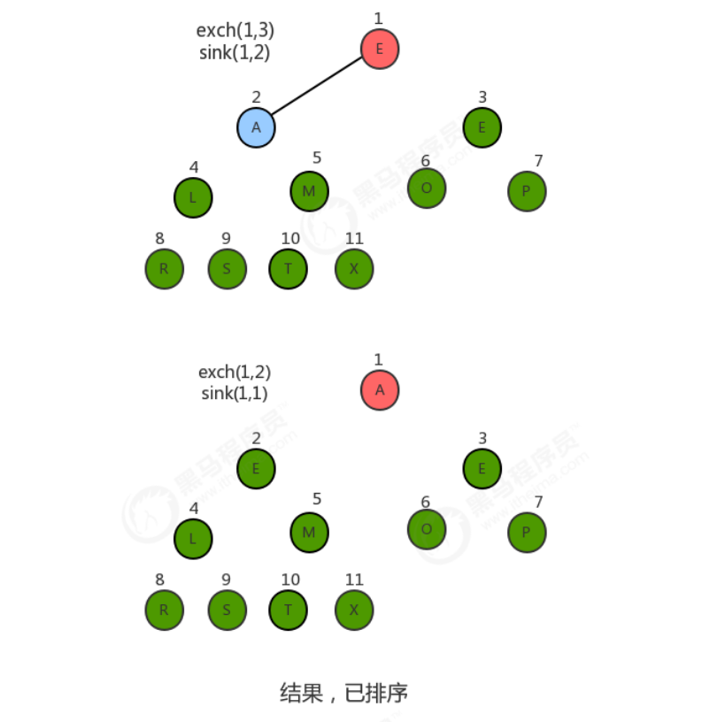

**<font style="color:rgb(51,51,51);">代码： </font>**

```java
//对排序代码 
public class HeapSort { 
	//对source数组中的数据从小到大排序 
	public static void sort(Comparable[] source) { 

        //1.创建一个比原数组大1的数组 
		Comparable[] heap = new Comparable[source.length + 1]; 
		//2.构造堆 
		createHeap(source,heap); 
		//3.堆排序 
		//3.1定义一个变量，记录heap中未排序的所有元素中最大的索引 
		int N = heap.length-1; 
		while(N!=1){ 
			//3.2交换heap中索引1处的元素和N处的元素 
			exch(heap,1,N); 
			N--; 
			//3.3对索引1处的元素在0~N范围内做下沉操作 
			sink(heap,1,N); 
		} 
		//4.heap中的数据已经有序，拷贝到source中 
		System.arraycopy(heap,1,source,0,source.length); 
	} 

    //根据原数组source，构造出堆heap 
	private static void createHeap(Comparable[] source, Comparable[] heap) { 
		//1.把source中的数据拷贝到heap中，从heap的1索引处开始填充 
		System.arraycopy(source,0,heap,1,source.length); 
		//2.从heap索引的一半处开始倒叙遍历，对得到的每一个元素做下沉操作 
		for (int i = (heap.length-1)/2; i>0 ; i--) { 
			sink(heap,i,heap.length-1); 
		} 
	} 

    //判断heap堆中索引i处的元素是否小于索引j处的元素 
	private static boolean less(Comparable[] heap, int i, int j) { 
		return heap[i].compareTo(heap[j])<0; 
	} 

    //交换heap堆中i索引和j索引处的值 
	private static void exch(Comparable[] heap, int i, int j) { 
		Comparable tmp = heap[i]; 
		heap[i] = heap[j]; 
		heap[j] = tmp; 
	} 

    //在heap堆中，对target处的元素做下沉，范围是0~range 
	private static void sink(Comparable[] heap, int target, int range){ 
		//没有子结点了 
		while (2*target<=range){ 
			//1.找出target结点的两个子结点中的较大值 
			int max=2*target; 
			if (2*target+1<=range){ 
				//存在右子结点 
				if (less(heap,2*target,2*target+1)){ 
					max=2*target+1; 
				} 
			} 
			//2.如果当前结点的值小于子结点中的较大值，则交换 
			if(less(heap,target,max)){ 
				exch(heap,target,max); 
			} 
			//3.更新target的值 
			target=max; 
		} 
	} 
} 

//测试代码 
public class Test { 
	public static void main(String[] args) throws Exception { 
		String[] arr = {"S", "O", "R", "T", "E", "X", "A", "M", "P", "L", "E"}; 
		HeapSort.sort(arr); 
		System.out.println(Arrays.toString(arr)); 
	} 
} 
```


