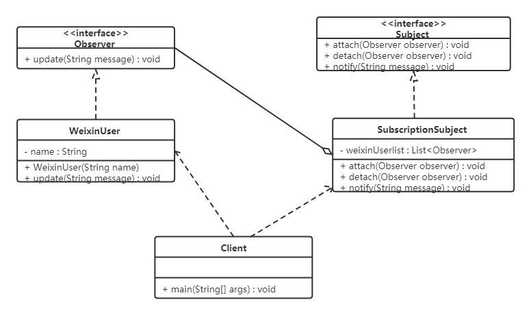

**<font style="color:#DF2A3F;">笔记来源：</font>**[**<font style="color:#DF2A3F;">黑马程序员Java设计模式详解， 23种Java设计模式（图解+框架源码分析+实战）</font>**](https://www.bilibili.com/video/BV1Np4y1z7BU?p=2&vd_source=e8046ccbdc793e09a75eb61fe8e84a30)

# 1 概述
**定义：**又被称为发布-订阅（Publish/Subscribe）模式，它定义了一种一对多的依赖关系，让多个观察者对象同时监听某一个主题对象。这个主题对象在状态变化时，会通知所有的观察者对象，使他们能够自动更新自己。


# 2 结构
在观察者模式中有如下角色：

+ Subject：抽象主题（抽象被观察者），抽象主题角色把所有观察者对象保存在一个集合里，每个主题都可以有任意数量的观察者，抽象主题提供一个接口，可以增加和删除观察者对象。
+ ConcreteSubject：具体主题（具体被观察者），该角色将有关状态存入具体观察者对象，在具体主题的内部状态发生改变时，给所有注册过的观察者发送通知。
+ Observer：抽象观察者，是观察者的抽象类，它定义了一个更新接口，使得在得到主题更改通知时更新自己。
+ ConcrereObserver：具体观察者，实现抽象观察者定义的更新接口，以便在得到主题更改通知时更新自身的状态。


# 3 案例实现
【例】微信公众号

在使用微信公众号时，大家都会有这样的体验，当你关注的公众号中有新内容更新的话，它就会推送给关注公众号的微信用户端。我们使用观察者模式来模拟这样的场景，微信用户就是观察者，微信公众号是被观察者，有多个的微信用户关注了程序猿这个公众号。


类图如下：




代码如下：

定义抽象观察者类，里面定义一个更新的方法

```java
public interface Observer {
    void update(String message);
}
```


定义具体观察者类，微信用户是观察者，里面实现了更新的方法

```java
public class WeixinUser implements Observer {
    // 微信用户名
    private String name;

    public WeixinUser(String name) {
        this.name = name;
    }
    @Override
    public void update(String message) {
        System.out.println(name + "-" + message);
    }
}
```


定义抽象主题类，提供了attach、detach、notify三个方法

```java
public interface Subject {
    //增加订阅者
    public void attach(Observer observer);

    //删除订阅者
    public void detach(Observer observer);
    
    //通知订阅者更新消息
    public void notify(String message);
}
```


微信公众号是具体主题（具体被观察者），里面存储了订阅该公众号的微信用户，并实现了抽象主题中的方法

```java
public class SubscriptionSubject implements Subject {
    //储存订阅公众号的微信用户
    private List<Observer> weixinUserlist = new ArrayList<Observer>();

    @Override
    public void attach(Observer observer) {
        weixinUserlist.add(observer);
    }

    @Override
    public void detach(Observer observer) {
        weixinUserlist.remove(observer);
    }

    @Override
    public void notify(String message) {
        for (Observer observer : weixinUserlist) {
            observer.update(message);
        }
    }
}
```


客户端程序

```java
public class Client {
    public static void main(String[] args) {
        SubscriptionSubject mSubscriptionSubject=new SubscriptionSubject();
        //创建微信用户
        WeixinUser user1=new WeixinUser("孙悟空");
        WeixinUser user2=new WeixinUser("猪悟能");
        WeixinUser user3=new WeixinUser("沙悟净");
        //订阅公众号
        mSubscriptionSubject.attach(user1);
        mSubscriptionSubject.attach(user2);
        mSubscriptionSubject.attach(user3);
        //公众号更新发出消息给订阅的微信用户
        mSubscriptionSubject.notify("传智黑马的专栏更新了");
    }
}
```


# 4 优缺点
**优点：**

+ 降低了目标与观察者之间的耦合关系，两者之间是抽象耦合关系。
+ 被观察者发送通知，所有注册的观察者都会收到信息【可以实现广播机制】


**缺点：**

+ 如果观察者非常多的话，那么所有的观察者收到被观察者发送的通知会耗时
+ 如果被观察者有循环依赖的话，那么被观察者发送通知会使观察者循环调用，会导致系统崩溃


# 5 使用场景
+ 对象间存在一对多关系，一个对象的状态发生改变会影响其他对象。
+ 当一个抽象模型有两个方面，其中一个方面依赖于另一方面时。


# 6 JDK中提供的实现
在 Java 中，通过 java.util.Observable 类和 java.util.Observer 接口定义了观察者模式，只要实现它们的子类就可以编写观察者模式实例。


**Observable类**

Observable 类是抽象目标类（被观察者），它有一个 Vector 集合成员变量，用于保存所有要通知的观察者对象，下面来介绍它最重要的 3 个方法。

+  void addObserver(Observer o) 方法：用于将新的观察者对象添加到集合中。 
+  void notifyObservers(Object arg) 方法：调用集合中的所有观察者对象的 update方法，通知它们数据发生改变。通常越晚加入集合的观察者越先得到通知。 
+  void setChange() 方法：用来设置一个 boolean 类型的内部标志，注明目标对象发生了变化。当它为true时，notifyObservers() 才会通知观察者。 


**Observer 接口**

Observer 接口是抽象观察者，它监视目标对象的变化，当目标对象发生变化时，观察者得到通知，并调用 update 方法，进行相应的工作。

【例】警察抓小偷

警察抓小偷也可以使用观察者模式来实现，警察是观察者，小偷是被观察者。代码如下：

小偷是一个被观察者，所以需要继承Observable类

```java
public class Thief extends Observable {

    private String name;

    public Thief(String name) {
        this.name = name;
    }
    
    public void setName(String name) {
        this.name = name;
    }

    public String getName() {
        return name;
    }

    public void steal() {
        System.out.println("小偷：我偷东西了，有没有人来抓我！！！");
        super.setChanged(); //changed  = true
        super.notifyObservers();
    }
}
```


警察是一个观察者，所以需要让其实现Observer接口

```java
public class Policemen implements Observer {

    private String name;

    public Policemen(String name) {
        this.name = name;
    }
    public void setName(String name) {
        this.name = name;
    }

    public String getName() {
        return name;
    }

    @Override
    public void update(Observable o, Object arg) {
        System.out.println("警察：" + ((Thief) o).getName() + "，我已经盯你很久了，你可以保持沉默，但你所说的将成为呈堂证供！！！");
    }
}
```


客户端代码

```java
public class Client {
    public static void main(String[] args) {
        //创建小偷对象
        Thief t = new Thief("隔壁老王");
        //创建警察对象
        Policemen p = new Policemen("小李");
        //让警察盯着小偷
        t.addObserver(p);
        //小偷偷东西
        t.steal();
    }
}
```


