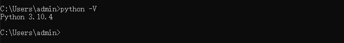

**<font style="color:#DF2A3F;">笔记来源：</font>**[**<font style="color:#DF2A3F;">黑马程序员python教程，8天python从入门到精通，学python看这套就够了</font>**](https://www.bilibili.com/video/BV1qW4y1a7fU/?spm_id_from=333.337.search-card.all.click&vd_source=e8046ccbdc793e09a75eb61fe8e84a30)

**<font style="color:#DF2A3F;"></font>**

**<font style="color:#DF2A3F;">前言：原生资料</font>**

[资料.zip](https://www.yuque.com/attachments/yuque/0/2023/zip/22334924/1688349224870-31f87d57-16ee-4675-9063-e98fc966b44e.zip)

# 1 初识Python
1989年，为了打发圣诞节假期，Gudio van Rossum吉多· 范罗苏姆（龟叔）决心开发一个新的解释程序（Python雏形）1991年，第一个Python解释器诞生Python这个名字，来自龟叔所挚爱的电视剧Monty Python's Flying Circus

为什么选择Python？

+ 优雅
    - 简单
    - 易学
    - 开发效率高
+ 适用面广
    - 大数据开发：基于Python完成大数据任务开发

# 2 什么是编程语言
首先，不管Python，我们先明白，什么是编程语言？


What is programming language?

语言：进行沟通交流的表达方式


人类翻译官无法沟通，那要怎么做才能和计算机交流呢？编程语言

以Python为例


总结：

1. 什么是编程语言？人类和计算机交流的一种专有领域语言

2. 编程语言的工作原理？想法转换为编程语言代码通过翻译官（解释器）翻译成二进制提交计算机执行

# 3 Python安装
## 3.1 下载
下载地址：

[Download Python](https://www.python.org/downloads/)


## 3.2 安装
Linux参考下面这篇文章

[Linux上安装Python](https://www.yuque.com/chenguang201/ubmq0x/mtam3g)

Windows安装一路点击下一步即可。

## 3.3 验证


# 4 第一个Python程序
向世界说你好，应该是全世界，所有程序员入门编程语言时，都会选择的第一个程序。让我们也延续这一份来自程序员之间的浪漫，学习如何使用Python，向世界说你好。我们的Python代码非常简单，如下：

```python
print(“Hello World!!!”)
```

含义：向屏幕上输出（显示）`Hello World!!!`

注意：输入的双引号和括号，请使用英文符号哦

打开CMD（命令提示符）程序，输入Python并回车然后，在里面输入代码回车即可立即执行


# 5 Python解释器
首先，一个基本原理是：计算机只认识二进制，即：0和1


其实很简单，计算机是不会认识Python代码的。但是Python有解释器程序，如下图


安装Python环境，本质上，就是在电脑中，安装Python解释器程序，代码随时可以写，但能不能运行，就要看电脑里面有没有解释器程序了。

Python解释器，是一个计算机程序，用来翻译Python代码，并提交给计算机执行。所以，它的功能很简单，就2点：

1. 翻译代码

2. 提交给计算机运行

解释器我明白了，可是解释器在哪呢？

解释器存放在：`<Python安装目录>/python.exe`


我们在CMD（命令提示符）程序内，执行的python，就是上图的python.exe程序哦


思考一下：在python解释器程序内，我们发现，写完一行代码并回车后，会直接运行他。问题来了：我们能否写好多行代码，一次性的运行呢？那，肯定是：可以的

我们可以将代码，写入一个以`.py`结尾的文件中，使用python命令去运行它。如，在Windows系统的D盘，我们新建一个名为`test.py`的文件，并通过记事本程序打开它，输入内容，使用python命令，运行它。

# 6 Python开发工具
Python程序的开发有许多种方式，一般我们常见的有：

+ Python解释器环境内，执行单行代码
+ 使用Python解释器程序，执行Python代码文件
+ 使用第三方IDE（集成开发工具），如PyCharm软件，开发Python程序

最常用的就是使用PyCharm软件进行开发

PyCharm集成开发工具（IDE）是当下全球Python开发者，使用最频繁的工具软件。绝大多数的Python程序，都是在PyCharm工具内完成的开发。本次课程全程基于PyCharm软件工具，来讲解Python。

首先，我们先下载并安装它：

[Download PyCharm: Python IDE for Professional Developers by JetBrains](https://www.jetbrains.com/pycharm/download/#section=windows)


写出第一个程序


