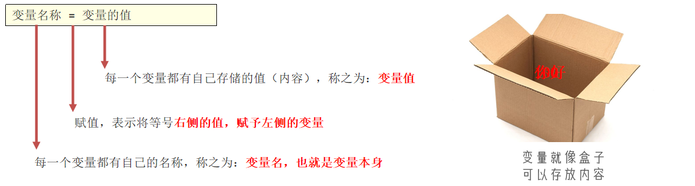
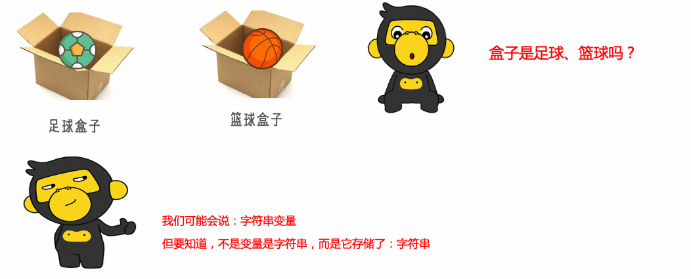
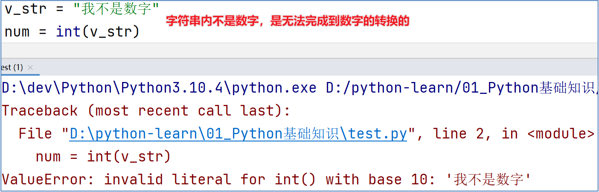
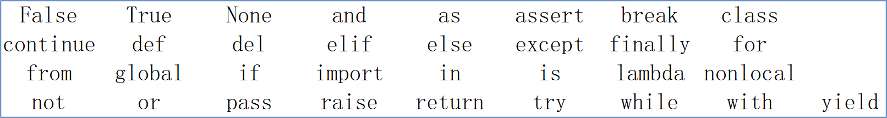

**<font style="color:#DF2A3F;">笔记来源：</font>**[**<font style="color:#DF2A3F;">黑马程序员python教程，8天python从入门到精通，学python看这套就够了</font>**](https://www.bilibili.com/video/BV1qW4y1a7fU/?spm_id_from=333.337.search-card.all.click&vd_source=e8046ccbdc793e09a75eb61fe8e84a30)

# 1 字面量
什么是字面量？

字面量：在代码中，被写下来的的固定的值，称之为字面量


Python中常用的有6种值（数据）的类型

| **<font style="color:#000000;">类型</font>** | **<font style="color:#000000;">描述</font>** | **<font style="color:#000000;">说明</font>** |
| :--- | :--- | :--- |
| <font style="color:#000000;">数字（Number）</font> | <font style="color:#000000;">支持：</font><br/>+ <font style="color:#000000;">整数（int）</font><br/>+ <font style="color:#000000;">浮点数（float）</font><br/>+ <font style="color:#000000;">复数（complex）</font><br/>+ <font style="color:#000000;">布尔（bool）   </font> | <font style="color:#ff0000;">整数（int）</font><font style="color:#000000;">，如：10、-10</font> |
| | | <font style="color:#ff0000;">浮点数（float）</font><font style="color:#000000;">，如：13.14、-13.14</font> |
| | | <font style="color:#000000;">复数（complex），如：4+3j，以j结尾表示复数</font> |
| | | <font style="color:#000000;">布尔（bool）表达现实生活中的逻辑，即真和假，True表示真，False表示假。True本质上是一个数字记作1，False记作0</font> |
| <font style="color:#000000;">字符串（String）</font> | <font style="color:#000000;">描述文本的一种数据类型</font> | <font style="color:#ff0000;">字符串（</font><font style="color:#ff0000;">string</font><font style="color:#ff0000;">）由任意数量的字符组成</font> |
| <font style="color:#000000;">列表（</font><font style="color:#000000;">List</font><font style="color:#000000;">）</font> | <font style="color:#000000;">有序的可变序列</font> | <font style="color:#000000;">Python</font><font style="color:#000000;">中使用最频繁的数据类型，可有序记录一堆数据</font> |
| <font style="color:#000000;">元组（</font><font style="color:#000000;">Tuple</font><font style="color:#000000;">）</font> | <font style="color:#000000;">有序的</font><font style="color:#000000;">不可变序列</font> | <font style="color:#000000;">可有序记录一堆不可变的</font><font style="color:#000000;">Python</font><font style="color:#000000;">数据集合</font> |
| <font style="color:#000000;">集合（</font><font style="color:#000000;">Set</font><font style="color:#000000;">）</font> | <font style="color:#000000;">无序不重复集合</font> | <font style="color:#000000;">可无序记录一堆不重复的</font><font style="color:#000000;">Python</font><font style="color:#000000;">数据集合</font> |
| <font style="color:#000000;">字典（</font><font style="color:#000000;">Dictionary</font><font style="color:#000000;">）</font> | <font style="color:#000000;">无序</font><font style="color:#000000;">Key-Value</font><font style="color:#000000;">集合</font> | <font style="color:#000000;">可无序记录一堆</font><font style="color:#000000;">Key-Value</font><font style="color:#000000;">型的</font><font style="color:#000000;">Python</font><font style="color:#000000;">数据集合</font> |


总结：

1. 掌握字面量的含义代码中，被写在代码中的固定的值，称之为字面量
2. 常见的字面量类型我们目前了解：整数、浮点数、字符串这三类即可
3. 如何基于print语句完成各类字面量的输出`print(字面量)`，如：
    1. `print(10)`，输出整数10
    2. `print(13.14)`，输出浮点数13.14
    3. `print("黑马程序员")`，输出字符串：黑马程序员

# 2 注释
注释：在程序代码中对程序代码进行解释说明的文字。

作用：注释不是程序，不能被执行，只是对程序代码进行解释说明，让别人可以看懂程序代码的作用，能够大大增强程序的可读性。


单行注释：以`#`开头，#右边 的所有文字当作说明，而不是真正要执行的程序，起辅助说明作用

多行注释：以一对三个双引号引起来`"""注释内容"""`来解释说明一段代码的作用使用方法

```python
print("hello world!!!")

# 1. 这是一个单行注释

"""
这是一个多行注释
"""
```

# 3 变量
什么是变量？

变量：在程序运行时，能储存计算结果或能表示值的抽象概念。简单的说，变量就是在程序运行时，记录数据用的

变量的定义格式：



```python
"""
变量名 = 变量值
变量名 ：每个变量自己的名称，即变量本身
	= ：表示将等号右侧的值，赋予左侧的变量
变量值 ：每个变量储存的值（内容）
"""
name = "观止" # 示例
```

变量的特征

变量，从名字中可以看出，表示“量”是可变的。所以，<font style="color:#DF2A3F;">变量的特征就是，变量存储的数据，是可以发生改变的</font>。

  
变量的赋值

```python
"""
- 每个变量可以重复赋值
- 每次赋值将覆盖原有值
"""
name = "观止"
print(name) # 输出 观止
name = "study"
print(name) # 输出 study

```

  
总结：

1. 变量是什么，有什么作用？  
变量就是在程序运行时，记录数据用的
2. 变量的定义格式是？  
变量名 = 变量值
3. 变量的特征是？  
变量的值可以改变


# 4 数据类型
<font style="color:#DF2A3F;">变量无类型而数据有类型</font>


可使用 type(变量) 查看数据的类型

```python
# 1.使用print直接输出类型信息

print(type(13.14)) # 输出 <class 'float'>

# 2.使用变量存储type()语句的结果(调用type()有返回值)

int_type = type(521)
print(int_type) # 输出 <class 'int'>

# 3.查看变量中存储的数据类型

name = "观止"
print(type(name)) # 输出 <class 'str'>  str为string简写
```

**<font style="color:#262626;"></font>**

**<font style="color:#262626;">变量有类型吗？</font>**

<font style="color:#262626;">我们通过</font><font style="color:#262626;">type(</font><font style="color:#262626;">变量</font><font style="color:#262626;">)</font><font style="color:#262626;">可以输出类型，这是查看变量的类型还是数据的类型？</font>

<font style="color:#262626;">查看的是：变量存储的数据的类型。因为，变量无类型，但是它存储的数据有。</font>



总结：

1. 使用什么语句可以查看数据的类型？  
type() 
2. 如下代码，name_type变量可以存储变量name的类型信息，是因为？ 

```python
name = "观止"
name_tpye = type(name) # 输出 <class 'str'>  str为string简写
```

因为type()语句会给出结果（返回值）

3. 变量有没有类型？  
没有，字符串变量表示变量存储了字符串而不是表示变量就是字符串


**<font style="color:#262626;">字符串类型的不同定义方式</font>**

<font style="color:black;">字符串有</font><font style="color:black;">3</font><font style="color:black;">种不同的定义方式：</font>

+ <font style="color:black;">双引号定义法："字符串"</font>
+ <font style="color:black;">单引号定义法：'字符串'</font>
+ <font style="color:black;">三引号定义法："""字符串"""</font>

```python
text1="我是字符串"
text2='我也是字符串'
text3="""没想到吧，我也是字符串"""
```

<font style="color:black;">三引号定义法，表示在一堆三个双引号的范围内，均是字符串                                   </font>

<font style="color:black;">要注意的是，包含范围是：</font>**<font style="color:red;">从三个引号开始，到下一个三个引号结束</font>**

# 5 数据类型转换
在特定的场景下，数据类型之间是可以相互转换的

**<font style="color:#262626;"></font>**

**<font style="color:#262626;">为什么要转换类型？</font>**

<font style="color:#262626;">数据类型之间，在特定的场景下，是可以相互转换的，如字符串转数字、数字转字符串等，那么，我们为什么要转换它们呢？</font>

<font style="color:black;">数据类型转换，将会是我们以后经常使用的功能。如：</font>

+ <font style="color:black;">从文件中读取的数字，默认是字符串，我们需要转换成数字类型</font>
+ <font style="color:black;">后续学习的input()语句，默认结果是字符串，若需要数字也需要转换</font>
+ <font style="color:black;">将数字转换成字符串用以写出到外部系统</font>
+ <font style="color:black;">等等</font>

<font style="color:black;">用途很多，那么让我们来学习一下如何转换吧。</font>

**<font style="color:#262626;">常见的转换语句</font>**

| 语句（函数） | 说明 |
| :--- | :--- |
| <font style="color:black;">int(x)</font> | <font style="color:black;">将x转换为一个整数</font> |
| <font style="color:black;">float(x)</font> | <font style="color:black;">将x转换为一个浮点数</font> |
| <font style="color:black;">str(x)</font> | <font style="color:black;">将对象 x 转换为字符串</font> |


<font style="color:#000000;">同前面学习的type()语句一样，这三个语句，都是带有结果的（返回值），我们可以用print直接输出，或用变量存储结果值</font>

**<font style="color:#262626;"></font>**

**<font style="color:#262626;">类型转换注意事项</font>**

类型转换不是万能的，毕竟强扭的瓜不会甜，我们需要注意：

1. **<font style="color:#000000;">任何类型，都可以通过str()，转换成字符串</font>**
2. **<font style="color:#000000;">字符串内必须真的是数字，才可以将字符串转换为数字</font>**




**转为整数**  
使用 int(x) ，将x转换为一个整数

```python
# 2. 字符串转为整数
num = "666"
print(int(num)) # 输出 666
print("初始值类型：", type(num), ",转换后类型：", type(int(num)))
# 3. 输出 初始值类型： <class 'str'> ,转换后类型： <class 'int'>

# 4. 将浮点数转为小数
# 5. 会导致精度丢失，即小数点后面的部分
print(int(13.14)) # 输出 13
```


**转为浮点数**  
使用 float(x) ，将x转换为一个浮点数

```python
# 6. 字符串转浮点数
num = "5.21"
print(float(num)) # 输出 5.21
print("初始值类型：", type(num), ",转换后类型：", type(float(num)))
# 7. 输出 初始值类型： <class 'str'> ,转换后类型： <class 'float'>

# 8. 整数转浮点数
# 9. 进行补.0
print(float(5)) # 输出 5.0
```

  
**转为字符串**

```python
# 10. 使用 str(x) ，将x转换为一个字符串
num = 13.14
print(str(num)) # 输出 13.14
print("初始值类型：", type(num), ",转换后类型：", type(str(num)))
# 11. 输出 初始值类型： <class 'float'> ,转换后类型： <class 'str'>
```

  
**小结**

+ 同前面学习的type()语句一样，这三个语句，都是带有结果的(返回值)，可以用print直接输出或用变量存储结果值输出。
+ 任何类型，都可以通过str()，转换成字符串。
+ 字符串内必须真的是数字，才可以将字符串转换为数字，否则会报错。

# 6 标识符
<font style="color:#262626;">在</font><font style="color:#262626;">Python</font><font style="color:#262626;">程序中，我们可以给很多东西起名字，比如：</font>

+ <font style="color:#404040;"></font><font style="color:#262626;">变量的名字</font>
+ <font style="color:#404040;"></font><font style="color:#262626;">方法的名字</font>
+ <font style="color:#404040;"></font><font style="color:#262626;">类的名字,等等</font>

<font style="color:#262626;">这些名字，我们把它统一的称之为标识符，用来做内容的标识。</font>

<font style="color:#262626;">所以，标识符：是用户在编程的时候所使用的一系列名字，用于给变量、类、方法等命名。</font>


**命名规则**

+ **内容限制**  
标识符命名中，只允许出现这四类元素，其余任何内容都不被允许。
    - 英文
    - 中文 （不推荐使用）
    - 数字 （不可以作为开头）
    - 下划线（_）

```latex
√ a         × 1
√ a_b				× 1_		
√ _a				× 1_a
√ _a_b	    × &a
√ a2				× )a	
√ a_b_2			× !a
```

+ **大小写敏感**  
字母a的大写和小写，是完全能够区分的。

```python
uan = "study1"
Guan = "study2"
print(guan) # 输出 study1
print(Guan) # 输出 study2
```

+ 不可使用关键字  
在Python内部有特定用途，不可以使用它们作为标识符（不需要记，误用时编译器会报错）




**命名规范**

<font style="color:black;">学完了标识符（变量、类、方法）的命名</font>**<font style="color:red;">规则</font>**<font style="color:black;">后，我们在来学习标识符的命名</font>**<font style="color:red;">规范</font>**<font style="color:black;">。</font>

+ <font style="color:black;">变量名</font>
+ <font style="color:black;">类名</font>
+ <font style="color:black;">方法名</font>

<font style="color:black;">不同的标识符，有不同的规范。</font>

变量的命名规范

+ 见名知意（尽量做到，看到名字，就知道是什么意思）

```python
name = "观止"
```

+ 下划线命名法（多个单词组合变量名，要使用下划线做分隔）

```python
student_name = "观止"
```

+ 英文字母全小写（竟然不推荐使用驼峰）

```python
√ name = "观止"
× Name = "观止"
```

  
小结

+ 不遵守规则：会出现问题
+ 不遵守规范：不太高级

# 7 运算符
## 7.1  算数(数学)运算符
| 运算符 | 描述 | 实例 |
| --- | --- | --- |
| + | 加 | 两个对象相加 a + b 输出结果 30 |
| - | 减 | 得到负数或是一个数减去另一个数 a - b 输出结果 -10 |
| * | 乘 | 两个数相乘或是返回一个被重复若干次的字符串 a * b 输出结果 200 |
| / | 除 | b / a 输出结果 2 |
| // | 取整除 | 返回商的整数部分 9//2 输出结果 4 , 9.0//2.0 输出结果 4.0 |
| % | 取余 | 返回除法的余数 b % a 输出结果 0 |
| ** | **指数** | **a**<sup>******</sup>b为10的20次方， 输出结果 100000000000000000000 |


```python
print("加：", 1 + 1)  # 输出 加：2
print("减：", 10 - 1)  # 输出 减：9
print("乘：", 2 * 5)  # 输出 乘：10
print("除：", 5 / 4)  # 输出 除：1.25
print("整数除：", 5 // 4)  # 输出 整数除：1
print("取余：", 5 % 4)  # 输出 取余：1
print("指数：", 2 ** 3)  # 输出 指数：8
```

## 7.2  赋值运算符
| 运算符 | 描述 | 实例 |
| --- | --- | --- |
| = | 赋值运算符 | 把 = 号右边的结果 赋给 左边的变量，如 num = 1 + 2 * 3，结果num的值为7 |


## 7.3  复合运算符
| 运算符 | 描述 | 实例 |
| --- | --- | --- |
| += | 加法赋值运算符 | c += a 等效于 c = c + a |
| -= | 减法赋值运算符 | c -= a 等效于 c = c - a |
| *= | 乘法赋值运算符	 | c *= a 等效于 c = c * a |
| /= | 除法赋值运算符 | c /= a 等效于 c = c / a |
| %= | 取模赋值运算符 | c %= a 等效于 c = c % a |
| **= | 幂赋值运算符 | c **= a 等效于 c = c ** a |
| //= | 取整除赋值运算符 | c //= a 等效于 c = c // a |


```python
num = 2
num += 1  # 等效于 num = num + 1
print(num)  # 输出 3
```

# 8 字符串扩展知识
三种定义方式

+ 单引号定义法：`name = '观止blog'`
+ 双引号定义法：`name = "观止blog"`
+ 三引号定义法：`name = """观止blog"""`

<font style="color:#262626;">三引号定义法，和多行注释的写法一样，同样支持换行操作。</font>

<font style="color:#262626;">使用变量接收它，它就是字符串</font>

<font style="color:#262626;">不使用变量接收它，就可以作为多行注释使用。</font>  
  
**字符串引号嵌套**  
如果想要定义的字符串本身是包含单引号、双引号可通过

+ 单引号定义法，可以内含双引号

```python
name = '观"study"止'
print(name) # 输出 观"study"止
```

+ 双引号定义法，可以内含单引号

```python
name = "观'study'止"
print(name) # 输出 观'study'止
```

+ 可以使用转移字符（\）来将引号解除效用，变成普通字符串

```python
name = '观\'study\'止'
print(name) # 输出 观'study'止
```

  
**字符串的拼接**  
可以将两个字符串通过+号将其拼接成一个字符串 或者 将字面量和变量或变量和变量之间进行使用拼接

```python
print("观止" + "study") # 输出 观止study

name = "study"
print("观止" + name)  # 输出 观止study
```

缺点：

+ 字符串无法和非字符串变量进行拼接因为类型不一致，无法接上
+ 变量过多，拼接起来实在是太麻烦了
+ 字符串无法和数字或其它类型完成拼接。

****

**字符串格式化方式一**  
完成字符串和变量的快速拼接

+ % 右边变量的值替换 %s （“%占位符” % 变量）

```python
name = "study"
message = "观止 %s" % name
print(message)  # 输出 观止 study
```

%  表示：我要占位

s  表示：将变量变成字符串放入占位的地方

+ 多个变量占位变量要用括号括起来并按照占位的顺序填入

```python
hobby = "study"
name = "观止"
message = "爱好 %s ,姓名 %s" % (hobby, name)
print(message)  # 输出 爱好 study ,姓名 19
```

+ 可以完成字符串、整数、浮点数，三种不同类型变量的占位

| 格式符号 | 转化 |
| --- | --- |
| %s | 将内容转换成字符串，放入占位位置 |
| %d | 将内容转换成整数，放入占位位置 |
| %f | 将内容转换成浮点型，放入占位位置 |


```python
name = "study"
age = 19
money = 1.00
message = "姓名:%s,年龄:%d,家当：%f" % (name, age, money)
print(message)  # 输出 姓名:study,年龄:19,家当：1.000000
```

  
**格式化的精度控制**  
我们可以使用辅助符号`m.n`来控制数据的宽度和精度

+ `m`控制宽度，要求是数字（很少使用）,设置的宽度小于数字自身，不生效
+ `.n`控制小数点精度，要求是数字，会进行小数的四舍五入

```python
age = 18  # %5d 表示将整数的宽度控制在5位,用三个空格补足宽度
money = 1.00  # %.2f 将小数点精度设置为2位
message = "观止%5d,身价：%.2f" % (age, money)
print(message)  # 输出 观止   18,身价：1.00
```

  
字符串格式化方式二  
通过语法：`f"内容{变量}"`的格式来快速格式化

```python
age = 18
money = 1.00
message = f"观止:{age},身价：{money}"
print(message)  # 输出 观止:18,身价：1.0
```

适用于快速格式化字符串，缺点：

+ 无法做做精度控制
+ 不理会数据类型

**对表达式进行格式化**  
表达式：一条具有明确执行结果的代码语句

+ `1 + 1`和`5 * 2`，就是表达式，因为有具体的结果，结果是一个数字
+ `name = "张三"`
+ age = 11 + 11

上式等号右侧的都是表达式，因为它们有具体的结果，结果赋值给了等号左侧的变量。

在无需使用变量进行数据存储的时候，可以直接格式化表达式，简化代码

```python
print(f"观止:{2022 - 2003}")  # 输出 观止:18
print("观止:%d" % (2022 - 2003))  # 输出 观止:18
```

# 9 数据输入
使用input()语句可以从键盘获取输入


+ 数据输出：print :可以完成将内容（字面量、变量等）输出到屏幕上。
+ 数据输入：input :可以用来获取键盘输入


```python
name = input() # 输入 观止  用name变量来接收输入的数值
print(name)  # 输出name储存的数值 观止
```

  
可在input()中输入提示信息，将打印在控制台

```python
name = input("tell me your name?")
#会在控制台打印tell me your name? 然后可输入 观止
print(name)  # 输出name储存的数值 观止
```

  
输入的数值都将转为字符串类型，可通过数据类型转换获取需要的数据类型

```python
name = input() # 输入 5
print(type(name)) # 输出 <class 'str'>
print(type(int(name))) # 输出 <class 'int'>
```

