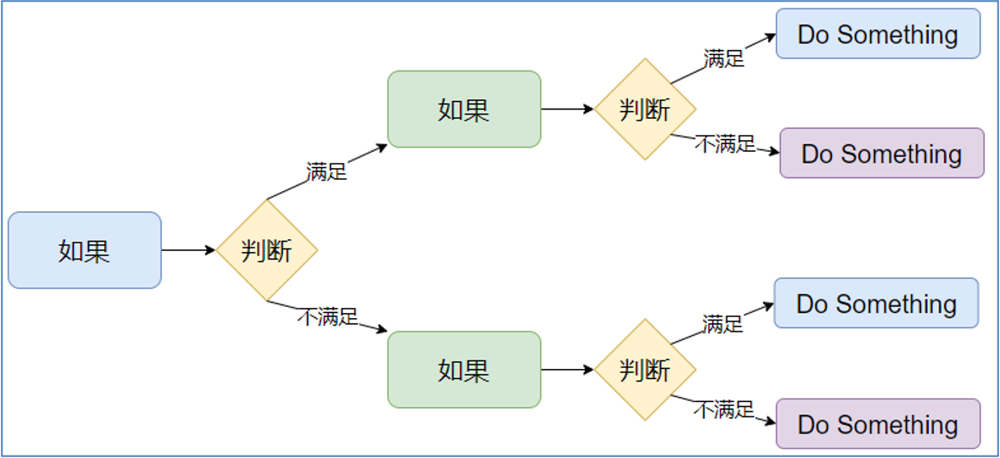

**<font style="color:#DF2A3F;">笔记来源：</font>**[**<font style="color:#DF2A3F;">黑马程序员python教程，8天python从入门到精通，学python看这套就够了</font>**](https://www.bilibili.com/video/BV1qW4y1a7fU/?spm_id_from=333.337.search-card.all.click&vd_source=e8046ccbdc793e09a75eb61fe8e84a30)


# 1 布尔类型
用来表达现实生活中的逻辑，即真与假


定义

```python
# 12. 定义布尔类型的字面量：

True  表示真（是、肯定）
False 表示假 （否、否定）

# 13. True本质上是一个数字记作1，False记作0
```


获取

+ 可自行定义

```python
# 14. 变量名称 = 布尔类型字面量

name = True
name = False
```

+ 可以通过使用比较运算符进行比较运算得到布尔类型的结果

| 运算符 | 描述 | 示例 |
| --- | --- | --- |
| == | 判断内容是否相等，满足为True，不满足为False | 如a=3,b=3，则(a == b) 为 True |
| != | 判断内容是否不相等，满足为True，不满足为False | 如a=1,b=3，则(a != b) 为 True |
| > | 判断运算符左侧内容是否大于右侧 满足为True，不满足为False | 如a=7,b=3，则(a > b) 为 True |
| < | 判断运算符左侧内容是否小于右侧 满足为True，不满足为False | 如a=3,b=7，则(a < b) 为 True |
| >= | 判断运算符左侧内容是否大于等于右侧 满足为True，不满足为False | 如a=3,b=3，则(a >= b) 为 True |
| <= | 判断运算符左侧内容是否小于等于右侧 满足为True，不满足为False | 如a=3,b=3，则(a <= b) 为 True |


注：

+ == 为比较运算符
+ = 为赋值运算符

切不可以混用

```python
bool_name = "观止" == "观止"
bool_age = 19 <= 18
print(f"年龄{bool_age}") # 输出 年龄 False
print(f"姓名{bool_name}") # 输出 姓名 True
print(f"数据类型{type(bool_age)}") # 输出 数据类型<class 'bool'>
```

# 2 逻辑运算符
| 逻辑运算符 | 含义 | 使用示例 | 说明 |
| --- | --- | --- | --- |
| and | 逻辑与运算，等价于数学中的“且”	 | a and b | 当 a 和 b 两个表达式都为真时，a and b 的结果才为真，否则为假。 |
| or | 逻辑或运算，等价于数学中的“或” | a or b | 当 a 和 b 两个表达式都为假时，a or b 的结果才是假，否则为真。 |
| not | 逻辑非运算，等价于数学中的“非” | not a	 | 如果 a 为真，那么 not a 的结果为假；<br/>如果 a 为假，那么 not a 的结果为真。相当于对 a 取反。 |


+ 在python当中，以下变量都会被当成False：任何数值类型的0、""或’'空字符串、空元组()、空列表[]、空字典{}等。
+ and和or运算符会将其中一个表达式的值作为最终结果，而不是将 True 或者 False 作为最终结果
+ 当遇到一个语句当中有多个逻辑运算符时，按照优先级 not > and > or 顺序来运算	


**and运算符**

+ 两边都是表达式：and两边的表达式都为真时,才为真,否则为假。

```python
print(15 > 10 and 15 > 6)  # 打印 True
print(15 > 10 and 15 < 6)  # 打印 False
```

+ 不全是表达式：
    - 左边表达式的值为假,左边表达式的值作为最终结果。
    - 左边表达式的值为真，右边表达式的值作为最终结果。

```python
print({} and 15)  # 打印 {}
print(6 and 15)  # 打印 15
```

  
**or 运算符**

+ 两边都是表达式：or两边的表达式只要有一个真即为真，否则为假

```python
print(15 > 10 or 15 > 6)  # 打印 True
print(15 > 10 or 15 < 6)  # 打印 True
print(15 < 10 or 15 < 6)  # 打印 False
```

+ 不全是表达式
    - 左边表达式的值为假，右边表达式的值作为最终结果。
    - 左边表达式的值为真，左边表达式的值作为最终结果。

```python
print({} or 15)  # 打印 15
print(6 or 15)  # 打印 6
```

  
**not 运算符**  
当表达式为真时，运算结果就为假；当表达式为假时，运算结果为真。not可以理解为取反的意思

```python
print(not 16 > 9)  # 打印 False
print(not 16 < 9)  # 打印 True
```

# 3 if 判断语句
条件为True 执行，条件为False跳过

**基本格式**

```python
if 要判断的条件:
	条件为True时执行该语句

# 15. if与判断条件之间至少保留一个空格
# 16. 判断条件后方需要加冒号:
# 17. 执行语句前必须有四个空格
```

示例代码：

```python
# 18. 判断条件为 True,输出 您已成年
age = 19
if age > 18:
    print("您已成年")
# 19. 判断条件为 False 无输出
if age > 30:
    print("观止")
    print("study")

```

  
**if-else 格式**

```python
if 要判断的条件:
	条件为True时执行该处语句
else:
	条件为False时执行该处语句

# 20. if部分写法不变
# 21. else 后不需要再写条件，但需要冒号:
# 22. else 需与if对齐
```

示例代码：

```python
age = 19
if age > 18:
    print("您已成年")
else:
    print("您未成年")
# 23. 条件为True，执行if下方的 输出 您已成年

```

**if-elif-else 格式**

```python
if 判断的条件:
	条件为True时执行
elif 判断的条件:
	条件为True时执行
elif 判断的条件:
	条件为True时执行
else:
	上述条件都为False时执行

# 24. elif语法与if类似
# 25. if/else之间可以包含多个elif
# 26. else语句可以不写
```

示例代码

```python
# 27. age都不满足，执行else分支 输出 welcome
age = 1
if age > 10:
    print("观止")
elif age < 0:
    print("study")
elif age > 2:
    print("blog")
else:
    print("welcome")
# 28. 判断是互斥且有序的，上面条件满足后面的就不会判断执行了

```

**判断语句的嵌套**  
当满足前置条件时进行二次判断



```python
if 判断的条件:
	条件为True时执行
	if 判断的条件:
		条件为True时执行
	else:
		条件为False时执行
else:
	条件为False时执行
	if 判断的条件:
		条件为True时执行
	else:
		条件为False时执行

# 29. 嵌套的关键点在于：空格缩进
# 30. 通过空格缩进，来决定语句之间的：层次关系
```

示例代码：

```python
age = 20
money = 10
if age < 18:
    print("第一处if")
    if money > 9:
        print("第二处if")
    else:
        print("第二处else")
else:
    print("第一处else")
    if money > 9:
        print("第二处if")
    else:
        print("第二处else")

# 31. 输出        
"""
第一处else
第二处if
"""
# 32. age > 18 进入第一层else
# 33. money > 9,进入第一层第二处if

```

