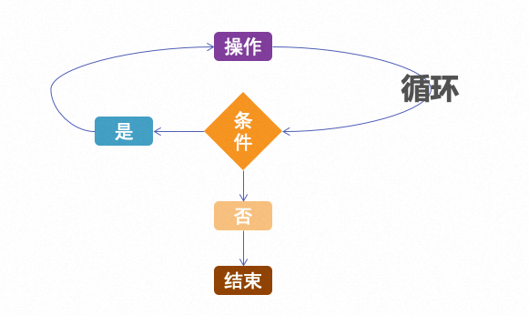
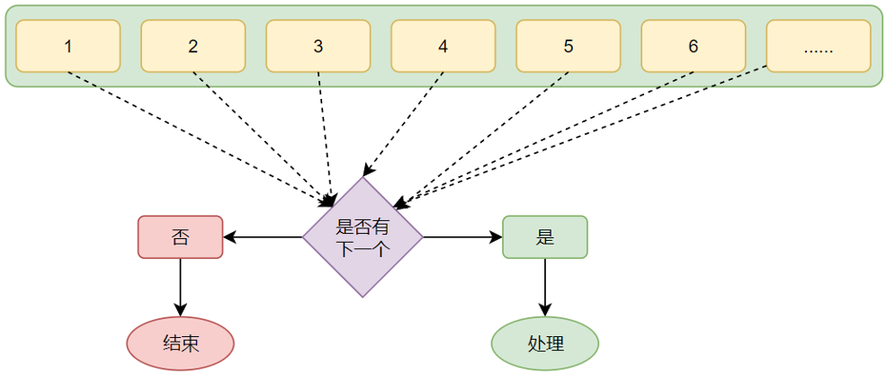

**<font style="color:#DF2A3F;">笔记来源：</font>**[**<font style="color:#DF2A3F;">黑马程序员python教程，8天python从入门到精通，学python看这套就够了</font>**](https://www.bilibili.com/video/BV1qW4y1a7fU/?spm_id_from=333.337.search-card.all.click&vd_source=e8046ccbdc793e09a75eb61fe8e84a30)


# 1 while 循环
条件满足无限执行



定义格式

```python
while 条件：
	条件为True时重复执行

# 34. 写法要求与if语句类似
```

使用示例：

```python
i = 0
while i < 100:
	print("观止study")
	i += 1 # 等效于 i = i + 1

# 35. 需要设置循环终止的条件，如i += 1配合 i < 100，就能确保执行100次后停止，否则将无限循环
# 36. 控制台输出 100次观止study
```

# 2 for 循环
对一批内容进行逐个处理



定义格式

```python
for 临时变量 in 待处理数据集(可迭代对象):
	循环满足条件时执行的代码

# 37. 从待处理数据集中：逐个取出数据赋值给临时变量
```

待处理数据集，也称之为：可迭代类型

可迭代类型指，其内容可以一个个依次取出的一种类型，包括：

+ 字符串
+ 列表
+ 元组等

for循环语句，本质上是遍历：可迭代对象。

使用示例

```python
# 38. 定义字符串name
name = "study"
# 39. for循环处理字符串
for x in name:
    print(x)
# 40. 将字符串的内容：依次取出
# 41. 输出
# 42. s
# 43. t
# 44. u
# 45. d
# 46. y

```

区别 while

+ for循环是无法定义循环条件的。只能从被处理的数据集中，依次取出内容进行处理.
+ 理论上讲，for循环无法构建无限循环（被处理的数据集不可能无限大）


# 3 range语句
用于获得一个简单的数字序列（可迭代类型的一种）。

语法一: range(num)

```python
# 47. 获取一个从0开始，到num结束的数字序列（不含num本身）
# 48. 如range(5)取得的数据是：[0, 1, 2, 3, 4]
for x in range(5):
    print(x)
# 49. 输出
# 0
# 1
# 2
# 3
# 4

```

语法二: range(num1，num2)

```python
# 50. 获得一个从num1开始，到num2结束的数字序列（不含num2本身）
# 51. 如，range(5, 10)取得的数据是：[5, 6, 7, 8, 9]
for x in range(5, 10):
    print(x)
# 52. 输出
# 5
# 6
# 7
# 8
# 9

```

语法三: range(num1, num2, step)

```python
# 53. 获得一个从num1开始，到num2结束的数字序列（不含num2本身）
# 54. 数字之间的步长，以step为准（step默认为1）
# 55. 如，range(5, 10, 2)取得的数据是：[5, 7, 9]
for x in range(5, 10, 2):
    print(x)
# 56. 输出
# 5
# 7
# 9

```

# 4 循环中断
**continue关键字**

临时跳过：暂时跳过本次循环，直接进行下一次

+ 中断本次循环，直接进入下一次循环
+ 可用于for循环和while循环，效果一致
+ 在嵌套循环中只对所在层循环生效

使用示例:

```python
for num in range(5):
    if num == 3:
        continue # 当num=3时跳过后面语句，进行下次循环
    print(num)
# 57. 输出
# 0
# 1
# 2
# 4

```

  
**break关键字**

直接结束：提前退出循环，不再继续

+ 直接结束所在循环
+ 可以用for循环和while循环，效果一致
+ 在嵌套循环中只对所在层循环生效

使用示例:

```python
for num in range(5):
    if num == 3:
        break # 当num=3时提前退出循环，不再继续
    print(num)
# 58. 输出
# 0
# 1
# 2

```

  


