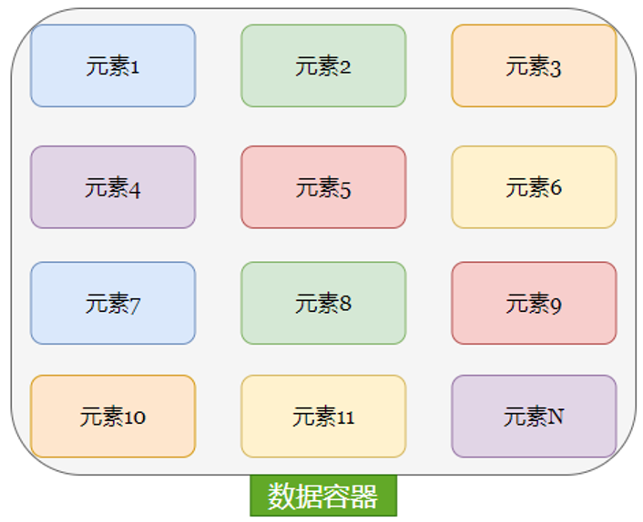
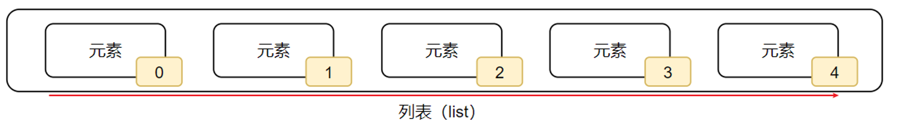
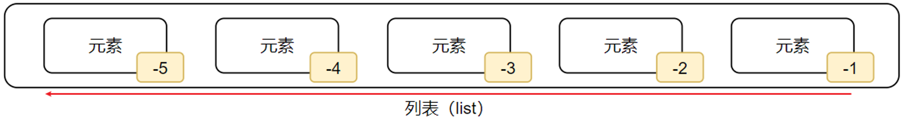
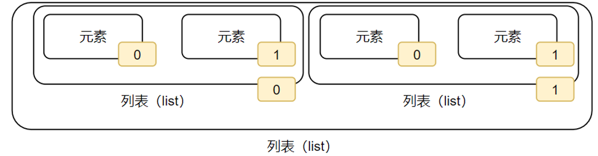

**<font style="color:#DF2A3F;">笔记来源：</font>**[**<font style="color:#DF2A3F;">黑马程序员python教程，8天python从入门到精通，学python看这套就够了</font>**](https://www.bilibili.com/video/BV1qW4y1a7fU/?spm_id_from=333.337.search-card.all.click&vd_source=e8046ccbdc793e09a75eb61fe8e84a30)


# 1 数据容器介绍
一种可以容纳多份数据的数据类型，容纳的每一份数据称之为1个元素

每一个元素，可以是任意类型的据数，如字符串、数字、布尔等

根据特点的不同可分为5类：列表（list）、元组（tuple）、字符串（str）、集合（set）、字典（dict）



# 2 列表(list)
列表内的每一个数据，称之为元素

## 2.1 基本格式
```python
# 114. 定义列表
变量名称 = [元素1, 元素2, 元素3, 元素4, 元素5]
# 115. 定义空列表
变量名称 = []
变量名称 = list()

```

+ 以中括号 [] 作为标识
+ 列表内每一个元素之间用, 逗号隔开
+ 列表可以一次存储多个数据，且可以为不同的数据类型，支持嵌套

使用示例:

```python
my_list_1 = ["观止", 20, True, ["guanzhi", 20]]
my_list_2 = ["观止", 20, True]
print(my_list_2)
print(type(my_list_1))
# 116. 输出
# 117. ['观止', 20, True]
# 118. <class 'list'>

```


## 2.2 列表的下标（索引）
我们可以使用下标索引从列表中取出特定位置的数据

+ 列表中的每一个元素，都有其对应位置下标索引
+ 要注意下标索引的取值范围(有值的位置)，超出范围(没值的位置)无法取出元素，并且会报错
+ 语法：变量 = 列表[下标索引]


### 2.2.1 正向索引


从前向后的方向，从0开始，依次递增

使用示例：

```python
# 119. 语法： 列表[下标索引]
my_list = ["李白", "章北海", "杜甫"]
print(my_list[0]) # 打印 李白
print(my_list[1]) # 打印 章北海
print(my_list[2]) # 打印 杜甫

```

### 2.2.2 反向索引


从后向前：从**-1**开始，依次递减（-1、-2、-3…）

使用示例：

```python
my_list = ["李白", "章北海", "杜甫"]
print(my_list[-1]) # 打印 杜甫
print(my_list[-2]) # 打印 章北海
print(my_list[-3]) # 打印 李白
```


### 2.2.3 嵌套列表的索引


如果列表是嵌套的列表，同样支持下标索引，且用法与上述类似

使用示例：

```python
# 120. 语法： 列表[外层列表下标索引][内层列表下标索引]
my_list = [["李白", "章北海"], ["罗辑", "杜甫"]]
print(my_list[0][0]) # 打印 李白
print(my_list[0][1]) # 打印 章北海
print(my_list[1][0]) # 打印 罗辑
print(my_list[1][1]) # 打印 杜甫

```

## 2.3 列表的常用操作
列表提供了一系列方法：如果将函数定义为class（类）的成员，那么函数称之为：方法

| 使用方式 | 作用 |
| --- | --- |
| 列表.append(元素) | 向列表中追加一个元素 |
| 列表.extend(容器) | 将数据容器的内容依次取出，追加到列表尾部 |
| 列表.insert(下标, 元素)	 | 在指定下标处，插入指定的元素 |
| del 列表[下标] | 删除列表指定下标元素 |
| 列表.pop(下标) | 删除列表指定下标元素 |
| 列表.remove(元素) | 从前向后，删除此元素第一个匹配项 |
| 列表.clear() | 清空列表 |
| 列表.count(元素) | 统计此元素在列表中出现的次数 |
| 列表.index(元素) | 查找指定元素在列表的下标 找不到报错ValueError |
| len(列表)	 | 统计容器内有多少元素 |


不需要硬记下来,有一个模糊印象，知晓有这样的用法,需要的时候，随时查阅资料即可

### 2.3.1 查询元素
查找某元素的下标

查找指定元素在列表的下标，如果找不到，报错ValueError

语法：列表.index(元素)

```python
my_list = ["李白", "章北海", "罗辑", "杜甫"]
print(my_list.index("罗辑")) # 打印 2
print(my_list.index("观止")) # 打印 ValueError: '观止' is not in list

```

### 2.3.2 修改元素
修改特定位置（索引）的元素值

直接对指定下标（正向、反向下标均可）的值进行：重新赋值（修改）

语法一：列表[下标] = 值

```python
my_list = ["李白", "章北海", "罗辑", "杜甫"]
my_list[0] = "观止"
my_list[-1] = "study"
print(my_list) # 打印 ['观止', '章北海', '罗辑', 'study']
```

### 2.3.3 插入元素
在指定的下标位置，插入指定的元素

语法：`列表.insert(下标, 元素)`

```python
my_list = ["李白", "章北海", "罗辑"]
my_list.insert(1, "观止")
print(my_list) # 打印 ['李白', '观止', '章北海', '罗辑']

```

### 2.3.4 追加元素
将指定元素，追加到列表的尾部

语法一：列表.append(元素)

```python
my_list = ["李白", "章北海", "罗辑"]
my_list.append("观止")
print(my_list) # 打印 ['李白', '章北海', '罗辑', '观止']
```

语法一：列表.extend(其它数据容器)  
将其它数据容器的内容取出，依次追加到列表尾部

```python
my_list_1 = ["李白", "章北海"]
my_list_2 = ["罗辑", "观止"]
my_list_1.extend(my_list_2)
print(my_list_1) # 打印 ['李白', '章北海', '罗辑', '观止']

```

### 2.3.5 删除元素
语法一：del 列表[下标]

```python
my_list = ["李白", "章北海", "罗辑"]
del my_list[0]
print(my_list) # 打印 ['章北海', '罗辑']

```

语法二：列表.pop(下标)

```python
my_list = ["李白", "章北海", "罗辑"]
my_list.pop(0)
print(my_list) # 打印 ['章北海', '罗辑']
```

语法三：列表.remove(元素)  
删除某元素在列表中的第一个匹配项

```python
my_list = ["李白", "章北海", "罗辑", "李白"]
my_list.remove("李白")
print(my_list) # 打印 ['章北海', '罗辑', '李白']
```

### 2.3.6 清空列表内容
语法：列表.clear()

```python
my_list = ["李白", "章北海", "罗辑"]
my_list.clear()
print(my_list) # 打印 []
```

### 2.3.7 统计某元素在列表内的数量
语法：列表.count(元素)

```python
my_list = ["李白", "章北海", "罗辑", "李白"]
num = my_list.count("李白")
print(num) # 打印 2
```

### 2.3.8 统计列表内有多少元素
语法：len(列表)

```python
my_list = ["李白", "章北海", "罗辑", "李白"]
print(len(my_list)) # 打印 4
```

## 2.4 列表的遍历
将容器内的元素依次取出进行处理的行为，称之为：遍历、迭代。

可以使用循环遍历列表的元素，通过列表[下标]的方式在循环中取出列表的元素，循环条件为 下标值 < 列表的元素数量

### 2.4.1 while循环遍历
基本格式

```python
index = 0
while index < len(列表):
    元素 = 列表[index]
# 121.   对元素进行处理
    index += 1 

```

使用示例：

```python
my_list = [1,2,3,4]
index = 0
while index < len(my_list):
    num = my_list[index]
    print(num)
    index += 1 
# 122. 输出
# 1
# 2
# 3
# 4

```

### 2.4.2 for循环遍历
依次取出元素并赋值到临时变量上,在每一次的循环中，可以对临时变量（元素）进行处理。  
基本格式：

```python
for 临时变量 in 数据容器:
    对临时变量（元素）进行处理
```

使用示例：

```python
my_list = [1, 2, 3, 4]
for x in my_list:
    print(x)
# 123. 输出
# 1
# 2
# 3
# 4

```

### 2.4.3 for与while对比
+ 在循环控制上：
    - while循环可以自定循环条件，并自行控制
    - for循环不可以自定循环条件，只可以一个个从容器内取出数据
+ 在无限循环上：
    - while循环可以通过条件控制做到无限循环
    - for循环理论上不可以，因为被遍历的容器容量不是无限的
+ 在使用场景上：
    - while循环适用于任何想要循环的场景
    - for循环适用于，遍历数据容器的场景或简单的固定次数循环场景


列表小结：列表特点

+ 可以容纳多个元素（上限为2**63-1、9223372036854775807个）
+ 可以容纳不同类型的元素（混装）
+ 数据是有序存储的（有下标序号）
+ 允许重复数据存在
+ 可以修改（增加或删除元素等）

