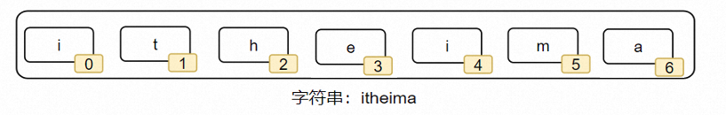

**<font style="color:#DF2A3F;">笔记来源：</font>**[**<font style="color:#DF2A3F;">黑马程序员python教程，8天python从入门到精通，学python看这套就够了</font>**](https://www.bilibili.com/video/BV1qW4y1a7fU/?spm_id_from=333.337.search-card.all.click&vd_source=e8046ccbdc793e09a75eb61fe8e84a30)


# 1 字符串(str)
字符串是字符的容器，一个字符串可以存放任意数量的字符。

同元组一样，字符串是一个无法修改的数据容器



## 1.1 索引取值
同列表、元组一样，字符串也可以通过下标进行访问

从前向后，下标从 0 开始

从后向前，下标从 -1 开始

```python
name = "guanzhi"
print(name[0])  # 打印 g
print(name[-1])  # 打印 i
```

## 1.2 字符串的常用操作
| 操作 | 说明 |
| --- | --- |
| 字符串[下标] | 根据下标索引取出特定位置字符 |
| 字符串.index(字符串） | 查找给定字符的第一个匹配项的下标 |
| 字符串.replace(字符串1, 字符串2) | 将字符串内的全部字符串1，替换为字符串2 不会修改原字符串，而是得到一个新的 |
| 字符串.split(字符串) | 按照给定字符串，对字符串进行分隔，不会修改原字符串，而是得到一个新的列表 |
| 字符串.strip() <br/>字符串.strip(字符串) | 移除首尾的空格和换行符或指定字符串 |
| 字符串.count(字符串) | 统计字符串内某字符串的出现次数 |
| len(字符串)	 | 统计字符串的字符个数 |


### 1.2.1 查找元素
查找特定字符串的下标索引值

语法：字符串.index(字符串)

```python
name = "guanzhi"
print(name.index("a"))  # 打印 2
```

### 1.2.2 替换元素
将字符串内的全部：字符串1 替换为 字符串2

语法：字符串.replace(字符串1，字符串2）

```python
name = "guanzhi"
new_name = name_1.replace("guan", "study")
print(name)  # 打印 guanzhi
print(new_name)  # 打印 studyzhi
```

不是修改字符串本身，而是得到了一个新字符串

### 1.2.3 分割元素
按照指定的分隔符字符串，将字符串划分为多个字符串，并存入列表对象中

语法：字符串.split(分隔符字符串）

```python
name = "guanzhi,study,20"
new_list = name.split(",")
print(name)  # 打印 guanzhi,study,20
print(new_list)  # 打印 ['guanzhi', 'study', '20']
print(type(new_list))  # 打印 <class 'list'>
# 131. 字符串按照给定的,进行了分割，变成多个子字符串，并存入一个列表对象中
```

字符串本身不变，而是得到了一个列表对象

### 1.2.4 规整操作
去前后空格以及换行符  
语法一：字符串.strip()

```python
name = "  guanzhi  "
new_name = name.strip()
print(new_name)  # 打印 guanzhi
```

  
去前后指定字符串  
语法二：字符串.strip(字符串)

```python
name = "20guanzhi20"
new_name = name.strip("20")
print(name)  # 打印 20guanzhi20
print(new_name)  # 打印 guanzhi
```

字符串本身不变，而是得到了一个新字符串

### 1.2.5 统计操作
统计字符串中某字符串的出现次数  
语法一：字符串.count(字符串)

```python
name = "20guanzhi20"
print(name.count("20"))  # 打印 2
```

  
统计字符串的长度  
语法二：len(字符串)

```python
name = "20guanzhi 20"
print(len(name))  # 打印 12
```

数字（1、2、3…），字母（abcd、ABCD等），符号（空格、!、@、#、$等），中文均算作1个字符

字符串小结

+ 同列表、元组一样，字符串也支持while循环和for循环进行遍历
+ 特点：
    - 只可以存储字符串
    - 长度任意（取决于内存大小）
    - 支持下标索引
    - 允许重复字符串存在
    - 不可以修改（增加或删除元素等）
+ 基本和列表、元组相同
    - 不同与列表和元组的在于：字符串容器可以容纳的类型是单一的，只能是字符串类型。
    - 不同于列表，相同于元组的在于：字符串不可修改


# 2 数据容器（序列）的切片
序列：内容连续、有序，可使用下标索引的一类数据容器

切片：从一个序列中，取出一个子序列

序列的典型特征就是：有序并可用下标索引，字符串、元组、列表均满足这个要求

序列支持切片，即：列表、元组、字符串，均支持进行切片操作


基本格式

语法：序列[起始下标:结束下标:步长]

+ 表示从序列中，从指定位置开始，依次取出元素，到指定位置结束，得到一个新序列
+ 起始下标表示从何处开始，可以留空，留空视作从头开始
+ 结束下标（不含）表示何处结束，可以留空，留空视作截取到结尾
+ 步长表示，依次取元素的间隔
    - 步长1表示，一个个取元素
    - 步长2表示，每次跳过1个元素取
    - 步长N表示，每次跳过 N-1 个元素取
    - 步长为负数表示，反向取（注意，起始下标和结束下标也要反向标记）


基本用法

用法

+ 起始下标可以省略，省略从头开始
+ 结束下标可以省略，省略到尾结束
+ 步长可以省略，省略步长为1（可以为负数，表示倒序执行）

用法一：

```python
my_list = [1, 2, 3, 4, 5]
new_list = my_list[1:4]  # 下标1开始，下标4（不含）结束，步长1
print(new_list)  # 结果：[2, 3, 4]
```

  
用法二：

```python
my_tuple = (1, 2, 3, 4, 5)
new_tuple = my_tuple[:]  # 从头开始，到最后结束，步长1
print(new_tuple)  # 结果：(1, 2, 3, 4, 5)

```

  
用法三：

```python
my_list = [1, 2, 3, 4, 5]
new_list = my_list[::2]       # 从头开始，到最后结束，步长2
print(new_list)       # 结果：[1, 3, 5]
```

  
用法四：

```python
my_str = "12345"
new_str = my_str[:4:2]  # 从头开始，到下标4（不含）结束，步长2
print(new_str)  # 结果："13"
```

  
用法五：

```python
my_list = [1, 2, 3, 4, 5]
new_list = my_list[3:1:-1]  # 从下标3开始，到下标1（不含）结束，步长-1（倒序）
print(new_list)  # 打印 [4, 3]
```

  
注意：

+ 这个操作对列表、元组、字符串是通用的
+ 此操作不会影响序列本身，而是会得到一个新的序列（列表、元组、字符串）
+ 起始位置，结束位置，步长（正反序）都是可以自行控制的

