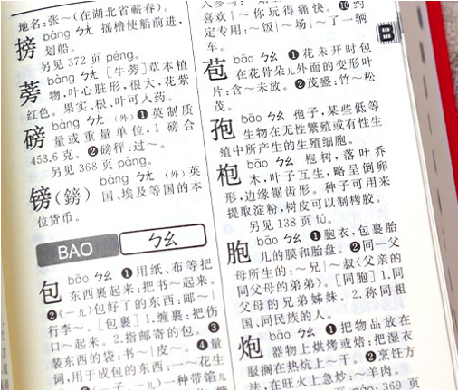
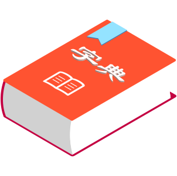
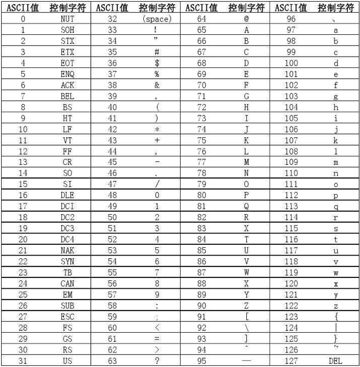
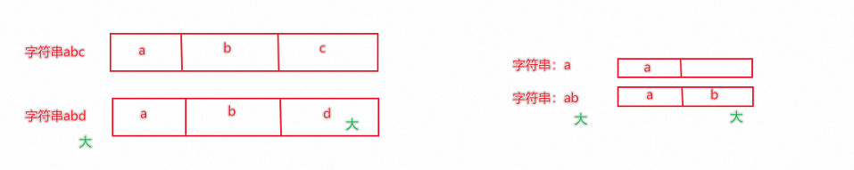

**<font style="color:#DF2A3F;">笔记来源：</font>**[**<font style="color:#DF2A3F;">黑马程序员python教程，8天python从入门到精通，学python看这套就够了</font>**](https://www.bilibili.com/video/BV1qW4y1a7fU/?spm_id_from=333.337.search-card.all.click&vd_source=e8046ccbdc793e09a75eb61fe8e84a30)


# 1 字典、映射（dict）
Python中字典和生活中字典十分相像



<font style="color:#262626;">通过【字】</font>

<font style="color:#262626;">就能找到对应的【含义】</font>



<font style="color:#262626;">所以，我们可以认为，生活中的字典就是记录的一堆：</font>

<font style="color:#262626;">【字】：【含义】</font>

<font style="color:#262626;">【字】：【含义】</font>

<font style="color:#262626;"></font>

## 1.1 基本格式
```python
# 137. 定义字典
变量名称 = {key:value, key:value, key:value}

# 138. 定义空字典
变量名称 = {}
变量名称 = dict()
```

+ 使用`{}`存储原始，每一个元素是一个键值对
+ 每一个键值对包含Key和Value（用冒号分隔）
+ 键值对之间使用逗号分隔
+ Key和Value可以是任意类型的数据（key不可为字典）
+ Key不可重复，重复会对原有数据覆盖

使用示例：

```python
my_dict = {"观止": 99, "李白": 120, "观止": 110}
print(my_dict)  # 打印 {'观止': 110, '李白': 120}
print(type(my_dict))  # 打印  <class 'dict'>
```

## 1.2 数据的获取
字典同集合一样，不可以使用下标索引取值  
字典可以通过Key值来取得对应的Value

```python
my_dict = {"李白": 120, "观止": 110}
print(my_dict["李白"])  # 打印 120
```

  
字典的Key和Value可以是任意数据类型（Key不可为字典），即字典是可以嵌套的

```python
my_dict = {
    "李白": {"语文": 110, "数学": 100}, 
    "观止": {"语文": 90, "数学": 120}
}
print(my_dict["李白"])  # 打印 {'语文': 110, '数学': 100}
print(my_dict["李白"]["语文"])  # 打印 110

```

  
字典不支持下标索引，同样不可以用while循环遍历

```python
my_dict = {"李白": 120, "观止": 110}
for name in my_dict:
    print(f"key为：{name},value为：{my_dict[name]}")

# 139. 打印
# 140. key为：李白,value为：120
# 141. key为：观止,value为：110

```

## 1.3  字典的常用操作
| 操作 | 说明 |
| --- | --- |
| 字典[Key] | 获取指定Key对应的Value值 |
| 字典[Key] = Value | 添加或更新键值对 |
| 字典.pop(Key) | 取出Key对应的Value并在字典内删除此Key的键值对 |
| 字典.clear() | 清空字典 |
| 字典.keys()	 | 获取字典的全部Key，可用于for循环遍历字典 |
| len(字典) | 计算字典内的元素数量 |


### 1.3.1 新增元素
字典被修改，新增了元素  
如果key不存在字典中执行上述操作，就是新增元素  
语法：字典[Key] = Value

```python
my_dict = {"李白": 120, "观止": 110}
my_dict["罗辑"] = 115
print(my_dict)  # 打印 {'李白': 120, '观止': 110, '罗辑': 115}
```

### 1.3.2 更新元素
字典被修改，元素被更新

字典Key不可以重复，所以对已存在的Key执行上述操作，就是更新Value值

语法：字典[Key] = Value

```python
my_dict = {"李白": 120, "观止": 110}
my_dict["李白"] = 115
print(my_dict)  # 打印 {'李白': 115, '观止': 110}
```

### 1.3.3  删除元素
获得指定Key的Value，同时字典被修改，指定Key的数据被删除

语法：字典.pop(Key)

```python
my_dict = {"李白": 120, "观止": 110}
name = my_dict.pop("李白")
print(name)  # 打印 120
print(my_dict)  # 打印 {'观止': 110}
```

### 1.3.4 清空字典
字典被修改，元素被清空

语法：字典.clear()

```python
my_dict = {"李白": 120, "观止": 110}
my_dict.clear()
print(my_dict)  # 打印 {}
```

### 1.3.5 获取全部的key
得到字典中的全部Key

语法：字典.keys()

```python
my_dict = {"李白": 120, "观止": 110}
my_keys = my_dict.keys()
print(my_keys)  # 打印 dict_keys(['李白', '观止'])
```

### 1.3.6 计算字典内键值对数量
得到一个整数，表示字典内元素（键值对）的数量  
语法：len(字典)

```python
my_dict = {"李白": 120, "观止": 110}
print(len(my_dict))  # 打印 2
```

  
字典小结

+ 可以容纳多个数据
+ 可以容纳不同类型的数据
+ 每一份数据是Key-Value键值对
+ 可以通过Key获取到Value，Key不可重复（重复会覆盖）
+ 不支持下标索引
+ 可以修改（增加或删除更新元素等）

# 2 数据容器对比总结
## 2.1 简单分类
+ 是否支持下标索引
    - 支持：列表、元组、字符串 
    - 不支持：集合、字典 


+ 是否支持重复元素：
    - 支持：列表、元组、字符串
    - 不支持：集合、字典 


+ 是否可以修改
    - 支持：列表、集合、字典
    - 不支持：元组、字符串


## 2.2 特点对比
|  | 列表 | 元组 | 字符串 | 集合 | 字典 |
| --- | --- | --- | --- | --- | --- |
| 元素数量 | 支持多个 | 支持多个 | 支持多个 | 支持多个 | 支持多个 |
| 元素类型 | 任意 | 任意 | 仅字符 | 任意	 | Key：Value <br/>Key：除字典外任意类型 Value：任意类型 |
| 下标索引 | 支持 | 支持 | 支持	 | 不支持 | 不支持 |
| 重复元素	 | 支持 | 支持	 | 支持 | 不支持 | 不支持 |
| 可修改性 | 支持 | 不支持 | 不支持 | 支持 | 支持 |
| 数据有序 | 是 | 是 | 是 | 否	 | 否	 |
| 使用场景 | 可修改、可重复的一批数据记录场景 | 不可修改、可重复的一批数据记录场景 | 一串字符的记录场景 | 不可重复的数据记录场景 | 以Key检索Value的数据记录场景 |


## 2.3 应用场景
+ 列表：一批数据，可修改、可重复的存储场景
+ 元组：一批数据，不可修改、可重复的存储场景
+ 字符串：一串字符串的存储场景
+ 集合：一批数据，去重存储场景
+ 字典：一批数据，可用Key检索Value的存储场景

| 功能 | 描述 |
| --- | --- |
| 通用for循环 | 遍历容器（字典是遍历key） |
| max | 容器内最大元素 |
| min()	 | 容器内最小元素 |
| len()	 | 容器元素个数 |
| list() | 转换为列表 |
| tuple() | 转换为元组 |
| str()	 | 转换为字符串 |
| set() | 转换为集合 |
| sorted(序列, [reverse=True])	 | 排序，reverse=True表示降序 得到一个排好序的列表 |


## 2.4 通用操作：遍历
5类数据容器都支持for循环遍历

列表、元组、字符串支持while循环，集合、字典不支持（无法下标索引）

## 2.5 通用操作：统计
### 2.5.1 统计容器的元素个数
语法：len(容器)

```python
my_list = [1, 2, 3]
my_tuple = (1, 2, 3, 4, 5)
my_str = "guanzhi"
print(len(my_list))  # 结果 3
print(len(my_tuple))  # 结果 5
print(len(my_str))  # 结果 7
```

### 2.5.2 统计容器的最大元素
语法：max(容器)

```python
my_list = [1, 2, 3]
my_tuple = (1, 2, 3, 4, 5)
my_str = "guanzhi"
print(max(my_list))  # 结果 3
print(max(my_tuple))  # 结果 5
print(max(my_str))  # 结果 z
```

### 2.5.3 统计容器的最小元素
语法：min(容器)

```python
my_list = [1, 2, 3]
my_tuple = (1, 2, 3, 4, 5)
my_str = "guanzhi"
print(min(my_list))  # 结果 1
print(min(my_tuple))  # 结果 1
print(min(my_str))  # 结果 a
```

### 2.5.4 字符串大小比较
ASCII码表：



+ 在程序中，字符串所用的所有字符如：大小写，英文单词，数字特殊符号(`!``\``|``@``#`空格等），都有其对应的ASCII码表值
+ 每一个字符都能对应上一个：数字的码值，字符串进行比较就是基于数字的码值大小进行比较的。
+ 字符串是按位比较，也就是一位位进行对比，只要有一位大，那么整体就大



## 2.6 通用操作：排序
将给定容器进行排序,排序后都会得到列表（list）对象。

语法：sorted(容器, [reverse=True])

```python
my_list = [1, 4, 2]
my_list_asc = sorted(my_list)
print(my_list_asc)  # 结果 [1, 2, 4]
my_list_des = sorted(my_list, reverse=True)
print(my_list_des)  # 结果 [4, 2, 1]
```

## 2.7 通用操作：转换
将给定容器转换为列表

语法一：list(容器)

```python
my_tuple = (1, 4, 2) 
print(type(my_tuple))  # 打印 <class 'tuple'>
my_list = list(my_tuple)
print(type(my_list))  # 打印 <class 'list'>

```

  
将给定容器转换为字符串

语法二：str(容器)

```python
my_tuple = (1, 4, 2)
print(type(my_tuple))  # 打印 <class 'tuple'>
my_str = str(my_tuple)
print(type(my_str))  # 打印 <class 'str'>
```

  
将给定容器转换为集合

语法三：set(容器)

```python
my_tuple = (1, 4, 2)
print(type(my_tuple))  # 打印 <class 'tuple'>
my_set = set(my_tuple)
print(type(my_set))  # 打印 <class 'set'>
```

  
将给定容器转换为元组

语法四：tuple(容器)

```python
my_list = [1, 4, 2]
print(type(my_list))  # 打印 <class 'list'>
my_tuple = tuple(my_list)
print(type(my_tuple))  # 打印 <class 'tuple'>
```

