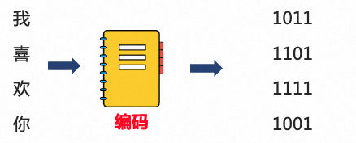
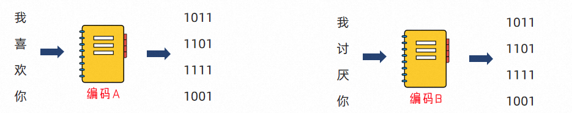
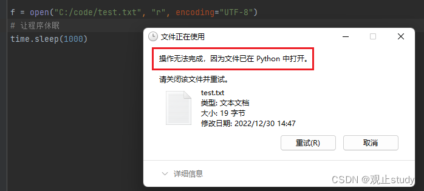
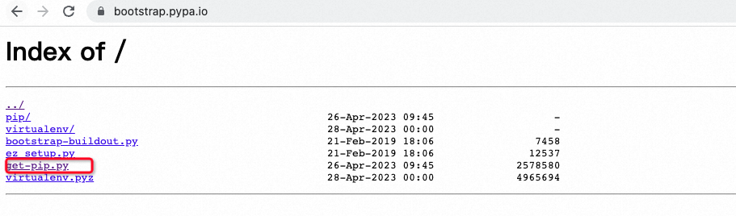

**<font style="color:#DF2A3F;">笔记来源：</font>**[**<font style="color:#DF2A3F;">黑马程序员python教程，8天python从入门到精通，学python看这套就够了</font>**](https://www.bilibili.com/video/BV1qW4y1a7fU/?spm_id_from=333.337.search-card.all.click&vd_source=e8046ccbdc793e09a75eb61fe8e84a30)


# 1 文件编码
编码就是一种规则集合，记录了内容和二进制间进行相互转换的逻辑。

思考：计算机只能识别0和1，那么我们丰富的文本文件是如何被计算机识别，并存储在硬盘中呢？

答案：使用编码技术（密码本）将内容翻译成0和1存入。



计算机中有许多可用编码：`UTF-8``GBK``Big5`等不同的编码，将内容翻译成二进制也是不同的

对内容的编码与解码必须使用同一套编码，否则会导致错误的结果



<font style="color:#262626;">如上，如果你给喜欢的女孩发送文件，使用编码A进行编码（内容转二进制）。女孩使用编码B打开文件进行解码（二进制反转回内容）。自求多福吧。</font>

UTF-8是目前全球通用的编码格式,除非有特殊需求，否则，一律以UTF-8格式进行文件编码即可。

# 2 文件操作
在日常生活中，文件操作主要包括打开、关闭、读、写等操作

操作过程中请务必注意文件路径的书写

+ 只有操作文件与python文件在同一目录才能直接写文件名。
+ 新手建议都写文件的绝对路径，不易导致错误发生。

# 3.1 文件的打开
### 3.1.1 基本格式
在Python，使用open函数，可以打开一个已经存在的文件，或者创建一个新文件

基本语法：

```python
open(name, mode, encoding)
# 142. name：是要打开的目标文件名的字符串(可以包含文件所在的具体路径)。
# 143. mode：设置打开文件的模式(访问模式)：只读、写入、追加等。
# 144. encoding:编码格式（推荐使用UTF-8）

```

示例代码：

```python
f = open("C:/code/bill.txt", "r", encoding="UTF-8")
# 145. encoding的顺序不是第三位，所以不能用位置参数，用关键字参数直接指定
# 146. f是open函数的文件对象，可以使用对象.属性或对象.方法对其进行访问
```

### 3.1.2 打开模式
文件常用的三种基础访问模式，可通过mode指定。

+ `r`：read（读取）
+ `w`：write（写入）
+ `a`：append（追加）

| 模式 | 描述 |
| --- | --- |
| r | 以只读方式打开文件。文件的指针将会放在文件的开头。这是默认模式。 |
| w | 打开一个文件只用于写入。如果该文件已存在则打开文件，并从开头开始编辑，原有内容会被删除。如果该文件不存在，创建新文件。 |
| a | 打开一个文件用于追加。如果该文件已存在，新的内容将会被写入到已有内容之后。 如果该文件不存在，创建新文件进行写入。 |


## 3.2 文件的读取
| 操作 | 功能 |
| --- | --- |
| 文件对象.read(num) | 读取指定长度字节 不指定num读取文件全部 |
| 文件对象.readline() | 读取一行 |
| 文件对象.readlines() | 读取全部行，返回列表 |
| for line in 文件对象 | for循环文件行，一次循环得到一行数据 |
| 文件对象.close()	 | 关闭文件对象 |
| with open() as f | 通过with open语法打开文件，可以自动关闭 |


每次读取会从上一次读取结束的位置开始

每次open()中的内容只能被读取一次

### 3.2.1  read方法
num表示要从文件中读取的数据的长度（单位是字节），如果没有传入num，那么就表示读取文件中所有的数据。

语法：文件对象.read(num)

使用示例：

```python
f = open("C:/code/test.txt", "r", encoding="UTF-8")
content = f.read() # 不传入num，读取文件中所有的数据。
print(content)
# 147. 打印
# 148. 观止
# 149. study

f = open("C:/code/test.txt", "r", encoding="UTF-8")
content = f.read(2) # 传入num，读取2字节长度数据。
print(content)
# 150. 打印
# 151. 观止

```

### 3.2.2 readline() 方法
一次读取一行内容

语法：`文件对象.readline()`

使用示例：

```python
f = open("C:/code/test.txt", "r", encoding="UTF-8")
content = f.readline()
print(f"第一行内容：{content}")  # 打印 第一行内容：观止
content = f.readline()
print(f"第二行内容：{content}")  # 打印 第二行内容：study

```

### 3.2.3 readlines方法
按照行的方式把整个文件中的内容进行一次性读取，并且返回的是一个列表，其中每一行的数据为一个元素。

语法：`文件对象.readlines()`

使用示例：

```python
f = open("C:/code/test.txt", "r", encoding="UTF-8")
content = f.readlines()
print(content)  # 打印 ['观止
', 'study']
print(type(content))  # 打印 <class 'list'>

```

### 3.2.4 for循环读取
for循环读取每一行数据  
使用示例：

```python
# 152. 每一个line临时变量，就记录了文件的一行数据
for line in open("C:/code/test.txt", "r", encoding="UTF-8"):
    print(line)
# 153. 打印
# 154. 观止
#
# 155. study

```

### 3.2.5 close关闭文件对象
如果不调用close，同时程序没有停止运行，那么这个文件将一直被Python程序占用，无法操作

使用示例：

```python
f = open("C:/code/test.txt", "r", encoding="UTF-8")
# 156. 需要执行代码
f.close()
```

代码中不关闭文件对象，且python程序未停止运行，无法对文件删除重命名等操作



### 3.2.6 自动close
通过在with open的语句块中对文件进行操作,可以在操作完成后自动关闭close文件

即使出现异常也会自动调用关闭文件操作

语法：with open() as f

使用示例

```python
with open("C:/code/test.txt", "r", encoding="UTF-8") as f:
  f.readlines()
```

## 3.3 文件的写入
使用示例：

```python
f = open("C:/code/test.txt", "w")
# 157. 文件如果不存在，使用”w”模式，会创建新文件
# 158. 文件如果存在，使用”w”模式，会将原有内容清空
# 2.文件写入
f.write('hello world')
# 3. 内容刷新
f.flush()

```

+ 直接调用write，内容并未真正写入文件，而是会积攒在程序的内存中，称之为缓冲区
+ 当调用flush的时候，内容会真正写入文件
    - close()方法，附带flush()方法的功能
+ 这样做是避免频繁的操作硬盘，导致效率下降（攒一堆，一次性写磁盘）

## 3.4 文件的追加
使用w模式，每次写入会将原有内容清空，写入新内容

使用 a 模式，文件不存在会创建文件,文件存在会在最后追加内容写入文件

使用示例：

```python
f = open("C:/code/test.txt", "a")
# 2.文件写入
f.write('study')
# 3. 内容刷新
f.flush()
```

## 3.5 案例操作
读取本地一个excel表格，讲表格中的数据插入到mysql数据库中

```python

import pandas as pd
import mysql.connector

# 159. 读取Excel文件并将其转换为数据帧
df = pd.read_excel('xxx.xlsx')

# 160. 连接到MySQL数据库
cnx = mysql.connector.connect(user='', password='',
                              host='', database='')
cursor = cnx.cursor()

# 161. 将数据帧写入MySQL表中
for row in df.itertuples():
    try:
        print(f"update pai_user_info set team='{row.归属团队}', phone_num='{int(row.手机号)}' where user_name ='{row.子账号描述}';")
        cursor.execute(f"update pai_user_info set team='{row.归属团队}', phone_num='{int(row.手机号)}' where user_name ='{row.子账号描述}'")
        cnx.commit()
    except Exception as e:
        print(e)
        print(f"update pai_user_info set team='{row.归属团队}', phone_num='{int(row.手机号)}' where user_name ='{row.子账号描述}'")
# 162. 提交更改并关闭连接

cursor.close()
cnx.close()
```

在操作之前，注意一些依赖包的安装

```python
pip install pandas
pip install mysql-connector-python
pip install openpyxl
pip install xlrd xlwt
```

如果不确定有没有安装 pip，可以通过下面命令查看

```python
pip --version
```

<font style="color:rgb(51, 51, 51);">如果pip正确安装，您将看到pip的版本号。</font>

<font style="color:rgb(51, 51, 51);">如果您已经安装了Python，但没有安装pip，您可以从</font>

[https://bootstrap.pypa.io/get-pip.py](https://bootstrap.pypa.io/get-pip.py)

下载pip安装文件，然后在终端中运行以下命令来安装pip：

```python
python get-pip.py
```



这里安装的是pip3，也是可以的


