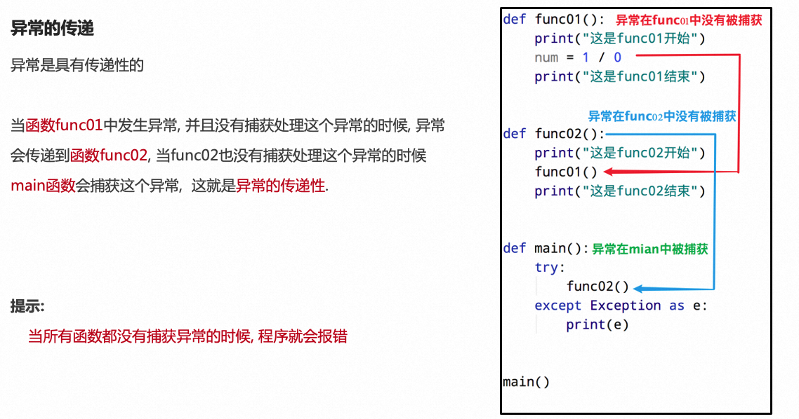

**<font style="color:#DF2A3F;">笔记来源：</font>**[**<font style="color:#DF2A3F;">黑马程序员python教程，8天python从入门到精通，学python看这套就够了</font>**](https://www.bilibili.com/video/BV1qW4y1a7fU/?spm_id_from=333.337.search-card.all.click&vd_source=e8046ccbdc793e09a75eb61fe8e84a30)


# 1 什么是异常
程序运行的过程中出现了错误

定义：在程序运行中,检测到一个错误，程序中止运行并且出现了一些错误的提示，也称作BUG


例如：读取一个不存在的文件

```python
f = open("linux.txt", "r")
```


# 2 为什么要捕获异常
避免程序中止，提前准备处理可能出现的异常

在真实工作中，我们肯定不能因为一个小的BUG就让整个程序全部奔溃，而是对BUG进行提醒，整个程序继续运行  


# 3 如何捕获异常
在可能出现异常的地方,做好提前准备,当真的出现异常的时候,可以有后续手段。

## 3.1 捕获常规异常
基本语法：

```python
try:
    可能发生错误的代码
except:
    如果出现异常执行的代码
    
# 163. 未发生错误try全部代码都会执行
# 164. 未发生错误不会执行except中的代码
# 165. 发生错误try中只会执行到报错行为止的代码
# 166. 发生错误会except中的代码

```

使用示例:

首次执行，文件不存在,程序未报错中止，而是转而执行except中代码，创建文件

```python
try:
    print("r模式打开") # 执行
    f = open("C:/code/观止.txt", "r") # 报错
    print("r模式打开") # 不执行
except:
    print("w模式打开") # 执行
    f = open("C:/code/观止.txt", "w") # 执行
    print("w模式打开") # 执行

```

第二次执行，文件存在，程序无异常，只执行try中代码

```python
try:
    print("r模式打开") # 执行
    f = open("C:/code/观止.txt", "r") # 执行
    print("r模式打开") # 执行
except:
    print("w模式打开") # 不执行
    f = open("C:/code/观止.txt", "w") # 不执行
    print("w模式打开") # 不执行

```

## 3.2 捕获特定异常
如果尝试执行的代码的异常类型和要捕获的异常类型不一致，则无法捕获异常。

基本语法：

```python
try:
    可能发生错误的代码
except 待捕获异常名 as 别名:
    如果出现异常执行的代码
```

例如：

捕获未定义变量产生的错误

```python
try:
    print(name) # 未定义变量，报错
except NameError as e:
    print('name变量名称未定义错误')
```

同样的代码却无法捕获处理找不到文件异常

```python
try:
    f = open("C:/code/study.txt", "r") # 文件不存在，报错
except NameError as e:
    print('文件不存在')			

```

## 3.3 捕获多个异常
格式一：当待捕获异常名为Exception可以捕获所有类型异常，作用与 3.1 一致

例如：

```python
try:
    f = open("C:/code/study.txt", "r")
except Exception as e:
    print('文件不存在')

```

格式二：把要捕获的异常类型的名字，放到except 后，并使用元组的方式进行书写。

基本格式：

```python
try:
    可能发生错误的代码
except (异常名1,异常名2) as 别名:
    如果出现异常执行的代码
```

使用示例：

```python
# 167. 示例一：
try:
    f = open("C:/code/study.txt", "r")
except (FileNotFoundError, NameError) as e:
    print('文件不存在')
# 168. 示例二：    
try:
    print(name)
except (FileNotFoundError, NameError) as e:
    print('名称未定义')

```

指定的两种异常都能捕获，未指定的无法捕获到

## 3.4 其他用法
### 3.4.1 打印异常信息
异常描述信息存贮在别名中，可以通过打印别名获取

使用示例：

```python
try:
    print(num) # 未定义，报错
except (NameError, ZeroDivisionError) as e:
    print(e) # 打印 name 'num' is not defined

```

### 3.4.2 异常else
else 表示的是如果没有异常要执行的代码。

使用示例：

+ 出现异常，打印结果与一致

```python
try:
    print(num) # 未定义，报错
except (NameError, ZeroDivisionError) as e:
    print(e) # 打印 name 'num' is not defined
else:
    print("无异常") # 有异常，不执行

```

+ 无异常

```python
try:
    print("正常") # 不报错
except (NameError, ZeroDivisionError) as e:
    print(e) # 不执行
else:
    print("无异常") # 执行

```

### 3.4.3 异常finally
finally表示的是无论是否异常都要执行的代码

使用示例：

之前提过，如果open文件却一直未close且程序未中止，将一直占用文件无法操作，如果打开文件后发生异常，未close也将导致一直占用，因此可选择在finally中close

```python
global f
try:
    f = open("C:/code/aaa.txt", "r")
except Exception as e:
    print(e)  
finally:
    f.close() # 一定会执行close操作

```

# 4 异常的传递
异常是具有传递性的(向上一级抛出)

当函数调用链中出现异常，如果所有函数都没有捕获异常的时候, 程序就会报错




利用异常具有传递性的特点, 当我们想要保证程序不会因为异常崩溃的时候, 就可以在主函数中设置异常捕获, 由于无论在整个程序哪里发生异常, 最终都会传递到主函数中, 这样就可以确保所有的异常都会被统一捕获

