# 1 什么是面向对象
万物皆对象

现实世界的事物都有属性和行为,可在程序中抽离为类来描述现实世界的事物属性和行为。

使用类充当程序内现实事物的设计图纸，基于图纸（类）生产实体（对象），由对象做具体的工作，称之为：面向对象编程

在现实世界中，生产事物：先设计图纸，完成功能属性分析，再批量制造

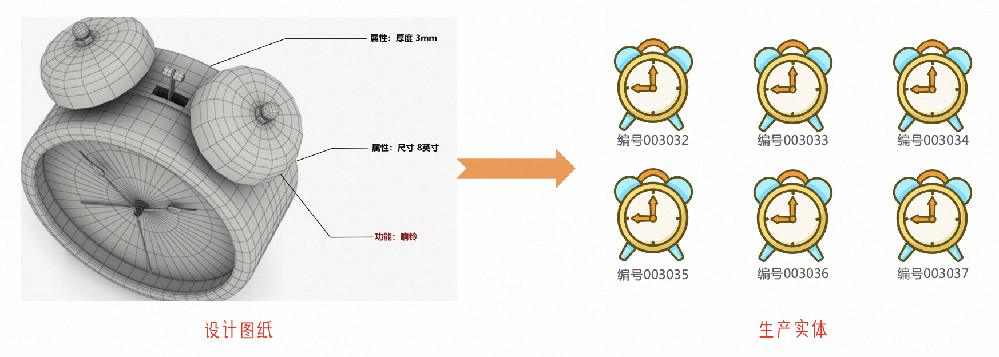

在程序中，通过类作为事物的设计图纸，记录事物的属性和行为

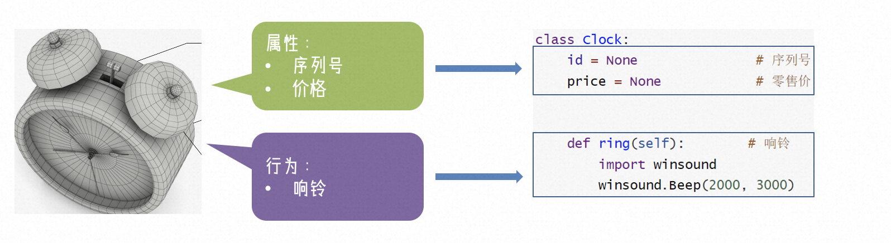

基于类(设计图纸)构建(生产)闹钟对象

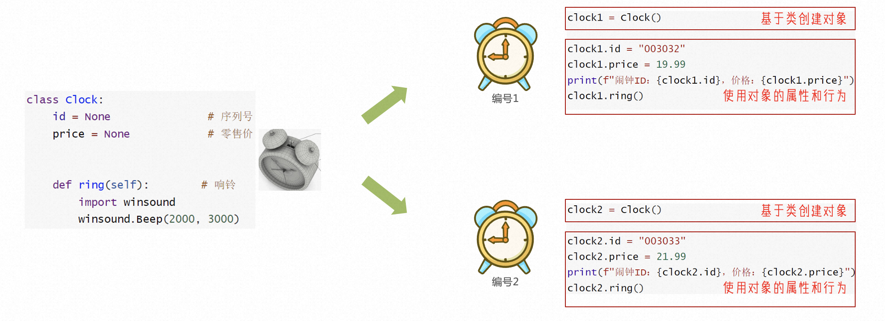

# 2 类与对象
使用类封装属性，基于类创建出一个个的对象来使用

## 2.1 基本语法
```python
# 203. 创建类
class 类名称:
    类的属性(成员变量)
    
    类的行为(成员方法)
    
# 204. 基于类创建对象
对象名 = 类名称()

# 205. 调用
对象名.成员变量
对象名.成员方法()

```

+ class：关键字，表示要定义类了
+ 类的属性：定义在类中的变量（成员变量）-> 事物的属性
+ 类的行为：定义在类中的函数）成员方法）-> 事物的行为

## 2.2 使用示例
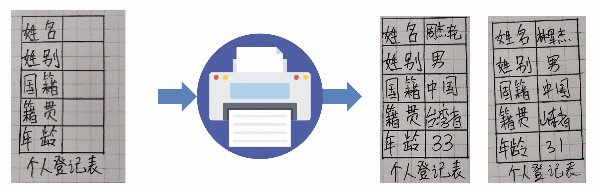

设计表格即设计类(class)：

```python
class Student:
    name = None  # 姓名
    sex = None  # 性别
    country = None  # 国籍
    native_place = None  # 籍贯
    age = None  # 年龄

```

打印表格即创建对象：

```python
stu_1 = Student()  # 一张
stu_2 = Student()  # 两张
stu_3 = Student()  # 三张
```

填写表格即使用对象(为属性赋值)：

```python
stu_1 = "李白"
stu_2 = "观止"
stu_3 = "罗辑"
```

## 2.3 成员变量和成员方法
成员变量：定义在类内部的变量称之为成员变量，用法与正常变量一致。

成员方法：定义在类内部的函数称之为方法，与函数存在细微区别。

```python
# 206. 函数
# 207. 形参可以为0-N个
def 函数名(形参1,形参2,..,形参N):
    函数体

# 208. 方法
# 209. 形参可以为0-N个
# 210. self关键字必须填写
def 方法名(self,形参1,形参2,..,形参N):
    方法体

```

+ self 关键字在成员方法定义的时候必须填写，表示类对象自身
+ 在方法内部，想要访问类的成员变量，必须使用self

```python
class Student:
    name = None  
    
    # 调用say_hi1时正常打印
    def say_hi1(self):
        print(f"大家好，我叫{self.name}") 
    
    # 调用say_hi2时报错，'name' is not defined
    def say_hi2(self):
        print(f"大家好，我叫{name}") 

```

当我们使用对象调用方法的时，self会自动被python传入,尽管在参数列表中，但是传参的时候可以忽略它。

```python
# 211. 定义
class Student:
    name = None

    def say_hi(self, msg):
        print(f"大家好，我是{msg}")

# 212. 创建
stu_1 = Student()
# 213. 通过对象名调用
stu_1.say_hi("练习两年半的偶像实习生")
# 214. 打印 大家好，我是练习两年半的偶像实习生

```

## 2.4 构造方法
通过传参的形式快速对属性赋值

正常情况下，为对象的属性赋值需要依次进行

```python
# 215. 定义类
class Student:
    name = None  # 姓名
    sex = None  # 性别
    age = None  # 年龄

# 216. 创建对象
stu_1 = Student()
# 217. 为对象赋值
stu_1.name = "李白"
stu_1.sex = "男"
stu_1.age = 1000

```

在类可以使用：**init**()方法，即构造方法,快速为对象赋值。

```python
# 218. 定义类
class Student:
    name = None  # 姓名
    sex = None  # 性别
    age = None  # 年龄

    def __init__(self, name, sex, age):
        self.name = name
        self.sex = sex
        self.age = age

#下面的代码已经在类外面了
# 219. 创建对象并赋值
stu_1 = Student("李白", "男", 1000)

# 220. 简化形式：可以省略成员属性定义,但仍可调用
class Student:

    def __init__(self, name, sex, age):
        self.name = name  # 姓名
        self.sex = sex  # 性别
        self.age = age  # 年龄

# 221. 创建对象并赋值
stu_1 = Student("李白", "男", 1000)

```

+ 在创建类对象（构造类）的时候，会自动执行，将传入参数自动传递给 <font style="color:#b200b2;background-color:#ffffff;">__init__</font>方法使用。
+ 构造方法也是成员方法，定义时也需要在参数列表中提供：self
+ 变量定义在构造方法内部，如果要成为成员变量，需要用 self 来表示，例如 self.name
+ 使用了构造方法，创建对象时必须传参否则会报错

## 2.5 魔术方法
Python类内置的类方法，各自有各自特殊的功能

魔术方法非常多，我们学习几个常用的即可。

| 方法 | 功能 |
| --- | --- |
| __init__ | 构造方法，可用于创建类对象的时候设置初始化行为 |
| __str__ | 字符串方法，用于实现类对象转字符串的行为 |
| __lt__ | 用于2个类对象进行小于(<)或大于(>)比较 |
| __le__ | 用于2个类对象进行小于等于(<=)或大于等于(>=)比较 |
| __eq__ | 用于2个类对象进行相等(==)比较 |


### 2.5.1 str方法
当直接打印类对象时，打印的是对象的内存地址，用处不大。

```python
class Student:

    def __init__(self, name, age):
        self.name = name  # 姓名
        self.age = age  # 年龄

stu_1 = Student("李白", 1000)
print(stu_1)
# 222. 打印 <__main__.Student object at 0x0000024D8C6195D0>

```

我们可以通过**str**方法，自定义控制打印类对象时输出的内容。

```python
class Student:

    def __init__(self, name, age):
        self.name = name  # 姓名
        self.age = age  # 年龄
        
	# 自定义打印输出内容
    def __str__(self):
        return f"Student对象,name={self.name},age={self.age}"

stu_1 = Student("李白", 1000)
print(stu_1)
# 223. 打印 Student对象,name=李白,age=1000

```

### 2.5.2 lt方法
直接对2个对象进行比较是不可以的，会报错。

```python
class Student:

    def __init__(self, name, age):
        self.name = name  # 姓名
        self.age = age  # 年龄


stu_1 = Student("李白", 1000)
stu_2 = Student("罗辑", 300)
print(stu_1 > stu_2) # 报错

```

在类中实现 __**lt__ **方法即可完成：小于符号 和 大于符号 2种比较

```python
class Student:

    def __init__(self, name, age):
        self.name = name  # 姓名
        self.age = age  # 年龄

    def __lt__(self, other):
        return self.age < other.age


stu_1 = Student("李白", 1000)
stu_2 = Student("罗辑", 300)
print(stu_1 > stu_2) # 打印 True

```

### 2.5.3 le方法
在类中实现 __**le__** 方法即可完成：小于等于符号 和 大于等于符号 2种比较，否则会报错

```python
class Student:

    def __init__(self, name, age):
        self.name = name  # 姓名
        self.age = age  # 年龄

    def __le__(self, other):
        return self.age <= other.age


stu_1 = Student("李白", 1000)
stu_2 = Student("罗辑", 1000)
print(stu_1 <= stu_2)  # True
print(stu_1 >= stu_2)  # True

```

### 2.5.4 eq方法
不实现eq方法，对象之间可以比较，但是是比较内存地址，但是不同对象 == 比较一定是False结果。

```python
class Student:

    def __init__(self, name, age):
        self.name = name  # 姓名
        self.age = age  # 年龄


stu_1 = Student("李白", 1000)
stu_2 = Student("李白", 666)
print(stu_1 == stu_2)  # False

```

实现了__**eq__ **方法，就可以按照自己的想法来决定2个对象是否相等了。

```python
class Student:

    def __init__(self, name, age):
        self.name = name  # 姓名
        self.age = age  # 年龄
	# 自定义比较规则
    def __eq__(self, other):
        return self.name == self.name


stu_1 = Student("李白", 1000)
stu_2 = Student("李白", 666)
print(stu_1 == stu_2)  # True

```

# 3 三大特性
面向对象包含3大主要特性：

+ 封装
+ 继承
+ 多态

## 3.1 封装
将现实世界事物的属性和行为在类中描述为成员变量和成员方法，完成程序对现实世界事物的描述

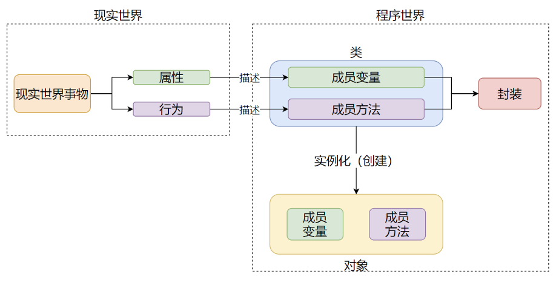

现实世界中的事物，有属性和行为。但是不代表这些属性和行为都是开放给用户使用的

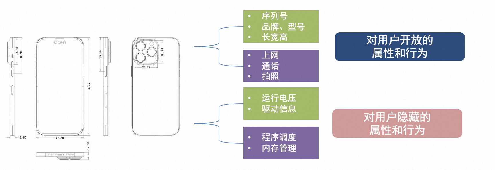

### 3.1.1 私有成员
在类中提供仅供内部使用的属性和方法，无法被对象调用

基本语法：  
私有成员变量：变量名以`__`开头（2个下划线）

私有成员方法：方法名以`__`开头（2个下划线）

```python
class Student:
    name = None  # 普通成员变量
    __age = None  # 私有成员变量
    
    # 普通成员方法
    def say_hi(self):
        print("你好")

    # 私有成员方法
    def __DNA(self):
        print("DNA数量")

```

仅在成员内部可以使用

```python
class Student:
    name = None  # 普通成员变量
    __age = 16  # 私有成员变量

    # 普通成员方法
    def show(self): 
        self.__check()  # 在类中使用私有成员变量
        if self.__age > 18: # 在类中使用私有成员变量
            print("成年人")
        else:
            print("未成年")

    # 私有成员方法
    def __check(self):
        print("自检")

```

## 3.2 继承
一个类继承另外一个类的所有成员变量和成员方法（不含私有）

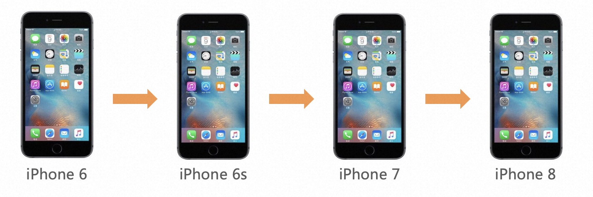

<font style="color:#262626;">如果你是设计师，你会如何选择？</font>

+ <font style="color:#262626;">每一代新款手机，都从零开始出设计图</font>
+ <font style="color:#262626;">基于老款的设计图，修修改改</font>

### 3.2.1 单继承
基本语法：

```python
class 类名(父类名):
    类内容体
```

基本使用：

```python
# 224. 待继承的类
class Phone:
    producer = "apple"  # 厂商

    def call_by_4g(self):
        print("4g通话")

# 225. 继承Phone
class Phone2022(Phone):
    face_id = True  # 面部识别

    def call_by_5g(self):
        print("2022最新5G通话")
# 226. 创建对象
phone = Phone2022()
# 227. 使用
print(phone.producer) # 可调用 继承自Phone的成员变量
print(phone.face_id) # 可调用 自身的成员变量
phone.call_by_4g() # 可调用 继承自Phone的成员方法
phone.call_by_5g() # 可调用 自身的成员方法

```

### 3.2.2 多继承
一个类也可以继承多个类

多个父类中，如果有同名的成员，默认以继承顺序（从左到右）为优先级。即：后继承的被先继承的覆盖

基本语法：

```python
class 类名(父类1,父类2,...,父类N):
    类内容体
```

使用示例：

```python
class Phone:
    producer = "apple"  # 厂商

class Camera:
    producer = "suoni"  # 厂商

class Phone2022(Phone, Camera):
    face_id = True  # 面部识别

    def call_by_5g(self):
        print("2022最新5G通话")

phone = Phone2022()

print(phone.producer)  # 打印结果为apple而非suoni

```

### 3.2.3 复写
子类继承父类的成员属性和成员方法后，如果对其“不满意”，那么可以进行复写。即：在子类中重新定义同名的属性或方法。

一旦复写父类成员，那么类对象调用成员的时候，就会调用复写后的新成员

```python
class Phone2021:
    producer = "apple"  # 厂商

    def call_by_5g(self):
        print("2021版5G通话")


class Phone2022(Phone2021):
    face_id = True  # 面部识别

    def call_by_5g(self):
        print("2022升级版5G通话")


phone = Phone2022()

phone.call_by_5g()  # 打印 2022升级版5G通话

```

如果需要使用被复写的父类的成员,只能在子类内通过如下方式调用父类的同名成员：

方式一：使用父类名调用

```python
使用成员变量：父类名.成员变量
使用成员方法：父类名.成员方法(self)
```


方式二：使用super()调用

```python
使用成员变量：super().成员变量
使用成员方法：super().成员方法()
```

使用示例：

```python
class Phone2021:
    producer = "apple"  # 厂商

    def call_by_5g(self):
        print("2021版5G通话")


class Phone2022(Phone2021):
    face_id = True  # 面部识别

    def call_by_5g(self):
        # 方式一调用
        print(Phone2021.producer)  # 打印 apple
        Phone2021.call_by_5g(self)# 打印 2021版5G通话
        # 方式二调用
        print(super().producer)# 打印 apple
        super().call_by_5g()# 打印 2021版5G通话

```

## 3.3 多态
多种状态，即完成某个行为时，使用不同的对象会得到不同的状态

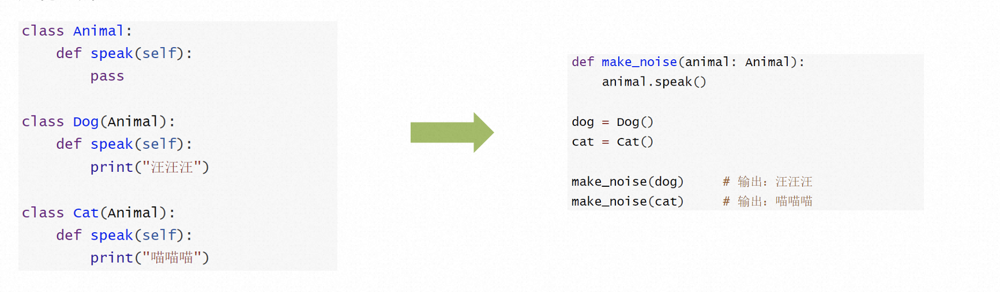

多态常作用在继承关系上，函数(方法)形参声明接收父类对象，实际传入父类的子类对象进行工作，即

+ 以父类做定义声明
+ 以子类做实际工作
+ 用以获得同一行为, 不同状态

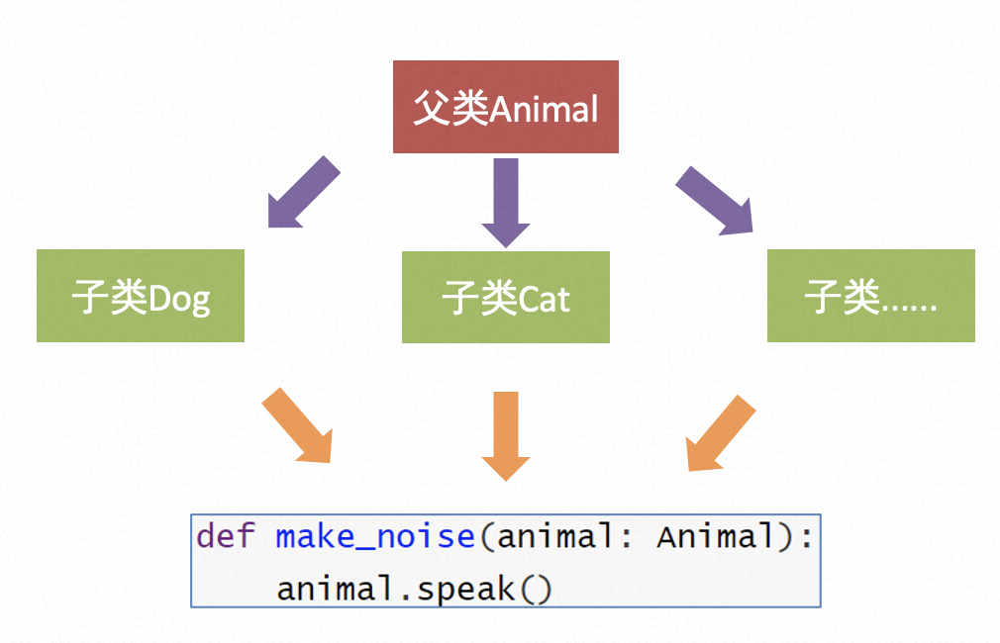


### 3.3.1 抽象类（接口）
抽象类就好比定义一个标准，包含了一些抽象的方法，要求子类必须实现

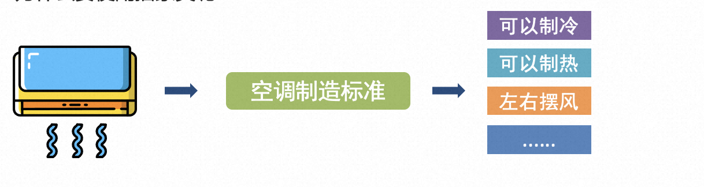

提出标准后，不同的厂家各自实现标准的要求

抽象类：包含抽象方法的类

抽象方法：没有具体实现的方法（只含pass）称之为抽象方法

pass是占位语句，用来保证函数（方法）或类定义的完整性，表示无内容，空的意思

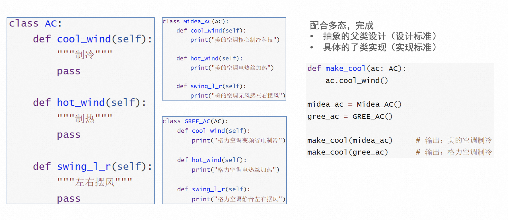

多用于做顶层设计（设计标准），以便子类做具体实现。是对子类的一种软性约束，要求子类必须复写（实现）父类的一些方法

并配合多态使用，获得不同的工作状态。  


