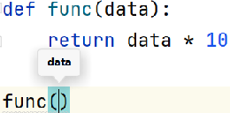
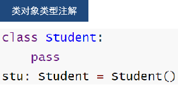
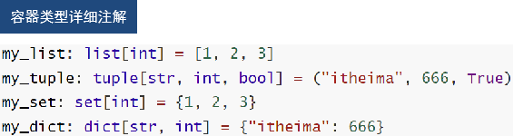
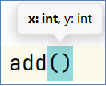

**<font style="color:#DF2A3F;">笔记来源：</font>**[**<font style="color:#DF2A3F;">黑马程序员python教程，8天python从入门到精通，学python看这套就够了</font>**](https://www.bilibili.com/video/BV1qW4y1a7fU/?spm_id_from=333.337.search-card.all.click&vd_source=e8046ccbdc793e09a75eb61fe8e84a30)


# 1 为什么需要类型注解
在PyCharm中编写代码，我们经常能够见到如下提示：


自动提示可用方法


思考，为什么PyCharm工具能够做到这一点？它是如何知道这个对象有append方法？因为：PyCharm确定这个对象，是list类型

同样，我们换一份代码：定义一个函数func，接收一个参数data你会发现，PyCharm不会在做出任何提示了


思考，为什么PyCharm工具无法提示了？因为：PyCharm不确定这个对象是什么类型

又或者当我们调用方法，进行传参的时候（快捷键ctrl + p弹出提示）：


提示传入2个参数，类型是int

而我们自定的方法



仅能提示传入1个参数，data类型未知

为什么内置模块random的方法可以提示类型，自己定义的就不可以？因为PyCharm无法通过代码确定应传入什么类型，我们需要使用类型注解


# 2 类型注解
Python在3.5版本的时候引入了类型注解，以方便静态类型检查工具，IDE等第三方工具。

类型注解：在代码中涉及数据交互的地方，提供数据类型的注解（显式的说明）。

主要功能：

+ 帮助第三方IDE工具（如PyCharm）对代码进行类型推断，协助做代码提示
+ 帮助开发者自身对变量进行类型注释

支持：

+ 变量的类型注解
+ 函数（方法）形参列表和返回值的类型注解


类型注解的语法

为变量设置类型注解

基础语法：`变量: 类型`







除了使用`变量: 类型`， 这种语法做注解外，也可以在注释中进行类型注解。

语法：`# type: 类型`


# 3 函数(方法)的类型注解
标注形参和返回值数据类型

类型注解仅仅起到提示作用

## 3.1 形参注解


如图所示：

+ 在编写函数（方法），使用形参data的时候，工具没有任何提示
+ 在调用函数（方法），传入参数的时候，工具无法提示参数类型

这些都是因为，我们在定义函数（方法）的时候，没有给形参进行注解


语法格式：

```python
def 函数方法名(形参名1:类型，形参名2:类型)：
	函数体
```

  
使用示例：





## 3.2 返回值注解
语法格式：

```python
def 函数方法名(形参名1:类型，形参名2:类型) -> 返回值类型：
	函数体

```

使用示例：

```python
def add(x: int, y: int) -> int:
    return x + y
```

# 4 Union类型
联合类型注解，在变量注解、函数（方法）形参和返回值注解中均可使用

需要导包使用

当数据类型不唯一时基本格式无法满足要求，此时便可使用Union类型


使用示例：`Union[类型,类型]`

+ 在变量中：

```python
from typing import Union
# 228. 数据为字符串和整数
my_list: list[Union[str, int]] = [2, "hhy", 5, "bd", 0]
# 229. 键为字符串，值为字符串和整数
my_dict: dict[str, Union[str, int]] = {"name": "hhy", "QS": 250}

```

+ 在函数中：

```python
from typing import Union

# 230. 接收字符串或整数，返回字符串或整数
def func(data: Union[int, str]) -> Union[int, str]:
    pass

```

  


