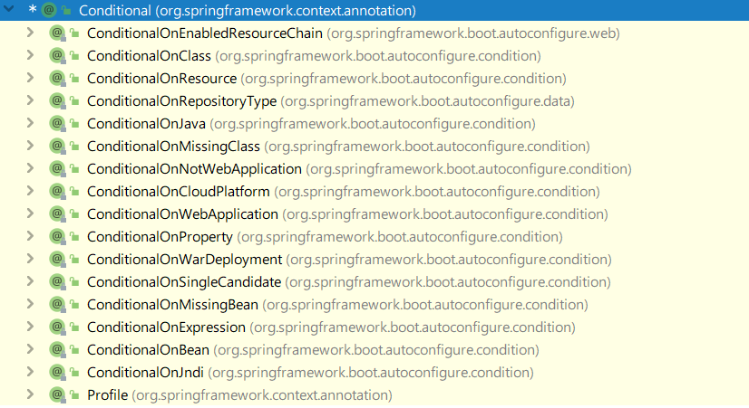

**<font style="color:#DF2A3F;">笔记来源：</font>**[**<font style="color:#DF2A3F;">【尚硅谷】SpringBoot2零基础入门教程（spring boot2干货满满）</font>**](https://www.bilibili.com/video/BV19K4y1L7MT/?spm_id_from=333.337.search-card.all.click&vd_source=e8046ccbdc793e09a75eb61fe8e84a30)

# 1 SpringBoot特点
## 1.1 依赖管理
父项目做依赖管理

```xml
<!-- 依赖管理 -->
<parent>
	<groupId>org.springframework.boot</groupId>
	spring-boot-starter-parent</artifactId>
	<version>2.3.4.RELEASE</version>
</parent>

<!-- 点进去可以看到，上面项目的父项目如下： -->
<parent>
	<groupId>org.springframework.boot</groupId>
	spring-boot-dependencies</artifactId>
	<version>2.3.4.RELEASE</version>
</parent>

<!-- 它几乎声明了所有开发中常用的依赖的版本号，自动版本仲裁机制 -->
```


开发导入starter场景启动器 

1. 见到很多`spring-boot-starter-*`：`*`就某种场景
2. 只要引入starter，这个场景的所有常规需要的依赖我们都自动引入
3. [更多SpringBoot所有支持的场景](https://docs.spring.io/spring-boot/docs/current/reference/html/using-spring-boot.html#using-boot-starter)
4. 见到的  `*-spring-boot-starter`：第三方为我们提供的简化开发的场景启动器。

```xml
<!-- 所有场景启动器最底层的依赖 -->
<dependency>
	<groupId>org.springframework.boot</groupId>
	spring-boot-starter</artifactId>
	<version>2.3.4.RELEASE</version>
	<scope>compile</scope>
</dependency>
```

比如：`spring-boot-starter-web`会引入以下依赖


无需关注版本号，自动版本仲裁 

1. 引入依赖默认都可以不写版本
2. 引入非版本仲裁的jar，要写版本号。


可以修改默认版本号 

1. 查看spring-boot-dependencies里面规定当前依赖的版本用的key。


2. 在当前项目里面重写配置，如下面的代码。

```xml
<properties>
	<mysql.version>5.1.43</mysql.version>
</properties>
```


## 1.2 自动配置
+ 自动配好Tomcat 
    - 引入Tomcat依赖。
    - 配置Tomcat

```xml
<dependency>
	<groupId>org.springframework.boot</groupId>
	spring-boot-starter-tomcat</artifactId>
	<version>2.3.4.RELEASE</version>
	<scope>compile</scope>
</dependency>
```

+  自动配好SpringMVC 
    - 引入SpringMVC全套组件
    - 自动配好SpringMVC常用组件（功能）
+  自动配好Web常见功能，如：字符编码问题 
    - SpringBoot帮我们配置好了所有web开发的常见场景

```java
public static void main(String[] args) {
    //1、返回我们IOC容器
    ConfigurableApplicationContext run = SpringApplication.run(MainApplication.class, args);

    //2、查看容器里面的组件
    String[] names = run.getBeanDefinitionNames();
    for (String name : names) {
        System.out.println(name);
    }
}
```

+ 默认的包结构 
    - 主程序所在包及其下面的所有子包里面的组件都会被默认扫描进来
    - 无需以前的包扫描配置
    - 想要改变扫描路径 
        * `@SpringBootApplication(scanBasePackages="com.lun")`
        * `@ComponentScan`指定扫描路径 

```java
@SpringBootApplication
等同于
@SpringBootConfiguration
@EnableAutoConfiguration
@ComponentScan("com.lun")
```

+  各种配置拥有默认值 
    - 默认配置最终都是映射到某个类上，如：`MultipartProperties`

```java
spring.servlet.multipart.max-file-size=10MB
```

直接在`application.properties`添加后，直接点击，idea就会跳到下面这个类上


    - 配置文件的值最终会绑定每个类上，这个类会在容器中创建对象
+  按需加载所有自动配置项 
    - 非常多的starter
    - 引入了哪些场景这个场景的自动配置才会开启
    - SpringBoot所有的自动配置功能都在 spring-boot-autoconfigure包里面

# 2 容器功能
## 2.1 组件添加
**1）@Configuration详解**

基本使用 

+ Full模式与Lite模式

```java
/**
 * 1、配置类里面使用@Bean标注在方法上给容器注册组件，默认也是单实例的
 * 2、配置类本身也是组件
 * 3、proxyBeanMethods：代理bean的方法
 *      Full(proxyBeanMethods = true)（保证每个@Bean方法被调用多少次返回的组件都是单实例的）（默认）
 *      Lite(proxyBeanMethods = false)（每个@Bean方法被调用多少次返回的组件都是新创建的）
 */
@Configuration(proxyBeanMethods = false) //告诉SpringBoot这是一个配置类 == 配置文件
public class MyConfig {
    //proxyBeanMethods = false,从容器getBean得到的到的是MyConfig本身的对象
	//proxyBeanMethods = true,从容器getBean得到的是用cglib代理后的对象
    
    /**
     * Full:外部无论对配置类中的这个组件注册方法调用多少次获取的都是之前注册容器中的单实例对象
     * @return
     */
    @Bean //给容器中添加组件。以方法名作为组件的id。返回类型就是组件类型。返回的值，就是组件在容器中的实例
    public User user01(){
        User zhangsan = new User("zhangsan", 18);
        //user组件依赖了Pet组件
        zhangsan.setPet(tomcatPet());
        return zhangsan;
    }

    @Bean("tom")
    public Pet tomcatPet(){
        return new Pet("tomcat");
    }
}
```

`@Configuration`测试代码如下:

```java
@SpringBootConfiguration
@EnableAutoConfiguration
@ComponentScan("com.atguigu.boot")
public class MainApplication {

    public static void main(String[] args) {
    //1、返回我们IOC容器
        ConfigurableApplicationContext run = SpringApplication.run(MainApplication.class, args);

    //2、查看容器里面的组件
        String[] names = run.getBeanDefinitionNames();
        for (String name : names) {
            System.out.println(name);
        }

    //3、从容器中获取组件
        Pet tom01 = run.getBean("tom", Pet.class);
        Pet tom02 = run.getBean("tom", Pet.class);
        System.out.println("组件："+(tom01 == tom02));

    //4、com.atguigu.boot.config.MyConfig

$$
$EnhancerBySpringCGLIB$
$$
51f1e1ca@1654a892
        MyConfig bean = run.getBean(MyConfig.class);
        System.out.println(bean);

    //如果@Configuration(proxyBeanMethods = true)代理对象调用方法。SpringBoot总会检查这个组件是否在容器中有。
        //保持组件单实例
        User user = bean.user01();
        User user1 = bean.user01();
        System.out.println(user == user1);

        User user01 = run.getBean("user01", User.class);
        Pet tom = run.getBean("tom", Pet.class);

        System.out.println("用户的宠物："+(user01.getPet() == tom));
    }
}
```

最佳实战 

+ 配置类组件之间**无依赖关系**用Lite模式加速容器启动过程，减少判断
+ 配置类组件之间**有依赖关系**，方法会被调用得到之前单实例组件，用Full模式（默认）

> lite 英 [laɪt]   美 [laɪt]  
adj. 低热量的，清淡的(light的一种拼写方法);类似…的劣质品
>


**2）**`**@Bean**``**@Component**``**@Controller**``**@Service**``**@Repository**`**它们是Spring的基本标签，在Spring Boot中并未改变它们原来的功能。**

**3）**`**@ComponentScan**``**@Import**`

```java
@Import({User.class, DBHelper.class}) //给容器中自动创建出这两个类型的组件、默认组件的名字就是全类名
@Configuration(proxyBeanMethods = false) //告诉SpringBoot这是一个配置类 == 配置文件
public class MyConfig {
}
```

测试类：

```java

//1、返回我们IOC容器
ConfigurableApplicationContext run = SpringApplication.run(MainApplication.class, args);

//...

//5、获取组件
String[] beanNamesForType = run.getBeanNamesForType(User.class);

for (String s : beanNamesForType) {
    System.out.println(s);
}

DBHelper bean1 = run.getBean(DBHelper.class);
System.out.println(bean1);
```

**4）@Conditional条件装配**

条件装配：满足Conditional指定的条件，则进行组件注入



用`@ConditionalOnMissingBean`举例说明

```java
@Configuration(proxyBeanMethods = false)
@ConditionalOnMissingBean(name = "tom")//没有tom名字的Bean时，MyConfig类的Bean才能生效。
public class MyConfig {

    @Bean
    public User user01(){ //给容器中添加组件。以方法名作为组件的id。返回类型就是组件类型。返回的值，就是组件在容器中的实例
        User zhangsan = new User("zhangsan", 18);
        zhangsan.setPet(tomcatPet());
        return zhangsan;
    }

    @Bean("tom22")
    public Pet tomcatPet(){
        return new Pet("tomcat");
    }
}

public static void main(String[] args) {
    //1、返回我们IOC容器
    ConfigurableApplicationContext run = SpringApplication.run(MainApplication.class, args);

    //2、查看容器里面的组件
    String[] names = run.getBeanDefinitionNames();
    for (String name : names) {
        System.out.println(name);
    }

    boolean tom = run.containsBean("tom");
    System.out.println("容器中Tom组件："+tom);//false

    boolean user01 = run.containsBean("user01");
    System.out.println("容器中user01组件："+user01);//true

    boolean tom22 = run.containsBean("tom22");
    System.out.println("容器中tom22组件："+tom22);//true

}
```

## 2.2 原生配置文件导入
**1）**`**@ImportResource**`**导入Spring配置文件**

比如，公司使用`bean.xml`文件生成配置bean，然而你为了省事，想继续复用`bean.xml`，`@ImportResource`粉墨登场。

bean.xml：

```xml
<?xml version="1.0" encoding="UTF-8"?>
<beans ...">

    <bean id="haha" class="com.lun.boot.bean.User">
        <property name="name" value="zhangsan"></property>
        <property name="age" value="18"></property>
    </bean>

    <bean id="hehe" class="com.lun.boot.bean.Pet">
        <property name="name" value="tomcat"></property>
    </bean>
</beans>
```

使用方法：

```java
@ImportResource("classpath:beans.xml")
public class MyConfig {
	...
}
```

测试类：

```java
public static void main(String[] args) {
    //1、返回我们IOC容器
    ConfigurableApplicationContext run = SpringApplication.run(MainApplication.class, args);

	boolean haha = run.containsBean("haha");
	boolean hehe = run.containsBean("hehe");
	System.out.println("haha："+haha);//true
	System.out.println("hehe："+hehe);//true
}
```

## 2.3 配置绑定
如何使用Java读取到properties文件中的内容，并且把它封装到JavaBean中，以供随时使用

传统方法：

```java
public class getProperties {
     public static void main(String[] args) throws FileNotFoundException, IOException {
         Properties pps = new Properties();
         pps.load(new FileInputStream("a.properties"));
         Enumeration enum1 = pps.propertyNames();//得到配置文件的名字
         while(enum1.hasMoreElements()) {
             String strKey = (String) enum1.nextElement();
             String strValue = pps.getProperty(strKey);
             System.out.println(strKey + "=" + strValue);
             //封装到JavaBean。
         }
     }
 }
```

---

**1）Spring Boot一种配置配置绑定：**`**@ConfigurationProperties**`** +**`**@Component**`

假设有配置文件application.properties

```properties
mycar.brand=BYD
mycar.price=100000
```


只有在容器中的组件，才会拥有SpringBoot提供的强大功能

```java
/**
 * 只有在容器中的组件，才会拥有SpringBoot提供的强大功能
 */
@Component
@ConfigurationProperties(prefix = "mycar")
public class Car {

    private String brand;
    private Integer price;

    public String getBrand() {
        return brand;
    }

    public void setBrand(String brand) {
        this.brand = brand;
    }

    public Integer getPrice() {
        return price;
    }

    public void setPrice(Integer price) {
        this.price = price;
    }

    @Override
    public String toString() {
        return "Car{" +
                "brand='" + brand + '\'' +
                ", price=" + price +
                '}';
    }
}
```

---

**2）Spring Boot另一种配置配置绑定：**`**@EnableConfigurationProperties**`** + **`**@ConfigurationProperties**`

1. 开启Car配置绑定功能
2. 把这个Car这个组件自动注册到容器中

```java
@EnableConfigurationProperties(Car.class)
//1、开启Car配置绑定功能
//2、把这个Car这个组件自动注册到容器中
public class MyConfig {
}
```

```java
@ConfigurationProperties(prefix = "mycar")
public class Car {
	private String brand;
    private Integer price;

    public String getBrand() {
        return brand;
    }

    public void setBrand(String brand) {
        this.brand = brand;
    }

    public Integer getPrice() {
        return price;
    }

    public void setPrice(Integer price) {
        this.price = price;
    }

    @Override
    public String toString() {
        return "Car{" +
                "brand='" + brand + '\'' +
                ", price=" + price +
                '}';
    }
}
```

# 3 自动配置原理入门
## 3.1引导加载自动类配置
Spring Boot应用的启动类：

```java
@SpringBootApplication
public class MainApplication {

    public static void main(String[] args) {
        SpringApplication.run(MainApplication.class, args);
    }

}
```


分析下`@SpringBootApplication`

```java
@Target(ElementType.TYPE)
@Retention(RetentionPolicy.RUNTIME)
@Documented
@Inherited
@SpringBootConfiguration
@EnableAutoConfiguration
@ComponentScan(excludeFilters = {@Filter(type = FilterType.CUSTOM,classes = {TypeExcludeFilter.class}), 
                                 @Filter(type = FilterType.CUSTOM,classes = {AutoConfigurationExcludeFilter.class})})
public @interface SpringBootApplication {
    ...
}
```

重点分析`@SpringBootConfiguration``@EnableAutoConfiguration``@ComponentScan`

### 3.1.1 @SpringBootConfiguration
```java
@Target(ElementType.TYPE)
@Retention(RetentionPolicy.RUNTIME)
@Documented
@Configuration
public @interface SpringBootConfiguration {
    @AliasFor(
        annotation = Configuration.class
    )
    boolean proxyBeanMethods() default true;
}
```

`@Configuration`代表当前是一个配置类。

### 3.1.2 @ComponentScan  
指定扫描哪些Spring注解。

### 3.1.3 @EnableAutoConfiguration
```java
@Target(ElementType.TYPE)
@Retention(RetentionPolicy.RUNTIME)
@Documented
@Inherited
@AutoConfigurationPackage
@Import(AutoConfigurationImportSelector.class)
public @interface EnableAutoConfiguration {
    String ENABLED_OVERRIDE_PROPERTY = "spring.boot.enableautoconfiguration";

    Class<?>[] exclude() default {};

    String[] excludeName() default {};
}
```

重点分析`@AutoConfigurationPackage``@Import(AutoConfigurationImportSelector.class)`。

**1）**`**@AutoConfigurationPackage**`

标签名直译为：自动配置包，指定了默认的包规则。

```java
@Target(ElementType.TYPE)
@Retention(RetentionPolicy.RUNTIME)
@Documented
@Inherited
@Import(AutoConfigurationPackages.Registrar.class)//给容器中导入一个组件
public @interface AutoConfigurationPackage {
    String[] basePackages() default {};

    Class<?>[] basePackageClasses() default {};
}
```

1. 利用Registrar给容器中导入一系列组件
2. 将指定的一个包下的所有组件导入进`MainApplication`所在包下。


**2）@Import(AutoConfigurationImportSelector.class)**

1. 利用`getAutoConfigurationEntry(annotationMetadata);`给容器中批量导入一些组件


2. 调用`List<String> configurations = getCandidateConfigurations(annotationMetadata, attributes)`获取到所有需要导入到容器中的配置类


3. 利用工厂加载 `Map<String, List<String>> loadSpringFactories(@Nullable ClassLoader classLoader);`得到所有的组件


4. 从`META-INF/spring.factories`位置来加载一个文件。 
    - 默认扫描我们当前系统里面所有`META-INF/spring.factories`位置的文件


    - `spring-boot-autoconfigure-2.3.4.RELEASE.jar`包里面也有`META-INF/spring.factories`


## 3.2 按需开启配置项
```properties
# 2. 文件里面写死了spring-boot一启动就要给容器中加载的所有配置类
# 3. spring-boot-autoconfigure-2.3.4.RELEASE.jar/META-INF/spring.factories
# 4. Auto Configure
# 5. Auto Configure
org.springframework.boot.autoconfigure.EnableAutoConfiguration=\
org.springframework.boot.autoconfigure.admin.SpringApplicationAdminJmxAutoConfiguration,\
org.springframework.boot.autoconfigure.aop.AopAutoConfiguration,\
org.springframework.boot.autoconfigure.amqp.RabbitAutoConfiguration,\
org.springframework.boot.autoconfigure.batch.BatchAutoConfiguration,\
org.springframework.boot.autoconfigure.cache.CacheAutoConfiguration,\
org.springframework.boot.autoconfigure.cassandra.CassandraAutoConfiguration,\
org.springframework.boot.autoconfigure.context.ConfigurationPropertiesAutoConfiguration,\
org.springframework.boot.autoconfigure.context.LifecycleAutoConfiguration,\
org.springframework.boot.autoconfigure.context.MessageSourceAutoConfiguration,\
org.springframework.boot.autoconfigure.context.PropertyPlaceholderAutoConfiguration,\
org.springframework.boot.autoconfigure.couchbase.CouchbaseAutoConfiguration,\
org.springframework.boot.autoconfigure.dao.PersistenceExceptionTranslationAutoConfiguration,\
org.springframework.boot.autoconfigure.data.cassandra.CassandraDataAutoConfiguration,\
org.springframework.boot.autoconfigure.data.cassandra.CassandraReactiveDataAutoConfiguration,\
org.springframework.boot.autoconfigure.data.cassandra.CassandraReactiveRepositoriesAutoConfiguration,\
org.springframework.boot.autoconfigure.data.cassandra.CassandraRepositoriesAutoConfiguration,\
org.springframework.boot.autoconfigure.data.couchbase.CouchbaseDataAutoConfiguration,\
org.springframework.boot.autoconfigure.data.couchbase.CouchbaseReactiveDataAutoConfiguration,\
org.springframework.boot.autoconfigure.data.couchbase.CouchbaseReactiveRepositoriesAutoConfiguration,\
org.springframework.boot.autoconfigure.data.couchbase.CouchbaseRepositoriesAutoConfiguration,\
org.springframework.boot.autoconfigure.data.elasticsearch.ElasticsearchDataAutoConfiguration,\
org.springframework.boot.autoconfigure.data.elasticsearch.ElasticsearchRepositoriesAutoConfiguration,\
org.springframework.boot.autoconfigure.data.elasticsearch.ReactiveElasticsearchRepositoriesAutoConfiguration,\
org.springframework.boot.autoconfigure.data.elasticsearch.ReactiveElasticsearchRestClientAutoConfiguration,\
org.springframework.boot.autoconfigure.data.jdbc.JdbcRepositoriesAutoConfiguration,\
org.springframework.boot.autoconfigure.data.jpa.JpaRepositoriesAutoConfiguration,\
org.springframework.boot.autoconfigure.data.ldap.LdapRepositoriesAutoConfiguration,\
org.springframework.boot.autoconfigure.data.mongo.MongoDataAutoConfiguration,\
org.springframework.boot.autoconfigure.data.mongo.MongoReactiveDataAutoConfiguration,\
org.springframework.boot.autoconfigure.data.mongo.MongoReactiveRepositoriesAutoConfiguration,\
org.springframework.boot.autoconfigure.data.mongo.MongoRepositoriesAutoConfiguration,\
org.springframework.boot.autoconfigure.data.neo4j.Neo4jDataAutoConfiguration,\
org.springframework.boot.autoconfigure.data.neo4j.Neo4jRepositoriesAutoConfiguration,\
org.springframework.boot.autoconfigure.data.solr.SolrRepositoriesAutoConfiguration,\
org.springframework.boot.autoconfigure.data.r2dbc.R2dbcDataAutoConfiguration,\
org.springframework.boot.autoconfigure.data.r2dbc.R2dbcRepositoriesAutoConfiguration,\
org.springframework.boot.autoconfigure.data.r2dbc.R2dbcTransactionManagerAutoConfiguration,\
org.springframework.boot.autoconfigure.data.redis.RedisAutoConfiguration,\
org.springframework.boot.autoconfigure.data.redis.RedisReactiveAutoConfiguration,\
org.springframework.boot.autoconfigure.data.redis.RedisRepositoriesAutoConfiguration,\
org.springframework.boot.autoconfigure.data.rest.RepositoryRestMvcAutoConfiguration,\
org.springframework.boot.autoconfigure.data.web.SpringDataWebAutoConfiguration,\
org.springframework.boot.autoconfigure.elasticsearch.ElasticsearchRestClientAutoConfiguration,\
org.springframework.boot.autoconfigure.flyway.FlywayAutoConfiguration,\
org.springframework.boot.autoconfigure.freemarker.FreeMarkerAutoConfiguration,\
org.springframework.boot.autoconfigure.groovy.template.GroovyTemplateAutoConfiguration,\
org.springframework.boot.autoconfigure.gson.GsonAutoConfiguration,\
org.springframework.boot.autoconfigure.h2.H2ConsoleAutoConfiguration,\
org.springframework.boot.autoconfigure.hateoas.HypermediaAutoConfiguration,\
org.springframework.boot.autoconfigure.hazelcast.HazelcastAutoConfiguration,\
org.springframework.boot.autoconfigure.hazelcast.HazelcastJpaDependencyAutoConfiguration,\
org.springframework.boot.autoconfigure.http.HttpMessageConvertersAutoConfiguration,\
org.springframework.boot.autoconfigure.http.codec.CodecsAutoConfiguration,\
org.springframework.boot.autoconfigure.influx.InfluxDbAutoConfiguration,\
org.springframework.boot.autoconfigure.info.ProjectInfoAutoConfiguration,\
org.springframework.boot.autoconfigure.integration.IntegrationAutoConfiguration,\
org.springframework.boot.autoconfigure.jackson.JacksonAutoConfiguration,\
org.springframework.boot.autoconfigure.jdbc.DataSourceAutoConfiguration,\
org.springframework.boot.autoconfigure.jdbc.JdbcTemplateAutoConfiguration,\
org.springframework.boot.autoconfigure.jdbc.JndiDataSourceAutoConfiguration,\
org.springframework.boot.autoconfigure.jdbc.XADataSourceAutoConfiguration,\
org.springframework.boot.autoconfigure.jdbc.DataSourceTransactionManagerAutoConfiguration,\
org.springframework.boot.autoconfigure.jms.JmsAutoConfiguration,\
org.springframework.boot.autoconfigure.jmx.JmxAutoConfiguration,\
org.springframework.boot.autoconfigure.jms.JndiConnectionFactoryAutoConfiguration,\
org.springframework.boot.autoconfigure.jms.activemq.ActiveMQAutoConfiguration,\
org.springframework.boot.autoconfigure.jms.artemis.ArtemisAutoConfiguration,\
org.springframework.boot.autoconfigure.jersey.JerseyAutoConfiguration,\
org.springframework.boot.autoconfigure.jooq.JooqAutoConfiguration,\
org.springframework.boot.autoconfigure.jsonb.JsonbAutoConfiguration,\
org.springframework.boot.autoconfigure.kafka.KafkaAutoConfiguration,\
org.springframework.boot.autoconfigure.availability.ApplicationAvailabilityAutoConfiguration,\
org.springframework.boot.autoconfigure.ldap.embedded.EmbeddedLdapAutoConfiguration,\
org.springframework.boot.autoconfigure.ldap.LdapAutoConfiguration,\
org.springframework.boot.autoconfigure.liquibase.LiquibaseAutoConfiguration,\
org.springframework.boot.autoconfigure.mail.MailSenderAutoConfiguration,\
org.springframework.boot.autoconfigure.mail.MailSenderValidatorAutoConfiguration,\
org.springframework.boot.autoconfigure.mongo.embedded.EmbeddedMongoAutoConfiguration,\
org.springframework.boot.autoconfigure.mongo.MongoAutoConfiguration,\
org.springframework.boot.autoconfigure.mongo.MongoReactiveAutoConfiguration,\
org.springframework.boot.autoconfigure.mustache.MustacheAutoConfiguration,\
org.springframework.boot.autoconfigure.orm.jpa.HibernateJpaAutoConfiguration,\
org.springframework.boot.autoconfigure.quartz.QuartzAutoConfiguration,\
org.springframework.boot.autoconfigure.r2dbc.R2dbcAutoConfiguration,\
org.springframework.boot.autoconfigure.rsocket.RSocketMessagingAutoConfiguration,\
org.springframework.boot.autoconfigure.rsocket.RSocketRequesterAutoConfiguration,\
org.springframework.boot.autoconfigure.rsocket.RSocketServerAutoConfiguration,\
org.springframework.boot.autoconfigure.rsocket.RSocketStrategiesAutoConfiguration,\
org.springframework.boot.autoconfigure.security.servlet.SecurityAutoConfiguration,\
org.springframework.boot.autoconfigure.security.servlet.UserDetailsServiceAutoConfiguration,\
org.springframework.boot.autoconfigure.security.servlet.SecurityFilterAutoConfiguration,\
org.springframework.boot.autoconfigure.security.reactive.ReactiveSecurityAutoConfiguration,\
org.springframework.boot.autoconfigure.security.reactive.ReactiveUserDetailsServiceAutoConfiguration,\
org.springframework.boot.autoconfigure.security.rsocket.RSocketSecurityAutoConfiguration,\
org.springframework.boot.autoconfigure.security.saml2.Saml2RelyingPartyAutoConfiguration,\
org.springframework.boot.autoconfigure.sendgrid.SendGridAutoConfiguration,\
org.springframework.boot.autoconfigure.session.SessionAutoConfiguration,\
org.springframework.boot.autoconfigure.security.oauth2.client.servlet.OAuth2ClientAutoConfiguration,\
org.springframework.boot.autoconfigure.security.oauth2.client.reactive.ReactiveOAuth2ClientAutoConfiguration,\
org.springframework.boot.autoconfigure.security.oauth2.resource.servlet.OAuth2ResourceServerAutoConfiguration,\
org.springframework.boot.autoconfigure.security.oauth2.resource.reactive.ReactiveOAuth2ResourceServerAutoConfiguration,\
org.springframework.boot.autoconfigure.solr.SolrAutoConfiguration,\
org.springframework.boot.autoconfigure.task.TaskExecutionAutoConfiguration,\
org.springframework.boot.autoconfigure.task.TaskSchedulingAutoConfiguration,\
org.springframework.boot.autoconfigure.thymeleaf.ThymeleafAutoConfiguration,\
org.springframework.boot.autoconfigure.transaction.TransactionAutoConfiguration,\
org.springframework.boot.autoconfigure.transaction.jta.JtaAutoConfiguration,\
org.springframework.boot.autoconfigure.validation.ValidationAutoConfiguration,\
org.springframework.boot.autoconfigure.web.client.RestTemplateAutoConfiguration,\
org.springframework.boot.autoconfigure.web.embedded.EmbeddedWebServerFactoryCustomizerAutoConfiguration,\
org.springframework.boot.autoconfigure.web.reactive.HttpHandlerAutoConfiguration,\
org.springframework.boot.autoconfigure.web.reactive.ReactiveWebServerFactoryAutoConfiguration,\
org.springframework.boot.autoconfigure.web.reactive.WebFluxAutoConfiguration,\
org.springframework.boot.autoconfigure.web.reactive.error.ErrorWebFluxAutoConfiguration,\
org.springframework.boot.autoconfigure.web.reactive.function.client.ClientHttpConnectorAutoConfiguration,\
org.springframework.boot.autoconfigure.web.reactive.function.client.WebClientAutoConfiguration,\
org.springframework.boot.autoconfigure.web.servlet.DispatcherServletAutoConfiguration,\
org.springframework.boot.autoconfigure.web.servlet.ServletWebServerFactoryAutoConfiguration,\
org.springframework.boot.autoconfigure.web.servlet.error.ErrorMvcAutoConfiguration,\
org.springframework.boot.autoconfigure.web.servlet.HttpEncodingAutoConfiguration,\
org.springframework.boot.autoconfigure.web.servlet.MultipartAutoConfiguration,\
org.springframework.boot.autoconfigure.web.servlet.WebMvcAutoConfiguration,\
org.springframework.boot.autoconfigure.websocket.reactive.WebSocketReactiveAutoConfiguration,\
org.springframework.boot.autoconfigure.websocket.servlet.WebSocketServletAutoConfiguration,\
org.springframework.boot.autoconfigure.websocket.servlet.WebSocketMessagingAutoConfiguration,\
org.springframework.boot.autoconfigure.webservices.WebServicesAutoConfiguration,\
org.springframework.boot.autoconfigure.webservices.client.WebServiceTemplateAutoConfiguration
```


虽然我们127个场景的所有自动配置启动的时候默认全部加载，但是`xxxxAutoConfiguration`按照条件装配规则（`@Conditional`），最终会按需配置。

如`AopAutoConfiguration`类：

```java
@Configuration(
    proxyBeanMethods = false
)
@ConditionalOnProperty(
    prefix = "spring.aop",
    name = "auto",
    havingValue = "true",
    matchIfMissing = true
)
public class AopAutoConfiguration {
    public AopAutoConfiguration() {
    }
	...
}
```


再比如之前配置spring web程序的时候，需要配置字符集，不然中文会乱码，下面这个就是springboot给我们设置的默认配置

```java
//
// Source code recreated from a .class file by IntelliJ IDEA
// (powered by Fernflower decompiler)
//

package org.springframework.boot.autoconfigure.web.servlet;

import org.springframework.boot.autoconfigure.condition.ConditionalOnClass;
import org.springframework.boot.autoconfigure.condition.ConditionalOnMissingBean;
import org.springframework.boot.autoconfigure.condition.ConditionalOnProperty;
import org.springframework.boot.autoconfigure.condition.ConditionalOnWebApplication;
import org.springframework.boot.autoconfigure.condition.ConditionalOnWebApplication.Type;
import org.springframework.boot.autoconfigure.web.ServerProperties;
import org.springframework.boot.context.properties.EnableConfigurationProperties;
import org.springframework.boot.web.server.WebServerFactoryCustomizer;
import org.springframework.boot.web.servlet.filter.OrderedCharacterEncodingFilter;
import org.springframework.boot.web.servlet.server.ConfigurableServletWebServerFactory;
import org.springframework.boot.web.servlet.server.Encoding;
import org.springframework.context.annotation.Bean;
import org.springframework.context.annotation.Configuration;
import org.springframework.core.Ordered;
import org.springframework.web.filter.CharacterEncodingFilter;

@Configuration(//这行代码的意思就是这是一个配置类
    proxyBeanMethods = false
)
@EnableConfigurationProperties({ServerProperties.class})//这行代码的意思就是给ServerProperties类开启配置绑定
@ConditionalOnWebApplication(//这行代码的意思是，这是不是一个web程序，如果是则配置类生效，很明显这是一个web程序
    type = Type.SERVLET
)
@ConditionalOnClass({CharacterEncodingFilter.class})//这行代码的意思是，如果有CharacterEncodingFilter，这个这个配置类生效
//下面这行的意思是是不是写了server.servlet.encoding等等，很明显我们没写，matchIfMissing = true的意思是没写则生效，很明显，我们没写，所以配置类生效
@ConditionalOnProperty(prefix = "server.servlet.encoding",value = {"enabled"},matchIfMissing = true )
public class HttpEncodingAutoConfiguration {
    private final Encoding properties;

    
    public HttpEncodingAutoConfiguration(ServerProperties properties) {
        this.properties = properties.getServlet().getEncoding();//最终源码发现，此处最后赋值的是utf-8
    }

    @Bean
    @ConditionalOnMissingBean //这行的意思是如果spring容器中没有这bean，下面这个方法就生效
    public CharacterEncodingFilter characterEncodingFilter() {
        CharacterEncodingFilter filter = new OrderedCharacterEncodingFilter();
        filter.setEncoding(this.properties.getCharset().name());
        filter.setForceRequestEncoding(this.properties.shouldForce(org.springframework.boot.web.servlet.server.Encoding.Type.REQUEST));
        filter.setForceResponseEncoding(this.properties.shouldForce(org.springframework.boot.web.servlet.server.Encoding.Type.RESPONSE));
        return filter;
    }

    @Bean
    public HttpEncodingAutoConfiguration.LocaleCharsetMappingsCustomizer localeCharsetMappingsCustomizer() {
        return new HttpEncodingAutoConfiguration.LocaleCharsetMappingsCustomizer(this.properties);
    }

    static class LocaleCharsetMappingsCustomizer implements WebServerFactoryCustomizer<ConfigurableServletWebServerFactory>, Ordered {
        private final Encoding properties;

        LocaleCharsetMappingsCustomizer(Encoding properties) {
            this.properties = properties;
        }

        public void customize(ConfigurableServletWebServerFactory factory) {
            if (this.properties.getMapping() != null) {
                factory.setLocaleCharsetMappings(this.properties.getMapping());
            }

        }

        public int getOrder() {
            return 0;
        }
    }
}

```

依次类推，我们都可以去分析springboot中spring-boot-autoconfigure包下的`xxxAutoConfiguration`类，会发现都是这样的模式

## 3.3 修改默认配置
以`DispatcherServletAutoConfiguration`的内部类`DispatcherServletConfiguration`为例子:

```java
//
// Source code recreated from a .class file by IntelliJ IDEA
// (powered by Fernflower decompiler)
//

package org.springframework.boot.autoconfigure.web.servlet;

import java.util.Arrays;
import java.util.List;
import javax.servlet.MultipartConfigElement;
import javax.servlet.ServletRegistration;
import org.springframework.beans.factory.ObjectProvider;
import org.springframework.beans.factory.config.ConfigurableListableBeanFactory;
import org.springframework.boot.autoconfigure.AutoConfigureAfter;
import org.springframework.boot.autoconfigure.AutoConfigureOrder;
import org.springframework.boot.autoconfigure.condition.ConditionMessage;
import org.springframework.boot.autoconfigure.condition.ConditionOutcome;
import org.springframework.boot.autoconfigure.condition.ConditionalOnBean;
import org.springframework.boot.autoconfigure.condition.ConditionalOnClass;
import org.springframework.boot.autoconfigure.condition.ConditionalOnMissingBean;
import org.springframework.boot.autoconfigure.condition.ConditionalOnWebApplication;
import org.springframework.boot.autoconfigure.condition.SpringBootCondition;
import org.springframework.boot.autoconfigure.condition.ConditionMessage.Builder;
import org.springframework.boot.autoconfigure.condition.ConditionMessage.Style;
import org.springframework.boot.autoconfigure.condition.ConditionalOnWebApplication.Type;
import org.springframework.boot.context.properties.EnableConfigurationProperties;
import org.springframework.boot.web.servlet.ServletRegistrationBean;
import org.springframework.context.annotation.Bean;
import org.springframework.context.annotation.ConditionContext;
import org.springframework.context.annotation.Conditional;
import org.springframework.context.annotation.Configuration;
import org.springframework.context.annotation.Import;
import org.springframework.core.annotation.Order;
import org.springframework.core.type.AnnotatedTypeMetadata;
import org.springframework.web.multipart.MultipartResolver;
import org.springframework.web.servlet.DispatcherServlet;

@AutoConfigureOrder(-2147483648)
@Configuration(
    proxyBeanMethods = false
)
@ConditionalOnWebApplication(
    type = Type.SERVLET
)
@ConditionalOnClass({DispatcherServlet.class})
@AutoConfigureAfter({ServletWebServerFactoryAutoConfiguration.class})
public class DispatcherServletAutoConfiguration {
    public static final String DEFAULT_DISPATCHER_SERVLET_BEAN_NAME = "dispatcherServlet";
    public static final String DEFAULT_DISPATCHER_SERVLET_REGISTRATION_BEAN_NAME = "dispatcherServletRegistration";

    public DispatcherServletAutoConfiguration() {
    }

    @Order(2147483637)
    private static class DispatcherServletRegistrationCondition extends SpringBootCondition {
        private DispatcherServletRegistrationCondition() {
        }

        public ConditionOutcome getMatchOutcome(ConditionContext context, AnnotatedTypeMetadata metadata) {
            ConfigurableListableBeanFactory beanFactory = context.getBeanFactory();
            ConditionOutcome outcome = this.checkDefaultDispatcherName(beanFactory);
            return !outcome.isMatch() ? outcome : this.checkServletRegistration(beanFactory);
        }

        private ConditionOutcome checkDefaultDispatcherName(ConfigurableListableBeanFactory beanFactory) {
            List<String> servlets = Arrays.asList(beanFactory.getBeanNamesForType(DispatcherServlet.class, false, false));
            boolean containsDispatcherBean = beanFactory.containsBean("dispatcherServlet");
            return containsDispatcherBean && !servlets.contains("dispatcherServlet") ? ConditionOutcome.noMatch(this.startMessage().found("non dispatcher servlet").items(new Object[]{"dispatcherServlet"})) : ConditionOutcome.match();
        }

        private ConditionOutcome checkServletRegistration(ConfigurableListableBeanFactory beanFactory) {
            Builder message = this.startMessage();
            List<String> registrations = Arrays.asList(beanFactory.getBeanNamesForType(ServletRegistrationBean.class, false, false));
            boolean containsDispatcherRegistrationBean = beanFactory.containsBean("dispatcherServletRegistration");
            if (registrations.isEmpty()) {
                return containsDispatcherRegistrationBean ? ConditionOutcome.noMatch(message.found("non servlet registration bean").items(new Object[]{"dispatcherServletRegistration"})) : ConditionOutcome.match(message.didNotFind("servlet registration bean").atAll());
            } else if (registrations.contains("dispatcherServletRegistration")) {
                return ConditionOutcome.noMatch(message.found("servlet registration bean").items(new Object[]{"dispatcherServletRegistration"}));
            } else {
                return containsDispatcherRegistrationBean ? ConditionOutcome.noMatch(message.found("non servlet registration bean").items(new Object[]{"dispatcherServletRegistration"})) : ConditionOutcome.match(message.found("servlet registration beans").items(Style.QUOTE, registrations).append("and none is named dispatcherServletRegistration"));
            }
        }

        private Builder startMessage() {
            return ConditionMessage.forCondition("DispatcherServlet Registration", new Object[0]);
        }
    }

    @Order(2147483637)
    private static class DefaultDispatcherServletCondition extends SpringBootCondition {
        private DefaultDispatcherServletCondition() {
        }

        public ConditionOutcome getMatchOutcome(ConditionContext context, AnnotatedTypeMetadata metadata) {
            Builder message = ConditionMessage.forCondition("Default DispatcherServlet", new Object[0]);
            ConfigurableListableBeanFactory beanFactory = context.getBeanFactory();
            List<String> dispatchServletBeans = Arrays.asList(beanFactory.getBeanNamesForType(DispatcherServlet.class, false, false));
            if (dispatchServletBeans.contains("dispatcherServlet")) {
                return ConditionOutcome.noMatch(message.found("dispatcher servlet bean").items(new Object[]{"dispatcherServlet"}));
            } else if (beanFactory.containsBean("dispatcherServlet")) {
                return ConditionOutcome.noMatch(message.found("non dispatcher servlet bean").items(new Object[]{"dispatcherServlet"}));
            } else {
                return dispatchServletBeans.isEmpty() ? ConditionOutcome.match(message.didNotFind("dispatcher servlet beans").atAll()) : ConditionOutcome.match(message.found("dispatcher servlet bean", "dispatcher servlet beans").items(Style.QUOTE, dispatchServletBeans).append("and none is named dispatcherServlet"));
            }
        }
    }

    @Configuration(
        proxyBeanMethods = false
    )
    @Conditional({DispatcherServletAutoConfiguration.DispatcherServletRegistrationCondition.class})
    @ConditionalOnClass({ServletRegistration.class})
    @EnableConfigurationProperties({WebMvcProperties.class})
    @Import({DispatcherServletAutoConfiguration.DispatcherServletConfiguration.class})
    protected static class DispatcherServletRegistrationConfiguration {
        protected DispatcherServletRegistrationConfiguration() {
        }

        @Bean(
            name = {"dispatcherServletRegistration"}
        )
        @ConditionalOnBean(
            value = {DispatcherServlet.class},
            name = {"dispatcherServlet"}
        )
        public DispatcherServletRegistrationBean dispatcherServletRegistration(DispatcherServlet dispatcherServlet, WebMvcProperties webMvcProperties, ObjectProvider<MultipartConfigElement> multipartConfig) {
            DispatcherServletRegistrationBean registration = new DispatcherServletRegistrationBean(dispatcherServlet, webMvcProperties.getServlet().getPath());
            registration.setName("dispatcherServlet");
            registration.setLoadOnStartup(webMvcProperties.getServlet().getLoadOnStartup());
            multipartConfig.ifAvailable(registration::setMultipartConfig);
            return registration;
        }
    }

    @Configuration(
        proxyBeanMethods = false
    )
    @Conditional({DispatcherServletAutoConfiguration.DefaultDispatcherServletCondition.class})
    @ConditionalOnClass({ServletRegistration.class})
    @EnableConfigurationProperties({WebMvcProperties.class})
    protected static class DispatcherServletConfiguration {
        protected DispatcherServletConfiguration() {
        }

        @Bean(
            name = {"dispatcherServlet"}
        )
        public DispatcherServlet dispatcherServlet(WebMvcProperties webMvcProperties) {
            DispatcherServlet dispatcherServlet = new DispatcherServlet();
            dispatcherServlet.setDispatchOptionsRequest(webMvcProperties.isDispatchOptionsRequest());
            dispatcherServlet.setDispatchTraceRequest(webMvcProperties.isDispatchTraceRequest());
            dispatcherServlet.setThrowExceptionIfNoHandlerFound(webMvcProperties.isThrowExceptionIfNoHandlerFound());
            dispatcherServlet.setPublishEvents(webMvcProperties.isPublishRequestHandledEvents());
            dispatcherServlet.setEnableLoggingRequestDetails(webMvcProperties.isLogRequestDetails());
            return dispatcherServlet;
        }

        @Bean
        @ConditionalOnBean({MultipartResolver.class})
        @ConditionalOnMissingBean(
            name = {"multipartResolver"}
        )
        public MultipartResolver multipartResolver(MultipartResolver resolver) {
            return resolver;
        }
    }
}

```

```java
@Bean
@ConditionalOnBean(MultipartResolver.class)  //容器中有这个类型组件
@ConditionalOnMissingBean(name = DispatcherServlet.MULTIPART_RESOLVER_BEAN_NAME) //容器中没有这个名字 multipartResolver 的组件
public MultipartResolver multipartResolver(MultipartResolver resolver) {
	//给@Bean标注的方法传入了对象参数，这个参数的值就会从容器中找。
	//SpringMVC multipartResolver。防止有些用户配置的文件上传解析器不符合规范
	// Detect if the user has created a MultipartResolver but named it incorrectly
	return resolver;//给容器中加入了文件上传解析器；
}
```


SpringBoot默认会在底层配好所有的组件，但是**如果用户自己配置了以用户的优先**。

```java
@Bean
public CharacterEncodingFilter characterEncodingFilter() {
    return null; //比如我们在自己的配置文件中写了一个bean，则以我们自己写的为主。
}
```

**总结**：

+ SpringBoot先加载所有的自动配置类`xxxxxAutoConfiguration`
+ 每个自动配置类按照条件进行生效，默认都会绑定配置文件指定的值。（`xxxxProperties`里面读取，`xxxProperties`和配置文件进行了绑定）
+ 生效的配置类就会给容器中装配很多组件
+ 只要容器中有这些组件，相当于这些功能就有了
+ 定制化配置 
    - 用户直接自己`@Bean`替换底层的组件
    - 用户去看这个组件是获取的配置文件什么值就去修改。

**xxxxxAutoConfiguration ---> 组件 ---> xxxxProperties里面拿值  ----> application.properties**

# 4 最佳实践
+ 引入场景依赖 
    - [官方文档](https://docs.spring.io/spring-boot/docs/current/reference/html/using-spring-boot.html#using-boot-starter)
+ 查看自动配置了哪些（选做） 
    - 自己分析，引入场景对应的自动配置一般都生效了
    - 配置文件中`debug=true`开启自动配置报告。 
        * Negative（不生效）
        * Positive（生效）
+ 是否需要修改 
    - 参照文档修改配置项 
        * [官方文档](https://docs.spring.io/spring-boot/docs/current/reference/html/appendix-application-properties.html#common-application-properties)
        * 自己分析。`xxxxProperties`绑定了配置文件的哪些。
    - 自定义加入或者替换组件 
        * `@Bean``@Component`等等
    - 自定义器`XXXXXCustomizer`等等

## 4.1 Lombok简化开发
Lombok用标签方式代替构造器`getter/setter``toString()`等鸡肋代码。

spring boot已经管理Lombok。引入依赖：

```xml
 <dependency>
     <groupId>org.projectlombok</groupId>
     lombok</artifactId>
</dependency>
```

IDEA中`File->Settings->Plugins`，搜索安装Lombok插件。

```java
@NoArgsConstructor
@AllArgsConstructor
@Data
@ToString
@EqualsAndHashCode
public class User {

    private String name;
    private Integer age;

    private Pet pet;

    public User(String name,Integer age){
        this.name = name;
        this.age = age;
    }
}
```

简化日志开发

```java
@Slf4j
@RestController
public class HelloController {
    @RequestMapping("/hello")
    public String handle01(@RequestParam("name") String name){
        log.info("请求进来了....");
        return "Hello, Spring Boot 2!"+"你好："+name;
    }
}
```

## 4.2 dev-tools
> Spring Boot includes an additional set of tools that can make the application development experience a little more pleasant. The `spring-boot-devtools` module can be included in any project to provide additional development-time features.——[link](https://docs.spring.io/spring-boot/docs/2.3.8.RELEASE/reference/html/using-spring-boot.html#using-boot-devtools)
>
> Applications that use `spring-boot-devtools` automatically restart whenever files on the classpath change. This can be a useful feature when working in an IDE, as it gives a very fast feedback loop for code changes. By default, any entry on the classpath that points to a directory is monitored for changes. Note that certain resources, such as static assets and view templates, [do not need to restart the application](https://docs.spring.io/spring-boot/docs/2.3.8.RELEASE/reference/html/using-spring-boot.html#using-boot-devtools-restart-exclude).——[link](https://docs.spring.io/spring-boot/docs/2.3.8.RELEASE/reference/html/using-spring-boot.html#using-boot-devtools-restart)
>
> Triggering a restart
>
> As DevTools monitors classpath resources, the only way to trigger a restart is to update the classpath. The way in which you cause the classpath to be updated depends on the IDE that you are using:
>
> + In Eclipse, saving a modified file causes the classpath to be updated and triggers a restart.
> + In IntelliJ IDEA, building the project (`Build -> Build Project`)(shortcut: Ctrl+F9) has the same effect.
>

添加依赖：

```xml
<dependencies>
    <dependency>
        <groupId>org.springframework.boot</groupId>
        spring-boot-devtools</artifactId>
        <optional>true</optional>
    </dependency>
</dependencies>
```

在IDEA中，项目或者页面修改以后：Ctrl+F9。

## 4.3 Spring Initailizr
[Spring Initailizr](https://start.spring.io/)是创建Spring Boot工程向导。

在IDEA中，菜单栏New -> Project -> Spring Initailizr。

