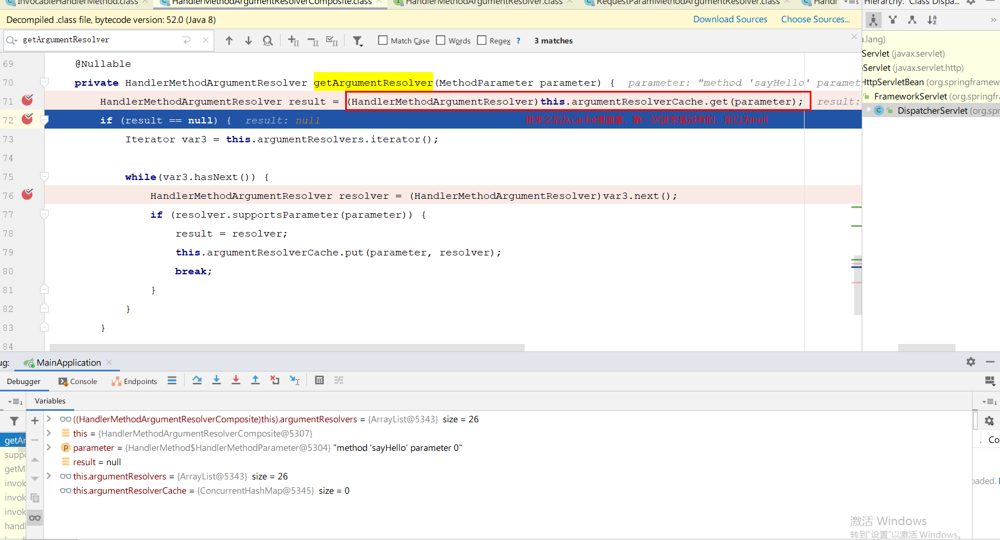
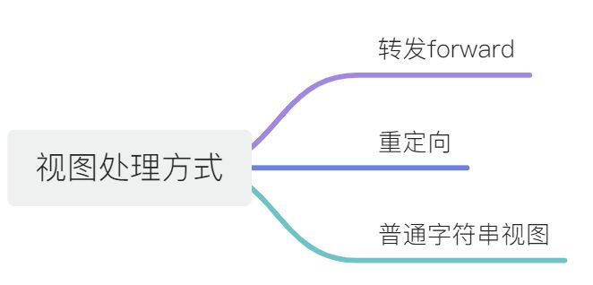
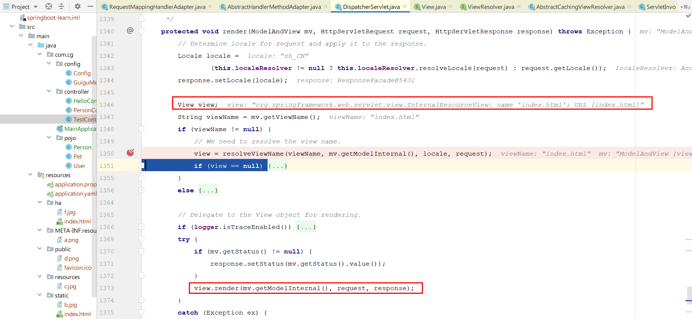

**笔记来源：**[**【尚硅谷】SpringBoot2零基础入门教程（spring boot2干货满满）**](https://www.bilibili.com/video/BV19K4y1L7MT/?spm_id_from=333.337.search-card.all.click&vd_source=e8046ccbdc793e09a75eb61fe8e84a30)

# 1 SpringMVC自动配置概览
Spring Boot provides auto-configuration for Spring MVC that **works well with most applications.(大多场景我们都无需自定义配置)**   

The auto-configuration adds the following features on top of Spring’s defaults:

+  Inclusion of  `ContentNegotiatingViewResolver` and `BeanNameViewResolver` beans. 
    - 内容协商视图解析器和BeanName视图解析器
+  Support for serving static resources, including support for WebJars (covered [later in this document](https://docs.spring.io/spring-boot/docs/current/reference/html/spring-boot-features.html#boot-features-spring-mvc-static-content))). 
    - 静态资源（包括webjars）
+  Automatic registration of `Converter` , `GenericConverter` , and `Formatter` beans. 
    - 自动注册 `Converter，GenericConverter，Formatter` 
+  Support for `HttpMessageConverters` (covered [later in this document](https://docs.spring.io/spring-boot/docs/current/reference/html/spring-boot-features.html#boot-features-spring-mvc-message-converters)). 
    - 支持 `HttpMessageConverters` （后来我们配合内容协商理解原理）
+  Automatic registration of `MessageCodesResolver` (covered [later in this document](https://docs.spring.io/spring-boot/docs/current/reference/html/spring-boot-features.html#boot-features-spring-message-codes)). 
    - 自动注册 `MessageCodesResolver` （国际化用）
+  Static `index.html` support. 
    - 静态index.html 页支持
+  Custom `Favicon` support (covered [later in this document](https://docs.spring.io/spring-boot/docs/current/reference/html/spring-boot-features.html#boot-features-spring-mvc-favicon)). 
    - 自定义 `Favicon`
+  Automatic use of a `ConfigurableWebBindingInitializer` bean (covered [later in this document](https://docs.spring.io/spring-boot/docs/current/reference/html/spring-boot-features.html#boot-features-spring-mvc-web-binding-initializer)). 
    - 自动使用 `ConfigurableWebBindingInitializer` ，（DataBinder负责将请求数据绑定到JavaBean上）

    ​


> If you want to keep those Spring Boot MVC customizations and make more [MVC customizations](https://docs.spring.io/spring/docs/5.2.9.RELEASE/spring-framework-reference/web.html#mvc) (interceptors, formatters, view controllers, and other features), you can add your own `@Configuration` class of type `WebMvcConfigurer` but **without** `@EnableWebMvc`
>
> **不用@EnableWebMvc注解。使用** `@Configuration` **+** `WebMvcConfigurer` **自定义规则**  
>


> If you want to provide custom instances of  `RequestMappingHandlerMapping` ,  `RequestMappingHandlerAdapter` , or  `ExceptionHandlerExceptionResolver` , and still keep the Spring Boot MVC customizations, you can declare a bean of type  `WebMvcRegistrations`  and use it to provide custom instances of those components. 
>
> **声明** `WebMvcRegistrations`  **改变默认底层组件**  
>


> If you want to take complete control of Spring MVC, you can add your own `@Configuration` annotated with `@EnableWebMvc`, or alternatively add your own `@Configuration`-annotated `DelegatingWebMvcConfiguration` as described in the Javadoc of `@EnableWebMvc`.
>
> **使用** `@EnableWebMvc + @Configuration+DelegatingWebMvcConfiguration ` 全面接管SpringMVC
>

# 2 简单功能分析
## 2.1 静态资源目录
**1)普通访问**  

只要静态资源放在**类路径**下：`/static` `/public` `/resources` `/META-INF/resources`

 

访问 ： 当前项目根路径/  +  静态资源名

  

原理： 静态映射/**。请求进来，先去找Controller看能不能处理。不能处理的所有请求又都交给静态资源处理器。静态资源也找不到则响应404页面。

**2）改变默认的静态资源路径**

也可以改变默认的静态资源路径`/static` `/public` `/resources` `/META-INF/resources`失效

```yaml
spring:
  resources:
    static-locations: "classpath:/ha/"
```

  

  

  

**3）静态资源访问前缀**

```properties
spring.mvc.static-path-pattern=/res/**
```

当前项目 + static-path-pattern + 静态资源名 = 静态资源文件夹下找

  

  

**4）webjar**

可用jar方式添加css，js等资源文件，

[https://www.webjars.org/](https://www.webjars.org/)

例如，添加jquery

```xml
<dependency>
    <groupId>org.webjars</groupId>
    <artifactId>jquery</artifactId>
    <version>3.5.1</version>
</dependency>
```

访问地址：[http://localhost:8080/webjars/**jquery/3.5.1/jquery.js**](http://localhost:8080/webjars/jquery/3.5.1/jquery.js)  后面地址要按照依赖里面的包路径。

    

## 2.2 index页面支持
[官方文档](https://docs.spring.io/spring-boot/docs/2.3.8.RELEASE/reference/htmlsingle/#boot-features-spring-mvc-welcome-page)

+ 静态资源路径下`index.html` 
    - 可以配置静态资源路径
    - 但是不可以配置静态资源的访问前缀。否则导致 index.html不能被默认访问

```yaml
spring:
# 6.  mvc:
# 7.    static-path-pattern: /res/**   这个会导致welcome page功能失效
  resources:
    static-locations: "classpath:/ha/"
```


+ controller能处理`/index`。

## 2.3 自定义Favicon
指网页标签上的小图标。

favicon.ico 放在静态资源目录下即可。


```yaml
spring:
# 8.  mvc:
# 9.    static-path-pattern: /res/**   这个会导致 Favicon 功能失效
# 10.  resources:
# 11.    static-locations: "classpath:/ha/" 这个似乎也会导致 Favicon 功能失效
```

## 2.4 静态资源原理
+ SpringBoot启动默认加载  xxxAutoConfiguration 类（自动配置类）
+ SpringMVC功能的自动配置类`WebMvcAutoConfiguration`，生效

```java
@Configuration(proxyBeanMethods = false)
@ConditionalOnWebApplication(type = Type.SERVLET)
@ConditionalOnClass({ Servlet.class, DispatcherServlet.class, WebMvcConfigurer.class })
@ConditionalOnMissingBean(WebMvcConfigurationSupport.class)
@AutoConfigureOrder(Ordered.HIGHEST_PRECEDENCE + 10)
@AutoConfigureAfter({ DispatcherServletAutoConfiguration.class, TaskExecutionAutoConfiguration.class,
		ValidationAutoConfiguration.class })
public class WebMvcAutoConfiguration {
    ...
}
```

+ 给容器中配置的内容： 
    - 配置文件的相关属性的绑定：`WebMvcProperties==**spring.mvc**`、`ResourceProperties==**spring.resources**`

```java
@Configuration(proxyBeanMethods = false)
@Import(EnableWebMvcConfiguration.class)
@EnableConfigurationProperties({ WebMvcProperties.class, ResourceProperties.class })
@Order(0)
public static class WebMvcAutoConfigurationAdapter implements WebMvcConfigurer {
    ...
}
```

**1）配置类只有一个有参构造器**

```java
//有参构造器所有参数的值都会从容器中确定
//ResourceProperties resourceProperties 获取和spring.resources绑定的所有的值的对象
//WebMvcProperties mvcProperties 获取和spring.mvc绑定的所有的值的对象
//ListableBeanFactory beanFactory Spring的beanFactory
//HttpMessageConverters 找到所有的HttpMessageConverters
//ResourceHandlerRegistrationCustomizer 找到资源处理器的自定义器。
//DispatcherServletPath
//ServletRegistrationBean   给应用注册Servlet、Filter、Listener等
public WebMvcAutoConfigurationAdapter(WebProperties webProperties, WebMvcProperties mvcProperties,
		ListableBeanFactory beanFactory, ObjectProvider<HttpMessageConverters> messageConvertersProvider,
		ObjectProvider<ResourceHandlerRegistrationCustomizer> resourceHandlerRegistrationCustomizerProvider,
		ObjectProvider<DispatcherServletPath> dispatcherServletPath,
		ObjectProvider<ServletRegistrationBean<?>> servletRegistrations) {
	this.mvcProperties = mvcProperties;
	this.beanFactory = beanFactory;
	this.messageConvertersProvider = messageConvertersProvider;
	this.resourceHandlerRegistrationCustomizer = resourceHandlerRegistrationCustomizerProvider.getIfAvailable();
	this.dispatcherServletPath = dispatcherServletPath;
	this.servletRegistrations = servletRegistrations;
	this.mvcProperties.checkConfiguration();
}
```

**2）资源处理的默认规则**

```java
public void addResourceHandlers(ResourceHandlerRegistry registry) {
    if (!this.resourceProperties.isAddMappings()) {
        logger.debug("Default resource handling disabled");
    } else {
        //webjars的规则
        Duration cachePeriod = this.resourceProperties.getCache().getPeriod();
        CacheControl cacheControl = this.resourceProperties.getCache().getCachecontrol().toHttpCacheControl();
        if (!registry.hasMappingForPattern("/webjars/**")) {
            this.customizeResourceHandlerRegistration(registry.addResourceHandler(new String[]{"/webjars/**"}).addResourceLocations(new String[]{"classpath:/META-INF/resources/webjars/"}).setCachePeriod(this.getSeconds(cachePeriod)).setCacheControl(cacheControl));
        }
        //处理静态资源的规则 
        String staticPathPattern = this.mvcProperties.getStaticPathPattern();
        if (!registry.hasMappingForPattern(staticPathPattern)) {
            this.customizeResourceHandlerRegistration(registry.addResourceHandler(new String[]{staticPathPattern}).addResourceLocations(WebMvcAutoConfiguration.getResourceLocations(this.resourceProperties.getStaticLocations())).setCachePeriod(this.getSeconds(cachePeriod)).setCacheControl(cacheControl));
        }

    }
}
```

根据上述代码，我们可以同过配置禁止所有静态资源规则。

```yaml
spring:
  resources:
    add-mappings: false   #禁用所有静态资源规则
```

静态资源规则：

```java
@ConfigurationProperties(prefix = "spring.resources", ignoreUnknownFields = false)
public class ResourceProperties {

    private static final String[] CLASSPATH_RESOURCE_LOCATIONS = { "classpath:/META-INF/resources/",
            "classpath:/resources/", "classpath:/static/", "classpath:/public/" };

    /**
     * Locations of static resources. Defaults to classpath:[/META-INF/resources/,
     * /resources/, /static/, /public/].
     */
    private String[] staticLocations = CLASSPATH_RESOURCE_LOCATIONS;
    ...
}
```

**3）欢迎页的处理规则**

```java
...
public class WebMvcAutoConfiguration {
    ...
	public static class EnableWebMvcConfiguration extends DelegatingWebMvcConfiguration implements ResourceLoaderAware {
        ...
		@Bean
		public WelcomePageHandlerMapping welcomePageHandlerMapping(ApplicationContext applicationContext,
				FormattingConversionService mvcConversionService, ResourceUrlProvider mvcResourceUrlProvider) {
			WelcomePageHandlerMapping welcomePageHandlerMapping = new WelcomePageHandlerMapping(
					new TemplateAvailabilityProviders(applicationContext), applicationContext, getWelcomePage(),
					this.mvcProperties.getStaticPathPattern());
			welcomePageHandlerMapping.setInterceptors(getInterceptors(mvcConversionService, mvcResourceUrlProvider));
			welcomePageHandlerMapping.setCorsConfigurations(getCorsConfigurations());
			return welcomePageHandlerMapping;
		}
```

`WelcomePageHandlerMapping`的构造方法如下：

```java
WelcomePageHandlerMapping(TemplateAvailabilityProviders templateAvailabilityProviders,
                          ApplicationContext applicationContext, Resource welcomePage, String staticPathPattern) {
    if (welcomePage != null && "/**".equals(staticPathPattern)) {
        //要用欢迎页功能，必须是/**
        logger.info("Adding welcome page: " + welcomePage);
        setRootViewName("forward:index.html");
    }
    else if (welcomeTemplateExists(templateAvailabilityProviders, applicationContext)) {
        //调用Controller /index
        logger.info("Adding welcome page template: index");
        setRootViewName("index");
    }
}
```

这构造方法内的代码也解释了web场景-welcome与favicon功能中配置`static-path-pattern`了，welcome页面和小图标失效的问题。

# 3 请求参数处理
## 3.1 请求映射解析
### 3.1.1 rest使用与原理
+  @xxxMapping; 
    - @GetMapping  
    - @PostMapping  
    - @PutMapping  
    - @DeleteMapping  
+  Rest风格支持（使用**HTTP**请求方式动词来表示对资源的操作） 
    - 以前： 
        * /getUser 获取用户
        * /deleteUser 删除用户
        * /editUser 修改用户
        * /saveUser保存用户
    - 现在： /user 
        * GET-获取用户
        * DELETE-删除用户
        * PUT-修改用户
        * POST-保存用户
    - 核心Filter；HiddenHttpMethodFilter
+  **用法** 
    - 开启页面表单的Rest功能
    - 页面 form的属性method=post，隐藏域 _method=put、delete等（如果直接get或post，无需隐藏域）
    - 编写请求映射

```yaml
spring:
  mvc:
    hiddenmethod:
      filter:
        enabled: true   #开启页面表单的Rest功能
```

```html
<form action="/user" method="get">
    <input value="REST-GET提交" type="submit" />
</form>

<form action="/user" method="post">
    <input value="REST-POST提交" type="submit" />
</form>

<form action="/user" method="post">
    <input name="_method" type="hidden" value="DELETE"/>
    <input value="REST-DELETE 提交" type="submit"/>
</form>

<form action="/user" method="post">
    <input name="_method" type="hidden" value="PUT" />
    <input value="REST-PUT提交"type="submit" />
<form>
```

```java
@GetMapping("/user")
//@RequestMapping(value = "/user",method = RequestMethod.GET)
public String getUser(){
    return "GET-张三";
}

@PostMapping("/user")
//@RequestMapping(value = "/user",method = RequestMethod.POST)
public String saveUser(){
    return "POST-张三";
}

@PutMapping("/user")
//@RequestMapping(value = "/user",method = RequestMethod.PUT)
public String putUser(){
    return "PUT-张三";
}

@DeleteMapping("/user")
//@RequestMapping(value = "/user",method = RequestMethod.DELETE)
public String deleteUser(){
    return "DELETE-张三";
}
```

Rest原理（表单提交要使用REST的时候） 

    - 表单提交会带上`_method=PUT`
    - **请求过来被**`HiddenHttpMethodFilter`拦截 
        * 请求是否正常，并且是POST 
            + 获取到`\_method`的值。
            + 兼容以下请求；`**PUT**``**DELETE**``**PATCH**`
            + **原生request（post），包装模式requesWrapper重写了getMethod方法，返回的是传入的值。**
            + **过滤器链放行的时候用wrapper。以后的方法调用getMethod是调用requesWrapper的。**

```java
public class HiddenHttpMethodFilter extends OncePerRequestFilter {

	private static final List<String> ALLOWED_METHODS =
			Collections.unmodifiableList(Arrays.asList(HttpMethod.PUT.name(),
					HttpMethod.DELETE.name(), HttpMethod.PATCH.name()));

	/** Default method parameter: {@code _method}. */
	public static final String DEFAULT_METHOD_PARAM = "_method";

	private String methodParam = DEFAULT_METHOD_PARAM;


	/**
	 * Set the parameter name to look for HTTP methods.
	 * @see #DEFAULT_METHOD_PARAM
	 */
	public void setMethodParam(String methodParam) {
		Assert.hasText(methodParam, "'methodParam' must not be empty");
		this.methodParam = methodParam;
	}

	@Override
	protected void doFilterInternal(HttpServletRequest request, HttpServletResponse response, FilterChain filterChain)
			throws ServletException, IOException {

		HttpServletRequest requestToUse = request;
        //查看原始的请求是不是POST，如果是表单请求，则只有POST和GET两种方式，如果需要PUT和DELETE则需要表单的方式为POST
		if ("POST".equals(request.getMethod()) && request.getAttribute(WebUtils.ERROR_EXCEPTION_ATTRIBUTE) == null) {
			String paramValue = request.getParameter(this.methodParam);//看看有没有_method属性
			if (StringUtils.hasLength(paramValue)) {//如果有_method属性
				String method = paramValue.toUpperCase(Locale.ENGLISH);
				if (ALLOWED_METHODS.contains(method)) {
					requestToUse = new HttpMethodRequestWrapper(request, method);//此处使用装饰器模式包装原来的request
				}
			}
		}

		filterChain.doFilter(requestToUse, response);
	}


	/**
	 * Simple {@link HttpServletRequest} wrapper that returns the supplied method for
	 * {@link HttpServletRequest#getMethod()}.
	 */
	private static class HttpMethodRequestWrapper extends HttpServletRequestWrapper {

		private final String method;

		public HttpMethodRequestWrapper(HttpServletRequest request, String method) {
			super(request);
			this.method = method;
		}

		@Override
		public String getMethod() {
			return this.method;
		}
	}

}
```

Rest使用客户端工具。 

    - 如PostMan可直接发送put、delete等方式请求。

**怎么改变默认的_method**

```java
@Configuration(proxyBeanMethods = false)
@ConditionalOnWebApplication(type = Type.SERVLET)
@ConditionalOnClass({ Servlet.class, DispatcherServlet.class, WebMvcConfigurer.class })
@ConditionalOnMissingBean(WebMvcConfigurationSupport.class)
@AutoConfigureOrder(Ordered.HIGHEST_PRECEDENCE + 10)
@AutoConfigureAfter({ DispatcherServletAutoConfiguration.class, TaskExecutionAutoConfiguration.class,
		ValidationAutoConfiguration.class })
public class WebMvcAutoConfiguration {

    ...
    
    @Bean
    @ConditionalOnMissingBean(HiddenHttpMethodFilter.class)
    @ConditionalOnProperty(prefix = "spring.mvc.hiddenmethod.filter", name = "enabled", matchIfMissing = false)
    public OrderedHiddenHttpMethodFilter hiddenHttpMethodFilter() {
        return new OrderedHiddenHttpMethodFilter();
    }
    
    ...
}
```

`@ConditionalOnMissingBean(HiddenHttpMethodFilter.class)`意味着在没有`HiddenHttpMethodFilter`时，才执行`hiddenHttpMethodFilter()`。因此，我们可以自定义filter，改变默认的`_method`。例如：

```java
@Configuration(proxyBeanMethods = false)
public class WebConfig{
    //自定义filter
    @Bean
    public HiddenHttpMethodFilter hiddenHttpMethodFilter(){
        HiddenHttpMethodFilter methodFilter = new HiddenHttpMethodFilter();
        methodFilter.setMethodParam("_m");
        return methodFilter;
    }    
}
```

将`_method`改成`_m`。

```html
<form action="/user" method="post">
    <input name="_m" type="hidden" value="DELETE"/>
    <input value="REST-DELETE 提交" type="submit"/>
</form>
```

### 3.1.2 请求映射原理


第一步：


第二步：


第三步：


第四步：


第五步：


```java
protected void doDispatch(HttpServletRequest request, HttpServletResponse response) throws Exception {
    HttpServletRequest processedRequest = request;
    HandlerExecutionChain mappedHandler = null;
    boolean multipartRequestParsed = false;

    WebAsyncManager asyncManager = WebAsyncUtils.getAsyncManager(request);

    try {
        ModelAndView mv = null;
        Exception dispatchException = null;

        try {
            processedRequest = checkMultipart(request);
            multipartRequestParsed = (processedRequest != request);

            // 找到当前请求使用哪个Handler（Controller的方法）处理
            mappedHandler = getHandler(processedRequest);

            //HandlerMapping：处理器映射。/xxx->>xxxx
    ...
}
```

`getHandler()`方法如下：

```java
@Nullable
protected HandlerExecutionChain getHandler(HttpServletRequest request) throws Exception {
    if (this.handlerMappings != null) {
        for (HandlerMapping mapping : this.handlerMappings) {
            HandlerExecutionChain handler = mapping.getHandler(request);
            if (handler != null) {
                return handler;
            }
        }
    }
    return null;
}
```

`this.handlerMappings`在Debug模式下展现的内容：


**RequestMappingHandlerMapping**：保存了所有@RequestMapping 和handler的映射规则。  


WelcomePageHandlerMapping中保留的`/`,访问 /能访问到index.html


所有的请求映射都在HandlerMapping中：

+  SpringBoot自动配置欢迎页的 WelcomePageHandlerMapping 。访问 /能访问到index.html； 
+  SpringBoot自动配置了默认 的 RequestMappingHandlerMapping 
+  请求进来，挨个尝试所有的HandlerMapping看是否有请求信息。 
    - 如果有就找到这个请求对应的handler
    - 如果没有就是下一个HandlerMapping
+  我们需要一些自定义的映射处理，我们也可以自己给容器中放**HandlerMapping**。自定义**HandlerMapping** 

IDEA快捷键：

+ Ctrl + Alt + U : 以UML的类图展现类有哪些继承类，派生类以及实现哪些接口。
+ Crtl + Alt + Shift + U : 同上，区别在于上条快捷键结果在新页展现，而本条快捷键结果在弹窗展现。
+ Ctrl + H : 以树形方式展现类层次结构图。

## 3.2 普通参数和基本注解
+ `@PathVariable` 路径变量
+ `@RequestHeader` 获取请求头
+ `@RequestParam` 获取请求参数（指问号后的参数，`url?a=1&b=2`）
+ `@CookieValue` 获取Cookie值
+ `@RequestAttribute` 获取request域属性
+ `@RequestBody` 获取请求体[POST]
+ `@MatrixVariable` 矩阵变量
+ `@ModelAttribute`


**1）使用用例：**

```java
@RestController
public class ParameterTestController {


    //  car/2/owner/zhangsan
    @GetMapping("/car/{id}/owner/{username}")
    public Map<String,Object> getCar(@PathVariable("id") Integer id,
                                     @PathVariable("username") String name,
                                     @PathVariable Map<String,String> pv,
                                     @RequestHeader("User-Agent") String userAgent,
                                     @RequestHeader Map<String,String> header,
                                     @RequestParam("age") Integer age,
                                     @RequestParam("inters") List<String> inters,
                                     @RequestParam Map<String,String> params,
                                     @CookieValue("_ga") String _ga,
                                     @CookieValue("_ga") Cookie cookie){

        Map<String,Object> map = new HashMap<>();

//        map.put("id",id);
//        map.put("name",name);
//        map.put("pv",pv);
//        map.put("userAgent",userAgent);
//        map.put("headers",header);
        map.put("age",age);
        map.put("inters",inters);
        map.put("params",params);
        map.put("_ga",_ga);
        System.out.println(cookie.getName()+"===>"+cookie.getValue());
        return map;
    }


    @PostMapping("/save")
    public Map postMethod(@RequestBody String content){
        Map<String,Object> map = new HashMap<>();
        map.put("content",content);
        return map;
    }
}
```

**2）**`**@RequestAttribute**`**用例：**

```java
@Controller
public class RequestController {

    @GetMapping("/goto")
    public String goToPage(HttpServletRequest request){

        request.setAttribute("msg","成功了...");
        request.setAttribute("code",200);
        return "forward:/success";  //转发到  /success请求
    }

    @GetMapping("/params")
    public String testParam(Map<String,Object> map,
                            Model model,
                            HttpServletRequest request,
                            HttpServletResponse response){
        map.put("hello","world666");
        model.addAttribute("world","hello666");
        request.setAttribute("message","HelloWorld");

        Cookie cookie = new Cookie("c1","v1");
        response.addCookie(cookie);
        return "forward:/success";
    }

    ///<-----------------主角@RequestAttribute在这个方法
    @ResponseBody
    @GetMapping("/success")
    public Map success(@RequestAttribute(value = "msg",required = false) String msg,
                       @RequestAttribute(value = "code",required = false) Integer code,
                       HttpServletRequest request){
        Object msg1 = request.getAttribute("msg");

        Map<String,Object> map = new HashMap<>();
        Object hello = request.getAttribute("hello");
        Object world = request.getAttribute("world");
        Object message = request.getAttribute("message");

        map.put("reqMethod_msg",msg1);
        map.put("annotation_msg",msg);
        map.put("hello",hello);
        map.put("world",world);
        map.put("message",message);

        return map;
    }
}
```

**3）**`**@MatrixVariable**`**与**`**UrlPathHelper**`

1.  语法： 请求路径：`/cars/sell;low=34;brand=byd,audi,yd` 
2.  SpringBoot默认是禁用了矩阵变量的功能 
    - 手动开启：原理。对于路径的处理。UrlPathHelper的removeSemicolonContent设置为false，让其支持矩阵变量的。
3.  矩阵变量**必须**有url路径变量才能被解析 


**手动开启矩阵变量**：

+ 方式一：实现`WebMvcConfigurer`接口：

```java
@Configuration(proxyBeanMethods = false)
public class WebConfig implements WebMvcConfigurer {
    @Override
    public void configurePathMatch(PathMatchConfigurer configurer) {

        UrlPathHelper urlPathHelper = new UrlPathHelper();
        // 不移除；后面的内容。矩阵变量功能就可以生效
        urlPathHelper.setRemoveSemicolonContent(false);
        configurer.setUrlPathHelper(urlPathHelper);
    }
}
```

+ 方式二：创建返回`WebMvcConfigurer`Bean：

```java
@Configuration(proxyBeanMethods = false)
public class WebConfig{
    @Bean
    public WebMvcConfigurer webMvcConfigurer(){
        return new WebMvcConfigurer() {
                        @Override
            public void configurePathMatch(PathMatchConfigurer configurer) {
                UrlPathHelper urlPathHelper = new UrlPathHelper();
                // 不移除；后面的内容。矩阵变量功能就可以生效
                urlPathHelper.setRemoveSemicolonContent(false);
                configurer.setUrlPathHelper(urlPathHelper);
            }
        }
    }
}
```

`**@MatrixVariable**`**的用例**

```java
@RestController
public class ParameterTestController {

    ///cars/sell;low=34;brand=byd,audi,yd
    @GetMapping("/cars/{path}")
    public Map carsSell(@MatrixVariable("low") Integer low,
                        @MatrixVariable("brand") List<String> brand,
                        @PathVariable("path") String path){
        Map<String,Object> map = new HashMap<>();

        map.put("low",low);
        map.put("brand",brand);
        map.put("path",path);
        return map;
    }

    // /boss/1;age=20/2;age=10

    @GetMapping("/boss/{bossId}/{empId}")
    public Map boss(@MatrixVariable(value = "age",pathVar = "bossId") Integer bossAge,
                    @MatrixVariable(value = "age",pathVar = "empId") Integer empAge){
        Map<String,Object> map = new HashMap<>();

        map.put("bossAge",bossAge);
        map.put("empAge",empAge);
        return map;

    }

}
```

## 3.3 请求参数处理原理
这要从`DispatcherServlet`开始说起：


```java
public class DispatcherServlet extends FrameworkServlet {
    
    protected void doDispatch(HttpServletRequest request, HttpServletResponse response) throws Exception {
        HttpServletRequest processedRequest = request;
        HandlerExecutionChain mappedHandler = null;
        boolean multipartRequestParsed = false;

        WebAsyncManager asyncManager = WebAsyncUtils.getAsyncManager(request);

        try {
            ModelAndView mv = null;
            Exception dispatchException = null;

            try {
                processedRequest = checkMultipart(request);
                multipartRequestParsed = (processedRequest != request);

                // Determine handler for the current request.
                mappedHandler = getHandler(processedRequest);
                if (mappedHandler == null) {
                    noHandlerFound(processedRequest, response);
                    return;
                }

                // Determine handler adapter for the current request.
                HandlerAdapter ha = getHandlerAdapter(mappedHandler.getHandler());
                ...
```

+ `HandlerMapping`中找到能处理请求的`Handler`（`Controller.method()`其实handler可以理解为controller里面的具体某个请求方法）。
+ 为当前Handler 找一个适配器 `HandlerAdapter`，用的最多的是**RequestMappingHandlerAdapter**。
+ 适配器执行目标方法并确定方法参数的每一个值。

### 3.4.1 **HandlerAdapter**
**第一步：找到合适的HandlerAdapter**

默认会加载所有`HandlerAdapter`

```java
public class DispatcherServlet extends FrameworkServlet {

    /** Detect all HandlerAdapters or just expect "handlerAdapter" bean?. */
    private boolean detectAllHandlerAdapters = true;

    ...
    
    private void initHandlerAdapters(ApplicationContext context) {
        this.handlerAdapters = null;

        if (this.detectAllHandlerAdapters) {
            // Find all HandlerAdapters in the ApplicationContext, including ancestor contexts.
            Map<String, HandlerAdapter> matchingBeans =
                BeanFactoryUtils.beansOfTypeIncludingAncestors(context, HandlerAdapter.class, true, false);
            if (!matchingBeans.isEmpty()) {
                this.handlerAdapters = new ArrayList<>(matchingBeans.values());
                // We keep HandlerAdapters in sorted order.
                AnnotationAwareOrderComparator.sort(this.handlerAdapters);
            }
        }
     ...
```

有这些`HandlerAdapter`：


1.  支持方法上标注`@RequestMapping` 
2.  支持函数式编程的 


因为就是当前的handler就是属于HandlerMethod，所以就会交给RequestMappingHandlerAdapter来处理。

### 3.4.2 **执行目标方法**
**第二步：执行目标方法**


```java
public class DispatcherServlet extends FrameworkServlet {
    
	protected void doDispatch(HttpServletRequest request, HttpServletResponse response) throws Exception {
        ModelAndView mv = null;
        
        ...

        // Determine handler for the current request.
        mappedHandler = getHandler(processedRequest);
        if (mappedHandler == null) {
            noHandlerFound(processedRequest, response);
            return;
        }

        // Determine handler adapter for the current request.
        HandlerAdapter ha = getHandlerAdapter(mappedHandler.getHandler());

        ...
		//本节重点
        // Actually invoke the handler.
        mv = ha.handle(processedRequest, response, mappedHandler.getHandler());
```

接下来进入handle方法里面

`HandlerAdapter`接口实现类`RequestMappingHandlerAdapter`（主要用来处理`@RequestMapping`）

```java
public class RequestMappingHandlerAdapter extends AbstractHandlerMethodAdapter
		implements BeanFactoryAware, InitializingBean {

    ...
    
    //AbstractHandlerMethodAdapter类的方法，RequestMappingHandlerAdapter继承AbstractHandlerMethodAdapter
	public final ModelAndView handle(HttpServletRequest request, HttpServletResponse response, Object handler)
        throws Exception {

        return handleInternal(request, response, (HandlerMethod) handler);
    }

	@Override
	protected ModelAndView handleInternal(HttpServletRequest request,
			HttpServletResponse response, HandlerMethod handlerMethod) throws Exception {
    	ModelAndView mav;
        //handleInternal的核心
        mav = invokeHandlerMethod(request, response, handlerMethod);//解释看下节
		//...
		return mav;
    }
}
```

先执行父类AbstractHandlerMethodAdapter的handle方法


接下来执行


执行invokeHandlerMethod方法


这这里面会有26个参数解析器


接下来开始分析这些参数解析器

### 3.4.3 **参数解析器**
**第三步：参数解析器**


### 3.4.4 **返回值处理器**
**第四步：返回值处理器**

15个返回值处理器


### 3.5.5 **如何确定目标方法的每一个参数值**
**第五步：如何确定目标方法的每一个参数值**


进入到这个方法里面


确定将要执行的目标方法的每一个参数的值是什么;

接下来重点分析`getMethodArgumentValues`这个方法


```java
 protected Object[] getMethodArgumentValues(NativeWebRequest request, @Nullable ModelAndViewContainer mavContainer, Object... providedArgs) throws Exception {
        MethodParameter[] parameters = this.getMethodParameters();
        if (ObjectUtils.isEmpty(parameters)) {
            return EMPTY_ARGS;
        } else {
            Object[] args = new Object[parameters.length];

            for(int i = 0; i < parameters.length; ++i) {
                MethodParameter parameter = parameters[i];
                parameter.initParameterNameDiscovery(this.parameterNameDiscoverer);
                args[i] = findProvidedArgument(parameter, providedArgs);
                if (args[i] == null) {
                    if (!this.resolvers.supportsParameter(parameter)) {
                        throw new IllegalStateException(formatArgumentError(parameter, "No suitable resolver"));
                    }

                    try {
                        args[i] = this.resolvers.resolveArgument(parameter, mavContainer, request, this.dataBinderFactory);
                    } catch (Exception var10) {
                        if (this.logger.isDebugEnabled()) {
                            String exMsg = var10.getMessage();
                            if (exMsg != null && !exMsg.contains(parameter.getExecutable().toGenericString())) {
                                this.logger.debug(formatArgumentError(parameter, exMsg));
                            }
                        }

                        throw var10;
                    }
                }
            }

            return args;
        }
    }
```

`MethodParameter[] parameters = this.getMethodParameters();`分析这行代码，对应的controll方法为

```java
@RequestMapping("/hello/{id}")
public String sayHello(@PathVariable("id") Integer id,@RequestParam("name") String name){
    log.info("ssss");
    return "hello, spring boot";
}
```


接下来


进入之后，我们发现，是一个循环遍历，也就是说spring框架在循环遍历26个参数解析器，看哪一个是符合的，然后调用哪一个去解析


不信我们继续往下走


拿到的第一个参数解析器是`RequestParamMethodArgumentResolver`，这个应该是不匹配的，因为我们controller方法里面对应的第一个参数加的`@PathVariable`注解，所以应该会跳过。




至此，我们终于找到了第一个参数与之匹配的参数解析器


我们再来看看每一个参数解析器的构造是啥样的

```java
public interface HandlerMethodArgumentResolver {
    boolean supportsParameter(MethodParameter var1);//是否支持某种参数的解析，如果支持，则调用resolveArgument方法去解析

    @Nullable
    Object resolveArgument(MethodParameter var1, @Nullable ModelAndViewContainer var2, NativeWebRequest var3, @Nullable WebDataBinderFactory var4) throws Exception;
}
```

SpringMVC目标方法能写多少种参数类型。取决于**参数解析器argumentResolvers**。

在解析参数里面，有的还会涉及到数据绑定，接下来可以讲讲数据绑定


就拿`ModelAttributeMethodProcessor`这个参数解析器来举例，里面就会涉及到数据绑定


```java
public boolean supportsParameter(MethodParameter parameter) {
    return parameter.hasParameterAnnotation(ModelAttribute.class) || this.annotationNotRequired && !BeanUtils.isSimpleProperty(parameter.getParameterType());
}


@Nullable
public final Object resolveArgument(MethodParameter parameter, @Nullable ModelAndViewContainer mavContainer, NativeWebRequest webRequest, @Nullable WebDataBinderFactory binderFactory) throws Exception {
    Assert.state(mavContainer != null, "ModelAttributeMethodProcessor requires ModelAndViewContainer");
    Assert.state(binderFactory != null, "ModelAttributeMethodProcessor requires WebDataBinderFactory");
    String name = ModelFactory.getNameForParameter(parameter);
    ModelAttribute ann = (ModelAttribute)parameter.getParameterAnnotation(ModelAttribute.class);
    if (ann != null) {
        mavContainer.setBinding(name, ann.binding());
    }

    Object attribute = null;
    BindingResult bindingResult = null;
    if (mavContainer.containsAttribute(name)) {
        attribute = mavContainer.getModel().get(name);
    } else {
        try {
            attribute = this.createAttribute(name, parameter, binderFactory, webRequest);
        } catch (BindException var10) {
            if (this.isBindExceptionRequired(parameter)) {
                throw var10;
            }

            if (parameter.getParameterType() == Optional.class) {
                attribute = Optional.empty();
            }

            bindingResult = var10.getBindingResult();
        }
    }

    if (bindingResult == null) {
        WebDataBinder binder = binderFactory.createBinder(webRequest, attribute, name);
        if (binder.getTarget() != null) {
            if (!mavContainer.isBindingDisabled(name)) {
                this.bindRequestParameters(binder, webRequest);//这个方法里面会涉及到参数绑定
            }

            this.validateIfApplicable(binder, parameter);
            if (binder.getBindingResult().hasErrors() && this.isBindExceptionRequired(binder, parameter)) {
                throw new BindException(binder.getBindingResult());
            }
        }

        if (!parameter.getParameterType().isInstance(attribute)) {
            attribute = binder.convertIfNecessary(binder.getTarget(), parameter.getParameterType(), parameter);
        }

        bindingResult = binder.getBindingResult();
    }

    Map<String, Object> bindingResultModel = bindingResult.getModel();
    mavContainer.removeAttributes(bindingResultModel);
    mavContainer.addAllAttributes(bindingResultModel);
    return attribute;
}

```

通过debug我们发现，确实是有124个converters


这里面会有各种各样的类型转换

进入到`this.bindRequestParameters(binder, webRequest)`方法里面去看看

```java
 protected void bindRequestParameters(WebDataBinder binder, NativeWebRequest request) {
        ((WebRequestDataBinder)binder).bind(request);
}
```

继续进入`((WebRequestDataBinder)binder).bind(request)`里面


继续进入到`doBind`里面去


继续往里面进


进入到`this.applyPropertyValues(mpvs);`


至此则会找到第一个数据绑定器，此处和参数解析器类似，也是遍历去寻找合适的数据绑定器。

至此，参数解析器和寻找，以及参数的解析会全部完成，其中在参数解析的过程中，还会有一个数据绑定的过程

### 3.5.6 目标方法的执行


至此方法的参数的解析和执行都已完成。接下来都可以看方法返回值的处理和派发结果了

## 3.4 Servlet API参数解析原理
+ WebRequest
+ ServletRequest
+ MultipartRequest
+ HttpSession
+ javax.servlet.http.PushBuilder
+ Principal
+ InputStream
+ Reader
+ HttpMethod
+ Locale
+ TimeZone
+ ZoneId

**ServletRequestMethodArgumentResolver**用来处理以上的参数

```java
public class ServletRequestMethodArgumentResolver implements HandlerMethodArgumentResolver {

	@Nullable
	private static Class<?> pushBuilder;

	static {
		try {
			pushBuilder = ClassUtils.forName("javax.servlet.http.PushBuilder",
					ServletRequestMethodArgumentResolver.class.getClassLoader());
		}
		catch (ClassNotFoundException ex) {
			// Servlet 4.0 PushBuilder not found - not supported for injection
			pushBuilder = null;
		}
	}


	@Override
	public boolean supportsParameter(MethodParameter parameter) {
		Class<?> paramType = parameter.getParameterType();
		return (WebRequest.class.isAssignableFrom(paramType) ||
				ServletRequest.class.isAssignableFrom(paramType) ||
				MultipartRequest.class.isAssignableFrom(paramType) ||
				HttpSession.class.isAssignableFrom(paramType) ||
				(pushBuilder != null && pushBuilder.isAssignableFrom(paramType)) ||
				(Principal.class.isAssignableFrom(paramType) && !parameter.hasParameterAnnotations()) ||
				InputStream.class.isAssignableFrom(paramType) ||
				Reader.class.isAssignableFrom(paramType) ||
				HttpMethod.class == paramType ||
				Locale.class == paramType ||
				TimeZone.class == paramType ||
				ZoneId.class == paramType);
	}

	@Override
	public Object resolveArgument(MethodParameter parameter, @Nullable ModelAndViewContainer mavContainer,
			NativeWebRequest webRequest, @Nullable WebDataBinderFactory binderFactory) throws Exception {

		Class<?> paramType = parameter.getParameterType();

		// WebRequest / NativeWebRequest / ServletWebRequest
		if (WebRequest.class.isAssignableFrom(paramType)) {
			if (!paramType.isInstance(webRequest)) {
				throw new IllegalStateException(
						"Current request is not of type [" + paramType.getName() + "]: " + webRequest);
			}
			return webRequest;
		}

		// ServletRequest / HttpServletRequest / MultipartRequest / MultipartHttpServletRequest
		if (ServletRequest.class.isAssignableFrom(paramType) || MultipartRequest.class.isAssignableFrom(paramType)) {
			return resolveNativeRequest(webRequest, paramType);
		}

		// HttpServletRequest required for all further argument types
		return resolveArgument(paramType, resolveNativeRequest(webRequest, HttpServletRequest.class));
	}

	private <T> T resolveNativeRequest(NativeWebRequest webRequest, Class<T> requiredType) {
		T nativeRequest = webRequest.getNativeRequest(requiredType);
		if (nativeRequest == null) {
			throw new IllegalStateException(
					"Current request is not of type [" + requiredType.getName() + "]: " + webRequest);
		}
		return nativeRequest;
	}

	@Nullable
	private Object resolveArgument(Class<?> paramType, HttpServletRequest request) throws IOException {
		if (HttpSession.class.isAssignableFrom(paramType)) {
			HttpSession session = request.getSession();
			if (session != null && !paramType.isInstance(session)) {
				throw new IllegalStateException(
						"Current session is not of type [" + paramType.getName() + "]: " + session);
			}
			return session;
		}
		else if (pushBuilder != null && pushBuilder.isAssignableFrom(paramType)) {
			return PushBuilderDelegate.resolvePushBuilder(request, paramType);
		}
		else if (InputStream.class.isAssignableFrom(paramType)) {
			InputStream inputStream = request.getInputStream();
			if (inputStream != null && !paramType.isInstance(inputStream)) {
				throw new IllegalStateException(
						"Request input stream is not of type [" + paramType.getName() + "]: " + inputStream);
			}
			return inputStream;
		}
		else if (Reader.class.isAssignableFrom(paramType)) {
			Reader reader = request.getReader();
			if (reader != null && !paramType.isInstance(reader)) {
				throw new IllegalStateException(
						"Request body reader is not of type [" + paramType.getName() + "]: " + reader);
			}
			return reader;
		}
		else if (Principal.class.isAssignableFrom(paramType)) {
			Principal userPrincipal = request.getUserPrincipal();
			if (userPrincipal != null && !paramType.isInstance(userPrincipal)) {
				throw new IllegalStateException(
						"Current user principal is not of type [" + paramType.getName() + "]: " + userPrincipal);
			}
			return userPrincipal;
		}
		else if (HttpMethod.class == paramType) {
			return HttpMethod.resolve(request.getMethod());
		}
		else if (Locale.class == paramType) {
			return RequestContextUtils.getLocale(request);
		}
		else if (TimeZone.class == paramType) {
			TimeZone timeZone = RequestContextUtils.getTimeZone(request);
			return (timeZone != null ? timeZone : TimeZone.getDefault());
		}
		else if (ZoneId.class == paramType) {
			TimeZone timeZone = RequestContextUtils.getTimeZone(request);
			return (timeZone != null ? timeZone.toZoneId() : ZoneId.systemDefault());
		}

		// Should never happen...
		throw new UnsupportedOperationException("Unknown parameter type: " + paramType.getName());
	}


	/**
	 * Inner class to avoid a hard dependency on Servlet API 4.0 at runtime.
	 */
	private static class PushBuilderDelegate {

		@Nullable
		public static Object resolvePushBuilder(HttpServletRequest request, Class<?> paramType) {
			PushBuilder pushBuilder = request.newPushBuilder();
			if (pushBuilder != null && !paramType.isInstance(pushBuilder)) {
				throw new IllegalStateException(
						"Current push builder is not of type [" + paramType.getName() + "]: " + pushBuilder);
			}
			return pushBuilder;

		}
	}
}
```


用例：

```java
@Controller
public class RequestController {

    @GetMapping("/goto")
    public String goToPage(HttpServletRequest request){

        request.setAttribute("msg","成功了...");
        request.setAttribute("code",200);
        return "forward:/success";  //转发到  /success请求
    }
}
```


## 3.5 复杂参数原理
复杂参数：

+  **Map** 
+  **Model（map、model里面的数据会被放在request的请求域request.setAttribute）** 
+  Errors/BindingResult 
+  **RedirectAttributes（ 重定向携带数据）** 
+  **ServletResponse（response）** 
+  SessionStatus 
+  UriComponentsBuilder 
+  ServletUriComponentsBuilder 

用例：

```java
@GetMapping("/params")
public String testParam(Map<String,Object> map,
                        Model model,
                        HttpServletRequest request,
                        HttpServletResponse response){
    //下面三位都是可以给request域中放数据
    map.put("hello","world666");
    model.addAttribute("world","hello666");
    request.setAttribute("message","HelloWorld");

    Cookie cookie = new Cookie("c1","v1");
    response.addCookie(cookie);
    return "forward:/success";
}

@ResponseBody
@GetMapping("/success")
public Map success(@RequestAttribute(value = "msg",required = false) String msg,
                   @RequestAttribute(value = "code",required = false)Integer code,
                   HttpServletRequest request){
    Object msg1 = request.getAttribute("msg");

    Map<String,Object> map = new HashMap<>();
    Object hello = request.getAttribute("hello");//得出testParam方法赋予的值 world666
    Object world = request.getAttribute("world");//得出testParam方法赋予的值 hello666
    Object message = request.getAttribute("message");//得出testParam方法赋予的值 HelloWorld

    map.put("reqMethod_msg",msg1);
    map.put("annotation_msg",msg);
    map.put("hello",hello);
    map.put("world",world);
    map.put("message",message);

    return map;
}
```

+  `Map<String,Object> map` 
+  `Model model` 
+  `HttpServletRequest request` 

上面三位都是可以给request域中放数据，用`request.getAttribute()`获取

接下来我们看看，`Map<String,Object> map`与`Model model`用什么参数处理器。

**1）**`**Map<String,Object> map**`**参数用**`**MapMethodProcessor**`**处理：**

```java
public class MapMethodProcessor implements HandlerMethodArgumentResolver, HandlerMethodReturnValueHandler {

	@Override
	public boolean supportsParameter(MethodParameter parameter) {
		return (Map.class.isAssignableFrom(parameter.getParameterType()) &&
				parameter.getParameterAnnotations().length == 0);
	}

	@Override
	@Nullable
	public Object resolveArgument(MethodParameter parameter, @Nullable ModelAndViewContainer mavContainer,
			NativeWebRequest webRequest, @Nullable WebDataBinderFactory binderFactory) throws Exception {

		Assert.state(mavContainer != null, "ModelAndViewContainer is required for model exposure");
		return mavContainer.getModel();
	}
    
    ...
    
}
```

`mavContainer.getModel()`如下：

```java
public class ModelAndViewContainer {

    ...

	private final ModelMap defaultModel = new BindingAwareModelMap();

	@Nullable
	private ModelMap redirectModel;

    ...

	public ModelMap getModel() {
		if (useDefaultModel()) {
			return this.defaultModel;
		}
		else {
			if (this.redirectModel == null) {
				this.redirectModel = new ModelMap();
			}
			return this.redirectModel;
		}
	}
    
    private boolean useDefaultModel() {
		return (!this.redirectModelScenario || (this.redirectModel == null && !this.ignoreDefaultModelOnRedirect));
	}
    ...
    
}
```

**2）**`**Model model**`**用**`**ModelMethodProcessor**`**处理：**

```java
public class ModelMethodProcessor implements HandlerMethodArgumentResolver, HandlerMethodReturnValueHandler {

	@Override
	public boolean supportsParameter(MethodParameter parameter) {
		return Model.class.isAssignableFrom(parameter.getParameterType());
	}

	@Override
	@Nullable
	public Object resolveArgument(MethodParameter parameter, @Nullable ModelAndViewContainer mavContainer,
			NativeWebRequest webRequest, @Nullable WebDataBinderFactory binderFactory) throws Exception {

		Assert.state(mavContainer != null, "ModelAndViewContainer is required for model exposure");
		return mavContainer.getModel();
	}
    ...
}
```

`return mavContainer.getModel();`这跟`MapMethodProcessor`的一致

`BindingAwareModelMap`的类图如下：


`Model`也是另一种意义的`Map`。

**接下来看看**`Map<String,Object> map`与`Model model`值是如何做到用`request.getAttribute()`获取的。

众所周知，所有的数据都放在 **ModelAndView**包含要去的页面地址View，还包含Model数据。

先看**ModelAndView**接下来是如何处理的？

```java
public class DispatcherServlet extends FrameworkServlet {
    
    ...
    
	protected void doDispatch(HttpServletRequest request, HttpServletResponse response) throws Exception {
		...

		try {
			ModelAndView mv = null;
            
            ...

			// Actually invoke the handler.
			mv = ha.handle(processedRequest, response, mappedHandler.getHandler());
            
            ...
            
			}
			catch (Exception ex) {
				dispatchException = ex;
			}
			catch (Throwable err) {
				// As of 4.3, we're processing Errors thrown from handler methods as well,
				// making them available for @ExceptionHandler methods and other scenarios.
				dispatchException = new NestedServletException("Handler dispatch failed", err);
			}
        	//处理分发结果
			processDispatchResult(processedRequest, response, mappedHandler, mv, dispatchException);
		}
        ...

	}

	private void processDispatchResult(HttpServletRequest request, HttpServletResponse response,
			@Nullable HandlerExecutionChain mappedHandler, @Nullable ModelAndView mv,
			@Nullable Exception exception) throws Exception {
        ...

		// Did the handler return a view to render?
		if (mv != null && !mv.wasCleared()) {
			render(mv, request, response);
			...
		}
		...
	}

	protected void render(ModelAndView mv, HttpServletRequest request, HttpServletResponse response) throws Exception {
		...

		View view;
		String viewName = mv.getViewName();
		if (viewName != null) {
			// We need to resolve the view name.
			view = resolveViewName(viewName, mv.getModelInternal(), locale, request);
			if (view == null) {
				throw new ServletException("Could not resolve view with name '" + mv.getViewName() +
						"' in servlet with name '" + getServletName() + "'");
			}
		}
		else {
			// No need to lookup: the ModelAndView object contains the actual View object.
			view = mv.getView();
			if (view == null) {
				throw new ServletException("ModelAndView [" + mv + "] neither contains a view name nor a " +
						"View object in servlet with name '" + getServletName() + "'");
			}
		}
		view.render(mv.getModelInternal(), request, response);
        
        ...
	}

}
```

在Debug模式下，`view`属为`InternalResourceView`类。

```java
public class InternalResourceView extends AbstractUrlBasedView {
    
 	@Override//该方法在AbstractView，AbstractUrlBasedView继承了AbstractView
	public void render(@Nullable Map<String, ?> model, HttpServletRequest request,
			HttpServletResponse response) throws Exception {
		
        ...
        
		Map<String, Object> mergedModel = createMergedOutputModel(model, request, response);
		prepareResponse(request, response);
        
        //看下一个方法实现
		renderMergedOutputModel(mergedModel, getRequestToExpose(request), response);
	}
    
    @Override
	protected void renderMergedOutputModel(
			Map<String, Object> model, HttpServletRequest request, HttpServletResponse response) throws Exception {

		// Expose the model object as request attributes.
        // 暴露模型作为请求域属性
		exposeModelAsRequestAttributes(model, request);//<---重点

		// Expose helpers as request attributes, if any.
		exposeHelpers(request);

		// Determine the path for the request dispatcher.
		String dispatcherPath = prepareForRendering(request, response);

		// Obtain a RequestDispatcher for the target resource (typically a JSP).
		RequestDispatcher rd = getRequestDispatcher(request, dispatcherPath);
		
        ...
	}
    
    //该方法在AbstractView，AbstractUrlBasedView继承了AbstractView
    protected void exposeModelAsRequestAttributes(Map<String, Object> model,
			HttpServletRequest request) throws Exception {

		model.forEach((name, value) -> {
			if (value != null) {
				request.setAttribute(name, value);
			}
			else {
				request.removeAttribute(name);
			}
		});
	}
    
}
```

`exposeModelAsRequestAttributes`方法看出，`Map<String,Object> map`，`Model model`这两种类型数据可以给request域中放数据，用`request.getAttribute()`获取。

## 3.6 自定义参数绑定原理
```java
@RestController
public class ParameterTestController {

    /**
     * 数据绑定：页面提交的请求数据（GET、POST）都可以和对象属性进行绑定
     * @param person
     * @return
     */
    @PostMapping("/saveuser")
    public Person saveuser(Person person){
        return person;
    }
}
```

```java
/**
 *     姓名： <input name="userName"/> <br/>
 *     年龄： <input name="age"/> <br/>
 *     生日： <input name="birth"/> <br/>
 *     宠物姓名：<input name="pet.name"/><br/>
 *     宠物年龄：<input name="pet.age"/>
 */
@Data
public class Person {
    
    private String userName;
    private Integer age;
    private Date birth;
    private Pet pet;
    
}

@Data
public class Pet {

    private String name;
    private String age;

}
```

封装过程用到`ServletModelAttributeMethodProcessor`，这个类继承的是`ModelAttributeMethodProcessor`并且没有重写resolveArgument方法，所以实际上用的是`ModelAttributeMethodProcessor`的resolveArgument方法


```java
public class ServletModelAttributeMethodProcessor extends ModelAttributeMethodProcessor {
	
    @Override//本方法在ModelAttributeMethodProcessor类，
	public boolean supportsParameter(MethodParameter parameter) {
		return (parameter.hasParameterAnnotation(ModelAttribute.class) ||
				(this.annotationNotRequired && !BeanUtils.isSimpleProperty(parameter.getParameterType())));
	}

	@Override
	@Nullable//本方法在ModelAttributeMethodProcessor类，
	public final Object resolveArgument(MethodParameter parameter, @Nullable ModelAndViewContainer mavContainer,
			NativeWebRequest webRequest, @Nullable WebDataBinderFactory binderFactory) throws Exception {

		...

		String name = ModelFactory.getNameForParameter(parameter);
		ModelAttribute ann = parameter.getParameterAnnotation(ModelAttribute.class);
		if (ann != null) {
			mavContainer.setBinding(name, ann.binding());
		}

		Object attribute = null;
		BindingResult bindingResult = null;

		if (mavContainer.containsAttribute(name)) {
			attribute = mavContainer.getModel().get(name);
		}
		else {
			// Create attribute instance
			try {
				attribute = createAttribute(name, parameter, binderFactory, webRequest);
			}
			catch (BindException ex) {
				...
			}
		}

		if (bindingResult == null) {
			// Bean property binding and validation;
			// skipped in case of binding failure on construction.
			WebDataBinder binder = binderFactory.createBinder(webRequest, attribute, name);
			if (binder.getTarget() != null) {
				if (!mavContainer.isBindingDisabled(name)) {
                    //web数据绑定器，将请求参数的值绑定到指定的JavaBean里面**
					bindRequestParameters(binder, webRequest);
				}
				validateIfApplicable(binder, parameter);
				if (binder.getBindingResult().hasErrors() && isBindExceptionRequired(binder, parameter)) {
					throw new BindException(binder.getBindingResult());
				}
			}
			// Value type adaptation, also covering java.util.Optional
			if (!parameter.getParameterType().isInstance(attribute)) {
				attribute = binder.convertIfNecessary(binder.getTarget(), parameter.getParameterType(), parameter);
			}
			bindingResult = binder.getBindingResult();
		}

		// Add resolved attribute and BindingResult at the end of the model
		Map<String, Object> bindingResultModel = bindingResult.getModel();
		mavContainer.removeAttributes(bindingResultModel);
		mavContainer.addAllAttributes(bindingResultModel);

		return attribute;
	}
}
```

**WebDataBinder 利用它里面的 Converters 将请求数据转成指定的数据类型。再次封装到JavaBean中**

**在过程当中，用到GenericConversionService：在设置每一个值的时候，找它里面的所有converter那个可以将这个数据类型（request带来参数的字符串）转换到指定的类型**

**此处可以参考3.5.5中的数据绑定。**

## 3.7 自定义数据绑定Converter原理
未来我们可以给WebDataBinder里面放自己的Converter；

下面演示将字符串`啊猫,3`转换成`Pet`对象。

```java
    //1、WebMvcConfigurer定制化SpringMVC的功能
    @Bean
    public WebMvcConfigurer webMvcConfigurer(){
        return new WebMvcConfigurer() {

            @Override
            public void addFormatters(FormatterRegistry registry) {
                registry.addConverter(new Converter<String, Pet>() {

                    @Override
                    public Pet convert(String source) {
                        // 啊猫,3
                        if(!StringUtils.isEmpty(source)){
                            Pet pet = new Pet();
                            String[] split = source.split(",");
                            pet.setName(split[0]);
                            pet.setAge(Integer.parseInt(split[1]));
                            return pet;
                        }
                        return null;
                    }
                });
            }
        };
    }
```

我们发现数据绑定器增加了一个，接下来我们找找我们添加的那一个


****

**在参数解析和数据绑定的过程中，我们用到了多种设计模式，在此处我们做个扩展，可以讲解一下。**

## 3.8 用到的设计模式
### 3.8.1 组合模式
[组合模式](https://www.yuque.com/u21918439/java/wize2h)

我们来看看`HandlerMethodArgumentResolverComposite`这个类


`HandlerMethodArgumentResolverComposite`实现了`HandlerMethodArgumentResolver`接口，并且声明了一个变量`private final List<HandlerMethodArgumentResolver> argumentResolvers = new ArrayList();`这个argumentResolvers变量是`HandlerMethodArgumentResolver`接口的集合。

我们在再看看`HandlerMethodArgumentResolver`这个接口

```java
public interface HandlerMethodArgumentResolver {
    boolean supportsParameter(MethodParameter var1);

    @Nullable
    Object resolveArgument(MethodParameter var1, @Nullable ModelAndViewContainer var2, NativeWebRequest var3, @Nullable WebDataBinderFactory var4) throws Exception;
}
```

里面定义了两个方法

其实现类有


这些实现类里面均实现了这两个方法。

我们可以再看看`RequestMappingHandlerAdapter`这个类


其里面定义了一个`HandlerMethodArgumentResolverComposite`属性，这就是典型的组合模式的引用。

在下面这个方法中给argumentResolvers字段赋值

```java
public void afterPropertiesSet() {
        this.initControllerAdviceCache();
        List handlers;
        if (this.argumentResolvers == null) {
            handlers = this.getDefaultArgumentResolvers();//在这个方法里面，把所有的resolvers添加进去
            this.argumentResolvers = (new HandlerMethodArgumentResolverComposite()).addResolvers(handlers);//给argumentResolvers赋值
        }

        if (this.initBinderArgumentResolvers == null) {
            handlers = this.getDefaultInitBinderArgumentResolvers();
            this.initBinderArgumentResolvers = (new HandlerMethodArgumentResolverComposite()).addResolvers(handlers);
        }

        if (this.returnValueHandlers == null) {
            handlers = this.getDefaultReturnValueHandlers();
            this.returnValueHandlers = (new HandlerMethodReturnValueHandlerComposite()).addHandlers(handlers);
        }

    }
```

```java
 private List<HandlerMethodArgumentResolver> getDefaultArgumentResolvers() {
        List<HandlerMethodArgumentResolver> resolvers = new ArrayList(30);
        resolvers.add(new RequestParamMethodArgumentResolver(this.getBeanFactory(), false));
        resolvers.add(new RequestParamMapMethodArgumentResolver());
        resolvers.add(new PathVariableMethodArgumentResolver());
        resolvers.add(new PathVariableMapMethodArgumentResolver());
        resolvers.add(new MatrixVariableMethodArgumentResolver());
        resolvers.add(new MatrixVariableMapMethodArgumentResolver());
        resolvers.add(new ServletModelAttributeMethodProcessor(false));
        resolvers.add(new RequestResponseBodyMethodProcessor(this.getMessageConverters(), this.requestResponseBodyAdvice));
        resolvers.add(new RequestPartMethodArgumentResolver(this.getMessageConverters(), this.requestResponseBodyAdvice));
        resolvers.add(new RequestHeaderMethodArgumentResolver(this.getBeanFactory()));
        resolvers.add(new RequestHeaderMapMethodArgumentResolver());
        resolvers.add(new ServletCookieValueMethodArgumentResolver(this.getBeanFactory()));
        resolvers.add(new ExpressionValueMethodArgumentResolver(this.getBeanFactory()));
        resolvers.add(new SessionAttributeMethodArgumentResolver());
        resolvers.add(new RequestAttributeMethodArgumentResolver());
        resolvers.add(new ServletRequestMethodArgumentResolver());
        resolvers.add(new ServletResponseMethodArgumentResolver());
        resolvers.add(new HttpEntityMethodProcessor(this.getMessageConverters(), this.requestResponseBodyAdvice));
        resolvers.add(new RedirectAttributesMethodArgumentResolver());
        resolvers.add(new ModelMethodProcessor());
        resolvers.add(new MapMethodProcessor());
        resolvers.add(new ErrorsMethodArgumentResolver());
        resolvers.add(new SessionStatusMethodArgumentResolver());
        resolvers.add(new UriComponentsBuilderMethodArgumentResolver());
        if (this.getCustomArgumentResolvers() != null) {
            resolvers.addAll(this.getCustomArgumentResolvers());
        }

        resolvers.add(new RequestParamMethodArgumentResolver(this.getBeanFactory(), true));
        resolvers.add(new ServletModelAttributeMethodProcessor(true));
        return resolvers;
    }
```

至此，这个组合模式可以理解为完成。

### 3.8.2 适配器模式
稍后研究//TODO<font style="background:#F8CED3;color:#70000D">待办

## 3.9 总结
本节描述，一个请求发送到DispatcherServlet后的具体处理流程，也就是SpringMVC的主要原理。

本节内容较多且硬核，对日后编程很有帮助，需耐心对待。

可以运行一个示例，打断点，在Debug模式下，查看程序流程。

# 4 数据响应与内容协商


本章我们重点看响应数据，暂时不看响应页面

## 4.1 响应JSON
`jackson.jar`+`@ResponseBody`

假设给前端自动返回json数据，需要引入相关的依赖

```xml
<dependency>
    <groupId>org.springframework.boot</groupId>
    spring-boot-starter-web</artifactId>
</dependency>

<!-- 在spring-boot-starter-web中引入 -->
<dependency>
    <groupId>org.springframework.boot</groupId>
    spring-boot-starter-json</artifactId>
    <version>2.3.4.RELEASE</version>
    <scope>compile</scope>
</dependency>

<!-- 下面这个三个关于json的依赖，在spring-boot-starter-json中引入的 -->
<dependency>
      <groupId>com.fasterxml.jackson.core</groupId>
      jackson-databind</artifactId>
      <version>2.12.6.1</version>
      <scope>compile</scope>
    </dependency>
    <dependency>
      <groupId>com.fasterxml.jackson.datatype</groupId>
      jackson-datatype-jdk8</artifactId>
      <version>2.12.6</version>
      <scope>compile</scope>
    </dependency>
    <dependency>
      <groupId>com.fasterxml.jackson.datatype</groupId>
      jackson-datatype-jsr310</artifactId>
      <version>2.12.6</version>
      <scope>compile</scope>
    </dependency>
<!-- 所以只需要spring-boot-starter-web就会引入以上所有的依赖 -->
```


控制层代码如下：

```java
@Controller
public class ResponseTestController {
    
	@ResponseBody  //利用返回值处理器里面的消息转换器进行处理
    @GetMapping(value = "/test/person")
    public Person getPerson(){
        Person person = new Person();
        person.setAge(28);
        person.setBirth(new Date());
        person.setUserName("zhangsan");
        return person;
    }

}
```

### 4.1.1 返回值处理器
在上面章节中有粗略的看过返回值处理器，此时我们来详细的看：

先来spring默认的返回值处理器有哪些

```java
public class RequestMappingHandlerAdapter extends AbstractHandlerMethodAdapter
		implements BeanFactoryAware, InitializingBean {

    ...
    
	@Nullable
	protected ModelAndView invokeHandlerMethod(HttpServletRequest request,
			HttpServletResponse response, HandlerMethod handlerMethod) throws Exception {

		ServletWebRequest webRequest = new ServletWebRequest(request, response);
		try {
			
            ...
            
            ServletInvocableHandlerMethod invocableMethod = createInvocableHandlerMethod(handlerMethod);
                
			if (this.argumentResolvers != null) {
				invocableMethod.setHandlerMethodArgumentResolvers(this.argumentResolvers);
			}
			if (this.returnValueHandlers != null) {//<----关注点
				invocableMethod.setHandlerMethodReturnValueHandlers(this.returnValueHandlers);
			}

            ...

			invocableMethod.invokeAndHandle(webRequest, mavContainer);//看下块代码
			if (asyncManager.isConcurrentHandlingStarted()) {
				return null;
			}

			return getModelAndView(mavContainer, modelFactory, webRequest);
		}
		finally {
			webRequest.requestCompleted();
		}
	}
```


总共有15个，接下来我们来看看会在哪一步骤中进行返回值的处理


```java
public class ServletInvocableHandlerMethod extends InvocableHandlerMethod {
    
	public void invokeAndHandle(ServletWebRequest webRequest, ModelAndViewContainer mavContainer,
			Object... providedArgs) throws Exception {

		Object returnValue = invokeForRequest(webRequest, mavContainer, providedArgs);
		
        ...
        
		try {
            //看下块代码
			this.returnValueHandlers.handleReturnValue(
					returnValue, getReturnValueType(returnValue), mavContainer, webRequest);
		}
		catch (Exception ex) {
			...
		}
	}
```

接下来我们进入这个`handleReturnValue`方法里面看看


```java
public class HandlerMethodReturnValueHandlerComposite implements HandlerMethodReturnValueHandler {
    
    ...
    
	@Override
	public void handleReturnValue(@Nullable Object returnValue, MethodParameter returnType,
			ModelAndViewContainer mavContainer, NativeWebRequest webRequest) throws Exception {

        //selectHandler()实现在下面
		HandlerMethodReturnValueHandler handler = selectHandler(returnValue, returnType);
		if (handler == null) {
			throw new IllegalArgumentException("Unknown return value type: " + returnType.getParameterType().getName());
		}
        //开始处理
		handler.handleReturnValue(returnValue, returnType, mavContainer, webRequest);
	}
    
   	@Nullable
	private HandlerMethodReturnValueHandler selectHandler(@Nullable Object value, MethodParameter returnType) {
		boolean isAsyncValue = isAsyncReturnValue(value, returnType);//判断是否为异步，很明显我们都不是
		for (HandlerMethodReturnValueHandler handler : this.returnValueHandlers) {
			if (isAsyncValue && !(handler instanceof AsyncHandlerMethodReturnValueHandler)) {
				continue;
			}
			if (handler.supportsReturnType(returnType)) {
				return handler;
			}
		}
		return null;
	}
```

我们先来看看，在针对下面这个一个返回值，我们自定义的Person对象，spring会给我们选择哪一个返回值处理器

```java
@Controller
public class ResponseTestController {
    
	@ResponseBody  //利用返回值处理器里面的消息转换器进行处理
    @GetMapping(value = "/test/person")
    public Person getPerson(){
        Person person = new Person();
        person.setAge(28);
        person.setBirth(new Date());
        person.setUserName("zhangsan");
        return person;
    }

}
```


`@ResponseBody` 注解，即`RequestResponseBodyMethodProcessor`，它实现`HandlerMethodReturnValueHandler`接口

```java
public class RequestResponseBodyMethodProcessor extends AbstractMessageConverterMethodProcessor {

    ...
    
	@Override
	public void handleReturnValue(@Nullable Object returnValue, MethodParameter returnType,
			ModelAndViewContainer mavContainer, NativeWebRequest webRequest)
			throws IOException, HttpMediaTypeNotAcceptableException, HttpMessageNotWritableException {

		mavContainer.setRequestHandled(true);
		ServletServerHttpRequest inputMessage = createInputMessage(webRequest);
		ServletServerHttpResponse outputMessage = createOutputMessage(webRequest);

        // 使用消息转换器进行写出操作，本方法下一章节介绍：
		// Try even with null return value. ResponseBodyAdvice could get involved.
		writeWithMessageConverters(returnValue, returnType, inputMessage, outputMessage);
	}

}
```

至此我们已经找到合适的返回值处理器，接下来就是分析返回值的过程，这里面涉及到HTTPMessageConverter，我们接下来会详细的进行讲解。

### 4.1.2 spring默认的返回值处理器
在讲解处理返回值之前，我们可以先来看看其他的返回值处理器支持的返回值类型

返回值处理器的最上面接口，也就是规范是这样的

```java
public interface HandlerMethodReturnValueHandler {
    boolean supportsReturnType(MethodParameter var1);
    void handleReturnValue(@Nullable Object var1, MethodParameter var2, ModelAndViewContainer var3, NativeWebRequest var4) throws Exception;
}
```


`ModelAndViewMethodReturnValueHandler`

```java
public boolean supportsReturnType(MethodParameter returnType) {
    return ModelAndView.class.isAssignableFrom(returnType.getParameterType());
}
```


`ModelMethodProcessor`

```java
public boolean supportsReturnType(MethodParameter returnType) {
    return Model.class.isAssignableFrom(returnType.getParameterType());
}
```


`ViewMethodReturnValueHandler`

```java
public boolean supportsReturnType(MethodParameter returnType) {
    return View.class.isAssignableFrom(returnType.getParameterType());
}
```

`ResponseBodyEmitterReturnValueHandler`

```java
public boolean supportsReturnType(MethodParameter returnType) {
    Class<?> bodyType = ResponseEntity.class.isAssignableFrom(returnType.getParameterType()) ? ResolvableType.forMethodParameter(returnType).getGeneric(new int[0]).resolve() : returnType.getParameterType();
    return bodyType != null && (ResponseBodyEmitter.class.isAssignableFrom(bodyType) || this.reactiveHandler.isReactiveType(bodyType));
}
```


`StreamingResponseBodyReturnValueHandler`

```java
public boolean supportsReturnType(MethodParameter returnType) {
    if (StreamingResponseBody.class.isAssignableFrom(returnType.getParameterType())) {
    	return true;
	} else if (!ResponseEntity.class.isAssignableFrom(returnType.getParameterType())) {
    	return false;
	} else {
    	Class<?> bodyType = ResolvableType.forMethodParameter(returnType).getGeneric(new int[0]).resolve();
    	return bodyType != null && StreamingResponseBody.class.isAssignableFrom(bodyType);
	}
}
```


`HttpEntityMethodProcessor`

```java
public boolean supportsReturnType(MethodParameter returnType) {
    return HttpEntity.class.isAssignableFrom(returnType.getParameterType()) && !RequestEntity.class.isAssignableFrom(returnType.getParameterType());
}
```


`HttpHeadersReturnValueHandler`

```java
public boolean supportsReturnType(MethodParameter returnType) {
    return HttpHeaders.class.isAssignableFrom(returnType.getParameterType());
}
```


`CallableMethodReturnValueHandler`

```java
public boolean supportsReturnType(MethodParameter returnType) {
    return Callable.class.isAssignableFrom(returnType.getParameterType());
}
```


`DeferredResultMethodReturnValueHandler`

```java
public boolean supportsReturnType(MethodParameter returnType) {
    Class<?> type = returnType.getParameterType();
    return DeferredResult.class.isAssignableFrom(type) || ListenableFuture.class.isAssignableFrom(type) || CompletionStage.class.isAssignableFrom(type);
}
```


`AsyncTaskMethodReturnValueHandler`

```java
public boolean supportsReturnType(MethodParameter returnType) {
    return WebAsyncTask.class.isAssignableFrom(returnType.getParameterType());
}
```


`ModelAttributeMethodProcessor`

```java
public boolean supportsReturnType(MethodParameter returnType) {
    return returnType.hasMethodAnnotation(ModelAttribute.class) || this.annotationNotRequired && !BeanUtils.isSimpleProperty(returnType.getParameterType());
}
```

`RequestResponseBodyMethodProcessor`

```java
public boolean supportsReturnType(MethodParameter returnType) {
    return AnnotatedElementUtils.hasAnnotation(returnType.getContainingClass(), ResponseBody.class) || returnType.hasMethodAnnotation(ResponseBody.class);
}
```

`ViewNameMethodReturnValueHandler`

```java
public boolean supportsReturnType(MethodParameter returnType) {
    Class<?> paramType = returnType.getParameterType();
    return Void.TYPE == paramType || CharSequence.class.isAssignableFrom(paramType);
}
```


`MapMethodProcessor`

```java
public boolean supportsReturnType(MethodParameter returnType) {
    return Map.class.isAssignableFrom(returnType.getParameterType());
}
```

`ModelAttributeMethodProcessor`

```java
public boolean supportsReturnType(MethodParameter returnType) {
    return returnType.hasMethodAnnotation(ModelAttribute.class) || this.annotationNotRequired && !BeanUtils.isSimpleProperty(returnType.getParameterType());
}
```

**在寻找这些返回值处理器的过程中，我们还发现一个规律，这些叫做**`**xxxProcessor**`**的里面不仅有返回值处理器，还有参数解析器，而**`**xxxReturnValueHandler**`**里面则单纯的只有返回值处理器，由此可见，spring的命名是多么的规范。**

****

**好了，看完了所有的返回值处理器，接下来我们可以继续看如何用****返回值处理器来处理返回值的过程****了。**

## 4.2 HTTPMessageConverter原理
### 4.2.1 处理流程
以`RequestResponseBodyMethodProcessor`返回值处理器为例，我们来分析

```java
public void handleReturnValue(@Nullable Object returnValue, MethodParameter returnType, ModelAndViewContainer mavContainer, NativeWebRequest webRequest) throws IOException, HttpMediaTypeNotAcceptableException, HttpMessageNotWritableException {
        mavContainer.setRequestHandled(true);
        ServletServerHttpRequest inputMessage = this.createInputMessage(webRequest);
        ServletServerHttpResponse outputMessage = this.createOutputMessage(webRequest);
        this.writeWithMessageConverters(returnValue, returnType, inputMessage, outputMessage);//我们重点来分析这行代码
}
```

返回值处理器`ReturnValueHandler`原理：

1. 返回值处理器判断是否支持这种类型返回值 `supportsReturnType`
2. 返回值处理器调用`handleReturnValue`进行处理
3. `RequestResponseBodyMethodProcessor` 可以处理返回值标了`@ResponseBody` 注解的。 
    - 利用 `MessageConverters` 进行处理 将数据写为json 
        1. 内容协商（浏览器默认会以请求头的方式告诉服务器他能接受什么样的内容类型）
        2. 服务器最终根据自己自身的能力，决定服务器能生产出什么样内容类型的数据，
        3. SpringMVC会挨个遍历所有容器底层的 `HttpMessageConverter` ，看谁能处理？ 
            1. 得到`MappingJackson2HttpMessageConverter`可以将对象写为json
            2. 利用`MappingJackson2HttpMessageConverter`将对象转为json再写出去。

浏览器可以接受的数据格式


在代码中的体现是


在上面这个步骤中，还不确定哪个messageConverter能提供这种转换JSON的能力


上面这张图片中，红色的注释字体有点错误，应该是服务器可以提供的类型，写成了服务器可以接受的类型。

在上面的过程中我们已经清楚了服务器可以提供给浏览器哪种文件格式，接下来我们就来分析是哪个messageConverter来提供这种能力。

在来判断之前，我们首先先看看，messageConverter的代码规范是什么样的

### 4.2.2 默认的HTTPMessageConverter
`HTTPMessageConverter`接口：

```java
/**
 * Strategy interface for converting from and to HTTP requests and responses.
 */
public interface HttpMessageConverter<T> {

	/**
	 * Indicates whether the given class can be read by this converter.
	 */
	boolean canRead(Class<?> clazz, @Nullable MediaType mediaType);

	/**
	 * Indicates whether the given class can be written by this converter.
	 */
	boolean canWrite(Class<?> clazz, @Nullable MediaType mediaType);

	/**
	 * Return the list of {@link MediaType} objects supported by this converter.
	 */
	List<MediaType> getSupportedMediaTypes();

	/**
	 * Read an object of the given type from the given input message, and returns it.
	 */
	T read(Class<? extends T> clazz, HttpInputMessage inputMessage)
			throws IOException, HttpMessageNotReadableException;

	/**
	 * Write an given object to the given output message.
	 */
	void write(T t, @Nullable MediaType contentType, HttpOutputMessage outputMessage)
			throws IOException, HttpMessageNotWritableException;

}
```

`HttpMessageConverter`: 看是否支持将 此`Class`类型的对象，转为`MediaType`类型的数据。

我们先来看看spring中默认的messageConverter有哪些，而此时我们要将自定义类型的Person转换为Json会用到哪个messageConverter呢，继续往下看


我们也来看看各个messageConverter里面支持的转换类型


**1）其中AbstractHttpMessageConverter定义着抽象方法supports交给子类去实现**


```java
 protected abstract boolean supports(Class<?> var1);
```

其子类有

`ByteArrayHttpMessageConverter`

```java
public boolean supports(Class<?> clazz) {
    return byte[].class == clazz;
}
```

`StringHttpMessageConverter`

```java
 public boolean supports(Class<?> clazz) {
        return String.class == clazz;
    }
```

`SourceHttpMessageConverter`

```java
 public boolean supports(Class<?> clazz) {
        return SUPPORTED_CLASSES.contains(clazz);
    }

 static {
        SUPPORTED_CLASSES.add(DOMSource.class);
        SUPPORTED_CLASSES.add(SAXSource.class);
        SUPPORTED_CLASSES.add(StAXSource.class);
        SUPPORTED_CLASSES.add(StreamSource.class);
        SUPPORTED_CLASSES.add(Source.class);
    }
```

`ResourceHttpMessageConverter`

```java
protected boolean supports(Class<?> clazz) {
    return Resource.class.isAssignableFrom(clazz);
}
```


**2）GenericHttpMessageConverter中没有support方法**


其底下有一个实现类


其类图结构如下：


MappingJackson2HttpMessageConverter的父类AbstractJackson2HttpMessageConverter的父类AbstractGenericHttpMessageConverter中

```java
 protected boolean supports(Class<?> clazz) {
        return true;
    }
```


其祖父类中定义了support永远为ture，且在本来中没有生效，所以`MappingJackson2HttpMessageConverter`可以支持任何对象。

例子：`Person`对象转为JSON，或者 JSON转为`Person`，这将用到`MappingJackson2HttpMessageConverter`

至于GenericHttpMessageConverter其他的类也可以去详细的看看，此处不在列举

以上在类中出现support方法均是给canRead方法或者canWrite方法调用，如果没有supprot方法，可以直接查看canRead方法或者canWrite方法里面支持的类型

**3）BufferedImageHttpMessageConverter**


**4）**`**FormHttpMessageConverter**`


选择好合适的messageConverter，接下来就是转换了，调用messageConverter的read或者write方法来进行转换流程

主体的流程是在这个类里面进行的，可以看看：

```java
//RequestResponseBodyMethodProcessor继承这类
public abstract class AbstractMessageConverterMethodProcessor extends AbstractMessageConverterMethodArgumentResolver
		implements HandlerMethodReturnValueHandler {

    ...
    
    //承接上一节内容
    protected <T> void writeWithMessageConverters(@Nullable T value, MethodParameter returnType,
                ServletServerHttpRequest inputMessage, ServletServerHttpResponse outputMessage)
                throws IOException, HttpMediaTypeNotAcceptableException, HttpMessageNotWritableException {

            Object body;
            Class<?> valueType;
            Type targetType;

            if (value instanceof CharSequence) {
                body = value.toString();
                valueType = String.class;
                targetType = String.class;
            }
            else {
                body = value;
                valueType = getReturnValueType(body, returnType);
                targetType = GenericTypeResolver.resolveType(getGenericType(returnType), returnType.getContainingClass());
            }

			...

            //内容协商（浏览器默认会以请求头(参数Accept)的方式告诉服务器他能接受什么样的内容类型）
            MediaType selectedMediaType = null;
            MediaType contentType = outputMessage.getHeaders().getContentType();
            boolean isContentTypePreset = contentType != null && contentType.isConcrete();
            if (isContentTypePreset) {
                if (logger.isDebugEnabled()) {
                    logger.debug("Found 'Content-Type:" + contentType + "' in response");
                }
                selectedMediaType = contentType;
            }
            else {
                HttpServletRequest request = inputMessage.getServletRequest();
                List<MediaType> acceptableTypes = getAcceptableMediaTypes(request);
                //服务器最终根据自己自身的能力，决定服务器能生产出什么样内容类型的数据
                List<MediaType> producibleTypes = getProducibleMediaTypes(request, valueType, targetType);

                if (body != null && producibleTypes.isEmpty()) {
                    throw new HttpMessageNotWritableException(
                            "No converter found for return value of type: " + valueType);
                }
                List<MediaType> mediaTypesToUse = new ArrayList<>();
                for (MediaType requestedType : acceptableTypes) {
                    for (MediaType producibleType : producibleTypes) {
                        if (requestedType.isCompatibleWith(producibleType)) {
                            mediaTypesToUse.add(getMostSpecificMediaType(requestedType, producibleType));
                        }
                    }
                }
                if (mediaTypesToUse.isEmpty()) {
                    if (body != null) {
                        throw new HttpMediaTypeNotAcceptableException(producibleTypes);
                    }
                    if (logger.isDebugEnabled()) {
                        logger.debug("No match for " + acceptableTypes + ", supported: " + producibleTypes);
                    }
                    return;
                }

                MediaType.sortBySpecificityAndQuality(mediaTypesToUse);

                //选择一个MediaType
                for (MediaType mediaType : mediaTypesToUse) {
                    if (mediaType.isConcrete()) {
                        selectedMediaType = mediaType;
                        break;
                    }
                    else if (mediaType.isPresentIn(ALL_APPLICATION_MEDIA_TYPES)) {
                        selectedMediaType = MediaType.APPLICATION_OCTET_STREAM;
                        break;
                    }
                }

                if (logger.isDebugEnabled()) {
                    logger.debug("Using '" + selectedMediaType + "', given " +
                            acceptableTypes + " and supported " + producibleTypes);
                }
            }

        	
            if (selectedMediaType != null) {
                selectedMediaType = selectedMediaType.removeQualityValue();
                //本节主角：HttpMessageConverter
                for (HttpMessageConverter<?> converter : this.messageConverters) {
                    GenericHttpMessageConverter genericConverter = (converter instanceof GenericHttpMessageConverter ?
                            (GenericHttpMessageConverter<?>) converter : null);
                    
                    //判断是否可写
                    if (genericConverter != null ?
                            ((GenericHttpMessageConverter) converter).canWrite(targetType, valueType, selectedMediaType) :
                            converter.canWrite(valueType, selectedMediaType)) {
                        body = getAdvice().beforeBodyWrite(body, returnType, selectedMediaType,
                                (Class<? extends HttpMessageConverter<?>>) converter.getClass(),
                                inputMessage, outputMessage);
                        if (body != null) {
                            Object theBody = body;
                            LogFormatUtils.traceDebug(logger, traceOn ->
                                    "Writing [" + LogFormatUtils.formatValue(theBody, !traceOn) + "]");
                            addContentDispositionHeader(inputMessage, outputMessage);
							//开始写入
                            if (genericConverter != null) {
                                genericConverter.write(body, targetType, selectedMediaType, outputMessage);
                            }
                            else {
                                ((HttpMessageConverter) converter).write(body, selectedMediaType, outputMessage);
                            }
                        }
                        else {
                            if (logger.isDebugEnabled()) {
                                logger.debug("Nothing to write: null body");
                            }
                        }
                        return;
                    }
                }
            }
			...
        }
```

关于`MappingJackson2HttpMessageConverter`的实例化请看下节。


### 4.2.3 HttpMessageConverters的初始化
`DispatcherServlet`的初始化时会调用`initHandlerAdapters(ApplicationContext context)`

```java
public class DispatcherServlet extends FrameworkServlet {
    
    ...
    
	private void initHandlerAdapters(ApplicationContext context) {
		this.handlerAdapters = null;

		if (this.detectAllHandlerAdapters) {
			// Find all HandlerAdapters in the ApplicationContext, including ancestor contexts.
			Map<String, HandlerAdapter> matchingBeans =
					BeanFactoryUtils.beansOfTypeIncludingAncestors(context, HandlerAdapter.class, true, false);
			if (!matchingBeans.isEmpty()) {
				this.handlerAdapters = new ArrayList<>(matchingBeans.values());
				// We keep HandlerAdapters in sorted order.
				AnnotationAwareOrderComparator.sort(this.handlerAdapters);
			}
		}
      ...
```

上述代码会加载`ApplicationContext`的所有`HandlerAdapter`，用来处理`@RequestMapping`的`RequestMappingHandlerAdapter`实现`HandlerAdapter`接口，`RequestMappingHandlerAdapter`也被实例化。

```java
public class RequestMappingHandlerAdapter extends AbstractHandlerMethodAdapter
		implements BeanFactoryAware, InitializingBean {
    
    ...

    private List<HttpMessageConverter<?>> messageConverters;
    
    ...
    
	public RequestMappingHandlerAdapter() {
		this.messageConverters = new ArrayList<>(4);
		this.messageConverters.add(new ByteArrayHttpMessageConverter());
		this.messageConverters.add(new StringHttpMessageConverter());
		if (!shouldIgnoreXml) {
			try {
				this.messageConverters.add(new SourceHttpMessageConverter<>());
			}
			catch (Error err) {
				// Ignore when no TransformerFactory implementation is available
			}
		}
		this.messageConverters.add(new AllEncompassingFormHttpMessageConverter());
	}
```

在构造器中看到**一堆**`HttpMessageConverter`。接着，重点查看`AllEncompassingFormHttpMessageConverter`类：

```java
public class AllEncompassingFormHttpMessageConverter extends FormHttpMessageConverter {

	/**
	 * Boolean flag controlled by a {@code spring.xml.ignore} system property that instructs Spring to
	 * ignore XML, i.e. to not initialize the XML-related infrastructure.
	 * <p>The default is "false".
	 */
	private static final boolean shouldIgnoreXml = SpringProperties.getFlag("spring.xml.ignore");

	private static final boolean jaxb2Present;

	private static final boolean jackson2Present;

	private static final boolean jackson2XmlPresent;

	private static final boolean jackson2SmilePresent;

	private static final boolean gsonPresent;

	private static final boolean jsonbPresent;

	private static final boolean kotlinSerializationJsonPresent;

	static {
		ClassLoader classLoader = AllEncompassingFormHttpMessageConverter.class.getClassLoader();
		jaxb2Present = ClassUtils.isPresent("javax.xml.bind.Binder", classLoader);
		jackson2Present = ClassUtils.isPresent("com.fasterxml.jackson.databind.ObjectMapper", classLoader) &&
						ClassUtils.isPresent("com.fasterxml.jackson.core.JsonGenerator", classLoader);
		jackson2XmlPresent = ClassUtils.isPresent("com.fasterxml.jackson.dataformat.xml.XmlMapper", classLoader);
		jackson2SmilePresent = ClassUtils.isPresent("com.fasterxml.jackson.dataformat.smile.SmileFactory", classLoader);
		gsonPresent = ClassUtils.isPresent("com.google.gson.Gson", classLoader);
		jsonbPresent = ClassUtils.isPresent("javax.json.bind.Jsonb", classLoader);
		kotlinSerializationJsonPresent = ClassUtils.isPresent("kotlinx.serialization.json.Json", classLoader);
	}


	public AllEncompassingFormHttpMessageConverter() {
		if (!shouldIgnoreXml) {
			try {
				addPartConverter(new SourceHttpMessageConverter<>());
			}
			catch (Error err) {
				// Ignore when no TransformerFactory implementation is available
			}

			if (jaxb2Present && !jackson2XmlPresent) {
				addPartConverter(new Jaxb2RootElementHttpMessageConverter());
			}
		}

		if (jackson2Present) {
			addPartConverter(new MappingJackson2HttpMessageConverter());//<----重点看这里
		}
		else if (gsonPresent) {
			addPartConverter(new GsonHttpMessageConverter());
		}
		else if (jsonbPresent) {
			addPartConverter(new JsonbHttpMessageConverter());
		}
		else if (kotlinSerializationJsonPresent) {
			addPartConverter(new KotlinSerializationJsonHttpMessageConverter());
		}

		if (jackson2XmlPresent && !shouldIgnoreXml) {
			addPartConverter(new MappingJackson2XmlHttpMessageConverter());
		}

		if (jackson2SmilePresent) {
			addPartConverter(new MappingJackson2SmileHttpMessageConverter());
		}
	}

}

public class FormHttpMessageConverter implements HttpMessageConverter<MultiValueMap<String, ?>> {
    
    ...
        
    private List<HttpMessageConverter<?>> partConverters = new ArrayList<>();
    
    ...
        
    public void addPartConverter(HttpMessageConverter<?> partConverter) {
		Assert.notNull(partConverter, "'partConverter' must not be null");
		this.partConverters.add(partConverter);
	}
    
    ...
}
```

在`AllEncompassingFormHttpMessageConverter`类构造器看到`MappingJackson2HttpMessageConverter`类的实例化，`AllEncompassingFormHttpMessageConverter`**包含**`MappingJackson2HttpMessageConverter`。

`ReturnValueHandler`是怎么与`MappingJackson2HttpMessageConverter`关联起来？请看下节。

### 4.2.4 ReturnValueHandler与MappingJackson2HttpMessageConverter关联
再次回顾`RequestMappingHandlerAdapter`

```java
public class RequestMappingHandlerAdapter extends AbstractHandlerMethodAdapter
		implements BeanFactoryAware, InitializingBean {
    
    ...
    @Nullable
	private HandlerMethodReturnValueHandlerComposite returnValueHandlers;//我们关注的returnValueHandlers
    
   	
    @Override
	@Nullable//本方法在AbstractHandlerMethodAdapter
	public final ModelAndView handle(HttpServletRequest request, HttpServletResponse response, Object handler)
			throws Exception {

		return handleInternal(request, response, (HandlerMethod) handler);
	}
        
    @Override
	protected ModelAndView handleInternal(HttpServletRequest request,
			HttpServletResponse response, HandlerMethod handlerMethod) throws Exception {
		ModelAndView mav;
        ...
        mav = invokeHandlerMethod(request, response, handlerMethod);
        ...
		return mav;
	}
    
    @Nullable
	protected ModelAndView invokeHandlerMethod(HttpServletRequest request,
			HttpServletResponse response, HandlerMethod handlerMethod) throws Exception {

		ServletWebRequest webRequest = new ServletWebRequest(request, response);
		try {
			WebDataBinderFactory binderFactory = getDataBinderFactory(handlerMethod);
			ModelFactory modelFactory = getModelFactory(handlerMethod, binderFactory);

			ServletInvocableHandlerMethod invocableMethod = createInvocableHandlerMethod(handlerMethod);
			if (this.argumentResolvers != null) {
				invocableMethod.setHandlerMethodArgumentResolvers(this.argumentResolvers);
			}
			if (this.returnValueHandlers != null) {//<---我们关注的returnValueHandlers
				invocableMethod.setHandlerMethodReturnValueHandlers(this.returnValueHandlers);
			}
            
            ...
            
			invocableMethod.invokeAndHandle(webRequest, mavContainer);
			if (asyncManager.isConcurrentHandlingStarted()) {
				return null;
			}

			return getModelAndView(mavContainer, modelFactory, webRequest);
		}
		finally {
			webRequest.requestCompleted();
		}
	}
    
   @Override
	public void afterPropertiesSet() {
		// Do this first, it may add ResponseBody advice beans
		
        ...
        
		if (this.returnValueHandlers == null) {//赋值returnValueHandlers
			List<HandlerMethodReturnValueHandler> handlers = getDefaultReturnValueHandlers();
			this.returnValueHandlers = new HandlerMethodReturnValueHandlerComposite().addHandlers(handlers);
		}
	}
    
    private List<HandlerMethodReturnValueHandler> getDefaultReturnValueHandlers() {
		List<HandlerMethodReturnValueHandler> handlers = new ArrayList<>(20);

		...
		// Annotation-based return value types
        //这里就是 ReturnValueHandler与 MappingJackson2HttpMessageConverter关联 的关键点
		handlers.add(new RequestResponseBodyMethodProcessor(getMessageConverters(),//<---MessageConverters也就传参传进来的
				this.contentNegotiationManager, this.requestResponseBodyAdvice));//
        ...

		return handlers;
	}
    
    //------
    
    public List<HttpMessageConverter<?>> getMessageConverters() {
		return this.messageConverters;
	}
    
    //RequestMappingHandlerAdapter构造器已初始化部分messageConverters
   	public RequestMappingHandlerAdapter() {
		this.messageConverters = new ArrayList<>(4);
		this.messageConverters.add(new ByteArrayHttpMessageConverter());
		this.messageConverters.add(new StringHttpMessageConverter());
		if (!shouldIgnoreXml) {
			try {
				this.messageConverters.add(new SourceHttpMessageConverter<>());
			}
			catch (Error err) {
				// Ignore when no TransformerFactory implementation is available
			}
		}
		this.messageConverters.add(new AllEncompassingFormHttpMessageConverter());
	}

    ...
              
}
```

应用中`WebMvcAutoConfiguration`（底层是`WebMvcConfigurationSupport`实现）传入更多`messageConverters`，其中就包含`MappingJackson2HttpMessageConverter`。

## 4.3 内容协商
根据客户端接收能力不同，返回不同媒体类型的数据。

引入XML依赖：

```xml
 <dependency>
     <groupId>com.fasterxml.jackson.dataformat</groupId>
     jackson-dataformat-xml</artifactId>
</dependency>
```

1）在浏览器中测试：


返回的格式为xml

2）在postman中再测试一下

可用Postman软件分别测试返回json和xml：只需要改变请求头中Accept字段（application/json、application/xml）。


Http协议中规定的，Accept字段告诉服务器本客户端可以接收的数据类型。

### 4.3.1 内容协商原理
分析流程：

1. 判断当前响应头中是否已经有确定的媒体类型`MediaType`。
2. 获取客户端（PostMan、浏览器）支持接收的内容类型。（获取客户端Accept请求头字段application/xml）（这一步在下一节有详细介绍） 
    - `contentNegotiationManager` 内容协商管理器默认使用基于请求头的策略
    - `HeaderContentNegotiationStrategy`  确定客户端可以接收的内容类型


3. 遍历循环所有当前系统的 `MessageConverter`，看谁支持操作这个对象（Person）
4. 找到支持操作Person的converter，把converter支持的媒体类型统计出来。
5. 客户端需要application/xml，服务端有10种MediaType。


还是回忆一下刚才上面的分析，浏览器客户端可以接受什么样的返回值，此处显示的是可以接受xml格式，而服务端可以提供10种格式

6. 进行内容协商的最佳匹配媒体类型


7. 用 支持 将对象转为 最佳匹配媒体类型 的converter。调用它进行转化 。


进过一系列的筛选，最终选择的是`MappingJackson2XmlHttpMessageConverter`

8. 将数据写回给客户端


整体的流程代码如下：

```java

//RequestResponseBodyMethodProcessor继承这类
public abstract class AbstractMessageConverterMethodProcessor extends AbstractMessageConverterMethodArgumentResolver
		implements HandlerMethodReturnValueHandler {

    ...
    
    //跟上一节的代码一致
    protected <T> void writeWithMessageConverters(@Nullable T value, MethodParameter returnType,
                ServletServerHttpRequest inputMessage, ServletServerHttpResponse outputMessage)
                throws IOException, HttpMediaTypeNotAcceptableException, HttpMessageNotWritableException {

            Object body;
            Class<?> valueType;
            Type targetType;

            if (value instanceof CharSequence) {
                body = value.toString();
                valueType = String.class;
                targetType = String.class;
            }
            else {
                body = value;
                valueType = getReturnValueType(body, returnType);
                targetType = GenericTypeResolver.resolveType(getGenericType(returnType), returnType.getContainingClass());
            }

			...

            //本节重点
            //内容协商（浏览器默认会以请求头(参数Accept)的方式告诉服务器他能接受什么样的内容类型）
            MediaType selectedMediaType = null;
            MediaType contentType = outputMessage.getHeaders().getContentType();
            boolean isContentTypePreset = contentType != null && contentType.isConcrete();
            if (isContentTypePreset) {
                if (logger.isDebugEnabled()) {
                    logger.debug("Found 'Content-Type:" + contentType + "' in response");
                }
                selectedMediaType = contentType;
            }
            else {
                HttpServletRequest request = inputMessage.getServletRequest();
                List<MediaType> acceptableTypes = getAcceptableMediaTypes(request);
                //服务器最终根据自己自身的能力，决定服务器能生产出什么样内容类型的数据
                List<MediaType> producibleTypes = getProducibleMediaTypes(request, valueType, targetType);

                if (body != null && producibleTypes.isEmpty()) {
                    throw new HttpMessageNotWritableException(
                            "No converter found for return value of type: " + valueType);
                }
                List<MediaType> mediaTypesToUse = new ArrayList<>();
                for (MediaType requestedType : acceptableTypes) {
                    for (MediaType producibleType : producibleTypes) {
                        if (requestedType.isCompatibleWith(producibleType)) {
                            mediaTypesToUse.add(getMostSpecificMediaType(requestedType, producibleType));
                        }
                    }
                }
                if (mediaTypesToUse.isEmpty()) {
                    if (body != null) {
                        throw new HttpMediaTypeNotAcceptableException(producibleTypes);
                    }
                    if (logger.isDebugEnabled()) {
                        logger.debug("No match for " + acceptableTypes + ", supported: " + producibleTypes);
                    }
                    return;
                }

                MediaType.sortBySpecificityAndQuality(mediaTypesToUse);

                //选择一个MediaType
                for (MediaType mediaType : mediaTypesToUse) {
                    if (mediaType.isConcrete()) {
                        selectedMediaType = mediaType;
                        break;
                    }
                    else if (mediaType.isPresentIn(ALL_APPLICATION_MEDIA_TYPES)) {
                        selectedMediaType = MediaType.APPLICATION_OCTET_STREAM;
                        break;
                    }
                }

                if (logger.isDebugEnabled()) {
                    logger.debug("Using '" + selectedMediaType + "', given " +
                            acceptableTypes + " and supported " + producibleTypes);
                }
            }

        	
            if (selectedMediaType != null) {
                selectedMediaType = selectedMediaType.removeQualityValue();
                //本节主角：HttpMessageConverter
                for (HttpMessageConverter<?> converter : this.messageConverters) {
                    GenericHttpMessageConverter genericConverter = (converter instanceof GenericHttpMessageConverter ?
                            (GenericHttpMessageConverter<?>) converter : null);
                    
                    //判断是否可写
                    if (genericConverter != null ?
                            ((GenericHttpMessageConverter) converter).canWrite(targetType, valueType, selectedMediaType) :
                            converter.canWrite(valueType, selectedMediaType)) {
                        body = getAdvice().beforeBodyWrite(body, returnType, selectedMediaType,
                                (Class<? extends HttpMessageConverter<?>>) converter.getClass(),
                                inputMessage, outputMessage);
                        if (body != null) {
                            Object theBody = body;
                            LogFormatUtils.traceDebug(logger, traceOn ->
                                    "Writing [" + LogFormatUtils.formatValue(theBody, !traceOn) + "]");
                            addContentDispositionHeader(inputMessage, outputMessage);
							//开始写入
                            if (genericConverter != null) {
                                genericConverter.write(body, targetType, selectedMediaType, outputMessage);
                            }
                            else {
                                ((HttpMessageConverter) converter).write(body, selectedMediaType, outputMessage);
                            }
                        }
                        else {
                            if (logger.isDebugEnabled()) {
                                logger.debug("Nothing to write: null body");
                            }
                        }
                        return;
                    }
                }
            }
			...
        }
```

### 4.3.2 基于请求参数的内容协商原理
上一节内容协商原理的第二步：

获取客户端（PostMan、浏览器）支持接收的内容类型。（获取客户端Accept请求头字段application/xml）

+ `contentNegotiationManager` 内容协商管理器 默认使用基于请求头的策略
+ `HeaderContentNegotiationStrategy`  确定客户端可以接收的内容类型


```java
//RequestResponseBodyMethodProcessor继承这类
public abstract class AbstractMessageConverterMethodProcessor extends AbstractMessageConverterMethodArgumentResolver
		implements HandlerMethodReturnValueHandler {

    ...
    
    //跟上一节的代码一致
    protected <T> void writeWithMessageConverters(@Nullable T value, MethodParameter returnType,
                ServletServerHttpRequest inputMessage, ServletServerHttpResponse outputMessage)
                throws IOException, HttpMediaTypeNotAcceptableException, HttpMessageNotWritableException {

            Object body;
            Class<?> valueType;
            Type targetType;
        
        	...
        
                    //本节重点
            //内容协商（浏览器默认会以请求头(参数Accept)的方式告诉服务器他能接受什么样的内容类型）
            MediaType selectedMediaType = null;
            MediaType contentType = outputMessage.getHeaders().getContentType();
            boolean isContentTypePreset = contentType != null && contentType.isConcrete();
            if (isContentTypePreset) {
                if (logger.isDebugEnabled()) {
                    logger.debug("Found 'Content-Type:" + contentType + "' in response");
                }
                selectedMediaType = contentType;
            }
            else {
                HttpServletRequest request = inputMessage.getServletRequest();
                List<MediaType> acceptableTypes = getAcceptableMediaTypes(request);//进入这行代码里面
                //服务器最终根据自己自身的能力，决定服务器能生产出什么样内容类型的数据
                List<MediaType> producibleTypes = getProducibleMediaTypes(request, valueType, targetType);
            ...
            
	}
    
    //在AbstractMessageConverterMethodArgumentResolver类内
   	private List<MediaType> getAcceptableMediaTypes(HttpServletRequest request)
			throws HttpMediaTypeNotAcceptableException {

        //内容协商管理器 默认使用基于请求头的策略
		return this.contentNegotiationManager.resolveMediaTypes(new ServletWebRequest(request));
	}
        
}
```


```java
public class ContentNegotiationManager implements ContentNegotiationStrategy, MediaTypeFileExtensionResolver {
	
    ...
    
    public ContentNegotiationManager() {
		this(new HeaderContentNegotiationStrategy());//内容协商管理器 默认使用基于请求头的策略
	}
    
    @Override
	public List<MediaType> resolveMediaTypes(NativeWebRequest request) throws HttpMediaTypeNotAcceptableException {
		for (ContentNegotiationStrategy strategy : this.strategies) {
			List<MediaType> mediaTypes = strategy.resolveMediaTypes(request);
			if (mediaTypes.equals(MEDIA_TYPE_ALL_LIST)) {
				continue;
			}
			return mediaTypes;
		}
		return MEDIA_TYPE_ALL_LIST;
	}
    ...
    
}
```


```java
//基于请求头的策略
public class HeaderContentNegotiationStrategy implements ContentNegotiationStrategy {

	/**
	 * {@inheritDoc}
	 * @throws HttpMediaTypeNotAcceptableException if the 'Accept' header cannot be parsed
	 */
	@Override
	public List<MediaType> resolveMediaTypes(NativeWebRequest request)
			throws HttpMediaTypeNotAcceptableException {

		String[] headerValueArray = request.getHeaderValues(HttpHeaders.ACCEPT);
		if (headerValueArray == null) {
			return MEDIA_TYPE_ALL_LIST;
		}

		List<String> headerValues = Arrays.asList(headerValueArray);
		try {
			List<MediaType> mediaTypes = MediaType.parseMediaTypes(headerValues);
			MediaType.sortBySpecificityAndQuality(mediaTypes);
			return !CollectionUtils.isEmpty(mediaTypes) ? mediaTypes : MEDIA_TYPE_ALL_LIST;
		}
		catch (InvalidMediaTypeException ex) {
			throw new HttpMediaTypeNotAcceptableException(
					"Could not parse 'Accept' header " + headerValues + ": " + ex.getMessage());
		}
	}

}
```

除了基于请求头的策略，还有其他的策略


下面我们来看基于请求参数的策略


**开启浏览器参数方式内容协商功能**

为了方便内容协商，开启基于请求参数的内容协商功能。

```yaml
spring:
  mvc:
    contentnegotiation:
      favor-parameter: true  #开启请求参数内容协商模式
```

内容协商管理器，就会多了一个`ParameterContentNegotiationStrategy`（由Spring容器注入）

```java
public class ParameterContentNegotiationStrategy extends AbstractMappingContentNegotiationStrategy {

	private String parameterName = "format";//


	/**
	 * Create an instance with the given map of file extensions and media types.
	 */
	public ParameterContentNegotiationStrategy(Map<String, MediaType> mediaTypes) {
		super(mediaTypes);
	}


	/**
	 * Set the name of the parameter to use to determine requested media types.
	 * <p>By default this is set to {@code "format"}.
	 */
	public void setParameterName(String parameterName) {
		Assert.notNull(parameterName, "'parameterName' is required");
		this.parameterName = parameterName;
	}

	public String getParameterName() {
		return this.parameterName;
	}


	@Override
	@Nullable
	protected String getMediaTypeKey(NativeWebRequest request) {
		return request.getParameter(getParameterName());
	}
    
    //---以下方法在AbstractMappingContentNegotiationStrategy类
    
    @Override
	public List<MediaType> resolveMediaTypes(NativeWebRequest webRequest)
			throws HttpMediaTypeNotAcceptableException {

		return resolveMediaTypeKey(webRequest, getMediaTypeKey(webRequest));
	}

	/**
	 * An alternative to {@link #resolveMediaTypes(NativeWebRequest)} that accepts
	 * an already extracted key.
	 * @since 3.2.16
	 */
	public List<MediaType> resolveMediaTypeKey(NativeWebRequest webRequest, @Nullable String key)
			throws HttpMediaTypeNotAcceptableException {

		if (StringUtils.hasText(key)) {
			MediaType mediaType = lookupMediaType(key);
			if (mediaType != null) {
				handleMatch(key, mediaType);
				return Collections.singletonList(mediaType);
			}
			mediaType = handleNoMatch(webRequest, key);
			if (mediaType != null) {
				addMapping(key, mediaType);
				return Collections.singletonList(mediaType);
			}
		}
		return MEDIA_TYPE_ALL_LIST;
	}
    

}
```

然后，浏览器地址输入带format参数的URL：

```java
http://localhost:8080/test/person?format=json
或
http://localhost:8080/test/person?format=xml
```

这样，后端会根据参数format的值，返回对应json或xml格式的数据。


我们看出，基于参数的策略只能有xml或json这两种形式，如果我们想要增加一个自定义的，那么我们该怎么做呢，我们继续往下看。

### 4.3.3 自定义MessageConverter
**实现多协议数据兼容。json、xml、x-guigu**（这个是自创的）

1.  `@ResponseBody` 响应数据出去 调用 `RequestResponseBodyMethodProcessor` 处理 
2.  Processor 处理方法返回值。通过 `MessageConverter`处理 
3.  所有 `MessageConverter` 合起来可以支持各种媒体类型数据的操作（读、写） 
4.  内容协商找到最终的 `messageConverter` 


SpringMVC的什么功能，一个入口给容器中添加一个  `WebMvcConfigurer`

```java
@Configuration(proxyBeanMethods = false)
public class WebConfig {
    @Bean
    public WebMvcConfigurer webMvcConfigurer(){
        return new WebMvcConfigurer() {

            @Override
            public void extendMessageConverters(List<HttpMessageConverter<?>> converters) {
                converters.add(new GuiguMessageConverter());
            }
        }
    }
}
```


```java

/**
 * 自定义的Converter
 */
public class GuiguMessageConverter implements HttpMessageConverter<Person> {

    @Override
    public boolean canRead(Class<?> clazz, MediaType mediaType) {
        return false;
    }

    @Override
    public boolean canWrite(Class<?> clazz, MediaType mediaType) {
        return clazz.isAssignableFrom(Person.class);
    }

    /**
     * 服务器要统计所有MessageConverter都能写出哪些内容类型
     *
     * application/x-guigu
     * @return
     */
    @Override
    public List<MediaType> getSupportedMediaTypes() {
        return MediaType.parseMediaTypes("application/x-guigu");
    }

    @Override
    public Person read(Class<? extends Person> clazz, HttpInputMessage inputMessage) throws IOException, HttpMessageNotReadableException {
        return null;
    }

    @Override
    public void write(Person person, MediaType contentType, HttpOutputMessage outputMessage) throws IOException, HttpMessageNotWritableException {
        //自定义协议数据的写出
        String data = person.getUserName()+";"+person.getAge()+";"+person.getBirth();


        //写出去
        OutputStream body = outputMessage.getBody();
        body.write(data.getBytes());
    }
}
```


```java
import java.util.Date;

@Controller
public class ResponseTestController {

    /**
     * 1、浏览器发请求直接返回 xml    [application/xml]        jacksonXmlConverter
     * 2、如果是ajax请求 返回 json   [application/json]      jacksonJsonConverter
     * 3、如果硅谷app发请求，返回自定义协议数据  [appliaction/x-guigu]   xxxxConverter
     *          属性值1;属性值2;
     *
     * 步骤：
     * 1、添加自定义的MessageConverter进系统底层
     * 2、系统底层就会统计出所有MessageConverter能操作哪些类型
     * 3、客户端内容协商 [guigu--->guigu]
     *
     * 作业：如何以参数的方式进行内容协商
     * @return
     */
    @ResponseBody  //利用返回值处理器里面的消息转换器进行处理
    @GetMapping(value = "/test/person")
    public Person getPerson(){
        Person person = new Person();
        person.setAge(28);
        person.setBirth(new Date());
        person.setUserName("zhangsan");
        return person;
    }

}
```

用Postman发送`/test/person`（请求头`Accept:application/x-guigu`)，将返回自定义协议数据的写出。


那么在浏览器上如何访问呢？继续往下看

### 4.3.4 浏览器与PostMan内容协商完全适配
假设你想基于自定义请求参数的自定义内容协商功能。

换句话，在地址栏输入`http://localhost:8080/test/person?format=gg`返回数据，跟`http://localhost:8080/test/person`且请求头参数`Accept:application/x-guigu`的返回自定义协议数据的一致。

```java
@Configuration(proxyBeanMethods = false)
public class WebConfig /*implements WebMvcConfigurer*/ {

    //1、WebMvcConfigurer定制化SpringMVC的功能
    @Bean
    public WebMvcConfigurer webMvcConfigurer(){
        return new WebMvcConfigurer() {

            /**
             * 自定义内容协商策略
             * @param configurer
             */
            @Override
            public void configureContentNegotiation(ContentNegotiationConfigurer configurer) {
                //Map<String, MediaType> mediaTypes
                Map<String, MediaType> mediaTypes = new HashMap<>();
                mediaTypes.put("json",MediaType.APPLICATION_JSON);//如果这两行不写，则会覆盖掉spring原来自带的，会使原来的失效
                mediaTypes.put("xml",MediaType.APPLICATION_XML);
                //自定义媒体类型
                mediaTypes.put("gg",MediaType.parseMediaType("application/x-guigu"));
                //指定支持解析哪些参数对应的哪些媒体类型
                ParameterContentNegotiationStrategy parameterStrategy = new ParameterContentNegotiationStrategy(mediaTypes);
//                parameterStrategy.setParameterName("ff");

                //还需添加请求头处理策略，否则accept:application/json、application/xml则会失效
                HeaderContentNegotiationStrategy headeStrategy = new HeaderContentNegotiationStrategy();

                configurer.strategies(Arrays.asList(parameterStrategy, headeStrategy));
            }
        }
    }
    
    ...
    
}
```

日后开发要注意，**有可能我们添加的自定义的功能会覆盖默认很多功能，导致一些默认的功能失效。**


请求结果：


# 5 视图解析和模板引擎
## 5.1 视图解析原理


**对应的测试代码为**

```java
@Controller
public class TestController {
    @GetMapping("/test1")
    public String test1(){
        return "index.html";
    }
}
```

**首先从这里开始，选择返回值处理器，此时选择的返回值处理器为**`ViewNameMethodReturnValueHandler`


我们可以来看看这个`ViewNameMethodReturnValueHandler`，看看这个返回值处理中支持的类型

```java
@Override
public boolean supportsReturnType(MethodParameter returnType) {
    Class<?> paramType = returnType.getParameterType();
	return (void.class == paramType || CharSequence.class.isAssignableFrom(paramType));
}
```

支持的是void类型或者字符串类型，找到对应的返回值处理器，我们开看看他是怎么处理的。

目标方法处理的过程中，所有数据都会被放在 **ModelAndViewContainer 里面。包括数据和视图地址，而且还是判断是否为重定向，判断是否为重定向的方式也很简单，代码如下：**

```java
protected boolean isRedirectViewName(String viewName) {
	return (PatternMatchUtils.simpleMatch(this.redirectPatterns, viewName) || viewName.startsWith("redirect:"));
}
```

在上面的流程中，我们已经将所有的数据放在**ModelAndViewContainer，接下来开始分析**getModelAndView方法


我们发现getModelAndView这个方法的作用是传入一个ModelAndViewContainer，返回出一个ModelAndView，出了这个getModelAndView这个方法，我们会得到一个ModelAndView方法，而至此invokeHandlerMethod方法也基本执行完成，可以理解为**任何目标方法执行完成以后都会返回 ModelAndView（数据和视图地址）。**


而主流程基本又回到了DispatcherServlet方法里面了，接下来进入**processDispatchResult  处理派发结果（页面改如何响应）**


**进入render**(**mv**, request, response); 进行页面渲染逻辑


进入**render方法之后**


在分析解析视图名之前，我们先来看看这个View对象的结构是什么样的


View是一个接口，然后有一个抽象方法render。接下来我们可以继续接着上面的解析视图名来继续分析


我们又看到这种熟悉的设计模式，类似于参数解析器和返回值处理器一样，我们来看看，在这个测试代码中，我们最终选择的是哪个视图解析器


上图可以看到最终选择的视图解析器和视图是什么，接下来我们开始分析，VIew对象开始调用render方法



接下来就是render方法里面开始渲染。render里面的代码后续继续研究。

**视图解析原理流程**

1. 目标方法处理的过程中，所有数据都会被放在`ModelAndViewContainer`里面。包括数据和视图地址
2. **方法的参数是一个自定义类型对象（从请求参数中确定的），把他重新放在**`**ModelAndViewContainer**`
3. **任何目标方法执行完成以后都会返回**`**ModelAndView**`**（数据和视图地址）。**
4. `**processDispatchResult**`**处理派发结果（页面改如何响应）**
    - `**render**(**mv**, request, response);` 进行页面渲染逻辑
        * 根据方法的`String`返回值得到`**View**`****对象【定义了页面的渲染逻辑】
            1. 所有的视图解析器尝试是否能根据当前返回值得到`**View**`对象
            2. 得到了`**redirect:/main.html** --> Thymeleaf new **RedirectView**()`
            3. `ContentNegotiationViewResolver` 里面包含了下面所有的视图解析器，内部还是利用下面所有视图解析器得到视图对象。
            4. `view.render(mv.getModelInternal(), request, response);`视图对象调用自定义的render进行页面渲染工作
                - `**RedirectView**`** 如何渲染【重定向到一个页面】**
                        1. **获取目标url地址**
                        2. `**response.sendRedirect(encodedURL);**`


**视图解析：**

+ **返回值以**`**forward:**`** 开始：**`**new InternalResourceView(forwardUrl); -->  转发request.getRequestDispatcher(path).forward(request, response); **`
+ **返回值以 **`**redirect:**`**开始：**`**new RedirectView() --> render**`**就是重定向 **
+ **返回值是普通字符串：**`**new ThymeleafView()**`

## 5.2 模板引擎：thymeleaf
### 5.2.1 thymeleaf简介
> **Thymeleaf** is a modern server-side Java template engine for both web and standalone environments.
>
> Thymeleaf's main goal is to bring elegant _natural templates_ to your development workflow — HTML that can be correctly displayed in browsers and also work as static prototypes, allowing for stronger collaboration in development teams.
>
> With modules for Spring Framework, a host of integrations with your favourite tools, and the ability to plug in your own functionality, Thymeleaf is ideal for modern-day HTML5 JVM web development — although there is much more it can do.——[Link](https://www.thymeleaf.org/)
>

[Thymeleaf官方文档](https://www.thymeleaf.org/documentation.html)

### 5.2.2   thymeleaf语法
**①基本语法**

表达式

| 表达式名字 | 语法       | 用途                      |
| :---- | :------- | :---------------------- |
| 变量取值  | `${...}` | 获取请求域、session域、对象等值     |
| 选择变量  | `*{...}` | 获取上下文对象值                |
| 消息    | `#{...}` | 获取国际化等值                 |
| 链接    | `@{...}` | 生成链接                    |
| 片段表达式 | `~{...}` | jsp:include 作用，引入公共页面片段 |


字面量

+ 文本值: `**one text**` ****`**Another one!**`
+ 数字: `**0**``**34**``**3.0**``**12.3**` **…**
+ 布尔值: `**true**``**false**`
+ 空值: `**null**`
+ 变量： `one``two`.... 变量不能有空格


文本操作

+ 字符串拼接: `**+**`
+ 变量替换:`**|The name is ${name}|**`


数学运算

+ 运算符: `+` `-` `*` `/` `%`


布尔运算

+ 运算符:  `**and**``**or**`
+ 一元运算: `**!**``**not**`


比较运算

+ 比较: `**>**` **,** `**<**` **,** `**>=**` **,**` **<=**` `**(** **gt** **lt** **ge** **le** **)**`
+ 等式: `**==**``**!=**``**(eq**  **ne)**`


条件运算

+ `If-then`: `**(if) ? (then)**`
+ `If-then-else`: `**(if) ? (then) : (else)**`
+ `Default`: `(value) **?: (defaultvalue)**`


特殊操作

+ 无操作： _


**② 设置属性值**

`th:attr`

+ 设置单个值

```html
<form action="subscribe.html" th:attr="action=@{/subscribe}">
  <fieldset>
    <input type="text" name="email" />
    <input type="submit" value="Subscribe!" th:attr="value=#{subscribe.submit}"/>
  </fieldset>
</form>
```

+ 设置多个值

```html

```

[官方文档 - 5 Setting Attribute Values](https://www.thymeleaf.org/doc/tutorials/3.0/usingthymeleaf.html#setting-attribute-values)


**③迭代**

```html
<tr th:each="prod : ${prods}">
    <td th:text="${prod.name}">Onions</td>
    <td th:text="${prod.price}">2.41</td>
    <td th:text="${prod.inStock}? #{true} : #{false}">yes</td>
</tr>
```


```html
<tr th:each="prod,iterStat : 

$$

$$

{prods}" th:class="
$$

$$

{iterStat.odd}? 'odd'">
    <td th:text="${prod.name}">Onions</td>
    <td th:text="${prod.price}">2.41</td>
    <td th:text="${prod.inStock}? #{true} : #{false}">yes</td>
</tr>
```

**④条件运算**

```html
view
```


```html
<div th:switch="${user.role}">
      <p th:case="'admin'">User is an administrator</p>
      <p th:case="#{roles.manager}">User is a manager</p>
      <p th:case="*">User is some other thing</p>
</div>
```

**⑤属性优先级**

| **Order** | **Feature**                     | **Attributes**                           |
| :-------- | :------------------------------ | :--------------------------------------- |
| 1         | Fragment inclusion              | `th:insert`<br/>`th:replace`             |
| 2         | Fragment iteration              | `th:each`                                |
| 3         | Conditional evaluation          | `th:if`<br/>`th:unless`<br/>`th:switch`<br/>`th:case` |
| 4         | Local variable definition       | `th:object`<br/>`th:with`                |
| 5         | General attribute modification  | `th:attr`<br/>`th:attrprepend`<br/>`th:attrappend` |
| 6         | Specific attribute modification | `th:value`<br/>`th:href`<br/>`th:src`<br/>`...` |
| 7         | Text (tag body modification)    | `th:text`<br/>`th:utext`                 |
| 8         | Fragment specification          | `th:fragment`                            |
| 9         | Fragment removal                | `th:remove`                              |


[官方文档 - 10 Attribute Precedence](https://www.thymeleaf.org/doc/tutorials/3.0/usingthymeleaf.html#attribute-precedence)

### 5.2.3 thymeleaf使用
引入Starter

```xml
<dependency>
    <groupId>org.springframework.boot</groupId>
    spring-boot-starter-thymeleaf</artifactId>
</dependency>
```

自动配置好了thymeleaf

```java
@Configuration(proxyBeanMethods = false)
@EnableConfigurationProperties(ThymeleafProperties.class)
@ConditionalOnClass({ TemplateMode.class, SpringTemplateEngine.class })
@AutoConfigureAfter({ WebMvcAutoConfiguration.class, WebFluxAutoConfiguration.class })
public class ThymeleafAutoConfiguration {
    ...
}
```


自动配好的策略

1.  所有thymeleaf的配置值都在 ThymeleafProperties 
2.  配置好了 **SpringTemplateEngine** 
3.  配好了 **ThymeleafViewResolver** 
4.  我们只需要直接开发页面 

```java
public static final String DEFAULT_PREFIX = "classpath:/templates/";//模板放置处
public static final String DEFAULT_SUFFIX = ".html";//文件的后缀名
```


编写一个控制层：

```java
@Controller
public class ViewTestController {
    @GetMapping("/hello")
    public String hello(Model model){
        //model中的数据会被放在请求域中 request.setAttribute("a",aa)
        model.addAttribute("msg","一定要大力发展工业文化");
        model.addAttribute("link","http://www.baidu.com");
        return "success";
    }
}
```

`/templates/success.html`：

```html
<!DOCTYPE html>
<html lang="en" xmlns:th="http://www.thymeleaf.org">
<head>
    <meta charset="UTF-8">
    <title>Title</title>
</head>
<body>
<h1 th:text="${msg}">nice</h1>
<h2>
    去百度  <br/>
    去百度
</h2>
</body>
</html>
```


```yaml
server:
  servlet:
    context-path: /app #设置应用名
```

这个设置后，URL要插入`/app`,  如`http://localhost:8080/app/hello.html`。

### 5.2.4 后台管理系统基本功能
①项目创建

使用IDEA的Spring Initializr。

+ thymeleaf
+ web-starter
+ devtools
+ lombok


②登陆页面

+  `/static` 放置 css，js等静态资源 
+  `/templates/login.html` 登录页 

```html
<html lang="en" xmlns:th="http://www.thymeleaf.org"><!-- 要加这玩意thymeleaf才能用 -->

<form class="form-signin" action="index.html" method="post" th:action="@{/login}">

    ...
    
    <!-- 消息提醒 -->
    <label style="color: red" th:text="${msg}"></label>
    
    <input type="text" name="userName" class="form-control" placeholder="User ID" autofocus>
    <input type="password" name="password" class="form-control" placeholder="Password">
    
    <button class="btn btn-lg btn-login btn-block" type="submit">
        <i class="fa fa-check"></i>
    </button>
    
    ...
    
</form>
```

+ `/templates/main.html` 主页


thymeleaf内联写法：

```html
<p>Hello, [[${session.user.name}]]!</p>
```


登录控制层

```java
@Controller
public class IndexController {
    /**
     * 来登录页
     * @return
     */
    @GetMapping(value = {"/","/login"})
    public String loginPage(){

        return "login";
    }

    @PostMapping("/login")
    public String main(User user, HttpSession session, Model model){ //RedirectAttributes

        if(StringUtils.hasLength(user.getUserName()) && "123456".equals(user.getPassword())){
            //把登陆成功的用户保存起来
            session.setAttribute("loginUser",user);
            //登录成功重定向到main.html;  重定向防止表单重复提交
            return "redirect:/main.html";
        }else {
            model.addAttribute("msg","账号密码错误");
            //回到登录页面
            return "login";
        }
    }
    
     /**
     * 去main页面
     * @return
     */
    @GetMapping("/main.html")
    public String mainPage(HttpSession session, Model model){
        
        //最好用拦截器,过滤器
        Object loginUser = session.getAttribute("loginUser");
        if(loginUser != null){
        	return "main";
        }else {
            //session过期，没有登陆过
        	//回到登录页面
	        model.addAttribute("msg","请重新登录");
    	    return "login";
        }
    }
    
}
```

模型

```java
@AllArgsConstructor
@NoArgsConstructor
@Data
public class User {
    private String userName;
    private String password;
}
```

