**笔记来源：**[**【尚硅谷】SpringBoot2零基础入门教程（spring boot2干货满满）**](https://www.bilibili.com/video/BV19K4y1L7MT/?spm_id_from=333.337.search-card.all.click&vd_source=e8046ccbdc793e09a75eb61fe8e84a30)

# 1 SpringMVC自动配置概览
Spring Boot provides auto-configuration for Spring MVC that **works well with most applications.(大多场景我们都无需自定义配置)**   

The auto-configuration adds the following features on top of Spring’s defaults:

+  Inclusion of  `ContentNegotiatingViewResolver` and `BeanNameViewResolver` beans. 
    - 内容协商视图解析器和BeanName视图解析器
+  Support for serving static resources, including support for WebJars (covered [later in this document](https://docs.spring.io/spring-boot/docs/current/reference/html/spring-boot-features.html#boot-features-spring-mvc-static-content))). 
    - 静态资源（包括webjars）
+  Automatic registration of `Converter` , `GenericConverter` , and `Formatter` beans. 
    - 自动注册 `Converter，GenericConverter，Formatter` 
+  Support for `HttpMessageConverters` (covered [later in this document](https://docs.spring.io/spring-boot/docs/current/reference/html/spring-boot-features.html#boot-features-spring-mvc-message-converters)). 
    - 支持 `HttpMessageConverters` （后来我们配合内容协商理解原理）
+  Automatic registration of `MessageCodesResolver` (covered [later in this document](https://docs.spring.io/spring-boot/docs/current/reference/html/spring-boot-features.html#boot-features-spring-message-codes)). 
    - 自动注册 `MessageCodesResolver` （国际化用）
+  Static `index.html` support. 
    - 静态index.html 页支持
+  Custom `Favicon` support (covered [later in this document](https://docs.spring.io/spring-boot/docs/current/reference/html/spring-boot-features.html#boot-features-spring-mvc-favicon)). 
    - 自定义 `Favicon`
+  Automatic use of a `ConfigurableWebBindingInitializer` bean (covered [later in this document](https://docs.spring.io/spring-boot/docs/current/reference/html/spring-boot-features.html#boot-features-spring-mvc-web-binding-initializer)). 
    - 自动使用 `ConfigurableWebBindingInitializer` ，（DataBinder负责将请求数据绑定到JavaBean上）

    ​


> If you want to keep those Spring Boot MVC customizations and make more [MVC customizations](https://docs.spring.io/spring/docs/5.2.9.RELEASE/spring-framework-reference/web.html#mvc) (interceptors, formatters, view controllers, and other features), you can add your own `@Configuration` class of type `WebMvcConfigurer` but **without**  `@EnableWebMvc`
>
> **不用@EnableWebMvc注解。使用** `@Configuration` **+** `WebMvcConfigurer` **自定义规则**  


> If you want to provide custom instances of  `RequestMappingHandlerMapping` ,  `RequestMappingHandlerAdapter` , or  `ExceptionHandlerExceptionResolver` , and still keep the Spring Boot MVC customizations, you can declare a bean of type  `WebMvcRegistrations`  and use it to provide custom instances of those components. 
>
> **声明** `WebMvcRegistrations`  **改变默认底层组件**  


> If you want to take complete control of Spring MVC, you can add your own `@Configuration` annotated with `@EnableWebMvc`, or alternatively add your own `@Configuration`-annotated `DelegatingWebMvcConfiguration` as described in the Javadoc of `@EnableWebMvc`.
>
> **使用** `@EnableWebMvc + @Configuration+DelegatingWebMvcConfiguration ` 全面接管SpringMVC
>


# 2 简单功能分析

## 2.1 静态资源目录
**1)普通访问**  

只要静态资源放在**类路径**下：`/static` `/public` `/resources` `/META-INF/resources`  

](images/25.png)   

  访问 ： 当前项目根路径/  +  静态资源名

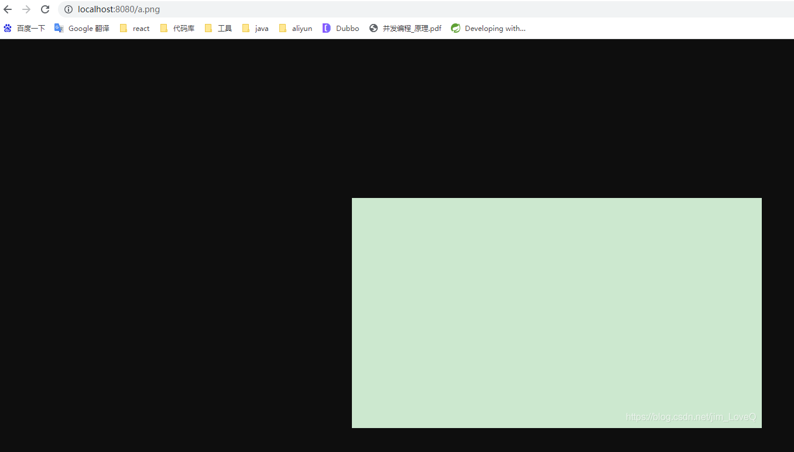  

原理： 静态映射/**。请求进来，先去找Controller看能不能处理。不能处理的所有请求又都交给静态资源处理器。静态资源也找不到则响应404页面。

**2）改变默认的静态资源路径**

也可以改变默认的静态资源路径`/static` `/public` `/resources` `/META-INF/resources`失效

```yaml
spring:
  resources:
    static-locations: "classpath:/ha/"
```

  

  

  

**3）静态资源访问前缀**

```properties
spring.mvc.static-path-pattern=/res/**
```

当前项目 + static-path-pattern + 静态资源名 = 静态资源文件夹下找

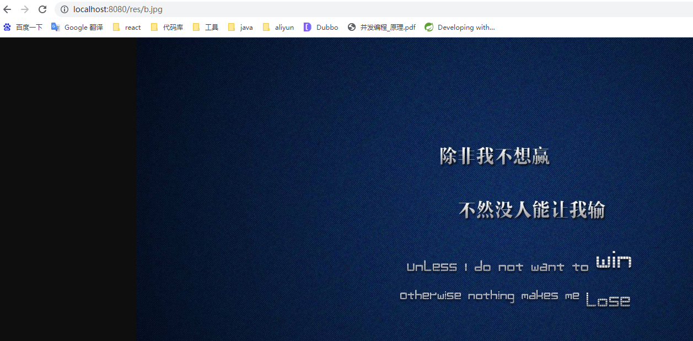  

  

**4）webjar**

可用jar方式添加css，js等资源文件，

[https://www.webjars.org/](https://www.webjars.org/)

例如，添加jquery

```xml
<dependency>
    <groupId>org.webjars</groupId>
    <artifactId>jquery</artifactId>
    <version>3.5.1</version>
</dependency>
```

访问地址：[http://localhost:8080/webjars/**jquery/3.5.1/jquery.js**](http://localhost:8080/webjars/jquery/3.5.1/jquery.js)  后面地址要按照依赖里面的包路径。

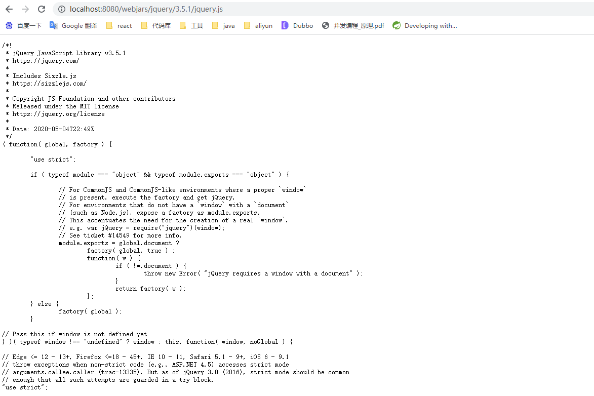    

## 2.2 index页面支持
[官方文档](https://docs.spring.io/spring-boot/docs/2.3.8.RELEASE/reference/htmlsingle/#boot-features-spring-mvc-welcome-page)

+ 静态资源路径下`index.html` 
    - 可以配置静态资源路径
    - 但是不可以配置静态资源的访问前缀。否则导致 index.html不能被默认访问

```yaml
spring:
# 6.  mvc:
# 7.    static-path-pattern: /res/**   这个会导致welcome page功能失效
  resources:
    static-locations: "classpath:/ha/"
```

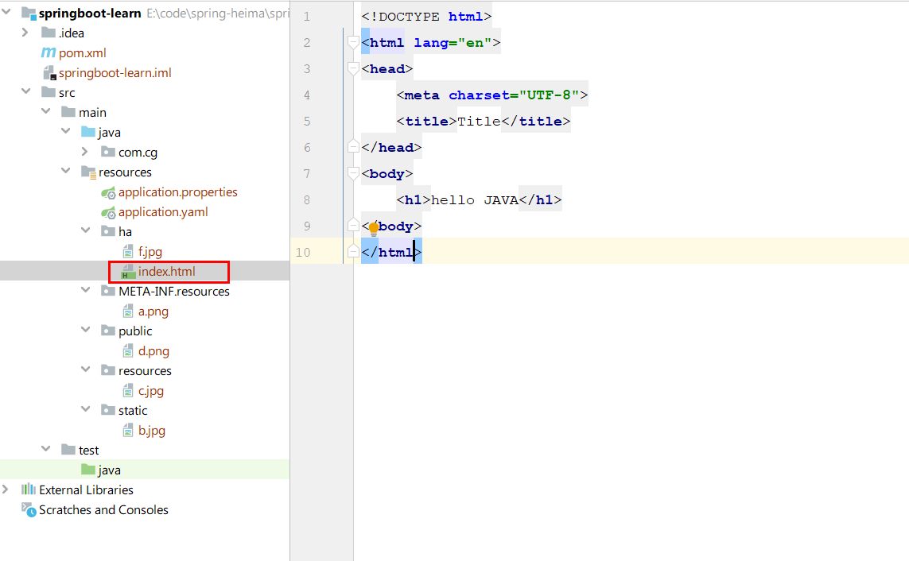


+ controller能处理`/index`。

## 2.3 自定义Favicon
指网页标签上的小图标。

favicon.ico 放在静态资源目录下即可。

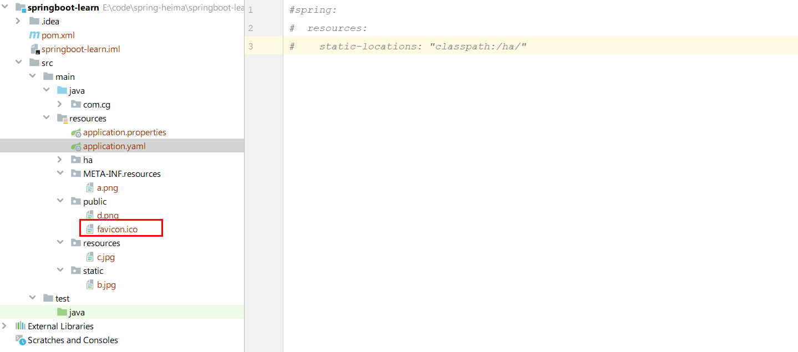

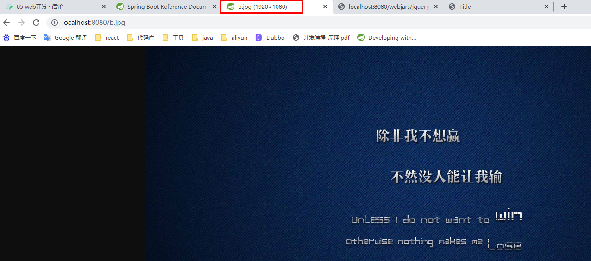

```yaml
spring:
# 8.  mvc:
# 9.    static-path-pattern: /res/**   这个会导致 Favicon 功能失效
# 10.  resources:
# 11.    static-locations: "classpath:/ha/" 这个似乎也会导致 Favicon 功能失效
```

## 2.4 静态资源原理
+ SpringBoot启动默认加载  xxxAutoConfiguration 类（自动配置类）
+ SpringMVC功能的自动配置类`WebMvcAutoConfiguration`，生效

```java
@Configuration(proxyBeanMethods = false)
@ConditionalOnWebApplication(type = Type.SERVLET)
@ConditionalOnClass({ Servlet.class, DispatcherServlet.class, WebMvcConfigurer.class })
@ConditionalOnMissingBean(WebMvcConfigurationSupport.class)
@AutoConfigureOrder(Ordered.HIGHEST_PRECEDENCE + 10)
@AutoConfigureAfter({ DispatcherServletAutoConfiguration.class, TaskExecutionAutoConfiguration.class,
		ValidationAutoConfiguration.class })
public class WebMvcAutoConfiguration {
    ...
}
```

+ 给容器中配置的内容： 
    - 配置文件的相关属性的绑定：`WebMvcProperties==**spring.mvc**`、`ResourceProperties==**spring.resources**`

```java
@Configuration(proxyBeanMethods = false)
@Import(EnableWebMvcConfiguration.class)
@EnableConfigurationProperties({ WebMvcProperties.class, ResourceProperties.class })
@Order(0)
public static class WebMvcAutoConfigurationAdapter implements WebMvcConfigurer {
    ...
}
```

**1）配置类只有一个有参构造器**

```java
//有参构造器所有参数的值都会从容器中确定
//ResourceProperties resourceProperties 获取和spring.resources绑定的所有的值的对象
//WebMvcProperties mvcProperties 获取和spring.mvc绑定的所有的值的对象
//ListableBeanFactory beanFactory Spring的beanFactory
//HttpMessageConverters 找到所有的HttpMessageConverters
//ResourceHandlerRegistrationCustomizer 找到资源处理器的自定义器。
//DispatcherServletPath
//ServletRegistrationBean   给应用注册Servlet、Filter、Listener等
public WebMvcAutoConfigurationAdapter(WebProperties webProperties, WebMvcProperties mvcProperties,
		ListableBeanFactory beanFactory, ObjectProvider<HttpMessageConverters> messageConvertersProvider,
		ObjectProvider<ResourceHandlerRegistrationCustomizer> resourceHandlerRegistrationCustomizerProvider,
		ObjectProvider<DispatcherServletPath> dispatcherServletPath,
		ObjectProvider<ServletRegistrationBean<?>> servletRegistrations) {
	this.mvcProperties = mvcProperties;
	this.beanFactory = beanFactory;
	this.messageConvertersProvider = messageConvertersProvider;
	this.resourceHandlerRegistrationCustomizer = resourceHandlerRegistrationCustomizerProvider.getIfAvailable();
	this.dispatcherServletPath = dispatcherServletPath;
	this.servletRegistrations = servletRegistrations;
	this.mvcProperties.checkConfiguration();
}
```

**2）资源处理的默认规则**

```java
public void addResourceHandlers(ResourceHandlerRegistry registry) {
    if (!this.resourceProperties.isAddMappings()) {
        logger.debug("Default resource handling disabled");
    } else {
        //webjars的规则
        Duration cachePeriod = this.resourceProperties.getCache().getPeriod();
        CacheControl cacheControl = this.resourceProperties.getCache().getCachecontrol().toHttpCacheControl();
        if (!registry.hasMappingForPattern("/webjars/**")) {
            this.customizeResourceHandlerRegistration(registry.addResourceHandler(new String[]{"/webjars/**"}).addResourceLocations(new String[]{"classpath:/META-INF/resources/webjars/"}).setCachePeriod(this.getSeconds(cachePeriod)).setCacheControl(cacheControl));
        }
        //处理静态资源的规则 
        String staticPathPattern = this.mvcProperties.getStaticPathPattern();
        if (!registry.hasMappingForPattern(staticPathPattern)) {
            this.customizeResourceHandlerRegistration(registry.addResourceHandler(new String[]{staticPathPattern}).addResourceLocations(WebMvcAutoConfiguration.getResourceLocations(this.resourceProperties.getStaticLocations())).setCachePeriod(this.getSeconds(cachePeriod)).setCacheControl(cacheControl));
        }

    }
}
```

根据上述代码，我们可以同过配置禁止所有静态资源规则。

```yaml
spring:
  resources:
    add-mappings: false   #禁用所有静态资源规则
```

静态资源规则：

```java
@ConfigurationProperties(prefix = "spring.resources", ignoreUnknownFields = false)
public class ResourceProperties {

    private static final String[] CLASSPATH_RESOURCE_LOCATIONS = { "classpath:/META-INF/resources/",
            "classpath:/resources/", "classpath:/static/", "classpath:/public/" };

    /**
     * Locations of static resources. Defaults to classpath:[/META-INF/resources/,
     * /resources/, /static/, /public/].
     */
    private String[] staticLocations = CLASSPATH_RESOURCE_LOCATIONS;
    ...
}
```

**3）欢迎页的处理规则**

```java
...
public class WebMvcAutoConfiguration {
    ...
	public static class EnableWebMvcConfiguration extends DelegatingWebMvcConfiguration implements ResourceLoaderAware {
        ...
		@Bean
		public WelcomePageHandlerMapping welcomePageHandlerMapping(ApplicationContext applicationContext,
				FormattingConversionService mvcConversionService, ResourceUrlProvider mvcResourceUrlProvider) {
			WelcomePageHandlerMapping welcomePageHandlerMapping = new WelcomePageHandlerMapping(
					new TemplateAvailabilityProviders(applicationContext), applicationContext, getWelcomePage(),
					this.mvcProperties.getStaticPathPattern());
			welcomePageHandlerMapping.setInterceptors(getInterceptors(mvcConversionService, mvcResourceUrlProvider));
			welcomePageHandlerMapping.setCorsConfigurations(getCorsConfigurations());
			return welcomePageHandlerMapping;
		}
```

`WelcomePageHandlerMapping`的构造方法如下：

```java
WelcomePageHandlerMapping(TemplateAvailabilityProviders templateAvailabilityProviders,
                          ApplicationContext applicationContext, Resource welcomePage, String staticPathPattern) {
    if (welcomePage != null && "/**".equals(staticPathPattern)) {
        //要用欢迎页功能，必须是/**
        logger.info("Adding welcome page: " + welcomePage);
        setRootViewName("forward:index.html");
    }
    else if (welcomeTemplateExists(templateAvailabilityProviders, applicationContext)) {
        //调用Controller /index
        logger.info("Adding welcome page template: index");
        setRootViewName("index");
    }
}
```

这构造方法内的代码也解释了web场景-welcome与favicon功能中配置`static-path-pattern`了，welcome页面和小图标失效的问题。

# 3 请求参数处理
## 3.1 请求映射解析
### 3.1.1 rest使用与原理
+  @xxxMapping; 
    - @GetMapping  
    - @PostMapping  
    - @PutMapping  
    - @DeleteMapping  
+  Rest风格支持（使用**HTTP**请求方式动词来表示对资源的操作） 
    - 以前： 
        * /getUser 获取用户
        * /deleteUser 删除用户
        * /editUser 修改用户
        * /saveUser保存用户
    - 现在： /user 
        * GET-获取用户
        * DELETE-删除用户
        * PUT-修改用户
        * POST-保存用户
    - 核心Filter；HiddenHttpMethodFilter
+  **用法** 
    - 开启页面表单的Rest功能
    - 页面 form的属性method=post，隐藏域 _method=put、delete等（如果直接get或post，无需隐藏域）
    - 编写请求映射

```yaml
spring:
  mvc:
    hiddenmethod:
      filter:
        enabled: true   #开启页面表单的Rest功能
```

```html
<form action="/user" method="get">
    <input value="REST-GET提交" type="submit" />
</form>

<form action="/user" method="post">
    <input value="REST-POST提交" type="submit" />
</form>

<form action="/user" method="post">
    <input name="_method" type="hidden" value="DELETE"/>
    <input value="REST-DELETE 提交" type="submit"/>
</form>

<form action="/user" method="post">
    <input name="_method" type="hidden" value="PUT" />
    <input value="REST-PUT提交"type="submit" />
<form>
```

```java
@GetMapping("/user")
//@RequestMapping(value = "/user",method = RequestMethod.GET)
public String getUser(){
    return "GET-张三";
}

@PostMapping("/user")
//@RequestMapping(value = "/user",method = RequestMethod.POST)
public String saveUser(){
    return "POST-张三";
}

@PutMapping("/user")
//@RequestMapping(value = "/user",method = RequestMethod.PUT)
public String putUser(){
    return "PUT-张三";
}

@DeleteMapping("/user")
//@RequestMapping(value = "/user",method = RequestMethod.DELETE)
public String deleteUser(){
    return "DELETE-张三";
}
```

Rest原理（表单提交要使用REST的时候） 
- 表单提交会带上`_method=PUT`
- 请求过来被`HiddenHttpMethodFilter`拦截 
    * 请求是否正常，并且是POST 
        + 获取到`\_method`的值。
        + 兼容以下请求；`PUT` `DELETE` `PATCH`
        + 原生request（post），包装模式requesWrapper重写了getMethod方法，返回的是传入的值。
        + 过滤器链放行的时候用wrapper。以后的方法调用getMethod是调用requesWrapper的。

```java
public class HiddenHttpMethodFilter extends OncePerRequestFilter {

	private static final List<String> ALLOWED_METHODS =
			Collections.unmodifiableList(Arrays.asList(HttpMethod.PUT.name(),
					HttpMethod.DELETE.name(), HttpMethod.PATCH.name()));

	/** Default method parameter: {@code _method}. */
	public static final String DEFAULT_METHOD_PARAM = "_method";

	private String methodParam = DEFAULT_METHOD_PARAM;


	/**
	 * Set the parameter name to look for HTTP methods.
	 * @see #DEFAULT_METHOD_PARAM
	 */
	public void setMethodParam(String methodParam) {
		Assert.hasText(methodParam, "'methodParam' must not be empty");
		this.methodParam = methodParam;
	}

	@Override
	protected void doFilterInternal(HttpServletRequest request, HttpServletResponse response, FilterChain filterChain)
			throws ServletException, IOException {

		HttpServletRequest requestToUse = request;
        //查看原始的请求是不是POST，如果是表单请求，则只有POST和GET两种方式，如果需要PUT和DELETE则需要表单的方式为POST
		if ("POST".equals(request.getMethod()) && request.getAttribute(WebUtils.ERROR_EXCEPTION_ATTRIBUTE) == null) {
			String paramValue = request.getParameter(this.methodParam);//看看有没有_method属性
			if (StringUtils.hasLength(paramValue)) {//如果有_method属性
				String method = paramValue.toUpperCase(Locale.ENGLISH);
				if (ALLOWED_METHODS.contains(method)) {
					requestToUse = new HttpMethodRequestWrapper(request, method);//此处使用装饰器模式包装原来的request
				}
			}
		}

		filterChain.doFilter(requestToUse, response);
	}

	/**
	 * Simple {@link HttpServletRequest} wrapper that returns the supplied method for
	 * {@link HttpServletRequest#getMethod()}.
	 */
	private static class HttpMethodRequestWrapper extends HttpServletRequestWrapper {

		private final String method;

		public HttpMethodRequestWrapper(HttpServletRequest request, String method) {
			super(request);
			this.method = method;
		}

		@Override
		public String getMethod() {
			return this.method;
		}
	}

}
```

Rest使用客户端工具：如PostMan可直接发送put、delete等方式请求。


**怎么改变默认的_method**

```java
@Configuration(proxyBeanMethods = false)
@ConditionalOnWebApplication(type = Type.SERVLET)
@ConditionalOnClass({ Servlet.class, DispatcherServlet.class, WebMvcConfigurer.class })
@ConditionalOnMissingBean(WebMvcConfigurationSupport.class)
@AutoConfigureOrder(Ordered.HIGHEST_PRECEDENCE + 10)
@AutoConfigureAfter({ DispatcherServletAutoConfiguration.class, TaskExecutionAutoConfiguration.class,
		ValidationAutoConfiguration.class })
public class WebMvcAutoConfiguration {

    ...
    
    @Bean
    @ConditionalOnMissingBean(HiddenHttpMethodFilter.class)
    @ConditionalOnProperty(prefix = "spring.mvc.hiddenmethod.filter", name = "enabled", matchIfMissing = false)
    public OrderedHiddenHttpMethodFilter hiddenHttpMethodFilter() {
        return new OrderedHiddenHttpMethodFilter();
    }
    
    ...
}
```

`@ConditionalOnMissingBean(HiddenHttpMethodFilter.class)`意味着在没有`HiddenHttpMethodFilter`时，才执行`hiddenHttpMethodFilter()`。因此，我们可以自定义filter，改变默认的`_method`。例如：

```java
@Configuration(proxyBeanMethods = false)
public class WebConfig{
    //自定义filter
    @Bean
    public HiddenHttpMethodFilter hiddenHttpMethodFilter(){
        HiddenHttpMethodFilter methodFilter = new HiddenHttpMethodFilter();
        methodFilter.setMethodParam("_m");
        return methodFilter;
    }    
}
```

将 `_method` 改成 `_m` 。

```html
<form action="/user" method="post">
    <input name="_m" type="hidden" value="DELETE"/>
    <input value="REST-DELETE 提交" type="submit"/>
</form>
```

### 3.1.2 请求映射原理
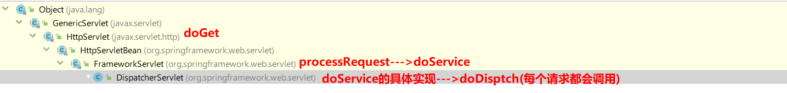

第一步：


第二步：

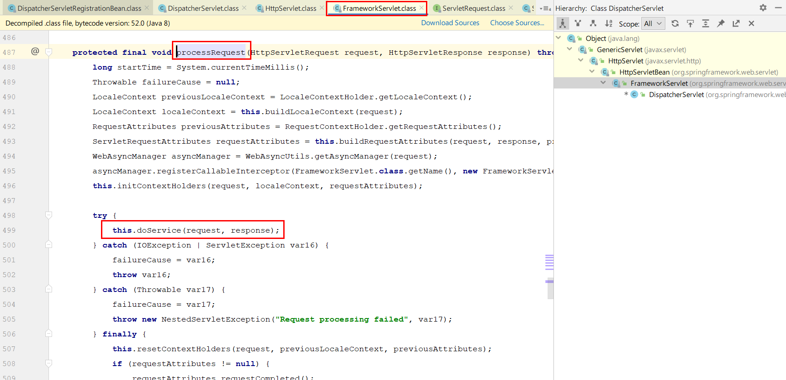

第三步：


第四步：


第五步：


```java
protected void doDispatch(HttpServletRequest request, HttpServletResponse response) throws Exception {
    HttpServletRequest processedRequest = request;
    HandlerExecutionChain mappedHandler = null;
    boolean multipartRequestParsed = false;

    WebAsyncManager asyncManager = WebAsyncUtils.getAsyncManager(request);

    try {
        ModelAndView mv = null;
        Exception dispatchException = null;

        try {
            processedRequest = checkMultipart(request);
            multipartRequestParsed = (processedRequest != request);

            // 找到当前请求使用哪个Handler（Controller的方法）处理
            mappedHandler = getHandler(processedRequest);

            //HandlerMapping：处理器映射。/xxx->>xxxx
    ...
}
```

`getHandler()`方法如下：

```java
@Nullable
protected HandlerExecutionChain getHandler(HttpServletRequest request) throws Exception {
    if (this.handlerMappings != null) {
        for (HandlerMapping mapping : this.handlerMappings) {
            HandlerExecutionChain handler = mapping.getHandler(request);
            if (handler != null) {
                return handler;
            }
        }
    }
    return null;
}
```

`this.handlerMappings`在Debug模式下展现的内容：


**RequestMappingHandlerMapping**：保存了所有@RequestMapping 和handler的映射规则。  


WelcomePageHandlerMapping中保留的`/`,访问 /能访问到index.html


所有的请求映射都在HandlerMapping中：

+  SpringBoot自动配置欢迎页的 WelcomePageHandlerMapping 。访问 /能访问到index.html； 
+  SpringBoot自动配置了默认 的 RequestMappingHandlerMapping 
+  请求进来，挨个尝试所有的HandlerMapping看是否有请求信息。 
    - 如果有就找到这个请求对应的handler
    - 如果没有就是下一个HandlerMapping
+  我们需要一些自定义的映射处理，我们也可以自己给容器中放**HandlerMapping**。自定义**HandlerMapping** 

IDEA快捷键：

+ Ctrl + Alt + U : 以UML的类图展现类有哪些继承类，派生类以及实现哪些接口。
+ Crtl + Alt + Shift + U : 同上，区别在于上条快捷键结果在新页展现，而本条快捷键结果在弹窗展现。
+ Ctrl + H : 以树形方式展现类层次结构图。

## 3.2 普通参数和基本注解
+ `@PathVariable` 路径变量
+ `@RequestHeader` 获取请求头
+ `@RequestParam` 获取请求参数（指问号后的参数，`url?a=1&b=2`）
+ `@CookieValue` 获取Cookie值
+ `@RequestAttribute` 获取request域属性
+ `@RequestBody` 获取请求体[POST]
+ `@MatrixVariable` 矩阵变量
+ `@ModelAttribute`


**1）使用用例：**

```java
@RestController
public class ParameterTestController {


    //  car/2/owner/zhangsan
    @GetMapping("/car/{id}/owner/{username}")
    public Map<String,Object> getCar(@PathVariable("id") Integer id,
                                     @PathVariable("username") String name,
                                     @PathVariable Map<String,String> pv,
                                     @RequestHeader("User-Agent") String userAgent,
                                     @RequestHeader Map<String,String> header,
                                     @RequestParam("age") Integer age,
                                     @RequestParam("inters") List<String> inters,
                                     @RequestParam Map<String,String> params,
                                     @CookieValue("_ga") String _ga,
                                     @CookieValue("_ga") Cookie cookie){

        Map<String,Object> map = new HashMap<>();

//        map.put("id",id);
//        map.put("name",name);
//        map.put("pv",pv);
//        map.put("userAgent",userAgent);
//        map.put("headers",header);
        map.put("age",age);
        map.put("inters",inters);
        map.put("params",params);
        map.put("_ga",_ga);
        System.out.println(cookie.getName()+"===>"+cookie.getValue());
        return map;
    }


    @PostMapping("/save")
    public Map postMethod(@RequestBody String content){
        Map<String,Object> map = new HashMap<>();
        map.put("content",content);
        return map;
    }
}
```

**2）**`@RequestAttribute` **用例：**  

```java
@Controller
public class RequestController {

    @GetMapping("/goto")
    public String goToPage(HttpServletRequest request){

        request.setAttribute("msg","成功了...");
        request.setAttribute("code",200);
        return "forward:/success";  //转发到  /success请求
    }

    @GetMapping("/params")
    public String testParam(Map<String,Object> map,
                            Model model,
                            HttpServletRequest request,
                            HttpServletResponse response){
        map.put("hello","world666");
        model.addAttribute("world","hello666");
        request.setAttribute("message","HelloWorld");

        Cookie cookie = new Cookie("c1","v1");
        response.addCookie(cookie);
        return "forward:/success";
    }

    ///<-----------------主角@RequestAttribute在这个方法
    @ResponseBody
    @GetMapping("/success")
    public Map success(@RequestAttribute(value = "msg",required = false) String msg,
                       @RequestAttribute(value = "code",required = false) Integer code,
                       HttpServletRequest request){
        Object msg1 = request.getAttribute("msg");

        Map<String,Object> map = new HashMap<>();
        Object hello = request.getAttribute("hello");
        Object world = request.getAttribute("world");
        Object message = request.getAttribute("message");

        map.put("reqMethod_msg",msg1);
        map.put("annotation_msg",msg);
        map.put("hello",hello);
        map.put("world",world);
        map.put("message",message);

        return map;
    }
}
```

**3）**`@MatrixVariable`与`UrlPathHelper`

1.  语法： 请求路径：`/cars/sell;low=34;brand=byd,audi,yd` 
2.  SpringBoot默认是禁用了矩阵变量的功能 
    - 手动开启：原理。对于路径的处理。UrlPathHelper的removeSemicolonContent设置为false，让其支持矩阵变量的。
3.  矩阵变量**必须**有url路径变量才能被解析 


**手动开启矩阵变量**：

+ 方式一：实现`WebMvcConfigurer`接口：

  ```java
  @Configuration(proxyBeanMethods = false)
  public class WebConfig implements WebMvcConfigurer {
      @Override
      public void configurePathMatch(PathMatchConfigurer configurer) {

          UrlPathHelper urlPathHelper = new UrlPathHelper();
          // 不移除；后面的内容。矩阵变量功能就可以生效
          urlPathHelper.setRemoveSemicolonContent(false);
          configurer.setUrlPathHelper(urlPathHelper);
      }
  }
  ```


+ 方式二：创建返回`WebMvcConfigurer`Bean：

  ```java
  @Configuration(proxyBeanMethods = false)
  public class WebConfig{
      @Bean
      public WebMvcConfigurer webMvcConfigurer(){
          return new WebMvcConfigurer() {
                          @Override
              public void configurePathMatch(PathMatchConfigurer configurer) {
                  UrlPathHelper urlPathHelper = new UrlPathHelper();
                  // 不移除；后面的内容。矩阵变量功能就可以生效
                  urlPathHelper.setRemoveSemicolonContent(false);
                  configurer.setUrlPathHelper(urlPathHelper);
              }
          }
      }
  }
  ```

@MatrixVariable 的用例

```java
@RestController
public class ParameterTestController {

    ///cars/sell;low=34;brand=byd,audi,yd
    @GetMapping("/cars/{path}")
    public Map carsSell(@MatrixVariable("low") Integer low,
                        @MatrixVariable("brand") List<String> brand,
                        @PathVariable("path") String path){
        Map<String,Object> map = new HashMap<>();

        map.put("low",low);
        map.put("brand",brand);
        map.put("path",path);
        return map;
    }

    // /boss/1;age=20/2;age=10

    @GetMapping("/boss/{bossId}/{empId}")
    public Map boss(@MatrixVariable(value = "age",pathVar = "bossId") Integer bossAge,
                    @MatrixVariable(value = "age",pathVar = "empId") Integer empAge){
        Map<String,Object> map = new HashMap<>();

        map.put("bossAge",bossAge);
        map.put("empAge",empAge);
        return map;

    }

}
```

## 3.3 请求参数处理原理
这要从`DispatcherServlet`开始说起：

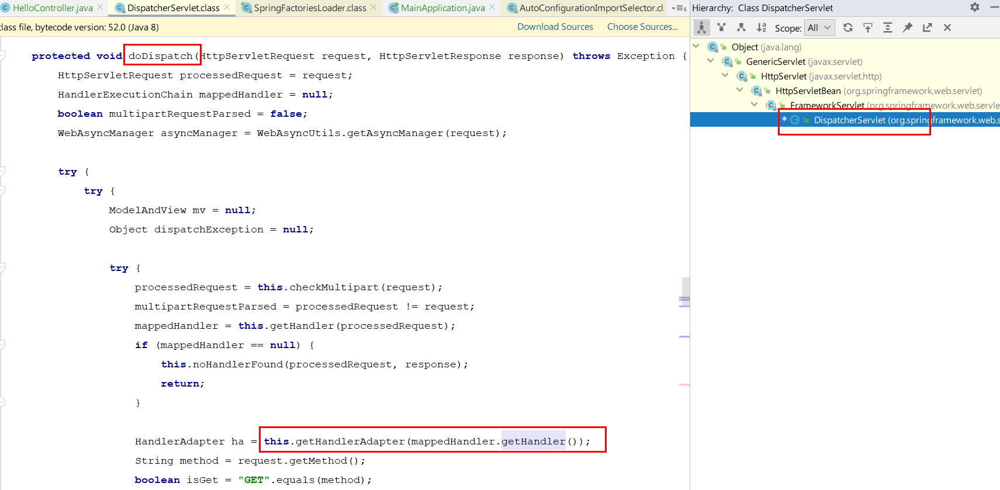

```java
public class DispatcherServlet extends FrameworkServlet {
    
    protected void doDispatch(HttpServletRequest request, HttpServletResponse response) throws Exception {
        HttpServletRequest processedRequest = request;
        HandlerExecutionChain mappedHandler = null;
        boolean multipartRequestParsed = false;

        WebAsyncManager asyncManager = WebAsyncUtils.getAsyncManager(request);

        try {
            ModelAndView mv = null;
            Exception dispatchException = null;

            try {
                processedRequest = checkMultipart(request);
                multipartRequestParsed = (processedRequest != request);

                // Determine handler for the current request.
                mappedHandler = getHandler(processedRequest);
                if (mappedHandler == null) {
                    noHandlerFound(processedRequest, response);
                    return;
                }

                // Determine handler adapter for the current request.
                HandlerAdapter ha = getHandlerAdapter(mappedHandler.getHandler());
                ...
```

+ `HandlerMapping`中找到能处理请求的`Handler`（`Controller.method()`其实handler可以理解为controller里面的具体某个请求方法）。
+ 为当前Handler 找一个适配器 `HandlerAdapter`，用的最多的是**RequestMappingHandlerAdapter**。
+ 适配器执行目标方法并确定方法参数的每一个值。

### 3.4.1 **HandlerAdapter**
**第一步：找到合适的HandlerAdapter**

默认会加载所有`HandlerAdapter`

```java
public class DispatcherServlet extends FrameworkServlet {

    /** Detect all HandlerAdapters or just expect "handlerAdapter" bean?. */
    private boolean detectAllHandlerAdapters = true;

    ...
    
    private void initHandlerAdapters(ApplicationContext context) {
        this.handlerAdapters = null;

        if (this.detectAllHandlerAdapters) {
            // Find all HandlerAdapters in the ApplicationContext, including ancestor contexts.
            Map<String, HandlerAdapter> matchingBeans =
                BeanFactoryUtils.beansOfTypeIncludingAncestors(context, HandlerAdapter.class, true, false);
            if (!matchingBeans.isEmpty()) {
                this.handlerAdapters = new ArrayList<>(matchingBeans.values());
                // We keep HandlerAdapters in sorted order.
                AnnotationAwareOrderComparator.sort(this.handlerAdapters);
            }
        }
     ...
```

有这些`HandlerAdapter`：

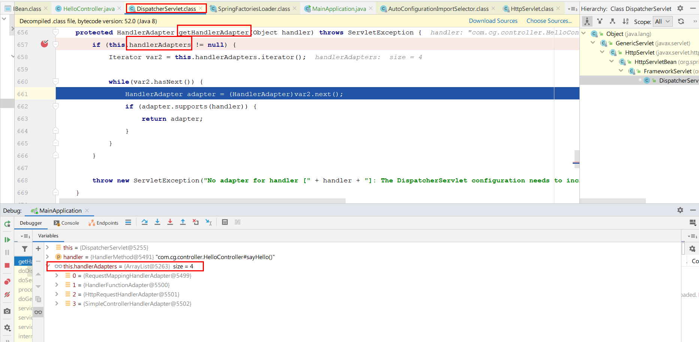

1.  支持方法上标注`@RequestMapping` 
2.  支持函数式编程的 

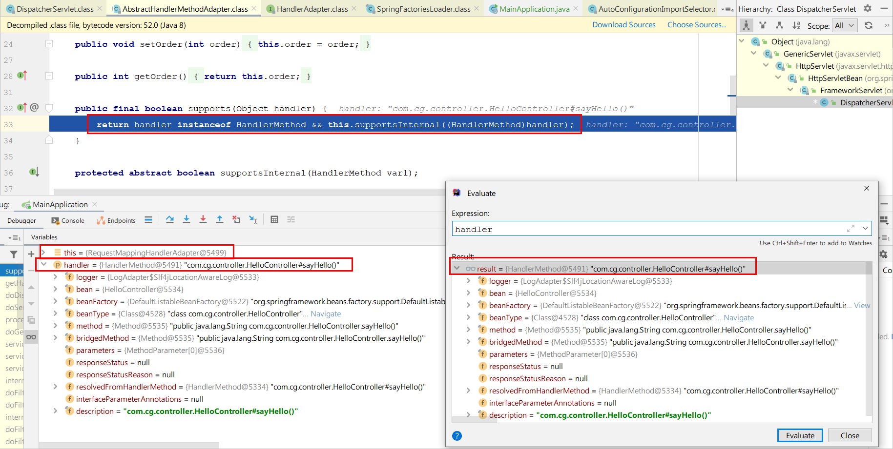

因为就是当前的handler就是属于HandlerMethod，所以就会交给RequestMappingHandlerAdapter来处理。

### 3.4.2 **执行目标方法**
**第二步：执行目标方法**


```java
public class DispatcherServlet extends FrameworkServlet {
    
	protected void doDispatch(HttpServletRequest request, HttpServletResponse response) throws Exception {
        ModelAndView mv = null;
        
        ...

        // Determine handler for the current request.
        mappedHandler = getHandler(processedRequest);
        if (mappedHandler == null) {
            noHandlerFound(processedRequest, response);
            return;
        }

        // Determine handler adapter for the current request.
        HandlerAdapter ha = getHandlerAdapter(mappedHandler.getHandler());

        ...
		//本节重点
        // Actually invoke the handler.
        mv = ha.handle(processedRequest, response, mappedHandler.getHandler());
```

接下来进入handle方法里面

`HandlerAdapter`接口实现类`RequestMappingHandlerAdapter`（主要用来处理`@RequestMapping`）

```java
public class RequestMappingHandlerAdapter extends AbstractHandlerMethodAdapter
		implements BeanFactoryAware, InitializingBean {

    ...
    
    //AbstractHandlerMethodAdapter类的方法，RequestMappingHandlerAdapter继承AbstractHandlerMethodAdapter
	public final ModelAndView handle(HttpServletRequest request, HttpServletResponse response, Object handler)
        throws Exception {

        return handleInternal(request, response, (HandlerMethod) handler);
    }

	@Override
	protected ModelAndView handleInternal(HttpServletRequest request,
			HttpServletResponse response, HandlerMethod handlerMethod) throws Exception {
    	ModelAndView mav;
        //handleInternal的核心
        mav = invokeHandlerMethod(request, response, handlerMethod);//解释看下节
		//...
		return mav;
    }
}
```

先执行父类AbstractHandlerMethodAdapter的handle方法


接下来执行


执行invokeHandlerMethod方法


这这里面会有26个参数解析器

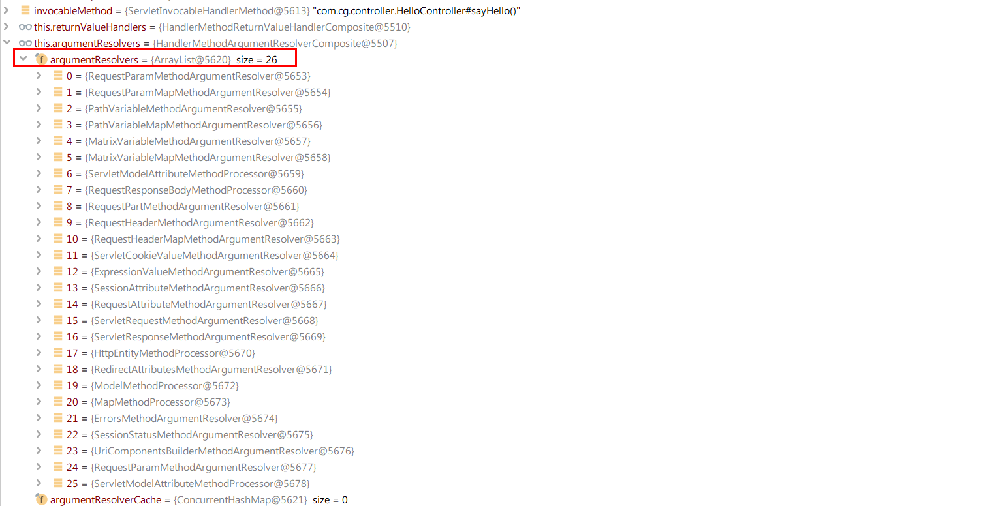

接下来开始分析这些参数解析器

### 3.4.3 **参数解析器**
**第三步：参数解析器**

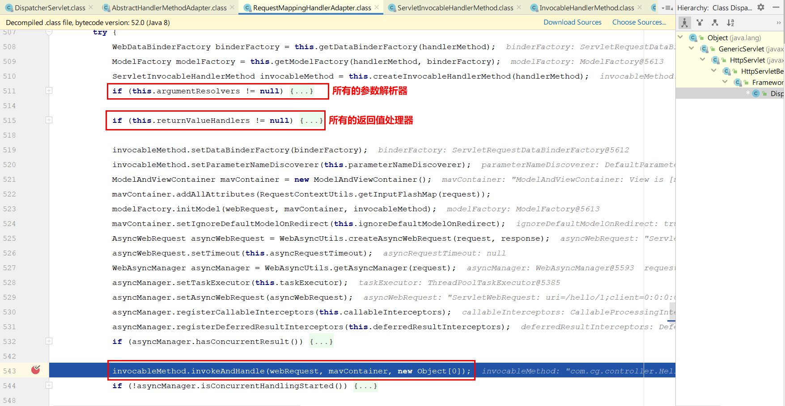

### 3.4.4 **返回值处理器**
**第四步：返回值处理器**

15个返回值处理器


### 3.5.5 **如何确定目标方法的每一个参数值**
**第五步：如何确定目标方法的每一个参数值**


进入到这个方法里面

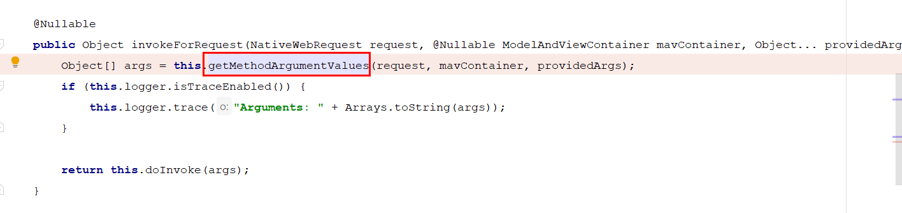

确定将要执行的目标方法的每一个参数的值是什么;

接下来重点分析`getMethodArgumentValues`这个方法


```java
 protected Object[] getMethodArgumentValues(NativeWebRequest request, @Nullable ModelAndViewContainer mavContainer, Object... providedArgs) throws Exception {
        MethodParameter[] parameters = this.getMethodParameters();
        if (ObjectUtils.isEmpty(parameters)) {
            return EMPTY_ARGS;
        } else {
            Object[] args = new Object[parameters.length];

            for(int i = 0; i < parameters.length; ++i) {
                MethodParameter parameter = parameters[i];
                parameter.initParameterNameDiscovery(this.parameterNameDiscoverer);
                args[i] = findProvidedArgument(parameter, providedArgs);
                if (args[i] == null) {
                    if (!this.resolvers.supportsParameter(parameter)) {
                        throw new IllegalStateException(formatArgumentError(parameter, "No suitable resolver"));
                    }

                    try {
                        args[i] = this.resolvers.resolveArgument(parameter, mavContainer, request, this.dataBinderFactory);
                    } catch (Exception var10) {
                        if (this.logger.isDebugEnabled()) {
                            String exMsg = var10.getMessage();
                            if (exMsg != null && !exMsg.contains(parameter.getExecutable().toGenericString())) {
                                this.logger.debug(formatArgumentError(parameter, exMsg));
                            }
                        }

                        throw var10;
                    }
                }
            }

            return args;
        }
    }
```

`MethodParameter[] parameters = this.getMethodParameters();`分析这行代码，对应的controll方法为

```java
@RequestMapping("/hello/{id}")
public String sayHello(@PathVariable("id") Integer id,@RequestParam("name") String name){
    log.info("ssss");
    return "hello, spring boot";
}
```


接下来


进入之后，我们发现，是一个循环遍历，也就是说spring框架在循环遍历26个参数解析器，看哪一个是符合的，然后调用哪一个去解析

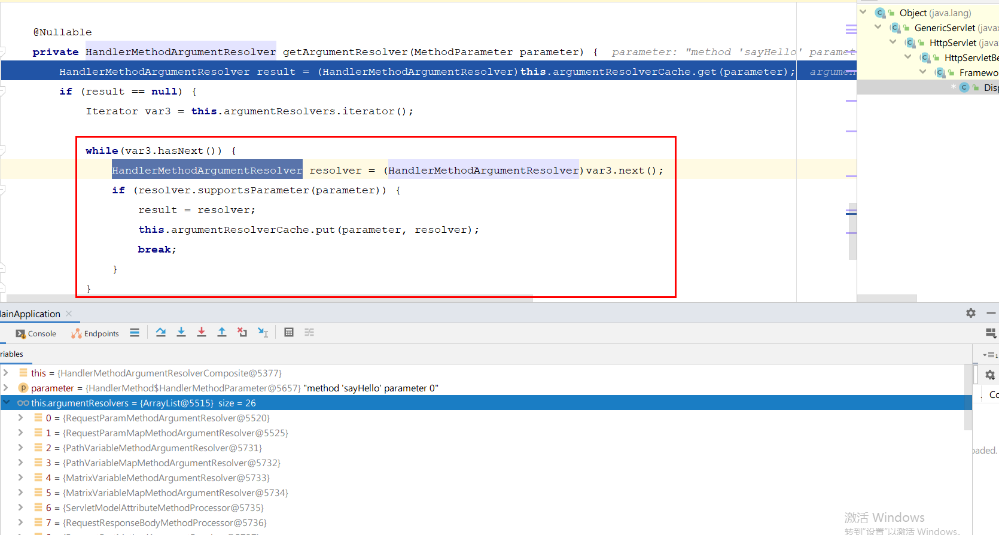

不信我们继续往下走


拿到的第一个参数解析器是`RequestParamMethodArgumentResolver`，这个应该是不匹配的，因为我们controller方法里面对应的第一个参数加的`@PathVariable`注解，所以应该会跳过。


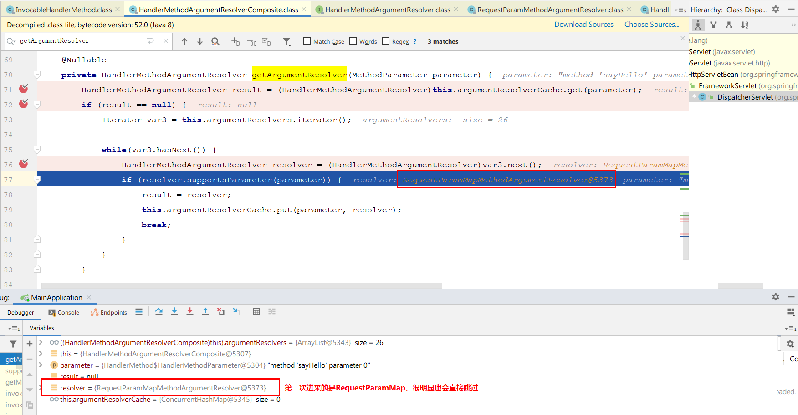


至此，我们终于找到了第一个参数与之匹配的参数解析器


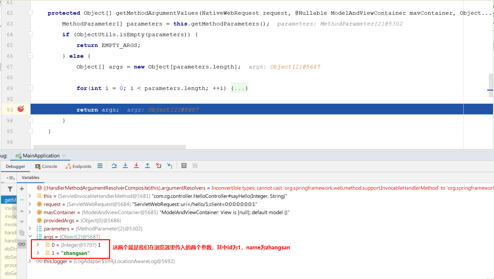

我们再来看看每一个参数解析器的构造是啥样的

```java
public interface HandlerMethodArgumentResolver {
    boolean supportsParameter(MethodParameter var1);//是否支持某种参数的解析，如果支持，则调用resolveArgument方法去解析

    @Nullable
    Object resolveArgument(MethodParameter var1, @Nullable ModelAndViewContainer var2, NativeWebRequest var3, @Nullable WebDataBinderFactory var4) throws Exception;
}
```

SpringMVC目标方法能写多少种参数类型。取决于**参数解析器argumentResolvers**。

在解析参数里面，有的还会涉及到数据绑定，接下来可以讲讲数据绑定


就拿`ModelAttributeMethodProcessor`这个参数解析器来举例，里面就会涉及到数据绑定

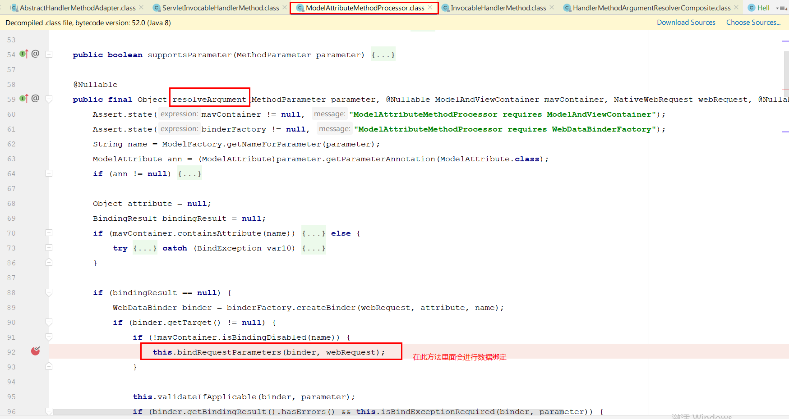

```java
public boolean supportsParameter(MethodParameter parameter) {
    return parameter.hasParameterAnnotation(ModelAttribute.class) || this.annotationNotRequired && !BeanUtils.isSimpleProperty(parameter.getParameterType());
}


@Nullable
public final Object resolveArgument(MethodParameter parameter, @Nullable ModelAndViewContainer mavContainer, NativeWebRequest webRequest, @Nullable WebDataBinderFactory binderFactory) throws Exception {
    Assert.state(mavContainer != null, "ModelAttributeMethodProcessor requires ModelAndViewContainer");
    Assert.state(binderFactory != null, "ModelAttributeMethodProcessor requires WebDataBinderFactory");
    String name = ModelFactory.getNameForParameter(parameter);
    ModelAttribute ann = (ModelAttribute)parameter.getParameterAnnotation(ModelAttribute.class);
    if (ann != null) {
        mavContainer.setBinding(name, ann.binding());
    }

    Object attribute = null;
    BindingResult bindingResult = null;
    if (mavContainer.containsAttribute(name)) {
        attribute = mavContainer.getModel().get(name);
    } else {
        try {
            attribute = this.createAttribute(name, parameter, binderFactory, webRequest);
        } catch (BindException var10) {
            if (this.isBindExceptionRequired(parameter)) {
                throw var10;
            }

            if (parameter.getParameterType() == Optional.class) {
                attribute = Optional.empty();
            }

            bindingResult = var10.getBindingResult();
        }
    }

    if (bindingResult == null) {
        WebDataBinder binder = binderFactory.createBinder(webRequest, attribute, name);
        if (binder.getTarget() != null) {
            if (!mavContainer.isBindingDisabled(name)) {
                this.bindRequestParameters(binder, webRequest);//这个方法里面会涉及到参数绑定
            }

            this.validateIfApplicable(binder, parameter);
            if (binder.getBindingResult().hasErrors() && this.isBindExceptionRequired(binder, parameter)) {
                throw new BindException(binder.getBindingResult());
            }
        }

        if (!parameter.getParameterType().isInstance(attribute)) {
            attribute = binder.convertIfNecessary(binder.getTarget(), parameter.getParameterType(), parameter);
        }

        bindingResult = binder.getBindingResult();
    }

    Map<String, Object> bindingResultModel = bindingResult.getModel();
    mavContainer.removeAttributes(bindingResultModel);
    mavContainer.addAllAttributes(bindingResultModel);
    return attribute;
}

```

通过debug我们发现，确实是有124个converters


这里面会有各种各样的类型转换

进入到`this.bindRequestParameters(binder, webRequest)`方法里面去看看

```java
 protected void bindRequestParameters(WebDataBinder binder, NativeWebRequest request) {
        ((WebRequestDataBinder)binder).bind(request);
}
```

继续进入`((WebRequestDataBinder)binder).bind(request)`里面

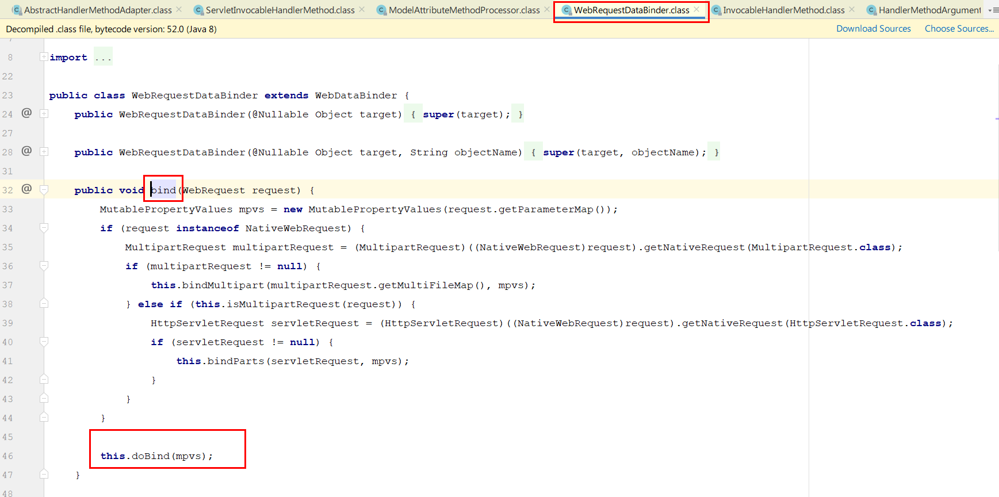

继续进入到`doBind`里面去

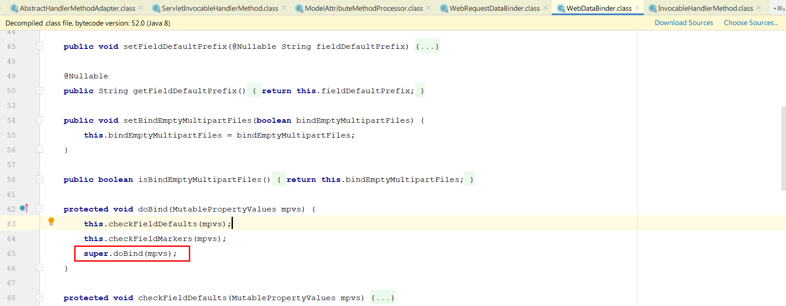

继续往里面进


进入到`this.applyPropertyValues(mpvs);`


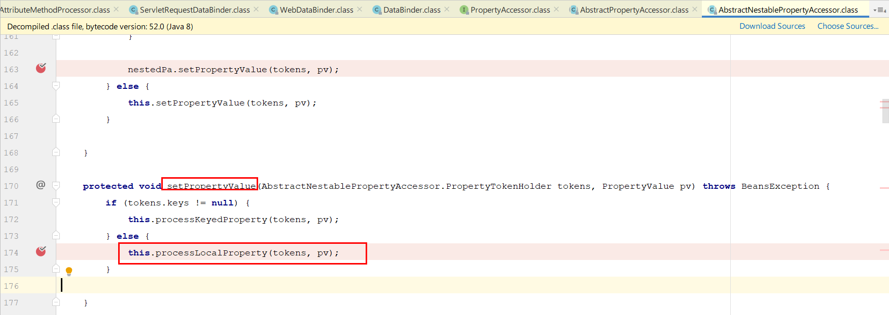


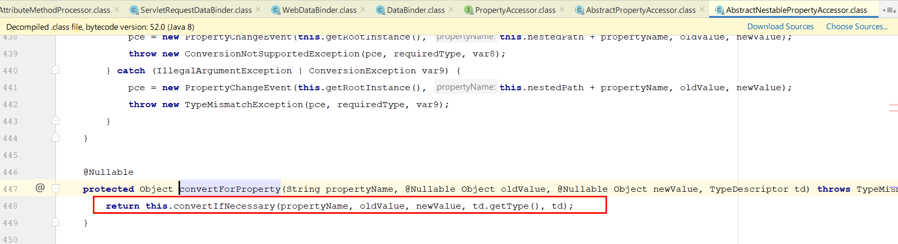


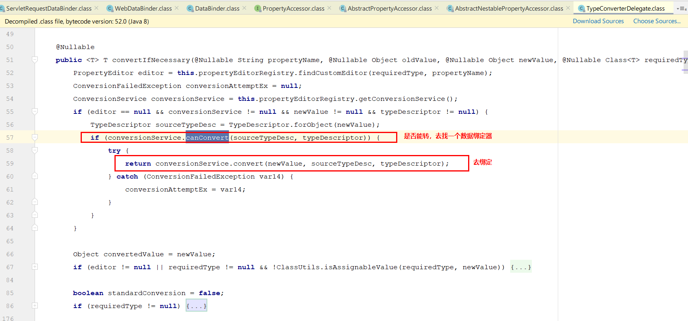

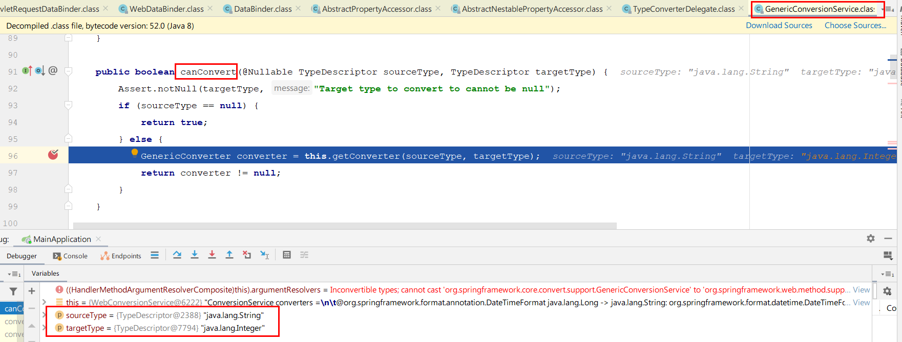

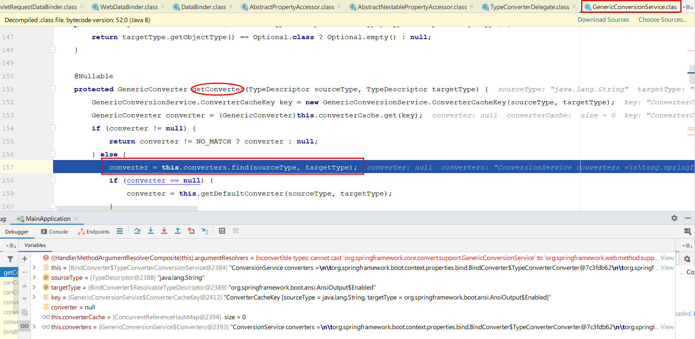


至此则会找到第一个数据绑定器，此处和参数解析器类似，也是遍历去寻找合适的数据绑定器。

至此，参数解析器和寻找，以及参数的解析会全部完成，其中在参数解析的过程中，还会有一个数据绑定的过程

### 3.5.6 目标方法的执行


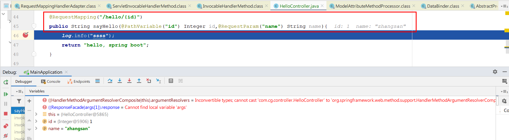

至此方法的参数的解析和执行都已完成。接下来都可以看方法返回值的处理和派发结果了

## 3.4 Servlet API参数解析原理
+ WebRequest
+ ServletRequest
+ MultipartRequest
+ HttpSession
+ javax.servlet.http.PushBuilder
+ Principal
+ InputStream
+ Reader
+ HttpMethod
+ Locale
+ TimeZone
+ ZoneId

**ServletRequestMethodArgumentResolver**用来处理以上的参数

```java
public class ServletRequestMethodArgumentResolver implements HandlerMethodArgumentResolver {

	@Nullable
	private static Class<?> pushBuilder;

	static {
		try {
			pushBuilder = ClassUtils.forName("javax.servlet.http.PushBuilder",
					ServletRequestMethodArgumentResolver.class.getClassLoader());
		}
		catch (ClassNotFoundException ex) {
			// Servlet 4.0 PushBuilder not found - not supported for injection
			pushBuilder = null;
		}
	}


	@Override
	public boolean supportsParameter(MethodParameter parameter) {
		Class<?> paramType = parameter.getParameterType();
		return (WebRequest.class.isAssignableFrom(paramType) ||
				ServletRequest.class.isAssignableFrom(paramType) ||
				MultipartRequest.class.isAssignableFrom(paramType) ||
				HttpSession.class.isAssignableFrom(paramType) ||
				(pushBuilder != null && pushBuilder.isAssignableFrom(paramType)) ||
				(Principal.class.isAssignableFrom(paramType) && !parameter.hasParameterAnnotations()) ||
				InputStream.class.isAssignableFrom(paramType) ||
				Reader.class.isAssignableFrom(paramType) ||
				HttpMethod.class == paramType ||
				Locale.class == paramType ||
				TimeZone.class == paramType ||
				ZoneId.class == paramType);
	}

	@Override
	public Object resolveArgument(MethodParameter parameter, @Nullable ModelAndViewContainer mavContainer,
			NativeWebRequest webRequest, @Nullable WebDataBinderFactory binderFactory) throws Exception {

		Class<?> paramType = parameter.getParameterType();

		// WebRequest / NativeWebRequest / ServletWebRequest
		if (WebRequest.class.isAssignableFrom(paramType)) {
			if (!paramType.isInstance(webRequest)) {
				throw new IllegalStateException(
						"Current request is not of type [" + paramType.getName() + "]: " + webRequest);
			}
			return webRequest;
		}

		// ServletRequest / HttpServletRequest / MultipartRequest / MultipartHttpServletRequest
		if (ServletRequest.class.isAssignableFrom(paramType) || MultipartRequest.class.isAssignableFrom(paramType)) {
			return resolveNativeRequest(webRequest, paramType);
		}

		// HttpServletRequest required for all further argument types
		return resolveArgument(paramType, resolveNativeRequest(webRequest, HttpServletRequest.class));
	}

	private <T> T resolveNativeRequest(NativeWebRequest webRequest, Class<T> requiredType) {
		T nativeRequest = webRequest.getNativeRequest(requiredType);
		if (nativeRequest == null) {
			throw new IllegalStateException(
					"Current request is not of type [" + requiredType.getName() + "]: " + webRequest);
		}
		return nativeRequest;
	}

	@Nullable
	private Object resolveArgument(Class<?> paramType, HttpServletRequest request) throws IOException {
		if (HttpSession.class.isAssignableFrom(paramType)) {
			HttpSession session = request.getSession();
			if (session != null && !paramType.isInstance(session)) {
				throw new IllegalStateException(
						"Current session is not of type [" + paramType.getName() + "]: " + session);
			}
			return session;
		}
		else if (pushBuilder != null && pushBuilder.isAssignableFrom(paramType)) {
			return PushBuilderDelegate.resolvePushBuilder(request, paramType);
		}
		else if (InputStream.class.isAssignableFrom(paramType)) {
			InputStream inputStream = request.getInputStream();
			if (inputStream != null && !paramType.isInstance(inputStream)) {
				throw new IllegalStateException(
						"Request input stream is not of type [" + paramType.getName() + "]: " + inputStream);
			}
			return inputStream;
		}
		else if (Reader.class.isAssignableFrom(paramType)) {
			Reader reader = request.getReader();
			if (reader != null && !paramType.isInstance(reader)) {
				throw new IllegalStateException(
						"Request body reader is not of type [" + paramType.getName() + "]: " + reader);
			}
			return reader;
		}
		else if (Principal.class.isAssignableFrom(paramType)) {
			Principal userPrincipal = request.getUserPrincipal();
			if (userPrincipal != null && !paramType.isInstance(userPrincipal)) {
				throw new IllegalStateException(
						"Current user principal is not of type [" + paramType.getName() + "]: " + userPrincipal);
			}
			return userPrincipal;
		}
		else if (HttpMethod.class == paramType) {
			return HttpMethod.resolve(request.getMethod());
		}
		else if (Locale.class == paramType) {
			return RequestContextUtils.getLocale(request);
		}
		else if (TimeZone.class == paramType) {
			TimeZone timeZone = RequestContextUtils.getTimeZone(request);
			return (timeZone != null ? timeZone : TimeZone.getDefault());
		}
		else if (ZoneId.class == paramType) {
			TimeZone timeZone = RequestContextUtils.getTimeZone(request);
			return (timeZone != null ? timeZone.toZoneId() : ZoneId.systemDefault());
		}

		// Should never happen...
		throw new UnsupportedOperationException("Unknown parameter type: " + paramType.getName());
	}


	/**
	 * Inner class to avoid a hard dependency on Servlet API 4.0 at runtime.
	 */
	private static class PushBuilderDelegate {

		@Nullable
		public static Object resolvePushBuilder(HttpServletRequest request, Class<?> paramType) {
			PushBuilder pushBuilder = request.newPushBuilder();
			if (pushBuilder != null && !paramType.isInstance(pushBuilder)) {
				throw new IllegalStateException(
						"Current push builder is not of type [" + paramType.getName() + "]: " + pushBuilder);
			}
			return pushBuilder;

		}
	}
}
```


用例：

```java
@Controller
public class RequestController {

    @GetMapping("/goto")
    public String goToPage(HttpServletRequest request){

        request.setAttribute("msg","成功了...");
        request.setAttribute("code",200);
        return "forward:/success";  //转发到  /success请求
    }
}
```


## 3.5 复杂参数原理
复杂参数：

+  **Map** 
+  **Model（map、model里面的数据会被放在request的请求域request.setAttribute）** 
+  Errors/BindingResult 
+  **RedirectAttributes（ 重定向携带数据）** 
+  **ServletResponse（response）** 
+  SessionStatus 
+  UriComponentsBuilder 
+  ServletUriComponentsBuilder 

用例：

```java
@GetMapping("/params")
public String testParam(Map<String,Object> map,
                        Model model,
                        HttpServletRequest request,
                        HttpServletResponse response){
    //下面三位都是可以给request域中放数据
    map.put("hello","world666");
    model.addAttribute("world","hello666");
    request.setAttribute("message","HelloWorld");

    Cookie cookie = new Cookie("c1","v1");
    response.addCookie(cookie);
    return "forward:/success";
}

@ResponseBody
@GetMapping("/success")
public Map success(@RequestAttribute(value = "msg",required = false) String msg,
                   @RequestAttribute(value = "code",required = false)Integer code,
                   HttpServletRequest request){
    Object msg1 = request.getAttribute("msg");

    Map<String,Object> map = new HashMap<>();
    Object hello = request.getAttribute("hello");//得出testParam方法赋予的值 world666
    Object world = request.getAttribute("world");//得出testParam方法赋予的值 hello666
    Object message = request.getAttribute("message");//得出testParam方法赋予的值 HelloWorld

    map.put("reqMethod_msg",msg1);
    map.put("annotation_msg",msg);
    map.put("hello",hello);
    map.put("world",world);
    map.put("message",message);

    return map;
}
```

+  `Map<String,Object> map` 
+  `Model model` 
+  `HttpServletRequest request` 

上面三位都是可以给request域中放数据，用`request.getAttribute()`获取

接下来我们看看，`Map<String,Object> map`与`Model model`用什么参数处理器。

**1）**`Map<String,Object> map`参数用`MapMethodProcessor` 处理：

```java
public class MapMethodProcessor implements HandlerMethodArgumentResolver, HandlerMethodReturnValueHandler {

	@Override
	public boolean supportsParameter(MethodParameter parameter) {
		return (Map.class.isAssignableFrom(parameter.getParameterType()) &&
				parameter.getParameterAnnotations().length == 0);
	}

	@Override
	@Nullable
	public Object resolveArgument(MethodParameter parameter, @Nullable ModelAndViewContainer mavContainer,
			NativeWebRequest webRequest, @Nullable WebDataBinderFactory binderFactory) throws Exception {

		Assert.state(mavContainer != null, "ModelAndViewContainer is required for model exposure");
		return mavContainer.getModel();
	}
    
    ...
    
}
```

`mavContainer.getModel()`如下：

```java
public class ModelAndViewContainer {

    ...

	private final ModelMap defaultModel = new BindingAwareModelMap();

	@Nullable
	private ModelMap redirectModel;

    ...

	public ModelMap getModel() {
		if (useDefaultModel()) {
			return this.defaultModel;
		}
		else {
			if (this.redirectModel == null) {
				this.redirectModel = new ModelMap();
			}
			return this.redirectModel;
		}
	}
    
    private boolean useDefaultModel() {
		return (!this.redirectModelScenario || (this.redirectModel == null && !this.ignoreDefaultModelOnRedirect));
	}
    ...
    
}
```

**2）**`Model model`用`ModelMethodProcessor`处理：

```java
public class ModelMethodProcessor implements HandlerMethodArgumentResolver, HandlerMethodReturnValueHandler {

	@Override
	public boolean supportsParameter(MethodParameter parameter) {
		return Model.class.isAssignableFrom(parameter.getParameterType());
	}

	@Override
	@Nullable
	public Object resolveArgument(MethodParameter parameter, @Nullable ModelAndViewContainer mavContainer,
			NativeWebRequest webRequest, @Nullable WebDataBinderFactory binderFactory) throws Exception {

		Assert.state(mavContainer != null, "ModelAndViewContainer is required for model exposure");
		return mavContainer.getModel();
	}
    ...
}
```

`return mavContainer.getModel();`这跟`MapMethodProcessor`的一致

`BindingAwareModelMap`的类图如下：


`Model`也是另一种意义的`Map`。

**接下来看看**`Map<String,Object> map`与`Model model`值是如何做到用`request.getAttribute()`获取的。

众所周知，所有的数据都放在 **ModelAndView**包含要去的页面地址View，还包含Model数据。

先看**ModelAndView**接下来是如何处理的？

```java
public class DispatcherServlet extends FrameworkServlet {
    
    ...
    
	protected void doDispatch(HttpServletRequest request, HttpServletResponse response) throws Exception {
		...

		try {
			ModelAndView mv = null;
            
            ...

			// Actually invoke the handler.
			mv = ha.handle(processedRequest, response, mappedHandler.getHandler());
            
            ...
            
			}
			catch (Exception ex) {
				dispatchException = ex;
			}
			catch (Throwable err) {
				// As of 4.3, we're processing Errors thrown from handler methods as well,
				// making them available for @ExceptionHandler methods and other scenarios.
				dispatchException = new NestedServletException("Handler dispatch failed", err);
			}
        	//处理分发结果
			processDispatchResult(processedRequest, response, mappedHandler, mv, dispatchException);
		}
        ...

	}

	private void processDispatchResult(HttpServletRequest request, HttpServletResponse response,
			@Nullable HandlerExecutionChain mappedHandler, @Nullable ModelAndView mv,
			@Nullable Exception exception) throws Exception {
        ...

		// Did the handler return a view to render?
		if (mv != null && !mv.wasCleared()) {
			render(mv, request, response);
			...
		}
		...
	}

	protected void render(ModelAndView mv, HttpServletRequest request, HttpServletResponse response) throws Exception {
		...

		View view;
		String viewName = mv.getViewName();
		if (viewName != null) {
			// We need to resolve the view name.
			view = resolveViewName(viewName, mv.getModelInternal(), locale, request);
			if (view == null) {
				throw new ServletException("Could not resolve view with name '" + mv.getViewName() +
						"' in servlet with name '" + getServletName() + "'");
			}
		}
		else {
			// No need to lookup: the ModelAndView object contains the actual View object.
			view = mv.getView();
			if (view == null) {
				throw new ServletException("ModelAndView [" + mv + "] neither contains a view name nor a " +
						"View object in servlet with name '" + getServletName() + "'");
			}
		}
		view.render(mv.getModelInternal(), request, response);
        
        ...
	}

}
```

在Debug模式下，`view`属为`InternalResourceView`类。

```java
public class InternalResourceView extends AbstractUrlBasedView {
    
 	@Override//该方法在AbstractView，AbstractUrlBasedView继承了AbstractView
	public void render(@Nullable Map<String, ?> model, HttpServletRequest request,
			HttpServletResponse response) throws Exception {
		
        ...
        
		Map<String, Object> mergedModel = createMergedOutputModel(model, request, response);
		prepareResponse(request, response);
        
        //看下一个方法实现
		renderMergedOutputModel(mergedModel, getRequestToExpose(request), response);
	}
    
    @Override
	protected void renderMergedOutputModel(
			Map<String, Object> model, HttpServletRequest request, HttpServletResponse response) throws Exception {

		// Expose the model object as request attributes.
        // 暴露模型作为请求域属性
		exposeModelAsRequestAttributes(model, request);//<---重点

		// Expose helpers as request attributes, if any.
		exposeHelpers(request);

		// Determine the path for the request dispatcher.
		String dispatcherPath = prepareForRendering(request, response);

		// Obtain a RequestDispatcher for the target resource (typically a JSP).
		RequestDispatcher rd = getRequestDispatcher(request, dispatcherPath);
		
        ...
	}
    
    //该方法在AbstractView，AbstractUrlBasedView继承了AbstractView
    protected void exposeModelAsRequestAttributes(Map<String, Object> model,
			HttpServletRequest request) throws Exception {

		model.forEach((name, value) -> {
			if (value != null) {
				request.setAttribute(name, value);
			}
			else {
				request.removeAttribute(name);
			}
		});
	}
    
}
```

`exposeModelAsRequestAttributes`方法看出，`Map<String,Object> map`，`Model model`这两种类型数据可以给request域中放数据，用`request.getAttribute()`获取。

## 3.6 自定义参数绑定原理
```java
@RestController
public class ParameterTestController {

    /**
     * 数据绑定：页面提交的请求数据（GET、POST）都可以和对象属性进行绑定
     * @param person
     * @return
     */
    @PostMapping("/saveuser")
    public Person saveuser(Person person){
        return person;
    }
}
```

```java
/**
 *     姓名： <input name="userName"/> <br/>
 *     年龄： <input name="age"/> <br/>
 *     生日： <input name="birth"/> <br/>
 *     宠物姓名：<input name="pet.name"/><br/>
 *     宠物年龄：<input name="pet.age"/>
 */
@Data
public class Person {
    
    private String userName;
    private Integer age;
    private Date birth;
    private Pet pet;
    
}

@Data
public class Pet {

    private String name;
    private String age;

}
```

封装过程用到`ServletModelAttributeMethodProcessor`，这个类继承的是`ModelAttributeMethodProcessor`并且没有重写resolveArgument方法，所以实际上用的是`ModelAttributeMethodProcessor`的resolveArgument方法


```java
public class ServletModelAttributeMethodProcessor extends ModelAttributeMethodProcessor {
	
    @Override//本方法在ModelAttributeMethodProcessor类，
	public boolean supportsParameter(MethodParameter parameter) {
		return (parameter.hasParameterAnnotation(ModelAttribute.class) ||
				(this.annotationNotRequired && !BeanUtils.isSimpleProperty(parameter.getParameterType())));
	}

	@Override
	@Nullable//本方法在ModelAttributeMethodProcessor类，
	public final Object resolveArgument(MethodParameter parameter, @Nullable ModelAndViewContainer mavContainer,
			NativeWebRequest webRequest, @Nullable WebDataBinderFactory binderFactory) throws Exception {

		...

		String name = ModelFactory.getNameForParameter(parameter);
		ModelAttribute ann = parameter.getParameterAnnotation(ModelAttribute.class);
		if (ann != null) {
			mavContainer.setBinding(name, ann.binding());
		}

		Object attribute = null;
		BindingResult bindingResult = null;

		if (mavContainer.containsAttribute(name)) {
			attribute = mavContainer.getModel().get(name);
		}
		else {
			// Create attribute instance
			try {
				attribute = createAttribute(name, parameter, binderFactory, webRequest);
			}
			catch (BindException ex) {
				...
			}
		}

		if (bindingResult == null) {
			// Bean property binding and validation;
			// skipped in case of binding failure on construction.
			WebDataBinder binder = binderFactory.createBinder(webRequest, attribute, name);
			if (binder.getTarget() != null) {
				if (!mavContainer.isBindingDisabled(name)) {
                    //web数据绑定器，将请求参数的值绑定到指定的JavaBean里面**
					bindRequestParameters(binder, webRequest);
				}
				validateIfApplicable(binder, parameter);
				if (binder.getBindingResult().hasErrors() && isBindExceptionRequired(binder, parameter)) {
					throw new BindException(binder.getBindingResult());
				}
			}
			// Value type adaptation, also covering java.util.Optional
			if (!parameter.getParameterType().isInstance(attribute)) {
				attribute = binder.convertIfNecessary(binder.getTarget(), parameter.getParameterType(), parameter);
			}
			bindingResult = binder.getBindingResult();
		}

		// Add resolved attribute and BindingResult at the end of the model
		Map<String, Object> bindingResultModel = bindingResult.getModel();
		mavContainer.removeAttributes(bindingResultModel);
		mavContainer.addAllAttributes(bindingResultModel);

		return attribute;
	}
}
```

**WebDataBinder 利用它里面的 Converters 将请求数据转成指定的数据类型。再次封装到JavaBean中**

**在过程当中，用到GenericConversionService：在设置每一个值的时候，找它里面的所有converter那个可以将这个数据类型（request带来参数的字符串）转换到指定的类型**

**此处可以参考3.5.5中的数据绑定。**

## 3.7 自定义数据绑定Converter原理
未来我们可以给WebDataBinder里面放自己的Converter；

下面演示将字符串`啊猫,3`转换成`Pet`对象。

```java
    //1、WebMvcConfigurer定制化SpringMVC的功能
    @Bean
    public WebMvcConfigurer webMvcConfigurer(){
        return new WebMvcConfigurer() {

            @Override
            public void addFormatters(FormatterRegistry registry) {
                registry.addConverter(new Converter<String, Pet>() {

                    @Override
                    public Pet convert(String source) {
                        // 啊猫,3
                        if(!StringUtils.isEmpty(source)){
                            Pet pet = new Pet();
                            String[] split = source.split(",");
                            pet.setName(split[0]);
                            pet.setAge(Integer.parseInt(split[1]));
                            return pet;
                        }
                        return null;
                    }
                });
            }
        };
    }
```

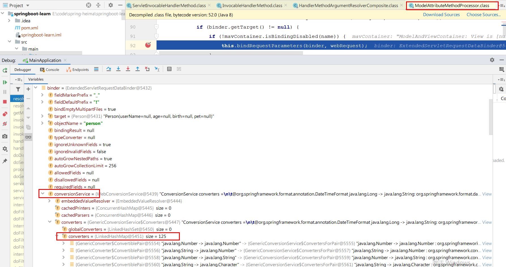我们发现数据绑定器增加了一个，接下来我们找找我们添加的那一个

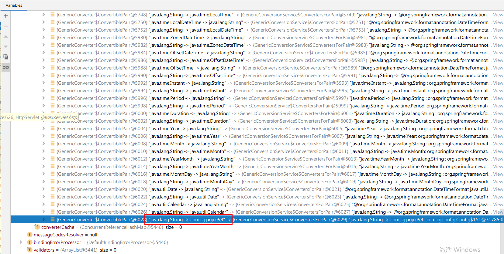

****

**在参数解析和数据绑定的过程中，我们用到了多种设计模式，在此处我们做个扩展，可以讲解一下。**

## 3.8 用到的设计模式
### 3.8.1 组合模式
[组合模式](https://www.yuque.com/u21918439/java/wize2h)

我们来看看`HandlerMethodArgumentResolverComposite`这个类


`HandlerMethodArgumentResolverComposite`实现了`HandlerMethodArgumentResolver`接口，并且声明了一个变量`private final List<HandlerMethodArgumentResolver> argumentResolvers = new ArrayList();`这个argumentResolvers变量是`HandlerMethodArgumentResolver`接口的集合。

我们在再看看`HandlerMethodArgumentResolver`这个接口

```java
public interface HandlerMethodArgumentResolver {
    boolean supportsParameter(MethodParameter var1);

    @Nullable
    Object resolveArgument(MethodParameter var1, @Nullable ModelAndViewContainer var2, NativeWebRequest var3, @Nullable WebDataBinderFactory var4) throws Exception;
}
```

里面定义了两个方法

其实现类有

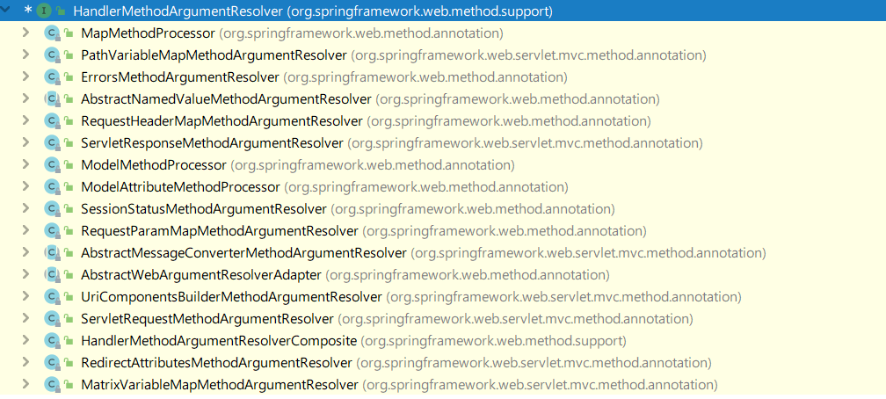

这些实现类里面均实现了这两个方法。

我们可以再看看`RequestMappingHandlerAdapter`这个类

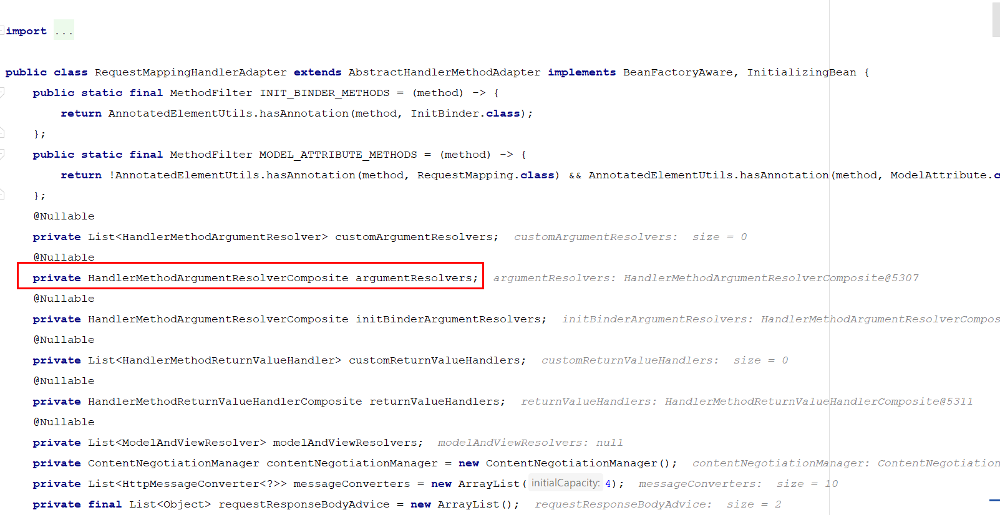

其里面定义了一个`HandlerMethodArgumentResolverComposite`属性，这就是典型的组合模式的引用。

在下面这个方法中给argumentResolvers字段赋值

```java
public void afterPropertiesSet() {
        this.initControllerAdviceCache();
        List handlers;
        if (this.argumentResolvers == null) {
            handlers = this.getDefaultArgumentResolvers();//在这个方法里面，把所有的resolvers添加进去
            this.argumentResolvers = (new HandlerMethodArgumentResolverComposite()).addResolvers(handlers);//给argumentResolvers赋值
        }

        if (this.initBinderArgumentResolvers == null) {
            handlers = this.getDefaultInitBinderArgumentResolvers();
            this.initBinderArgumentResolvers = (new HandlerMethodArgumentResolverComposite()).addResolvers(handlers);
        }

        if (this.returnValueHandlers == null) {
            handlers = this.getDefaultReturnValueHandlers();
            this.returnValueHandlers = (new HandlerMethodReturnValueHandlerComposite()).addHandlers(handlers);
        }

    }
```

```java
 private List<HandlerMethodArgumentResolver> getDefaultArgumentResolvers() {
        List<HandlerMethodArgumentResolver> resolvers = new ArrayList(30);
        resolvers.add(new RequestParamMethodArgumentResolver(this.getBeanFactory(), false));
        resolvers.add(new RequestParamMapMethodArgumentResolver());
        resolvers.add(new PathVariableMethodArgumentResolver());
        resolvers.add(new PathVariableMapMethodArgumentResolver());
        resolvers.add(new MatrixVariableMethodArgumentResolver());
        resolvers.add(new MatrixVariableMapMethodArgumentResolver());
        resolvers.add(new ServletModelAttributeMethodProcessor(false));
        resolvers.add(new RequestResponseBodyMethodProcessor(this.getMessageConverters(), this.requestResponseBodyAdvice));
        resolvers.add(new RequestPartMethodArgumentResolver(this.getMessageConverters(), this.requestResponseBodyAdvice));
        resolvers.add(new RequestHeaderMethodArgumentResolver(this.getBeanFactory()));
        resolvers.add(new RequestHeaderMapMethodArgumentResolver());
        resolvers.add(new ServletCookieValueMethodArgumentResolver(this.getBeanFactory()));
        resolvers.add(new ExpressionValueMethodArgumentResolver(this.getBeanFactory()));
        resolvers.add(new SessionAttributeMethodArgumentResolver());
        resolvers.add(new RequestAttributeMethodArgumentResolver());
        resolvers.add(new ServletRequestMethodArgumentResolver());
        resolvers.add(new ServletResponseMethodArgumentResolver());
        resolvers.add(new HttpEntityMethodProcessor(this.getMessageConverters(), this.requestResponseBodyAdvice));
        resolvers.add(new RedirectAttributesMethodArgumentResolver());
        resolvers.add(new ModelMethodProcessor());
        resolvers.add(new MapMethodProcessor());
        resolvers.add(new ErrorsMethodArgumentResolver());
        resolvers.add(new SessionStatusMethodArgumentResolver());
        resolvers.add(new UriComponentsBuilderMethodArgumentResolver());
        if (this.getCustomArgumentResolvers() != null) {
            resolvers.addAll(this.getCustomArgumentResolvers());
        }

        resolvers.add(new RequestParamMethodArgumentResolver(this.getBeanFactory(), true));
        resolvers.add(new ServletModelAttributeMethodProcessor(true));
        return resolvers;
    }
```

至此，这个组合模式可以理解为完成。

### 3.8.2 适配器模式
稍后研究

## 3.9 总结
本节描述，一个请求发送到DispatcherServlet后的具体处理流程，也就是SpringMVC的主要原理。

本节内容较多且硬核，对日后编程很有帮助，需耐心对待。

可以运行一个示例，打断点，在Debug模式下，查看程序流程。
