**笔记来源：** [**【尚硅谷】SpringBoot2零基础入门教程（spring boot2干货满满）**](https://www.bilibili.com/video/BV19K4y1L7MT/?spm_id_from=333.337.search-card.all.click&vd_source=e8046ccbdc793e09a75eb61fe8e84a30)


# 4 数据响应与内容协商
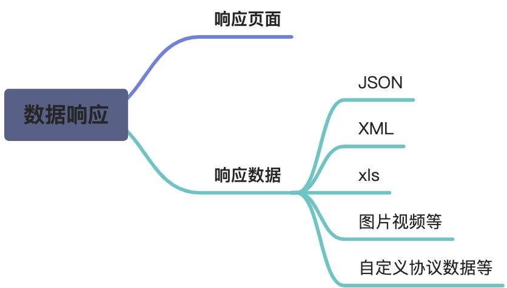

本章我们重点看响应数据，暂时不看响应页面

## 4.1 响应JSON
`jackson.jar` + `@ResponseBody`

假设给前端自动返回json数据，需要引入相关的依赖

```xml
<dependency>
    <groupId>org.springframework.boot</groupId>
    <artifactId>spring-boot-starter-web</artifactId>
</dependency>

<!-- 在spring-boot-starter-web中引入 -->
<dependency>
    <groupId>org.springframework.boot</groupId>
    <artifactId>spring-boot-starter-json</artifactId>
    <version>2.3.4.RELEASE</version>
    <scope>compile</scope>
</dependency>

<!-- 下面这个三个关于json的依赖，在spring-boot-starter-json中引入的 -->
<dependency>
      <groupId>com.fasterxml.jackson.core</groupId>
      <artifactId>jackson-databind</artifactId>
      <version>2.12.6.1</version>
      <scope>compile</scope>
    </dependency>
    <dependency>
      <groupId>com.fasterxml.jackson.datatype</groupId>
      <artifactId>jackson-datatype-jdk8</artifactId>
      <version>2.12.6</version>
      <scope>compile</scope>
    </dependency>
    <dependency>
      <groupId>com.fasterxml.jackson.datatype</groupId>
      <artifactId>jackson-datatype-jsr310</artifactId>
      <version>2.12.6</version>
      <scope>compile</scope>
    </dependency>
<!-- 所以只需要spring-boot-starter-web就会引入以上所有的依赖 -->
```


控制层代码如下：

```java
@Controller
public class ResponseTestController {
    
	@ResponseBody  //利用返回值处理器里面的消息转换器进行处理
    @GetMapping(value = "/test/person")
    public Person getPerson(){
        Person person = new Person();
        person.setAge(28);
        person.setBirth(new Date());
        person.setUserName("zhangsan");
        return person;
    }

}
```

### 4.1.1 返回值处理器
在上面章节中有粗略的看过返回值处理器，此时我们来详细的看：

先来spring默认的返回值处理器有哪些

```java
public class RequestMappingHandlerAdapter extends AbstractHandlerMethodAdapter
		implements BeanFactoryAware, InitializingBean {
    ...
    
	@Nullable
	protected ModelAndView invokeHandlerMethod(HttpServletRequest request,
			HttpServletResponse response, HandlerMethod handlerMethod) throws Exception {

		ServletWebRequest webRequest = new ServletWebRequest(request, response);
		try {
			
            ...
            
            ServletInvocableHandlerMethod invocableMethod = createInvocableHandlerMethod(handlerMethod);
                
			if (this.argumentResolvers != null) {
				invocableMethod.setHandlerMethodArgumentResolvers(this.argumentResolvers);
			}
			if (this.returnValueHandlers != null) {//<----关注点
				invocableMethod.setHandlerMethodReturnValueHandlers(this.returnValueHandlers);
			}

            ...

			invocableMethod.invokeAndHandle(webRequest, mavContainer);//看下块代码
			if (asyncManager.isConcurrentHandlingStarted()) {
				return null;
			}

			return getModelAndView(mavContainer, modelFactory, webRequest);
		}
		finally {
			webRequest.requestCompleted();
		}
	}
```


总共有15个，接下来我们来看看会在哪一步骤中进行返回值的处理


```java
public class ServletInvocableHandlerMethod extends InvocableHandlerMethod {
    
	public void invokeAndHandle(ServletWebRequest webRequest, ModelAndViewContainer mavContainer,
			Object... providedArgs) throws Exception {

		Object returnValue = invokeForRequest(webRequest, mavContainer, providedArgs);
		
        ...
        
		try {
            //看下块代码
			this.returnValueHandlers.handleReturnValue(
					returnValue, getReturnValueType(returnValue), mavContainer, webRequest);
		}
		catch (Exception ex) {
			...
		}
	}
```

接下来我们进入这个`handleReturnValue`方法里面看看


```java
public class HandlerMethodReturnValueHandlerComposite implements HandlerMethodReturnValueHandler {
    ...
	@Override
	public void handleReturnValue(@Nullable Object returnValue, MethodParameter returnType,
			ModelAndViewContainer mavContainer, NativeWebRequest webRequest) throws Exception {

        //selectHandler()实现在下面
		HandlerMethodReturnValueHandler handler = selectHandler(returnValue, returnType);
		if (handler == null) {
			throw new IllegalArgumentException("Unknown return value type: " + returnType.getParameterType().getName());
		}
        //开始处理
		handler.handleReturnValue(returnValue, returnType, mavContainer, webRequest);
	}
    
   	@Nullable
	private HandlerMethodReturnValueHandler selectHandler(@Nullable Object value, MethodParameter returnType) {
		boolean isAsyncValue = isAsyncReturnValue(value, returnType);//判断是否为异步，很明显我们都不是
		for (HandlerMethodReturnValueHandler handler : this.returnValueHandlers) {
			if (isAsyncValue && !(handler instanceof AsyncHandlerMethodReturnValueHandler)) {
				continue;
			}
			if (handler.supportsReturnType(returnType)) {
				return handler;
			}
		}
		return null;
	}
```

我们先来看看，在针对下面这个一个返回值，我们自定义的Person对象，spring会给我们选择哪一个返回值处理器

```java
@Controller
public class ResponseTestController {
    
	@ResponseBody  //利用返回值处理器里面的消息转换器进行处理
    @GetMapping(value = "/test/person")
    public Person getPerson(){
        Person person = new Person();
        person.setAge(28);
        person.setBirth(new Date());
        person.setUserName("zhangsan");
        return person;
    }

}
```


`@ResponseBody` 注解，即`RequestResponseBodyMethodProcessor`，它实现`HandlerMethodReturnValueHandler`接口

```java
public class RequestResponseBodyMethodProcessor extends AbstractMessageConverterMethodProcessor {
    ...
	@Override
	public void handleReturnValue(@Nullable Object returnValue, MethodParameter returnType,
			ModelAndViewContainer mavContainer, NativeWebRequest webRequest)
			throws IOException, HttpMediaTypeNotAcceptableException, HttpMessageNotWritableException {

		mavContainer.setRequestHandled(true);
		ServletServerHttpRequest inputMessage = createInputMessage(webRequest);
		ServletServerHttpResponse outputMessage = createOutputMessage(webRequest);

        // 使用消息转换器进行写出操作，本方法下一章节介绍：
		// Try even with null return value. ResponseBodyAdvice could get involved.
		writeWithMessageConverters(returnValue, returnType, inputMessage, outputMessage);
	}

}
```

至此我们已经找到合适的返回值处理器，接下来就是分析返回值的过程，这里面涉及到HTTPMessageConverter，我们接下来会详细的进行讲解。

### 4.1.2 spring默认的返回值处理器
在讲解处理返回值之前，我们可以先来看看其他的返回值处理器支持的返回值类型

返回值处理器的最上面接口，也就是规范是这样的

```java
public interface HandlerMethodReturnValueHandler {
    boolean supportsReturnType(MethodParameter var1);
    void handleReturnValue(@Nullable Object var1, MethodParameter var2, ModelAndViewContainer var3, NativeWebRequest var4) throws Exception;
}
```


ModelAndViewMethodReturnValueHandler

```java
public boolean supportsReturnType(MethodParameter returnType) {
    return ModelAndView.class.isAssignableFrom(returnType.getParameterType());
}
```


ModelMethodProcessor

```java
public boolean supportsReturnType(MethodParameter returnType) {
    return Model.class.isAssignableFrom(returnType.getParameterType());
}
```


ViewMethodReturnValueHandler

```java
public boolean supportsReturnType(MethodParameter returnType) {
    return View.class.isAssignableFrom(returnType.getParameterType());
}
```


ResponseBodyEmitterReturnValueHandler

```java
public boolean supportsReturnType(MethodParameter returnType) {
    Class<?> bodyType = ResponseEntity.class.isAssignableFrom(returnType.getParameterType()) ? ResolvableType.forMethodParameter(returnType).getGeneric(new int[0]).resolve() : returnType.getParameterType();
    return bodyType != null && (ResponseBodyEmitter.class.isAssignableFrom(bodyType) || this.reactiveHandler.isReactiveType(bodyType));
}
```

StreamingResponseBodyReturnValueHandler

```java
public boolean supportsReturnType(MethodParameter returnType) {
    if (StreamingResponseBody.class.isAssignableFrom(returnType.getParameterType())) {
    	return true;
	} else if (!ResponseEntity.class.isAssignableFrom(returnType.getParameterType())) {
    	return false;
	} else {
    	Class<?> bodyType = ResolvableType.forMethodParameter(returnType).getGeneric(new int[0]).resolve();
    	return bodyType != null && StreamingResponseBody.class.isAssignableFrom(bodyType);
	}
}
```

HttpEntityMethodProcessor

```java
public boolean supportsReturnType(MethodParameter returnType) {
    return HttpEntity.class.isAssignableFrom(returnType.getParameterType()) && !RequestEntity.class.isAssignableFrom(returnType.getParameterType());
}
```


HttpHeadersReturnValueHandler

```java
public boolean supportsReturnType(MethodParameter returnType) {
    return HttpHeaders.class.isAssignableFrom(returnType.getParameterType());
}
```

CallableMethodReturnValueHandler

```java
public boolean supportsReturnType(MethodParameter returnType) {
    return Callable.class.isAssignableFrom(returnType.getParameterType());
}
```

DeferredResultMethodReturnValueHandler

```java
public boolean supportsReturnType(MethodParameter returnType) {
    Class<?> type = returnType.getParameterType();
    return DeferredResult.class.isAssignableFrom(type) || ListenableFuture.class.isAssignableFrom(type) || CompletionStage.class.isAssignableFrom(type);
}
```

AsyncTaskMethodReturnValueHandler

```java
public boolean supportsReturnType(MethodParameter returnType) {
    return WebAsyncTask.class.isAssignableFrom(returnType.getParameterType());
}
```

ModelAttributeMethodProcessor

```java
public boolean supportsReturnType(MethodParameter returnType) {
    return returnType.hasMethodAnnotation(ModelAttribute.class) || this.annotationNotRequired && !BeanUtils.isSimpleProperty(returnType.getParameterType());
}
```

RequestResponseBodyMethodProcessor

```java
public boolean supportsReturnType(MethodParameter returnType) {
    return AnnotatedElementUtils.hasAnnotation(returnType.getContainingClass(), ResponseBody.class) || returnType.hasMethodAnnotation(ResponseBody.class);
}
```

ViewNameMethodReturnValueHandler

```java
public boolean supportsReturnType(MethodParameter returnType) {
    Class<?> paramType = returnType.getParameterType();
    return Void.TYPE == paramType || CharSequence.class.isAssignableFrom(paramType);
}
```

MapMethodProcessor

```java
public boolean supportsReturnType(MethodParameter returnType) {
    return Map.class.isAssignableFrom(returnType.getParameterType());
}
```

ModelAttributeMethodProcessor

```java
public boolean supportsReturnType(MethodParameter returnType) {
    return returnType.hasMethodAnnotation(ModelAttribute.class) || this.annotationNotRequired && !BeanUtils.isSimpleProperty(returnType.getParameterType());
}
```

**在寻找这些返回值处理器的过程中，我们还发现一个规律，这些叫做**`xxxProcessor`**的里面不仅有返回值处理器，还有参数解析器，而**`xxxReturnValueHandler`**里面则单纯的只有返回值处理器，由此可见，spring的命名是多么的规范。**

**好了，看完了所有的返回值处理器，接下来我们可以继续看如何用返回值处理器来处理返回值的过程了。**

## 4.2 HTTPMessageConverter原理
### 4.2.1 处理流程
以`RequestResponseBodyMethodProcessor`返回值处理器为例，我们来分析

```java
public void handleReturnValue(@Nullable Object returnValue, MethodParameter returnType, ModelAndViewContainer mavContainer, NativeWebRequest webRequest) throws IOException, HttpMediaTypeNotAcceptableException, HttpMessageNotWritableException {
        mavContainer.setRequestHandled(true);
        ServletServerHttpRequest inputMessage = this.createInputMessage(webRequest);
        ServletServerHttpResponse outputMessage = this.createOutputMessage(webRequest);
        this.writeWithMessageConverters(returnValue, returnType, inputMessage, outputMessage);//我们重点来分析这行代码
}
```

返回值处理器`ReturnValueHandler`原理：

1. 返回值处理器判断是否支持这种类型返回值 `supportsReturnType`
2. 返回值处理器调用`handleReturnValue`进行处理
3. `RequestResponseBodyMethodProcessor` 可以处理返回值标了`@ResponseBody` 注解的。 
    - 利用 `MessageConverters` 进行处理 将数据写为json 
        1. 内容协商（浏览器默认会以请求头的方式告诉服务器他能接受什么样的内容类型）
        2. 服务器最终根据自己自身的能力，决定服务器能生产出什么样内容类型的数据，
        3. SpringMVC会挨个遍历所有容器底层的 `HttpMessageConverter` ，看谁能处理？ 
            1. 得到`MappingJackson2HttpMessageConverter`可以将对象写为json
            2. 利用`MappingJackson2HttpMessageConverter`将对象转为json再写出去。

浏览器可以接受的数据格式

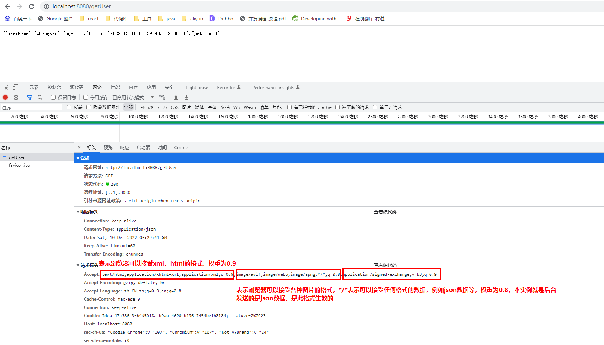

在代码中的体现是


在上面这个步骤中，还不确定哪个messageConverter能提供这种转换JSON的能力


上面这张图片中，红色的注释字体有点错误，应该是服务器可以提供的类型，写成了服务器可以接受的类型。

在上面的过程中我们已经清楚了服务器可以提供给浏览器哪种文件格式，接下来我们就来分析是哪个messageConverter来提供这种能力。

在来判断之前，我们首先先看看，messageConverter的代码规范是什么样的

### 4.2.2 默认的HTTPMessageConverter
`HTTPMessageConverter`接口：

```java
/**
 * Strategy interface for converting from and to HTTP requests and responses.
 */
public interface HttpMessageConverter<T> {

	/**
	 * Indicates whether the given class can be read by this converter.
	 */
	boolean canRead(Class<?> clazz, @Nullable MediaType mediaType);

	/**
	 * Indicates whether the given class can be written by this converter.
	 */
	boolean canWrite(Class<?> clazz, @Nullable MediaType mediaType);

	/**
	 * Return the list of {@link MediaType} objects supported by this converter.
	 */
	List<MediaType> getSupportedMediaTypes();

	/**
	 * Read an object of the given type from the given input message, and returns it.
	 */
	T read(Class<? extends T> clazz, HttpInputMessage inputMessage)
			throws IOException, HttpMessageNotReadableException;

	/**
	 * Write an given object to the given output message.
	 */
	void write(T t, @Nullable MediaType contentType, HttpOutputMessage outputMessage)
			throws IOException, HttpMessageNotWritableException;

}
```

`HttpMessageConverter`: 看是否支持将 此`Class`类型的对象，转为`MediaType`类型的数据。

我们先来看看spring中默认的messageConverter有哪些，而此时我们要将自定义类型的Person转换为Json会用到哪个messageConverter呢，继续往下看

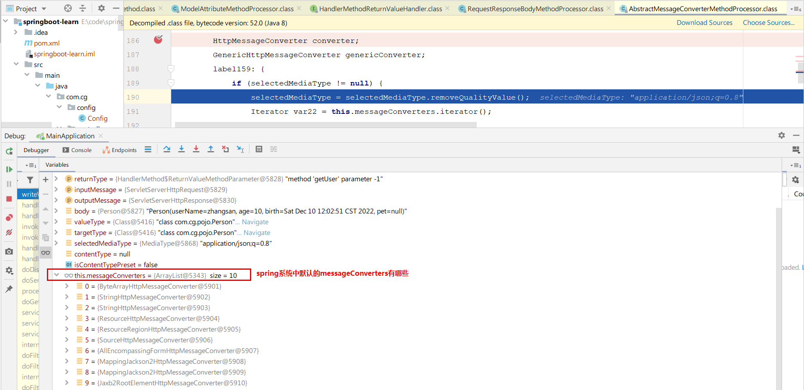

我们也来看看各个messageConverter里面支持的转换类型


**1）其中AbstractHttpMessageConverter定义着抽象方法supports交给子类去实现**

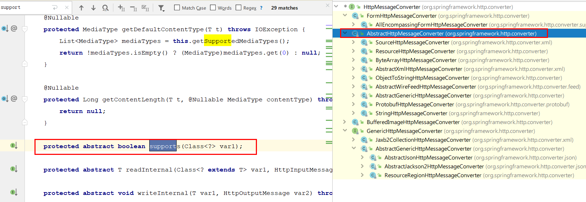

```java
 protected abstract boolean supports(Class<?> var1);
```

其子类有

`ByteArrayHttpMessageConverter`

```java
public boolean supports(Class<?> clazz) {
    return byte[].class == clazz;
}
```

`StringHttpMessageConverter`

```java
 public boolean supports(Class<?> clazz) {
        return String.class == clazz;
    }
```

`SourceHttpMessageConverter`

```java
 public boolean supports(Class<?> clazz) {
        return SUPPORTED_CLASSES.contains(clazz);
    }

 static {
        SUPPORTED_CLASSES.add(DOMSource.class);
        SUPPORTED_CLASSES.add(SAXSource.class);
        SUPPORTED_CLASSES.add(StAXSource.class);
        SUPPORTED_CLASSES.add(StreamSource.class);
        SUPPORTED_CLASSES.add(Source.class);
    }
```

`ResourceHttpMessageConverter`

```java
protected boolean supports(Class<?> clazz) {
    return Resource.class.isAssignableFrom(clazz);
}
```


**2）GenericHttpMessageConverter中没有support方法**


其底下有一个实现类


其类图结构如下：

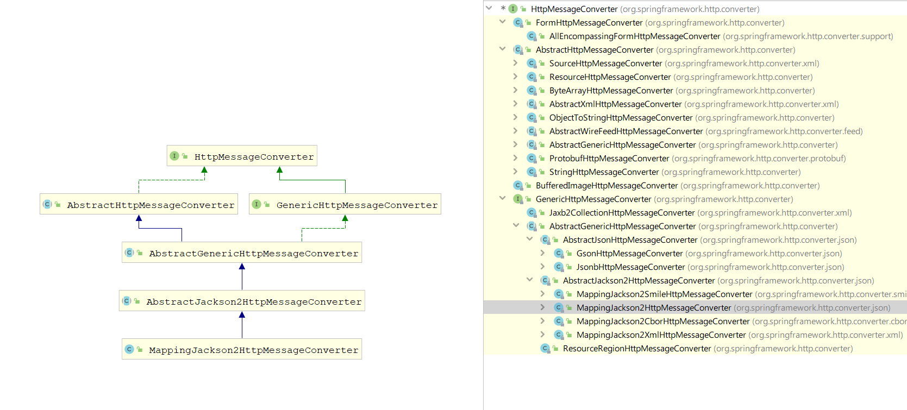

MappingJackson2HttpMessageConverter的父类AbstractJackson2HttpMessageConverter的父类AbstractGenericHttpMessageConverter中

```java
 protected boolean supports(Class<?> clazz) {
        return true;
    }
```


其祖父类中定义了support永远为ture，且在本来中没有生效，所以`MappingJackson2HttpMessageConverter`可以支持任何对象。

例子：`Person`对象转为JSON，或者 JSON转为`Person`，这将用到`MappingJackson2HttpMessageConverter`

至于GenericHttpMessageConverter其他的类也可以去详细的看看，此处不在列举

以上在类中出现support方法均是给canRead方法或者canWrite方法调用，如果没有supprot方法，可以直接查看canRead方法或者canWrite方法里面支持的类型

**3）BufferedImageHttpMessageConverter**

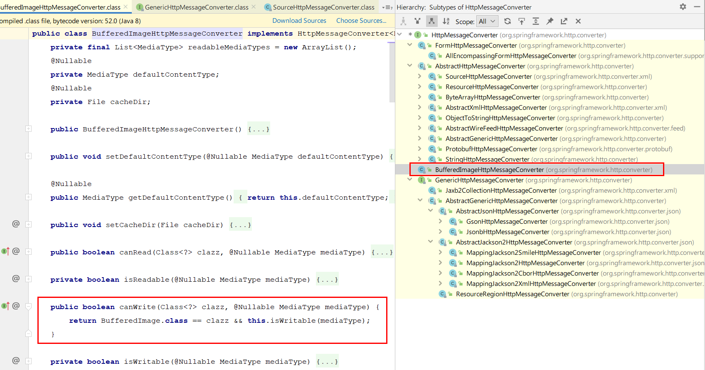

**4）**`FormHttpMessageConverter`


选择好合适的messageConverter，接下来就是转换了，调用messageConverter的read或者write方法来进行转换流程

主体的流程是在这个类里面进行的，可以看看：

```java
//RequestResponseBodyMethodProcessor继承这类
public abstract class AbstractMessageConverterMethodProcessor extends AbstractMessageConverterMethodArgumentResolver
		implements HandlerMethodReturnValueHandler {

    ...
    
    //承接上一节内容
    protected <T> void writeWithMessageConverters(@Nullable T value, MethodParameter returnType,
                ServletServerHttpRequest inputMessage, ServletServerHttpResponse outputMessage)
                throws IOException, HttpMediaTypeNotAcceptableException, HttpMessageNotWritableException {

            Object body;
            Class<?> valueType;
            Type targetType;

            if (value instanceof CharSequence) {
                body = value.toString();
                valueType = String.class;
                targetType = String.class;
            }
            else {
                body = value;
                valueType = getReturnValueType(body, returnType);
                targetType = GenericTypeResolver.resolveType(getGenericType(returnType), returnType.getContainingClass());
            }

			...

            //内容协商（浏览器默认会以请求头(参数Accept)的方式告诉服务器他能接受什么样的内容类型）
            MediaType selectedMediaType = null;
            MediaType contentType = outputMessage.getHeaders().getContentType();
            boolean isContentTypePreset = contentType != null && contentType.isConcrete();
            if (isContentTypePreset) {
                if (logger.isDebugEnabled()) {
                    logger.debug("Found 'Content-Type:" + contentType + "' in response");
                }
                selectedMediaType = contentType;
            }
            else {
                HttpServletRequest request = inputMessage.getServletRequest();
                List<MediaType> acceptableTypes = getAcceptableMediaTypes(request);
                //服务器最终根据自己自身的能力，决定服务器能生产出什么样内容类型的数据
                List<MediaType> producibleTypes = getProducibleMediaTypes(request, valueType, targetType);

                if (body != null && producibleTypes.isEmpty()) {
                    throw new HttpMessageNotWritableException(
                            "No converter found for return value of type: " + valueType);
                }
                List<MediaType> mediaTypesToUse = new ArrayList<>();
                for (MediaType requestedType : acceptableTypes) {
                    for (MediaType producibleType : producibleTypes) {
                        if (requestedType.isCompatibleWith(producibleType)) {
                            mediaTypesToUse.add(getMostSpecificMediaType(requestedType, producibleType));
                        }
                    }
                }
                if (mediaTypesToUse.isEmpty()) {
                    if (body != null) {
                        throw new HttpMediaTypeNotAcceptableException(producibleTypes);
                    }
                    if (logger.isDebugEnabled()) {
                        logger.debug("No match for " + acceptableTypes + ", supported: " + producibleTypes);
                    }
                    return;
                }

                MediaType.sortBySpecificityAndQuality(mediaTypesToUse);

                //选择一个MediaType
                for (MediaType mediaType : mediaTypesToUse) {
                    if (mediaType.isConcrete()) {
                        selectedMediaType = mediaType;
                        break;
                    }
                    else if (mediaType.isPresentIn(ALL_APPLICATION_MEDIA_TYPES)) {
                        selectedMediaType = MediaType.APPLICATION_OCTET_STREAM;
                        break;
                    }
                }

                if (logger.isDebugEnabled()) {
                    logger.debug("Using '" + selectedMediaType + "', given " +
                            acceptableTypes + " and supported " + producibleTypes);
                }
            }

        	
            if (selectedMediaType != null) {
                selectedMediaType = selectedMediaType.removeQualityValue();
                //本节主角：HttpMessageConverter
                for (HttpMessageConverter<?> converter : this.messageConverters) {
                    GenericHttpMessageConverter genericConverter = (converter instanceof GenericHttpMessageConverter ?
                            (GenericHttpMessageConverter<?>) converter : null);
                    
                    //判断是否可写
                    if (genericConverter != null ?
                            ((GenericHttpMessageConverter) converter).canWrite(targetType, valueType, selectedMediaType) :
                            converter.canWrite(valueType, selectedMediaType)) {
                        body = getAdvice().beforeBodyWrite(body, returnType, selectedMediaType,
                                (Class<? extends HttpMessageConverter<?>>) converter.getClass(),
                                inputMessage, outputMessage);
                        if (body != null) {
                            Object theBody = body;
                            LogFormatUtils.traceDebug(logger, traceOn ->
                                    "Writing [" + LogFormatUtils.formatValue(theBody, !traceOn) + "]");
                            addContentDispositionHeader(inputMessage, outputMessage);
							//开始写入
                            if (genericConverter != null) {
                                genericConverter.write(body, targetType, selectedMediaType, outputMessage);
                            }
                            else {
                                ((HttpMessageConverter) converter).write(body, selectedMediaType, outputMessage);
                            }
                        }
                        else {
                            if (logger.isDebugEnabled()) {
                                logger.debug("Nothing to write: null body");
                            }
                        }
                        return;
                    }
                }
            }
			...
        }
```

关于`MappingJackson2HttpMessageConverter`的实例化请看下节。

### 4.2.3 HttpMessageConverters的初始化
`DispatcherServlet`的初始化时会调用`initHandlerAdapters(ApplicationContext context)`

```java
public class DispatcherServlet extends FrameworkServlet {
    
    ...
    
	private void initHandlerAdapters(ApplicationContext context) {
		this.handlerAdapters = null;

		if (this.detectAllHandlerAdapters) {
			// Find all HandlerAdapters in the ApplicationContext, including ancestor contexts.
			Map<String, HandlerAdapter> matchingBeans =
					BeanFactoryUtils.beansOfTypeIncludingAncestors(context, HandlerAdapter.class, true, false);
			if (!matchingBeans.isEmpty()) {
				this.handlerAdapters = new ArrayList<>(matchingBeans.values());
				// We keep HandlerAdapters in sorted order.
				AnnotationAwareOrderComparator.sort(this.handlerAdapters);
			}
		}
      ...
```

上述代码会加载`ApplicationContext`的所有`HandlerAdapter`，用来处理`@RequestMapping`的`RequestMappingHandlerAdapter`实现`HandlerAdapter`接口，`RequestMappingHandlerAdapter`也被实例化。

```java
public class RequestMappingHandlerAdapter extends AbstractHandlerMethodAdapter
		implements BeanFactoryAware, InitializingBean {
    
    ...

    private List<HttpMessageConverter<?>> messageConverters;
    
    ...
    
	public RequestMappingHandlerAdapter() {
		this.messageConverters = new ArrayList<>(4);
		this.messageConverters.add(new ByteArrayHttpMessageConverter());
		this.messageConverters.add(new StringHttpMessageConverter());
		if (!shouldIgnoreXml) {
			try {
				this.messageConverters.add(new SourceHttpMessageConverter<>());
			}
			catch (Error err) {
				// Ignore when no TransformerFactory implementation is available
			}
		}
		this.messageConverters.add(new AllEncompassingFormHttpMessageConverter());
	}
```

在构造器中看到**一堆**`HttpMessageConverter`。接着，重点查看`AllEncompassingFormHttpMessageConverter`类：

```java
public class AllEncompassingFormHttpMessageConverter extends FormHttpMessageConverter {

	/**
	 * Boolean flag controlled by a {@code spring.xml.ignore} system property that instructs Spring to
	 * ignore XML, i.e. to not initialize the XML-related infrastructure.
	 * <p>The default is "false".
	 */
	private static final boolean shouldIgnoreXml = SpringProperties.getFlag("spring.xml.ignore");

	private static final boolean jaxb2Present;

	private static final boolean jackson2Present;

	private static final boolean jackson2XmlPresent;

	private static final boolean jackson2SmilePresent;

	private static final boolean gsonPresent;

	private static final boolean jsonbPresent;

	private static final boolean kotlinSerializationJsonPresent;

	static {
		ClassLoader classLoader = AllEncompassingFormHttpMessageConverter.class.getClassLoader();
		jaxb2Present = ClassUtils.isPresent("javax.xml.bind.Binder", classLoader);
		jackson2Present = ClassUtils.isPresent("com.fasterxml.jackson.databind.ObjectMapper", classLoader) &&
						ClassUtils.isPresent("com.fasterxml.jackson.core.JsonGenerator", classLoader);
		jackson2XmlPresent = ClassUtils.isPresent("com.fasterxml.jackson.dataformat.xml.XmlMapper", classLoader);
		jackson2SmilePresent = ClassUtils.isPresent("com.fasterxml.jackson.dataformat.smile.SmileFactory", classLoader);
		gsonPresent = ClassUtils.isPresent("com.google.gson.Gson", classLoader);
		jsonbPresent = ClassUtils.isPresent("javax.json.bind.Jsonb", classLoader);
		kotlinSerializationJsonPresent = ClassUtils.isPresent("kotlinx.serialization.json.Json", classLoader);
	}


	public AllEncompassingFormHttpMessageConverter() {
		if (!shouldIgnoreXml) {
			try {
				addPartConverter(new SourceHttpMessageConverter<>());
			}
			catch (Error err) {
				// Ignore when no TransformerFactory implementation is available
			}

			if (jaxb2Present && !jackson2XmlPresent) {
				addPartConverter(new Jaxb2RootElementHttpMessageConverter());
			}
		}

		if (jackson2Present) {
			addPartConverter(new MappingJackson2HttpMessageConverter());//<----重点看这里
		}
		else if (gsonPresent) {
			addPartConverter(new GsonHttpMessageConverter());
		}
		else if (jsonbPresent) {
			addPartConverter(new JsonbHttpMessageConverter());
		}
		else if (kotlinSerializationJsonPresent) {
			addPartConverter(new KotlinSerializationJsonHttpMessageConverter());
		}

		if (jackson2XmlPresent && !shouldIgnoreXml) {
			addPartConverter(new MappingJackson2XmlHttpMessageConverter());
		}

		if (jackson2SmilePresent) {
			addPartConverter(new MappingJackson2SmileHttpMessageConverter());
		}
	}

}

public class FormHttpMessageConverter implements HttpMessageConverter<MultiValueMap<String, ?>> {
    
    ...
        
    private List<HttpMessageConverter<?>> partConverters = new ArrayList<>();
    
    ...
        
    public void addPartConverter(HttpMessageConverter<?> partConverter) {
		Assert.notNull(partConverter, "'partConverter' must not be null");
		this.partConverters.add(partConverter);
	}
    
    ...
}
```

在`AllEncompassingFormHttpMessageConverter`类构造器看到`MappingJackson2HttpMessageConverter`类的实例化，`AllEncompassingFormHttpMessageConverter`**包含**`MappingJackson2HttpMessageConverter`。

`ReturnValueHandler`是怎么与`MappingJackson2HttpMessageConverter`关联起来？请看下节。

### 4.2.4 ReturnValueHandler与MappingJackson2HttpMessageConverter关联
再次回顾`RequestMappingHandlerAdapter`

```java
public class RequestMappingHandlerAdapter extends AbstractHandlerMethodAdapter
		implements BeanFactoryAware, InitializingBean {
    
    ...
    @Nullable
	private HandlerMethodReturnValueHandlerComposite returnValueHandlers;//我们关注的returnValueHandlers
    
   	
    @Override
	@Nullable//本方法在AbstractHandlerMethodAdapter
	public final ModelAndView handle(HttpServletRequest request, HttpServletResponse response, Object handler)
			throws Exception {

		return handleInternal(request, response, (HandlerMethod) handler);
	}
        
    @Override
	protected ModelAndView handleInternal(HttpServletRequest request,
			HttpServletResponse response, HandlerMethod handlerMethod) throws Exception {
		ModelAndView mav;
        ...
        mav = invokeHandlerMethod(request, response, handlerMethod);
        ...
		return mav;
	}
    
    @Nullable
	protected ModelAndView invokeHandlerMethod(HttpServletRequest request,
			HttpServletResponse response, HandlerMethod handlerMethod) throws Exception {

		ServletWebRequest webRequest = new ServletWebRequest(request, response);
		try {
			WebDataBinderFactory binderFactory = getDataBinderFactory(handlerMethod);
			ModelFactory modelFactory = getModelFactory(handlerMethod, binderFactory);

			ServletInvocableHandlerMethod invocableMethod = createInvocableHandlerMethod(handlerMethod);
			if (this.argumentResolvers != null) {
				invocableMethod.setHandlerMethodArgumentResolvers(this.argumentResolvers);
			}
			if (this.returnValueHandlers != null) {//<---我们关注的returnValueHandlers
				invocableMethod.setHandlerMethodReturnValueHandlers(this.returnValueHandlers);
			}
            
            ...
            
			invocableMethod.invokeAndHandle(webRequest, mavContainer);
			if (asyncManager.isConcurrentHandlingStarted()) {
				return null;
			}

			return getModelAndView(mavContainer, modelFactory, webRequest);
		}
		finally {
			webRequest.requestCompleted();
		}
	}
    
   @Override
	public void afterPropertiesSet() {
		// Do this first, it may add ResponseBody advice beans
		
        ...
        
		if (this.returnValueHandlers == null) {//赋值returnValueHandlers
			List<HandlerMethodReturnValueHandler> handlers = getDefaultReturnValueHandlers();
			this.returnValueHandlers = new HandlerMethodReturnValueHandlerComposite().addHandlers(handlers);
		}
	}
    
    private List<HandlerMethodReturnValueHandler> getDefaultReturnValueHandlers() {
		List<HandlerMethodReturnValueHandler> handlers = new ArrayList<>(20);

		...
		// Annotation-based return value types
        //这里就是 ReturnValueHandler与 MappingJackson2HttpMessageConverter关联 的关键点
		handlers.add(new RequestResponseBodyMethodProcessor(getMessageConverters(),//<---MessageConverters也就传参传进来的
				this.contentNegotiationManager, this.requestResponseBodyAdvice));//
        ...

		return handlers;
	}
    
    //------
    
    public List<HttpMessageConverter<?>> getMessageConverters() {
		return this.messageConverters;
	}
    
    //RequestMappingHandlerAdapter构造器已初始化部分messageConverters
   	public RequestMappingHandlerAdapter() {
		this.messageConverters = new ArrayList<>(4);
		this.messageConverters.add(new ByteArrayHttpMessageConverter());
		this.messageConverters.add(new StringHttpMessageConverter());
		if (!shouldIgnoreXml) {
			try {
				this.messageConverters.add(new SourceHttpMessageConverter<>());
			}
			catch (Error err) {
				// Ignore when no TransformerFactory implementation is available
			}
		}
		this.messageConverters.add(new AllEncompassingFormHttpMessageConverter());
	}

    ...
              
}
```

应用中`WebMvcAutoConfiguration`（底层是`WebMvcConfigurationSupport`实现）传入更多`messageConverters`，其中就包含`MappingJackson2HttpMessageConverter`。

## 4.3 内容协商
根据客户端接收能力不同，返回不同媒体类型的数据。

引入XML依赖：

```xml
 <dependency>
     <groupId>com.fasterxml.jackson.dataformat</groupId>
     jackson-dataformat-xml</artifactId>
</dependency>
```

1）在浏览器中测试：


返回的格式为xml

2）在postman中再测试一下

可用Postman软件分别测试返回json和xml：只需要改变请求头中Accept字段（application/json、application/xml）。

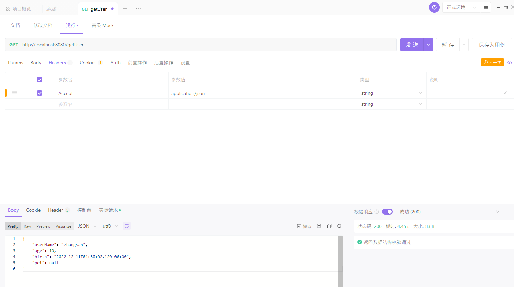


Http协议中规定的，Accept字段告诉服务器本客户端可以接收的数据类型。

### 4.3.1 内容协商原理
分析流程：

1. 判断当前响应头中是否已经有确定的媒体类型`MediaType`。
2. 获取客户端（PostMan、浏览器）支持接收的内容类型。（获取客户端Accept请求头字段application/xml）（这一步在下一节有详细介绍） 
    - `contentNegotiationManager` 内容协商管理器默认使用基于请求头的策略
    - `HeaderContentNegotiationStrategy`  确定客户端可以接收的内容类型

    

3. 遍历循环所有当前系统的 `MessageConverter`，看谁支持操作这个对象（Person）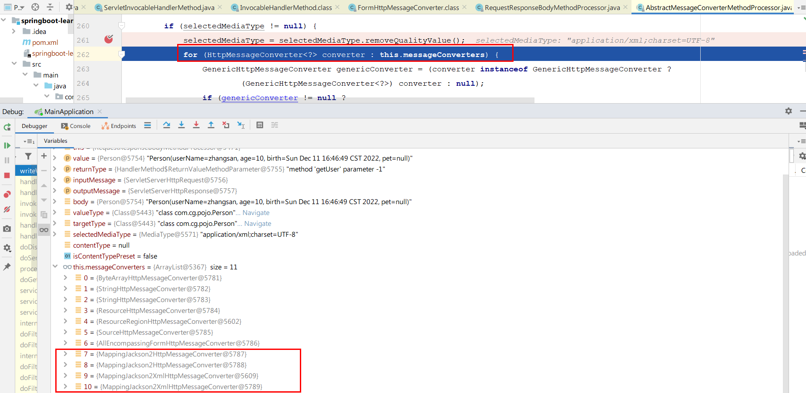
4. 找到支持操作Person的converter，把converter支持的媒体类型统计出来。
5. 客户端需要application/xml，服务端有10种MediaType。

    

    还是回忆一下刚才上面的分析，浏览器客户端可以接受什么样的返回值，此处显示的是可以接受xml格式，而服务端可以提供10种格式

6. 进行内容协商的最佳匹配媒体类型

    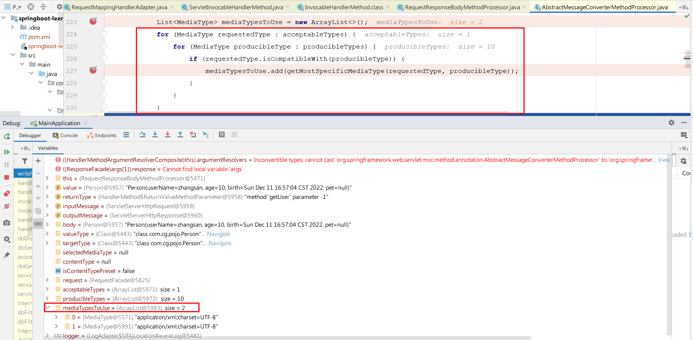

7. 用 支持 将对象转为 最佳匹配媒体类型 的converter。调用它进行转化 。

    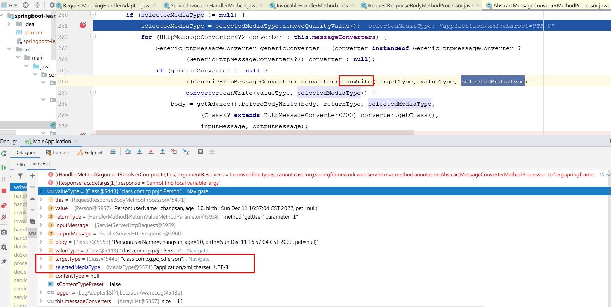

    进过一系列的筛选，最终选择的是`MappingJackson2XmlHttpMessageConverter`

8. 将数据写回给客户端

    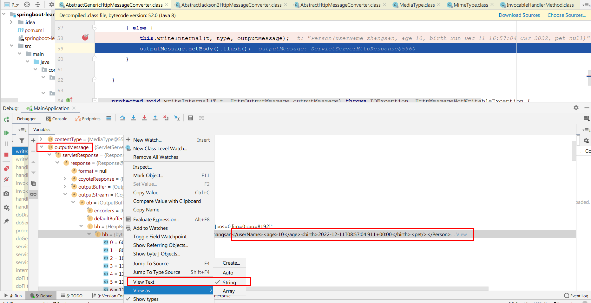


整体的流程代码如下：

```java

//RequestResponseBodyMethodProcessor继承这类
public abstract class AbstractMessageConverterMethodProcessor extends AbstractMessageConverterMethodArgumentResolver
		implements HandlerMethodReturnValueHandler {

    ...
    
    //跟上一节的代码一致
    protected <T> void writeWithMessageConverters(@Nullable T value, MethodParameter returnType,
                ServletServerHttpRequest inputMessage, ServletServerHttpResponse outputMessage)
                throws IOException, HttpMediaTypeNotAcceptableException, HttpMessageNotWritableException {

            Object body;
            Class<?> valueType;
            Type targetType;

            if (value instanceof CharSequence) {
                body = value.toString();
                valueType = String.class;
                targetType = String.class;
            }
            else {
                body = value;
                valueType = getReturnValueType(body, returnType);
                targetType = GenericTypeResolver.resolveType(getGenericType(returnType), returnType.getContainingClass());
            }

			...

            //本节重点
            //内容协商（浏览器默认会以请求头(参数Accept)的方式告诉服务器他能接受什么样的内容类型）
            MediaType selectedMediaType = null;
            MediaType contentType = outputMessage.getHeaders().getContentType();
            boolean isContentTypePreset = contentType != null && contentType.isConcrete();
            if (isContentTypePreset) {
                if (logger.isDebugEnabled()) {
                    logger.debug("Found 'Content-Type:" + contentType + "' in response");
                }
                selectedMediaType = contentType;
            }
            else {
                HttpServletRequest request = inputMessage.getServletRequest();
                List<MediaType> acceptableTypes = getAcceptableMediaTypes(request);
                //服务器最终根据自己自身的能力，决定服务器能生产出什么样内容类型的数据
                List<MediaType> producibleTypes = getProducibleMediaTypes(request, valueType, targetType);

                if (body != null && producibleTypes.isEmpty()) {
                    throw new HttpMessageNotWritableException(
                            "No converter found for return value of type: " + valueType);
                }
                List<MediaType> mediaTypesToUse = new ArrayList<>();
                for (MediaType requestedType : acceptableTypes) {
                    for (MediaType producibleType : producibleTypes) {
                        if (requestedType.isCompatibleWith(producibleType)) {
                            mediaTypesToUse.add(getMostSpecificMediaType(requestedType, producibleType));
                        }
                    }
                }
                if (mediaTypesToUse.isEmpty()) {
                    if (body != null) {
                        throw new HttpMediaTypeNotAcceptableException(producibleTypes);
                    }
                    if (logger.isDebugEnabled()) {
                        logger.debug("No match for " + acceptableTypes + ", supported: " + producibleTypes);
                    }
                    return;
                }

                MediaType.sortBySpecificityAndQuality(mediaTypesToUse);

                //选择一个MediaType
                for (MediaType mediaType : mediaTypesToUse) {
                    if (mediaType.isConcrete()) {
                        selectedMediaType = mediaType;
                        break;
                    }
                    else if (mediaType.isPresentIn(ALL_APPLICATION_MEDIA_TYPES)) {
                        selectedMediaType = MediaType.APPLICATION_OCTET_STREAM;
                        break;
                    }
                }

                if (logger.isDebugEnabled()) {
                    logger.debug("Using '" + selectedMediaType + "', given " +
                            acceptableTypes + " and supported " + producibleTypes);
                }
            }

        	
            if (selectedMediaType != null) {
                selectedMediaType = selectedMediaType.removeQualityValue();
                //本节主角：HttpMessageConverter
                for (HttpMessageConverter<?> converter : this.messageConverters) {
                    GenericHttpMessageConverter genericConverter = (converter instanceof GenericHttpMessageConverter ?
                            (GenericHttpMessageConverter<?>) converter : null);
                    
                    //判断是否可写
                    if (genericConverter != null ?
                            ((GenericHttpMessageConverter) converter).canWrite(targetType, valueType, selectedMediaType) :
                            converter.canWrite(valueType, selectedMediaType)) {
                        body = getAdvice().beforeBodyWrite(body, returnType, selectedMediaType,
                                (Class<? extends HttpMessageConverter<?>>) converter.getClass(),
                                inputMessage, outputMessage);
                        if (body != null) {
                            Object theBody = body;
                            LogFormatUtils.traceDebug(logger, traceOn ->
                                    "Writing [" + LogFormatUtils.formatValue(theBody, !traceOn) + "]");
                            addContentDispositionHeader(inputMessage, outputMessage);
							//开始写入
                            if (genericConverter != null) {
                                genericConverter.write(body, targetType, selectedMediaType, outputMessage);
                            }
                            else {
                                ((HttpMessageConverter) converter).write(body, selectedMediaType, outputMessage);
                            }
                        }
                        else {
                            if (logger.isDebugEnabled()) {
                                logger.debug("Nothing to write: null body");
                            }
                        }
                        return;
                    }
                }
            }
			...
        }
```

### 4.3.2 基于请求参数的内容协商原理
上一节内容协商原理的第二步：

获取客户端（PostMan、浏览器）支持接收的内容类型。（获取客户端Accept请求头字段application/xml）

+ `contentNegotiationManager` 内容协商管理器 默认使用基于请求头的策略
+ `HeaderContentNegotiationStrategy`  确定客户端可以接收的内容类型

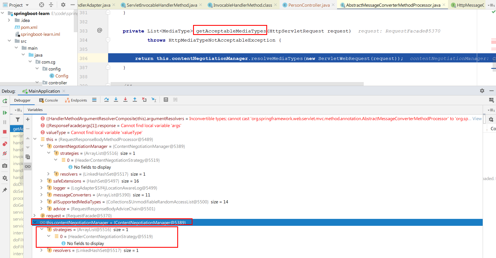

```java
//RequestResponseBodyMethodProcessor继承这类
public abstract class AbstractMessageConverterMethodProcessor extends AbstractMessageConverterMethodArgumentResolver
		implements HandlerMethodReturnValueHandler {

    ...
    
    //跟上一节的代码一致
    protected <T> void writeWithMessageConverters(@Nullable T value, MethodParameter returnType,
                ServletServerHttpRequest inputMessage, ServletServerHttpResponse outputMessage)
                throws IOException, HttpMediaTypeNotAcceptableException, HttpMessageNotWritableException {

            Object body;
            Class<?> valueType;
            Type targetType;
        
        	...
        
                    //本节重点
            //内容协商（浏览器默认会以请求头(参数Accept)的方式告诉服务器他能接受什么样的内容类型）
            MediaType selectedMediaType = null;
            MediaType contentType = outputMessage.getHeaders().getContentType();
            boolean isContentTypePreset = contentType != null && contentType.isConcrete();
            if (isContentTypePreset) {
                if (logger.isDebugEnabled()) {
                    logger.debug("Found 'Content-Type:" + contentType + "' in response");
                }
                selectedMediaType = contentType;
            }
            else {
                HttpServletRequest request = inputMessage.getServletRequest();
                List<MediaType> acceptableTypes = getAcceptableMediaTypes(request);//进入这行代码里面
                //服务器最终根据自己自身的能力，决定服务器能生产出什么样内容类型的数据
                List<MediaType> producibleTypes = getProducibleMediaTypes(request, valueType, targetType);
            ...
            
	}
    
    //在AbstractMessageConverterMethodArgumentResolver类内
   	private List<MediaType> getAcceptableMediaTypes(HttpServletRequest request)
			throws HttpMediaTypeNotAcceptableException {

        //内容协商管理器 默认使用基于请求头的策略
		return this.contentNegotiationManager.resolveMediaTypes(new ServletWebRequest(request));
	}
        
}
```


```java
public class ContentNegotiationManager implements ContentNegotiationStrategy, MediaTypeFileExtensionResolver {
	
    ...
    
    public ContentNegotiationManager() {
		this(new HeaderContentNegotiationStrategy());//内容协商管理器 默认使用基于请求头的策略
	}
    
    @Override
	public List<MediaType> resolveMediaTypes(NativeWebRequest request) throws HttpMediaTypeNotAcceptableException {
		for (ContentNegotiationStrategy strategy : this.strategies) {
			List<MediaType> mediaTypes = strategy.resolveMediaTypes(request);
			if (mediaTypes.equals(MEDIA_TYPE_ALL_LIST)) {
				continue;
			}
			return mediaTypes;
		}
		return MEDIA_TYPE_ALL_LIST;
	}
    ...
    
}
```


```java
//基于请求头的策略
public class HeaderContentNegotiationStrategy implements ContentNegotiationStrategy {

	/**
	 * {@inheritDoc}
	 * @throws HttpMediaTypeNotAcceptableException if the 'Accept' header cannot be parsed
	 */
	@Override
	public List<MediaType> resolveMediaTypes(NativeWebRequest request)
			throws HttpMediaTypeNotAcceptableException {

		String[] headerValueArray = request.getHeaderValues(HttpHeaders.ACCEPT);
		if (headerValueArray == null) {
			return MEDIA_TYPE_ALL_LIST;
		}

		List<String> headerValues = Arrays.asList(headerValueArray);
		try {
			List<MediaType> mediaTypes = MediaType.parseMediaTypes(headerValues);
			MediaType.sortBySpecificityAndQuality(mediaTypes);
			return !CollectionUtils.isEmpty(mediaTypes) ? mediaTypes : MEDIA_TYPE_ALL_LIST;
		}
		catch (InvalidMediaTypeException ex) {
			throw new HttpMediaTypeNotAcceptableException(
					"Could not parse 'Accept' header " + headerValues + ": " + ex.getMessage());
		}
	}

}
```

除了基于请求头的策略，还有其他的策略


下面我们来看基于请求参数的策略


**开启浏览器参数方式内容协商功能**

为了方便内容协商，开启基于请求参数的内容协商功能。

```yaml
spring:
  mvc:
    contentnegotiation:
      favor-parameter: true  #开启请求参数内容协商模式
```

内容协商管理器，就会多了一个`ParameterContentNegotiationStrategy`（由Spring容器注入）

```java
public class ParameterContentNegotiationStrategy extends AbstractMappingContentNegotiationStrategy {

	private String parameterName = "format";//


	/**
	 * Create an instance with the given map of file extensions and media types.
	 */
	public ParameterContentNegotiationStrategy(Map<String, MediaType> mediaTypes) {
		super(mediaTypes);
	}


	/**
	 * Set the name of the parameter to use to determine requested media types.
	 * <p>By default this is set to {@code "format"}.
	 */
	public void setParameterName(String parameterName) {
		Assert.notNull(parameterName, "'parameterName' is required");
		this.parameterName = parameterName;
	}

	public String getParameterName() {
		return this.parameterName;
	}


	@Override
	@Nullable
	protected String getMediaTypeKey(NativeWebRequest request) {
		return request.getParameter(getParameterName());
	}
    
    //---以下方法在AbstractMappingContentNegotiationStrategy类
    
    @Override
	public List<MediaType> resolveMediaTypes(NativeWebRequest webRequest)
			throws HttpMediaTypeNotAcceptableException {

		return resolveMediaTypeKey(webRequest, getMediaTypeKey(webRequest));
	}

	/**
	 * An alternative to {@link #resolveMediaTypes(NativeWebRequest)} that accepts
	 * an already extracted key.
	 * @since 3.2.16
	 */
	public List<MediaType> resolveMediaTypeKey(NativeWebRequest webRequest, @Nullable String key)
			throws HttpMediaTypeNotAcceptableException {

		if (StringUtils.hasText(key)) {
			MediaType mediaType = lookupMediaType(key);
			if (mediaType != null) {
				handleMatch(key, mediaType);
				return Collections.singletonList(mediaType);
			}
			mediaType = handleNoMatch(webRequest, key);
			if (mediaType != null) {
				addMapping(key, mediaType);
				return Collections.singletonList(mediaType);
			}
		}
		return MEDIA_TYPE_ALL_LIST;
	}
    

}
```

然后，浏览器地址输入带format参数的URL：

```java
http://localhost:8080/test/person?format=json
或
http://localhost:8080/test/person?format=xml
```

这样，后端会根据参数format的值，返回对应json或xml格式的数据。

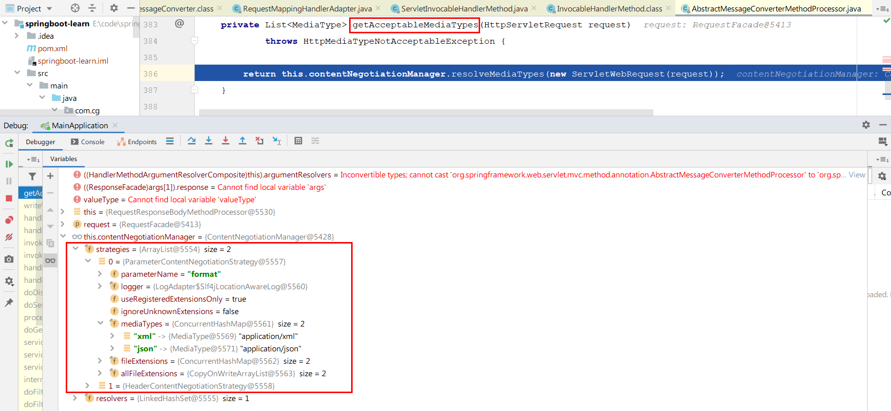

我们看出，基于参数的策略只能有xml或json这两种形式，如果我们想要增加一个自定义的，那么我们该怎么做呢，我们继续往下看。

### 4.3.3 自定义MessageConverter
**实现多协议数据兼容。json、xml、x-guigu**（这个是自创的）

1.  `@ResponseBody` 响应数据出去 调用 `RequestResponseBodyMethodProcessor` 处理 
2.  Processor 处理方法返回值。通过 `MessageConverter`处理 
3.  所有 `MessageConverter` 合起来可以支持各种媒体类型数据的操作（读、写） 
4.  内容协商找到最终的 `messageConverter` 


SpringMVC的什么功能，一个入口给容器中添加一个  `WebMvcConfigurer`

```java
@Configuration(proxyBeanMethods = false)
public class WebConfig {
    @Bean
    public WebMvcConfigurer webMvcConfigurer(){
        return new WebMvcConfigurer() {

            @Override
            public void extendMessageConverters(List<HttpMessageConverter<?>> converters) {
                converters.add(new GuiguMessageConverter());
            }
        }
    }
}
```


```java

/**
 * 自定义的Converter
 */
public class GuiguMessageConverter implements HttpMessageConverter<Person> {

    @Override
    public boolean canRead(Class<?> clazz, MediaType mediaType) {
        return false;
    }

    @Override
    public boolean canWrite(Class<?> clazz, MediaType mediaType) {
        return clazz.isAssignableFrom(Person.class);
    }

    /**
     * 服务器要统计所有MessageConverter都能写出哪些内容类型
     *
     * application/x-guigu
     * @return
     */
    @Override
    public List<MediaType> getSupportedMediaTypes() {
        return MediaType.parseMediaTypes("application/x-guigu");
    }

    @Override
    public Person read(Class<? extends Person> clazz, HttpInputMessage inputMessage) throws IOException, HttpMessageNotReadableException {
        return null;
    }

    @Override
    public void write(Person person, MediaType contentType, HttpOutputMessage outputMessage) throws IOException, HttpMessageNotWritableException {
        //自定义协议数据的写出
        String data = person.getUserName()+";"+person.getAge()+";"+person.getBirth();


        //写出去
        OutputStream body = outputMessage.getBody();
        body.write(data.getBytes());
    }
}
```


```java
import java.util.Date;

@Controller
public class ResponseTestController {

    /**
     * 1、浏览器发请求直接返回 xml    [application/xml]        jacksonXmlConverter
     * 2、如果是ajax请求 返回 json   [application/json]      jacksonJsonConverter
     * 3、如果硅谷app发请求，返回自定义协议数据  [appliaction/x-guigu]   xxxxConverter
     *          属性值1;属性值2;
     *
     * 步骤：
     * 1、添加自定义的MessageConverter进系统底层
     * 2、系统底层就会统计出所有MessageConverter能操作哪些类型
     * 3、客户端内容协商 [guigu--->guigu]
     *
     * 作业：如何以参数的方式进行内容协商
     * @return
     */
    @ResponseBody  //利用返回值处理器里面的消息转换器进行处理
    @GetMapping(value = "/test/person")
    public Person getPerson(){
        Person person = new Person();
        person.setAge(28);
        person.setBirth(new Date());
        person.setUserName("zhangsan");
        return person;
    }

}
```

用Postman发送`/test/person`（请求头`Accept:application/x-guigu`)，将返回自定义协议数据的写出。


那么在浏览器上如何访问呢？继续往下看

### 4.3.4 浏览器与PostMan内容协商完全适配
假设你想基于自定义请求参数的自定义内容协商功能。

换句话，在地址栏输入`http://localhost:8080/test/person?format=gg`返回数据，跟`http://localhost:8080/test/person`且请求头参数`Accept:application/x-guigu`的返回自定义协议数据的一致。

```java
@Configuration(proxyBeanMethods = false)
public class WebConfig /*implements WebMvcConfigurer*/ {

    //1、WebMvcConfigurer定制化SpringMVC的功能
    @Bean
    public WebMvcConfigurer webMvcConfigurer(){
        return new WebMvcConfigurer() {

            /**
             * 自定义内容协商策略
             * @param configurer
             */
            @Override
            public void configureContentNegotiation(ContentNegotiationConfigurer configurer) {
                //Map<String, MediaType> mediaTypes
                Map<String, MediaType> mediaTypes = new HashMap<>();
                mediaTypes.put("json",MediaType.APPLICATION_JSON);//如果这两行不写，则会覆盖掉spring原来自带的，会使原来的失效
                mediaTypes.put("xml",MediaType.APPLICATION_XML);
                //自定义媒体类型
                mediaTypes.put("gg",MediaType.parseMediaType("application/x-guigu"));
                //指定支持解析哪些参数对应的哪些媒体类型
                ParameterContentNegotiationStrategy parameterStrategy = new ParameterContentNegotiationStrategy(mediaTypes);
//                parameterStrategy.setParameterName("ff");

                //还需添加请求头处理策略，否则accept:application/json、application/xml则会失效
                HeaderContentNegotiationStrategy headeStrategy = new HeaderContentNegotiationStrategy();

                configurer.strategies(Arrays.asList(parameterStrategy, headeStrategy));
            }
        }
    }
    
    ...
    
}
```

日后开发要注意，**有可能我们添加的自定义的功能会覆盖默认很多功能，导致一些默认的功能失效。**

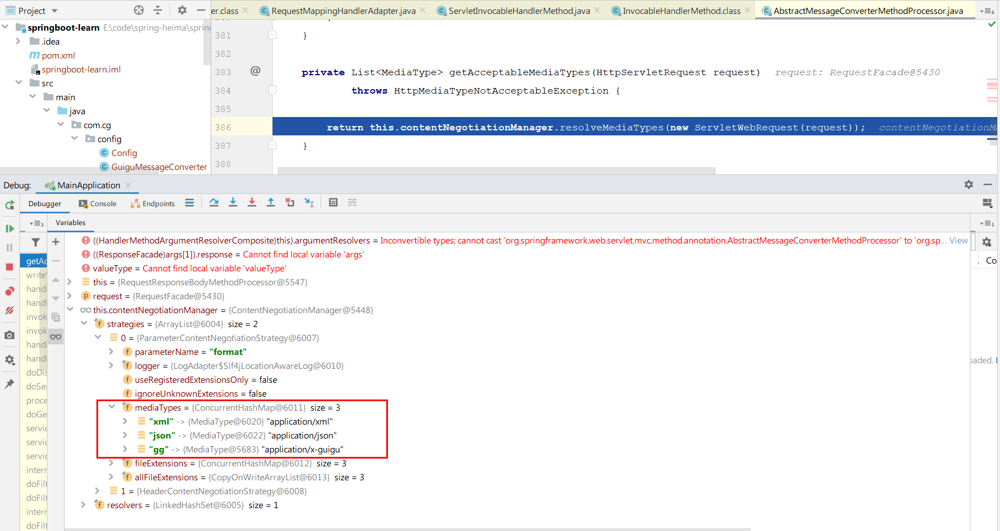

请求结果：


# 5 视图解析和模板引擎
## 5.1 视图解析原理


**对应的测试代码为**

```java
@Controller
public class TestController {
    @GetMapping("/test1")
    public String test1(){
        return "index.html";
    }
}
```

**首先从这里开始，选择返回值处理器，此时选择的返回值处理器为**`ViewNameMethodReturnValueHandler`


我们可以来看看这个`ViewNameMethodReturnValueHandler`，看看这个返回值处理中支持的类型

```java
@Override
public boolean supportsReturnType(MethodParameter returnType) {
    Class<?> paramType = returnType.getParameterType();
	return (void.class == paramType || CharSequence.class.isAssignableFrom(paramType));
}
```

支持的是void类型或者字符串类型，找到对应的返回值处理器，我们开看看他是怎么处理的。

目标方法处理的过程中，所有数据都会被放在 **ModelAndViewContainer 里面。包括数据和视图地址，而且还是判断是否为重定向，判断是否为重定向的方式也很简单，代码如下：**

```java
protected boolean isRedirectViewName(String viewName) {
	return (PatternMatchUtils.simpleMatch(this.redirectPatterns, viewName) || viewName.startsWith("redirect:"));
}
```

在上面的流程中，我们已经将所有的数据放在**ModelAndViewContainer，接下来开始分析**getModelAndView方法

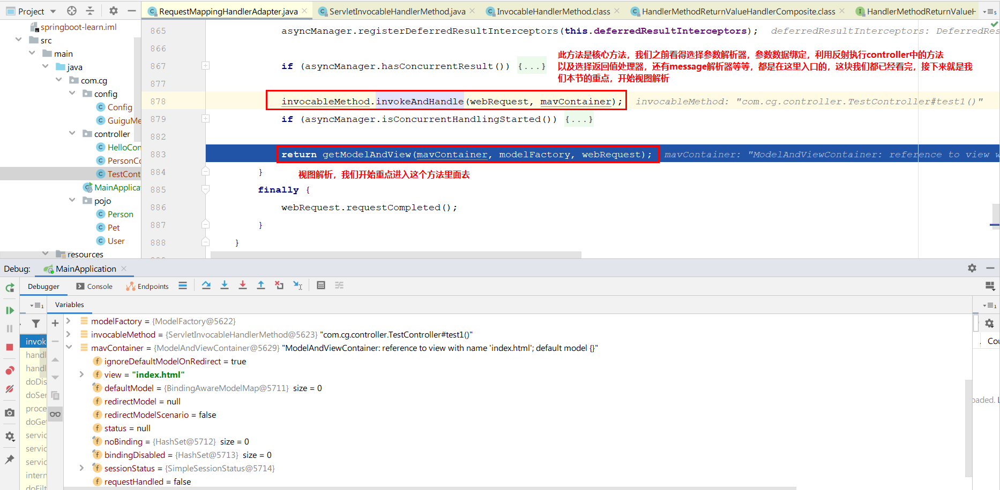

我们发现getModelAndView这个方法的作用是传入一个ModelAndViewContainer，返回出一个ModelAndView，出了这个getModelAndView这个方法，我们会得到一个ModelAndView方法，而至此invokeHandlerMethod方法也基本执行完成，可以理解为**任何目标方法执行完成以后都会返回 ModelAndView（数据和视图地址）。**

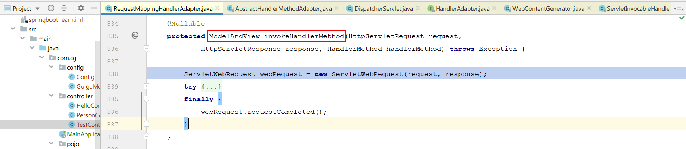

而主流程基本又回到了DispatcherServlet方法里面了，接下来进入**processDispatchResult  处理派发结果（页面改如何响应）**

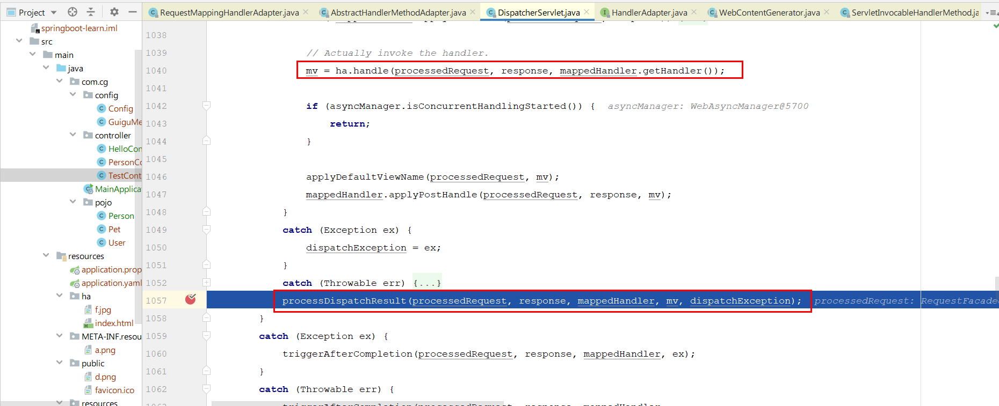

**进入render**(**mv**, request, response); 进行页面渲染逻辑


进入**render方法之后**

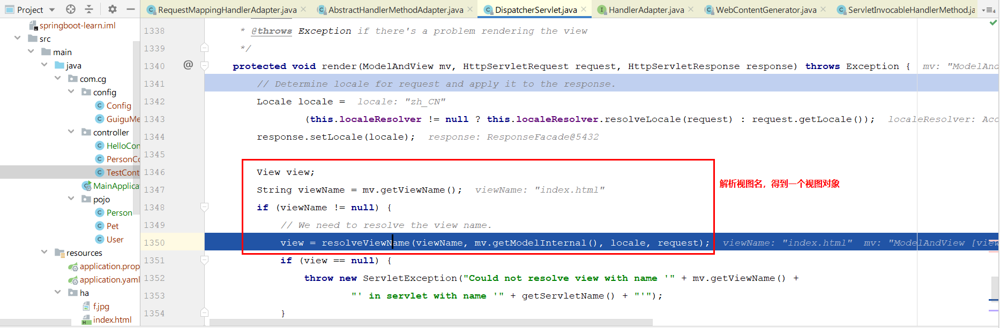

在分析解析视图名之前，我们先来看看这个View对象的结构是什么样的


View是一个接口，然后有一个抽象方法render。接下来我们可以继续接着上面的解析视图名来继续分析


我们又看到这种熟悉的设计模式，类似于参数解析器和返回值处理器一样，我们来看看，在这个测试代码中，我们最终选择的是哪个视图解析器


上图可以看到最终选择的视图解析器和视图是什么，接下来我们开始分析，VIew对象开始调用render方法


接下来就是render方法里面开始渲染。render里面的代码后续继续研究。

**视图解析原理流程**

1. 目标方法处理的过程中，所有数据都会被放在`ModelAndViewContainer`里面。包括数据和视图地址
2. **方法的参数是一个自定义类型对象（从请求参数中确定的），把他重新放在**`**ModelAndViewContainer**`
3. **任何目标方法执行完成以后都会返回**`**ModelAndView**`**（数据和视图地址）。**
4. `**processDispatchResult**`**处理派发结果（页面改如何响应）**
    - `**render**(**mv**, request, response);` 进行页面渲染逻辑
        * 根据方法的`String`返回值得到`**View**`****对象【定义了页面的渲染逻辑】
            1. 所有的视图解析器尝试是否能根据当前返回值得到`**View**`对象
            2. 得到了`**redirect:/main.html** --> Thymeleaf new **RedirectView**()`
            3. `ContentNegotiationViewResolver` 里面包含了下面所有的视图解析器，内部还是利用下面所有视图解析器得到视图对象。
            4. `view.render(mv.getModelInternal(), request, response);`视图对象调用自定义的render进行页面渲染工作
                - `**RedirectView**`** 如何渲染【重定向到一个页面】**
                        1. **获取目标url地址**
                        2. `**response.sendRedirect(encodedURL);**`


**视图解析：**

+ **返回值以**`**forward:**`** 开始：**`**new InternalResourceView(forwardUrl); -->  转发request.getRequestDispatcher(path).forward(request, response); **`
+ **返回值以 **`**redirect:**`**开始：**`**new RedirectView() --> render**`**就是重定向 **
+ **返回值是普通字符串：**`**new ThymeleafView()**`

## 5.2 模板引擎：thymeleaf
略