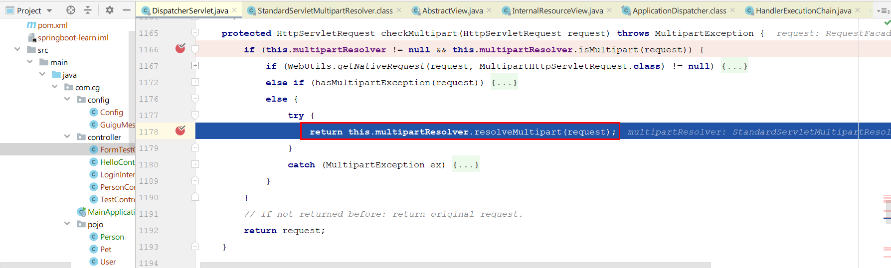
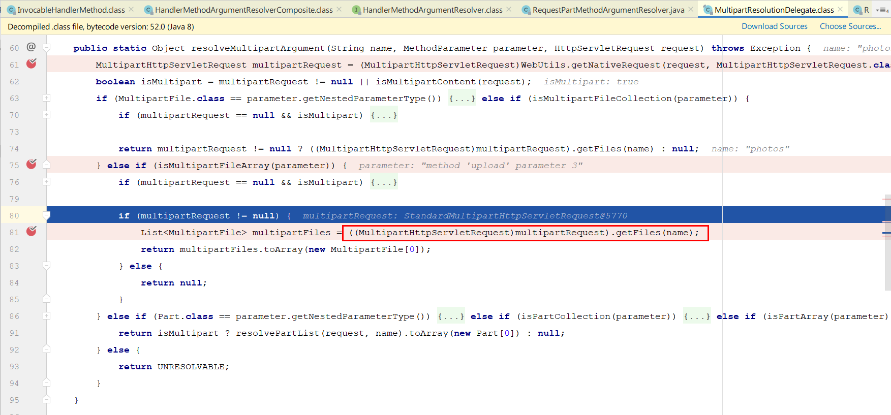
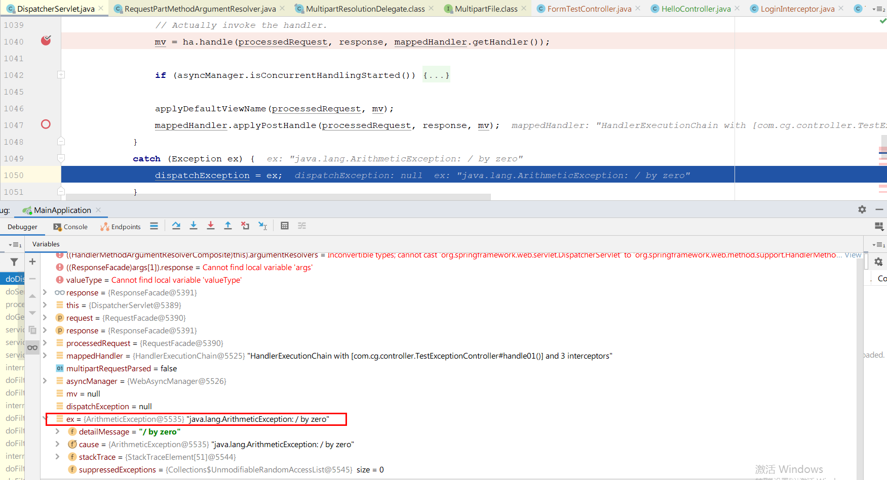

**笔记来源：**[**【尚硅谷】SpringBoot2零基础入门教程（spring boot2干货满满）**](https://www.bilibili.com/video/BV19K4y1L7MT/?spm_id_from=333.337.search-card.all.click&vd_source=e8046ccbdc793e09a75eb61fe8e84a30)

# 1 拦截器
## 1.1 登录检查与静态资源放行


流程：

1. 编写一个拦截器实现`HandlerInterceptor`接口 
2. 拦截器注册到容器中（实现`WebMvcConfigurer`的`addInterceptors()`） 
3. 指定拦截规则【注意，如果是拦截所有，静态资源也会被拦截】 


编写一个实现`HandlerInterceptor`接口的拦截器：

```java
@Slf4j
public class LoginInterceptor implements HandlerInterceptor {

    /**
     * 目标方法执行之前
     */
    @Override
    public boolean preHandle(HttpServletRequest request, HttpServletResponse response, Object handler) throws Exception {

        String requestURI = request.getRequestURI();
        log.info("preHandle拦截的请求路径是{}",requestURI);

        //登录检查逻辑
        HttpSession session = request.getSession();

        Object loginUser = session.getAttribute("loginUser");

        if(loginUser != null){
            //放行
            return true;
        }

        //拦截住。未登录。跳转到登录页
        request.setAttribute("msg","请先登录");
//        re.sendRedirect("/");
        request.getRequestDispatcher("/").forward(request,response);
        return false;
    }

    /**
     * 目标方法执行完成以后
     */
    @Override
    public void postHandle(HttpServletRequest request, HttpServletResponse response, Object handler, ModelAndView modelAndView) throws Exception {
        log.info("postHandle执行{}",modelAndView);
    }

    /**
     * 页面渲染以后
     */
    @Override
    public void afterCompletion(HttpServletRequest request, HttpServletResponse response, Object handler, Exception ex) throws Exception {
        log.info("afterCompletion执行异常{}",ex);
    }
}
```


拦截器注册到容器中 && 指定拦截规则：

```java
@Configuration
public class AdminWebConfig implements WebMvcConfigurer{
    @Override
    public void addInterceptors(InterceptorRegistry registry) {
        registry.addInterceptor(new LoginInterceptor())//拦截器注册到容器中
                .addPathPatterns("/**")  //所有请求都被拦截包括静态资源
                .excludePathPatterns("/","/login","/css/**","/fonts/**","/images/**",
                        "/js/**","/aa/**"); //放行的请求
}
```


## 1.2 拦截器的执行时机和原理
1. 根据当前请求，找到`HandlerExecutionChain`（可以处理请求的handler以及handler的所有拦截器）

   

2. 先来顺序执行所有拦截器的 `preHandle()`方法。 

   

   如果当前拦截器`preHandle()`返回为`true`。则执行下一个拦截器的`preHandle()`

   如果当前拦截器返回为`false`。直接倒序执行所有已经执行了的拦截器的`afterCompletion();`。

   

3. 如果任何一个拦截器返回`false`，直接跳出不执行目标方法。
4. 所有拦截器都返回`true`，才执行目标方法。
5. 倒序执行所有拦截器的`postHandle()`方法。

   

   

6. 前面的步骤有任何异常都会直接倒序触发 `afterCompletion()`。

   

7. 页面成功渲染完成以后，也会倒序触发 `afterCompletion()`。

   


执行流程图


`DispatcherServlet`中涉及到`HandlerInterceptor`的地方：

```java
public class DispatcherServlet extends FrameworkServlet {
    
    ...
    
	protected void doDispatch(HttpServletRequest request, HttpServletResponse response) throws Exception {
		HttpServletRequest processedRequest = request;
		HandlerExecutionChain mappedHandler = null;
		boolean multipartRequestParsed = false;

		WebAsyncManager asyncManager = WebAsyncUtils.getAsyncManager(request);

		try {
			ModelAndView mv = null;
			Exception dispatchException = null;

            	...
            
                //该方法内调用HandlerInterceptor的preHandle()
				if (!mappedHandler.applyPreHandle(processedRequest, response)) {
					return;
				}

				// Actually invoke the handler.
				mv = ha.handle(processedRequest, response, mappedHandler.getHandler());

            	...
                //该方法内调用HandlerInterceptor的postHandle()
				mappedHandler.applyPostHandle(processedRequest, response, mv);
			}			
        	processDispatchResult(processedRequest, response, mappedHandler, mv, dispatchException);
		}
		catch (Exception ex) {
            //该方法内调用HandlerInterceptor接口的afterCompletion方法
			triggerAfterCompletion(processedRequest, response, mappedHandler, ex);
		}
		catch (Throwable err) {
            //该方法内调用HandlerInterceptor接口的afterCompletion方法
			triggerAfterCompletion(processedRequest, response, mappedHandler,
					new NestedServletException("Handler processing failed", err));
		}
		finally {
			...
		}
	}

	private void triggerAfterCompletion(HttpServletRequest request, HttpServletResponse response,
			@Nullable HandlerExecutionChain mappedHandler, Exception ex) throws Exception {

		if (mappedHandler != null) {
            //该方法内调用HandlerInterceptor接口的afterCompletion方法
			mappedHandler.triggerAfterCompletion(request, response, ex);
		}
		throw ex;
	}

	private void processDispatchResult(HttpServletRequest request, HttpServletResponse response,
			@Nullable HandlerExecutionChain mappedHandler, @Nullable ModelAndView mv,
			@Nullable Exception exception) throws Exception {

        ...

		if (mappedHandler != null) {
            //该方法内调用HandlerInterceptor接口的afterCompletion方法
			// Exception (if any) is already handled..
			mappedHandler.triggerAfterCompletion(request, response, null);
		}
	}


}
```


```java
public class HandlerExecutionChain {
    
    ...
    
	boolean applyPreHandle(HttpServletRequest request, HttpServletResponse response) throws Exception {
		for (int i = 0; i < this.interceptorList.size(); i++) {
			HandlerInterceptor interceptor = this.interceptorList.get(i);
            //HandlerInterceptor的preHandle方法
			if (!interceptor.preHandle(request, response, this.handler)) {
                
				triggerAfterCompletion(request, response, null);
				return false;
			}
			this.interceptorIndex = i;
		}
		return true;
	}
    
   	void applyPostHandle(HttpServletRequest request, HttpServletResponse response, @Nullable ModelAndView mv)
			throws Exception {

		for (int i = this.interceptorList.size() - 1; i >= 0; i--) {
			HandlerInterceptor interceptor = this.interceptorList.get(i);
            
            //HandlerInterceptor接口的postHandle方法
			interceptor.postHandle(request, response, this.handler, mv);
		}
	}
    
    void triggerAfterCompletion(HttpServletRequest request, HttpServletResponse response, @Nullable Exception ex) {
		for (int i = this.interceptorIndex; i >= 0; i--) {
			HandlerInterceptor interceptor = this.interceptorList.get(i);
			try {
                //HandlerInterceptor接口的afterCompletion方法
				interceptor.afterCompletion(request, response, this.handler, ex);
			}
			catch (Throwable ex2) {
				logger.error("HandlerInterceptor.afterCompletion threw exception", ex2);
			}
		}
	}
    
    
}
```

# 2 文件上传
## 2.1 单文件与多文件上传的使用


页面代码`/static/form/form_layouts.html`

```html
<form role="form" th:action="@{/upload}" method="post" enctype="multipart/form-data">
    <div class="form-group">
        <label for="exampleInputEmail1">邮箱</label>
        <input type="email" name="email" class="form-control" id="exampleInputEmail1" placeholder="Enter email">
    </div>
    
    <div class="form-group">
        <label for="exampleInputPassword1">名字</label>
        <input type="text" name="username" class="form-control" id="exampleInputPassword1" placeholder="Password">
    </div>
    
    <div class="form-group">
        <label for="exampleInputFile">头像</label>
        <input type="file" name="headerImg" id="exampleInputFile">
    </div>
    
    <div class="form-group">
        <label for="exampleInputFile">生活照</label>
        <input type="file" name="photos" multiple>
    </div>
    
    <div class="checkbox">
        <label>
            <input type="checkbox"> Check me out
        </label>
    </div>
    <button type="submit" class="btn btn-primary">提交</button>
</form>
```


控制层代码

```java
@Slf4j
@Controller
public class FormTestController {

    @GetMapping("/form_layouts")
    public String form_layouts(){
        return "form/form_layouts";
    }

    @PostMapping("/upload")
    public String upload(@RequestParam("email") String email,
                         @RequestParam("username") String username,
                         @RequestPart("headerImg") MultipartFile headerImg,
                         @RequestPart("photos") MultipartFile[] photos) throws IOException {

        log.info("上传的信息：email={}，username={}，headerImg={}，photos={}",
                 email,username,headerImg.getSize(),photos.length);

        if(!headerImg.isEmpty()){
            //保存到文件服务器，OSS服务器
            String originalFilename = headerImg.getOriginalFilename();
            headerImg.transferTo(new File("H:\\cache\\"+originalFilename));
        }

        if(photos.length > 0){
            for (MultipartFile photo : photos) {
                if(!photo.isEmpty()){
                    String originalFilename = photo.getOriginalFilename();
                    photo.transferTo(new File("H:\\cache\\"+originalFilename));
                }
            }
        }

        return "main";
    }
}
```

文件上传相关的配置类：

+ `org.springframework.boot.autoconfigure.web.servlet.MultipartAutoConfiguration`
+ `org.springframework.boot.autoconfigure.web.servlet.MultipartProperties`


文件大小相关配置项：

```properties
spring.servlet.multipart.max-file-size=10MB
spring.servlet.multipart.max-request-size=100MB
```


## 2.2 文件上传原理
**相关流程流程如下：**


这个与html里面配置的相匹配

```html
<form role="form" th:action="@{/upload}" method="post" enctype="multipart/form-data">
</form>
```

上面的确是一个文件上传的请求，所以返回为true，接下来开始进入`resolveMultipart`方法里面去




在这个方法里面，会`new StandardMultipartHttpServletRequest(request, this.resolveLazily)`，这个同时也是一个`HttpServletRequest`，此时`checkMultipart`这个方法走完，开始重新回到`dodispatch`方法里面。


而此时`processedRequest`是我们重新创建的`StandardMultipartHttpServletRequest`，而原生的`request`是`requestFacade`，所以两者并不相等，因此`multipartRequestParsed`由默认的false改为true。

此时就开始进入正常的`getHandler` `getHandlerAdapter` `handle`等方法的调用。

我们重点关注一下，在调用handle方法里面的一些上传参数的即可，其他流程均与普通的请求流程一样。

在参数解析器里面，我们看到这么一个参数解析器


我们来看看这个参数解析器

```java
@Override
public boolean supportsParameter(MethodParameter parameter) {
    if (parameter.hasParameterAnnotation(RequestPart.class)) {
    	return true;
	}
	else {
    	if (parameter.hasParameterAnnotation(RequestParam.class)) {
        	return false;
    	}
    	return MultipartResolutionDelegate.isMultipartArgument(parameter.nestedIfOptional());
	}
}
```

重点看看`resolveArgument`这个方法


`resolveMultipartArgument`方法




最终返回`MultipartFile`的对象集合。

而在`MultipartFile`类的是这样的

```java
public interface MultipartFile extends InputStreamSource {
    String getName();

    @Nullable
    String getOriginalFilename();

    @Nullable
    String getContentType();

    boolean isEmpty();

    long getSize();

    byte[] getBytes() throws IOException;

    InputStream getInputStream() throws IOException;

    default Resource getResource() {
        return new MultipartFileResource(this);
    }

    void transferTo(File var1) throws IOException, IllegalStateException;

    default void transferTo(Path dest) throws IOException, IllegalStateException {
        FileCopyUtils.copy(this.getInputStream(), Files.newOutputStream(dest));
    }
}
```

我们最终调用的是`transferTo`来实现文件的复制。


**相关的重点代码如下：**

文件上传相关的自动配置类`MultipartAutoConfiguration`有创建文件上传参数解析器`StandardServletMultipartResolver`。

```java
@Configuration(proxyBeanMethods = false)
@ConditionalOnClass({ Servlet.class, StandardServletMultipartResolver.class, MultipartConfigElement.class })
@ConditionalOnProperty(prefix = "spring.servlet.multipart", name = "enabled", matchIfMissing = true)
@ConditionalOnWebApplication(type = Type.SERVLET)
@EnableConfigurationProperties(MultipartProperties.class)
public class MultipartAutoConfiguration {

	private final MultipartProperties multipartProperties;

	public MultipartAutoConfiguration(MultipartProperties multipartProperties) {
		this.multipartProperties = multipartProperties;
	}

	@Bean
	@ConditionalOnMissingBean({ MultipartConfigElement.class, CommonsMultipartResolver.class })
	public MultipartConfigElement multipartConfigElement() {
		return this.multipartProperties.createMultipartConfig();
	}

	@Bean(name = DispatcherServlet.MULTIPART_RESOLVER_BEAN_NAME)
	@ConditionalOnMissingBean(MultipartResolver.class)
	public StandardServletMultipartResolver multipartResolver() {
        //配置好文件上传解析器
		StandardServletMultipartResolver multipartResolver = new StandardServletMultipartResolver();
		multipartResolver.setResolveLazily(this.multipartProperties.isResolveLazily());
		return multipartResolver;
	}

}
```


```java
//文件上传解析器
public class StandardServletMultipartResolver implements MultipartResolver {

	private boolean resolveLazily = false;

	public void setResolveLazily(boolean resolveLazily) {
		this.resolveLazily = resolveLazily;
	}


	@Override
	public boolean isMultipart(HttpServletRequest request) {
		return StringUtils.startsWithIgnoreCase(request.getContentType(), "multipart/");
	}

	@Override
	public MultipartHttpServletRequest resolveMultipart(HttpServletRequest request) throws MultipartException {
		return new StandardMultipartHttpServletRequest(request, this.resolveLazily);
	}

	@Override
	public void cleanupMultipart(MultipartHttpServletRequest request) {
		if (!(request instanceof AbstractMultipartHttpServletRequest) ||
				((AbstractMultipartHttpServletRequest) request).isResolved()) {
			// To be on the safe side: explicitly delete the parts,
			// but only actual file parts (for Resin compatibility)
			try {
				for (Part part : request.getParts()) {
					if (request.getFile(part.getName()) != null) {
						part.delete();
					}
				}
			}
			catch (Throwable ex) {
				LogFactory.getLog(getClass()).warn("Failed to perform cleanup of multipart items", ex);
			}
		}
	}

}
```


```java
public class DispatcherServlet extends FrameworkServlet {
    
    @Nullable
	private MultipartResolver multipartResolver;
    
	private void initMultipartResolver(ApplicationContext context) {
		...
        
        //这个就是配置类配置的StandardServletMultipartResolver文件上传解析器
		this.multipartResolver = context.getBean(MULTIPART_RESOLVER_BEAN_NAME, MultipartResolver.class);
		...
	}
    
	protected void doDispatch(HttpServletRequest request, HttpServletResponse response) throws Exception {
		HttpServletRequest processedRequest = request;
		HandlerExecutionChain mappedHandler = null;
		boolean multipartRequestParsed = false;//最后finally的回收flag
		...
		try {
			ModelAndView mv = null;
			Exception dispatchException = null;

			try {
                //做预处理,如果有上传文件 就new StandardMultipartHttpServletRequest包装类
				processedRequest = checkMultipart(request);
				multipartRequestParsed = (processedRequest != request);
				// Determine handler for the current request.
				mappedHandler = getHandler(processedRequest);
				
                ...

				// Determine handler adapter for the current request.
				HandlerAdapter ha = getHandlerAdapter(mappedHandler.getHandler());

				...

				// Actually invoke the handler.
				mv = ha.handle(processedRequest, response, mappedHandler.getHandler());
                
            }
            ....
            
		finally {

            ...
            
            if (multipartRequestParsed) {
                cleanupMultipart(processedRequest);
            }
		}
	}

	protected HttpServletRequest checkMultipart(HttpServletRequest request) throws MultipartException {
		if (this.multipartResolver != null && this.multipartResolver.isMultipart(request)) {
            ...
			return this.multipartResolver.resolveMultipart(request);
            ...
		}
    }

	protected void cleanupMultipart(HttpServletRequest request) {
		if (this.multipartResolver != null) {
			MultipartHttpServletRequest multipartRequest =
					WebUtils.getNativeRequest(request, MultipartHttpServletRequest.class);
			if (multipartRequest != null) {
				this.multipartResolver.cleanupMultipart(multipartRequest);
			}
		}
	}
}
```


`mv = ha.handle(processedRequest, response, mappedHandler.getHandler());`跳到以下的类

```java
public class RequestMappingHandlerAdapter extends AbstractHandlerMethodAdapter
		implements BeanFactoryAware, InitializingBean {
	@Override
	protected ModelAndView handleInternal(HttpServletRequest request,
			HttpServletResponse response, HandlerMethod handlerMethod) throws Exception {
		ModelAndView mav;
		...
		mav = invokeHandlerMethod(request, response, handlerMethod);
        ...
		return mav;
	}
    
    @Nullable
	protected ModelAndView invokeHandlerMethod(HttpServletRequest request,
			HttpServletResponse response, HandlerMethod handlerMethod) throws Exception {

		ServletWebRequest webRequest = new ServletWebRequest(request, response);
		try {
			WebDataBinderFactory binderFactory = getDataBinderFactory(handlerMethod);
			ModelFactory modelFactory = getModelFactory(handlerMethod, binderFactory);

			ServletInvocableHandlerMethod invocableMethod = createInvocableHandlerMethod(handlerMethod);
			if (this.argumentResolvers != null) {//关注点
				invocableMethod.setHandlerMethodArgumentResolvers(this.argumentResolvers);
			}
			...
			invocableMethod.invokeAndHandle(webRequest, mavContainer);
			...

			return getModelAndView(mavContainer, modelFactory, webRequest);
		}
		finally {
			webRequest.requestCompleted();
		}
	}
    
}
```


`this.argumentResolvers`其中主角类`RequestPartMethodArgumentResolver`用来生成

```java
public class ServletInvocableHandlerMethod extends InvocableHandlerMethod {
    
    ...
	public void invokeAndHandle(ServletWebRequest webRequest, ModelAndViewContainer mavContainer,
			Object... providedArgs) throws Exception {
		Object returnValue = invokeForRequest(webRequest, mavContainer, providedArgs);
		...
	}
    
	@Nullable
	public Object invokeForRequest(NativeWebRequest request, @Nullable ModelAndViewContainer mavContainer,
			Object... providedArgs) throws Exception {

		Object[] args = getMethodArgumentValues(request, mavContainer, providedArgs);
		...
		return doInvoke(args);//反射调用
	}
    
	@Nullable
	protected Object doInvoke(Object... args) throws Exception {
		Method method = getBridgedMethod();
		ReflectionUtils.makeAccessible(method);
		return method.invoke(getBean(), args);
		...
	}
    
    //处理得出multipart参数，准备稍后的反射调用（@PostMapping标记的上传方法）
    protected Object[] getMethodArgumentValues(NativeWebRequest request, @Nullable ModelAndViewContainer mavContainer,
			Object... providedArgs) throws Exception {

		MethodParameter[] parameters = getMethodParameters();
		...
		Object[] args = new Object[parameters.length];
		for (int i = 0; i < parameters.length; i++) {
			MethodParameter parameter = parameters[i];
			parameter.initParameterNameDiscovery(this.parameterNameDiscoverer);
			args[i] = findProvidedArgument(parameter, providedArgs);
			if (args[i] != null) {
				continue;
			}
            //关注点1
			if (!this.resolvers.supportsParameter(parameter)) {
				throw new IllegalStateException(formatArgumentError(parameter, "No suitable resolver"));
			}
			try {
                //关注点2
				args[i] = this.resolvers.resolveArgument(parameter, mavContainer, request, this.dataBinderFactory);
			}
			catch (Exception ex) {
				...
			}
		}
		return args;
	}
    
}
```


```java
public class RequestPartMethodArgumentResolver extends AbstractMessageConverterMethodArgumentResolver {

    //对应上面代码关注点1
    @Override
	public boolean supportsParameter(MethodParameter parameter) {
        //标注@RequestPart的参数
		if (parameter.hasParameterAnnotation(RequestPart.class)) {
			return true;
		}
		else {
			if (parameter.hasParameterAnnotation(RequestParam.class)) {
				return false;
			}
			return MultipartResolutionDelegate.isMultipartArgument(parameter.nestedIfOptional());
		}
	}

    //对应上面代码关注点2
	@Override
	@Nullable
	public Object resolveArgument(MethodParameter parameter, @Nullable ModelAndViewContainer mavContainer,
			NativeWebRequest request, @Nullable WebDataBinderFactory binderFactory) throws Exception {

		HttpServletRequest servletRequest = request.getNativeRequest(HttpServletRequest.class);
		Assert.state(servletRequest != null, "No HttpServletRequest");

		RequestPart requestPart = parameter.getParameterAnnotation(RequestPart.class);
		boolean isRequired = ((requestPart == null || requestPart.required()) && !parameter.isOptional());

		String name = getPartName(parameter, requestPart);
		parameter = parameter.nestedIfOptional();
		Object arg = null;

        //封装成MultipartFile类型的对象作参数
		Object mpArg = MultipartResolutionDelegate.resolveMultipartArgument(name, parameter, servletRequest);
		if (mpArg != MultipartResolutionDelegate.UNRESOLVABLE) {
			arg = mpArg;
		}
        
        ...

		return adaptArgumentIfNecessary(arg, parameter);
	}
}
```


```java
public final class MultipartResolutionDelegate {
    ...
    
	@Nullable
	public static Object resolveMultipartArgument(String name, MethodParameter parameter, HttpServletRequest request)
			throws Exception {

		MultipartHttpServletRequest multipartRequest =
				WebUtils.getNativeRequest(request, MultipartHttpServletRequest.class);
		boolean isMultipart = (multipartRequest != null || isMultipartContent(request));

		if (MultipartFile.class == parameter.getNestedParameterType()) {
			if (!isMultipart) {
				return null;
			}
			if (multipartRequest == null) {
				multipartRequest = new StandardMultipartHttpServletRequest(request);
			}
			return multipartRequest.getFile(name);
		}
		else if (isMultipartFileCollection(parameter)) {
			if (!isMultipart) {
				return null;
			}
			if (multipartRequest == null) {
				multipartRequest = new StandardMultipartHttpServletRequest(request);
			}
			List<MultipartFile> files = multipartRequest.getFiles(name);
			return (!files.isEmpty() ? files : null);
		}
		else if (isMultipartFileArray(parameter)) {
			if (!isMultipart) {
				return null;
			}
			if (multipartRequest == null) {
				multipartRequest = new StandardMultipartHttpServletRequest(request);
			}
			List<MultipartFile> files = multipartRequest.getFiles(name);
			return (!files.isEmpty() ? files.toArray(new MultipartFile[0]) : null);
		}
		else if (Part.class == parameter.getNestedParameterType()) {
			if (!isMultipart) {
				return null;
			}
			return request.getPart(name);
		}
		else if (isPartCollection(parameter)) {
			if (!isMultipart) {
				return null;
			}
			List<Part> parts = resolvePartList(request, name);
			return (!parts.isEmpty() ? parts : null);
		}
		else if (isPartArray(parameter)) {
			if (!isMultipart) {
				return null;
			}
			List<Part> parts = resolvePartList(request, name);
			return (!parts.isEmpty() ? parts.toArray(new Part[0]) : null);
		}
		else {
			return UNRESOLVABLE;
		}
	}
    
    ...
    
}
```

# 3 错误处理机制
## 3.1 SpringBoot默认错误处理机制
[Spring Boot官方文档 - Error Handling](https://docs.spring.io/spring-boot/docs/2.4.2/reference/htmlsingle/#boot-features-error-handling)


**默认规则**：

+  默认情况下，Spring Boot提供`/error`处理所有错误的映射 
+  机器客户端，它将生成JSON响应，其中包含错误，HTTP状态和异常消息的详细信息。对于浏览器客户端，响应一个`whitelabel`错误视图，以HTML格式呈现相同的数据 
    - postman下：

      ```json
      {
        "timestamp": "2020-11-22T05:53:28.416+00:00",
        "status": 404,
        "error": "Not Found",
        "message": "No message available",
        "path": "/asadada"
      }
      ```

    - 浏览器下：


      

+  要对其进行自定义，添加`View`解析为`error` 
+  要完全替换默认行为，可以实现 `ErrorController`并注册该类型的Bean定义，或添加`ErrorAttributes类型的组件`以使用现有机制但替换其内容。 
+  `/templates/error/`下的4xx，5xx页面会被自动解析 


## 3.2 定制错误处理逻辑
+ 自定义错误页 
    - `error/404.html``error/5xx.html`有**精确的错误状态码页面就匹配精确，没有就找**`**4xx.html**`**；如果都没有就触发白页**

+ `@ControllerAdvice`+`@ExceptionHandler`处理全局异常；底层是`**ExceptionHandlerExceptionResolver**` 支持的 

    ```java
    @Slf4j
    @ControllerAdvice
    public class GlobalExceptionHandler {

        @ExceptionHandler({ArithmeticException.class,NullPointerException.class})  //处理异常
        public String handleArithException(Exception e){

            log.error("异常是：{}",e);
            return "login"; //视图地址
        }
    }
    ```


+ `@ResponseStatus`+自定义异常 ；底层是`ResponseStatusExceptionResolver`，把`responseStatus`注解的信息底层调用 `response.sendError(statusCode, resolvedReason)`，tomcat发送的`/error`

  ```java
  @ResponseStatus(value= HttpStatus.FORBIDDEN,reason = "用户数量太多")
  public class UserTooManyException extends RuntimeException {

      public  UserTooManyException(){

      }
      public  UserTooManyException(String message){
          super(message);
      }
  }
  ```

  ```java
  @Controller
  public class TableController {
      
  	@GetMapping("/dynamic_table")
      public String dynamic_table(@RequestParam(value="pn",defaultValue = "1") Integer pn,Model model){
          //表格内容的遍历
  	     List<User> users = Arrays.asList(new User("zhangsan", "123456"),
                  new User("lisi", "123444"),
                  new User("haha", "aaaaa"),
                  new User("hehe ", "aaddd"));
          model.addAttribute("users",users);

          if(users.size()>3){
              throw new UserTooManyException();//抛出自定义异常
          }
          return "table/dynamic_table";
      }
      
  }
  ```

+  Spring自家异常如 `org.springframework.web.bind.MissingServletRequestParameterException`，最终是`DefaultHandlerExceptionResolver` 处理Spring自家异常。 
    - `response.sendError(HttpServletResponse.SC_BAD_REQUEST/*400*/, ex.getMessage());`

+  自定义实现`HandlerExceptionResolver`处理异常；可以作为默认的全局异常处理规则 

    ```java
    @Order(value= Ordered.HIGHEST_PRECEDENCE)  //优先级，数字越小优先级越高
    @Component
    public class CustomerHandlerExceptionResolver implements HandlerExceptionResolver {
        @Override
        public ModelAndView resolveException(HttpServletRequest request,
                                             HttpServletResponse response,
                                             Object handler, Exception ex) {

            try {
                response.sendError(511,"我喜欢的错误");
            } catch (IOException e) {
                e.printStackTrace();
            }
            return new ModelAndView();
        }
    }
    ```

+ `ErrorViewResolver`  实现自定义处理异常 
    - `response.sendError()`，error请求就会转给controller。

    - 你的异常没有任何人能处理，tomcat底层调用`response.sendError()`，error请求就会转给controller。

    - `basicErrorController`要去的页面地址是 `ErrorViewResolver`  。

      ```java
      @Controller
      @RequestMapping("${server.error.path:${error.path:/error}}")
      public class BasicErrorController extends AbstractErrorController {

          ...
          
      	@RequestMapping(produces = MediaType.TEXT_HTML_VALUE)
      	public ModelAndView errorHtml(HttpServletRequest request, HttpServletResponse response) {
      		HttpStatus status = getStatus(request);
      		Map<String, Object> model = Collections
      				.unmodifiableMap(getErrorAttributes(request, getErrorAttributeOptions(request, MediaType.TEXT_HTML)));
      		response.setStatus(status.value());
      		ModelAndView modelAndView = resolveErrorView(request, response, status, model);
      		return (modelAndView != null) ? modelAndView : new ModelAndView("error", model);
      	}
          
          protected ModelAndView resolveErrorView(HttpServletRequest request, HttpServletResponse response, HttpStatus status,
      			Map<String, Object> model) {
              //这里用到ErrorViewResolver接口
      		for (ErrorViewResolver resolver : this.errorViewResolvers) {
      			ModelAndView modelAndView = resolver.resolveErrorView(request, status, model);
      			if (modelAndView != null) {
      				return modelAndView;
      			}
      		}
      		return null;
      	}
          
          ...
          
      }
      ```

      ```java
      @FunctionalInterface
      public interface ErrorViewResolver {
      	ModelAndView resolveErrorView(HttpServletRequest request, HttpStatus status, Map<String, Object> model);
      }
      ```

## 3.3 异常处理自动配置原理
`ErrorMvcAutoConfiguration` 自动配置异常处理规则

- **容器中的组件**：类型：`DefaultErrorAttributes` -> id：`errorAttributes`
    * `public class DefaultErrorAttributes implements ErrorAttributes, HandlerExceptionResolver` 
    * `DefaultErrorAttributes`：定义错误页面中可以包含数据（异常明细，堆栈信息等）。
- **容器中的组件**：类型：`BasicErrorController` --> id：`basicErrorController`（json+白页 适配响应）
    * **处理默认 **`/error`路径的请求，页面响应 `new ModelAndView("error", model);` 
    * 容器中有组件 `View`->id是error；（响应默认错误页）
    * 容器中放组件 `BeanNameViewResolver`（视图解析器）；按照返回的视图名作为组件的id去容器中找`View`对象。
- **容器中的组件**：类型：`DefaultErrorViewResolver` -> id：`conventionErrorViewResolver`
    * **如果发生异常错误，会以HTTP的状态码 作为视图页地址（viewName），找到真正的页面**（主要作用）。 
    * error/404、5xx.html
    * 如果想要返回页面，就会找error视图（`StaticView`默认是一个白页）。


## 3.4 异常处理流程
1. 执行目标方法，目标方法运行期间有任何异常都会被catch，而且标志当前请求结束；并且用赋值给**dispatchException **
2. 进入视图解析流程（页面渲染） `processDispatchResult(processedRequest, response, mappedHandler, mv, dispatchException);`
3. **调用**`mv = processHandlerException()`；处理`handler`发生的异常，处理完成返回`ModelAndView`；
    1. 遍历所有的`handlerExceptionResolvers`，看谁能处理当前异常【HandlerExceptionResolver处理器异常解析器】
    2. **系统默认的  异常解析器；**
        1. `DefaultErrorAttributes`**先来处理异常。把异常信息保存到request域，并且返回null；**
        2. `HandlerExceptionResolverComposite`调用它下面的三个异常处理器来处理，发现均不能处理，返回都都是null，所以结合上面`DefaultErrorAttributes`**处理器，最终返回的mav是null；**
    3. **默认没有任何人能处理异常，所以异常会被抛出**
        1. **如果没有任何人能处理最终底层就会发送**`/error`**请求。会被底层的**`BasicErrorController`**处理**
        2. **解析错误视图；遍历所有的**`ErrorViewResolver`**看谁能解析。**
        3. **默认的**`DefaultErrorViewResolver`**,作用是把响应状态码作为错误页的地址，**`error/500.html`
        4. **模板引擎最终响应这个页面**`error/500.html`


譬如写一个会抛出异常的控制层：

```java
@Slf4j
@RestController
public class HelloController {

    @RequestMapping("/hello")
    public String handle01(){

        int i = 1 / 0;//将会抛出ArithmeticException

        log.info("Hello, Spring Boot 2!");
        return "Hello, Spring Boot 2!";
    }
}
```

当浏览器发出`/hello`请求，`DispatcherServlet`的`doDispatch()`的`mv = ha.handle(processedRequest, response, mappedHandler.getHandler());`将会抛出`ArithmeticException`。




进入到`processDispatchResult`里面去


进入到`processHandlerException`里面去，遍历所有的 handlerExceptionResolvers，看谁能处理当前异常【HandlerExceptionResolver处理器异常解析器】

```java
public interface HandlerExceptionResolver {
	@Nullable
	ModelAndView resolveException(
			HttpServletRequest request, HttpServletResponse response, @Nullable Object handler, Exception ex);

}
```

系统默认的  异常解析器；


DefaultErrorAttributes先来处理异常。把异常信息保存到request域，并且返回null；


`HandlerExceptionResolverComposite`来处理异常，此处有一个组合模式，遍历循环它下面的三个异常处理处理器，看哪个能处理


得到的结论是`HandlerExceptionResolverComposite` 下面的三个异常处理器都不能处理，所以返回的`ModelAndView`为null


**如果没有任何人能处理最终底层就会发送 /error 请求。会被底层的BasicErrorController处理**


而此次的调用handle方法里面，走到里面的`doInvoke`方法，则会进入**BasicErrorController的errorHtml方法里面去**


进入到resolveErrorView方法里面去


进入DefaultErrorViewResolver的resolveErrorView方法里面去


**源码相关代码如下：**

```java
public class DispatcherServlet extends FrameworkServlet {
    ...
	protected void doDispatch(HttpServletRequest request, HttpServletResponse response) throws Exception {
		...
				// Actually invoke the handler.
            	//将会抛出ArithmeticException
				mv = ha.handle(processedRequest, response, mappedHandler.getHandler());

				applyDefaultViewName(processedRequest, mv);
				mappedHandler.applyPostHandle(processedRequest, response, mv);
			}
			catch (Exception ex) {
                //将会捕捉ArithmeticException
				dispatchException = ex;
			}
			catch (Throwable err) {
				...
			}
    		//捕捉后，继续运行
			processDispatchResult(processedRequest, response, mappedHandler, mv, dispatchException);
		}
		catch (Exception ex) {
			triggerAfterCompletion(processedRequest, response, mappedHandler, ex);
		}
		catch (Throwable err) {
			triggerAfterCompletion(processedRequest, response, mappedHandler,
					new NestedServletException("Handler processing failed", err));
		}
		finally {
			...
		}
	}

	private void processDispatchResult(HttpServletRequest request, HttpServletResponse response,
			@Nullable HandlerExecutionChain mappedHandler, @Nullable ModelAndView mv,
			@Nullable Exception exception) throws Exception {

		boolean errorView = false;

		if (exception != null) {
			if (exception instanceof ModelAndViewDefiningException) {
				...
			}
			else {
				Object handler = (mappedHandler != null ? mappedHandler.getHandler() : null);
				//ArithmeticException将在这处理
                mv = processHandlerException(request, response, handler, exception);
				errorView = (mv != null);
			}
		}
		...
	}

	protected ModelAndView processHandlerException(HttpServletRequest request, HttpServletResponse response,
			@Nullable Object handler, Exception ex) throws Exception {

		// Success and error responses may use different content types
		request.removeAttribute(HandlerMapping.PRODUCIBLE_MEDIA_TYPES_ATTRIBUTE);

		// Check registered HandlerExceptionResolvers...
		ModelAndView exMv = null;
		if (this.handlerExceptionResolvers != null) {
            //遍历所有的 handlerExceptionResolvers，看谁能处理当前异常HandlerExceptionResolver处理器异常解析器
			for (HandlerExceptionResolver resolver : this.handlerExceptionResolvers) {
				exMv = resolver.resolveException(request, response, handler, ex);
				if (exMv != null) {
					break;
				}
			}
		}
		...
	
        //若只有系统的自带的异常解析器（没有自定义的），异常还是会抛出
		throw ex;
	}

}
```


`DefaultErrorAttributes`先来处理异常，它主要功能把异常信息保存到request域，并且返回null。

```java
public class DefaultErrorAttributes implements ErrorAttributes, HandlerExceptionResolver, Ordered {
    ...
    public ModelAndView resolveException(HttpServletRequest request, HttpServletResponse response, Object handler, Exception ex) {
        this.storeErrorAttributes(request, ex);
        return null;
    }

    private void storeErrorAttributes(HttpServletRequest request, Exception ex) {
        request.setAttribute(ERROR_ATTRIBUTE, ex);//把异常信息保存到request域
    }
    ...
    
}
```


默认没有任何解析器（上图的`HandlerExceptionResolverComposite`）能处理异常，所以最后异常会被抛出。 

最终底层就会转发`/error` 请求。会被底层的`BasicErrorController`处理。 

```java
@Controller
@RequestMapping("${server.error.path:${error.path:/error}}")
public class BasicErrorController extends AbstractErrorController {

    @RequestMapping(produces = MediaType.TEXT_HTML_VALUE)
    public ModelAndView errorHtml(HttpServletRequest request, HttpServletResponse response) {
       HttpStatus status = getStatus(request);
       Map<String, Object> model = Collections
             .unmodifiableMap(getErrorAttributes(request, getErrorAttributeOptions(request, MediaType.TEXT_HTML)));
       response.setStatus(status.value());
       ModelAndView modelAndView = resolveErrorView(request, response, status, model);
       //如果/template/error内没有4**.html或5**.html，
       //modelAndView为空，最终还是返回viewName为error的modelAndView
       return (modelAndView != null) ? modelAndView : new ModelAndView("error", model);
    }
    
    ...
}
```


```java
protected void doDispatch(HttpServletRequest request, HttpServletResponse response) throws Exception {
    
    ...
    
	protected void doDispatch(HttpServletRequest request, HttpServletResponse response) throws Exception {
        ...
     	// Actually invoke the handler.
		mv = ha.handle(processedRequest, response, mappedHandler.getHandler());
		...
        //渲染页面
		processDispatchResult(processedRequest, response, mappedHandler, mv, dispatchException);
        ...
    }
    
    private void processDispatchResult(HttpServletRequest request, HttpServletResponse response,
			@Nullable HandlerExecutionChain mappedHandler, @Nullable ModelAndView mv,
			@Nullable Exception exception) throws Exception {

        boolean errorView = false;
        ...
		// Did the handler return a view to render?
		if (mv != null && !mv.wasCleared()) {
			render(mv, request, response);
			if (errorView) {
				WebUtils.clearErrorRequestAttributes(request);
			}
		}
		...
	}
    
    protected void render(ModelAndView mv, HttpServletRequest request, HttpServletResponse response) throws Exception {
		...

		View view;
		String viewName = mv.getViewName();
		if (viewName != null) {
			// We need to resolve the view name.
            //找出合适error的View，如果/template/error内没有4**.html或5**.html，
            //将会返回默认异常页面ErrorMvcAutoConfiguration.StaticView
            //这里按需深究代码吧！
			view = resolveViewName(viewName, mv.getModelInternal(), locale, request);
			...
		}
		...
		try {
			if (mv.getStatus() != null) {
				response.setStatus(mv.getStatus().value());
			}
            //看下面代码块的StaticView的render块
			view.render(mv.getModelInternal(), request, response);
		}
		catch (Exception ex) {
			...
		}
	}
    
}
```


```java
@Configuration(proxyBeanMethods = false)
@ConditionalOnWebApplication(type = Type.SERVLET)
@ConditionalOnClass({ Servlet.class, DispatcherServlet.class })
// Load before the main WebMvcAutoConfiguration so that the error View is available
@AutoConfigureBefore(WebMvcAutoConfiguration.class)
@EnableConfigurationProperties({ ServerProperties.class, ResourceProperties.class, WebMvcProperties.class })
public class ErrorMvcAutoConfiguration {
    
    ...
        
   	@Configuration(proxyBeanMethods = false)
	@ConditionalOnProperty(prefix = "server.error.whitelabel", name = "enabled", matchIfMissing = true)
	@Conditional(ErrorTemplateMissingCondition.class)
	protected static class WhitelabelErrorViewConfiguration {

        //将创建一个名为error的系统默认异常页面View的Bean
		private final StaticView defaultErrorView = new StaticView();

		@Bean(name = "error")
		@ConditionalOnMissingBean(name = "error")
		public View defaultErrorView() {
			return this.defaultErrorView;
		}

		// If the user adds @EnableWebMvc then the bean name view resolver from
		// WebMvcAutoConfiguration disappears, so add it back in to avoid disappointment.
		@Bean
		@ConditionalOnMissingBean
		public BeanNameViewResolver beanNameViewResolver() {
			BeanNameViewResolver resolver = new BeanNameViewResolver();
			resolver.setOrder(Ordered.LOWEST_PRECEDENCE - 10);
			return resolver;
		}

	}     
   
    
	private static class StaticView implements View {

		private static final MediaType TEXT_HTML_UTF8 = new MediaType("text", "html", StandardCharsets.UTF_8);

		private static final Log logger = LogFactory.getLog(StaticView.class);

		@Override
		public void render(Map<String, ?> model, HttpServletRequest request, HttpServletResponse response)
				throws Exception {
			if (response.isCommitted()) {
				String message = getMessage(model);
				logger.error(message);
				return;
			}
			response.setContentType(TEXT_HTML_UTF8.toString());
			StringBuilder builder = new StringBuilder();
			Object timestamp = model.get("timestamp");
			Object message = model.get("message");
			Object trace = model.get("trace");
			if (response.getContentType() == null) {
				response.setContentType(getContentType());
			}
            //系统默认异常页面html代码
			builder.append("<html><body><h1>Whitelabel Error Page</h1>").append(
					"<p>This application has no explicit mapping for /error, so you are seeing this as a fallback.</p>")
					.append("<div id='created'>").append(timestamp).append("</div>")
					.append("<div>There was an unexpected error (type=").append(htmlEscape(model.get("error")))
					.append(", status=").append(htmlEscape(model.get("status"))).append(").</div>");
			if (message != null) {
				builder.append("<div>").append(htmlEscape(message)).append("</div>");
			}
			if (trace != null) {
				builder.append("<div style='white-space:pre-wrap;'>").append(htmlEscape(trace)).append("</div>");
			}
			builder.append("</body></html>");
			response.getWriter().append(builder.toString());
		}

		private String htmlEscape(Object input) {
			return (input != null) ? HtmlUtils.htmlEscape(input.toString()) : null;
		}

		private String getMessage(Map<String, ?> model) {
			Object path = model.get("path");
			String message = "Cannot render error page for request [" + path + "]";
			if (model.get("message") != null) {
				message += " and exception [" + model.get("message") + "]";
			}
			message += " as the response has already been committed.";
			message += " As a result, the response may have the wrong status code.";
			return message;
		}

		@Override
		public String getContentType() {
			return "text/html";
		}

	}
}
```


# 4 WEB原生组件注入
[官方文档 - Servlets, Filters, and listeners](https://docs.spring.io/spring-boot/docs/2.4.2/reference/htmlsingle/#howto-add-a-servlet-filter-or-listener)


## 4.1 使用Servlet API
```java
@ServletComponentScan(basePackages = "com.atguigu.admin") //指定原生Servlet组件都放在那里，放在启动类上
@WebServlet(urlPatterns = "/my")  //效果：直接响应，没有经过Spring的拦截器？  放在自定义的启动类上
@WebFilter(urlPatterns={"/css/*","/images/*"})  //放在自定义的filter上
@WebListener   //放在自定义的Listener上
```

代码如下：

```java
@WebServlet(urlPatterns = "/my") //servlet3.0之后加入的新功能
public class MyServlet extends HttpServlet {

    @Override
    protected void doGet(HttpServletRequest req, HttpServletResponse resp) throws ServletException, IOException {
        resp.getWriter().write("66666");
    }
}
```


```java
@Slf4j
@WebFilter(urlPatterns={"/css/*","/images/*"}) //my
public class MyFilter implements Filter {
    @Override
    public void init(FilterConfig filterConfig) throws ServletException {
        log.info("MyFilter初始化完成");
    }

    @Override
    public void doFilter(ServletRequest request, ServletResponse response, FilterChain chain) throws IOException, ServletException {
        log.info("MyFilter工作");
        chain.doFilter(request,response);
    }

    @Override
    public void destroy() {
        log.info("MyFilter销毁");
    }
}
```


```java
@Slf4j
@WebListener
public class MyServletContextListener implements ServletContextListener {

    @Override
    public void contextInitialized(ServletContextEvent sce) {
        log.info("MySwervletContextListener监听到项目初始化完成");
    }

    @Override
    public void contextDestroyed(ServletContextEvent sce) {
        log.info("MySwervletContextListener监听到项目销毁");
    }
}
```


最后还要在主启动类添加注解`@ServletComponentScan`

```java
@ServletComponentScan(basePackages = "com.lun")//
@SpringBootApplication(exclude = RedisAutoConfiguration.class)
public class Boot05WebAdminApplication {

    public static void main(String[] args) {
        SpringApplication.run(Boot05WebAdminApplication.class, args);
    }
}
```


## 4.2 使用RegistrationBean
`ServletRegistrationBean`, `FilterRegistrationBean`, and `ServletListenerRegistrationBean`

```java
@Configuration(proxyBeanMethods = true)
public class MyRegistConfig {

    @Bean
    public ServletRegistrationBean myServlet(){
        MyServlet myServlet = new MyServlet();

        return new ServletRegistrationBean(myServlet,"/my","/my02");
    }


    @Bean
    public FilterRegistrationBean myFilter(){

        MyFilter myFilter = new MyFilter();
//        return new FilterRegistrationBean(myFilter,myServlet());
        FilterRegistrationBean filterRegistrationBean = new FilterRegistrationBean(myFilter);
        filterRegistrationBean.setUrlPatterns(Arrays.asList("/my","/css/*"));
        return filterRegistrationBean;
    }

    @Bean
    public ServletListenerRegistrationBean myListener(){
        MySwervletContextListener mySwervletContextListener = new MySwervletContextListener();
        return new ServletListenerRegistrationBean(mySwervletContextListener);
    }
}
```


## 4.3 DispatcherServlet注入原理


`org.springframework.boot.autoconfigure.web.servlet.DispatcherServletAutoConfiguration`配置类

1. 先创建一个Servlet

   

   属性绑定到 WebMvcProperties；对应的配置文件配置项是 **spring.mvc**

   

​	

2. **通过ServletRegistrationBean**<DispatcherServlet> 把 DispatcherServlet  配置进来

   

   

   

具体的代码如下：

```java
@AutoConfigureOrder(Ordered.HIGHEST_PRECEDENCE)
@Configuration(proxyBeanMethods = false)
@ConditionalOnWebApplication(type = Type.SERVLET)
@ConditionalOnClass(DispatcherServlet.class)
@AutoConfigureAfter(ServletWebServerFactoryAutoConfiguration.class)
public class DispatcherServletAutoConfiguration {

	/*
	 * The bean name for a DispatcherServlet that will be mapped to the root URL "/"
	 */
	public static final String DEFAULT_DISPATCHER_SERVLET_BEAN_NAME = "dispatcherServlet";

	/*
	 * The bean name for a ServletRegistrationBean for the DispatcherServlet "/"
	 */
	public static final String DEFAULT_DISPATCHER_SERVLET_REGISTRATION_BEAN_NAME = "dispatcherServletRegistration";

	@Configuration(proxyBeanMethods = false)
	@Conditional(DefaultDispatcherServletCondition.class)
	@ConditionalOnClass(ServletRegistration.class)
	@EnableConfigurationProperties(WebMvcProperties.class)
	protected static class DispatcherServletConfiguration {

        //创建DispatcherServlet类的Bean
		@Bean(name = DEFAULT_DISPATCHER_SERVLET_BEAN_NAME)
		public DispatcherServlet dispatcherServlet(WebMvcProperties webMvcProperties) {
			DispatcherServlet dispatcherServlet = new DispatcherServlet();
			dispatcherServlet.setDispatchOptionsRequest(webMvcProperties.isDispatchOptionsRequest());
			dispatcherServlet.setDispatchTraceRequest(webMvcProperties.isDispatchTraceRequest());
			dispatcherServlet.setThrowExceptionIfNoHandlerFound(webMvcProperties.isThrowExceptionIfNoHandlerFound());
			dispatcherServlet.setPublishEvents(webMvcProperties.isPublishRequestHandledEvents());
			dispatcherServlet.setEnableLoggingRequestDetails(webMvcProperties.isLogRequestDetails());
			return dispatcherServlet;
		}

		@Bean
		@ConditionalOnBean(MultipartResolver.class)
		@ConditionalOnMissingBean(name = DispatcherServlet.MULTIPART_RESOLVER_BEAN_NAME)
		public MultipartResolver multipartResolver(MultipartResolver resolver) {
			// Detect if the user has created a MultipartResolver but named it incorrectly
			return resolver;
		}

	}
    
    @Configuration(proxyBeanMethods = false)
	@Conditional(DispatcherServletRegistrationCondition.class)
	@ConditionalOnClass(ServletRegistration.class)
	@EnableConfigurationProperties(WebMvcProperties.class)
	@Import(DispatcherServletConfiguration.class)
	protected static class DispatcherServletRegistrationConfiguration {

        //注册DispatcherServlet类
		@Bean(name = DEFAULT_DISPATCHER_SERVLET_REGISTRATION_BEAN_NAME)
		@ConditionalOnBean(value = DispatcherServlet.class, name = DEFAULT_DISPATCHER_SERVLET_BEAN_NAME)
		public DispatcherServletRegistrationBean dispatcherServletRegistration(DispatcherServlet dispatcherServlet,
				WebMvcProperties webMvcProperties, ObjectProvider<MultipartConfigElement> multipartConfig) {
			DispatcherServletRegistrationBean registration = new DispatcherServletRegistrationBean(dispatcherServlet,
					webMvcProperties.getServlet().getPath());
			registration.setName(DEFAULT_DISPATCHER_SERVLET_BEAN_NAME);
			registration.setLoadOnStartup(webMvcProperties.getServlet().getLoadOnStartup());
			multipartConfig.ifAvailable(registration::setMultipartConfig);
			return registration;
		}

	}
    
    ...
    
}
```

`DispatcherServlet`默认映射的是 `/` 路径，可以通过在配置文件修改`spring.mvc.servlet.path=/mvc`。


# 5 嵌入式Servlet容器
## 5.1 切换嵌入式Servlet容器
+  默认支持的WebServer 
    - `Tomcat``Jetty``Undertow`。
    - `ServletWebServerApplicationContext`容器启动寻找`ServletWebServerFactory` 并引导创建服务器。
+  原理 
    - SpringBoot应用启动发现当前是Web应用，web场景包-导入tomcat。
    - web应用会创建一个web版的IOC容器 `ServletWebServerApplicationContext` 。
    - `ServletWebServerApplicationContext` 启动的时候寻找 `ServletWebServerFactory` （翻译过来就是Servlet 的web服务器工厂--->Servlet 的web服务器）。
    - SpringBoot底层默认有很多的WebServer工厂（`ServletWebServerFactoryConfiguration`内创建Bean），如： 
        * `TomcatServletWebServerFactory`
        * `JettyServletWebServerFactory`
        * `UndertowServletWebServerFactory`
    - 底层直接会有一个自动配置类`ServletWebServerFactoryAutoConfiguration`。
    - `ServletWebServerFactoryAutoConfiguration`导入了`ServletWebServerFactoryConfiguration`（配置类）。
    - `ServletWebServerFactoryConfiguration`根据动态判断系统中到底导入了那个Web服务器的包。（默认是web-starter导入tomcat包），容器中就有`TomcatServletWebServerFactory`
    - `TomcatServletWebServerFactory`创建出Tomcat服务器并启动；`TomcatWebServer` 的构造器拥有初始化方法`initialize`--->`this.tomcat.start();`
    - 内嵌服务器，与以前手动把启动服务器相比，改成现在使用代码启动（tomcat核心jar包存在）。


Spring Boot默认使用Tomcat服务器，若需更改其他服务器，则修改工程pom.xml：

```xml
<dependency>
    <groupId>org.springframework.boot</groupId>
    spring-boot-starter-web</artifactId>
    <exclusions>
        <exclusion>
            <groupId>org.springframework.boot</groupId>
            spring-boot-starter-tomcat</artifactId>
        </exclusion>
    </exclusions>
</dependency>

<dependency>
    <groupId>org.springframework.boot</groupId>
    spring-boot-starter-jetty</artifactId>
</dependency>
```

[官方文档 - Use Another Web Server](https://docs.spring.io/spring-boot/docs/2.4.2/reference/htmlsingle/#howto-use-another-web-server)


## 5.2 定制修改Servlet容器
定制的三种方式：

+  实现`WebServerFactoryCustomizer<ConfigurableServletWebServerFactory>` 
    - 把配置文件的值和`ServletWebServerFactory`进行绑定
+  修改application.yml配置文件：`server.xxx=x` 
+  直接自定义`ConfigurableServletWebServerFactory` 


`xxxxxCustomizer`：定制化器，可以改变xxxx的默认规则

```java
import org.springframework.boot.web.server.WebServerFactoryCustomizer;
import org.springframework.boot.web.servlet.server.ConfigurableServletWebServerFactory;
import org.springframework.stereotype.Component;

@Component
public class CustomizationBean implements WebServerFactoryCustomizer<ConfigurableServletWebServerFactory> {

    @Override
    public void customize(ConfigurableServletWebServerFactory server) {
        server.setPort(9000);
    }

}
```


# 6 定制化原理
**定制化的常见方式**

+  修改配置文件 
+  `xxxxxCustomizer` 
+  编写自定义的配置类`xxxConfiguration` + `@Bean`替换、增加容器中默认组件；例如：视图解析器 
+  Web应用 编写一个配置类实现`WebMvcConfigurer` 即可定制化web功能 + `@Bean`给容器中再扩展一些组件 

```java
@Configuration
public class AdminWebConfig implements WebMvcConfigurer{
}
```

+ `@EnableWebMvc` + `WebMvcConfigurer` — `@Bean`  可以全面接管SpringMVC，**所有规则全部自己重新配置； 实现定制和扩展功能**（**高级功能，初学者退避三舍**），**慎用**。 
    - 原理： 
        1. `WebMvcAutoConfiguration`默认的SpringMVC的自动配置功能类，如静态资源、欢迎页等。
        2. 一旦使用`@EnableWebMvc`，会`@Import(DelegatingWebMvcConfiguration.class)`。
        3. `DelegatingWebMvcConfiguration`的作用，只保证SpringMVC最基本的使用 
            + 把所有系统中的`WebMvcConfigurer`拿过来，所有功能的定制都是这些`WebMvcConfigurer`合起来一起生效。
            + 自动配置了一些非常底层的组件，如`RequestMappingHandlerMapping`，这些组件依赖的组件都是从容器中获取如。
            + `public class DelegatingWebMvcConfiguration extends WebMvcConfigurationSupport`。
        4. `WebMvcAutoConfiguration`里面的配置要能生效必须`@ConditionalOnMissingBean(WebMvcConfigurationSupport.class)`。
        5. [@EnableWebMvc ](/EnableWebMvc ) 导致了WebMvcAutoConfiguration  没有生效。 


**原理分析套路**

场景`starter`-->`xxxxAutoConfiguration` --> `导入xxx组件` --> 绑定`xxxProperties` --> 绑定配置文件项。


