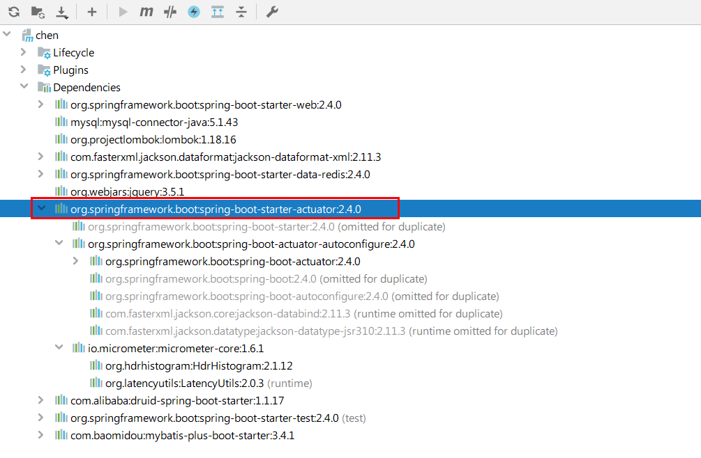
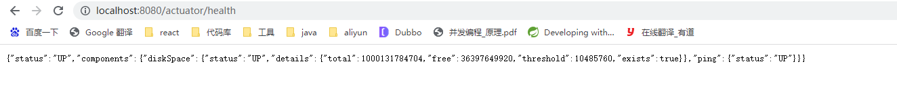
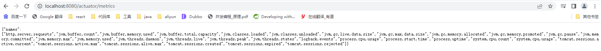
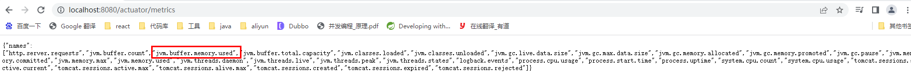
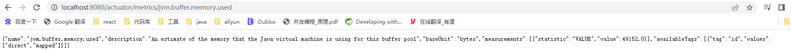

**<font style="color:#DF2A3F;">笔记来源：</font>**[**<font style="color:#DF2A3F;">【尚硅谷】SpringBoot2零基础入门教程（spring boot2干货满满）</font>**](https://www.bilibili.com/video/BV19K4y1L7MT/?spm_id_from=333.337.search-card.all.click&vd_source=e8046ccbdc793e09a75eb61fe8e84a30)

# 1 SpringBoot Actuator
## 1.1 简介
未来每一个微服务在云上部署以后，我们都需要对其进行监控、追踪、审计、控制等。SpringBoot就抽取了Actuator场景，使得我们每个微服务快速引用即可获得生产级别的应用监控、审计等功能。

[官方文档 - Spring Boot Actuator: Production-ready Features](https://docs.spring.io/spring-boot/docs/2.4.2/reference/htmlsingle/#production-ready)

`**1.x**`**与**`**2.x**`**的不同**：

+ `SpringBoot Actuator 1.x` 
    - 支持`SpringMVC`
    - 基于继承方式进行扩展
    - 层级`Metrics`配置
    - 自定义`Metrics`收集
    - 默认较少的安全策略
+ `SpringBoot Actuator 2.x` 
    - 支持`SpringMVC``JAX-RS`以及`Webflux`
    - 注解驱动进行扩展
    - 层级&名称空间`Metrics`
    - 底层使用`MicroMeter`，强大、便捷默认丰富的安全策略

## 1.2 如何使用
+ 添加依赖：

```xml
<dependency>
    <groupId>org.springframework.boot</groupId>
    spring-boot-starter-actuator</artifactId>
</dependency>
```



+ 访问`http://localhost:8080/actuator/`。
+ 暴露所有监控信息为HTTP。

```yaml
management:
  endpoints:
    enabled-by-default: true #暴露所有端点信息
    web:
      exposure:
        include: '*'  #以web方式暴露
```

+ 测试例子 
    - [http://localhost:8080/actuator/beans](http://localhost:8080/actuator/beans)
    - [http://localhost:8080/actuator/configprops](http://localhost:8080/actuator/configprops)
    - [http://localhost:8080/actuator/metrics](http://localhost:8080/actuator/metrics)
    - [http://localhost:8080/actuator/metrics/jvm.gc.pause](http://localhost:8080/actuator/metrics/jvm.gc.pause)
    - [http://localhost:8080/actuator/metrics/endpointName/detailPath](http://localhost:8080/actuator/metrics/endpointName/detailPath)

后面的`beans``metrics`等等都被成为监控端点，也就是endpoint，默认不是全部开启的，在下面会有详细介绍。

# 2 Actuator Endpoint
## 2.1 常使用的端点
| ID | 描述 |
| --- | --- |
| `auditevents` | 暴露当前应用程序的审核事件信息。需要一个`AuditEventRepository组件`。 |
| `beans` | 显示应用程序中所有Spring Bean的完整列表。 |
| `caches` | 暴露可用的缓存。 |
| `conditions` | 显示自动配置的所有条件信息，包括匹配或不匹配的原因。 |
| `configprops` | 显示所有`@ConfigurationProperties`。 |
| `env` | 暴露Spring的属性`ConfigurableEnvironment` |
| `flyway` | 显示已应用的所有Flyway数据库迁移。 需要一个或多个`Flyway`组件。 |
| `health` | 显示应用程序运行状况信息。 |
| `httptrace` | 显示HTTP跟踪信息（默认情况下，最近100个HTTP请求-响应）。需要一个`HttpTraceRepository`组件。 |
| `info` | 显示应用程序信息。 |
| `integrationgraph` | 显示Spring `integrationgraph`。需要依赖`spring-integration-core`。 |
| `loggers` | 显示和修改应用程序中日志的配置。 |
| `liquibase` | 显示已应用的所有Liquibase数据库迁移。需要一个或多个`Liquibase`组件。 |
| `metrics` | 显示当前应用程序的“指标”信息。 |
| `mappings` | 显示所有`@RequestMapping`路径列表。 |
| `scheduledtasks` | 显示应用程序中的计划任务。 |
| `sessions` | 允许从Spring Session支持的会话存储中检索和删除用户会话。需要使用Spring Session的基于Servlet的Web应用程序。 |
| `shutdown` | 使应用程序正常关闭。默认禁用。 |
| `startup` | 显示由`ApplicationStartup`收集的启动步骤数据。需要使用`SpringApplication`进行配置`BufferingApplicationStartup`。 |
| `threaddump` | 执行线程转储。 |


如果您的应用程序是Web应用程序（`Spring MVC``Spring WebFlux`或`Jersey`），则可以使用以下附加端点：

| ID | 描述 |
| --- | --- |
| `heapdump` | 返回`hprof`堆转储文件。 |
| `jolokia` | 通过HTTP暴露JMX bean（需要引入Jolokia，不适用于WebFlux）。需要引入依赖`jolokia-core`。 |
| `logfile` | 返回日志文件的内容（如果已设置`logging.file.name`或`logging.file.path`属性）。支持使用HTTP`Range`标头来检索部分日志文件的内容。 |
| `prometheus` | 以Prometheus服务器可以抓取的格式公开指标。需要依赖`micrometer-registry-prometheus`。 |


其中最常用的Endpoint：

+ `Health`：监控状况
+ `Metrics`：运行时指标
+ `Loggers`：日志记录

## 2.2 Health Endpoint
健康检查端点，我们一般用于在云平台，平台会定时的检查应用的健康状况，我们就需要`Health Endpoint`可以为平台返回当前应用的一系列组件健康状况的集合。

重要的几点：

+ `health endpoint`返回的结果，应该是一系列健康检查后的一个汇总报告。
+ 很多的健康检查默认已经自动配置好了，比如：数据库、redis等。
+ 可以很容易的添加自定义的健康检查机制。

```yaml
management:
  endpoints:
    enabled-by-default: true #暴露所有端点信息
    web:
      exposure:
        include: '*'  #以web方式暴露
  endpoint:
    health:
      show-details: always # 显示health的详细信息
```



## 2.3 Metrics Endpoint
提供详细的、层级的、空间指标信息，这些信息可以被pull（主动推送）或者push（被动获取）方式得到：

+ 通过Metrics对接多种监控系统。
+ 简化核心Metrics开发。
+ 添加自定义Metrics或者扩展已有Metrics。

查看所有的指标



查看具体的某一项指标，在后面路径直接加上具体的指标即可





## 2.4 管理Endpoints
### 2.4.1 开启与禁用Endpoints
+ 默认所有的Endpoint除过shutdown都是开启的。
+ 需要开启或者禁用某个Endpoint。配置模式为`management.endpoint.<endpointName>.enabled = true`

```yaml
management:
  endpoint:
    beans:
      enabled: true
```

+ 或者禁用所有的Endpoint然后手动开启指定的Endpoint。

```yaml
management:
  endpoints:
    enabled-by-default: false
  endpoint:
    beans:
      enabled: true
    health:
      enabled: true
```

### 2.4.2 暴露Endpoints
支持的暴露方式

+ HTTP：默认只暴露health和info。
+ JMX：默认暴露所有Endpoint。
+ 除过health和info，剩下的Endpoint都应该进行保护访问。如果引入Spring Security，则会默认配置安全访问规则。

| ID | JMX | Web |
| :--- | :--- | :--- |
| `auditevents` | Yes | No |
| `beans` | Yes | No |
| `caches` | Yes | No |
| `conditions` | Yes | No |
| `configprops` | Yes | No |
| `env` | Yes | No |
| `flyway` | Yes | No |
| `health` | Yes | Yes |
| `heapdump` | N/A | No |
| `httptrace` | Yes | No |
| `info` | Yes | Yes |
| `integrationgraph` | Yes | No |
| `jolokia` | N/A | No |
| `logfile` | N/A | No |
| `loggers` | Yes | No |
| `liquibase` | Yes | No |
| `metrics` | Yes | No |
| `mappings` | Yes | No |
| `prometheus` | N/A | No |
| `scheduledtasks` | Yes | No |
| `sessions` | Yes | No |
| `shutdown` | Yes | No |
| `startup` | Yes | No |
| `threaddump` | Yes | No |


若要更改公开的Endpoint，请配置以下的包含和排除属性：

| Property | Default |
| :--- | --- |
| `management.endpoints.jmx.exposure.exclude` |  |
| `management.endpoints.jmx.exposure.include` | `*` |
| `management.endpoints.web.exposure.exclude` |  |
| `management.endpoints.web.exposure.include` | `info, health` |


[官方文档 - Exposing Endpoints](https://docs.spring.io/spring-boot/docs/2.4.2/reference/htmlsingle/#production-ready-endpoints-exposing-endpoints)

# 3 定制Endpoint
## 3.1 定制 Health 信息
```yaml
management:
    health:
      enabled: true
      show-details: always #总是显示详细信息。可显示每个模块的状态信息
```

通过实现`HealthIndicator`接口，或继承`MyComHealthIndicator`类。

```java
import org.springframework.boot.actuate.health.Health;
import org.springframework.boot.actuate.health.HealthIndicator;
import org.springframework.stereotype.Component;

@Component
public class MyHealthIndicator implements HealthIndicator {

    @Override
    public Health health() {
        int errorCode = check(); // perform some specific health check
        if (errorCode != 0) {
            return Health.down().withDetail("Error Code", errorCode).build();
        }
        return Health.up().build();
    }

}

/*
构建Health
Health build = Health.down()
                .withDetail("msg", "error service")
                .withDetail("code", "500")
                .withException(new RuntimeException())
                .build();
*/
```


```java
@Component
public class MyComHealthIndicator extends AbstractHealthIndicator {

    /**
     * 真实的检查方法
     * @param builder
     * @throws Exception
     */
    @Override
    protected void doHealthCheck(Health.Builder builder) throws Exception {
        //mongodb。  获取连接进行测试
        Map<String,Object> map = new HashMap<>();
        // 检查完成
        if(1 == 2){
//            builder.up(); //健康
            builder.status(Status.UP);
            map.put("count",1);
            map.put("ms",100);
        }else {
//            builder.down();
            builder.status(Status.OUT_OF_SERVICE);
            map.put("err","连接超时");
            map.put("ms",3000);
        }


        builder.withDetail("code",100)
                .withDetails(map);

    }
}
```

## 3.2 定制info信息
常用两种方式：

+ 编写配置文件

```yaml
info:
  appName: boot-admin
  version: 2.0.1
  mavenProjectName: @project.artifactId@  #使用@@可以获取maven的pom文件值
  mavenProjectVersion: @project.version@
```

+ 编写InfoContributor

```java
import java.util.Collections;

import org.springframework.boot.actuate.info.Info;
import org.springframework.boot.actuate.info.InfoContributor;
import org.springframework.stereotype.Component;

@Component
public class ExampleInfoContributor implements InfoContributor {

    @Override
    public void contribute(Info.Builder builder) {
        builder.withDetail("example",
                Collections.singletonMap("key", "value"));
    }

}
```

[http://localhost:8080/actuator/info](http://localhost:8080/actuator/info) 会输出以上方式返回的所有info信息


## 3.3 定制Metrics信息
[Spring Boot支持的metrics](https://docs.spring.io/spring-boot/docs/2.4.2/reference/htmlsingle/#production-ready-metrics-meter)

增加定制Metrics：

```java
class MyService{
    Counter counter;
    public MyService(MeterRegistry meterRegistry){
         counter = meterRegistry.counter("myservice.method.running.counter");
    }

    public void hello() {
        counter.increment();
    }
}
```


```java
//也可以使用下面的方式
@Bean
MeterBinder queueSize(Queue queue) {
    return (registry) -> Gauge.builder("queueSize", queue::size).register(registry);
}
```

## 3.4 定制Endpoint
```java
@Component
@Endpoint(id = "container")
public class DockerEndpoint {

    @ReadOperation
    public Map getDockerInfo(){
        return Collections.singletonMap("info","docker started...");
    }

    @WriteOperation
    private void restartDocker(){
        System.out.println("docker restarted....");
    }

}
```

场景：

+ 开发`ReadinessEndpoint`来管理程序是否就绪。
+ 开发`LivenessEndpoint`来管理程序是否存活。

# 4 Boot Admin Server
官方Github

[官方文档](https://codecentric.github.io/spring-boot-admin/2.3.1/#getting-started)

可视化指标监控

> What is Spring Boot Admin?
>
> codecentric’s Spring Boot Admin is a community project to manage and monitor your [Spring Boot](http://projects.spring.io/spring-boot/) ® applications. The applications register with our Spring Boot Admin Client (via HTTP) or are discovered using Spring Cloud ® (e.g. Eureka, Consul). The UI is just a Vue.js application on top of the Spring Boot Actuator endpoints.
>

[开始使用方法](https://codecentric.github.io/spring-boot-admin/2.3.1/#getting-started)

