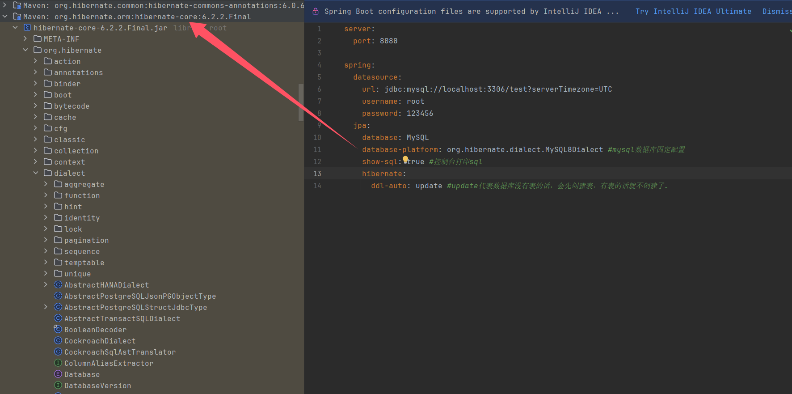

1. 添加pom依赖

   ```xml
   <dependency>
     <groupId>org.springframework.boot</groupId>
     <artifactId>spring-boot-starter-data-jpa</artifactId>
     <version>3.1.0</version>
   </dependency>

   <dependency>
     <groupId>org.springframework.boot</groupId>
     <artifactId>spring-boot-starter-jdbc</artifactId>
     <version>3.1.0</version>
   </dependency>

   <dependency>
     <groupId>org.projectlombok</groupId>
     <artifactId>lombok</artifactId>
     <version>1.18.26</version>
   </dependency>

   <dependency>
     <groupId>mysql</groupId>
     <artifactId>mysql-connector-java</artifactId>
     <version>8.0.29</version>
   </dependency>

   <dependency>
     <groupId>org.projectlombok</groupId>
     <artifactId>lombok</artifactId>
     <version>1.18.26</version>
   </dependency>

   <dependency>
     <groupId>org.springframework.boot</groupId>
     <artifactId>spring-boot-starter-test</artifactId>
     <version>3.1.0</version>
   </dependency>
   ```

   ​


2. 在application.yml里面添加配置

   ```yaml
   server:
     port: 8080

   spring:
     datasource:
       url: jdbc:mysql://localhost:3306/test?serverTimezone=UTC
       username: root
       password: 123456
     jpa:
       database: MySQL
       database-platform: org.hibernate.dialect.MySQL8Dialect #mysql数据库固定配置
       show-sql: true #控制台打印sql
       hibernate:
         ddl-auto: update #update代表数据库没有表的话，会先创建表，有表的话就不创建了。
   ```

   database-platform 的字段设置根据下图的位置寻找，Mysql的版本不一样，设置的值不一样

   

3. dao层接口

   ```java
   public interface IUserDao extends JpaRepository<User,Integer>, JpaSpecificationExecutor<User> {

   }
   ```


4. entity 实体类

   ```java
   package org.example.entity;

   import jakarta.persistence.*;
   import lombok.Data;


   @Entity
   @Table(name = "user")//数据库表明
   @Data
   public class User {

       @Id//声明id为主键
       @GeneratedValue(strategy = GenerationType.IDENTITY)//声明自动增长
       @Column(name = "id")//声明数据库对应的字段
       private Integer id;


       @Column(name = "user_name")//声明数据库对应的字段
       //定义字段也是有讲究的，比如首字母小写，后边的驼峰，对应的数据库字段，遇到驼峰用下划线断开
       //比如实体类定义的userName，则数据库字段为user_name，
       //比如实体类定义的username,则数据库字段也为username
       private String userName;

       @Column(name = "password")
       private String password;

   }
   ```


5. 测试类，用的是 Junit5 来测试

   ```java
   package org.example;

   import jakarta.persistence.criteria.*;
   import org.example.dao.IUserDao;
   import org.example.entity.User;
   import org.junit.jupiter.api.Test;
   import org.springframework.beans.factory.annotation.Autowired;
   import org.springframework.boot.test.context.SpringBootTest;
   import org.springframework.data.domain.Page;
   import org.springframework.data.domain.PageRequest;
   import org.springframework.data.domain.Pageable;
   import org.springframework.data.domain.Sort;
   import org.springframework.data.jpa.domain.Specification;

   import java.util.ArrayList;
   import java.util.List;
   import java.util.Optional;


   @SpringBootTest(classes = Application.class)
   public class TestUser {


       @Autowired
       private IUserDao userDao;


       @Test
       public void testAdd() {
           User user = new User();
           user.setUserName("zhangsan1");
           user.setPassword("12345");
           userDao.save(user);
       }

       /**
        * 批量增加
        */
       @Test
       public void testAddList() {
           List<User> userList = new ArrayList<>();
           for (int i = 0; i < 10; i++) {
               User user = new User();
               user.setUserName("zhangsan_" + i);
               user.setPassword("12345_" + i);
               userList.add(user);
           }
           userDao.saveAll(userList);
       }

       /**
        * 通过主键查找
        */
       @Test
       public void testFindById() {
           Optional<User> optionalUser = userDao.findById(1);
           User user = optionalUser.get();
           System.out.println(user);
       }

       /**
        * 通用查找方法，基本上按照哪个字段查都可以，写起来稍微麻烦一点点。
        * 下边是按照userName="zhangsan"去查，如果不用=换作like，就将下边的criteriaBuilder.equal
        * 换成criteriaBuilder.like。
        */
       @Test
       public void testCommonFind() {
           Specification<User> specification = new Specification<User>() {
               @Override
               public Predicate toPredicate(Root<User> root, CriteriaQuery<?> criteriaQuery, CriteriaBuilder criteriaBuilder) {
                   Path<Object> userName = root.get("userName");
                   Predicate predicate = criteriaBuilder.equal(userName, "zhangsan");
                   return predicate;
               }
           };
           Optional<User> optionalUser = userDao.findOne(specification);
           User user = optionalUser.get();
           System.out.println(user);
       }

       /**
        * 查询所有，如果想通过条件查询，可以根据上边的方式查询。
        */
       @Test
       public void testFindAll() {
           List<User> userList = userDao.findAll();
           for (User item : userList) {
               System.out.println(item);
           }
       }

       @Test
       public void testPage() {
           //排序
           Sort sort = Sort.by(Sort.Direction.DESC, "id");
           //分页
           Pageable pageable = PageRequest.of(0, 2, sort);
           Page<User> page = userDao.findAll(pageable);
           //当前页结果，（0）页
           List<User> userList = page.getContent();
           //按照每页2条数据，一共有的页数
           int totalPages = page.getTotalPages();
           //总共有多少条数据
           long totalElements = page.getTotalElements();
       }

       /**
        * 通用修改方法，先根据主键查找，然后在修改提交
        * 也可以通过sql直接修改.需要在IUserDao接口中定义，这里不再演示。
        */
       @Test
       public void testUpdate() {
           Optional<User> userOptional = userDao.findById(1);
           User user = userOptional.get();
           user.setUserName("张三");
           //主键存在为修改，不存在为新增
           userDao.save(user);
       }

       /**
        * 通过主键删除
        * 也可以通过sql直接删除.需要在IUserDao接口中定义，这里不再演示
        */
       @Test
       public void testDelete() {
           userDao.deleteById(1);
       }

   }
   ```

   ​

