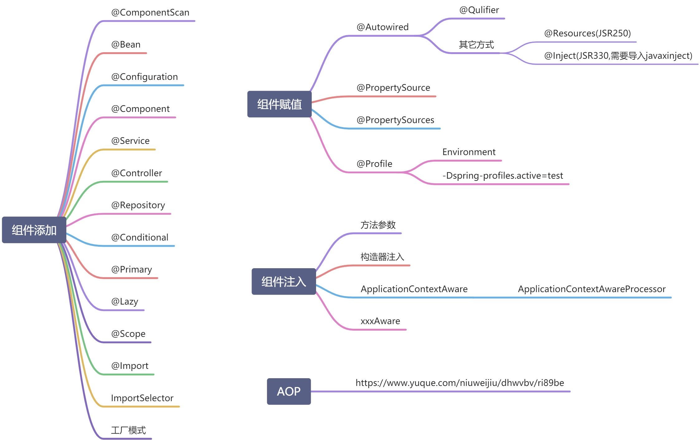
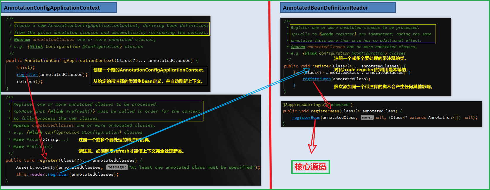
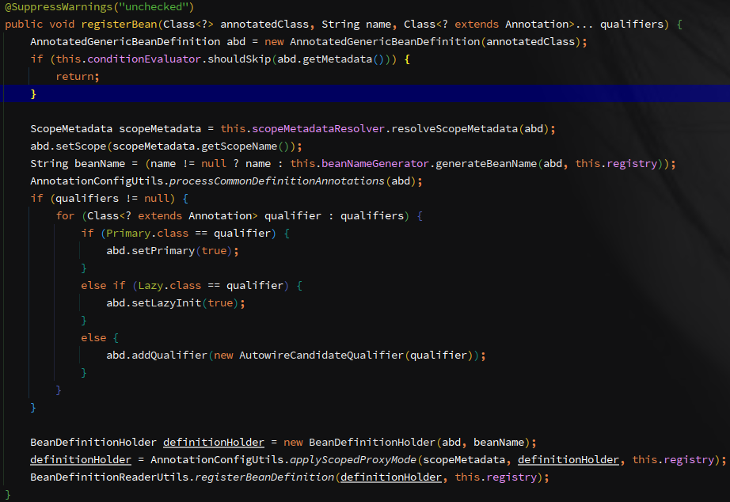
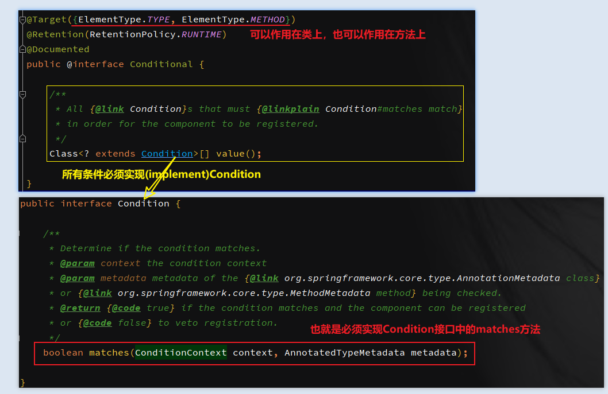
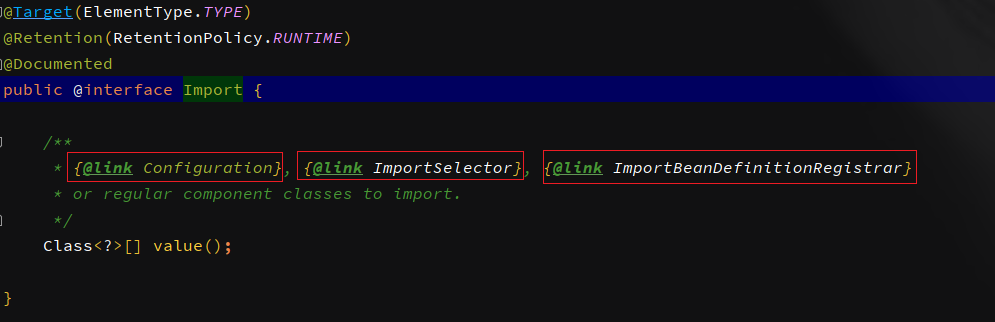
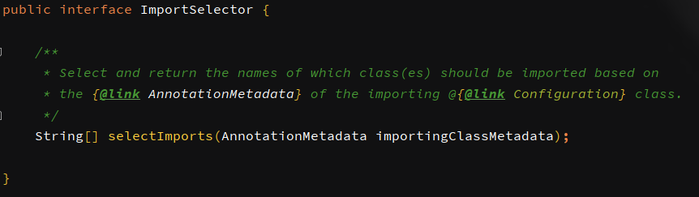
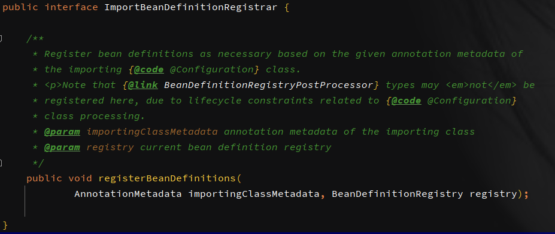

**<font style="color:#F5222D;">笔记来源：</font>**[**<font style="color:#F5222D;">尚硅谷Spring注解驱动教程(雷丰阳源码级讲解)</font>**](https://www.bilibili.com/video/BV1gW411W7wy/?p=2&spm_id_from=pageDriver&vd_source=e8046ccbdc793e09a75eb61fe8e84a30)



# 1 XML方式
1. 在pom文件中加入spring-context依赖

```xml
<dependency>
      <groupId>org.springframework</groupId>
      spring-context</artifactId>
      <version>4.3.12.RELEASE</version>
</dependency>
```

2. 定义一个实体类

```java
@Data
@NoArgsConstructor
@AllArgsConstructor
public class Person {
    private String name;
    private Integer age;
}
```

3. 在beans.xml配置文件中通过<bean></bean>标签注入类实例

```xml
<?xml version="1.0" encoding="UTF-8"?>
<beans xmlns:xsi="http://www.w3.org/2001/XMLSchema-instance"
       xmlns="http://www.springframework.org/schema/beans"
       xmlns:context="http://www.springframework.org/schema/context" 
       xsi:schemaLocation="http://www.springframework.org/schema/beans
     http://www.springframework.org/schema/beans/spring-beans-4.0.xsd
     http://www.springframework.org/schema/context
     http://www.springframework.org/schema/context/spring-context-4.0.xsd ">
    <!-- 注入实例对象 -->
    <bean id="person01" class="com.example.bean.Person">
        <property name="name" value="bob"/>
        <property name="age" value="18"/>
    </bean>
</beans>
```

4. 获取容器中通过配置文件注入的实例对象

```java
public class Main {
    public static void main(String[] args) {
        // 读取通过配置文件，创建ioc容器，并向容器中注入实例对象
        ApplicationContext applicationContext = new ClassPathXmlApplicationContext("beans.xml");
        // 根据bean的id获取容器中注入的实例对象
        Person person = (Person) applicationContext.getBean("person");
        System.out.println(person);
    }
}
```

5. 输出结果

```plain
Person(name=bob, age=18)
```

# 2 @Configuration & @Bean
1. 步骤1不变
2. 步骤2不变
3. 不再配置xml文件，而是新建一个配置类MyConfig.java，在配置类文件中通过注解向容器中注入实例对象。

```java
//======配置类 等价于 配置文件=======
// 告诉Spring这是一个配置类
@Configuration
public class MyConfig {
    //===== 给容器中注册一个Bean，类型为返回值的类型，注入的Bean的id默认是用方法名作为id=====
    @Bean
    public Person person01(){
        return new Person("lisi",20);
    }
    //===== 如果需要自定义id的值，只需在@Bean()的参数部分设置就行。=====
    @Bean(person01)
    public Person person(){
        return new Person("lisi",20);
    }
    
}
```

4. 获取容器中通过配置类注入的实例对象

```java
public class Main {
    public static void main(String[] args) {
        // 读取通过配置类，创建ioc容器，并向容器中注入实例对象
        ApplicationContext annotationConfigApplicationContext = new AnnotationConfigApplicationContext(MyConfig.class);
        Person person1 = (Person) annotationConfigApplicationContext.getBean("person");
        System.out.println(person1);
    }
}
```


创建容器并注入对象原理



**<font style="color:#F5222D;">核心源码：</font>**



# 3 包扫描
## 3.1 XML中配置包扫描
```xml
<?xml version="1.0" encoding="UTF-8"?>
<beans xmlns:xsi="http://www.w3.org/2001/XMLSchema-instance"
       xmlns="http://www.springframework.org/schema/beans"
       xmlns:context="http://www.springframework.org/schema/context" 
       xsi:schemaLocation="http://www.springframework.org/schema/beans
     http://www.springframework.org/schema/beans/spring-beans-4.0.xsd
     http://www.springframework.org/schema/context
     http://www.springframework.org/schema/context/spring-context-4.0.xsd ">

    <!-- 配置包扫描 -->
    <context:component-scan base-package="com.example"/>
    <!-- 注入实例对象 -->
    <bean id="person01" class="com.example.bean.Person">
        <property name="name" value="bob"/>
        <property name="age" value="18"/>
    </bean>
</beans>
```

## 3.2 @ComponentScan
直接在配置类的头上加`@ComponentScan(value = "com.example")`注解，参数部分指定要扫描的包目录

```java
@Configuration
//=== 包扫描注解 ===
@ComponentScan(value = "com.example")
public class MyConfig {
    @Bean
    public Person person(){
        return new Person("lisi",20);
    }
}
```

**<font style="color:#F5222D;">为了查看和验证包扫描的内容，在指定的包扫描目录下，添加controller、service、serviceImpl、dao目录，并分别存放各自的内容。</font>**

controller

```java
@Controller
public class BookController {
}
```

service

```java
public interface BookService {
}
```

serviceImpl

```java
@Service
public class BookServiceImpl implements BookService {
}
```

dao

```java
@Repository
public class BookDao {
}
```

在main函数中，获取当前容器中的所有注入的bean

```java
public class Main {
    public static void main(String[] args) {
        
        // 读取通过注解注入容器中的实例对象
        ApplicationContext annotationConfigApplicationContext = new AnnotationConfigApplicationContext(MyConfig.class);
        // 创建controller、service、dao后查看容器中所有的bean
        String[] beanDefinitionNames = annotationConfigApplicationContext.getBeanDefinitionNames();
        for (String beanDefinitionName : beanDefinitionNames) {
            System.out.println(beanDefinitionName);
        }
    }
}
```

输出结果

```powershell
========= spring启动需要的bean=======
org.springframework.context.annotation.internalConfigurationAnnotationProcessor
org.springframework.context.annotation.internalAutowiredAnnotationProcessor
org.springframework.context.annotation.internalRequiredAnnotationProcessor
org.springframework.context.annotation.internalCommonAnnotationProcessor
org.springframework.context.event.internalEventListenerProcessor
org.springframework.context.event.internalEventListenerFactory
=======用户操作后，注入到容器中的bean=====
myConfig
bookController
bookDao
bookServiceImpl
person
```

### 3.2.1 excludeFilters
通过参数excludeFilters指定排除的bean

```java
@Configuration
//=== 包扫描时，排除掉标有指定注解的类(bean) ===
@ComponentScan(value = "com.example",excludeFilters = {
        @ComponentScan.Filter(type = FilterType.ANNOTATION,classes = {Controller.class, Service.class})
})
public class MyConfig {}
```

**再次查看容器中的Bean**

```powershell
========= spring启动需要的bean=======
org.springframework.context.annotation.internalConfigurationAnnotationProcessor
org.springframework.context.annotation.internalAutowiredAnnotationProcessor
org.springframework.context.annotation.internalRequiredAnnotationProcessor
org.springframework.context.annotation.internalCommonAnnotationProcessor
org.springframework.context.event.internalEventListenerProcessor
org.springframework.context.event.internalEventListenerFactory
=======用户操作后，注入到容器中的bean=====
myConfig
bookDao
person
====== 包扫描的过滤规则生效 ======
```

### 3.2.2 **includeFilters**
通过参数 **includeFilters** 和 **useDefaultFilters = false** (禁用掉默认的扫描规则) 指定要扫描的bean，只有禁用掉默认的扫描规则，**includeFilters 才会生效。**

```java
@ComponentScan(value = "com.example",includeFilters =  {
        @ComponentScan.Filter(type = FilterType.ANNOTATION,classes = {Controller.class})},useDefaultFilters = false)
public class MyConfig {}
```

**再次查看容器中的Bean**

```powershell
========= spring启动需要的bean=======
org.springframework.context.annotation.internalConfigurationAnnotationProcessor
org.springframework.context.annotation.internalAutowiredAnnotationProcessor
org.springframework.context.annotation.internalRequiredAnnotationProcessor
org.springframework.context.annotation.internalCommonAnnotationProcessor
org.springframework.context.event.internalEventListenerProcessor
org.springframework.context.event.internalEventListenerFactory
=======用户操作后，注入到容器中的bean=====
myConfig
bookController
person
====== 包扫描的过滤规则生效 ======
```

### 3.2.3 FilterType
常用的过滤类型：

```java
public enum FilterType {
	//=== 使用给定的注解 ===
	ANNOTATION,
	//=== 使用给定的类型 ===
	ASSIGNABLE_TYPE,
	//=== 使用ASPECTJ表达式 ===
	ASPECTJ,
    //=== 使用正则表达式 ===
	REGEX,
    //=== 使用自定义规则 ===
	CUSTOM

}

```

按实体类型过滤、按注解类型过滤

```java
@ComponentScan(value = "com.example",includeFilters =  {
    	//=== 按注解类型过滤--识别@Controller注解
        @ComponentScan.Filter(type = FilterType.ANNOTATION,classes = {Controller.class}),
    	//=== 按实体类的类型过滤-- 识别BookServiceImpl的类和所有子类
        @ComponentScan.Filter(type=FilterType.ASSIGNABLE_TYPE,classes={BookServiceImpl.class})
},useDefaultFilters = false)
public class MyConfig {}
```

#### 3.2.3.1 自定义过滤规则
按自定义过滤类型的源码提示：

```java
/** Filter candidates using a given custom
 * {@link org.springframework.core.type.filter.TypeFilter} implementation.
 */
CUSTOM
=== 自定义的规则必须是TypeFilter的实现类 ===
```

实现一个自定义的过滤类型，如果自定义的类型返回一个false，即说明没有匹配到任何一个类型，就不会注入任何Bean(组件)。

```java
public class MyTypeFilter implements TypeFilter {
    /**
     *
     * @param metadataReader the metadata reader for the target class
     *                       目标类的元数据阅读器
     * @param metadataReaderFactory a factory for obtaining metadata readers for other classes (such as superclasses and interfaces)
     *                        一个工厂，用于获取其他类（例如超类和接口）的元数据读取器
     * @return boolean
     * @throws IOException
     */
    public boolean match(MetadataReader metadataReader, MetadataReaderFactory metadataReaderFactory) throws IOException {
        return false;
    }
}
```

在配置类上使用自定义的返回值为false的过滤器：

```java
@ComponentScan(value = "com.example",includeFilters =  {
        @ComponentScan.Filter(type = FilterType.CUSTOM,classes = {MyTypeFilter.class})},useDefaultFilters = false)
public class MyConfig {
    @Bean
    public Person person(){
        return new Person("lisi",20);
    }
}
```

会扫描的Bean：

```java
--->com.example.bean.Person
--->com.example.controller.BookController
--->com.example.dao.BookDao
--->com.example.Main
--->com.example.myconfig.MyTypeFilter
--->com.example.service.BookService
--->com.example.service.impl.BookServiceImpl
```

最终注入的Bean

```java
person ---> 这个是通过@Bean注入的
myConfig
```

给自定义的过滤添加过滤逻辑：

```java
public class MyTypeFilter implements TypeFilter {
    /**
     *
     * @param metadataReader the metadata reader for the target class
     *                       目标类的元数据阅读器
     * @param metadataReaderFactory a factory for obtaining metadata readers for other classes (such as superclasses and interfaces)
     *                        一个工厂，用于获取其他类（例如超类和接口）的元数据读取器
     * @return boolean
     * @throws IOException
     */
    public boolean match(MetadataReader metadataReader, MetadataReaderFactory metadataReaderFactory) throws IOException {
        //=== 获取当前正在扫描类的类信息，比如，什么类，实现什么接口
        ClassMetadata classMetadata = metadataReader.getClassMetadata();
        String className = classMetadata.getClassName();
        System.out.println("--->"+className);
        //=== 包含er的组件全部注入到容器中。
        return className.contains("er");
    }
}
```

在配置类中指定使用自定义的过滤规则

```java
@ComponentScan(value = "com.example",includeFilters =  {
        @ComponentScan.Filter(type = FilterType.CUSTOM,classes = {MyTypeFilter.class})},useDefaultFilters = false)
public class MyConfig {
    @Bean
    public Person person(){
        return new Person("lisi",20);
    }
}
```

当前扫描的所有类：

```java
--->com.example.bean.Person
--->com.example.controller.BookController
--->com.example.dao.BookDao
--->com.example.Main
==== 在默认情况下是不会扫描没有注解的类的,自定义的时候就会扫描根目录下的所有包内的类 ====
--->com.example.myconfig.MyTypeFilter 
--->com.example.service.BookService 
=======================================================================================
--->com.example.service.impl.BookServiceImpl
```

最终注入的Bean

```java
myConfig
person
bookController  -- 带er的类
myTypeFilter    -- 带er的类
bookServiceImpl -- 带er的类
```

# 4 @Scope注解
@Scope() 的取值：

+ ConfigurableBeanFactory#SCOPE_PROTOTYPE：prototype多实例
+ ConfigurableBeanFactory#SCOPE_SINGLETON：singleton单实例(默认值)
+  org.springframework.web.context.WebApplicationContext#SCOPE_REQUEST：request同一次请求创建一个实例
+ org.springframework.web.context.WebApplicationContext#SCOPE_SESSION：session同一个session创建一个实例

其实就等同于在xml配置文件中<bean></bean>标签中的scope能取的四个值。

## 4.1 单实例
```java
@Configuration
public class MyConfig {
    @Scope("singleton")
    @Bean
    public Person person(){
        System.out.println("单实例模式下，开始向容器中添加Person组件...");
        return new Person("zhangsan",34);
    }
}
```

```java
@Test
public void test03(){
       	// 通过读取配置类，创建ioc容器，并向容器中注入实例对象
        ApplicationContext annotationConfigApplicationContext = new AnnotationConfigApplicationContext(MyConfig2.class);
        Person person1 = (Person) annotationConfigApplicationContext.getBean("person");
        Person person2 = (Person) annotationConfigApplicationContext.getBean("person");
        System.out.println(person1==person2);
        System.out.println("===========");
        //=== 输出结果为true，也就是说两次获取的组件是一样的。
}
```

**<font style="color:#F5222D;">在单实例状态下，将Person实例添加到容器的时机：</font>**读取配置类创建ioc容器时就调用创建对象的方法创建Person对象，并将创建的对象person放入到容器中，以后每次使用对象都直接从容器中获取(从map中get对象的过程)。

如何验证：只启容器，不获取bean对象

```java
@Test
public void test03(){
       	// 通过读取配置类，创建ioc容器，并向容器中注入实例对象
        ApplicationContext annotationConfigApplicationContext = new AnnotationConfigApplicationContext(MyConfig2.class);
}
```

查看是否打印下面那句输出：

```java
@Bean
public Person person(){
        System.out.println("单实例模式下，开始向容器中添加Person组件...");
        return new Person("zhangsan",34);
}
```

## 4.2 多实例
```java
@Configuration
public class MyConfig {
    @Scope("prototype")
    @Bean
    public Person person(){
        System.out.println("多实例模式下，开始向容器中添加Person组件...");
        return new Person("zhangsan",34);
    }
}
```

```java
@Test
public void test03(){
        // 读取通过注解注入容器中的实例对象
        ApplicationContext annotationConfigApplicationContext = new AnnotationConfigApplicationContext(MyConfig2.class);
        Person person1 = (Person) annotationConfigApplicationContext.getBean("person");
        Person person2 = (Person) annotationConfigApplicationContext.getBean("person");
        System.out.println(person1==person2);
        System.out.println("===========");
        //=== 输出结果为false，也就是说两次获取的对象组件是不一样的。
}
```

**<font style="color:#F5222D;">在多实例状态下，将Person实例添加到容器的时机：</font>**读取配置类创建ioc容器时并不会创建对象，而是在每次获取对象实例的时候才会调用创建对象的方法来创建Person对象，而且，每次获取对象时，都会重新调用一次创建对象的方法，进而使得每次获取的对象不同。

如何验证？

如何验证：只启容器，不获取bean对象

```java
@Test
public void test03(){
       	// 通过读取配置类，创建ioc容器，并向容器中注入实例对象
        ApplicationContext annotationConfigApplicationContext = new AnnotationConfigApplicationContext(MyConfig2.class);
}
```

查看是否打印下面那句输出：结论是没有打印

```java
@Scope("prototype")
@Bean
public Person person(){
        System.out.println("多实例模式下，开始向容器中添加Person组件...");
        return new Person("zhangsan",34);
}
```

只有在获取bean的时候才会打印

```java
@Test
public void test03(){
        // 读取通过注解注入容器中的实例对象
        ApplicationContext annotationConfigApplicationContext = new AnnotationConfigApplicationContext(MyConfig2.class);
        Person person1 = (Person) annotationConfigApplicationContext.getBean("person");
        Person person2 = (Person) annotationConfigApplicationContext.getBean("person");
}
```

## 4.3 懒加载
单实例bean，默认在容器创建启动的时候就会创建对象。但是在懒加载模式下，容器启动的时候不会创建对象，而是在第一次使用(获取)Bean的时候才会创建并初始化。

```java
@Configuration
public class MyConfig {
    @Scope("singleton")
    @Lazy
    @Bean
    public Person person(){
        System.out.println("单实例+懒加载 模式下，开始向容器中添加Person组件...");
        return new Person("zhangsan",34);
    }
}
```

# 5 @Conditional注解
按照一定的条件进行判断，满足条件时才给容器中注册bean



案例：根据不同的操作系统注入不同的组件

补充知识点：根据条件上下文对象获取上下文环境

```java
public class WindowsCondition implements Condition {
    /**
     *
     * @param context 判断条件能使用的上下文(环境)
     * @param metadata 注释信息
     * @return boolean
     */
    public boolean matches(ConditionContext context, AnnotatedTypeMetadata metadata) {
        // 获取到ioc使用的beanFactory(创建对象以及进行装配的工厂)
        ConfigurableListableBeanFactory beanFactory = context.getBeanFactory();
        // 获取类加载器
        ClassLoader classLoader = context.getClassLoader();
        // 获取到bean定义的注册类，所有的bean的定义都在这个里面进行注册
        BeanDefinitionRegistry registry = context.getRegistry();
        // 获取当前环境信息
        Environment environment = context.getEnvironment();
        String osName = environment.getProperty("os.name");
        return osName.contains("Windows");
    }
}
```

自定义判断Linux系统的条件

```java
public class LinuxCondition implements Condition {
    public boolean matches(ConditionContext context, AnnotatedTypeMetadata metadata) {
        // 获取当前环境信息
        Environment environment = context.getEnvironment();
        String osName = environment.getProperty("os.name");
        return osName.contains("Linux");
    }
}
```

自定义判断Windows系统的条件

```java
public class WindowsCondition implements Condition {
    public boolean matches(ConditionContext context, AnnotatedTypeMetadata metadata) {
        // 获取到bean定义的注册类，所有的bean的定义都在这个里面进行注册
        BeanDefinitionRegistry registry = context.getRegistry();
        // 判断容器中是否注册了person组件，同时也可以在否的情况下，给容器中注册person组件
        boolean b = registry.containsBeanDefinition("person");
        // 获取当前环境信息
        Environment environment = context.getEnvironment();
        String osName = environment.getProperty("os.name");
        return osName.contains("Windows")&&b;
    }
}
```

在配置类中使用判断条件

```java
@Configuration
public class MyConfig2 {

    @Bean
    public Person person(){
        return new Person("zhangsan",34);
    }
    
    //=== 是Windows系统才注入 ===
    @Conditional({WindowsCondition.class})
    @Bean("bill")
    public Person person1(){
        return new Person("bill",34);
    }
    
    //=== 是Linux系统才注入 ===
    @Conditional({LinuxCondition.class})
    @Bean("linus")
    public Person person2(){
        return new Person("linus",34);
    }
}
```

测试：

```java
@Test
public void test04(){
    // 读取通过注解注入容器中的实例对象
    ApplicationContext annotationConfigApplicationContext = new AnnotationConfigApplicationContext(MyConfig2.class);
    String[] beanNamesForType = annotationConfigApplicationContext.getBeanNamesForType(Person.class);
    for (String person : beanNamesForType) {
        System.out.println(person);
    }
    Map<String, Person> beans = annotationConfigApplicationContext.getBeansOfType(Person.class);
    System.out.println(beans);
}
```

因为所使用的是Windows系统所以输出结果为：

```java
person
bill
{person=Person(name=zhangsan, age=34), bill=Person(name=bill, age=34)}
```

# 6 @Import系列
给容器中注册组件的方式：

+ 方式一：扫描自己写的类：包扫描+组件标注注解(@Controller/@Service/@Repository/@Component)
+ 方式二：扫描导入的第三方包里边的组件：@Bean
+ 方式三：快速的给容器中导入组件：@Import
+ 方式四：使用FactoryBean

源码：



## 6.1 @Import
通过@Import({要导入的组件1，要导入的组件2}) 导入组件，id默认是全类名。

```java
@Configuration
//=== 
@Import({Color.class, Animal.class})
//===
public class MyConfig2 {

    @Bean
    public Person person(){
        return new Person("zhangsan",34);
    }
    @Conditional({WindowsCondition.class})
    @Bean("bill")
    public Person person1(){
        return new Person("bill",34);
    }
    @Conditional({LinuxCondition.class})
    @Bean("linus")
    public Person person2(){
        return new Person("linus",34);
    }
}
```

输出：

```java
myConfig2
==========================
com.example.bean.Color
com.example.bean.Animal
==========================
person
bill
```

## 6.2 ImportSelector (使用的最多)
返回需要导入组件的全类名的数组



自定义逻辑，返回需要导入的组件，自定义一个类且要实现ImportSelector接口中的selectImports()方法

```java
public class MyImportSelector implements ImportSelector {
    /**
     * 自定义逻辑，返回需要导入的组件
     * @param importingClassMetadata 当前标注了@Import注解的类上的--所有注解信息--
     * @return 返回值就是要导入到容器中组件的全类名
     */
    public String[] selectImports(AnnotationMetadata importingClassMetadata) {
        // 可返回空数组，但不能返回null
        return new String[]{"com.example.bean.Car","com.example.bean.Food"};
    }
}

```

在配置类上使用自定义的导入选择器MyImportSelector

```java
@Configuration
//=== 使用自定义的导入选择器 ===
@Import({Color.class, Animal.class, MyImportSelector.class})
public class MyConfig2 {

    @Bean
    public Person person(){
        return new Person("zhangsan",34);
    }
    @Conditional({WindowsCondition.class})
    @Bean("bill")
    public Person person1(){
        return new Person("bill",34);
    }
    @Conditional({LinuxCondition.class})
    @Bean("linus")
    public Person person2(){
        return new Person("linus",34);
    }
}
```

## 6.3 ImportBeanDefinitionRegistrar
上源码

_    _

自定义一个注册器

```java
public class MyImportBeanDefinitionRegistrar implements ImportBeanDefinitionRegistrar {
    /**
     *
     * @param importingClassMetadata 当前标注了@Import注解的类上的--所有注解信息--
     * @param registry BeanDefinition注册类：把所有需要添加到容器中的bean，
     *                 调用BeanDefinitionRegistry.registerBeanDefinition()手动注册
     */
    public void registerBeanDefinitions(AnnotationMetadata importingClassMetadata, BeanDefinitionRegistry registry) {

        boolean color = registry.containsBeanDefinition("com.example.bean.Color");
        boolean food = registry.containsBeanDefinition("com.example.bean.Food");
        // 判断容器中是否有指定的bean,有的话才会注册Book.class
        if (color&&food){
            // 注册bean时，可以指定bean的名称
            // 指定Bean定义信息：(Bean的类型、作用域等)
            RootBeanDefinition beanDefinition = new RootBeanDefinition(Book.class);
            registry.registerBeanDefinition("MyBook",beanDefinition);
        }
    }
}
```

在配置类上使用自定义的导入选择器MyImportBeanDefinitionRegistrar

```java
@Configuration
//==== 使用自定义的MyImportBeanDefinitionRegistrar ===
@Import({Color.class, Animal.class, MyImportSelector.class, MyImportBeanDefinitionRegistrar.class})
//===================================================
public class MyConfig2 {

    @Bean
    public Person person(){
        return new Person("zhangsan",34);
    }
    @Conditional({WindowsCondition.class})
    @Bean("bill")
    public Person person1(){
        return new Person("bill",34);
    }
    @Conditional({LinuxCondition.class})
    @Bean("linus")
    public Person person2(){
        return new Person("linus",34);
    }
}
```

# 7 FactoryBean
使用Spring提供的FactoryBean(工厂Bean)，区别于普通的bean。

上源码：

```java
package org.springframework.beans.factory;
public interface FactoryBean<T> {
	T getObject() throws Exception;
	Class<?> getObjectType();
	boolean isSingleton();
}
```

自定义一个Color类的FactoryBean

```java
public class ColorFactoryBean implements FactoryBean<Color> {

    /**
     *
     * @return 返回一个Color对象，这个对象会返回到容器中
     * @throws Exception
     */
    public Color getObject() throws Exception {
        return new Color();
    }
    /**
     * 很重要
     * @return 将来通过该FactoryBean注入到容器中的bean，根据bean的id获取到的bean的类型就是该方法返回的类型
     */
    public Class<?> getObjectType() {
        return Color.class;
    }

    /**
     *
     * @return 如果返回值为true， 表示这是一个单实例对象，在容器中只会保存一份。
     *         如果返回值为false，表示这个是一个多实例对象，每次获取都会创建一个新的实例
     */
    public boolean isSingleton() {
        return true;
    }
}
```

将这个Color类的FactoryBean在配置类中注入到容器中

```java
@Configuration
public class MyConfig2 {
    /**
     *
     * @return 将自己创建的Color类的FactoryBean注入到容器中
     */
    @Bean
    public ColorFactoryBean colorFactoryBean(){
        return new ColorFactoryBean();
    }
}

```

结果：

```java
myConfig2
=== 在容器中加的是colorFactoryBean，获取到bean也有colorFactoryBean
colorFactoryBean
```

在容器中加的是colorFactoryBean，获取到bean也有colorFactoryBean，当我们根据colorFactoryBean拿到bean，看一下是什么？

```java
@Test
public void test05(){
    AnnotationConfigApplicationContext annotationConfigApplicationContext = new AnnotationConfigApplicationContext(MyConfig2.class);
    // 工厂Bean获取的是调用getObject创建的对象
    Object colorFactoryBean = annotationConfigApplicationContext.getBean("colorFactoryBean");
    System.out.println("Color类的FactoryBean的类型："+colorFactoryBean.getClass());
    // Color类的FactoryBean的类型：class com.example.bean.Color
}
```

拿到的是com.example.bean.Color。

这就是说，虽然在配置文件中装配的是ColorFactoryBean，但是按照ColorFactoryBean的id：colorFactoryBean从容器中获取到的bean的类型却是调用getObject创建的对象com.example.bean.Color。

**<font style="color:#F5222D;">如果就要获取到ColorFactoryBean呢？加</font>**`**<font style="color:#F5222D;">&</font>**`**<font style="color:#F5222D;">标识</font>**

```java
@Test
public void test05(){
    AnnotationConfigApplicationContext annotationConfigApplicationContext = new AnnotationConfigApplicationContext(MyConfig2.class);
    String[] beans = annotationConfigApplicationContext.getBeanDefinitionNames();
    for (String s : beans) {
        System.out.println(s);
    }
    // 工厂Bean获取的是调用getObject创建的对象
    Object bean1 = annotationConfigApplicationContext.getBean("colorFactoryBean");
    System.out.println("Color类的FactoryBean："+bean1.getClass());

    // 就要从容器中获取对应类的工厂bean
    Object bean2 = annotationConfigApplicationContext.getBean("&colorFactoryBean");
    System.out.println("Color类的FactoryBean："+bean2.getClass());
}
```

输出：

```java
myConfig2
colorFactoryBean
============= 搜嘎 =============
Color类的FactoryBean：class com.example.bean.Color
============= 搜嘎 =============
Color类的FactoryBean：class com.example.bean.ColorFactoryBean
```

**<font style="color:#F5222D;">Spring与其它框架整合时，用的特别多，例如整合Mybaties。</font>**


<font style="color:#FFFFFF;">BeanValidationPostProcessor</font>

