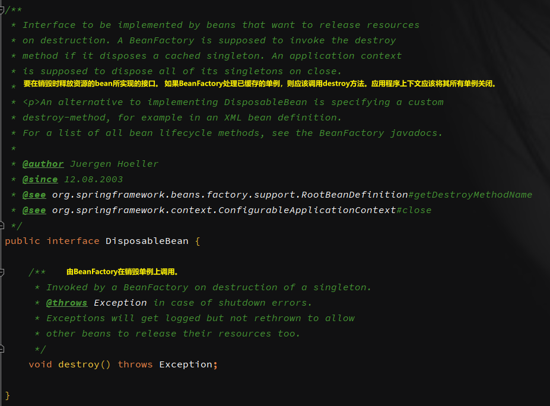

**<font style="color:#F5222D;">笔记来源：</font>**[**<font style="color:#F5222D;">尚硅谷Spring注解驱动教程(雷丰阳源码级讲解)</font>**](https://www.bilibili.com/video/BV1gW411W7wy/?p=2&spm_id_from=pageDriver&vd_source=e8046ccbdc793e09a75eb61fe8e84a30)


Bean的生命周期由容器管理，即管理bean的：创建 -> 初始化 -> 销毁。我们可以自定义初始化和销毁方法，容器在bean进行到当前生命周期的时候来调用我们自定义的初始化和销毁方法。

有以下三种方式可以操作Bean的生命周期

+ 使用 @Bean 的方式
+ 使用Bean实现指定接口的方式
+ 使用JSR250

# 1 使用 @Bean 的方式
使用`@Bean`注解的`initMethod`、`destroyMethod`两个属性配置bean的初始化和销毁方法。

在实体类中创建初始化和销毁方法

```java
public class Car {
    public Car(){
        System.out.println("car contructor ...");
    }

    public void init(){
        System.out.println("Car初始化");
    }
    public void destory(){
        System.out.println("Car销毁");
    }
}
```

在配置文件中，注入bean时指定初始化和销毁方法

```java
@Configuration
@Import({Color.class, Animal.class, MyImportSelector.class, MyImportBeanDefinitionRegistrar.class})
public class MyConfig2 {
    @Bean(initMethod = "init",destroyMethod = "destory")
    public Car car(){
        return new Car();
    }
}
```

测试：

```java
@Test
public void test06(){
    AnnotationConfigApplicationContext annotationConfigApplicationContext = new AnnotationConfigApplicationContext(MyConfig2.class);
    // 关闭容器的时候调用bean的销毁方法
    annotationConfigApplicationContext.close();
}
```

输出：

```java
car contructor ...
Car初始化
Car销毁
```

<font style="color:#000000;">要注意的是，单实例和多实例的初始化和销毁时机。</font>

**<font style="color:#DF2A3F;">构造（创建对象）：</font>**

+ <font style="color:#000000;">单实例：在容器启动的时候创建对象</font>
+ <font style="color:#000000;">多实例：在每次获取的时候创建对象</font>

**<font style="color:#F5222D;">初始化：</font>**<font style="color:#000000;">对象创建完成 ，并赋值好，调用初始化方法</font>

**<font style="color:#F5222D;">销毁：</font>**

+ <font style="color:#000000;">单实例：容器关闭的时候调用销毁方法。</font>
+ <font style="color:#000000;">多实例：容器不会管理整个bean，也就是说容器不会调用销毁方法，需要手动调用。</font>

# 2 使用接口的方式
通过让bean实现 InitialzingBean 接口来定义初始化逻辑，实现 DisposableBean 接口来定义销毁逻辑。

**<font style="color:#F5222D;">InitialzingBean源码</font>**


**<font style="color:#F5222D;">DisposableBean源码</font>**

**<font style="color:#F5222D;">销毁单实例Bean</font>**



自定义一个Build类，并实现InitializingBean和DisposableBean接口

```java
public class Build implements InitializingBean, DisposableBean {

    public Build(){
        System.out.println("Build 构造函数...");
    }

    /**
     * 单实例Bean的销毁方法，在容器关闭的时候进行调用
     * @throws Exception 销毁失败抛异常
     */
    public void destroy() throws Exception {
        System.out.println("Build的销毁方法...");
    }

    /**
     * Bean初始化方法
     * @throws Exception 初始化失败抛异常
     */
    public void afterPropertiesSet() throws Exception {
        System.out.println("Build的初始化方法");
    }
}
```

在配置类中注入Build的bean

```java
@Configuration
public class MyConfig2 {
    @Bean
    public Build build(){
        return new Build();
    }
}
```

测试

```java
@Test
public void test06(){
    AnnotationConfigApplicationContext annotationConfigApplicationContext = new AnnotationConfigApplicationContext(MyConfig2.class);
    // 关闭容器的时候调用bean的销毁方法
    annotationConfigApplicationContext.close();
}
```

输出结果：

```java
Build 构造函数...
Build的初始化方法
Build的销毁方法...
```

# 3 使用 JSR250 规范
@PostConstruct：在bean创建完成并且属性值赋值完成后执行初始化；

@PreDestroy：在容器销毁bean之前，通知容器进行清理工作；


创建一个Dog类，并在初始化和销毁方法上添加对应的注解

```java
public class Dog {
    public Dog(){
        System.out.println("Dog 的构造函数");
    }

    /**
     * 对象创建并赋值后，调用
     */
    @PostConstruct
    public void init(){
        System.out.println("Dog构造之后调用...@PostConstruct");
    }

    /**
     * 对象移除之前，调用
     */
    @PreDestroy
    public void destory(){
        System.out.println("Dog对应的bean移除之前调用...@PreDestroy");
    }
}

```

在配置类中注入Dog对应的bean

```java
@Configuration
public class MyConfig2 {
    @Bean
    public Dog dog(){
        return new Dog();
    }
}
```

测试

```java
@Test
public void test06(){
    AnnotationConfigApplicationContext annotationConfigApplicationContext = new AnnotationConfigApplicationContext(MyConfig2.class);
    // 关闭容器的时候调用bean的销毁方法
    annotationConfigApplicationContext.close();
}
```

结果

```java
Dog 的构造函数
Dog构造之后调用...@PostConstruct
Dog对应的bean移除之前调用...@PreDestroy
```

# 4 通过 BeanPostProcessor 的方式
BeanPostProcessor称为Bean的后置处理器

在bean的**<font style="color:#F5222D;">初始化方法之前</font>**和**<font style="color:#F5222D;">初始化方法之后</font>**进行一些处理工作。注意是初始化方法，和销毁方法没有一毛钱的关系。

**<font style="color:#F5222D;">初始化方法之前:  调用：</font>**postProcessBeforeInitialization()

**<font style="color:#F5222D;">初始化方法之后：调用：</font>**postProcessAfterInitialization()

即使没有自定义初始化方法，在组件创建前后，后置处理器方法也会执行。

```java

package org.springframework.beans.factory.config;

import org.springframework.beans.BeansException;

public interface BeanPostProcessor {
    /**
	==== 初始化之前 ====
   	 * Apply this BeanPostProcessor to the given new bean instance <i>before</i> any bean
	 * initialization callbacks (like InitializingBean's {@code afterPropertiesSet}
	 * or a custom init-method). The bean will already be populated with property values.
	 * The returned bean instance may be a wrapper around the original.
     	在任何bean初始化回调（例如InitializingBean的{@code afterPropertiesSet}或自定义的init-method）之前，
     	将此BeanPostProcessor应用于给定的新bean实例。 该bean将已经用属性值填充。 返回的Bean实例可能是原始实例的包装。
	 */
	Object postProcessBeforeInitialization(Object bean, String beanName) throws BeansException;
    /**
	==== 初始化之后 ====
     * Apply this BeanPostProcessor to the given new bean instance <i>after</i> any bean
	 * initialization callbacks (like InitializingBean's {@code afterPropertiesSet}
	 * or a custom init-method). The bean will already be populated with property values.
	 * The returned bean instance may be a wrapper around the original.
        在任何bean初始化回调（例如InitializingBean的{@code afterPropertiesSet}或自定义的init-method）之后，
        将此BeanPostProcessor应用于给定的新bean实例。 该bean将已经用属性值填充。 返回的Bean实例可能是原始实例的包装。
	 * <p>In case of a FactoryBean, this callback will be invoked for both the FactoryBean
	 * instance and the objects created by the FactoryBean (as of Spring 2.0). The
	 * post-processor can decide whether to apply to either the FactoryBean or created
	 * objects or both through corresponding {@code bean instanceof FactoryBean} checks.
         对于FactoryBean，将为FactoryBean实例和由FactoryBean创建的对象（从Spring 2.0开始）调用此回调。 
         后处理器可以通过相应的{@code bean instanceof FactoryBean}检查来决定是应用到FactoryBean还是创建的对象，还是两者都应用。
	 * <p>This callback will also be invoked after a short-circuiting triggered by a
	 * {@link InstantiationAwareBeanPostProcessor#postProcessBeforeInstantiation} method,
	 * in contrast to all other BeanPostProcessor callbacks.
         与所有其他BeanPostProcessor回调相反，此回调还将在{@link InstantiationAwareBeanPostProcessor＃postProcessBeforeInstantiation}方法触发短路后被调用。
	 */
	Object postProcessAfterInitialization(Object bean, String beanName) throws BeansException;

}

```

自定义

```java
public class MyBeanPostProcessor implements BeanPostProcessor {

    public Object postProcessBeforeInitialization(Object bean, String beanName) throws BeansException {
        System.out.println("postProcessBeforeInitialization"+"--"+beanName+"--"+bean);
        return bean;
    }

    public Object postProcessAfterInitialization(Object bean, String beanName) throws BeansException {
        System.out.println("postProcessAfterInitialization"+"--"+beanName+"--"+bean);
        return bean;
    }
}

```

在配置类文件中注入该bean

```java
@Configuration
public class MyConfig2 {
	@Bean
    public MyBeanPostProcessor myBeanPostProcessor(){
        return new MyBeanPostProcessor();
    }
}
```

测试

```java
@Test
public void test06(){
    AnnotationConfigApplicationContext annotationConfigApplicationContext = new AnnotationConfigApplicationContext(MyConfig2.class);
    // 关闭容器的时候调用bean的销毁方法
    annotationConfigApplicationContext.close();
}
```

结果：不同的生命周期方式


```java
======================================================================
postProcessBeforeInitialization--person--Person(name=zhangsan, age=34)
postProcessAfterInitialization--person--Person(name=zhangsan, age=34)
======================================================================
```


```java
===================================================================
Build的构造函数...
postProcessBeforeInitialization--build--com.example.bean.Build@327b636c
Build的初始化方法
postProcessAfterInitialization--build--com.example.bean.Build@327b636c
Build的销毁方法...
===================================================================
```


```java
===================================================================
car的构造函数 ...
postProcessBeforeInitialization--car--com.example.bean.Car@7c417213
Car的初始化方法
postProcessAfterInitialization--car--com.example.bean.Car@7c417213
Car的销毁方法
===================================================================
```


```java
===================================================================
Dog 的构造函数
postProcessBeforeInitialization--dog--com.example.bean.Dog@19d37183
Dog的初始化方法...@PostConstruct
postProcessAfterInitialization--dog--com.example.bean.Dog@19d37183
Dog的销毁方法...@PreDestroy
===================================================================
```

## 4.1 BeanPostProcessor工作原理


执行过程：

`AbstractAutowireCapableBeanFactory.doCreateBean`中调用`popolulateBean`为bean填充属性，然后调用`initializeBean`开始进行bean的初始化以及bean初始化的前后处理。

`AbstractAutowireCapableBeanFactory.doCreateBean`调用`initializeBean`方法：

该方法会先调用`applyBeanPostProcessorsBeforeInitialization(warppedBean, beanName)`；初始化前前置处理

然后调用`invokeInitMethods`对bean进行初始化

最后调用`applyBeanPostProcessorsAfterInitialization`，初始化后置处理。

如图：


`applyBeanPostProcessorsBeforeInitialization`会遍历所有的BeanPostProcessor，执行每个BeanPostProcessor的`postProcessBeforeInitialization`方法，如果某个`BeanPostProcessor::postProcessBeforeInitialization`返回null，则直接退出循环，不再执行后面的BeanPostProcessor。

如图：


## 4.2 BeanPostProcessor的应用


案例1：在实体类中获取ioc容器


这个功能是如何实现的呢？


案例2：对象创建完，给数据赋值以后，做数据校验的工具。

BeanValidationPostProcessor


后来的@Autowired注解


总结：bean赋值、注入其它注解、@Autowired、生命周期注解功能、@Async底层都是BeanPostProcessor来完成的。

