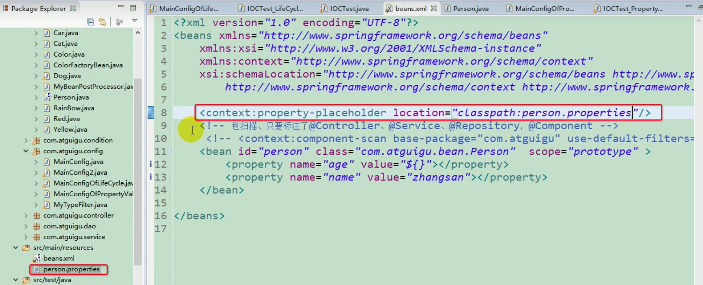

**<font style="color:#F5222D;">笔记来源：</font>**[**<font style="color:#F5222D;">尚硅谷Spring注解驱动教程(雷丰阳源码级讲解)</font>**](https://www.bilibili.com/video/BV1gW411W7wy/?p=2&spm_id_from=pageDriver&vd_source=e8046ccbdc793e09a75eb61fe8e84a30)

# 1 @Value
使用@Value赋值

1. 基本数值
2. 可以些SPEL：`#{}`
3. 以写`${}`，取出配置文件中的值（即在运行环境变量中的值），通过 @PropertySource 注解将properties配置文件中的值存储到 Spring的 Environment中，Environment接口提供方法去读取配置文件中的值，参数是properties文件中定义的key值。

Person类

```java
@Data
@NoArgsConstructor
@AllArgsConstructor
public class Person {
    @Value("张三")
    private String name;
    @Value("#{20-2}")
    private Integer age;
    @Value("${person.nickName}")
    private String nickName;
}
```

person.properties

```yaml
person
	nickName="zhangzhang"
```

使用PropertySources读取外部配置文件中的属性k/v保存到运行的环境变量中

```java
@PropertySources(@PropertySource(value = {"classpath:/person.properties"}))
@Configuration
public class MyConfigOfPropertyValues {
    @Bean
    public Person person(){
        return new Person();
    }
}
```

如果是之前的XML方式，则是这样的



测试

```java
@Test
public void test07(){
    AnnotationConfigApplicationContext annotationConfigApplicationContext = new AnnotationConfigApplicationContext(MyConfigOfPropertyValues.class);
    Person person2 = (Person) annotationConfigApplicationContext.getBean("person");
    System.out.println(person2);
    //==== Person(name=张三, age=18, nickName="zhangzhang")====
}
```

从环境变量中获取也是可以的

```java
@Test
public void test07(){
    AnnotationConfigApplicationContext annotationConfigApplicationContext = new AnnotationConfigApplicationContext(MyConfigOfPropertyValues.class);
    ConfigurableEnvironment environment = annotationConfigApplicationContext.getEnvironment();
    String property = environment.getProperty("person.nickName");
    System.out.println(property);
    //=== "zhangzhang" ===
}
```

