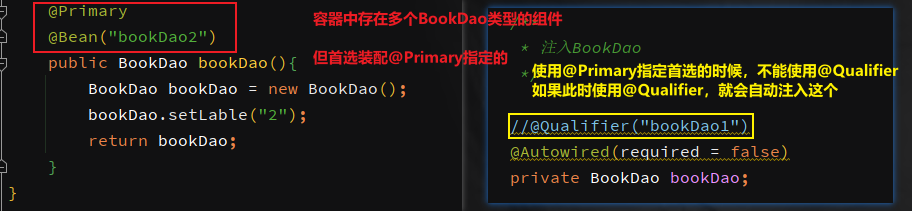

**<font style="color:#F5222D;">笔记来源：</font>**[**<font style="color:#F5222D;">尚硅谷Spring注解驱动教程(雷丰阳源码级讲解)</font>**](https://www.bilibili.com/video/BV1gW411W7wy/?p=2&spm_id_from=pageDriver&vd_source=e8046ccbdc793e09a75eb61fe8e84a30)

# 1 @Autowired


测试：

```java
@Test
public void test01(){
    AnnotationConfigApplicationContext applicationContext =
    new AnnotationConfigApplicationContext(MainConfigOfAutowired.class);
    BookServiceImpl bean = applicationContext.getBean(BookServiceImpl.class);
    System.out.println(bean.toString());
}
```


## 1.1 @Autowired和@Qualifier配合


自动装配的前提，默认一定要将容器的组件赋好值。否则没有就会报错。

是否可以根据容器中组件的有无来判断是否进行装配呢？


## 1.2 @Primary
让spring进行自动装配的时候，默认使用首选的bean。



结论：

1. 默认优先按照类型去容器中找对应的组件：`applicationContext.getBean(BookServiceImpl.class);`
2. 如果找到多个相同类型的组件，将会按照属性的名称作为组件的id去容器中查找：`applicationContext.getBean("bookDao")`。
3. @Qualifier("bookDao")：使用@Qualifier指定需要装配的组件id，而不是使用属性名
4. 自动装配的前提，默认一定要将容器的组件赋好值。否则没有就会报错。可以使用`@Autowired(required=false)`
5. @Primary，让spring进行自动装配的时候，默认使用首选的bean。如果@Qualifier指定了，则默认首选的即@Primary就不起效果了。

## 1.3 @Autowired标注在方法上


还有一种方式：@Bean + 方法参数；方法参数从容器中获取。默认不写@Autowired效果是一样的


这个@Autowired默认也是可以省略的


## 1.4 @Autowired标注在构造器上
**<font style="color:#DF2A3F;">如果组件只有一个参数构造器，这个有参构造器的@Autowired可以省略，参数位置的组件还是可以自动从容器中获取</font>**。


## 1.5 @Autowired标注在参数位置


@Autowired能完成自动装配都是因为这个后置处理器：


# 2 @Resource & @Inject
@Resource属于JSR250规范，@Inject属于JSR330规范。都是java规范。

****

**@Resource**

和@Autowired一样实现自动装配功能，默认是按照组件名称进行装配，也可以指定要装配组件的名称。但其不支持 @Primary 和 @Autowired(required=false) 的功能。


****

**@Inject**

需要导入javax.inject的包

```xml
<dependency>
    <groupId>javax.inject</groupId>
    javax.inject</artifactId>
    <version>1</version>
</dependency>
```


和@Autowired功能一样，但是没有`@Autowired(required=false)`功能

推荐使用spring自带的。

# 3 Aware接口
例如：自定义组件想要使用AplicationContext、Beanfactory、......；需要自定义组件实现xxxAware接口，在创建对象的时候，会调用接口的方法注入相关组件。


xxxAware的功能都是由xxxProcessor后置处理器实现的。例如：ApplicationContextAware -> ApplicationContextAwareProcessor 

# 4 @Profile
Profile: 指定组件在哪个环境中的情况下才能被注册到容器中，不指定任何环境下都能指定。  
加了环境标识的bean，只有对应的环境被激活了，才会注册到容器中。但是如果标了default，则会默认加载这个。  
Spring为我们提供的可以根据当前环境，动态的激活和切换一系列bean组件的功能  
我们有开发环境、测试环境、生成环境  
对应的数据源有：(/A)(/B)(/C)  
利用注解：@Profile


@Profile也可以写在类上，表明只有在指定的环境下，类中的内容才会被激活使用。

案例：先加入数据库连接池依赖

```xml
<dependency>
    <groupId>com.mchange</groupId>
    c3p0</artifactId>
    <version>0.9.5.2</version>
</dependency>
<dependency>
    <groupId>mysql</groupId>
    mysql-connector-java</artifactId>
    <version>8.0.22</version>
</dependency>
```

配置一个数据库链接的配置文件

```xml
db.user=root
db.password=root
db.driverClass=com.mysql.jdbc.Driver
```

在配置类中配置不同环境使用的数据源

```java
@PropertySource("classpath:/dbconfig.properties")
@Configuration
public class MainConfigOfProfile implements EmbeddedValueResolverAware {

    @Value("${db.user}")
    private String user;

    private StringValueResolver valueResolver;

    private String driverClass;

    @Profile("test")
    @Bean("testDatasource")
    public DataSource dataSourceTest(@Value("${db.password}") String password) throws Exception{
        ComboPooledDataSource dataSource = new ComboPooledDataSource();
        dataSource.setUser(user);
        dataSource.setPassword(password);
        dataSource.setJdbcUrl("jdbc:mysql://localhost:3306/test");

        // 利用值解析器
        dataSource.setDriverClass(driverClass);
        return dataSource;
    }
    @Profile("dev")
    @Bean("devDatasource")
    public DataSource dataSourceDev() throws Exception{
        ComboPooledDataSource dataSource = new ComboPooledDataSource();
        dataSource.setUser(user);
        dataSource.setPassword("root");
        dataSource.setJdbcUrl("jdbc:mysql://localhost:3306/dev");
        dataSource.setDriverClass("com.mysql.jdbc.Driver");
        return dataSource;
    }
    @Profile("prod")
    @Bean("prodDatasource")
    public DataSource dataSourceProd() throws Exception{
        ComboPooledDataSource dataSource = new ComboPooledDataSource();
        dataSource.setUser("root");
        dataSource.setPassword("root");
        dataSource.setJdbcUrl("jdbc:mysql://localhost:3306/prod");
        dataSource.setDriverClass("com.mysql.jdbc.Driver");
        return dataSource;
    }
    @Profile("default")
    @Bean("prodDatasource")
    public DataSource dataSourceDefault() throws Exception{
        ComboPooledDataSource dataSource = new ComboPooledDataSource();
        dataSource.setUser("root");
        dataSource.setPassword("root");
        dataSource.setJdbcUrl("jdbc:mysql://localhost:3306/prod");
        dataSource.setDriverClass("com.mysql.jdbc.Driver");
        return dataSource;
    }

    public void setEmbeddedValueResolver(StringValueResolver resolver) {
        // 利用值解析器，解析字符串
        this.valueResolver = resolver;
        this.driverClass = valueResolver.resolveStringValue("${db.driverClass}");
    }
}

```

如何切换环境呢？

切换环境的方式：

1. 使用命令行动态参数：在虚拟机参数位置加载`-Dspring.profiles.active=test`(test是测试的环境标识)
2. 代码的方式激活某种环境

```java
@Test
public void test01(){
    // 1、创建一个applicationContext
    AnnotationConfigApplicationContext applicationContext =
        new AnnotationConfigApplicationContext();
    // 2、设置需要激活的环境,可以设置多个
    applicationContext.getEnvironment().setActiveProfiles("test","dev");
    // 3、注册配置类
    applicationContext.register(MainConfigOfProfile.class);
    // 4、启动刷新容器
    applicationContext.refresh();

    String[] beanNamesForType = applicationContext.getBeanNamesForType(DataSource.class);
    for (String s : beanNamesForType) {
        System.out.println(s);
    }
    applicationContext.close();
}
```


<font style="color:#FFFFFF;">BeanValidationPostProcessor</font>

<font style="color:#FFFFFF;">BeanValidationPostProcessor</font>

