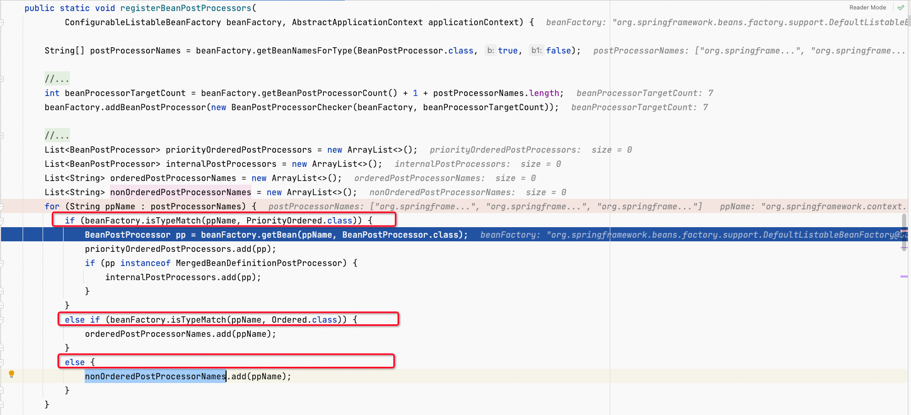
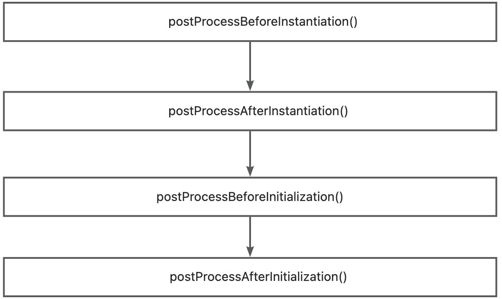
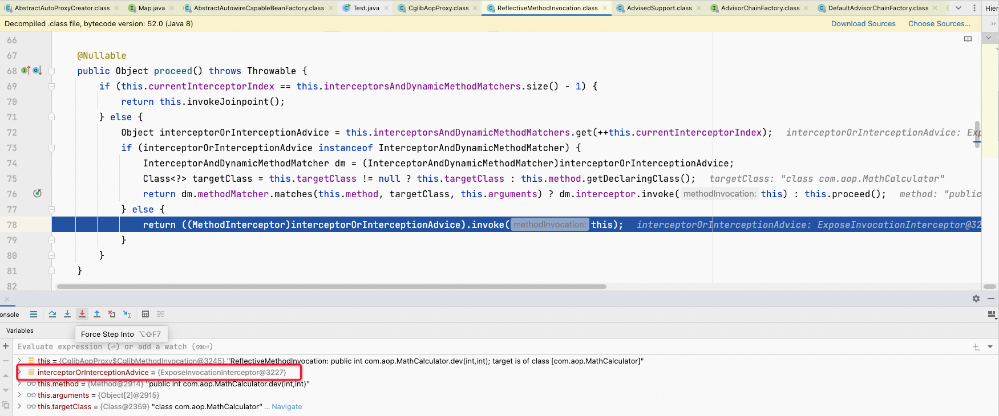
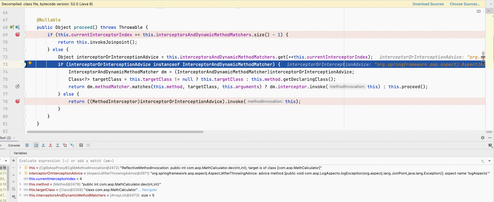
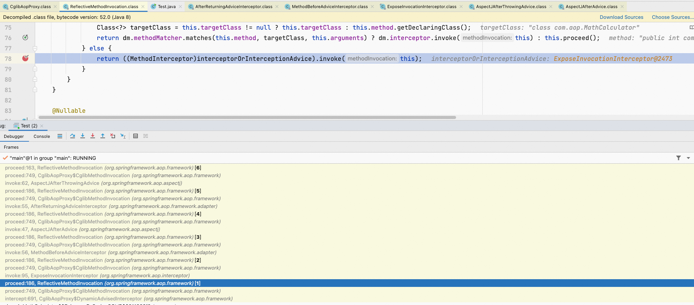

**<font style="color:#F5222D;">笔记来源：</font>**[**<font style="color:#F5222D;">尚硅谷Spring注解驱动教程(雷丰阳源码级讲解)</font>**](https://www.bilibili.com/video/BV1gW411W7wy/?p=2&spm_id_from=pageDriver&vd_source=e8046ccbdc793e09a75eb61fe8e84a30)


AOP：指在程序运行期间动态的将某段代码切入到指定位置并运行的编程方式。

底层是动态代理。

# 1 基础使用
案例：在除法运行之前记录哪个方法运行了，运行结束了打印返回值，如果有异常就将异常记录到日志中。

**<font style="color:#F5222D;">步骤一：</font>****<font style="color:#000000;">导入aop模块</font>**<font style="color:#000000;">：Spring AOP（spring-sapects）</font>

```xml
<dependency>
  <groupId>org.springframework</groupId>
  spring-aspects</artifactId>
  <version>4.3.14.RELEASE</version>
</dependency>
```

**<font style="color:#F5222D;">步骤二：</font>****<font style="color:#000000;">创建业务逻辑类</font>**

```java
public class MathCalculator {

    public int dev(int i,int j){
        return i/j;
    }
}
```

**<font style="color:#F5222D;">步骤三：</font>****<font style="color:#000000;">定义一个日志切面类，并告诉Spring当前类是切面类。</font>**

切面类中的方法需要动态感知MatchCalculator.div运行到哪里，调用对应的切面类中的方法。

```java
//========================== @Aspect告诉Spring，当前类为切面类 ======================
@Aspect
public class LogAspects {
    /**
     * 抽取公共的切入点表达式
     * 当前切面类中使用：pointCut()
     * 其它切面类中使用：com.example.aop.MathCalculator.pointCut())
     *
     * JoinPoint joinPoint参数 必须是参数列表的第一个参数
     */
    @Pointcut("execution(public int com.example.aop.MathCalculator.*(..))")
    public void pointCut(){}

    @Before("pointCut()")
    public void logStart(JoinPoint joinPoint){
        Object[] args = joinPoint.getArgs();
        System.out.println(""+joinPoint.getSignature().getName()+"运行...@Before参数列表是:{"+ Arrays.asList(args) +"}");
    }

    @After("pointCut()")
    public void logEnd(JoinPoint joinPoint){
        System.out.println(""+joinPoint.getSignature().getName()+"结束...@After");
    }

    /**
     * returning = "result" 将返回对象赋值给result
     * @param result 指定接收返回值的对象
     */
    @AfterReturning(value = "pointCut()",returning = "result")
    public void logReturn(JoinPoint joinPoint,Object result){
        System.out.println(""+joinPoint.getSignature().getName()+"正常返回...@AfterReturning运行结果：{"+result+"}");
    }

    /**
     * throwing = "exception" 将异常对象抛出
     * @param exception 指定接收异常的对象
     */
    @AfterThrowing(value = "pointCut()",throwing = "exception")
    public void logException(JoinPoint joinPoint,Exception exception){
        System.out.println(""+joinPoint.getSignature().getName()+"异常...@AfterThrowing异常信息：{"+exception+"}");
    }
}
```

**<font style="color:#C41D7F;">通知方法</font>**：

+ **<font style="color:#000000;">前置通知@Before</font>**<font style="color:#000000;">：</font>logStart，在目标方法(div)运行之前运行；
+ **<font style="color:#000000;">后置通知@After</font>**<font style="color:#000000;">：log</font>End，在目标方法(div)运行结束之后运行，无论方法正常结束还是结束都会调用；
+ **<font style="color:#000000;">返回通知@AfterReturing</font>**<font style="color:#000000;">：logRe</font>turn，在目标方法(div)正常返回之后运行；
+ **<font style="color:#000000;">异常通知@AfterThrowing</font>**<font style="color:#000000;">：logEx</font>ception，在目标方法(div)出现异常之后运行；
+ **<font style="color:#000000;">环绕通知@Around</font>**<font style="color:#000000;">：动态代</font>理，手动推进目标方法(joinPoint.proceed())运行。

<font style="color:#389E0D;">切入点表达式：</font>

**<font style="color:#F5222D;">步骤四：</font>****<font style="color:#000000;">将切面类和业务逻辑类(目标方法所在类)都加入到容器中</font>**

```java
//=================== @EnableAspectJAutoProxy 开启基于注解版的切面功能 =================
@EnableAspectJAutoProxy
@Configuration
public class MainConfigOfAOP {

    /**
     * 将业务逻辑加入到容器中
     */
    @Bean
    public MathCalculator mathCalculator(){
        return new MathCalculator();
    }

    /**
     * 将切面类加入到容器中
     */
    @Bean
    public LogAspects logAspects(){
        return new LogAspects();
    }

}
```

如果是之前XML的方式，则是


**<font style="color:#F5222D;">步骤五：测试</font>**

```java
@Test
public void test01(){
    AnnotationConfigApplicationContext applicationContext = new AnnotationConfigApplicationContext(MainConfigOfAOP.class);
    // 1 不要自己创建对象
    MathCalculator mathCalculator = new MathCalculator();
    mathCalculator.dev(1,1);
    // 2 使用容器管理的对象
    MathCalculator calculator = applicationContext.getBean(MathCalculator.class);
    calculator.dev(1,0);
}
```

结果：

```java
调用除法 == 自己创建的对象，不会走AOP这一套。
dev运行...@Before参数列表是:{[1, 1]}
调用除法
dev结束...@After
dev正常返回...@AfterReturning运行结果：{1}
```

总结：

1. 将业务逻辑和切面类都加入到容器中，告诉Spring哪个是切面类
2. 在切面类上的每个通知方法标注通知注解，告诉Spring何时何地运行(切入点表达式)
3. 开启基于注解的aop模式

# 2 @EnableAspectJAutoProxy原理
AOP整个功能起作用，都是从@EnableAspectJAutoProxy注解入手的。

原理研究：看给容器中注册了什么组件，这个组件什么时候工作，这个组件工作时候的功能。

`@EnableAspectJAutoProxy`中使用`@Import(AspectJAutoProxyRegistrar.class)`加入了一个组件。


`AspectJAutoProxyRegistrar`类实现了`ImportBeanDefinitionRegistrar`接口，可以手动加载组件。其实就是往容器中添加bean


`AspectJAutoProxyRegistrar`的执行过程：

先判断是否存在bean id为`org.springframework.aop.config.internalAutoProxyCreator`的 bean，不存在则注册一个`AnnotationAwareAspectJAutoProxyCreator`类型的 bean。

然后获取类上面的`@EnableAspectJAutoProxy`属性信息，判断`proxyTargetClass`属性、`exposeProxy`属性，做一些后续处理。

那么接下来我们重点分析为什么要往容器中注入`AnnotationAwareAspectJAutoProxyCreator`类型的 Bean呢？


# 3 AnnotationAwareAspectJAutoProxyCreator 详解
`AnnotationAwareAspectJAutoProxyCreator`的继承关系如下图：`AnnotationAwareAspectJAutoProxyCreator`最终实现了`BeanFactoryAware`、`BeanPostProcessor`


注意点：

BeanPostProcessor接口定义的方法是：

+ postProcessBefore**Initialization**()
+ postProcessAfter**Initialization**()

InstantiationAwareBeanPostProcessor接口继承了BeanPostProcessor，另外又增加了两个方法：

+ postProcessBefore**Instantiation**()
+ postProcessAfter**Instantiation**()

流程：

1. 传入配置类，创建ioc容器
2. 注册配置类，调用 refresh() 刷新容器。以下为 refresh() 方法内部的执行逻辑：
3. `registerBeanPostProcessor(beanFactory);`注册bean的后置处理器


    1. 先获取ioc容器已经定义了的需要创建对象的所有 BeanPostProcessor


    2. 给容器中加别的 BeanPostProcessor
    3. 优先注册实现了PriorityOrdered接口的 BeanProcessor
    4. 再给容器中注册实现了Ordered接口的 BeanPostProcessor
    5. 注册没实现优先级接口的BeanPostProcessor




AnnotationAwareAspectJAutoProxyCreator类是实现Ordered接口的，所以说会进入实现了Ordered接口的 BeanPostProcessor


首先，先注册实现PriorityOrdered接口的BeanPostProcessors

接下来，注册实现Ordered接口的BeanPostProcessors，此次案例中，实现Ordered接口的只有一个，那就是org.springframework.aop.config.internalAutoProxyCreator，在注册之前，会先去  中容器中获取，调用getBean方法


继续调用doGetBean方法


看没有这个bean


第一次进来很明显是没有，所以查询出来为null。所以会调用createBean方法


    6. 注册BeanPostProcessor，实际上就是创建BeanPostProcessor对象，保存在容器中。

例如：创建internalAutoProxyCreator的BeanPostProcessor【AnnotationAwareAspectAutoProxyCreator】

AbstractAutowireCapableBeanFactory::doCreateBean()


        1. 创建bean的实例


        2. `populateBean`给bean的各种属性赋值


        3. `initializeBean`初始化bean
            1. `invokeAwareMethods`：处理Aware接口的方法回调
            2. `applyBeanPostProcessorsBeforeInitialization`：应用后置处理器的beforeInitialization方法
            3. `invokeInitMethods`：执行@Bean注解等自定义的Bean初始化方法
            4. `applyBeanPostProcessorsAfterInitialization`：执行后置处理器的afterInitialization方法


        4. `BeanPostProcessor(AnnotationAwareAspectJAutoProxyCreator)`创建成功：-> aspectJAdvisorsBuilder
    7. 把 BeanPostProcessor 注册到BeanFactory中：`beanFactoy.addBeanPostProcessor(postProcessor)`


    8. 以上是创建和注册AnnotationAwareAspectJAutoProxyCreator的过程，实现的InstantiationAwareBeanPostProcessor接口的postProcessBeforeInstantiation()方法，会在所有bean创建之前进行一次拦截


4. `finishBeanFactoryInitialization(beanFactory)`完成bean初始化工作，创建剩下的单实例bean


此时创建的bean，是那些不属于后置处理器的普通单实例bean。后置处理器本身也是bean，后置处理器的bean在第3.6步进行创建


    1. 遍历获取容器中所有的bean，依次创建对象：getBean(beanName)  
getBean -> doGetBean -> getSingleton


    2. 创建bean

AnnotationAwareAspectJAutoProxyCreator会在所有bean创建之前进行一次拦截，因为他是InstantiationAwareBeanPostProcessor后置处理器


        1. 先从缓存中获取当前bean，如果能获取到，说明bean是之前被创建的，直接使用，否则再创建；创建好的bean都会被缓存起来。
        2. createBean()：创建bean

:::color1
BeanPostProcessor的postProcessBeforeInitialization和postProcessAfterInitialization是在Bean对象创建完成初始化前后调用的；

InstantiationAwareBeanPostProcessor的postProcessBeforeInstantiation和postProcessAfterInstantiation是在创建Bean实例之前先尝试用后置处理器返回对象。

即AnnotationAwareAspectJAutoProxyCreator实现的InstantiationAwareBeanPostProcessor的方法，会在任何bean创建之前先尝试返回bean的实例。

:::

            1. `resolveBeforeInstantiation(beanName, mdbToUse)`解析beforeInstantiation。


  
	希望后置处理器能在此返回一个代理对象，如果能返回代理对象就使用，如果不能就继续下一步。

                1. 后置处理器先尝试返回对象

```java
// 拿到所有BeanPostProcessor后置处理器，如果该后置处理器属于InstantiationAwareBeanPostProcessor，则执行该后置处理器的postProcessBeforeInstantiation方法。
// （注意postProcessBeforeInstantiation方法 不同于 postProcessBeforeInitialization方法）
bean = applyBeanPostProcessorsBeforeInstantiation(targetType, beanName);
if (bean != null) {
    bean = applyBeanPostProcessorsAfterInitialization(bean, beanName);
}
```

            2. `doCreateBean(beanName, mbdToUse, args)` ，真正的去创建一个bean实例 ，和第3.6环节中的操作流程一样

由于AnnotationAwareAspectJAutoProxyCreator是InstantiationAwareBeanPostProcessor这种后置处理器，那么接下来继续分析InstantiationAwareBeanPostProcessor接口。

# 4 InstantiationAwareBeanPostProcessor
`AnnotationAwareAspectJAutoProxyCreator`的父类`AbstractAutoProxyCreator`，实现了`InstantiationAwareBeanPostProcessor`接口，它的作用是：

1. 每一个bean创建之前，调用`postProcessBeforeInstantiation()`；


    1. 判断当前bean是否在`advisedBeans`中（`advisedBeans`保存了所有需要增强的bean）


    2. 调用`isInfrastructureClass()`判断当前Bean是否是基础类型。


        * aop相关基础设施类型的bean不应该被动态代理。

```java
boolean retVal = Advice.class.isAssignableFrom(beanClass) ||
				Pointcut.class.isAssignableFrom(beanClass) ||
				Advisor.class.isAssignableFrom(beanClass) ||
				AopInfrastructureBean.class.isAssignableFrom(beanClass);
```

        * 切面的bean不应该被动态代理：带有`@Aspect`注解的bean。
    3. 调用`shouldSkip()`判断当前bean是否需要跳过
        1. 调用`findCandidateAdvisors()`获取候选的增强器`List<Advisor> candidateAdvisors`（切面里面的通知方法）  
每一个封装的通知方法的增强器类型为：`InstantiationModelAwarePointcutAdvisorImpl`
        2. 判断增强器是否为`AspectJPointcutAdvisor`类型的，如果是，则判断该增强器的aspectName是否和beanName相同
2. `AbstractAutoProxyCreator`的`postProcessAfterInstantiation()`直接返回true


3. `AbstractAutoProxyCreator`的`postProcessBeforeInitialization()`直接返回传入的bean对象


调用顺序如下：

其中postProcessBeforeInstantiation()和postProcessAfterInstantiation()属于InstantiationAwareBeanPostProcessor后置处理器的方法，是在对象创建前使用


其中postProcessBeforeInitialization()和postProcessAfterInitialization()属于BeanPostProcessor后置处理器的方法，是在对象创建后，初始化前后使用





4. 创建好bean对象后，调用`postProcessAfterInitialization()`

  
       调用`wrapIfNecessary()`方法，如果需要的话对bean进行包装。

    1. 同`postProcessBeforeInstantiation()`一样进行一些校验：
        * 当前bean是否在`advisedBeans`中
        * 当前bean是否是基础类型
        * 当前bean是否需要跳过
    2. 调用`getAdvicesAndAdvisorsForBean()`获取当前bean的所有增强器（通知方法）：`Object[] specificInterceptors`


        1. 找到候选的所有增强器
        2. 找到能在当前bean中使用的增强器
        3. 给增强器排序
    3. 将bean保存到`advisedBeans`中，表示当前bean已经被增强处理了


    4. 如果当前Bean需要增强，创建当前bean的代理对象；


        1. 获取所有增强器（通知方法）
        2. 保存到proxyFactory中


        3. 创建代理对象  
Spring在`DefaultAopProxyFactory::createAopProxy`中自动决定使用哪种方式创建代理对象：


所以此处用的是cglib动态代理


            + JdkDynamicAopProxy
            + ObjenesisCglibAopProxy
5. 给容器中返回cglib增强了的代理对象
6. 以后容器中获取到的就是这个组件的代理对象，执行目标方法时，代理对象就会执行通知方法的流程。

# 5 MethodInterceptor方法拦截器链
目标方法执行：

容器中保存了组件的代理对象（Cglib增强后的对象），这个对象里面保存了详细信息（增强器、目标对象等）。


1. 进入CglibAopProxy的intercept()方法，拦截目标方法的执行


2. 根据`ProxyFactory`类型的`advised`对象，获取到将要执行的目标方法的拦截器链

> 拦截器链：每一个通知方法被包装成MethodInterceptor方法拦截器，后续利用MethodInterceptor机制执行
>

```java
List<Object> chain = this.advised.getInterceptorsAndDynamicInterceptionAdvice(method, targetClass);
```


    1. `List<Object> interceptorList`保存所有拦截器  
一个默认的`ExposeInvocationInterceptor` + 自定义的增强通知方法


    2. 遍历所有的增强器，将其转换为Interceptor：`registry.getInterceptors(advisor);`
    3. 将Advisor转换为MethodInterceptor（MethodInterceptor继承于Interceptor）：

  
	判断如果Advisor属于MethodInterceptor类型，则直接加入interceptors数组；  
	通过遍历AdvisorAdapter适配器（前置通知适配器、返回结果通知适配器、异常通知适配器），尝试将Advisor转换为MethodInterceptor，加入interceptors数组

:::color1
`@AfterThrowing`注解的增强器转换为`AspectJAfterThrowingAdvice`

`@AfterReturning`注解的增强器转换为`AfterReturningAdviceInterceptor`

`@After`注解的增强器转换为`AspectJAfterAdvice`

`@Before`注解的增强器转换为`MethodBeforeAdviceInterceptor`

:::


3. 如果没有拦截器链，直接执行目标方法


4. 如果有拦截器链，把需要执行的目标对象、目标方法、拦截器链等信息传入创建一个CglibMethodInvocation对象，并调用该对象的`proceed()`方法。

```java
Object retVal = new CglibMethodInvocation(proxy, target, method, args, targetClass, chain, methodProxy).proceed();
```


5. 拦截器链的调用过程：`proceed()`的执行过程。

`CglibMethodInvocation`继承于`ReflectiveMethodInvocation`，实际执行的是`ReflectiveMethodInvocation::proceed()`


    1. 如果没有拦截器执行目标方法，或者拦截器的索引和（拦截器数组-1）大小一样（即到了最后一个拦截器），执行目标方法。

因为拦截器的链式执行是类似入栈操作，是后入先出，所以拦截器链数组中的拦截器顺序与执行顺序相反

第一次走的是ExposeInvocationInterceptor，调用其invoke方法




第二次进来的是MethodBeforeAdviceInterceptor，继续执行proceed方法，且前置通知方法已经执行


第三次进来的是AspectJAfterAdvice，直接执行process方法，不会执行后置方法


第四次执行的是AfterReturningAdviceInterceptor，不会执行afterReturning方法


第五次进来：AspectJAfterThrowingAdvice执行process方法




判断条件成立，执行目标方法


如果觉得很复杂，则可以借助栈帧来协助理解


第一步





等等以此入栈帧，出栈帧的时候


等等以此执行。

    2. 否则获取到拦截器链中（当前索引 += 1）的拦截器，执行其`invoke()`方法
    3. 拦截器的`invoke()`方法，会在进行一定操作后，递归链式调用`proceed()`方法。  
例如`@Before`增强器对应的`MethodBeforeAdviceInterceptor`拦截器，其`invoke()`方法为：

```java
@Override
public Object invoke(MethodInvocation mi) throws Throwable {
    this.advice.before(mi.getMethod(), mi.getArguments(), mi.getThis() );
    return mi.proceed();  // 链式调用，继续进行后面的链的执行
}
```

`@AfterReturning`增强器对应的`AfterReturningAdviceInterceptor`拦截器，其`invoke()`方法为：

```java
@Override
public Object invoke(MethodInvocation mi) throws Throwable {
    Object retVal = mi.proceed(); // 链式调用，继续进行后面的链的执行
    this.advice.afterReturning(retVal, mi.getMethod(), mi.getArguments(), mi.getThis());
    return retVal;
}
```

# 6 AOP增强器注解执行顺序
> 根据注解进行排序，顺序依次为：@Around、@Before、@After、@AfterReturning、[@AfterThrowing ](/AfterThrowing )
>

`AbstractAutoProxyCreator`执行`postProcessBeforeInstantiation()`，其中进行`shouldSkip()`等判断时，会调用`findCandidateAdvisors()`获取所有候选的增强器。

`AnnotationAwareAspectJAutoProxyCreator`中实现了`findCandidateAdvisors()`方法。`AnnotationAwareAspectJAutoProxyCreator`通过调用`this.aspectJAdvisorsBuilder.buildAspectJAdvisors()`获取所有的增强器，`aspectJAdvisorsBuilder.buildAspectJAdvisors()`通过`advisorFactory.getAdvisors(factory)`获取增强器。

> aspectJAdvisorsBuilder、advisorFactory都是在`AnnotationAwareAspectJAutoProxyCreator`的`initBeanFactory()`方法中实例化出来。
>

```java
@Override
protected void initBeanFactory(ConfigurableListableBeanFactory beanFactory) {
	if (this.aspectJAdvisorFactory == null) {
            this.aspectJAdvisorFactory = new ReflectiveAspectJAdvisorFactory(beanFactory);
        }
        this.aspectJAdvisorsBuilder =
                new BeanFactoryAspectJAdvisorsBuilderAdapter(beanFactory, 
                                                             this.aspectJAdvisorFactory);
}
```


所以，最终获取方法增强器并进行排序 是在`ReflectiveAspectJAdvisorFactory`类中进行：


即最后调用`Collections.sort(增强器, METHOD_COMPARATOR)`对所有增强器进行排序，排序算法为`METHOD_COMPARATOR`对象。

METHOD_COMPARATOR对象的定义赋值源码：

```java
private static final Comparator<Method> METHOD_COMPARATOR;

static {
    CompoundComparator<Method> comparator = new CompoundComparator<Method>();
    // 首选排序方式：根据注解进行排序，顺序依次为：@Around、@Before、@After、@AfterReturning、@AfterThrowing
    comparator.addComparator(new ConvertingComparator<Method, Annotation>(
        new InstanceComparator<Annotation>(
            Around.class, Before.class, After.class, AfterReturning.class, AfterThrowing.class),
        new Converter<Method, Annotation>() {
            @Override
            public Annotation convert(Method method) {
                AspectJAnnotation<?> annotation =
                    AbstractAspectJAdvisorFactory.findAspectJAnnotationOnMethod(method);
                return (annotation != null ? annotation.getAnnotation() : null);
            }
        }));
    // 当两个增强器的注解相同时，继续用第二种排序方式进行比较：以字符串方式比较增强器的方法名称
    comparator.addComparator(new ConvertingComparator<Method, String>(
        new Converter<Method, String>() {
            @Override
            public String convert(Method method) {
                return method.getName();
            }
        }));
    METHOD_COMPARATOR = comparator;
}
```

所以，如果想自定义一个类似`ReflectiveAspectJAdvisorFactory`的类`MyReflectiveAspectJAdvisorFactory`，更改AOP注解排序方式，则需：

1. 自定义一个类似`EnableAspectJAutoProxy`的注解`MyEnableAspectJAutoProxy`，令其@Import注解加载的组件为自定义的组件`MyAspectJAutoProxyRegistrar`
2. 修改`MyAspectJAutoProxyRegistrar`中的`AopConfigUtiles`为自定义的`MyAopConfigUtiles`，因为`AopConfigUtiles`会将`AnnotationAwareAspectJAutoProxyCreator`加载为beanId为`internalAutoProxyCreator`的bean。以及修改判断的使能AspectJ注解为`MyEnableAspectJAutoProxy`
3. 修改`MyAopConfigUtiles`中`registerAspectJAnnotationAutoProxyCreatorIfNecessary()`方法加载的bean类为`MyAnnotationAwareAspectJAutoProxyCreator`
4. 修改`MyAnnotationAwareAspectJAutoProxyCreator`的`initBeanFactory()`方法中创建的aspectJAdvisorFactory对象为`new MyReflectiveAspectJAdvisorFactory(beanFactory)`
5. 在`MyReflectiveAspectJAdvisorFactory`中的静态代码块中修改成自己需要的排序方式


# 7 总结
AOP实现流程

1. @EnableAspectJAutoProxy 开启AOP功能
2. @EnableAspectJAutoProxy会给容器注册一个组件AnnotationAwareAspectJAutoProxyCreator
3. AnnotationAwareAspectJAutoProxyCreator是一个后置处理器、
4. 容器的创建流程：
    1. registerBeanPostProcessor()注册后置处理器，创建AnnotationAwareAspectJAutoProxyCreator对象
    2. finishBeanFactoryInitialization 初始化剩下的单例bean
        1. 创建业务逻辑组件和切面组件
        2. AnnotationAwareAspectJAutoProxyCreator拦截组件的创建过程
        3. 组件创建完成之后，判断组件是否需要增强
            + 是：切面的通知方法，包装成增强器（Advisor），给业务逻辑组件创建一个代理对象
5. 执行目标方法
    1. 代理对象执行目标方法
    2. 执行CglibAopProxy的intercept()方法
        1. 得到目标方法的拦截器链（增强器包装成拦截器MethodInterceptor）
        2. 利用拦截器的链式机制，依次进入每一个拦截器进行执行
        3. 效果
            + 正常执行：前置通知-> 目标方法->  后置通知-> 返回通知
            + 出现异常：前置通知-> 目标方法->  后置通知-> 异常通知


