**<font style="color:#F5222D;">笔记来源：</font>**

[02_尚硅谷_组件注册-@Configuration&@Bean给容器中注册组件_哔哩哔哩_bilibili](https://www.bilibili.com/video/BV1gW411W7wy/?p=2&spm_id_from=pageDriver&vd_source=e8046ccbdc793e09a75eb61fe8e84a30)

**<font style="color:#F5222D;"></font>**

# 1 基础使用
1. 导入依赖

```xml
<dependency>
    <groupId>org.springframework</groupId>
    spring-jdbc</artifactId>
    <version>4.3.12.RELEASE</version>
</dependency>

<!-- 根据需要，导入连接池、数据库驱动 -->
<dependency>
    <groupId>c3p0</groupId>
    c3p0</artifactId>
    <version>0.9.1.2</version>
</dependency>

<dependency>
    <groupId>mysql</groupId>
    mysql-connector-java</artifactId>
	<version>8.0.21</version>
</dependency>
```

2. 配置数据源、JdbcTemplate操作数据 

```java
@Configuration
@ComponentScan({"com.study.dao", "com.study.service"})
public class TxConfig {
    @Bean
    public DataSource dataSource() throws Exception{
        //c3p0的datasource
        ComboPooledDataSource dataSource = new ComboPooledDataSource();
        dataSource.setUser("root");
        dataSource.setPassword("123456");
        dataSource.setDriverClass("com.mysql.jdbc.Driver");
        dataSource.setJdbcUrl("jdbc:mysql://127.0.0.1:3306/db2019");
        return dataSource;
    }

    @Bean
    public JdbcTemplate jdbcTemplate() throws Exception {
         // @Configuration类中的@Bean方法在Spring中被特殊执行，
        // 此处虽然传入dataSource()，但是Spring不会执行dataSource()方法重新new一个对象，而是会直接从ioc容器中获取
        return new JdbcTemplate(dataSource()); 
    }
}
```

3. 给方法上标注`@Transactional`，表示当前方法是一个事务方法 

```java
@Service
public class UserService {
    @Autowired
    private UserDao userDao;

    @Transactional
    public void insertUser() {
        userDao.insert();
        System.out.println("插入完成");
    }
}
```

```java
@Repository
public class UserDao {

    @Autowired
    private JdbcTemplate jdbcTemplate;

    public void insert(){
        String sql = "insert into `tb_user` (username,password) values(?,?)";
        String userName = UUID.randomUUID().toString().substring(0, 5);
        jdbcTemplate.update(sql,userName,13);
    }
}
```

4. `@EnableTransactionManagement` 开启基于注解的事务管理功能

```java
@EnableTransactionManagement
@Configuration
@ComponentScan({"com.study.dao", "com.study.service"})
public class TxConfig {
    // ....
}
```

5. 配置事务管理器来控制事务

```java
/**
* 向容器中注册事务管理器
*/
@Bean
public PlatformTransactionManager transactionManager() throws Exception{
	// 事务管理器一定要管理住数据源，这样的话，才能控制住数据源中的每一条连接，连接的回滚、事务的开启。
    return new DataSourceTransactionManager(dataSource());
}
```

# 2 原理
## 2.1 @EnableTransactionManagement
`@EnableTransactionManagement`使用`@Import`引入了`TransactionManagementConfigurationSelector`。

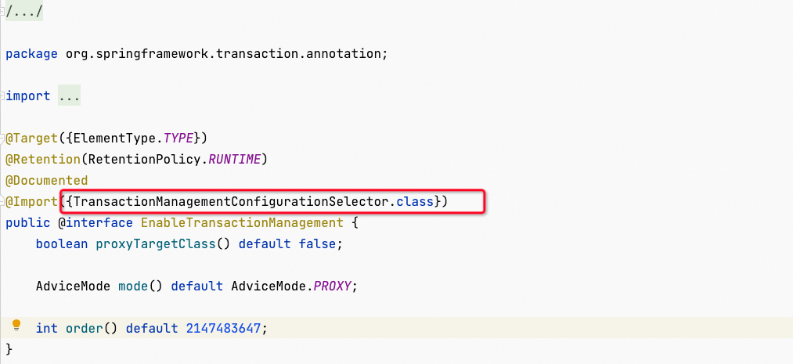

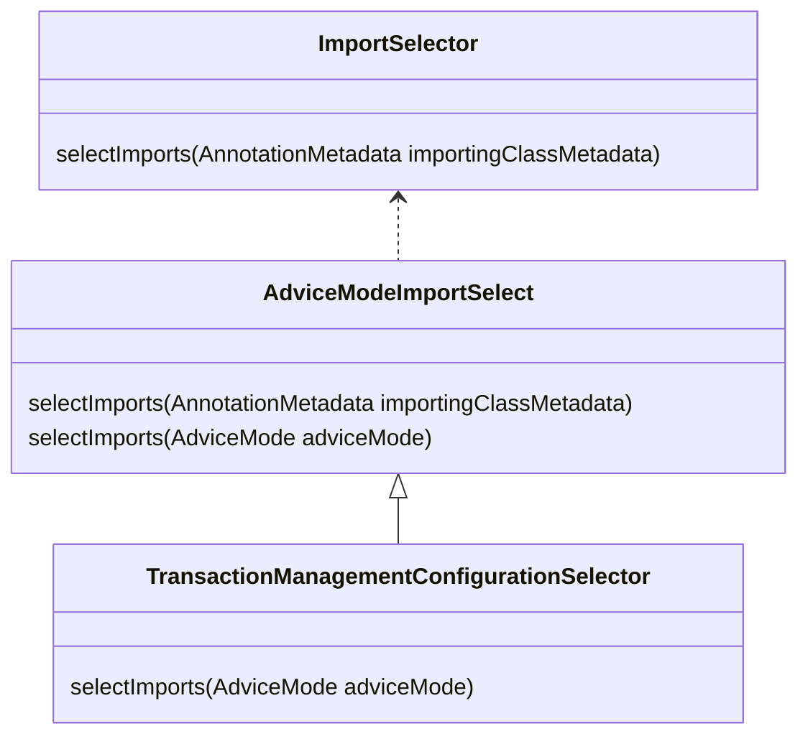

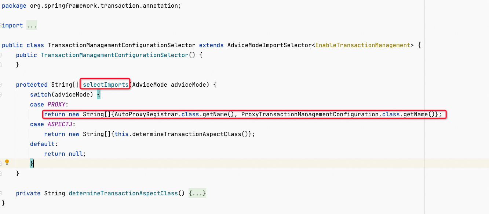

AdivceModelmportSelect中获取`@EnableTransactionManagement`注解的`mode`属性，传递给`selectImports(adviceMode)`方法。

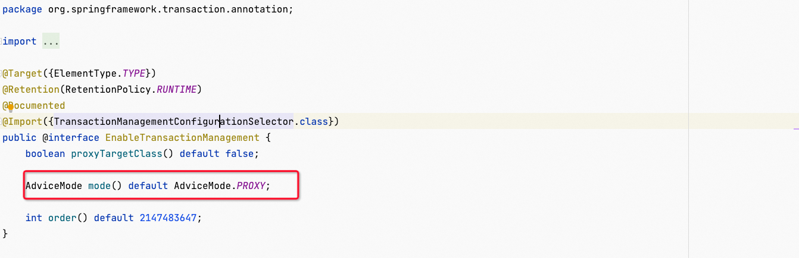

TransactionManagementConfigurationSelector根据传入的mode值，选择引入不同的组件。

`@EnableTransactionManagement`的mode属性默认值为`AdviceMode.PROXY`，所以默认引入的组件为：

+ AutoProxyRegistrar
+ ProxyTransactionManagementConfiguration

## 2.2 AutoProxyRegistrar
AutoProxyregistrar实现了ImportBeanDefinitionRegistrar，可以手动给容器中注册组件。

同AOP的`@EnableAspectJAutoProxy`注解的`AspectJAutoProxyRegistrar`注册器一样，AutoProxyregistrar也是使用`AopConfigUtils`工具类注册组件。

调用`AopConfigUtils::registerAutoProxyCreatorIfNecessary`方法，注册了一个`InfrastructureAdvisorAutoProxyCreator`类型的组件，beanID同样是`org.springframework.aop.config.internalAutoProxyCreator`。

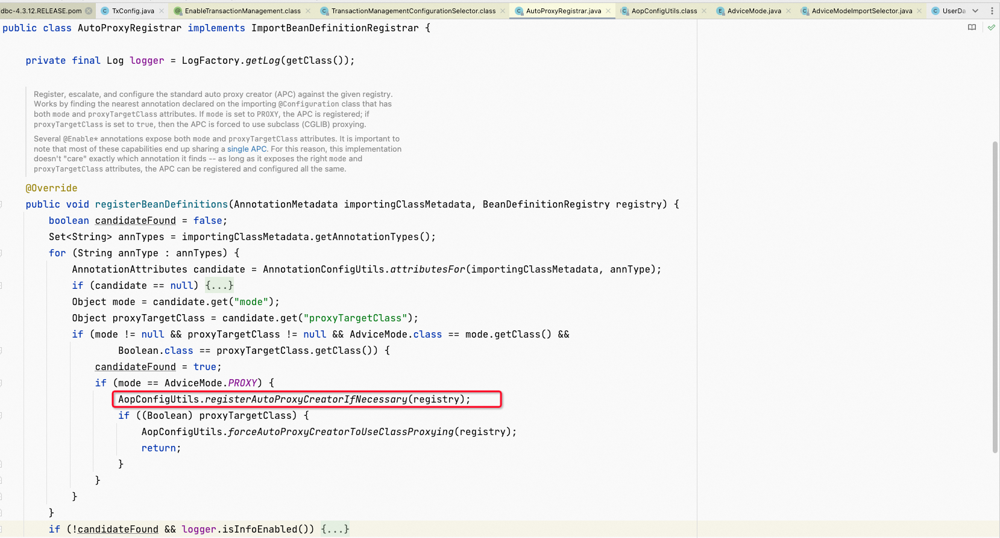

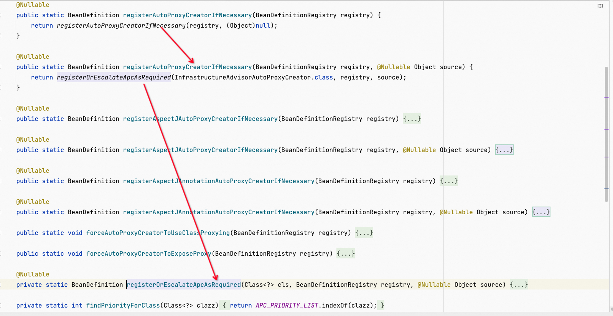

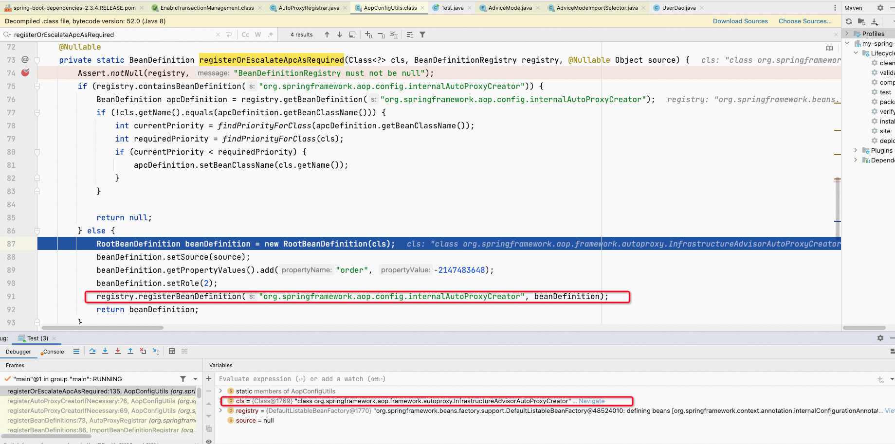

`InfrastructureAdvisorAutoProxyCreator`也继承了`AbstractAdvisorAutoProxyCreator`，所以其执行逻辑同AOP基本一样。

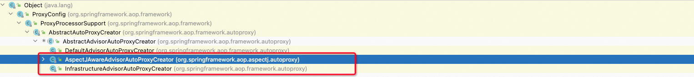

## 2.3 ProxyTransactionManagementConfiguration
是一个`@Configuration`注解的配置类，内部通过`@Bean`给ioc容器注册相应组件。

1.  transactionAdvisor() 给容器中注册事务增强器 
    - 需要用事务注解信息：AnnotationTransactionAttributeSource，解析事务注解属性。  
AnnotationTransactionAttributeSource中会添加需要的相关的注解解析器，例如：Spring事务注解解析器SpringTransactionAnnotationParser、Jta12注解解析器JtaTransactionAnnotationParser、Ejb3注解解析器Ejb3TransactionAnnotationParser。 
    - 需要用事务拦截器：TransactionInterceptor，保存了事务属性信息、事务管理器。  
TransactionInterceptor是一个方法拦截器MethodInterceptor。 
2.  transactionAttributeSource() 给容器中注册事务注解器，供事务增强器使用 
3.  transactionInterceptor() 给容器中注册事务拦截器，供事务增强器使用 

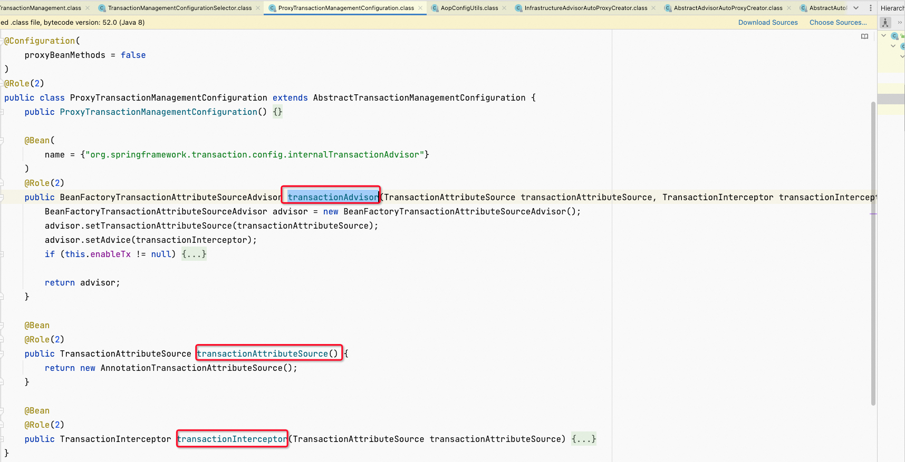

## 2.4 TransactionInterceptor
TransactionInterceptor的类UML图如下：


TransactionInterceptor是一个MethodInterceptor，和其他方法拦截器一样，会在执行拦截器链时，通过上层的`proceed()`调用到它的`invoke()`方法，`TransactionInterceptor::invoke()`调用了父类的`TransactionAspectSupport::invokeWithinTrasaction()`：

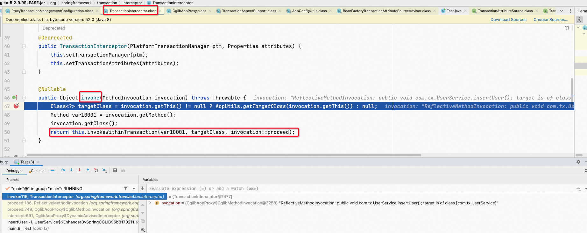


1. 获取事务相关的属性 
2. 获取`PlatformTransactionManager`类型事务管理器：`determineTransactionManager()`  
通过`@Transactional`注解的`transactionManager`属性尝试获取对应beanId的事务管理器(该属性作用类似`Qualifier`)；  
如果transactionManager属性为空（一般情况下不设置该属性），继续判断类属性`transactionManagerBeanName`；  
如果没有给该类事先添加事务管理器，最终通过ioc容器获取事务管理器。 

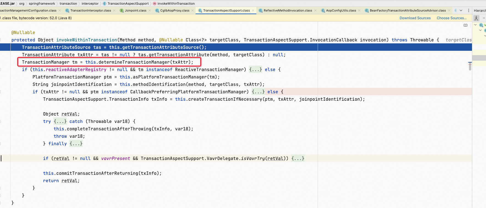

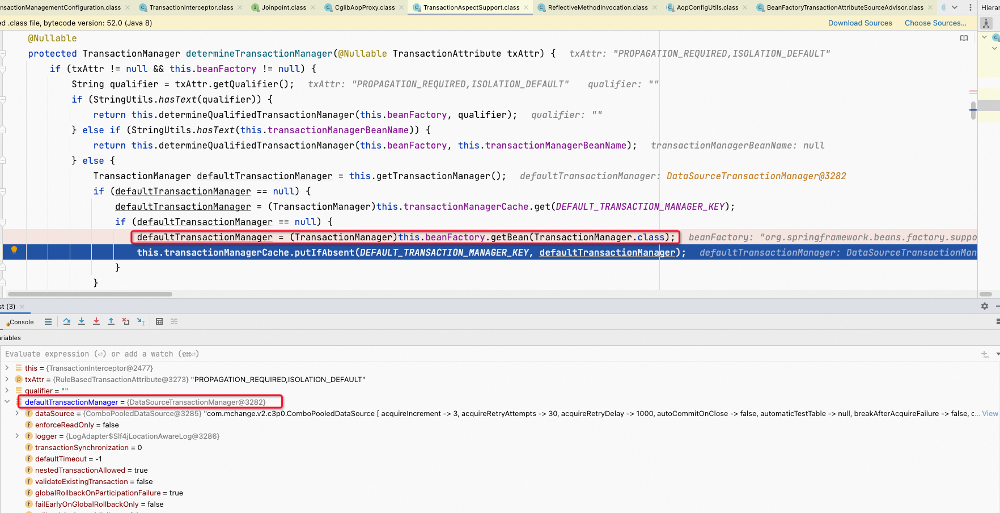

```java
defaultTransactionManager = this.beanFactory.getBean(PlatformTransactionManager.class);
```

3.  使用事务管理器开启事务、执行方法、事务提交或回滚 

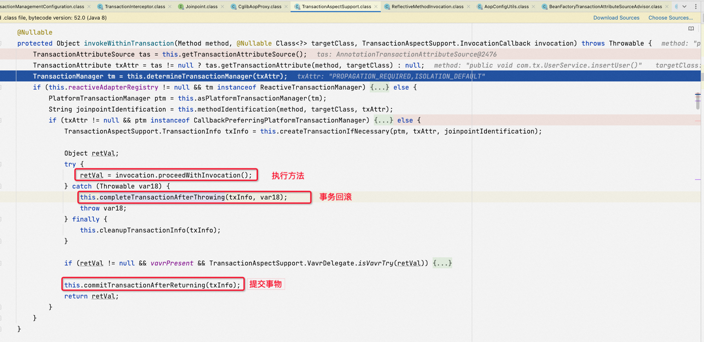

```java
// 开启事务
TransactionInfo txInfo = createTransactionIfNecessary(tm, txAttr, joinpointIdentification);
Object retVal = null;
try {
    // 拦截器链调用方法执行
    retVal = invocation.proceedWithInvocation();
}
catch (Throwable ex) {
    // 事务管理器进行回滚：txInfo.getTransactionManager().rollback(txInfo.getTransactionStatus())
    // completeTransactionAfterThrowing方法内有判断：只有符合回滚条件的异常才执行回滚，其他异常会继续执行commit
    completeTransactionAfterThrowing(txInfo, ex);
    throw ex;
}
finally {
    cleanupTransactionInfo(txInfo);
}
// 事务管理器提交：txInfo.getTransactionManager().commit(txInfo.getTransactionStatus());
commitTransactionAfterReturning(txInfo);
return retVal;
```

 	因为Spring的事务管理器仅对指定的异常进行事务回滚，有时我们需要在Service中强制进行回滚时，会使用以下方式：

```java
TransactionAspectSupport.currentTransactionStatus().setRollbackOnly();
```


原理：

TransactionAspectSupport中使用`ThreadLocal<TransactionInfo>`存储了该线程的事务，可以通过protect的`currentTransactionStatus()`方法获取到该事务；

TransactionInfo事务中带有一个状态属性TransactionStatus，事务管理器提交/回滚事务时都会判断该状态：`txInfo.getTransactionManager().commit(txInfo.getTransactionStatus());`。

如果将TransactionStatus的rollbackOnly属性设置为true，则事务管理器的`commit(TransactionStatus transtationStatus)`方法执行时判断到该状态，会执行事务回滚操作。


