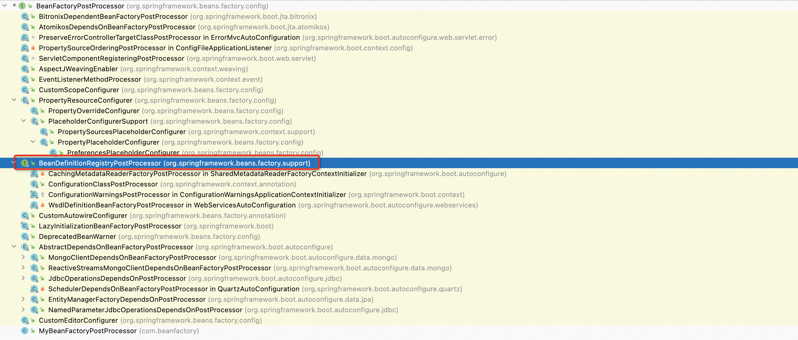

**<font style="color:#F5222D;">笔记来源：</font>**[**<font style="color:#F5222D;">尚硅谷Spring注解驱动教程(雷丰阳源码级讲解)</font>**](https://www.bilibili.com/video/BV1gW411W7wy/?p=2&spm_id_from=pageDriver&vd_source=e8046ccbdc793e09a75eb61fe8e84a30)

[music163](https://music.163.com/outchain/player?type=2&id=297926&auto=0&height=66)

# 1 BeanFactoryPostProcessor
BeanFactoryPostProcessor其实就是BeanFactory（创建bean的工厂）的后置处理器。说起这个，你脑海中是不是泛起了回忆，是不是想起了有一个与BeanFactoryPostProcessor的名字极其相似的玩意，它就是BeanPostProcessor。那什么是BeanPostProcessor呢？我们之前早就说过了，它就是bean的后置处理器，并且是在bean创建对象前后和初始化前后进行拦截工作的。

现在我们要讲解的是BeanFactoryPostProcessor，上面也说过了，它是BeanFactory（创建bean的工厂）的后置处理器。接下来，我们就要搞清楚它的内部原理了，想要搞清楚其内部原理，我们需要从它是什么时候工作这一点开始入手研究，也即搞清楚它的调用时机是什么。

我们点进去BeanFactoryPostProcessor的源码里面去看一看，发现它是一个接口，如下图所示。


仔细看一下其内部postProcessBeanFactory方法上的描述，这很重要，因为从这段描述中我们就可以知道BeanFactoryPostProcessor的调用时机。描述中说，我们可以在IOC容器里面的BeanFactory的标准初始化完成之后，修改IOC容器里面的这个BeanFactory。

也就是说，BeanFactoryPostProcessor的调用时机是在BeanFactory标准初始化之后，这样一来，我们就可以来定制和修改BeanFactory里面的一些内容了。那什么叫标准初始化呢？接着看描述，它说的是所有的bean定义已经被加载了，但是还没有bean被初始化。

说人话，就是BeanFactoryPostProcessor的调用时机是在BeanFactory标准初始化之后，这样一来，我们就可以来定制和修改BeanFactory里面的一些内容了，此时，所有的bean定义已经保存加载到BeanFactory中了，但是bean的实例还未创建。

****

## 1.1 案例实践
接下来，我们来编写一个案例来验证一下以上说的内容。

首先，我们来编写一个我们自己的BeanFactoryPostProcessor，例如MyBeanFactoryPostProcessor。要编写这样一个bean工厂的后置处理器，它得需要实现我们上面说的BeanFactoryPostProcessor接口，并且还得添加一个实现方法。由于BeanFactoryPostProcessor接口里面只声明了一个方法，即postProcessBeanFactory，所以咱们自己编写的MyBeanFactoryPostProcessor类中只需要实现其即可。

```java
package com.beanfactory;

import org.springframework.beans.factory.config.BeanFactoryPostProcessor;
import java.util.Arrays;
import org.springframework.beans.BeansException;
import org.springframework.beans.factory.config.ConfigurableListableBeanFactory;
import org.springframework.stereotype.Component;

@Component
public class MyBeanFactoryPostProcessor implements BeanFactoryPostProcessor {

    @Override
    public void postProcessBeanFactory(ConfigurableListableBeanFactory beanFactory) throws BeansException {
        System.out.println("MyBeanFactoryPostProcessor...postProcessBeanFactory..."); // 这个时候我们所有的bean还没被创建
        // 但是我们可以看一下通过Spring给我们传过来的这个beanFactory，我们能拿到什么
        int count = beanFactory.getBeanDefinitionCount(); // 我们能拿到有几个bean定义
        String[] names = beanFactory.getBeanDefinitionNames(); // 除此之外，我们还能拿到每一个bean定义的名字
        System.out.println("当前BeanFactory中有" + count + "个Bean");
        System.out.println(Arrays.asList(names));
    }

}
```

注意，我们自己编写的MyBeanFactoryPostProcessor类要想让Spring知道，并且还要能被使用起来，那么它一定就得被加在容器中，为此，我们可以在其上标注一个@Component注解。

然后，创建一个配置类，例如ExtConfig，记得还要在该配置类上使用@ComponentScan注解来配置包扫描哟！

```java
package com.beanfactory;


import org.springframework.context.annotation.ComponentScan;
import org.springframework.context.annotation.Configuration;

@ComponentScan("com.beanfactory")
@Configuration
public class ExtConfig {

}
```

<font style="color:rgb(77, 77, 77);">当然了，我们也可以使用@Bean注解向容器中注入咱自己写的组件，例如，在这里，我们可以向容器中注入一个Blue组件。</font>

```java
package com.beanfactory;


import org.springframework.context.annotation.Bean;
import org.springframework.context.annotation.ComponentScan;
import org.springframework.context.annotation.Configuration;

@ComponentScan("com.beanfactory")
@Configuration
public class ExtConfig {

    @Bean(initMethod = "init",destroyMethod = "destory")
    public Blue blue() {
        return new Blue();
    }
}

```

<font style="color:rgb(77, 77, 77);">上面这个Blue组件其实就是一个非常普通的组件，代码如下所示：</font>

```java
package com.beanfactory;

public class Blue {

    public Blue() {
        System.out.println("blue...constructor");
    }

    public void init() {
        System.out.println("blue...init...");
    }

    public void destory() {
        System.out.println("blue...destory...");
    }

}
```

<font style="color:rgb(77, 77, 77);">可以看到，在创建Blue对象的时候，无参构造器会有相应打印。</font>

<font style="color:rgb(77, 77, 77);">接着，编写一个单元测试类，例如IOCTest_Ext，来进行测试。</font>

```java
package com.beanfactory;


import org.springframework.context.annotation.AnnotationConfigApplicationContext;


public class IOCTest_Ext {

    public static void main(String[] args) {
        AnnotationConfigApplicationContext applicationContext = new AnnotationConfigApplicationContext(ExtConfig.class);

        // 关闭容器
        applicationContext.close();
    }
}
```

测试啥呢？其实就是来验证一下BeanFactoryPostProcessor的调用时机。说得更具体一点就是，就是看一下咱们自己编写的BeanFactoryPostProcessor究竟是不是在所有的bean定义已经被加载，但是还未创建对象的时候工作？

那咱们接下来就来一探究竟。运行IOCTest_Ext类中的test01方法，可以看到控制台打印出了如下内容。

```latex
MyBeanFactoryPostProcessor...postProcessBeanFactory...
当前BeanFactory中有8个Bean
[org.springframework.context.annotation.internalConfigurationAnnotationProcessor, org.springframework.context.annotation.internalAutowiredAnnotationProcessor, org.springframework.context.annotation.internalCommonAnnotationProcessor, org.springframework.context.event.internalEventListenerProcessor, org.springframework.context.event.internalEventListenerFactory, extConfig, myBeanFactoryPostProcessor, blue]
blue...constructor
blue...init...
blue...destory...
```

<font style="color:rgb(77, 77, 77);">咱们自己编写的BeanFactoryPostProcessor在Blue类的无参构造器创建Blue对象之前就已经工作了。细心一点看的话，从bean的定义信息中还能看到Blue组件注册到容器中的名字，只是此刻还没创建对象，如下图所示。</font>


<font style="color:rgb(77, 77, 77);">说明BeanFactoryPostProcessor是在所有的bean定义信息都被加载之后才调用的。</font>

## 1.2 源码分析
从名字我们可以，在这个方法里面，会执行所有的BeanFactoryPostProcessor


继续进入


从beanFactory查询BeanFactoryPostProcessor类型的Processor，我们发现有三个。


我们来判断看看，这三个processors属于哪种类型？


我们发现这三个processors分布在两个集合里。

processedBeans表示已经被执行过的processors，这个是因为org.springframework.context.annotation.internalConfigurationAnnotationProcessor不仅属于BeanFactoryPostProcessor，还属于BeanDefinitionRegistryPostProcessor，而BeanDefinitionRegistryPostProcessor类型会在BeanFactoryPostProcessor前面执行，所以此处不会再执行。

nonOrderedPostProcessorNames里面表示没有实现Ordered和PriorityOrdered的Processor。


进入这个方法里面，开始执行processors。


开始循环执行BeanFactoryPostProcessor的postProcessBeanFactory方法


我们看看自定义的这个BeanFactoryPostProcessor


至此，我们定义的processors开始执行完成。而所有的BeanFactoryPostProcessor也是这样一个个循环执行的。


小结

经过以上源码分析，我们可以得出这样一个简单结论：首先从IOC容器中找到所有类型是BeanFactoryPostProcessor的组件，然后再来执行它们其中的方法，而且是在bean初始化创建其他组件前面执行。

我为什么可以这么肯定地说呢？如果我们大家还有回忆的话，那么你一定记得在我讲解AOP原理的时候，bean的创建与初始化还在很后面，如下图所示。


# 2 BeanDefinitionRegistryPostProcessor
我们学习了一下BeanFactoryPostProcessor接口，了解了一下它是怎样使用的，以及其内部原理，我们知道，BeanFactoryPostProcessor的调用时机是在BeanFactory标准初始化之后，这样一来，我们就可以来定制和修改BeanFactory里面的一些内容了。

接下来，我们就要学习一下BeanFactoryPostProcessor的一个子接口，即BeanDefinitionRegistryPostProcessor。



从上图中可以看到BeanDefinitionRegistryPostProcessor是BeanFactoryPostProcessor旗下的一个子接口。

## 2.1 案例实践
初步认识一下BeanDefinitionRegistryPostProcessor  
首先，咱们来看一下BeanDefinitionRegistryPostProcessor的源码，如下图所示。


从该接口的名字中，我们大概能知道个一二，说它是bean定义注册中心的后置处理器并不过分。而且，从该接口的源码中我们也可以看出，它是BeanFactoryPostProcessor旗下的一个子接口。

我们还能看到，它里面定义了一个方法，叫postProcessBeanDefinitionRegistry，那么问题来了，它是什么时候执行的呢？我们可以看一下它上面的详细描述，说的是啥呢，说的是在IOC容器标准初始化之后，允许我们来修改IOC容器里面的bean定义注册中心。此时，所有合法的bean定义将要被加载，但是这些bean还没有初始化完成。

说人话就是，postProcessBeanDefinitionRegistry方法的执行时机是在所有bean定义信息将要被加载，但是bean实例还未创建的时候。 这句话听起来，总感觉BeanDefinitionRegistryPostProcessor是在BeanFactoryPostProcessor前面执行的，真的是这样吗？确实是这样。为什么呢？BeanFactoryPostProcessor的执行时机是在所有的bean定义信息已经保存加载到BeanFactory中之后，而BeanDefinitionRegistryPostProcessor却是在所有的bean定义信息将要被加载的时候，所以，BeanDefinitionRegistryPostProcessor就应该要先来执行。接下来，我们就写一个实践案例来验证一番。

```java
package com.beanfactory;

import org.springframework.beans.BeansException;
import org.springframework.beans.factory.config.ConfigurableListableBeanFactory;
import org.springframework.beans.factory.support.AbstractBeanDefinition;
import org.springframework.beans.factory.support.BeanDefinitionBuilder;
import org.springframework.beans.factory.support.BeanDefinitionRegistry;
import org.springframework.beans.factory.support.BeanDefinitionRegistryPostProcessor;
import org.springframework.beans.factory.support.RootBeanDefinition;
import org.springframework.stereotype.Component;

// 记住，我们这个组件写完之后，一定别忘了给它加在容器中
@Component
public class MyBeanDefinitionRegistryPostProcessor implements BeanDefinitionRegistryPostProcessor {

    @Override
    public void postProcessBeanFactory(ConfigurableListableBeanFactory beanFactory) throws BeansException {
        // TODO Auto-generated method stub
        System.out.println("MyBeanDefinitionRegistryPostProcessor...bean的数量：" + beanFactory.getBeanDefinitionCount());
    }

    /**
     * 这个BeanDefinitionRegistry就是Bean定义信息的保存中心，这个注册中心里面存储了所有的bean定义信息，
     * 以后，BeanFactory就是按照BeanDefinitionRegistry里面保存的每一个bean定义信息来创建bean实例的。
     *
     * bean定义信息包括有哪些呢？有这些，这个bean是单例的还是多例的、bean的类型是什么以及bean的id是什么。
     * 也就是说，这些信息都是存在BeanDefinitionRegistry里面的。
     */
    @Override
    public void postProcessBeanDefinitionRegistry(BeanDefinitionRegistry registry) throws BeansException {
        // TODO Auto-generated method stub
        System.out.println("postProcessBeanDefinitionRegistry...bean的数量：" + registry.getBeanDefinitionCount());
        // 除了查看bean的数量之外，我们还可以给容器里面注册一些bean，我们以前也简单地用过
        /*
         * 第一个参数：我们将要给容器中注册的bean的名字
         * 第二个参数：BeanDefinition对象
         */
        // RootBeanDefinition beanDefinition = new RootBeanDefinition(Blue.class); // 现在我准备给容器中添加一个Blue对象
        // 咱们也可以用另外一种办法，即使用BeanDefinitionBuilder这个构建器生成一个BeanDefinition对象，很显然，这两种方法的效果都是一样的
        AbstractBeanDefinition beanDefinition = BeanDefinitionBuilder.rootBeanDefinition(Blue.class).getBeanDefinition();
        registry.registerBeanDefinition("hello", beanDefinition);
    }

}
```

咱们编写的类实现BeanDefinitionRegistryPostProcessor接口之后，还得来实现两个方法，第一个方法，即postProcessBeanFactory，它来源于BeanFactoryPostProcessor接口里面定义的方法；第二个方法，即postProcessBeanDefinitionRegistry，它来源于BeanDefinitionRegistryPostProcessor接口里面定义的方法。

接下来，我们就来测试一下以上类里面的两个方法是什么时候执行的。运行IOCTest_Ext测试类中的test01方法，可以看到控制台打印了如下内容。

```java
postProcessBeanDefinitionRegistry...bean的数量：9
MyBeanDefinitionRegistryPostProcessor...bean的数量：10
MyBeanFactoryPostProcessor...postProcessBeanFactory...
当前BeanFactory中有10个Bean
[org.springframework.context.annotation.internalConfigurationAnnotationProcessor, org.springframework.context.annotation.internalAutowiredAnnotationProcessor, org.springframework.context.annotation.internalCommonAnnotationProcessor, org.springframework.context.event.internalEventListenerProcessor, org.springframework.context.event.internalEventListenerFactory, extConfig, myBeanDefinitionRegistryPostProcessor, myBeanFactoryPostProcessor, blue, hello]
blue...constructor
blue...init...
blue...constructor
blue...destory...
```

可以看到，是我们自己写的MyBeanDefinitionRegistryPostProcessor类里面的postProcessBeanDefinitionRegistry方法先执行，该方法具体都做了哪些事呢？它先是拿到IOC容器中bean的数量（即9），再是向IOC容器中注册一个组件。接着，是我们自己写的MyBeanDefinitionRegistryPostProcessor类里面的postProcessBeanFactory方法再执行，该方法只是打印了一下IOC容器中bean的数量。你不仅要问了，为什么打印出的IOC容器中bean的数量是10，而不是9呢？这是因为我们之前已经向IOC容器中注册了一个组件。

除此之外，从控制台输出的结果中我们还能看到，我们自己写的MyBeanDefinitionRegistryPostProcessor类里面的方法都执行完了以后，才轮到外面那些BeanFactoryPostProcessor来执行，执行的时候，不仅输出了IOC容器中bean的数量，而且还输出了每一个bean定义的名字。

现在我们是不是可以得出这样一个结论，BeanDefinitionRegistryPostProcessor是优先于BeanFactoryPostProcessor执行的，而且我们可以利用它给容器中再额外添加一些组件。

## 2.2 源码分析
为什么BeanDefinitionRegistryPostProcessor是优先于BeanFactoryPostProcessor执行的呢？我们可以从源码的角度来深入分析一下。

其实这跟我们上一讲中分析BeanFactoryPostProcessor的原理是一模一样的，它也是在IOC容器创建对象的时候，会来调用invokeBeanFactoryPostProcessors这个方法。


既然都是调用这个方法，那怎么能说BeanDefinitionRegistryPostProcessor就要优先于BeanFactoryPostProcessor执行呢？

我们先看看BeanDefinitionRegistryPostProcessor里面的postProcessBeanDefinitionRegistry和postProcessBeanFactory哪个先执行呢？


我们看到确实是postProcessBeanDefinitionRegistry比postProcessBeanFactory方法先执行。

接下来我们再看看BeanDefinitionRegistryPostProcessor和BeanFactoryPostProcessor哪个先执行呢？


我们可以看到BeanDefinitionRegistryPostProcessor比BeanFactoryPostProcessor先执行。

需要注意的是如果一个类实现BeanDefinitionRegistryPostProcessor接口，那么在BeanFactoryPostProcessor执行的时候，可能就不执行了。因为在BeanDefinitionRegistryPostProcessor执行阶段就已经把postProcessBeanDefinitionRegistry比postProcessBeanFactory都执行过了，spring会把这个类记录到一个集合中，在执行BeanFactoryPostProcessor的时候，会判断上面是否已经执行过了，最典型的就是


其中org.springframework.context.annotation.internalConfigurationAnnotationProcessor在执行BeanDefinitionRegistryPostProcessor的时候，会把里面的两个方法都执行了，并且添加到processedBeans（ed表示执行过的），在执行BeanFactoryPostProcessor阶段，判断已经执行过了，就会跳过


小结

分析了这么多，我们是不是可以来小结一下BeanDefinitionRegistryPostProcessor和BeanFactoryPostProcessor组件执行时的原理呢？

1. 创建IOC容器
2. 创建IOC容器时，要调用一个刷新方法，即refresh方法
3. 从IOC容器中获取到所有的BeanDefinitionRegistryPostProcessor组件，并依次触发它们的postProcessBeanDefinitionRegistry方法，然后再来触发它们的postProcessBeanFactory方法
4. 再来从IOC容器中获取到所有的BeanFactoryPostProcessor组件，并依次触发它们的postProcessBeanFactory方法


核心方法的源码以及注释

```java
public static void invokeBeanFactoryPostProcessors(
			ConfigurableListableBeanFactory beanFactory, List<BeanFactoryPostProcessor> beanFactoryPostProcessors) {

		// Invoke BeanDefinitionRegistryPostProcessors first, if any.
		Set<String> processedBeans = new HashSet<>();

        
    	// 判断bean工厂的类型
		if (beanFactory instanceof BeanDefinitionRegistry) {
			BeanDefinitionRegistry registry = (BeanDefinitionRegistry) beanFactory;
            //定义一个list集合，用来装BeanFactoryPostProcessor类型的bean后置处理器
			List<BeanFactoryPostProcessor> regularPostProcessors = new ArrayList<>();
            ////定义一个list集合，用来装BeanDefinitionRegistryPostProcessor类型的bean后置处理器
			List<BeanDefinitionRegistryPostProcessor> registryProcessors = new ArrayList<>();

			for (BeanFactoryPostProcessor postProcessor : beanFactoryPostProcessors) {
				if (postProcessor instanceof BeanDefinitionRegistryPostProcessor) {
					BeanDefinitionRegistryPostProcessor registryProcessor =
							(BeanDefinitionRegistryPostProcessor) postProcessor;
					registryProcessor.postProcessBeanDefinitionRegistry(registry);
					registryProcessors.add(registryProcessor);
				}
				else {
					regularPostProcessors.add(postProcessor);
				}
			}

			// Do not initialize FactoryBeans here: We need to leave all regular beans
			// uninitialized to let the bean factory post-processors apply to them!
			// Separate between BeanDefinitionRegistryPostProcessors that implement
			// PriorityOrdered, Ordered, and the rest.
			List<BeanDefinitionRegistryPostProcessor> currentRegistryProcessors = new ArrayList<>();

			// First, invoke the BeanDefinitionRegistryPostProcessors that implement PriorityOrdered.
            //从bean工厂中找到BeanDefinitionRegistryPostProcessor类型的后置处理器
			String[] postProcessorNames =
					beanFactory.getBeanNamesForType(BeanDefinitionRegistryPostProcessor.class, true, false);
			for (String ppName : postProcessorNames) {
                // 遍历postProcessorNames，判断beanDefinitionRegistryPostProcessor是否实现了PriorityOrdered接口
				if (beanFactory.isTypeMatch(ppName, PriorityOrdered.class)) {
                    //用集合记录一下，这个集合会重复利用
					currentRegistryProcessors.add(beanFactory.getBean(ppName, BeanDefinitionRegistryPostProcessor.class));
                    //这个集合里面记录的都是即将执行的，或者执行过的beanPostPorccessor
					processedBeans.add(ppName);
				}
			}
            
			sortPostProcessors(currentRegistryProcessors, beanFactory);
            //这个集合是专门记录List<BeanDefinitionRegistryPostProcessor> registryProcessors = new ArrayList<>();
			registryProcessors.addAll(currentRegistryProcessors);
            //执行上面找到的后置处理器
			invokeBeanDefinitionRegistryPostProcessors(currentRegistryProcessors, registry);
            //将这个集合清空，下面还会重复利用
			currentRegistryProcessors.clear();

			// Next, invoke the BeanDefinitionRegistryPostProcessors that implement Ordered.
            //从bean工厂中找到BeanDefinitionRegistryPostProcessor类型的后置处理器
			postProcessorNames = beanFactory.getBeanNamesForType(BeanDefinitionRegistryPostProcessor.class, true, false);
			for (String ppName : postProcessorNames) {
                 // 遍历postProcessorNames，判断beanDefinitionRegistryPostProcessor是否实现了Orderedd接口
				if (!processedBeans.contains(ppName) && beanFactory.isTypeMatch(ppName, Ordered.class)) {
                    //用上面那个list来装，这个集合再上面用过，后来被清空，此时重复利用
					currentRegistryProcessors.add(beanFactory.getBean(ppName, BeanDefinitionRegistryPostProcessor.class));
                    //这个集合里面记录的都是即将执行的，或者执行过的beanPostPorccessor
					processedBeans.add(ppName);
				}
			}
			sortPostProcessors(currentRegistryProcessors, beanFactory);
            //这个集合是专门记录List<BeanDefinitionRegistryPostProcessor> registryProcessors = new ArrayList<>();
			registryProcessors.addAll(currentRegistryProcessors);
            //执行上面找到的后置处理器
			invokeBeanDefinitionRegistryPostProcessors(currentRegistryProcessors, registry);
             //将这个集合清空
			currentRegistryProcessors.clear();

			// Finally, invoke all other BeanDefinitionRegistryPostProcessors until no further ones appear.
			boolean reiterate = true;
			while (reiterate) {
				reiterate = false;
                //从bean工厂中找到BeanDefinitionRegistryPostProcessor类型的后置处理器
				postProcessorNames = beanFactory.getBeanNamesForType(BeanDefinitionRegistryPostProcessor.class, true, false);
				for (String ppName : postProcessorNames) {
                    //判断找到的BeanDefinitionRegistryPostProcessor类型的后置处理器后置处理器时候被运行过
                    //如果没有运行过，则继续用currentRegistryProcessors这个集合记录下来，同时将这个后置处理器放到processedBeans中，表示被执行过
					if (!processedBeans.contains(ppName)) {
						currentRegistryProcessors.add(beanFactory.getBean(ppName, BeanDefinitionRegistryPostProcessor.class));
						processedBeans.add(ppName);
						reiterate = true;
					}
				}
				sortPostProcessors(currentRegistryProcessors, beanFactory);
               //这个集合是专门记录List<BeanDefinitionRegistryPostProcessor> registryProcessors = new ArrayList<>();
				registryProcessors.addAll(currentRegistryProcessors);
                 //执行上面的BeanDefinitionRegistryPostProcessor类型的后置处理器，此时的后置处理器应该是即没有实现PriorityOrdered接口，也没有实现Orderedd接口
				invokeBeanDefinitionRegistryPostProcessors(currentRegistryProcessors, registry);
                //清空集合
				currentRegistryProcessors.clear();
			}

			// Now, invoke the postProcessBeanFactory callback of all processors handled so far.

            //这个调用的是上面的BeanFactoryPostProcessor的postProcessBeanFactory方法，
            //invokeBeanDefinitionRegistryPostProcessors调用的是BeanDefinitionRegistryPostProcessor的postProcessBeanDefinitionRegistry方法
			invokeBeanFactoryPostProcessors(registryProcessors, beanFactory);
			invokeBeanFactoryPostProcessors(regularPostProcessors, beanFactory);
		}

		else {
			// Invoke factory processors registered with the context instance.
			invokeBeanFactoryPostProcessors(beanFactoryPostProcessors, beanFactory);
		}

    	//-------------------------------------------------------------------------------------//
        //至此BeanDefinitionRegistryPostProcessor类型的后置处理器的postProcessBeanFactory和postProcessBeanDefinitionRegistry方法都已经被执行过
        //开始处理BeanFactoryPostProcessor类型的后置处理器

		// Do not initialize FactoryBeans here: We need to leave all regular beans
		// uninitialized to let the bean factory post-processors apply to them!
        //找到所有的BeanFactoryPostProcessor后置处理器
		String[] postProcessorNames =
				beanFactory.getBeanNamesForType(BeanFactoryPostProcessor.class, true, false);

		// Separate between BeanFactoryPostProcessors that implement PriorityOrdered,
		// Ordered, and the rest.
        //用来记录类型为BeanFactoryPostProcessor并且实现PriorityOrdered的Processor
		List<BeanFactoryPostProcessor> priorityOrderedPostProcessors = new ArrayList<>();
    	//用来记录类型为BeanFactoryPostProcessor并且实现Ordered的Processor
		List<String> orderedPostProcessorNames = new ArrayList<>();
        //用来记录没有标识PriorityOrdered和Ordered的Processor
		List<String> nonOrderedPostProcessorNames = new ArrayList<>();
		for (String ppName : postProcessorNames) {
            //如果Processor在上面被执行过，则什么都不干
			if (processedBeans.contains(ppName)) {
				// skip - already processed in first phase above
			}
			else if (beanFactory.isTypeMatch(ppName, PriorityOrdered.class)) {
				priorityOrderedPostProcessors.add(beanFactory.getBean(ppName, BeanFactoryPostProcessor.class));
			}
			else if (beanFactory.isTypeMatch(ppName, Ordered.class)) {
				orderedPostProcessorNames.add(ppName);
			}
			else {
				nonOrderedPostProcessorNames.add(ppName);
			}
		}

		// First, invoke the BeanFactoryPostProcessors that implement PriorityOrdered.
		sortPostProcessors(priorityOrderedPostProcessors, beanFactory);
        //执行类型为BeanFactoryPostProcessor并且实现PriorityOrdered的Processor
		invokeBeanFactoryPostProcessors(priorityOrderedPostProcessors, beanFactory);

		// Next, invoke the BeanFactoryPostProcessors that implement Ordered.
		List<BeanFactoryPostProcessor> orderedPostProcessors = new ArrayList<>(orderedPostProcessorNames.size());
		for (String postProcessorName : orderedPostProcessorNames) {
			orderedPostProcessors.add(beanFactory.getBean(postProcessorName, BeanFactoryPostProcessor.class));
		}
		sortPostProcessors(orderedPostProcessors, beanFactory);
        //执行类型为BeanFactoryPostProcessor并且实现Ordered的Processor
		invokeBeanFactoryPostProcessors(orderedPostProcessors, beanFactory);

		// Finally, invoke all other BeanFactoryPostProcessors.
		List<BeanFactoryPostProcessor> nonOrderedPostProcessors = new ArrayList<>(nonOrderedPostProcessorNames.size());
		for (String postProcessorName : nonOrderedPostProcessorNames) {
			nonOrderedPostProcessors.add(beanFactory.getBean(postProcessorName, BeanFactoryPostProcessor.class));
		}
        //执行类型为BeanFactoryPostProcessor，但没有实现Ordered和PriorityOrdered的Processor
		invokeBeanFactoryPostProcessors(nonOrderedPostProcessors, beanFactory);

		// Clear cached merged bean definitions since the post-processors might have
		// modified the original metadata, e.g. replacing placeholders in values...
		beanFactory.clearMetadataCache();
	}
```


