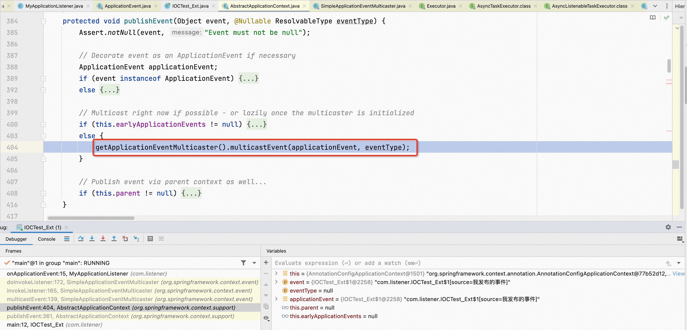

**<font style="color:#F5222D;">笔记来源：</font>**

[02_尚硅谷_组件注册-@Configuration&@Bean给容器中注册组件_哔哩哔哩_bilibili](https://www.bilibili.com/video/BV1gW411W7wy/?p=2&spm_id_from=pageDriver&vd_source=e8046ccbdc793e09a75eb61fe8e84a30)

[Spring Boot](https://www.yuque.com/chenguang201/vi4obw/fbs07n)

# 1 ApplicationListener的概述
ApplicationListener按照字面意思，它应该是Spring里面的应用监听器，也就是Spring为我们提供的基于事件驱动开发的功能。

接下来，我们看一下ApplicationListener的源码，如下图所示，可以看到它是一个接口。


也就是说，如果我们要写一个监听器，那么我们要写的监听器就得实现这个接口，而该接口中带的泛型就是我们要监听的事件。也就是说，我们应该要监听ApplicationEvent及其下面的子事件，因此，如果我们要发布事件，那么所发布的事件应该是ApplicationEvent的子类。

ApplicationListener的作用：它的作用主要是来监听IOC容器中发布的一些事件，只要事件发生便会来触发该监听器的回调，从而来完成事件驱动模型的开发。

# 2 ApplicationListener的用法
首先，编写一个类来实现ApplicationListener接口，例如MyApplicationListener，这实际上就是写了一个监听器。

```java
package com.meimeixia.ext;

import org.springframework.context.ApplicationEvent;
import org.springframework.context.ApplicationListener;
import org.springframework.stereotype.Component;

// 当然了，监听器这东西要工作，我们还得把它添加在容器中
@Component
public class MyApplicationListener implements ApplicationListener<ApplicationEvent> {

	// 当容器中发布此事件以后，下面这个方法就会被触发
	@Override
	public void onApplicationEvent(ApplicationEvent event) {
		// TODO Auto-generated method stub
		System.out.println("收到事件：" + event);
	}

}
```

然后，我们就要来测试一下以上监听器的功能了。试着运行IOCTest_Ext测试类中的test01方法，看能不能收到事件？

```java
package com.meimeixia.test;

import org.junit.Test;
import org.springframework.context.annotation.AnnotationConfigApplicationContext;

import com.meimeixia.ext.ExtConfig;

public class IOCTest_Ext {
	
	@Test
	public void test01() {
		AnnotationConfigApplicationContext applicationContext = new AnnotationConfigApplicationContext(ExtConfig.class);
		
		// 关闭容器
		applicationContext.close();
	}
}
```

如果运行以上test01方法，那么你将会看到控制台打印出了如下内容。


可以看到我们收到了两个事件，这两个事件分别是org.springframework.context.event.ContextRefreshedEvent和org.springframework.context.event.ContextClosedEvent，其中第一个是容器已经刷新完成事件，第二个是容器关闭事件。而且，从下图中可以看到，这两个事件都是ApplicationEvent下面的事件。


只不过现在暂时还没用到容器开始和容器停止这两个事件而已。其实，想必你也已经猜到了，IOC容器在刷新完成之后便会发布ContextRefreshedEvent事件，一旦容器关闭了便会发布ContextClosedEvent事件。

这时，你不禁要问了，我们可不可以自己发布事件呢？当然可以了，只不过此时我们应该遵循如下的步骤来进行开发。

第一步，写一个监听器来监听某个事件。当然了，监听的这个事件必须是ApplicationEvent及其子类。

第二步，把监听器加入到容器中，这样Spring才能知道有这样一个监听器。

第三步，只要容器中有相关事件发布，那么我们就能监听到这个事件。举个例子，就拿我们上面监听的两个事件来说，你要搞清楚的一个问题是谁发布了这两个事件，猜都能猜得到，这两个事件都是由Spring发布的。

+ ContextRefreshedEvent：容器刷新完成事件。即容器刷新完成（此时，所有bean都已完全创建），便会发布该事件。
+ ContextClosedEvent：容器关闭事件。即容器关闭时，便会发布该事件。

其实，在上面我们也看到了，Spring还默认定义了一些其他事件。除此之外，我们自己也可以编写一些自定义事件。但是，问题的关键是我们能不能自己发布事件呢？答案是可以。

第四步，我们自己来发布一个事件。而发布一个事件，我们需要像下面这么来做。

```java
package com.listener;


import org.springframework.context.ApplicationEvent;
import org.springframework.context.annotation.AnnotationConfigApplicationContext;


public class IOCTest_Ext {
    public static void main(String[] args) {
        AnnotationConfigApplicationContext applicationContext = new AnnotationConfigApplicationContext(ExtConfig.class);

        applicationContext.publishEvent(new ApplicationEvent(new String("我发布的事件")) {

        });
        // 关闭容器
        applicationContext.close();
    }
}
```

此时，运行以上方法，你将会看到控制台打印出了如下内容。


除了能收到容器刷新完成和容器关闭这俩事件之外，还能收到我们调用applicationContext发布出去的事件。只要把这个事件发布出去，那么我们自己编写的监听器就能监听到这个事件。

以上就是ApplicationListener应用监听器的使用。那么，ApplicationListener到底是怎么工作的呢？我们下一讲就来讲讲它内部的原理。

# 3 <font style="color:rgb(34, 34, 38);">ApplicationListener原理</font>
在上面，我们是编写了一个监听器，即ApplicationListener接口的一个实现类，通过这个监听器，我们可以来监听容器中的事件，只要容器中有事件发布，监听器中的方法就会得到回调。除此之外，我们还可以自己利用IOC容器的publishEvent方法来自定义发布一个事件，也就是说，我们自己也是能够发布一个事件的。

回顾完毕，接下来，咱们就来说说本讲所要阐述的内容，即事件的整个发布和事件监听机制的内部原理。


事件监听机制的源码分析

在研究分析事件的整个发布和事件监听机制的内部原理之前，我们先来运行一下如下试类中的方法。

```java
package com.listener;


import org.springframework.context.ApplicationEvent;
import org.springframework.context.annotation.AnnotationConfigApplicationContext;


public class IOCTest_Ext {
    public static void main(String[] args) {
        AnnotationConfigApplicationContext applicationContext = new AnnotationConfigApplicationContext(ExtConfig.class);

        applicationContext.publishEvent(new ApplicationEvent(new String("我发布的事件")) {

        });
        // 关闭容器
        applicationContext.close();
    }
}
```

运行完毕，你会发现控制台打印出了如下三个咱们收到的事件。

+ ContextRefreshedEvent事件
+ 我们自己发布的一个事件，即IOCTest_Ext$1[source=我发布的事件]
+ ContextClosedEvent事件


接下来，我们就要来分析一下以上这三个事件都是怎么收到的？

## 3.1 ContextRefreshedEvent
首先，我们在自己编写的监听器（例如MyApplicationListener）内的onApplicationEvent方法处打上一个断点，如下图所示。


然后，以debug的方式运行IOCTest_Ext测试类中的方法，如下图所示，程序现在停到了咱们自己编写的监听器的onApplicationEvent方法中。


很明显，现在我们看到的是收到的第一个事件，即ContextRefreshedEvent事件。那么问题来了，我们是怎么收到的该事件呢？我们不妨从IOCTest_Ext测试类中的方法开始，来梳理一遍整个流程。

如下图所示：我们看一下栈帧


可以看到第一步是要来创建IOC容器的。继续跟进代码，可以看到在创建容器的过程中，还会调用一个refresh方法来刷新容器，刷新容器其实就是创建容器里面的所有bean。


继续跟进代码，看这个refresh方法里面具体都做了些啥，如下所示，可以看到它里面调用了如下一个finishRefresh方法，顾名思义，该方法就是来完成容器的刷新工作的。

```java
@Override
public void refresh() throws BeansException, IllegalStateException {
    synchronized (this.startupShutdownMonitor) {
        // Prepare this context for refreshing.
        prepareRefresh();

        // Tell the subclass to refresh the internal bean factory.
        ConfigurableListableBeanFactory beanFactory = obtainFreshBeanFactory();

        // Prepare the bean factory for use in this context.
        prepareBeanFactory(beanFactory);

        try {
            // Allows post-processing of the bean factory in context subclasses.
            postProcessBeanFactory(beanFactory);

            // Invoke factory processors registered as beans in the context.
            invokeBeanFactoryPostProcessors(beanFactory);

            // Register bean processors that intercept bean creation.
            registerBeanPostProcessors(beanFactory);

            // Initialize message source for this context.
            initMessageSource();

            // Initialize event multicaster for this context.
            initApplicationEventMulticaster();

            // Initialize other special beans in specific context subclasses.
            onRefresh();

            // Check for listener beans and register them.
            registerListeners();

            // Instantiate all remaining (non-lazy-init) singletons.
            finishBeanFactoryInitialization(beanFactory);

            // Last step: publish corresponding event.
            finishRefresh();
        }

        catch (BeansException ex) {
            if (logger.isWarnEnabled()) {
                logger.warn("Exception encountered during context initialization - " +
                            "cancelling refresh attempt: " + ex);
            }

            // Destroy already created singletons to avoid dangling resources.
            destroyBeans();

            // Reset 'active' flag.
            cancelRefresh(ex);

            // Propagate exception to caller.
            throw ex;
        }

        finally {
            // Reset common introspection caches in Spring's core, since we
            // might not ever need metadata for singleton beans anymore...
            resetCommonCaches();
        }
    }
}
```


对于这个refresh方法而言，想必你是再熟悉不过了，它里面做了很多的事情，也就是说，在容器刷新这一步中做了很多的事情，比如执行BeanFactoryPostProcessor组件的方法、给容器中注册后置处理器等等，这些之前我就已经详细讲解过了，故在这儿只是稍微提及一下，并不再过多赘述。

容器刷新完成，发布ContextRefreshedEvent事件

当容器刷新完成时，就会调用finishRefresh方法，那么该方法里面又做了哪些事呢？我们继续跟进代码，如下图所示，发现容器刷新完成时调用的finishRefresh方法里面又调用了一个叫publishEvent的方法，而且传递进该方法的参数是new出来的一个ContextRefreshedEvent对象。这一切都在说明着，容器在刷新完成以后，便会发布一个ContextRefreshedEvent事件。


接下来，我们就来看看ContextRefreshedEvent事件的发布流程。


事件发布流程

当容器刷新完成时，就会来调用一个叫publishEvent的方法，而且会向该方法中传递一个ContextRefreshedEvent对象。这即是发布了一个事件，这个事件呢，正是我们第一个感知到的事件，即容器刷新完成事件。接下来，我们就来看看这个事件到底是怎么发布的。

继续跟进代码，可以看到程序来到了如下图所示的地方。


我们继续跟进代码，可以看到程序来到了如下图所示的这行代码处。


可以看到先是调用一个getApplicationEventMulticaster方法，从该方法的名字中就可以看出，它是来获取事件多播器的，不过也有人叫事件派发器。接下来，我们就可以说说ContextRefreshedEvent事件的发布流程了。

首先，调用getApplicationEventMulticaster方法来获取到事件多播器，或者，你叫事件派发器也行。所谓的事件多播器就是指我们要把一个事件发送给多个监听器，让它们同时感知。

然后，调用事件多播器的multicastEvent方法，这个方法就是用来向各个监听器派发事件的。那么，它到底是怎么来派发事件的呢？

继续跟进代码，来好好看看multicastEvent方法是怎么写的，如下图所示。


可以看到，一开始就有一个for循环，在这个for循环中，有一个getApplicationListeners方法，它是来拿到所有的ApplicationListener的，拿到之后就会来挨个遍历再来拿到每一个ApplicationListener。

很快，你会看到有一个if判断，它会判断getTaskExecutor方法能不能够返回一个Executor对象，如果能够，那么会利用Executor的异步执行功能来使用多线程的方式异步地派发事件；如果不能够，那么就使用同步的方式直接执行ApplicationListener的方法。

细心一点的同学，可以点进去Executor里面去看一看，你会发现它是一个接口，并且Spring提供了一个叫TaskExecutor的子接口来继承它。在该子接口下，Spring又提供了一个SyncTaskExecutor类来实现它，以及一个AsyncTaskExecutor接口来继承它，如下图所示。


不用我说，大家都应该知道，SyncTaskExecutor支持以同步的方式来执行某一任务，AsyncTaskExecutor支持以异步的方式来执行某一任务。也就是说，我们可以在自定义事件派发器的时候（这个后面就会讲到），给它传递这两种类型的TaskExecutor，让它支持以同步或者异步的方式来派发事件。

现在程序很显然是进入到了else判断语句中，也就是说，现在是使用同步的方式来直接执行ApplicationListener的方法的，相应地，这时是调用了一个叫invokeListener的方法，而且在该方法中传入了当前遍历出来的ApplicationListener。那么问题来了，这个方法的内部又做了哪些事呢？

我们继续跟进代码，可以看到程序来到了如下图所示的地方。这时，invokeListener方法里面调用了一个叫doInvokeListener的方法。


继续跟进代码，可以看到程序来到了如下图所示的这行代码处。看到这儿，你差不多应该知道了这样一个结论，即遍历拿到每一个ApplicationListener之后，会回调它的onApplicationEvent方法。


继续跟进代码，这时，程序就会来到我们自己编写的监听器（例如MyApplicationListener）中，继而来回调它其中的onApplicationEvent方法。


以上就是ContextRefreshedEvent事件的发布流程。

写到这里，我来做一下总结，即总结一下一个事件怎么发布的。首先调用一个publishEvent方法，然后获取到事件多播器，接着为我们派发事件。你看，就是这么简单！

在本讲的最开始，从控制台打印出的内容中，我们可以知道收到的第一个事件就是ContextRefreshedEvent事件。为了让大家能够更加清晰地看到这一点，按下一步让程序继续往下运行，如下图所示，这时控制台打印出了收到的第一个事件，即ContextRefreshedEvent事件。


## 3.2 自己发布的事件
按下快捷键让程序运行到下一个断点，如下图所示，这时是来到了我们自己编写的监听器（例如MyApplicationListener）里面的onApplicationEvent方法中。


这里，我们要明白一点，这儿是我们自己发布的事件，就是调用容器的publishEvent方法发布出去的事件，这可以从测试方法的如下这行代码处看出。


接下来，我们就要来看一下咱们自己发布的事件的发布流程了。

这里，我要说一嘴，其实，咱们自己发布的事件的发布流程与上面所讲述的ContextRefreshedEvent事件的发布流程是一模一样的，我为什么会这么说呢，这得看接下来的源码分析了。

继续跟进代码，可以看到程序来到了如下图所示的地方，这不是还是再调用publishEvent方法吗？


我们继续跟进代码，可以看到程序来到了如下图所示的这行代码处。



可以看到，还是先获取到事件多播器，然后再调用事件多播器的multicastEvent方法向各个监听器派发事件。

继续跟进代码，可以看到multicastEvent方法是像下面这样写的。


依然还是拿到所有的ApplicationListener，然后再遍历拿到每一个ApplicationListener，接着来挨个执行每一个ApplicationListener的方法。怎么来执行呢？如果是异步模式，那么就使用异步的方式来执行，否则便使用同步的方式直接执行。

继续跟进代码，可以看到程序来到了如下图所示的地方。这时，invokeListener方法里面调用了一个叫doInvokeListener的方法。


继续跟进代码，可以看到程序来到了如下图所示的这行代码处。依旧能看到，这是遍历拿到每一个ApplicationListener之后，再来回调它的onApplicationEvent方法。


以上就是咱们自己发布的事件的发布流程。

最后，我做一下小结，不管是容器发布的事件，还是咱们自己发布的事件，都会走以上这个事件发布流程，即先拿到事件多播器，然后再拿到所有的监听器，接着再挨个回调它的方法。

## 3.3 ContextClosedEvent事件
接下来，可想而知，就应该是要轮到最后一个事件了，即容器关闭事件。我们按下快捷键让程序运行到下一个断点，如下图所示，可以看到控制台打印出了收到的第二个事件，即我们自己发布的事件。


而且，从上图中也能看到，这时程序来到了我们自己编写的监听器（例如MyApplicationListener）里面的onApplicationEvent方法中。

下面，我们就来看看容器关闭事件的发布流程。首先我们先看一下栈帧，如下图所示。


以上这行代码说的就是来关闭容器，那么容器是怎么关闭的呢？我们继续跟进代码，发现关闭容器的close方法里面又调用了一个doClose方法，如下图所示。


继续跟进代码，如下图所示，可以看到doClose方法里面又调用了一个publishEvent方法，而且传递进该方法的参数是new出来的一个ContextClosedEvent对象。这一切都在说明着，关闭容器，会发布一个ContextClosedEvent事件。


当然不管怎么发布，ContextClosedEvent事件所遵循的发布流程和上面讲述的一模一样。


## 3.4 事件多播器
有关事件多播器，这些是你应该知道的

你知道事件多播器是怎么拿到的吗？

接下来，我们得来说另一点了。你是不是注意到了这一点，在上面我们讲述事件发布的流程时，会通过一个getApplicationEventMulticaster方法来获取事件多播器，我们不妨看一下该方法是怎么写的，如下图所示。


通过该方法可以获取到事件多播器，很显然，applicationEventMulticaster这么一个玩意代表的就是事件多播器。那么问题来了，我们是从哪获取到的事件多播器的呢？下面我就要为大家揭晓谜团了，给大家说一下它是怎么拿到的。

首先，创建IOC容器。我们知道，在创建容器的过程中，还会调用一个refresh方法来刷新容器，如下图所示。


然后，我们就要来看看这个refresh方法具体都做了哪些事。该方法我们已经很熟悉了，如下图所示，可以看到在该方法中会调非常多的方法，其中就有一个叫initApplicationEventMulticaster的方法，顾名思义，它就是来初始化ApplicationEventMulticaster的。而且，它还是在初始化创建其他组件之前调用的。


那么，初始化ApplicationEventMulticaster的逻辑又是怎样的呢？我们也可以来看一看，进入initApplicationEventMulticaster方法里面，如下图所示。


上述这个方法，你能看得懂吗？其实很简单，它就是先判断IOC容器（也就是BeanFactory）中是否有id等于applicationEventMulticaster的组件，这个我是咋知道的呢？因为APPLICATION_EVENT_MULTICASTER_BEAN_NAME这个常量就是字符串applicationEventMulticaster，如下图所示。


如果IOC容器中有id等于applicationEventMulticaster的组件，那么就会通过getBean方法直接拿到这个组件；如果没有，那么就重新new一个SimpleApplicationEventMulticaster类型的事件多播器，然后再把这个事件多播器注册到容器中，也就是说，这相当于我们自己给容器中注册了一个事件多播器，这样，以后我们就可以在其他组件要派发事件的时候，自动注入这个事件多播器就行了。其实说白了，在整个事件派发的过程中，我们可以自定义事件多播器。

以上就是我们这个事件多播器它是怎么拿到的。

你知道容器是怎么将容器中的监听器注册到事件多播器中去的吗？

还记得我们在分析事件发布流程时，有一个叫getApplicationListeners的方法吗？


通过该方法就能知道容器中有哪些监听器。

那么问题来了，容器中到底有哪些监听器呢？其实，这个问题的答案很简单，因为我们把监听器早就已经添加到了容器中，所以，容器只需要判断一下哪些组件是监听器就行了。我为什么会这么说呢？这就得分析源码才能得出了。

首先，依旧还是创建IOC容器。我们也知道，在创建容器的过程中，还会调用一个refresh方法来刷新容器。

然后，我们就要来看看这个refresh方法具体都做了哪些事。该方法我们已经超熟悉了，如下图所示，可以看到在该方法中会调非常多的方法，其中就有一个叫registerListeners的方法，顾名思义，它就是来注册监听器的。


那到底是怎么来注册监听器的呢？我们可以点进去该方法里面看一看，如下图所示，可以看到它是先从容器中拿到所有的监听器，然后再把它们注册到applicationEventMulticaster当中。


当然了，第一次调用该方法时，getApplicationListeners方法是获取不到容器中所有的监听器的，因为这些监听器还没注册到容器中。

所以，第一次调用该方法时，它会调用getBeanNamesForType方法从容器中拿到所有ApplicationListener类型的组件（即监听器），然后再把这些组件注册到事件派发器中。

这样，事件派发器里面就有这些监听器了，容器中到底有哪些监听器我们自然也就知道了。

接下来，就不用我说了吧！自然是事件派发器向各个监听器派发事件了。

# 47. <font style="color:rgb(34, 34, 38);">4 @EventListener</font>
在上面，我们讲了一下事件监听机制的内部原理，当然了，在一过程中，我们也看到了事件的整个发布流程。再回顾一下的话，你会发现之前咱们编写的监听器都是来实现ApplicationListener这个接口的，其实，除此之外，还有另外一种方式。因此，这一讲，我们就来着重讲述这种方式。

这里我先提一下这种方式，即使用@EventListener注解，我们就可以让任意方法都能监听事件。这样的话，我们在一个普通的业务逻辑组件中，就可以直接来使用这个注解了，而不是让它去实现ApplicationListener这个接口。


## 4.1 @EventListener的用法
首先，编写一个普通的业务逻辑组件，例如UserService，并在该组件上标注一个@Service注解。

```java
package com.meimeixia.ext;

import org.springframework.stereotype.Service;

@Service
public class UserService {
	
}
```

在该组件内，我们肯定会写一些很多的方法，但这里就略去了。那么问题来了，如果我们希望该组件能监听到事件，那么该怎么办呢？我们可以在该组件内写一个listen方法，以便让该方法来监听事件。这时，我们只需要简单地给该方法上标注一个@EventListener注解，就可以让它来监听事件了。那么，到底要监听哪些事件呢？我们可以通过@EventListener注解中的classes属性来指定，例如，我们可以让listen方法监听ApplicationEvent及其下面的子事件。

```java
package com.meimeixia.ext;

import org.springframework.context.ApplicationEvent;
import org.springframework.context.event.EventListener;
import org.springframework.stereotype.Service;

@Service
public class UserService {
	
	// 一些其他的方法...

	@EventListener(classes=ApplicationEvent.class)
	public void listen() {
		System.out.println("UserService...");
	}
	
}
```

当然了，我们还可以通过@EventListener注解中的classes属性来指定监听多个事件。

```java
package com.meimeixia.ext;

import org.springframework.context.ApplicationEvent;
import org.springframework.context.event.EventListener;
import org.springframework.stereotype.Service;

@Service
public class UserService {
	
	// 一些其他的方法...

	// @EventListener(classes=ApplicationEvent.class)
	@EventListener(classes={ApplicationEvent.class})
    public void listen() {
        System.out.println("UserService...");
    }
}
	
```

如果ApplicationEvent及其下面的子事件发生了，那么我们应该怎么办呢？想都不用想，肯定是拿到这个事件，因此我们就要在listen方法的参数位置上写一个ApplicationEvent参数来接收该事件。

```java
package com.meimeixia.ext;

import org.springframework.context.ApplicationEvent;
import org.springframework.context.event.EventListener;
import org.springframework.stereotype.Service;

@Service
public class UserService {
	
	// 一些其他的方法...

	// @EventListener(classes=ApplicationEvent.class)
	@EventListener(classes={ApplicationEvent.class})
	public void listen(ApplicationEvent event) {
		System.out.println("UserService...监听到的事件：" + event);
	}
	
}
```

以上就是我们自己编写的一个普通的业务逻辑组件，该组件就能监听事件，这跟实现ApplicationListener接口的效果是一模一样的。

然后，我们就要来进行测试了，就是运行一下以下IOCTest_Ext测试类中的方法。

```java
package com.meimeixia.test;

import org.junit.Test;
import org.springframework.context.ApplicationEvent;
import org.springframework.context.annotation.AnnotationConfigApplicationContext;

import com.meimeixia.ext.ExtConfig;

public class IOCTest_Ext {
	
	@Test
	public void test01() {
		AnnotationConfigApplicationContext applicationContext = new AnnotationConfigApplicationContext(ExtConfig.class);
		
		// 发布一个事件
		applicationContext.publishEvent(new ApplicationEvent(new String("我发布的事件")) {
		});
		
		// 关闭容器
		applicationContext.close();
	}

}
```

你会发现控制台打印出了如下内容，可以清晰地看到，不仅我们之前编写的监听器（例如MyApplicationListener）收到了事件，而且UserService组件也收到了事件。也就是说，每一个都能正确地收到事件。


这里我得说一嘴，以后咱们对@EventListener这个注解的使用会比较多，因为它使用起来非常方便。

接下来，我们就得说说这个注解背后的原理了。


## 4.2 @EventListener原理
我们可以点进去@EventListener这个注解里面去看一看，如下图所示，可以看到这个注解上面有一大堆的描述，从描述中我们是否可以猜到这个注解的内部工作原理呢？答案是可以的。


描述中有一个醒目的字眼，即参考EventListenerMethodProcessor。意思可能是说，如果你想搞清楚@EventListener注解的内部工作原理，那么可以参考EventListenerMethodProcessor这个类。

EventListenerMethodProcessor是啥呢？它就是一个处理器，其作用是来解析方法上的@EventListener注解的。这也就是说，Spring会使用EventListenerMethodProcessor这个处理器来解析方法上的@EventListener注解。因此，接下来，我们就要将关注点放在这个处理器上，搞清楚这个处理器是怎样工作的。搞清楚了这个，自然地我们就搞清楚了@EventListener注解的内部工作原理。

我们点进去EventListenerMethodProcessor这个类里面去看一看，如下图所示，发现它实现了一个接口，叫SmartInitializingSingleton。这时，要想搞清楚EventListenerMethodProcessor这个处理器是怎样工作的，那就得先搞清楚SmartInitializingSingleton这个接口的原理了。


不妨点进去SmartInitializingSingleton这个接口里面去看一看，你会发现它里面定义了一个叫afterSingletonsInstantiated的方法，如下图所示。


接下来，我们就要搞清楚到底是什么时候开始触发执行afterSingletonsInstantiated方法的。

仔细看一下SmartInitializingSingleton接口中afterSingletonsInstantiated方法上面的描述信息，不难看出该方法是在所有的单实例bean已经全部被创建完了以后才会被执行。

其实，在介绍SmartInitializingSingleton接口的时候，我们也能从描述信息中知道，在所有的单实例bean已经全部被创建完成以后才会触发该接口。紧接着下面一段的描述还说了，该接口的调用时机有点类似于ContextRefreshedEvent事件，即在容器刷新完成以后，便会回调该接口。也就是说，这个时候容器已经创建完了。

好吧，回到主题，我们来看看afterSingletonsInstantiated方法的触发时机。首先，我们得在EventListenerMethodProcessor类里面的afterSingletonsInstantiated方法处打上一个断点，如下图所示。


然后，以debug的方式运行IOCTest_Ext测试类中的方法，这时程序停留在了EventListenerMethodProcessor类里面的afterSingletonsInstantiated方法中，如下图所示。


此时，你是不是很想知道是什么时候开始触发执行afterSingletonsInstantiated这个方法的呢？我们不妨从IOCTest_Ext测试类中的方法开始，来梳理一遍整个流程。

如下图所示，我们下来看一下栈帧。


可以看到第一步是要来创建IOC容器的。继续跟进代码，可以看到在创建容器的过程中，还会调用一个refresh方法来刷新容器，刷新容器其实就是创建容器里面的所有bean。

继续跟进代码，看这个refresh方法里面具体都做了些啥，如下图所示，可以看到它里面调用了如下一个finishBeanFactoryInitialization方法，顾名思义，该方法就是来完成BeanFactory的初始化工作的。


对于以上这个方法，我相信大家都不会陌生，因为我们之前就看过好多遍了，它其实就是来初始化所有剩下的那些单实例bean的。也就是说，如果还有一些单实例bean还没被初始化，即还没创建对象，那么便会在这一步进行（初始化）。

继续跟进代码，如下图所示，可以看到在finishBeanFactoryInitialization方法里面执行了如下一行代码，依旧还是来初始化所有剩下的单实例bean。


继续跟进代码，如下图所示，可以看到现在程序停留在了如下这行代码处。


这不就是我们要讲的afterSingletonsInstantiated方法吗？它原来是在这儿调用的啊！接下来，咱们就得好好看看在调用该方法之前，具体都做了哪些事。

由于afterSingletonsInstantiated方法位于DefaultListableBeanFactory类的preInstantiateSingletons方法里面，所以我们就得来仔细看看preInstantiateSingletons方法里面具体都做了些啥了。

进入眼帘的首先是一个for循环，在该for循环里面，beanNames里面存储的都是即将要创建的所有bean的名字，紧接着会做一个判断，即判断bean是不是抽象的，是不是单实例的，等等等等。最后，不管怎样，都会调用getBean方法来创建对象。

```java
	@Override
	public void preInstantiateSingletons() throws BeansException {
		if (logger.isTraceEnabled()) {
			logger.trace("Pre-instantiating singletons in " + this);
		}

		// Iterate over a copy to allow for init methods which in turn register new bean definitions.
		// While this may not be part of the regular factory bootstrap, it does otherwise work fine.
		List<String> beanNames = new ArrayList<>(this.beanDefinitionNames);

		// Trigger initialization of all non-lazy singleton beans...
		for (String beanName : beanNames) {
			RootBeanDefinition bd = getMergedLocalBeanDefinition(beanName);
			if (!bd.isAbstract() && bd.isSingleton() && !bd.isLazyInit()) {
				if (isFactoryBean(beanName)) {
					Object bean = getBean(FACTORY_BEAN_PREFIX + beanName);
					if (bean instanceof FactoryBean) {
						FactoryBean<?> factory = (FactoryBean<?>) bean;
						boolean isEagerInit;
						if (System.getSecurityManager() != null && factory instanceof SmartFactoryBean) {
							isEagerInit = AccessController.doPrivileged(
									(PrivilegedAction<Boolean>) ((SmartFactoryBean<?>) factory)::isEagerInit,
									getAccessControlContext());
						}
						else {
							isEagerInit = (factory instanceof SmartFactoryBean &&
									((SmartFactoryBean<?>) factory).isEagerInit());
						}
						if (isEagerInit) {
							getBean(beanName);
						}
					}
				}
				else {
					getBean(beanName);
				}
			}
		}

		// Trigger post-initialization callback for all applicable beans...
		for (String beanName : beanNames) {
			Object singletonInstance = getSingleton(beanName);
			if (singletonInstance instanceof SmartInitializingSingleton) {
				SmartInitializingSingleton smartSingleton = (SmartInitializingSingleton) singletonInstance;
				if (System.getSecurityManager() != null) {
					AccessController.doPrivileged((PrivilegedAction<Object>) () -> {
						smartSingleton.afterSingletonsInstantiated();
						return null;
					}, getAccessControlContext());
				}
				else {
					smartSingleton.afterSingletonsInstantiated();
				}
			}
		}
	}
```

总结一下就是，先利用一个for循环拿到所有我们要创建的单实例bean，然后挨个调用getBean方法来创建对象。也即，创建所有的单实例bean。

再来往下翻阅preInstantiateSingletons方法，发现它下面还有一个for循环，在该for循环里面，beanNames里面依旧存储的是即将要创建的所有bean的名字。那么，在该for循环中所做的事情又是什么呢？很显然，在最上面的那个for循环中，所有的单实例bean都已经全部创建完了。因此，在下面这个for循环中，咱们所要做的事就是获取所有创建好的单实例bean，然后判断每一个bean对象是否是SmartInitializingSingleton这个接口类型的，如果是，那么便调用它里面的afterSingletonsInstantiated方法，而该方法就是SmartInitializingSingleton接口中定义的方法。

至此，你该搞清楚afterSingletonsInstantiated方法是什么时候开始触发执行了吧！就是在所有单实例bean全部创建完成以后。

最后，我还得说一嘴。如果所有的单实例bean都已经创建完了，也就是说下面这一步都执行完了，那么说明IOC容器已经创建完成了。

那么，紧接着便会来调用finishRefresh方法，容器已经创建完了，此时就会来发布容器已经刷新完成的事件。这就呼应了开头的那句话，即SmartInitializingSingleton接口的调用时机有点类似于ContextRefreshedEvent事件，即在容器刷新完成以后，便会回调该接口。

以上就是@EventListener注解的内部工作原理，在讲解该原理时，我们顺道说了一下SmartInitializingSingleton接口的原理。

