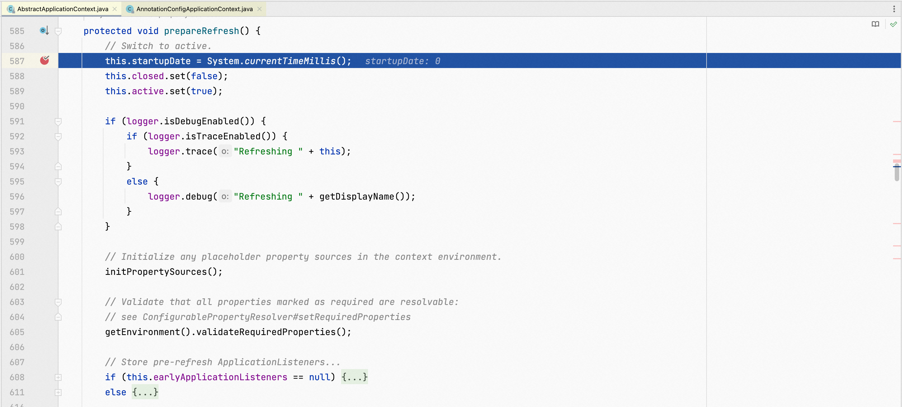
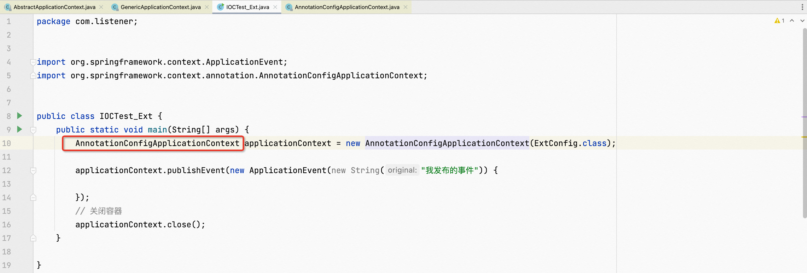
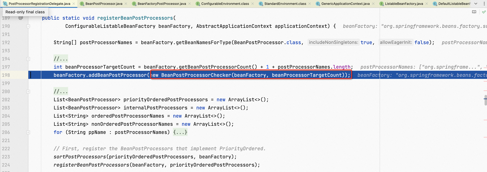

**<font style="color:#F5222D;">笔记来源：</font>**[**<font style="color:#F5222D;">尚硅谷Spring注解驱动教程(雷丰阳源码级讲解)</font>**](https://www.bilibili.com/video/BV1gW411W7wy/?p=2&spm_id_from=pageDriver&vd_source=e8046ccbdc793e09a75eb61fe8e84a30)


**<font style="color:#2F8EF4;">前言</font>**

在前面，我们已经学会了怎样来使用ApplicationListener，也研究了一下其内部原理。而从这一讲开始，我们就要结合我们以前学过的所有内容，来梳理一下Spring整个容器的创建以及初始化过程。我是希望通过对Spring源码的整个分析，令大家对Spring内部的工作原理以及运行机制能有一个更深刻的理解。

接下来，我们来分析并详细记录一下Spring容器的创建以及初始化过程。

BeanFactory的创建以及预准备工作

我们先来看一下如下的一个单元测试类。

```java
package com.meimeixia.test;

import org.junit.Test;
import org.springframework.context.ApplicationEvent;
import org.springframework.context.annotation.AnnotationConfigApplicationContext;

import com.meimeixia.ext.ExtConfig;

public class IOCTest_Ext {

    @Test
    public void test01() {
        AnnotationConfigApplicationContext applicationContext = new AnnotationConfigApplicationContext(ExtConfig.class);

        // 发布一个事件
        applicationContext.publishEvent(new ApplicationEvent(new String("我发布的事件")) {
        });

        // 关闭容器
        applicationContext.close();
    }
}
```

我们知道如下这样一行代码是来new一个IOC容器的，而且还可以看到传入了一个配置类。

```java
AnnotationConfigApplicationContext applicationContext = new AnnotationConfigApplicationContext(ExtConfig.class);
```

我们不妨点进去AnnotationConfigApplicationContext类的有参构造方法里面去看一看，如下图所示，相信大家对该有参构造方法是再熟悉不过了。


由于我们现在是来分析Spring容器的创建以及初始化过程，所以我们将核心的关注点放在refresh方法上，也即刷新容器。该方法运行完以后，容器就创建完成了，包括所有的bean对象也都创建和初始化完成了。

接下来，重点分析一下刷新容器这个方法里面到底做了些什么事。

总共12个步骤

```java
	@Override
	public void refresh() throws BeansException, IllegalStateException {
		synchronized (this.startupShutdownMonitor) {
			// Prepare this context for refreshing.
			prepareRefresh();

			// Tell the subclass to refresh the internal bean factory.
			ConfigurableListableBeanFactory beanFactory = obtainFreshBeanFactory();

			// Prepare the bean factory for use in this context.
			prepareBeanFactory(beanFactory);

			try {
				// Allows post-processing of the bean factory in context subclasses.
				postProcessBeanFactory(beanFactory);

				// Invoke factory processors registered as beans in the context.
				invokeBeanFactoryPostProcessors(beanFactory);

				// Register bean processors that intercept bean creation.
				registerBeanPostProcessors(beanFactory);

				// Initialize message source for this context.
				initMessageSource();

				// Initialize event multicaster for this context.
				initApplicationEventMulticaster();

				// Initialize other special beans in specific context subclasses.
				onRefresh();

				// Check for listener beans and register them.
				registerListeners();

				// Instantiate all remaining (non-lazy-init) singletons.
				finishBeanFactoryInitialization(beanFactory);

				// Last step: publish corresponding event.
				finishRefresh();
			}

			catch (BeansException ex) {
				if (logger.isWarnEnabled()) {
					logger.warn("Exception encountered during context initialization - " +
							"cancelling refresh attempt: " + ex);
				}

				// Destroy already created singletons to avoid dangling resources.
				destroyBeans();

				// Reset 'active' flag.
				cancelRefresh(ex);

				// Propagate exception to caller.
				throw ex;
			}

			finally {
				// Reset common introspection caches in Spring's core, since we
				// might not ever need metadata for singleton beans anymore...
				resetCommonCaches();
			}
		}
	}
```

# 1 prepareRefresh
进入refresh方法里面，如下图所示，可以看到映入眼帘的是一个线程安全的锁机制，除此之外，你还能看到第一个方法，即prepareRefresh方法，顾名思义，它是来执行刷新容器前的预处理工作的。


那么问题来了，刷新容器前的这个预处理工作它到底都做了哪些事呢？下面我们就来详细说说。

`prepareRefresh()`刷新容器前的预处理工作

运行到prepareRefresh方法处时，进入该方法里面，如下图所示



发现就是先记录下当前时间，然后设置下当前容器是否是关闭、是否是活跃的等状态，除此之外，还会打印当前容器的刷新日志。如果你要是不信的话，那么可以让程序往下运行，直至运行到initPropertySources方法处，你便能看到控制台打印出了一些当前容器的刷新日志，如下图所示。


这时，我们看到了第一个方法，即initPropertySources方法。那么，它里面做了些啥事呢？

initPropertySources()：子类自定义个性化的属性设置的方法

顾名思义，该方法是来初始化一些属性设置的。那么，该方法里面究竟做了些啥事呢？我们不妨进去一探究竟，按下快捷键进入该方法中，如下图所示，发现它是空的，没有做任何事情。


但是，我们要注意该方法是protected类型的，这意味着它是留给子类自定义个性化的属性设置的。例如，我们可以自己来写一个AnnotationConfigApplicationContext的子类，在容器刷新的时候，重写这个方法，这样，我们就可以在子类（也叫子容器）的该方法中自定义一些个性化的属性设置了。

这个方法只有在子类自定义的时候有用，只不过现在它还是空的，里面啥也没做。

getEnvironment().validateRequiredProperties()：获取其环境变量，然后校验属性的合法性

继续让程序往下运行，直至运行到以下这行代码处。


这行代码的意思很容易知道，前面不是自定义了一些个性化的属性吗？这儿就是来校验这些属性的合法性的。

那么是怎么来进行属性校验的呢？首先是要来获取其环境变量，你可以按下快捷键进入getEnvironment方法中去看看，如下图所示，可以看到该方法就是用来获取其环境变量的。


再次按下快捷键进入validateRequiredProperties方法中去看看，可以看到就是使用属性解析器来进行属性校验的。

只不过，我们现在没有自定义什么属性，所以，此时并没有做任何属性校验工作。

保存容器中早期的事件

继续按下快捷键让程序往下运行


至此，我们就分析完了prepareRefresh方法，以上就是该方法所做的事情。我们发现这个方法和BeanFactory并没有太大关系，因此，接下来我们还得来看下一个方法，即obtainFreshBeanFactory方法。

# 2 obtainFreshBeanFactory
obtainFreshBeanFactory()：获取BeanFactory对象

继续按下快捷键让程序往下运行，直至运行至以下这行代码处。


可以看到一个叫obtainFreshBeanFactory的方法，顾名思义，它是来获取BeanFactory的实例的。接下来，我们就来看看该方法里面究竟做了哪些事。


refreshBeanFactory()：创建BeanFactory对象，并为其设置一个序列化id

发现首先调用了一个叫refreshBeanFactory的方法，该方法见名思义，应该是来刷新BeanFactory的。那么，该方法里面又做了哪些事呢？

我们可以按下快捷键进入该方法中去看看，如下图所示，发现程序来到了GenericApplicationContext类里面。


而且，我们还可以看到在以上refreshBeanFactory方法中，会先判断是不是重复刷新了。于是，我们继续按下快捷键让程序往下运行，发现程序并没有进入到if判断语句中，而是来到了下面这行代码处。


程序运行到这里，你会不会有一个大大的疑问，那就是我们的beanFactory不是还没创建么，怎么在这儿又开始调用方法了呢，难道是已经创建了吗？

我们向上翻阅GenericApplicationContext类的代码，发现原来是在这个类的无参构造方法里面，就已经实例化了beanFactory这个对象。也就是说，在创建GenericApplicationContext对象时，无参构造器里面就new出来了beanFactory这个对象。


相当于我们做了非常核心的一步，即创建了一个beanFactory对象，而且该对象还是DefaultListableBeanFactory类型的。

现在，我们已经知道了在GenericApplicationContext这个类的无参构造方法里面，就已经实例化了beanFactory这个对象。那么，你可能会有疑问，究竟是在什么地方调用GenericApplicationContext类的无参构造方法的呢？

这时，我们可以去看一下我们的单元测试类（例如IOCTest_Ext），如下图所示。



只要点进去AnnotationConfigApplicationContext类里面去看一看，你就知道大概了，如下图所示，原来AnnotationConfigApplicationContext类继承了GenericApplicationContext这个类，所以，当我们实例化AnnotationConfigApplicationContext时就会调用其父类的构造方法，相应地这时就会对我们的BeanFactory进行实例化了。


好了，我们不扯远了，还是回到主题。BeanFactory对象创建好了之后，接下来就是要给其设置一个序列化id，相当于打了一个id标识。我们不妨Inspect一下getId方法的值，发现它是org.springframework.context.annotation.AnnotationConfigApplicationContext@77b52d12这么一长串的字符串，原来这个序列化id就是它啊！


按下快捷键让程序往下运行，refreshBeanFactory方法就执行完了。

该方法所做的事情很简单，无非就是创建了一个BeanFactory对象（DefaultListableBeanFactory类型的），并为其设置好了一个序列化id。

getBeanFactory()：返回设置了序列化id后的BeanFactory对象


接下来，我们就要看看getBeanFactory方法了。按下快捷键进入该方法里面，如下图所示，发现它里面就只是做了一件事，即返回设置了序列化id后的BeanFactory对象。


可以看到这儿是用ConfigurationListableBeanFactory接口去接受我们刚刚实例化的BeanFactory对象（DefaultListableBeanFactory类型的）。

那么为什么可以用ConfigurableListableBeanFactory类型来接受呢？


我们发现DefaultListableBeanFactory类是ConfigurableListableBeanFactory接口的一个实现类

程序运行至此，就返回了我们刚刚创建好的那个BeanFactory对象，只不过这个BeanFactory对象，由于我们刚创建，所以它里面的什么东西都是默认的一些设置。


至此，我们就分析完了obtainFreshBeanFactory方法，以上就是该方法所做的事情，即获取BeanFactory对象。

# 3 prepareBeanFactory
prepareBeanFactory(beanFactory)：BeanFactory的预准备工作，即对BeanFactory进性一些预处理

接下来，我们就得来说道说道prepareBeanFactory方法了。顾名思义，该方法就是对BeanFactory做一些预处理，即BeanFactory的预准备工作。


为什么要在这儿对BeanFactory做一些预处理啊？因为我们前面刚刚创建好的BeanFactory还没有做任何设置呢，所以就得在这儿对BeanFactory做一些设置了。那到底做了哪些设置呢？下面我们就得进入prepareBeanFactory方法里面一探究竟了。

按下快捷键进入该方法中，如下图所示，我们发现会对BeanFactory进行一系列的赋值（即设置一些属性）。比方说，设置BeanFactory的类加载器，就得像下面这样。


以及，设置支持相关表达式语言的解析器。


还有，添加属性的编辑注册器等等，总之，会对BeanFactory设置非常多的东西。


继续向下看prepareBeanFactory方法，你会发现还向BeanFactory中添加了一个BeanPostProcessor，即ApplicationContextAwareProcessor。


温馨提示：这儿只是向BeanFactory中添加了部分的BeanPostProcessor，而不是添加所有的，比如我们现在只是向BeanFactory中添加了一个叫ApplicationContextAwareProcessor的BeanPostProcessor。它的作用，我们之前也看过了，就是在bean初始化以后来判断这个bean是不是实现了ApplicationContextAware接口。

继续向下看prepareBeanFactory方法，可以看到现在是来为BeanFactory设置忽略的自动装配的接口，比如说像EnvironmentAware、EmbeddedValueResolverAware等等这些接口。


那么，设置忽略的自动装配的这些接口有什么作用呢？作用就是，这些接口的实现类不能通过接口类型来自动注入。

继续向下看prepareBeanFactory方法，可以看到现在是来为BeanFactory注册可以解析的自动装配。


所谓的可以解析的自动装配，就是说，我们可以直接在任何组件里面自动注入像BeanFactory、ResourceLoader、ApplicationEventPublisher（它就是上一讲我们讲述的事件派发器）以及ApplicationContext（也就是我们的IOC容器）这些东西。

继续向下看prepareBeanFactory方法，可以看到现在又向BeanFactory中添加了一个BeanPostProcessor，只不过现在添加的是一个叫ApplicationListenerDetector的BeanPostProcessor。


也就是说，会向BeanFactory中添加很多的后置处理器，后置处理器的作用就是在bean初始化前后做一些工作。

继续向下看prepareBeanFactory方法，可以看到有一个if判断语句，它这是向BeanFactory中添加编译时与AspectJ支持相关的东西。


而我们现在默认的这些都是运行时的动态代理，所以你会看到这样一个现象，按下快捷键让程序往下运行，程序并不会进入到以上if判断语句中，而是来到了下面这个if判断语句处。

这儿是在向BeanFactory中注册一些与环境变量相关的bean，比如注册了一个名字是environment，值是当前环境对象（其类型是ConfigurableEnvironment）的bean。


StandardEnvironment是ConfigurableEnvironment接口的具体实现类。

除此之外，还注册了一个名字为systemProperties的bean，也即系统属性，它是通过当前环境对象的getSystemProperties方法获得的。我们来看一下系统属性是个什么东西，进入getSystemProperties方法里面，如下图所示，可以看到系统属性就是一个Map<String, Object>，该Map里面的key/value就是环境变量里面的key/value。


最后，还会注册一个名字为systemEnvironment的bean，即系统的整个环境信息。我们也不妨点进去getSystemEnvironment方法里面去看一下，如下图所示，发现系统的整个环境信息也是一个Map<String, Object>。


也就是说，我们向BeanFactory中注册了以上三个与环境变量相关的bean。以后，如果我们想用的话，只须将它们自动注入即可。

prepareBeanFactory方法就执行完了，相应地，BeanFactory就已经创建好了，里面该设置的属性也都设置了。


# 4 postProcessBeanFactory
postProcessBeanFactory(beanFactory)：BeanFactory准备工作完成后进行的后置处理工作


接下来，我们就得来说道说道postProcessBeanFactory方法了。它说的就是在BeanFactory准备工作完成之后进行的后置处理工作。我们不妨点进去该方法里面看看，它究竟做了哪些事，如下图所示，发现它里面是空的。


这不是和我们刷新容器前的预处理工作中的initPropertySources方法一样吗？方法里面都是空的，默认都是不进行任何处理的，但是方法都是protected类型的，这也就是说子类可以通过重写这个方法，在BeanFactory创建并预处理完成以后做进一步的设置。

这个方法只有在子类重写的时候有用，只不过现在它还是空的，里面啥也没做。

至此，BeanFactory的创建以及预准备工作就已经完成啦

既然有了BeanFactory对象，那么接下来我们就要利用BeanFactory来创建各种组件了。

# 5 invokeBeanFactoryPostProcessors
在上面，我们详细地分析了一下BeanFactory的创建以及预准备工作的流程。接下来我们就要来看看接下来又做了哪些工作。

现在，程序已经运行到了下面这行代码处了。


可以看到这儿会执行一个叫invokeBeanFactoryPostProcessors的方法，这个方法我们之前也看过，它就是来执行BeanFactoryPostProcessor的。而这个BeanFactoryPostProcessor，我们之前也介绍过，如果你要是忘记了，那么可以回顾回顾这篇文章。

[07 BeanFactory后置处理器](https://www.yuque.com/chenguang201/vi4obw/hhrro9lfqh5k7ge8)

现在，你是不是想起来了，它就是BeanFactory的后置处理器。那么，它是什么时候来执行的呢？我们不妨看一下它的源码，如下图所示。


从它内部方法的描述上来看，BeanFactoryPostProcessor（也可以说它里面的那个方法）是在BeanFactory标准初始化之后执行的。而BeanFactory标准初始化正是我们上一讲所阐述的内容。

我们之前也看过BeanFactoryPostProcessor接口的继承树，如下图所示。


可以看到，BeanFactoryPostProcessor接口下还有一个子接口，即BeanDefinitionRegistryPostProcessor。以前，我们还用过BeanDefinitionRegistryPostProcessor这个接口给IOC容器中额外添加过组件，不知你还记不记得？

接下来，我们就来看看invokeBeanFactoryPostProcessors这个方法里面到底做了哪些事，也就是看一下BeanFactoryPostProcessor的整个执行过程。

BeanFactoryPostProcessor的执行过程

其实，当你看完这篇文章之后，你就知道了在invokeBeanFactoryPostProcessors方法里面主要就是执行了BeanDefinitionRegistryPostProcessor的postProcessBeanDefinitionRegistry和postProcessBeanFactory这俩方法，以及BeanFactoryPostProcessors的postProcessBeanFactory方法。

先执行BeanDefinitionRegistryPostProcessor的方法

我们可以按下快捷键进入invokeBeanFactoryPostProcessors方法里面去瞧一瞧，如下图所示，可以看到现在程序来到了如下这行代码处。


以上这个invokeBeanFactoryPostProcessors方法，看名字就知道了，同样是来执行BeanFactoryPostProcessor的方法的，那怎么来执行呢？

在getBeanFactoryPostProcessors方法中，如下图所示，该方法仅仅只是返回了一个空的List<BeanFactoryPostProcessor>集合，该集合是用于存放所有的BeanFactoryPostProcessor的，只不过它现在默认是空的而已，也就是说该集合里面还没存储任何BeanFactoryPostProcessor。


不过，我们可以通过以下addBeanFactoryPostProcessor方法向该集合中添加BeanFactoryPostProcessor。

再进入invokeBeanFactoryPostProcessors方法里面去一探究竟，如下图所示，是不是来到了我们熟悉的地方


其中，一开始的注释就告诉了我们，无论什么时候都会先调用实现了BeanDefinitionRegistryPostProcessor接口的类。

大家一定要注意哟！紧接着会先来判断我们这个beanFactory是不是BeanDefinitionRegistry。之前我们在上一讲中就已经说过了，我们生成的BeanFactory对象是DefaultListableBeanFactory类型的，而且还使用了ConfigurableListableBeanFactory接口进行接收。这里我们就来看下DefaultListableBeanFactory类是不是实现了BeanDefinitionRegistry接口，看下图，很显然是实现了。


自然地，程序就会进入到if判断语句中，进来以后呢，我们来大致地分析一下下面的流程。首先，映入眼帘的是一个for循环，它是来循环遍历invokeBeanFactoryPostProcessors方法中的第二个参数的，即beanFactoryPostProcessors。其实呢，就是拿到所有的BeanFactoryPostProcessor，再挨个遍历出来。然后，再来以遍历出来的每一个BeanFactoryPostProcessor是否实现了BeanDefinitionRegistryPostProcessor接口为依据将其分别存放于以下两个箭头所指向的ArrayList中，其中实现了BeanDefinitionRegistryPostProcessor接口的还会被直接调用。


根据优先级，分别执行BeanDefinitionRegistryPostProcessor的postProcessBeanDefinitionRegistry方法

继续让程序往下运行，直至运行到下面这行代码处，可以看到现在是会拿到所有BeanDefinitionRegistryPostProcessor的这些bean的名字。


有意思的是，如果说你留心的话，那么你会发现每次执行前，都会运行完这么一行代码：

```java
beanFactory.getBeanNamesForType(BeanDefinitionRegistryPostProcessor.class, true, false);
```

这行代码的意思，我上面已经说过了，就是来获取容器中所有实现了BeanDefinitionRegistryPostProcessor接口的组件。那么，为什么每次执行前，都会运行这样一行代码呢？这是因为我们每次执行可能会加载进来新的BeanDefinition，所以每次都要重新获取。

执行实现了PriorityOrdered优先级接口的BeanDefinitionRegistryPostProcessor的postProcessBeanDefinitionRegistry方法

继续按下快捷键让程序往下运行，往下运行一步即可，Inspect一下postProcessorNames变量的值，你会发现从IOC容器中拿到的只有一个名字为org.springframework.context.annotation.internalConfigurationAnnotationProcessor的组件，即默认拿到的是ConfigurationClassPostProcessor这样一个BeanDefinitionRegistryPostProcessor。


这里我稍微提一嘴，第一次获取容器中所有实现了BeanDefinitionRegistryPostProcessor接口的组件时，其实只能获取到ConfigurationClassPostProcessor，因为我们手工加的只是BeanDefinition，等ConfigurationClassPostProcessor把对应的Definition加载后，下面才能获取到我们手工加载的BeanDefinition。

不扯远了，我们还是回到程序中来。获取到容器中所有BeanDefinitionRegistryPostProcessor组件之后，接下来，就得遍历所有这些BeanDefinitionRegistryPostProcessor组件了，挨个遍历出来之后，会判断每一个BeanDefinitionRegistryPostProcessor组件是不是实现了PriorityOrdered这个优先级接口，若是，则会先按照优先级排个序，然后再调用该组件的postProcessBeanDefinitionRegistry方法。

继续按下快捷键让程序往下运行，直至运行到下面这行代码处，这儿就是来执行每一个实现了PriorityOrdered优先级接口的BeanDefinitionRegistryPostProcessor组件的方法的。


如下图所示，可以看到这儿是来执行BeanDefinitionRegistryPostProcessor组件的postProcessBeanDefinitionRegistry方法的。


执行实现了Ordered顺序接口的BeanDefinitionRegistryPostProcessor的postProcessBeanDefinitionRegistry方法

继续按下F6快捷键让程序往下运行，直至运行到下面这行代码处，可以看到在每次执行前都会执行下面一行代码，这是因为我们每次执行可能会加载进来新的BeanDefinition，所以每次都要重新获取所有实现了BeanDefinitionRegistryPostProcessor接口的组件。其实，我在上面已经讲过一遍了，这里再讲一遍，大家可一定要注意哟😀


很明显，这儿是来执行实现了Ordered顺序接口的BeanDefinitionRegistryPostProcessor组件的方法的。

原理同上面都是一模一样的，都是获取到容器中所有BeanDefinitionRegistryPostProcessor组件，紧接着再来遍历所有这些BeanDefinitionRegistryPostProcessor组件，挨个遍历出来之后，会判断每一个BeanDefinitionRegistryPostProcessor组件是不是实现了Ordered这个顺序接口，若是，则会先按照指定顺序来排个序，然后再调用该组件的postProcessBeanDefinitionRegistry方法。


执行没有实现任何优先级或者是顺序接口的BeanDefinitionRegistryPostProcessor的postProcessBeanDefinitionRegistry方法

继续按下快捷键让程序往下运行，直至运行到下面这行代码处。


很明显，这块是来执行没有实现任何优先级或者是顺序接口的BeanDefinitionRegistryPostProcessor组件的方法的。

原理基本同上，首先获取到容器中所有BeanDefinitionRegistryPostProcessor组件，然后遍历所有这些BeanDefinitionRegistryPostProcessor组件，挨个遍历出来之后，接着再调用该组件的postProcessBeanDefinitionRegistry方法。


执行BeanDefinitionRegistryPostProcessor的postProcessBeanFactory方法

因为BeanDefinitionRegistryPostProcessor是BeanFactoryPostProcessor的子接口，所以，接下来还得执行BeanDefinitionRegistryPostProcessor组件里面的postProcessBeanFactory方法。


也就是说，对于BeanDefinitionRegistryPostProcessor组件来说，它里面postProcessBeanDefinitionRegistry方法会先被调用，postProcessBeanFactory方法会后被调用。


再执行BeanFactoryPostProcessor的方法

BeanDefinitionRegistryPostProcessor是要优先于BeanFactoryPostProcessor执行的。在上面已经执行完了BeanDefinitionRegistryPostProcessor的方法，接下来就得来执行BeanFactoryPostProcessor的方法了。

执行的流程是怎样的呢？我们可以大致地来看一下，按下快捷键让程序往下运行，直至程序运行到以下这行代码处，可以看到现在是来从beanFactory中按照类型获取所有BeanFactoryPostProcessor组件的名字。


获取到所有BeanFactoryPostProcessor组件之后，接下来，就得遍历所有这些BeanFactoryPostProcessor组件了，挨个遍历出来之后，按照是否实现了PriorityOrdered接口、Ordered接口以及没有实现这两个接口这三种情况进行分类，将其分别存储于三个ArrayList中。


紧接着，按照顺序依次执行BeanFactoryPostProcessors组件对应的postProcessBeanFactory方法。


也就是说，先来执行实现了PriorityOrdered优先级接口的BeanFactoryPostProcessor组件的postProcessBeanFactory方法，再来执行实现了Ordered顺序接口的BeanFactoryPostProcessor组件的postProcessBeanFactory方法，最后再来执行没有实现任何优先级或者是顺序接口的BeanFactoryPostProcessor组件的postProcessBeanFactory方法。

你有没有发现，程序直至到这儿，才是来执行所有BeanFactoryPostProcessor组件的postProcessBeanFactory方法的呢？

小结

至此，我们知道了一点，那就是invokeBeanFactoryPostProcessors方法最主要的核心作用就是执行了BeanDefinitionRegistryPostProcessor的postProcessBeanDefinitionRegistry和postProcessBeanFactory这俩方法，以及BeanFactoryPostProcessors的postProcessBeanFactory方法。而这正呼应了开头，你说是不是呢？

而且，还有一点我们需要知道，那就是BeanDefinitionRegistryPostProcessor是要优先于BeanFactoryPostProcessor执行的。

# 6 registerBeanPostProcessors
我们刚好讲完invokeBeanFactoryPostProcessors方法，该方法所做的事情无非就是在BeanFactory准备好以后，执行BeanFactoryPostProcessor的方法。

接下来，我们就得来说道说道registerBeanPostProcessors方法了。顾名思义，该方法就是来注册BeanPostProcessor的，即注册bean的后置处理器。其实，从该方法上的描述上，我们也能知道其作用就是注册bean的后置处理器，拦截bean的创建过程。


其实，我们之前在深扒AOP的原理时，就已经debug跟踪过该方法了。我说得更具体点，在创建AOP的核心类时，就是调用这个方法来进行处理的。不记得的同学，可以翻阅我之前写的文章

[05 AOP](https://www.yuque.com/chenguang201/vi4obw/zkerskd341g09gph)


注册BeanPostProcessor

获取所有的BeanPostProcessor

按下快捷键进入registerBeanPostProcessors方法里面，如下图所示，可以看到在该方法里面会调用PostProcessorRegistrationDelegate类的registerBeanPostProcessors方法。


于是，我们再次按下快捷键进入以上方法中，如下图所示，可以看到一开始就会获取所有BeanPostProcessor组件的名字。


这里，我得提醒大家的一点是BeanPostProcessor接口旗下有非常多的子接口，这一点你查看一下BeanPostProcessor接口的继承树就知道了，如下图所示。


看到了吗，BeanPostProcessor接口旗下是不是有很多子接口啊，而且每一个子接口，还有点不一样。这里，我也只会挑出如下的几个子接口将其罗列出来，目的是为了告诉大家BeanPostProcessor接口旗下确实是有非常多的子接口，而且这些不同接口类型的BeanPostProcessor在bean创建前后的执行时机是不一样的，虽然它们都是后置处理器。

+ DestructionAwareBeanPostProcessor：该接口我们之前是不是说过啊？它是销毁bean的后置处理器
+ InstantiationAwareBeanPostProcessor
+ SmartInstantiationAwareBeanPostProcessor
+ MergedBeanDefinitionPostProcessor

获取到所有的BeanPostProcessor组件之后，我们按下快捷键让程序往下运行，直至程序运行到下面这行代码处，可以看到现在向beanFactory中添加了一个BeanPostProcessorChecker类型的后置处理器，它是来检查所有BeanPostProcessor组件的。



按分好类的优先级顺序来注册BeanPostProcessor

继续按下快捷键让程序往下运行，在这一过程中，可以看到后置处理器也可以按照是否实现了PriorityOrdered接口、Ordered接口以及没有实现这两个接口这三种情况进行分类。


将所有的BeanPostProcessor组件分门别类之后，依次存储在不同的ArrayList集合中。

其实，我们会发现不止有三个ArrayList集合，还有一个名字为internalPostProcessors的ArrayList集合。如果后置处理器是MergedBeanDefinitionPostProcessor这种类型的，那么它就会被存放在名字为internalPostProcessors的ArrayList集合中。

由于BeanPostProcessor还是挺多的（除了IOC容器自己拥有的以外，还有咱们自己编写的），因此你得不停地按下快捷键让程序往下运行

当程序运行到下面代码处时，可以看到这是来注册实现了PriorityOrdered优先级接口的BeanPostProcessor的。因为这儿调用了一个叫registerBeanPostProcessors的方法，该方法就是来注册bean的后置处理器的，而所谓的注册就是向beanFactory中添加进去这些BeanPostProcessor。


我为何会这么说呢？按下快捷键进入到registerBeanPostProcessors方法中，你就一目了然了，勿须我再多说。


然后，注册实现了Ordered接口的BeanPostProcessor，如下图所示。


接着，再来注册既没有实现PriorityOrdered接口又没有实现Ordered接口的BeanPostProcessor，如下图所示。


最后，再来注册MergedBeanDefinitionPostProcessor这种类型的BeanPostProcessor，因为名字为internalPostProcessors的ArrayList集合中存放的就是这种类型的BeanPostProcessor。


除此之外，还会向beanFactory中添加一个ApplicationListenerDetector类型的BeanPostProcessor。我们不妨点进ApplicationListenerDetector类里面去看一看，如下图所示，它里面有一个postProcessAfterInitialization方法，该方法是在bean创建初始化之后，探测该bean是不是ApplicationListener的。


也就是说，该方法的作用是检查哪些bean是监听器的。如果是，那么会将该bean放在容器中保存起来。

最最后，我得多提一嘴，**<font style="color:#DF2A3F;">以上只是来注册bean的后置处理器，即只是向beanFactory中添加了所有这些bean的后置处理器，而并不会执行它们。</font>**


