**笔记来源：**[**尚硅谷Spring注解驱动教程(雷丰阳源码级讲解)**](https://www.bilibili.com/video/BV1gW411W7wy/?p=2&spm_id_from=pageDriver&vd_source=e8046ccbdc793e09a75eb61fe8e84a30)

接着上篇我们继续往下看

[09-1 Spring容器创建流程上篇](https://www.yuque.com/chenguang201/vi4obw/qlt7ubq8hi0qo4qg)

# 7 initMessageSource
在前面章节中，我们已经搞清楚了如下registerBeanPostProcessors方法所做的事情，它无非就是来注册BeanPostProcessor的。

然后，我们让程序运行到initMessageSource方法处。顾名思义，该方法是来初始化MessageSource组件的。对于Spring MVC而言，该方法主要是来做国际化功能的，如消息绑定、消息解析等。

接下来，我们就得来研究研究initMessageSource方法里面究竟做了些什么事了。

初始化MessageSource组件

获取BeanFactory

按下快捷键进入到initMessageSource方法里面，如下图所示，可以看到一开始是先来获取BeanFactory的。

而这个BeanFactory，我们之前早就准备好了。

看容器中是否有id为messageSource，类型是MessageSource的组件

按下F6快捷键让程序继续往下运行，会发现有一个判断，即判断BeanFactory中是否有一个id为messageSource的组件。我为什么会这么说呢，你只要看一下常量MESSAGE_SOURCE_BEAN_NAME的值就知道了，如下图所示，该常量的值就是messageSource。

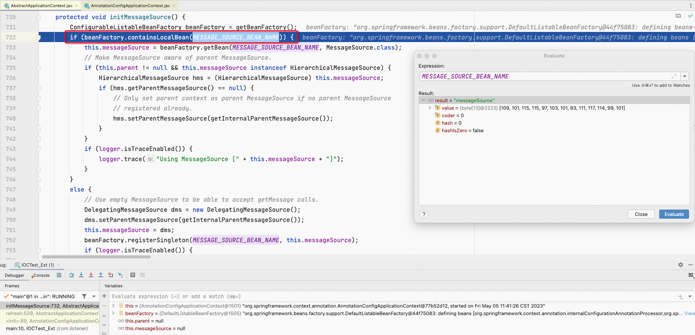

若有，则赋值给this.messageSource

如果有的话，那么会从BeanFactory中获取到id为messageSource，类型是MessageSource的组件，并将其赋值给this.messageSource。这可以从下面这行代码看出。

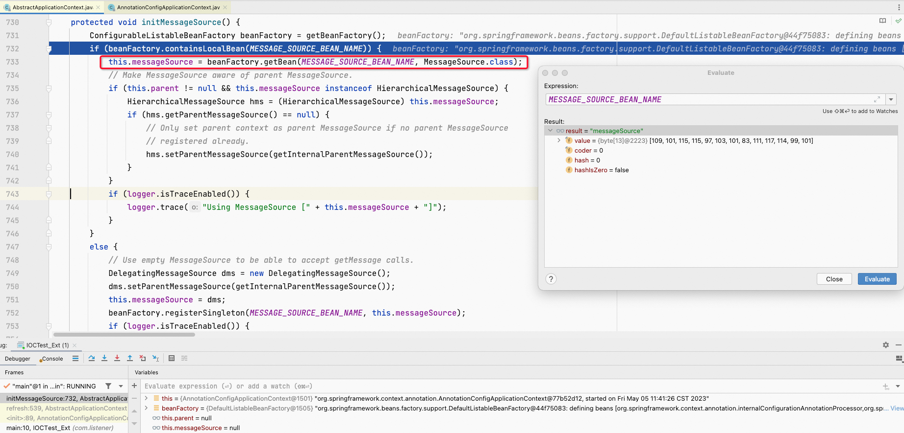

很显然，容器刚开始创建的时候，肯定是还没有的，所以程序会来到下面的else语句中。

若没有，则创建一个DelegatingMessageSource类型的组件，并把创建好的组件注册在容器中

如果没有的话，那么Spring自己会创建一个DelegatingMessageSource类型的对象，即MessageSource类型的组件。

那么问题来了，这种MessageSource类型的组件有啥作用呢？我们不妨查看一下MessageSource接口的源码，如下图所示，它里面定义了很多重载的getMessage方法，该方法可以从配置文件（特别是国际化配置文件）中取出某一个key所对应的值。

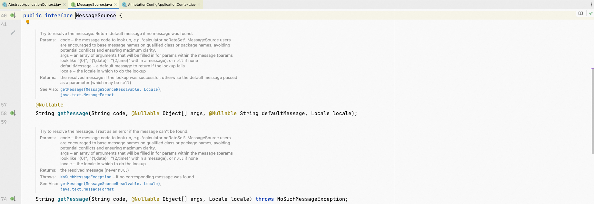

也就是说，这种MessageSource类型的组件的作用一般是取出国际化配置文件中某个key所对应的值，而且还能按照区域信息获取哟~

紧接着，把创建好的MessageSource类型的组件注册到容器中，所执行的是下面这行代码。

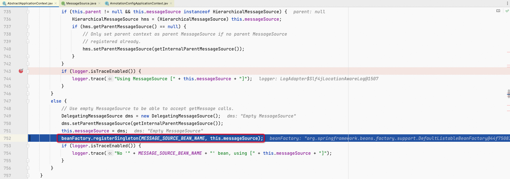

那么，我们以后想获取国际化配置文件中的值的时候，就可以直接自动注入这个MessageSource类型的组件了，然后调用它的getMessage方法就行了，并且还能按照区域信息获取哟😁

message具体的用法还可以参考

[容器和Bean](https://www.yuque.com/chenguang201/vi4obw/xptc0r)

# 8 initApplicationEventMulticaster
在上一节中，我们已经搞清楚了如下initMessageSource方法所做的事情，它无非就是来初始化MessageSource组件的。

然后，我们让程序运行到initApplicationEventMulticaster方法处。顾名思义，该方法是来初始化事件派发器的。

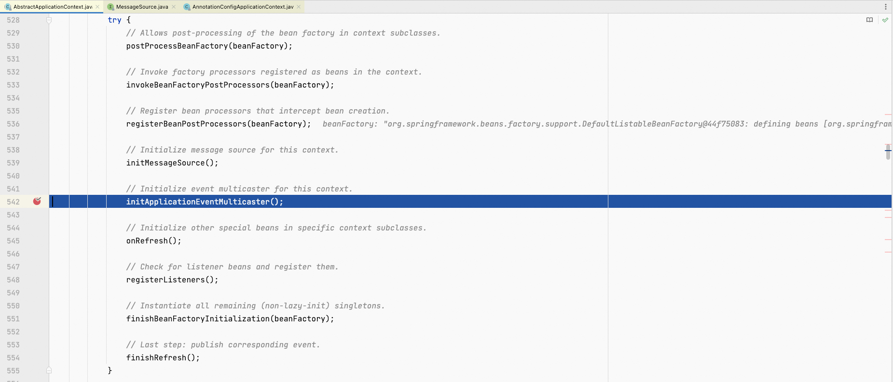

你有没有想过这样一个问题，为什么Spring容器在创建的过程中还要调用这样一个初始化事件派发器的方法呢？没想过，就算了，这里我直接给出答案，这是因为需要一个事件派发器对我们Spring中的事件进行一些派发、管理以及通知等。

那么，究竟是如何来初始化事件派发器的呢？这时，我们就得来好好研究一下initApplicationEventMulticaster方法里面究竟做了些什么事了。

初始化事件派发器

获取BeanFactory

按下快捷键进入到initApplicationEventMulticaster方法里面，如下图所示，可以看到一开始是先来获取BeanFactory的。

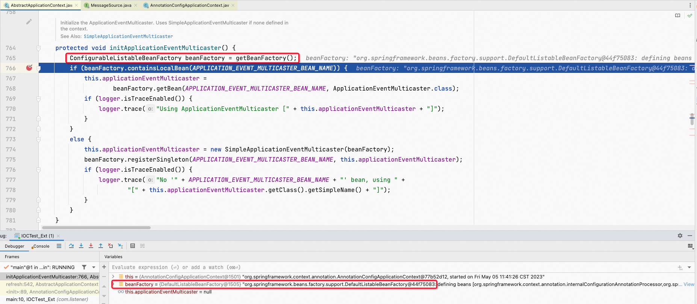

看容器中是否有id为applicationEventMulticaster，类型是ApplicationEventMulticaster的组件

按下快捷键让程序继续往下运行，会发现有一个判断，即判断BeanFactory中是否有一个id为applicationEventMulticaster的组件。我为什么会这么说呢，你只要看一下常量APPLICATION_EVENT_MULTICASTER_BEAN_NAME的值就知道了，如下图所示，该常量的值就是applicationEventMulticaster。

若有，则赋值给this.applicationEventMulticaster

如果有的话，那么会从BeanFactory中获取到id为applicationEventMulticaster，类型是ApplicationEventMulticaster的组件，并将其赋值给this.applicationEventMulticaster。这可以从下面这行代码看出。

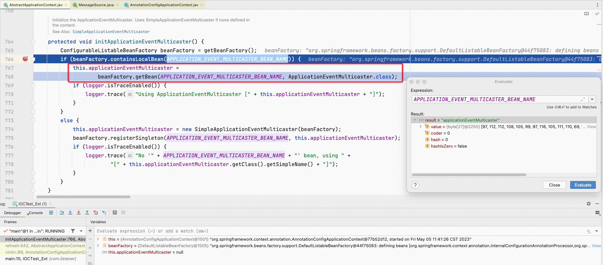

也就是说，如果我们之前已经在容器中配置了一个事件派发器，那么此刻就能从BeanFactory中获取到该事件派发器了。

很显然，容器刚开始创建的时候，肯定是还没有的，所以程序会来到下面的else语句中。

若没有，则创建一个SimpleApplicationEventMulticaster类型的组件，并把创建好的组件注册在容器中

如果没有的话，那么Spring自己会创建一个SimpleApplicationEventMulticaster类型的对象，即一个简单的事件派发器。

然后，把创建好的事件派发器组件注册到容器中，即添加到BeanFactory中，所执行的是下面这行代码。

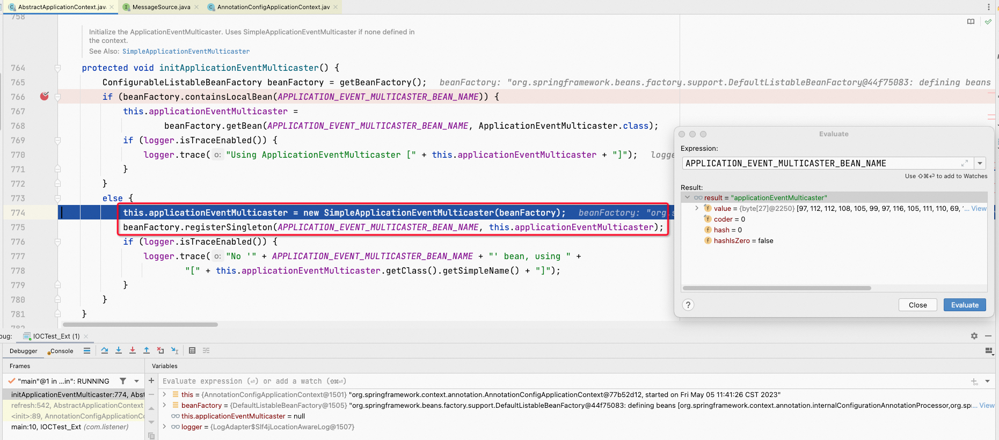

这样，我们以后其他组件要使用事件派发器，直接自动注入这个事件派发器组件即可。

至此initApplicationEventMulticaster方法运行完成。

# 9 onRefresh
接下来我们来到onRefresh方法中

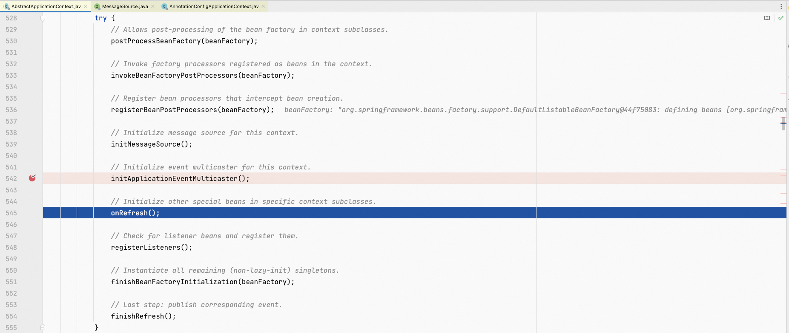

于是，我们按下快捷键进入到以上onRefresh方法里面去看一看，如下图所示，发现它里面是空的。

你是不是觉得很熟悉，因为我们之前就见到过两次类似这样的空方法，一次是我们在做容器刷新前的预处理工作时，可以让子类自定义个性化的属性设置，另一次是在BeanFactory创建并预处理完成以后，可以让子类做进一步的设置。我的朋友，你现在记起来了吗？

同理，以上onRefresh方法就是留给子类来重写的，这样是为了给我们留下一定的弹性，当子类（也可以说是子容器）重写该方法后，在容器刷新的时候就可以再自定义一些逻辑了，比如给容器中多注册一些组件之类的。

# 10 registerListeners
继续让程序继续往下运行，直至运行到下面这行代码处。

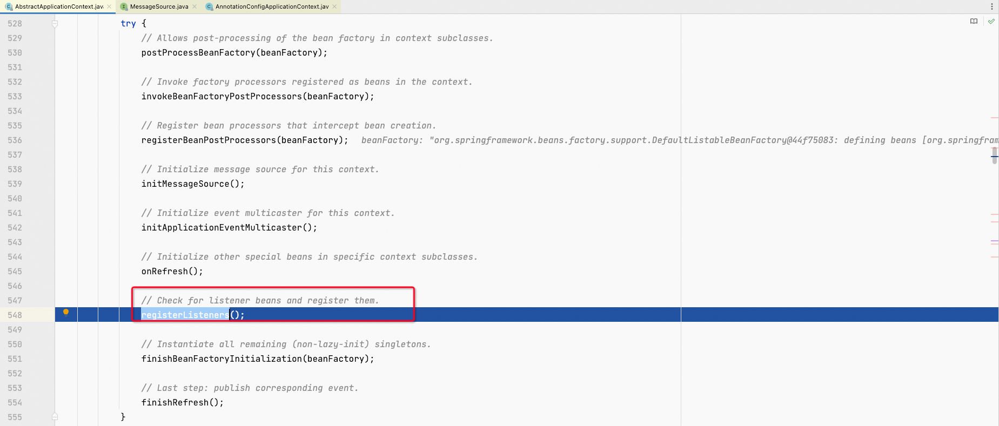

按照registerListeners方法上面的注释来说，该方法是来检查监听器并注册它们的。也就是说，该方法会将我们项目里面的监听器（也即咱们自己编写的ApplicationListener）注册进来。

我们可以按下快捷键进入到以上registerListeners方法里面去看一看，如下图所示。

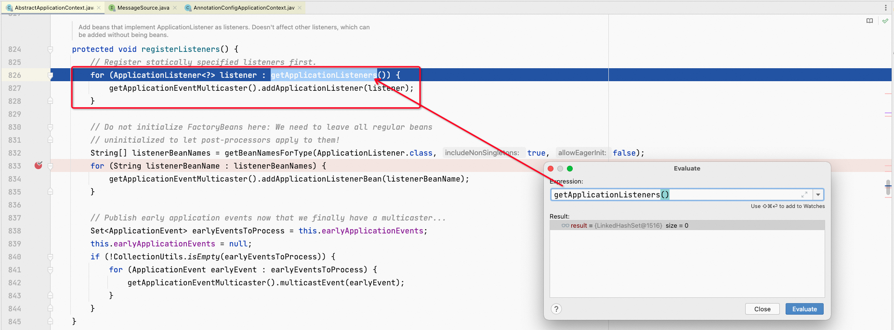

可以看到一开始会有一个for循环，该for循环是来遍历从容器中获取到的所有的ApplicationListener的，然后将遍历出的每一个监听器添加到事件派发器中。

当我们按下快捷键让程序继续往下运行时，发现并没有进入for循环中，而是来到了下面这行代码处。

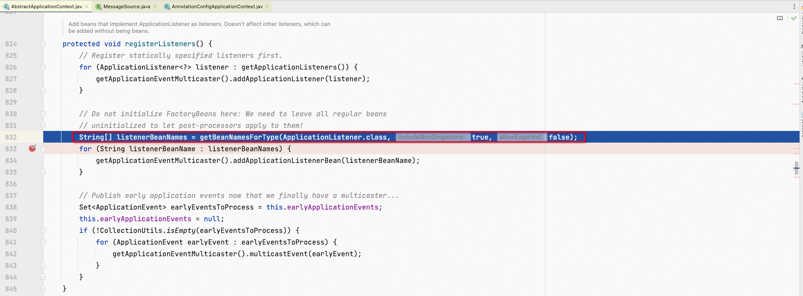

这是调用getBeanNamesForType方法从容器中拿到ApplicationListener类型的所有bean的名字的。也就是说，首先会从容器中拿到所有的ApplicationListener组件。

按下快捷键让程序继续往下运行，运行一步即可，这时Inspect一下listenerBeanNames变量的值，你就能看到确实是获取到了咱们自己编写的ApplicationListener了，如下图所示。

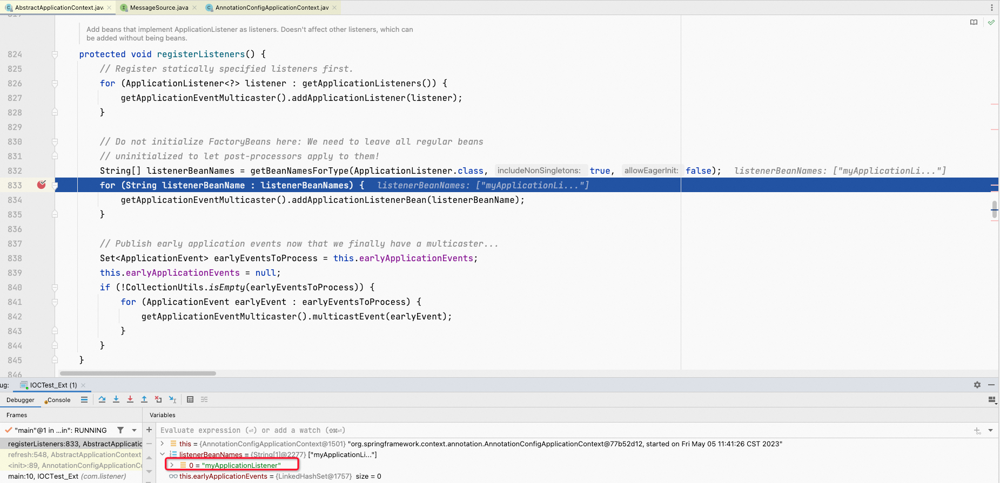

然后，将获取到的每一个监听器添加到事件派发器中。

当早期我们容器中有一些事件时，会将这些事件保存在名为earlyApplicationEvents的Set集合中。这时，会先获取到事件派发器，再利用事件派发器将这些事件派发出去。也就是说，派发之前步骤产生的事件。

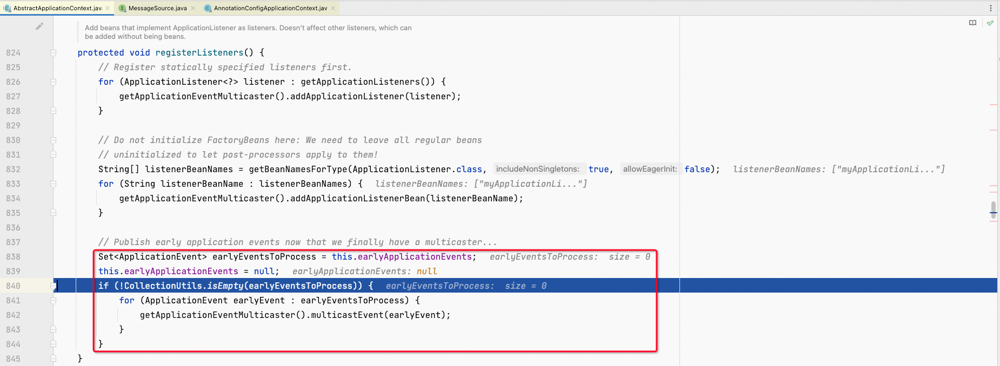

而现在呢，容器中默认还没有什么事件，所以，程序压根就不会进入到下面的for循环中去派发事件。当程序运行至下面这行代码处时，registerListeners方法就执行完了，它所做的事情很简单，无非就是从容器中拿到所有的ApplicationListener组件，然后将每一个监听器添加到事件派发器中。

接下来finishBeanFactoryInitialization方法是非常非常重要的，顾名思义，它是来初始化所有剩下的单实例bean的。执行完该方法之后，就完成BeanFactory的初始化了。我们下一讲来着重分析一下它，敬请期待哟~~~

