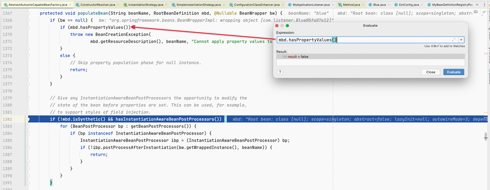
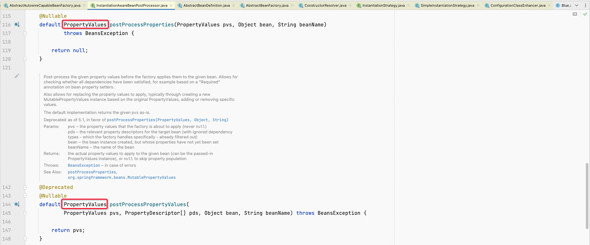

**<font style="color:#F5222D;">笔记来源：</font>**[**<font style="color:#F5222D;">尚硅谷Spring注解驱动教程(雷丰阳源码级讲解)</font>**](https://www.bilibili.com/video/BV1gW411W7wy/?p=2&spm_id_from=pageDriver&vd_source=e8046ccbdc793e09a75eb61fe8e84a30)

[09-2 Spring容器创建流程中篇](https://www.yuque.com/chenguang201/vi4obw/qadgf2yydy2zstkn)

# 11 finishBeanFactoryInitialization
在前面几讲中，我们已经对IOC容器创建过程中的大部分方法进行过研究，其中比较核心的方法就是如下两个：

+ invokeBeanFactoryPostProcessors方法
+ registerBeanPostProcessors方法

## 11.1 finishBeanFactoryInitialization
在这一讲中，我们学习另一个比较核心的方法，即finishBeanFactoryInitialization方法，如下图所示。


从该方法的注释上来看，它是初始化所有剩下的单实例bean的。那么，它是怎么来初始化的呢？这就不得不进入该方法里面去一探究竟了。

finishBeanFactoryInitialization(beanFactory)：初始化所有剩下的单实例bean

按下快捷键进入finishBeanFactoryInitialization方法里面，如下图所示，可以看到一开始有跟类型转换组件有关的东东，这个嘛玩意我们也勿须深究，故略过。


继续按下快捷键让程序往下运行，这不是来判断beanFactory是否有值解析器的吗？这一块我们也没必要深究，也略过。


继续按下快捷键让程序往下运行，可以看到有跟AspectJ Weaver有关的东东，这些东东我们也没必要深究，也略过。


程序运行至finishBeanFactoryInitialization方法的最后一行代码时，可以很清楚地从该行代码上的注释看出，这儿是来初始化所有剩下的单实例bean的。


于是，接下来，我们就得进入该方法里面再去一探究竟了，搞清楚是怎样来初始化所有剩下的单实例bean的。


## 11.2 preInstantiateSingletons
beanFactory.preInstantiateSingletons()：初始化所有剩下的单实例bean

获取容器中所有的bean，然后依次进行初始化和创建对象

按下快捷键进入preInstantiateSingletons方法里面，如下图所示，可以看到一开始会先获取容器中所有bean的名字。当程序运行至如下这行代码处时，我们不妨Inspect一下beanNames变量的值，可以看到容器中现在有好多bean，有我们自己编写的组件，有Spring默认内置的一些组件。


对于容器中现在所有的这些bean来说，有些bean可能已经在之前的步骤中创建以及初始化完成了。因此，preInstantiateSingletons方法就是来初始化所有剩下的bean的。你能很明显地看到，这就有一个for循环，该for循环是来遍历容器中所有的bean，然后依次触发它们的整个初始化逻辑的。


获取bean的定义注册信息

进入for循环中之后，会获取到每一个遍历出来的bean的定义注册信息。我们要知道bean的定义注册信息是需要用RootBeanDefinition这种类型来进行封装的。


根据bean的定义注册信息判断bean是否是抽象的、单实例的、懒加载的

接下来，会根据bean的定义注册信息来判断bean是否是抽象的、单实例的、懒加载的。如果该bean既不是抽象的也不是懒加载的（我们之前就说过懒加载，它就是用到的时候再创建对象，与@Lazy注解有关），并且还是单实例的，那么这个时候程序就会进入到最外面的if判断语句中，如下图所示。


接下来，我们就来好好分析一下该if判断语句里面的整个逻辑。

按下快捷键让程序继续往下运行，你会发现还有一个判断，它是来判断当前bean是不是FactoryBean的，若是则进入到if判断语句中，若不是则进入到else分支语句中。


我们不妨点进isFactoryBean方法里面去看一看，如下图所示，可以很清楚地看到该方法就是来判断当前bean是不是属于FactoryBean接口的。


经过判断，如果我们的bean确实实现了FactoryBean接口，那么Spring就会调用FactoryBean接口里面的getObject方法来帮我们创建对象，查看FactoryBean接口的源码，你会发现它里面定义了一个getObject方法，这个我们之前是不是已经说过了。

好，那我们来看看我们的bean究竟是不是属于FactoryBean接口的。

那么它是不是实现了FactoryBean接口呢？我们可以按下快捷键让程序继续往下运行，发现并没有，因为此时程序来到了下面的else分支语句中，如下图所示。


也就是说，如果我们的bean并没有实现FactoryBean接口，那么就会利用getBean方法来创建对象。

## 11.3 getBean
为了能够继续跟踪Spring源码的执行过程，我们可以在getBean方法处打上一个断点，如下图所示。


然后，我们就需要给程序不断地放行了，一直放行到我们自己编写的bean中，例如，我们之前在讲解Spring其他的扩展原理时，编写了一个如下的配置类。

从该配置类的代码中，我们可以看到还会向容器中注册一个我们自己编写的Blue组件。同样地，为了方便继续跟踪Spring源码的执行过程，继续不停地按下快捷键让程序运行到下一个断点，直至放行到Blue对象的创建为止，如下图所示，在这一过程中，我们可以依次看到每一个bean的创建。


程序运行至此，我们可以知道Blue对象是得通过getBean方法来创建的。于是，接下来，我们就来看看这个Blue对象它到底是怎么创建的。

其实，我们早已用过这个方法了，查阅之前我们自己编写的单元测试类，例如IOCTest_AOP，你就能看到我们确实是调用了IOC容器的getBean方法，如下图所示。


但是，现在我们要从源码的角度来分析该方法了，看看它里面都做了哪些事。

我们按下快捷键进入getBean方法里面去看一看，如下图所示，可以看到它里面又调用了一个叫doGetBean的方法。


继续按下快捷键进入doGetBean方法里面去看一看，如下图所示，可以看到一开始会拿到我们的bean的名字。


然后，根据我们bean的名字尝试获取缓存中保存的单实例bean。你可以看到这儿调用的是getSingleton方法，而且从缓存中获取到了之后会赋值给一个叫sharedInstance的变量，它翻译过来就是共享的bean。


为什么这儿会先尝试从缓存中获取我们单实例bean呢？这是因为以前有一些单实例bean已经被创建好了，而且这些单实例bean也已经被缓存起来了，通俗一点说就是，所有创建过的单实例bean都会被缓存起来，所以这儿会调用getSingleton方法先从缓存中获取。如果能获取到，那么说明这个单实例bean之前已经被创建过了。

为了看得更加清楚，我们不妨按下快捷键进入getSingleton方法里面去看一看，如下图所示，发现它里面是下面这个样子的，好像是又调用了一个重载的getSingleton方法。


再继续按下快捷键进入以上getSingleton方法里面去看一看，如下图所示，可以看到从缓存中获取其实就是从singletonObjects属性里面来获取。


我得说明一下，singletonObjects是DefaultSingletonBeanRegistry类里面的一个属性，点它，你就能看到了，如下图所示。


可以看到singletonObjects属性就是一个Map集合，该Map集合里面缓存的就是所有的单实例bean，而且还是按照bean的名字和其实例对象缓存起来的，这可以从该属性上面的注释中看出来。

还是回到getSingleton方法处，Inspect一下singletonObjects属性的值，发现不仅能看到一些已经创建好的bean，而且还能看到一些其他的属性信息以及环境变量等等。


我们按下快捷键让程序继续往下运行，运行一步即可，此时Inspect一下singletonObject变量的值，发现是null，如下图所示，这说明名字为blue的bean从缓存中是获取不到的。


这说明，我们第一次想从缓存中获取我们的bean，是肯定获取不到的。


接着，我们继续按下快捷键让程序往下运行，直至运行到下面这行代码处，这儿有一个判断，好像是来判断我们的bean是否是原型创建，这是嘛玩意啊，不懂😭


继续按下快捷键让程序往下运行，此时程序并没有进入到以上if判断语句中。

程序运行至这里，我先做一个小结吧！如果从缓存中获取不到我们的bean，那么我们自然就得来创建了，走的便是下面else分支语句里面的逻辑。


好了，现在是该开始创建我们bean的对象了，那么这个创建对象的流程又是怎样的呢？从上图中可以看到，首先会来获取一个（父）BeanFactory，因为我们后来也是用它来创建对象的。然后，立马会有一个判断，即判断是不是能获取到（父）BeanFactory。这儿为什么会强调要获取 （父） BeanFactory呢？我想这是因为跟Spring MVC与Spring的整合有关，它俩整合起来以后，就会有父子容器了。嗯，我想就是这样的😊

按下快捷键让程序继续往下运行，我们会发现程序并没有进入到if判断语句中，而是来到了下面这行代码处，这说明并没有获取到（父）BeanFactory。


可以看到这儿又有一个判断，而且程序能够进入到该if判断语句中，如下图所示。


那么，markBeanAsCreated方法主要是来做什么的呢？它是在我们的bean被创建之前，先来标记其为已创建，相当于做了一个小标记，这主要是为了防止多个线程同时来创建同一个bean，从而保证了bean的单实例特性。这样看起来，Spring的源码写的还是蛮严谨的。

按下快捷键让程序继续往下运行，当程序运行至下面这行代码处时，可以看到这是来获取我们bean的定义信息的。


我们继续按下快捷键让程序往下运行，直至运行到下面这行代码处。

可以看到这儿调用了bean定义信息对象的一个getDependsOn方法，它是来获取我们当前bean所依赖的其他bean的。DependsOn的用法

```java
@Component
@DependsOn("userService")
public class Blue {

}
```

意思为Blue对象的创建必须要依赖于userService的bean对象


还记得我们之前在编写Spring的XML配置文件时，使用<bean>标签向容器中注册某个组件吗？比如我们编写了一个如下的<bean>标签向容器中注册了一个名字为person的bean。

回到主题，可以看到，depends-on属性也在Spring的源码中得到了体现，这可以参考上图。我们可以看到，会先获取我们当前bean所依赖的其他bean，如果我们要创建的bean确实有依赖其他bean的话，那么还是会调用getBean方法把所依赖的bean都创建出来。


所以我们会调用getBean这个方法把userService的Bean对象先创建出。

在getBean之前，容器中有12个bean，并没有userService。


执行完成之后，变成13个了。


你有没有发现我们一直在研究这个getBean方法啊？研究到这里，我们又会发现使用它来创建我们的bean之前，它做的一件大事，就是把我们要创建的bean所依赖的bean先创建出来，当然了，前提是我们要创建的bean是确实是真的有依赖其他bean。

在这会做一个判断，即判断我们的bean是不是单实例的，由于我们的bean就是单实例的，所以程序会进入到if判断语句中，来启动单实例bean的创建流程。


## 11.4 getSingleton
那么是怎么来启动我们单实例bean的创建流程的呢？我们可以看到，现在是调用了一个叫getSingleton的方法，而且在调用该方法时，还传入了两个参数，第一个参数是咱们单实例bean的名字，第二个参数是ObjectFactory（是不是可以叫它Object工厂呢？）对象。


你有没有看到ObjectFactory接口里面只有一个getObject方法呢？其实，Spring就是利用它来创建我们单实例bean的对象的。哎，它里面怎么还调用了一个createBean方法呢，莫非该方法就是来帮我们真正开始创建bean对象的？确实是这样的哟😊


所以此处用的是**<font style="color:rgb(38, 38, 38);">Lambda表达式，在getObject方法中调用createBean方法。</font>**

**<font style="color:rgb(38, 38, 38);">所以这一块的流程是先走</font>**getSingleton方法，然后在getSingleton里面singletonFactory.getObject()，在object方法里面调用createBean方法。


## 11.5 createBean
所以，为了方便继续跟踪Spring源码的执行过程，我们不妨在createBean方法处打上一个断点，如下图所示。


当程序往下运行时，可以看到会先拿到我们bean的定义信息，然后再来解析我们要创建的bean的类型。


继续让程序往下运行，直至运行到下面这行代码处为止。


可以看到，在创建我们bean的对象之前，会调用了一个resolveBeforeInstantiation方法。那该方法是干嘛的呢？看该方法上的注释，它说是给BeanPostProcessor一个机会来提前返回我们bean的代理对象，这主要是为了解决依赖注入问题。也就是说，这是让BeanPostProcessor先拦截并返回代理对象。

但是，这究竟是哪个BeanPostProcessor在工作呢？我们之前就说过，BeanPostProcessor是有非常多的，一般而言，BeanPostProcessor都是在创建完bean对象初始化前后进行拦截的。而现在我们还没创建对象呢，因为我们是调用createBean方法来创建对象的，还记得吗？这也就是说，我们bean的对象还未创建之前，就已经有了一个BeanPostProcessor，那么这个BeanPostProcessor究竟是谁呢？

我们不妨按下快捷键进入resolveBeforeInstantiation方法里面去看一看，如下图所示，当程序运行到下面这行代码处时，我们才知道原来是InstantiationAwareBeanPostProcessor这种类型的BeanPostProcessor。


可以看到这儿是来判断是否有InstantiationAwareBeanPostProcessor这种类型的后置处理器的。如果有，那么就会来执行InstantiationAwareBeanPostProcessor这种类型的后置处理器。那么，其执行逻辑又是怎么样的呢？

哎，看到那个applyBeanPostProcessorsBeforeInstantiation方法了没有，我们直接点进去看下，如下图所示。


你是不是看到了这样的逻辑？在该方法中，会先判断遍历出的每一个BeanPostProcessor是不是InstantiationAwareBeanPostProcessor这种类型的，如果是，那么便来触发其postProcessBeforeInstantiation方法，该方法定义在InstantiationAwareBeanPostProcessor接口中。


如果applyBeanPostProcessorsBeforeInstantiation方法执行完之后返回了一个对象，并且还不为null，那么紧接着就会来执行后面的applyBeanPostProcessorsAfterInitialization方法。


我们不妨直接点进applyBeanPostProcessorsAfterInitialization方法里面去看一下，如下图所示。


可以看到它里面是来执行每一个BeanPostProcessor的postProcessAfterInitialization方法的。注意，postProcessAfterInitialization方法是定义在BeanPostProcessor接口中的，只不过是InstantiationAwareBeanPostProcessor接口继承过来了而已。

也就是说，如果有InstantiationAwareBeanPostProcessor这种类型的后置处理器，那么会先执行其postProcessBeforeInstantiation方法，并看该方法有没有返回值（即创建的代理对象），若有则再执行其postProcessAfterInitialization方法。现在，你该知道InstantiationAwareBeanPostProcessor这种类型的后置处理器中两个方法的执行时机了吧😊！

我们按下快捷键让程序继续往下运行，直至运行到下面这行代码处，看来我们确实是有InstantiationAwareBeanPostProcessor这种类型的后置处理器。


然后，按下快捷键进入applyBeanPostProcessorsBeforeInstantiation方法里面去瞧一瞧，如下图所示，可以看到它里面会遍历获取到的所有的BeanPostProcessor，接着再来判断遍历出的每一个BeanPostProcessor是不是InstantiationAwareBeanPostProcessor这种类型的。很明显，遍历出的第一个BeanPostProcessor并不是InstantiationAwareBeanPostProcessor这种类型的，所以程序并没有进入到最外面的if判断语句中。


继续让程序往下运行，发现这时遍历出的第二个BeanPostProcessor是ConfigurationClassPostProcessor，而且它还是InstantiationAwareBeanPostProcessor这种类型的，于是，程序自然就进入到了最外面的if判断语句中，如下图所示。


这里我稍微提一嘴，ConfigurationClassPostProcessor这种后置处理器是来解析标准了@Configuration注解的配置类的。

紧接着便会来执行ConfigurationClassPostProcessor这种后置处理器的postProcessBeforeInstantiation方法了，但是该方法的返回值为null。于是，我们继续让程序往下运行，直至遍历完所有的BeanPostProcessor，返回到下面这行代码处。


此时，applyBeanPostProcessorsBeforeInstantiation方法便执行完了，我们也知道它里面做了些啥，只不过它并没有返回创建的代理对象，因此，程序继续往下运行，并不会进入到下面的if判断语句中，而是来到了下面这行代码处。


此时程序停留在了下面这行代码处。

于是，我们继续按下快捷键让程序往下运行，直至运行到下面这行代码处为止。

这时，resolveBeforeInstantiation方法总算是执行完了。你还记得该方法是干嘛的吗？它是在创建我们单实例bean之前，先来给BeanPostProcessor一个返回其代理对象的机会。但是，此刻是没有返回我们单实例bean的代理对象的，不信你看。


如果InstantiationAwareBeanPostProcessor这种类型的后置处理器并没有返回我们bean的代理对象，那么接下来该怎么办呢？

那我们只好继续按下快捷键让程序往下运行了，继续执行下面的流程，当程序运行到下面这行代码处时，发现调用了一个叫doCreateBean的方法，顾名思义，该方法就是来创建我们bean的实例的。


那么这个创建bean的流程又是怎样的呢？下面我就来为大家揭晓答案。

## 11.6 doCreateBean
单实例bean的创建流程  
按下快捷键进入doCreateBean方法里面去看一下，如下图所示，可以看到会用BeanWrapper接口来接收我们创建的bean。


继续按下快捷键让程序往下运行，直至运行到下面这行代码处为止，可以看到这儿调用的是一个叫createBeanInstance的方法，顾名思义，它是来创建bean实例的。


也就是说，创建bean的流程的第一步就是先来创建bean实例。

## 11.7 createBeanInstance
创建bean实例  
当执行完createBeanInstance方法之后，我们bean的对象就创建出来了。那么，我们bean实例的创建流程又是怎样的呢？我们不妨按下快捷键进入createBeanInstance方法里面去看一下，如下图所示，可以看到一开始就要来解析一下我们要创建的bean的类型。


于是，我们继续按下快捷键让程序往下运行，由于解析出来的类型为null，所以程序并不会进入到下面的if判断语句中，而是来到了下面这行代码处。


这块是来干嘛呢？我们可以来详细说一下。首先，在if判断语句中的条件表达式中，你可以看到调用了bean定义信息对象的一个getFactoryMethodName方法，该方法是来获取工厂方法的名字的。我们不妨Inspect一下mbd.getFactoryMethodName()表达式的值，发现其值就是blue，如下图所示。


为什么叫工厂方法呢？还记得咱们自己编写的Blue对象是如何注册到IOC容器中的吗？如下图所示，我们是使用标注了@Bean注解的blue方法来创建Blue对象并将其注册到IOC容器中的。


也就是说，以上blue方法就相当于Blue对象的工厂方法。

还是回到Spring的源码中来，现在程序是停留在了if判断语句块内，不难猜测此时就是来执行Blue对象的工厂方法（即blue方法）来创建Blue对象的。我们不妨按下快捷键进入instantiateUsingFactoryMethod方法里面去看一下，如下图所示，这块好像是来拿什么构造器解析的，咱也不太懂，哈哈哈😡


程序运行至此，咱们这个bean实例（即Blue对象）就创建出来了，只不过该Blue对象刚刚创建出来，空空如也，什么都没有。

接着，让程序继续往下运行，直至再次运行回doCreateBean方法中，如下图所示。


这时，以上createBeanInstance方法就算是执行完了，也就是说，创建出了我们的bean实例（即Blue对象）。

最后，让程序继续往下运行，直至运行到下面这行代码处为止，从这行代码上面的注释中，我们可以看到这块允许后置处理器来修改咱们这个bean的定义信息。


很明显，我们的bean实例创建完了以后，接下来就得来调用这个applyMergedBeanDefinitionPostProcessors方法了。

那么，该方法又是来执行哪些后置处理器的呢？我们直接点击该方法进去它里面看一下，如下图所示，可以看到先是来获取到所有的后置处理器，然后再来遍历它们，如果是MergedBeanDefinitionPostProcessor这种类型的，那么就调用其postProcessMergedBeanDefinition方法。


从这儿也能看到，每一个后置处理器（或者说它里面的方法）的执行时机都是不一样的，比如我们在上一讲中所讲述的InstantiationAwareBeanPostProcessor这种类型的后置处理器中的两个方法的执行时机是在创建bean实例之前，而现在MergedBeanDefinitionPostProcessor这种类型的后置处理器，是在创建完bean实例以后，来执行它里面的postProcessMergedBeanDefinition方法的。

所以说，如果大家要用到各种类型的后置处理器，那么你得清楚知道它们里面的方法是何时执行的，可一定要做到心中有数哟😁

接着，让程序继续往下运行，直至运行到下面这行代码处为止。


尼玛的，这儿又是来干嘛的啊？咱也不知道，咱也不敢问！不过从earlySingletonExposure变量的名字中，我们是不是能猜到这儿是来拿到什么单实例的要暴露的bean的呢？😔，我也不知道，只是猜测。

程序继续往下运行的过程中，我们发现其会进入到if判断语句中，来到addSingletonFactory方法处，如下图所示，调用该方法好像是来添加一些缓存的，咱也不必深究，直接略过。


## 11.8 populateBean
于是，我们让程序继续往下运行，直至运行到下面这行代码处为止，很明显，populateBean方法是来为bean的属性赋值的。

也就是说，创建完bean实例以后，首先就是来为bean实例的属性赋值。


为bean实例的属性赋值  
你可不要忘了程序现在依然还在doCreateBean方法内运行哟！在该方法内，首先会创建出我们的bean实例，然后再执行MergedBeanDefinitionPostProcessor这种类型的后置处理器，接着，创建完bean实例之后就得为其属性赋值了。

你有没有想过是如何为bean的属性赋值这一问题的呢？不急，我们不妨按下快捷键进入populateBean方法里面去看一下，如下图所示，可以看到一开始会拿到赋给所有属性的属性值。



只不过，我们现在没啥要赋的属性值，不信你看，但是如果有的话，那么就会拿到很多。


遍历获取到的所有后置处理器，若是InstantiationAwareBeanPostProcessor这种类型，则调用其postProcessAfterInstantiation方法，于是，我们让程序继续往下运行，直至运行到下面这行代码处为止，此时，大家可要注意了，现在依然还没有为bean的属性赋值哟！


可以看到，接下来会遍历获取到的所有后置处理器，如果是InstantiationAwareBeanPostProcessor这种类型的，那么就调用其postProcessAfterInstantiation方法。

而且，以上所有的这些操作均是在为bean的属性赋值之前做的哟~~~


我们继续按下快捷键让程序往下运行，直至遍历完所有的后置处理器，在这一过程中，傻子都能看出这一点，如果遍历出的后置处理器是InstantiationAwareBeanPostProcessor这种类型，那么就会调用其postProcessAfterInstantiation方法。

当程序运行到下面这行代码处时，好像是来拿到ResolvedAutowireMode这个东东的，咱也不知道这玩意是个嘛，咱也不敢问😄！只是在这记录一下。


继续让程序往下运行，你会发现程序并没有进入到if判断语句中，而是来到了下面这行代码处。

可以看到这儿调用了一个hasInstantiationAwareBeanPostProcessors方法，它是来判断是否有InstantiationAwareBeanPostProcessor这种类型的后置处理器的。

继续让程序往下运行，你会发现程序进入到了下面的if判断语句中，来到了下面这行代码处，这说明是有InstantiationAwareBeanPostProcessor这种类型的后置处理器的。

接着，继续让程序往下运行，很显然程序会再进入到下面的if判断语句中，因为确实是有InstantiationAwareBeanPostProcessor这种类型的后置处理器。

现在，你该对接下来所要做的事情了然于胸了吧！其实，就是遍历获取到的所有后置处理器，如果是InstantiationAwareBeanPostProcessor这种类型的，那么就调用其postProcessPropertyValues方法。


大家可要注意哟，即使是执行了InstantiationAwareBeanPostProcessor这种类型的后置处理器中的postProcessAfterInstantiation和postProcessPropertyValues这俩方法，咱们bean实例的属性依然还没有被赋值。那么，到底是啥时候来赋值的呢？

我们不妨让程序继续往下运行，直至遍历完所有的后置处理器。在这一过程中，我再说一遍啊，唉，都说的口都快干了，如果遍历出的后置处理器是InstantiationAwareBeanPostProcessor这种类型，那么就会调用其postProcessPropertyValues方法。

唉，对了，我们可以点进去InstantiationAwareBeanPostProcessor接口里面看一看它的源码哟，如下图所示，你可以看到它里面定义了一个postProcessPropertyValues方法，该方法会返回一个PropertyValues对象，它就是我们bean实例属性要被赋予的属性值，最终这些属性值会被赋值给bean的属性。我是这样理解的啦😂，也不知道对不对。



好像更加专业的说法是这样的，Spring获取bean的实例时，需要把配置的属性值解析到PropertyValues中，然后再填充入BeanWrapper。我在这里先记录一下。

当程序运行到下面这行代码处时，你会发现这儿调用了一个applyPropertyValues方法，这里才是正式开始为bean的属性赋值。


正式开始为bean的属性赋值  
大家一定要注意啊，现在调用applyPropertyValues方法才是开始为bean的属性赋值，在为bean的属性赋值之前，我们知道会执行InstantiationAwareBeanPostProcessor这种类型的后置处理器中的postProcessAfterInstantiation和postProcessPropertyValues这俩方法。

其实，为bean的属性赋值，说到底就是利用setter方法为bean的属性进行赋值。这里，我们就不再进入applyPropertyValues方法去一探究竟了，它里面无非就是利用反射调setter方法之类的。


接下来，继续让程序往下运行，直至运行到下面这行代码处为止，此时，populateBean方法就执行完了，也就是说，已经为我们bean的属性赋完值了。

接着继续让程序往下运行，运行一步即可。

## 11.9 initializeBean
可以看到，这儿调用了一个initializeBean方法，你是不是很熟悉它，因为我们之前就已经研究过它了，它就是来初始化bean的，下面我们再来详详细细地研究一下它。

至此，我们就知道了这样一个结论，为bean的属性赋完值之后，接着便要来初始化bean了。


**初始化bean**  
至此，我们要不先梳理一下吧，你看我总结的可还行？

1. 在创建bean实例之前，会执行InstantiationAwareBeanPostProcessor这种类型的后置处理器中的两个方法，即postProcessBeforeInstantiation方法和postProcessAfterInitialization方法


2. 创建bean实例


3. 为bean实例的属性赋值。在赋值的过程中，会依次执行InstantiationAwareBeanPostProcessor这种类型的后置处理器中的两个方法，即postProcessAfterInstantiation方法和postProcessPropertyValues方法


4. 初始化bean：那么，你知不知道是如何来初始化bean的呢？我想你肯定不知道，不知道没关系，我们可以按下快捷键进入initializeBean方法中去一探究竟

可以看到，这儿调用了一个invokeAwareMethods方法，顾名思义，它是来执行XxxAware接口中的方法的。


执行xxxAware接口的方法  
对于XxxAware接口，不知你还有没有一些印象，我们以前就用过，比如我们之前曾经编写过这样一个Dog组件，如下所示，在该组件里面如果想要用IOC容器，那么就得让其实现ApplicationContextAware接口，这样，Spring就会在setApplicationContext方法中把IOC容器给传过来。

```java
package com.meimeixia.bean;

import javax.annotation.PostConstruct;
import javax.annotation.PreDestroy;

import org.springframework.beans.BeansException;
import org.springframework.context.ApplicationContext;
import org.springframework.context.ApplicationContextAware;
import org.springframework.stereotype.Component;

/**
 * ApplicationContextAwareProcessor这个类的作用是可以帮我们在组件里面注入IOC容器，
 * 怎么注入呢？我们想要IOC容器的话，比如我们这个Dog组件，只需要实现ApplicationContextAware接口就行
 * 
 * @author liayun
 *
 */
@Component
public class Dog implements ApplicationContextAware {
	
	private ApplicationContext applicationContext;

	public Dog() {
		System.out.println("dog constructor...");
	}
	
	// 在对象创建完成并且属性赋值完成之后调用
	@PostConstruct
	public void init() { // 在这儿打个断点调试一下
		System.out.println("dog...@PostConstruct...");
	}
	
	// 在容器销毁（移除）对象之前调用
	@PreDestroy
	public void destory() {
		System.out.println("dog...@PreDestroy...");
	}

	@Override
	public void setApplicationContext(ApplicationContext applicationContext) throws BeansException { // 在这儿打个断点调试一下
		// TODO Auto-generated method stub
		this.applicationContext = applicationContext;
	}
	
}
```

那么，在invokeAwareMethods方法中是怎么来执行XxxAware接口的方法的呢？我们不妨按下快捷键进入该方法里面去看一下，如下图所示。


可以看到，它就是来判断我们的bean是不是实现了BeanNameAware、BeanClassLoaderAware、BeanFactoryAware这些Aware接口的，若是则回调接口中对应的方法。

当然了，现在我们的bean（即Blue对象）是没有实现以上这些Aware接口的，所以，我们直接让程序继续往下运行，直至运行到下面这行代码处为止。


执行后置处理器初始化之前的方法（即postProcessBeforeInitialization方法）  
执行完XxxAware接口中的方法之后，可以看到会再来调用一个applyBeanPostProcessorsBeforeInitialization方法，该方法我们之前也研究过，不是吗？

那么，你知道applyBeanPostProcessorsBeforeInitialization方法中具体执行了哪些逻辑吗？我们不妨按下快捷键进入该方法里面去看一下，如下图所示。


可以看到，在applyBeanPostProcessorsBeforeInitialization方法中，会遍历所有的后置处理器，然后依次执行所有后置处理器的postProcessBeforeInitialization方法，一旦后置处理器的postProcessBeforeInitialization方法返回了null以后，则后面的后置处理器便不再执行了，而是直接退出for循环。

然后，我们让程序继续往下运行，一直运行到下面这行代码处为止。


现在，你该知道后置处理器初始化之前的方法（即postProcessBeforeInitialization方法）的调用时机了吧


执行初始化方法  
执行完后置处理器的postProcessBeforeInitialization方法之后，可以看到现在又调用了一个invokeInitMethods方法，其作用就是执行初始化方法。

初始化方法究竟是指哪些方法呢？我们不妨来回顾一下，是不是包括了一个实现InitializingBean接口的方法啊？还记得我们之前曾经编写过如下所示这样一个Cat组件吗？

```java
package com.meimeixia.bean;

import org.springframework.beans.factory.DisposableBean;
import org.springframework.beans.factory.InitializingBean;
import org.springframework.context.annotation.Scope;
import org.springframework.stereotype.Component;

// @Scope("prototype")
@Component
public class Cat implements InitializingBean, DisposableBean {
	
	public Cat() {
		System.out.println("cat constructor...");
	}

	/**
	 * 会在容器关闭的时候进行调用
	 */
	@Override
	public void destroy() throws Exception {
		// TODO Auto-generated method stub
		System.out.println("cat destroy...");
	}

	/**
	 * 会在bean创建完成，并且属性都赋好值以后进行调用
	 */
	@Override
	public void afterPropertiesSet() throws Exception {
		// TODO Auto-generated method stub
		System.out.println("cat afterPropertiesSet...");
	}

}
```

可以看到，以上Cat组件实现了一个InitializingBean接口，而该接口中定义了一个afterPropertiesSet方法，必然在Cat组件内就会实现该方法，这样，该方法就是Cat组件的初始化方法了。

当然了，我们除了通过以上方式来指定初始化方法之外，还可以在@Bean注解中使用initMehod属性来指定初始化方法，就像下面这样。

```java
package com.meimeixia.config;

import org.springframework.context.annotation.Bean;
import org.springframework.context.annotation.ComponentScan;
import org.springframework.context.annotation.Configuration;
import org.springframework.context.annotation.Scope;

import com.meimeixia.bean.Car;

/**
 * 
 * @author liayun
 *
 */
@ComponentScan("com.meimeixia.bean")
@Configuration
public class MainConfigOfLifeCycle {

//	@Scope("prototype")
	@Bean(initMethod="init", destroyMethod="destroy")
	public Car car() {
		return new Car();
	}
	
}

```

从以上配置类的代码中可以看出，我们指定了Car对象中的init方法为初始化方法，destroy方法为销毁方法，而Car类的代码如下所示。

```java
package com.meimeixia.bean;

import org.springframework.stereotype.Component;

@Component
public class Car {

	public Car() {
		System.out.println("car constructor...");
	}
	
	public void init() {
		System.out.println("car ... init...");
	}
	
	public void destroy() {
		System.out.println("car ... destroy...");
	}
	
}

```

好，回顾完了，我们现在将记忆拉到现实，来看一下究竟是如何来执行初始化方法的。于是，我们按下快捷键进入invokeInitMethods方法里面去看一下，如下图所示。


可以看到，一开始就会来判断我们的bean是否是InitializingBean接口的实现，若是则执行该接口中定义的初始化方法。

如果不是的话呢？我们不妨继续让程序往下运行，可以发现程序并没有进入到下面的if判断语句中，而是来到了下面这行代码处，这是因为我们的bean并没有实现InitializingBean接口。


这时，是来看我们的bean是否自定义了初始化方法，如果是的话，那么就来执行初始化方法。

但是，现在我们的bean是没有自定义初始化方法的，因此在程序继续往下运行的过程中，程序并不会进入到下面的if判断语句中，而是来到了下面这行代码处。


此时，invokeInitMethods方法便执行完了。这其实就是说，Spring会帮我们把我们bean中的初始化方法回调一下。

执行后置处理器初始化之后的方法（即postProcessAfterInitialization方法）  
初始化方法执行完了以后，下一步就是来调用applyBeanPostProcessorsAfterInitialization方法，难道不是这样吗？

那么，你知道applyBeanPostProcessorsAfterInitialization方法中具体执行了哪些逻辑吗？我们不妨按下快捷键进入该方法里面去看一下，如下图所示。

可以看到，在applyBeanPostProcessorsAfterInitialization方法中，会遍历所有的后置处理器，然后依次执行所有后置处理器的postProcessAfterInitialization方法，一旦后置处理器的postProcessAfterInitialization方法返回了null以后，则后面的后置处理器便不再执行了，而是直接退出for循环。


然后，我们让程序继续往下运行，一直运行到下面这行代码处为止，可以看到我们的bean已经初始化完了。

以上就是我们bean的整个初始化逻辑。

我们的bean初始化完了以后，继续让程序往下运行，直至运行到下面这行代码处为止，很显然，这儿是来获取我们单实例bean的，因为我们单实例bean都已经创建好了。


bean创建好了，我们来看一下spring的容器中是否有我们的bean对象，如下图


我们发现，还是没有，别着急，继续往下走


看看这个方法，注释的意思是：将bean注册为一次性的。很显然，并不符合我们的要求，所以此方法不必关注，继续往下走，这个方法就结束了。


代码又回到了createBean方法里面，此时doCreateBean方法已经调用结束，createBean这个方法也基本已经结束。


方法继续回到了doGetBean方法，注意，此时代码还在getSingleto方法的singletonFactory.getObject()方法里面，是getObject调用createBean结束。所以singletonFactory.getObject()这行代码也执行结束。


注意，此时我们进入这个getSingleton方法里面。

## 11.10 addSingleton


我们发现，在这个方法里面，我们将bean对象装到了spring的容器中去了。


我们来看卡这个addSingleton方法


可以看到singletonObjects属性就是一个Map集合，该Map集合里面缓存的就是所有的单实例bean，而且还是按照bean的名字和其实例对象缓存起来的，这可以从该属性上面的注释中看出来。


原来缓存就是一个Map集合，那么，将创建的单实例bean添加到缓存中指的不就是将创建的单实例bean添加到singletonObjects指代的Map集合中吗？第一次获取单实例bean，就是从singletonObjects里面来获取的，你还记得吗？

将创建的单实例bean添加到singletonObjects指代的Map集合中，好处是以后我们就可以直接从这个Map集合里面来获取了。

现在，你该知道什么叫IOC容器了吧！所谓的IOC容器就是指各种各样的Map集合，而且这些Map集合有很多哟，如下图所示，这些Map集合里面保存了我们创建的所有组件以及IOC容器的其他信息。

也就是说，以上所有这些Map集合就构成了Spring的IOC容器，容器里面保存了所有的组件。以后，我们从容器中来获取组件，其实就是从这些Map集合里面来获取组件。

我们经过以上这么多的步骤，终于终于将bean实例创建出来了，是不是很不容易啊！你可能要问了，经过了哪些步骤啊？能不能给总结一下呢？其实，这些步骤都包含在以上doCreateBean方法中，我不妨总结一下。

1. 在创建bean实例之前，会执行InstantiationAwareBeanPostProcessor这种类型的后置处理器中的两个方法，即postProcessBeforeInstantiation方法和postProcessAfterInitialization方法
2. 创建bean实例
3. 为bean实例的属性赋值。在赋值的过程中，会依次执行InstantiationAwareBeanPostProcessor这种类型的后置处理器中的两个方法，即postProcessAfterInstantiation方法和postProcessPropertyValues方法
4. 初始化bean，而且在初始化前后会执行后置处理器中的两个方法，即postProcessBeforeInitialization方法和postProcessAfterInitialization方法
5. 注册bean的销毁方法

经过上面这些繁琐的步骤，咱们的bean就创建出来了。

## 11.11 getBean结束之后
我们让程序停留在了下面这行代码处，此时，getBean方法就完全是执行完了，这样，我们单实例bean就被创建出来了。


而且，创建我们单实例bean的流程牵扯到了很多很多东西，你得亲自跟踪一下Spring的源码才能有所体会，不然说再多也是白费口舌，当然了，你也可以在我上一讲中找到答案。

我们的bean创建出来之后，继续让程序往下运行，可以看到接下来就是通过以下for循环来将所有的bean都创建完。

那就让它创建其他的bean呗！创建流程不用我再详述一遍吧，跟我们单实例bean（即Blue对象）的创建流程是一模一样的，我们不停地按下快捷键让程序不停地往下运行，快速地过一遍就行了，这一过程我也就不再详细地记录了。

当程序运行到下面这行代码处时，上面的那个for循环就整个地执行完了，也就是说，所有的bean都创建完成了。


可以看到，这儿是来遍历所有的bean，并来判断遍历出来的每一个bean是否实现了SmartInitializingSingleton接口的。哎，你对SmartInitializingSingleton接口还有印象吗？在讲解@EventListener注解的内部原理时，我们就讲解过它，你还记得吗？要是你不记得了，那么可以回顾回顾这一讲。

[08 ApplicationListener](https://www.yuque.com/chenguang201/vi4obw/pohlos3mbyelvfi7)

OK，所有的bean都利用getBean方法创建完成以后，接下来要做的事情就是检查所有的bean中是否有实现SmartInitializingSingleton接口的，如果有的话，那么便会来执行该接口中的afterSingletonsInstantiated方法。

那我们不妨让程序继续往下运行，来验证上面这段话，当程序运行至下面这行代码处时，发现有一个bean实现了SmartInitializingSingleton接口，不然程序是不会进入到if判断语句中的。

那么，到底是哪一个bean实现了SmartInitializingSingleton接口呢？我们不妨Inspect一下singletonInstance变量的值，这样很快就能知道该bean了，它就是EventListenerMethodProcessor，如下图所示。


于是，接下来便会执行该bean中的afterSingletonsInstantiated方法，也就是SmartInitializingSingleton接口中定义的方法。

我们继续让程序往下运行，直至执行完整个for循环，由于IOC容器中的bean还是蛮多的，所以要执行完整个for循环，你得不停地按下F6快捷键。当程序运行至下面这行代码处时，我们发现beanFactory.preInstantiateSingletons()这行代码总算是执行完了。


还记得这行代码是来干嘛的吗？它是来初始化所有剩下的单实例bean的。


接着，我们继续让程序往下运行，直至运行至下面这行代码处为止，此时，程序来到了Spring IOC容器创建的最后一步了，即完成BeanFactory的初始化创建工作。

以上该方法一旦执行完，那么Spring IOC容器就创建完成了。接下来，我们就看看finishRefresh方法里面都做了些啥事。


# 12 finishRefresh
完成BeanFactory的初始化创建工作

上面也说了，一旦finishRefresh方法执行完，就意味着完成了BeanFactory的初始化创建工作，顺带脚地，我们Spring IOC容器就创建完成了。

其实，IOC容器在前一步（即finishBeanFactoryInitialization(beanFactory)）就已经创建完成了，而且所有的单实例bean也都已经加载完了。这个不用我再叙述一遍了吧，不懂的同学，请看前面两讲。

那么，finishRefresh方法里面究竟都做了些啥事呢？我们不妨按下F5快捷键进入该方法里面去看一下，如下图所示，是不是很熟悉啊！这里面的逻辑，我们应该以前都瞟过一眼，只是过去一段时间了，我们似乎都快忘记了。


初始化和生命周期有关的后置处理器


可以看到finishRefresh方法里面首先会调用一个initLifecycleProcessor方法，该方法是来初始化和生命周期有关的后置处理器的。我们不妨按下F5快捷键进入该方法里面去看一下，如下图所示。


获取BeanFactory

从上图中可以知道，在initLifecycleProcessor方法里面一开始就是来获取BeanFactory的，而这个BeanFactory，我们之前早就准备好了。


看容器中是否有id为lifecycleProcessor，类型是LifecycleProcessor的组件

按下快捷键让程序继续往下运行，会发现有一个判断，即判断BeanFactory中是否有一个id为lifecycleProcessor的组件。我为什么会这么说呢，你只要看一下常量LIFECYCLE_PROCESSOR_BEAN_NAME的值就知道了，如下图所示，该常量的值就是lifecycleProcessor。


若有，则赋值给this.lifecycleProcessor

如果有的话，那么会从BeanFactory中获取到id为lifecycleProcessor，类型是LifecycleProcessor的组件，并将其赋值给this.lifecycleProcessor。这可以从下面这行代码看出。


不难发现，首先默认会从BeanFactory中寻找LifecycleProcessor这种类型的组件，即生命周期组件。由于我们是初次与LifecycleProcessor见面，对其还不是很熟悉，所以我们可以点过去看一看它的源码，如下图所示，发现它是一个接口。


而且，可以看到该接口中还定义了两个方法，一个是onRefresh方法，一个是onClose方法，它俩能够在BeanFactory的生命周期期间进行回调哟

如此一来，我们就可以自己来编写LifecycleProcessor接口的一个实现类了，该实现类的作用就是可以在BeanFactory的生命周期期间进行拦截，即在BeanFactory刷新完成以及关闭的时候，回调其里面的onRefresh和onClose这俩方法。

当程序继续往下运行时，很显然，它并不会进入到if判断语句中，而是来到了下面的else分支语句中，这是因为容器在刚开始创建的时候，肯定是还没有生命周期组件的。


若没有，则创建一个DefaultLifecycleProcessor类型的组件，并把创建好的组件注册在容器中

如果没有的话，那么Spring自己会创建一个DefaultLifecycleProcessor类型的对象，即默认的生命周期组件。

然后，把创建好的DefaultLifecycleProcessor类型的组件注册到容器中，所执行的是下面这行代码。


也就是说，容器中会有一个默认的生命周期组件。这样，我们以后其他组件想要使用生命周期组件，直接自动注入这个生命周期组件即可。

这里，我得多说一嘴，你也不要嫌我烦，所有Spring创建的组件，基本上都是这个逻辑，它把组件创建过来以后，就会添加到容器中，这样就能方便我们程序员来使用了。

最后，让程序继续往下运行，直至运行到下面这行代码处为止。

可以看到，这儿会拿到生命周期组件，然后再回调其onRefresh方法。


回调生命周期处理器的onRefresh方法

从上图中我们可以看到，当程序运行到getLifecycleProcessor().onRefresh();

这行代码处时，会先拿到我们前面定义的生命周期处理器（即监听BeanFactory生命周期的处理器），然后再回调其onRefresh方法，也就是容器刷新完成的方法。

发布容器刷新完成事件

我们让程序继续往下运行，运行一步即可，这时，程序来到了下面这行代码处。


很明显，这儿是来发布容器刷新完成事件的。如何来发布容器刷新完成事件，想必不用我来说了吧！我之前就已经详细讲述过了，要是你还不知道的话，那么可以参考前面的小节。

接着，继续让程序往下运行，运行一步即可，这时，程序来到了下面这行代码处。


这是finishRefresh方法里面的最后一步了，这儿是来干嘛的呢？我也说不清，好像是暴露一些什么MBean的，搞不清就不必深究了，直接略过。

# 13 总结
经过前面的学习，我们就阅读了一下Spring IOC容器整个的创建以及初始化过程的源码，在跟踪Spring源码时，整个流程可以说是非常复杂的。因此，在本讲中，我们就来对其做一个小的总结。

首先，我们得需要掌握Spring中的一些核心思想，我们所要掌握的第一个核心思想就是，Spring IOC容器在启动的时候，会先保存所有注册进来的bean的定义信息，将来BeanFactory就会按照这些bean的定义信息来为我们创建对象。

那么，如何来编写这些bean的定义信息呢？你可以有如下两种方式来编写这些bean的定义信息。

+ 使用XML配置文件的方式来注册bean。其实，这种方式说到底无非就是使用<bean>标签来向IOC容器中注册一个bean的定义信息，这种方式我们已经很熟悉了
+ 使用@Service、@Component、@Bean等等注解来注册bean。其实，这种方式就是使用注解向IOC容器中注册一个bean的定义信息

我们所要掌握的第二个核心思想就是，当IOC容器中有保存一些bean的定义信息的时候，它便会在合适的时机来创建这些bean，而且主要有两个合适的时机，分别如下：

就是在用到某个bean的时候。在统一创建所有剩下的单实例bean之前，有一些bean，比如像后置处理器啦等等这些组件，需要用到它的时候，都会利用getBean方法创建出来，创建好以后便会保存在容器中，以后我们就可以直接从容器中获取了

统一创建所有剩下的单实例bean的时候。相信你应该对此很熟悉了，这不就是我们在跟踪Spring IOC容器创建过程的源码时所分析的一个步骤嘛，即finishBeanFactoryInitialization(beanFactory)，这一步便是来初始化所有剩下的单实例bean的。

也就是说，所有IOC容器中注册的单实例bean，如果还没创建对象，那么就在这个时机创建出来。

当然了，在整个单实例bean创建的过程中，有最核心的一个思想需要大家掌握，那就是BeanPostProcessor（即后置处理器）。

我们知道，每一个单实例bean在创建完成以后，都会使用各种各样的后置处理器进行处理，以此来增强这个bean的功能。举一个例子，使用@Autowired注解即可完成自动注入，这是因为Spring中有一个专门来处理@Autowired注解的后置处理器，即AutowiredAnnotationBeanPostProcessor。

还记得我们以前在讲述Spring AOP底层原理时，有一个叫AnnotationAwareAspectJAutoProxyCreator的后置处理器吗？如果我要是没记错的话，它的作用就是来为bean来创建代理对象的，通过代理对象来增强这个bean的AOP功能。

这里我只举了以上两个后置处理器为例子，但是，在Spring中其实是有非常多的后置处理器的，它们一般都是在我们bean初始化前后进行逻辑增强的。你现在可以看到Spring中的后置处理器是多么的重要了吧，说什么你都得掌握它。

最后，我们所要掌握的第四个核心思想就是，Spring的事件驱动模型。它涉及到了两个元素，分别如下：

+ ApplicationListener：它是用来做事件监听
+ ApplicationEventMulticaster：事件派发器。它就是来帮我们进行事件派发的

以上就是我们Spring源码中的一些比较核心的思想。对于我们而言，最重要的是需要理解与掌握后置处理器，因为Spring都是利用各种各样的后置处理器来对bean进行增强处理的。除此之外，你还得理解Spring中的事件驱动模型。

至此，对于Spring IOC容器创建源码的分析，我们就总结完了。希望能对读者有所帮助。完结撒花。


