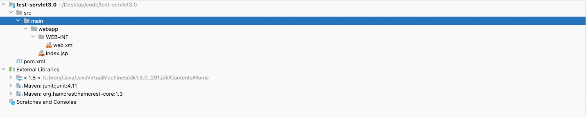
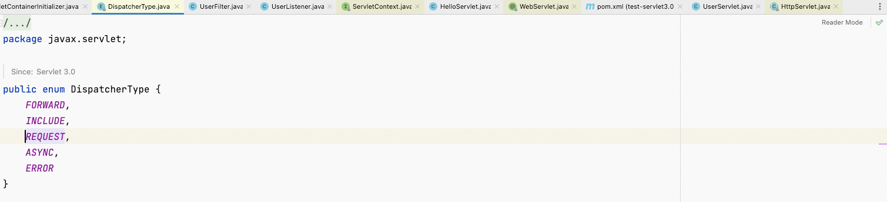

**<font style="color:#F5222D;">笔记来源：</font>**[**<font style="color:#F5222D;">尚硅谷Spring注解驱动教程(雷丰阳源码级讲解)</font>**](https://www.bilibili.com/video/BV1gW411W7wy/?p=2&spm_id_from=pageDriver&vd_source=e8046ccbdc793e09a75eb61fe8e84a30)


**<font style="color:#1DC0C9;">前言</font>**

现在咱们是来到了Spring注解驱动开发的最后一部分了，即与web相关的部分。在这一部分，我们将学会注解版的WEB开发，如果是以前的话，编写好web开发的三大组件（即Servlet、Filter以及Listener）之后，那么还得需要在web.xml配置文件中进行注册。不仅如此，包括Spring MVC的前端控制器（即DispatcherServlet）如果要使用，它也得在web.xml配置文件中进行注册，因为它依然是一个Servlet。

而在Servlet 3.0标准以后，它给我们提供了一些非常方便的方式，即使用注解，来完成这些组件的注册以及添加，包括呢，它也会给我们提供了一些运行时的可插拔的插件功能。

所以，接下来我们就来体验一下Servlet原生标准的注解版开发，即去除web.xml配置文件，使用注解来快速地搭建起我们的web应用。

# 1 Servlet3.0初相识
大家首先得知道一点，Servlet 3.0标准是需要Tomcat 7.0.x及以上版本的服务器来支持的，而且Servlet 3.0是属于JSR 315系列中的规范。大家可以去jcp的官网，即

[The Java Community Process(SM) Program](https://www.jcp.org/en/home/index)

亲自去搜索一下Servlet 3.0标准。

首次进入jcp的官网，应该是下面这样子的。


然后，在页面右上角的搜索框中输入Servlet 3.0进行搜索，搜索结果如下。


接着，点进上图中的Download page下载链接跳转到如下页面。


紧接着，点击上图中的DOWNLOAD按钮跳转到Servlet 3.0标准规范文档的下载页面，千万记得在下载Servlet 3.0标准规范文档之前，点选上Accept License Agreement，如下图所示。


这时，你应该能在浏览器中看到Servlet 3.0标准规范文档了，如下图所示。


最后，点击页面右上角的下载箭头即可下载Servlet 3.0标准规范文档，即servlet-3_0-mrel-spec.pdf。

[servlet-3_0-mrel-spec.pdf](https://www.yuque.com/attachments/yuque/0/2023/pdf/22334924/1683515978342-6f320fc9-ea51-4ee1-95ad-6e9c78aa42dc.pdf)

大家可以按照以上步骤来下载下来Servlet 3.0标准规范文档，全是英文哟！英文好的同学可以大致地浏览一遍，看一看官方的文档还是很有好处的，但是想来你也不会看。

不过，我们还是打开该文档看一下好了，它里面有一个章节，即Annotations and pluggability，是专门来讲注解驱动以及插件运行能力的，如下图所示。


我们先知道有这个事就行了。等一下，我们就会来体会Servlet 3.0标准里面的相关注解。这里先暂且不表。

我在上面说了这样一句话，即Servlet 3.0标准是需要Tomcat 7.0.x及以上版本的服务器来支持的。我为什么会这么说呢？因为你只要去tomcat官方网站看一看便会知道了，我们不妨进入

[Apache Tomcat® - Which Version Do I Want?](http://tomcat.apache.org/whichversion.html)

这个网页里面去看一下，如下图所示。


现在看到了吧！只有Tomcat 7.0.x及以上版本的服务器才支持Servlet 3.0标准。所以，将来我们在运行项目的时候，大家一定要下载Tomcat 7.0.x及其以上版本的Tomcat服务器才行。

接下来，我们就得来体会一下Servlet 3.0标准里面的相关注解了。首先，按照如下步骤来创建一个动态web工程，例如test-servlet3.0。

1. 创建maven web项目


2. 填写项目名称


3. 选择maven的版本以及setting文件


根据以上步骤创建出来我们的动态web工程之后，接下来，我们就得来编写一个案例来进行测试了。



<font style="color:rgb(77, 77, 77);">需求是这样的，我们希望发出一个get请求，然后给我们客户端响应一串字符串。这个需求说得应该是非常明朗了，为了解决这个需求，首先，我们在工程下创建一个首页，例如index.jsp，其内容如下。</font>

```html
<html>
  <body>
    <h2>Hello World Java!</h2>
  </body>
</html>
```

```xml
  <dependencies>
    
    <dependency>
      <groupId>junit</groupId>
      junit</artifactId>
      <version>4.11</version>
      <scope>test</scope>
    </dependency>
    
		<!-- 继承的 HttpServlet就来自于该包,这个包不需要添加，tomcat中包含着呢   -->
<!--     <dependency>
      <groupId>javax.servlet</groupId>
      servlet-api</artifactId>
      <version>3.0-alpha-1</version>
      <scope>provided</scope>
    </dependency> -->

		<!-- @WebServlet来自于该包     -->
    <dependency>
      <groupId>org.apache.tomcat</groupId>
      tomcat-api</artifactId>
      <version>8.0.53</version>
    </dependency>

  </dependencies>
```

然后，我们新建一个Servlet，例如HelloServlet，来处理以上get请求，即使用response来给我们浏览器写出一个字符串。

```java
package com.testcg;


import java.io.IOException;
import javax.servlet.ServletException;
import javax.servlet.http.HttpServlet;
import javax.servlet.http.HttpServletRequest;
import javax.servlet.http.HttpServletResponse;

public class HelloServlet extends HttpServlet {

    @Override
    protected void doGet(HttpServletRequest req, HttpServletResponse resp) throws ServletException, IOException {
        // TODO Auto-generated method stub
        // super.doGet(req, resp);
        resp.getWriter().write("hello ...");
    }

}
```

Servlet，你还记得吗？它就是咱们web三大组件之一，编写出一个以上的Servlet，你应该会写吧😀，不要告诉我一个如此简单的Servlet，你都不会写，那你学习是学到狗肚子里面了吗？这里，我还是稍微说一嘴，你也不要嫌我烦，就当是回顾回顾一下以前的知识呗！以上我们编写的HelloServlet类继承了HttpServlet，这样它就真正成为一个Servlet了，而且在该Servlet中，我们只复写了一个doGet方法。

接着，我们要干嘛呢？如果是以前的话，那么我们需要将以上编写好的Servlet配置在web.xml文中，例如配置一下其拦截路径等等。而现在我们只需要使用一个简单的注解就行了，即@WebServlet。并且，我们还可以在该注解中配置要拦截哪些路径，例如@WebServlet("/hello")，这样就会拦截一个hello请求了。

```java
package com.testcg;


import java.io.IOException;
import javax.servlet.ServletException;
import javax.servlet.annotation.WebServlet;
import javax.servlet.http.HttpServlet;
import javax.servlet.http.HttpServletRequest;
import javax.servlet.http.HttpServletResponse;

@WebServlet("/hello")
public class HelloServlet extends HttpServlet {

    @Override
    protected void doGet(HttpServletRequest req, HttpServletResponse resp) throws ServletException, IOException {
        // TODO Auto-generated method stub
        // super.doGet(req, resp);
        resp.getWriter().write("hello ...");
    }

}
```

在以上HelloServlet标注上一个@WebServlet("/hello")注解之后，只要hello请求发过来，那么就会来到这个HelloServlet，并调用其doGet方法来进行处理。

由于我们配置的是web项目，且不是springboot服务，所以项目需要配置tomcat，那么，idea配置tomcat的步骤如下：

[IDEA配置tomcat](https://www.yuque.com/chenguang201/java/qdzipfv1pwdgk6iq)

紧接着，我们就要运行项目进行测试了。项目成功启动后


咱们在浏览器地址栏中输入[http://localhost:8080/hello](http://localhost:8080/hello)进行访问，如下图所示。


看到了没有，我们只用了@WebServlet("/hello")这样一个注解就能注册我们的Servlet了，这是不是非常简单啊！

最后，我们不妨看一下Servlet 3.0标准规范文档，在里面你会发现有惊喜哟！哦豁，原来真是用@WebServlet注解来注册Servlet啊！当然，该注解里面的一些属性代表的是什么意思，你可以从该规范文档里面找到哟，这里我就不说了。


除此之外，还有一个@WebFilter注解哟，它是用来注册Filter的。


还有一个@WebListener注解呢，它是用来注册Listener的。


要是Servlet和Filter要配置一些初始化参数，那么你还可以使用@WebInitParam注解哟~

以上这些注解的使用，你可以按照规范文档挨个来进行测试哟！

# 48. <font style="color:rgb(34, 34, 38);">2 ServletContainerInitializer</font>
在前一讲中，我们也大概知道了Servlet 3.0规范里面的一些简单注解，利用它们可以来注册Servlet、Filter以及Listener等组件。但是，这些注解不是我们要讲述的重点，因为毕竟原生的Servlet开发场景用到的还是比较少的。

那么，在这一讲中，我们来讲述什么呢？打开Servlet 3.0标准规范文档，找到Annotations and pluggability这一章节下的8.2 Pluggability这一小节，找到之后，再找到该小节下的最后一个小节，即Shared libraries / runtimes pluggability，翻译过来，应该是共享库/运行时插件能力。


这是一个非常重要的机制，该机制在后来我们框架整合里面用到的非常多，所以，这一讲我们就来讲下它。

****

**Shared libraries（共享库）/ runtimes pluggability（运行时插件能力）**  
我们好好看看Servlet 3.0标准规范文档中Shared libraries / runtimes pluggability这一小节，大概在该小节的第二段描述中，有句话说的是，container（即Servlet容器，比如Tomcat服务器之类的）在启动我们的应用的时候，它会来扫描jar包里面的ServletContainerInitializer的实现类。

我们现在知道了，当Servlet容器启动我们的应用时，它会扫描我们当前应用中每一个jar里面的ServletContainerInitializer的实现类。那究竟是一个怎么扫描法呢？我们再好好看看该小节的第二段描述，它说，我们得提供ServletContainerInitializer的一个实现类，提供完这个实现类之后还不行，我们还必须得把它绑定在META-INF/services/目录下面的名字叫javax.servlet.ServletContainerInitializer的文件里面。

也就是说，必须将提供的实现类绑定在META-INF/services/javax.servlet.ServletContainerInitializer文件中，所谓的绑定就是在javax.servlet.ServletContainerInitializer文件里面写上ServletContainerInitializer实现类的全类名，也就是说，javax.servlet.ServletContainerInitializer文件中的内容就是咱们提供的ServletContainerInitializer实现类的全类名。

至此，我们才总算搞清楚了这个非常重要的机制，总结一下就是，Servlet容器在启动应用的时候，会扫描当前应用每一个jar包里面的META-INF/services/javax.servlet.ServletContainerInitializer文件中指定的实现类，然后，再运行该实现类中的方法。

接下来，我们就来测试一下该机制。

首先，我们来编写一个类，例如MyServletContainerInitializer，来实现ServletContainerInitializer接口。

```java
package com.meimeixia.servlet;

import java.util.Set;

import javax.servlet.ServletContainerInitializer;
import javax.servlet.ServletContext;
import javax.servlet.ServletException;

public class MyServletContainerInitializer implements ServletContainerInitializer {

	@Override
	public void onStartup(Set<Class<?>> arg0, ServletContext arg1) throws ServletException {
		// TODO Auto-generated method stub
		
	}
}
```

然后，按照Servlet 3.0标准规范文档中所说的，将以上类的全类名配置在META-INF/services目录下的javax.servlet.ServletContainerInitializer文件中。一开始甚至连META-INF/services目录都没有，更何谈什么javax.servlet.ServletContainerInitializer文件，因此，我们得在当前项目的根目录下，即在resources目录下把META-INF/services这个目录给创建出来，接着在该目录下创建一个名字为javax.servlet.ServletContainerInitializer的文件。

这一切都弄完之后，我们就将咱们自己编写的MyServletContainerInitializer类的全类名配置在javax.servlet.ServletContainerInitializer文件，如下图所示。


这样的话，Servlet容器在我们的应用一启动的时候，就会找到以上这个实现类，并来运行它其中的方法。

那么运行该实现类的什么方法呢？我们发现MyServletContainerInitializer实现类中就只有一个叫onStartup的方法，因此Servlet容器在我们的应用一启动的时候，就会运行该实现类中的onStartup方法。

而且，我们还可以看到该方法里面有两个参数，其中一个参数是ServletContext对象，我们对它已经很熟悉了，它就是用来代表当前web应用的，一个web应用就对应着一个ServletContext对象。此外，它也是我们常说的四大域对象之一，我们给它里面存个东西，只要应用在不关闭之前，我们都可以在任何位置获取到。

说完其中一个参数，我们着重来说第二个参数，即Set<Class<?>> arg0，它又是什么呢？我可以参照Servlet 3.0标准规范文档中的下面第三段描述，描述说，我们可以在ServletContainerInitializer的实现类上使用一个@HandlesTypes注解，而且在该注解里面我们可以写上一个类型数组哟，也就是说可以指定各种类型。


那么，@HandlesTypes注解有什么作用呢？Servlet容器在启动应用的时候，会将@HandlesTypes注解里面指定的类型下面的子类，包括实现类或者子接口等，全部给我们传递过来。

实践是检验真理的唯一标准，我们用案例说话。我们不妨先写一个我们感兴趣的类型，比如一个接口，名字可以叫HelloService，如下所示。

```java
package com.meimeixia.service;

public interface HelloService {

}

```

旋即，我们就可以在咱们自己编写的MyServletContainerInitializer实现类上写上这样一个@HandlesTypes(value={HelloService.class})注解了。

```java
package com.meimeixia.servlet;

import java.util.Set;

import javax.servlet.ServletContainerInitializer;
import javax.servlet.ServletContext;
import javax.servlet.ServletException;
import javax.servlet.annotation.HandlesTypes;

import com.meimeixia.service.HelloService;

@HandlesTypes(value={HelloService.class})
public class MyServletContainerInitializer implements ServletContainerInitializer {

	/*
	 * 参数：
	 *    ServletContext arg1：代表当前web应用。一个web应用就对应着一个ServletContext对象，此外，它也是我们常说的四大域对象之一，
	 *    我们给它里面存个东西，只要应用在不关闭之前，我们都可以在任何位置获取到
	 *    
	 *    Set<Class<?>> arg0：我们感兴趣的类型的所有后代类型
	 *    
	 */
	@Override
	public void onStartup(Set<Class<?>> arg0, ServletContext arg1) throws ServletException {
		// TODO Auto-generated method stub
		
	}

}
```

只要在@HandlesTypes注解里面指定上我们感兴趣的类型，那么Servlet容器在启动的时候就会自动地将该类型（即HelloService接口）下面的子类，包括实现类或者子接口等全部都传递过来，很显然，参数Set<Class<?>> arg0指的就是我们感兴趣的类型的所有后代类型。

接着，我们就为以上HelloService接口来写上几个实现。比如，先来写一个该接口的子接口，就叫HelloServiceExt，如下所示。

```java
package com.meimeixia.service;

public interface HelloServiceExt extends HelloService {

}
```

  
再来创建一个实现该接口的抽象类，可以叫AbstractHelloService，如下所示。

```java
package com.meimeixia.service;

public abstract class AbstractHelloService implements HelloService {

}
```

再再来创建一个该接口的实现类，例如HelloServiceImpl，如下所示。

```java
package com.meimeixia.service;

public class HelloServiceImpl implements HelloService {

}

```

现在，HelloService接口下面有以上这三种不同的后代类型了。如此一来，Servlet容器在一启动的时候，就会把我们感兴趣的所有类型能传递过来，这时，我们就可以来输出一下了。

```java
package com.meimeixia.servlet;

import java.util.Set;

import javax.servlet.ServletContainerInitializer;
import javax.servlet.ServletContext;
import javax.servlet.ServletException;
import javax.servlet.annotation.HandlesTypes;

import com.meimeixia.service.HelloService;

@HandlesTypes(value={HelloService.class})
public class MyServletContainerInitializer implements ServletContainerInitializer {

	/*
	 * 参数：
	 *    ServletContext arg1：代表当前web应用。一个web应用就对应着一个ServletContext对象，此外，它也是我们常说的四大域对象之一，
	 *    我们给它里面存个东西，只要应用在不关闭之前，我们都可以在任何位置获取到
	 *    
	 *    Set<Class<?>> arg0：我们感兴趣的类型的所有后代类型
	 *    
	 */
	@Override
	public void onStartup(Set<Class<?>> arg0, ServletContext arg1) throws ServletException {
		// TODO Auto-generated method stub
		System.out.println("我们感兴趣的所有类型：");
		// 好，我们把这些类型来遍历一下
		for (Class<?> clz : arg0) {
			System.out.println(clz);
		}
	}

}

```

可以看到，目前，我们暂时还用不到ServletContext对象参数。

最后，我们来启动项目，看一看控制台会不会打印我们感兴趣的所有类型，如下图所示，确实是打印出了我们感兴趣的所有类型。


而且，还可以看到我们感兴趣的类型本身（即HelloService接口）没有打印之外，它下面的所有后代类型，不管是抽象类，还是子接口，还是实现类，都给打印出来了。

这也验证了这一点，即Servlet容器在启动应用的时候，会将@HandlesTypes注解里面指定的类型下面的子类，包括实现类或者子接口等，全部都给我们传递过来。那这样有啥子用呢？只要给我们传入了某一感兴趣的类型，我们是不是就可以利用反射来创建对象了啊！

以上就是基于运行时插件的ServletContainerInitializer机制。这个机制最重要的就是要启动ServletContainerInitializer的实现类，然后就能传入我们感兴趣的类型了，该机制有两个核心，一个是ServletContainerInitializer，一个是@HandlesTypes注解。

该机制我们就介绍到这，等到我们整合Spring MVC的时候，我们就会用到它了。

# 3 <font style="color:rgb(79, 79, 79);">ServletContext</font>
上一讲，我们说了一下基于运行时插件的ServletContainerInitializer机制，而在这一讲中，我们就来详细讲一下ServletContext用来注册web组件的用法，即使用ServletContext注册web组件。这些web组件就是我们通常所说的web三大组件，也就是Servlet、Filter以及Listener。

为什么我们一定要掌握使用ServletContext来注册web组件呢？因为我们是一定会遇到这样场景的，如果是以注解的方式来注册web组件，那么前提是这些web组件是由我们自己来编写的，这样，我们才可以把注解加上。但是，如果项目中导入的是第三方jar包，它们里面是有一些组件的，比如在项目中导入了阿里巴巴的连接池里面的Filter，对于这些组件而言，如果项目中有web.xml文件，那么我们就可以将它们配置在该配置文件中了，但是，我们现在的项目中是没有web.xml文件的，所以我们就要利用ServletContext将它们给注册进来了。


**使用ServletContext注册web三大组件**  
ServletContext里面有如下这些方法。


有了这些方法，我们就可以利用它们给ServletContext里面注册一些组件了。接下来，我们就来编写一些示例组件。


首先，编写一个Servlet，例如UserServlet，如下所示。

```java
package com.meimeixia.servlet;

import java.io.IOException;

import javax.servlet.ServletException;
import javax.servlet.http.HttpServlet;
import javax.servlet.http.HttpServletRequest;
import javax.servlet.http.HttpServletResponse;

public class UserServlet extends HttpServlet {

	@Override
	protected void doGet(HttpServletRequest req, HttpServletResponse resp) throws ServletException, IOException {
		// TODO Auto-generated method stub
		resp.getWriter().write("tomcat...");
	}
	
}

```

然后，再来编写一个Filter，例如UserFilter，要想成为一个Filter，它必须得实现Servlet提供的Filter接口。

```java
package com.meimeixia.servlet;

import java.io.IOException;

import javax.servlet.Filter;
import javax.servlet.FilterChain;
import javax.servlet.FilterConfig;
import javax.servlet.ServletException;
import javax.servlet.ServletRequest;
import javax.servlet.ServletResponse;

public class UserFilter implements Filter {

	// 销毁方法
	@Override
	public void destroy() {
		// TODO Auto-generated method stub
		
	}

	@Override
	public void doFilter(ServletRequest arg0, ServletResponse arg1, FilterChain arg2)
			throws IOException, ServletException {
		// 过滤请求
		System.out.println("UserFilter...doFilter方法...");
		// 放行
		arg2.doFilter(arg0, arg1);
	}

	// 初始化方法
	@Override
	public void init(FilterConfig arg0) throws ServletException {
		// TODO Auto-generated method stub
		
	}

}

```

接着，再来编写一个Listener，例如UserListener，我们要知道监听器是有很多的，所以这儿我们不妨让UserListener来实现ServletContextListener接口，以监听ServletContext的创建和启动过程。

```java
package com.meimeixia.servlet;

import javax.servlet.ServletContext;
import javax.servlet.ServletContextEvent;
import javax.servlet.ServletContextListener;

/**
 * ServletContextListener的作用：监听项目的启动和停止
 * @author liayun
 *
 */
public class UserListener implements ServletContextListener {

	// 这个方法是来监听ServletContext销毁的，也就是说，我们这个项目的停止
	@Override
	public void contextDestroyed(ServletContextEvent arg0) {
		// TODO Auto-generated method stub
		System.out.println("UserListener...contextDestroyed...");
	}

	// 这个方法是来监听ServletContext启动初始化的
	@Override
	public void contextInitialized(ServletContextEvent arg0) {
		// TODO Auto-generated method stub
		System.out.println("UserListener...contextInitialized...");
	}

}

```

## 3.1 注册Servlet
<font style="color:rgb(77, 77, 77);">如下图所示，可以看到现在该方法中的两个参数名字的提示有好几个。</font>


那么，我们现在调用哪一个addServlet方法来注册UserServlet呢？我们不妨调用如下第二个addServlet方法，在第一个参数的位置传入我们UserServlet的名字，例如userServlet，在第二个参数的位置传入我们自己new的一个UserServlet对象。

其实，用哪一种addServlet方法都是可行的，只不过这儿我们选用了第二种方法而已。

此时，不出预料的话，应该会返回一个Dynamic类型的对象，但是为了将返回类型写得更详细点，我们可以将其写成ServletRegistration.Dynamic，如下所示。

```java
package com.meimeixia.servlet;

import java.util.Set;

import javax.servlet.ServletContainerInitializer;
import javax.servlet.ServletContext;
import javax.servlet.ServletException;
import javax.servlet.ServletRegistration;
import javax.servlet.annotation.HandlesTypes;

import com.meimeixia.service.HelloService;

@HandlesTypes(value={HelloService.class})
public class MyServletContainerInitializer implements ServletContainerInitializer {

	/*
	 * 参数：
	 *    ServletContext sc：代表当前web应用。一个web应用就对应着一个ServletContext对象，此外，它也是我们常说的四大域对象之一，
	 *    我们给它里面存个东西，只要应用在不关闭之前，我们都可以在任何位置获取到
	 *    
	 *    Set<Class<?>> arg0：我们感兴趣的类型的所有后代类型
	 *    
	 */
	@Override
	public void onStartup(Set<Class<?>> arg0, ServletContext sc) throws ServletException {
		// TODO Auto-generated method stub
		System.out.println("我们感兴趣的所有类型：");
		// 好，我们把这些类型来遍历一下
		for (Class<?> clz : arg0) {
			System.out.println(clz);
		}
		
		// 注册Servlet组件
		ServletRegistration.Dynamic servlet = sc.addServlet("userServlet", new UserServlet());
	}

}

```

至此，我们只是给ServletContext中注册了一个UserServlet组件。但是，该UserServlet的映射信息我们还没配置呢，即它是来处理什么样的请求的。那怎么办呢？很简单，返回的ServletRegistration.Dynamic对象有一个addMapping方法，调用它即可配置UserServlet的映射信息，如下所示。

```java
package com.meimeixia.servlet;

import java.util.Set;

import javax.servlet.ServletContainerInitializer;
import javax.servlet.ServletContext;
import javax.servlet.ServletException;
import javax.servlet.ServletRegistration;
import javax.servlet.annotation.HandlesTypes;

import com.meimeixia.service.HelloService;

@HandlesTypes(value={HelloService.class})
public class MyServletContainerInitializer implements ServletContainerInitializer {

	/*
	 * 参数：
	 *    ServletContext sc：代表当前web应用。一个web应用就对应着一个ServletContext对象，此外，它也是我们常说的四大域对象之一，
	 *    我们给它里面存个东西，只要应用在不关闭之前，我们都可以在任何位置获取到
	 *    
	 *    Set<Class<?>> arg0：我们感兴趣的类型的所有后代类型
	 *    
	 */
	@Override
	public void onStartup(Set<Class<?>> arg0, ServletContext sc) throws ServletException {
		// TODO Auto-generated method stub
		System.out.println("我们感兴趣的所有类型：");
		// 好，我们把这些类型来遍历一下
		for (Class<?> clz : arg0) {
			System.out.println(clz);
		}
		
		// 注册Servlet组件
		ServletRegistration.Dynamic servlet = sc.addServlet("userServlet", new UserServlet());
		// 配置Servlet的映射信息
		servlet.addMapping("/user");
	}

}

```

从上可以看到，我们的UserServlet现在是来处理user请求的。


## 3.2 注册Listener
注册Listener同上。那么，我们现在应该调用哪一个addListener方法来注册UserListener呢？我们不妨调用如下第一个addListener方法，在参数位置传入UserListener的类型，这样就会自动帮我们创建出UserListener对象，并将其注册到ServletContext中了。


其实，用哪一种addListener方法都是可行的，只不过这儿我们选用了第一种方法而已。监听器的注册也还蛮简单的，如下所示。

```java
package com.meimeixia.servlet;

import java.util.Set;

import javax.servlet.ServletContainerInitializer;
import javax.servlet.ServletContext;
import javax.servlet.ServletException;
import javax.servlet.ServletRegistration;
import javax.servlet.annotation.HandlesTypes;

import com.meimeixia.service.HelloService;

@HandlesTypes(value={HelloService.class})
public class MyServletContainerInitializer implements ServletContainerInitializer {

	/*
	 * 参数：
	 *    ServletContext sc：代表当前web应用。一个web应用就对应着一个ServletContext对象，此外，它也是我们常说的四大域对象之一，
	 *    我们给它里面存个东西，只要应用在不关闭之前，我们都可以在任何位置获取到
	 *    
	 *    Set<Class<?>> arg0：我们感兴趣的类型的所有后代类型
	 *    
	 */
	@Override
	public void onStartup(Set<Class<?>> arg0, ServletContext sc) throws ServletException {
		// TODO Auto-generated method stub
		System.out.println("我们感兴趣的所有类型：");
		// 好，我们把这些类型来遍历一下
		for (Class<?> clz : arg0) {
			System.out.println(clz);
		}
		
		// 注册Servlet组件
		ServletRegistration.Dynamic servlet = sc.addServlet("userServlet", new UserServlet());
		// 配置Servlet的映射信息
		servlet.addMapping("/user");
		
		// 注册Listener组件
		sc.addListener(UserListener.class);
	}

}

```

## 3.3 注册Filter
现在我们来注册Filter，即UserFilter。注册Servlet和Filter有一点特殊之处，那就是注册它俩之后都得配置其映射信息。

那么问题又来了，我们现在应该调用哪一个addFilter方法来注册UserFilter呢？我们不妨调用如下第一个addFilter方法，在第一个参数的位置传入我们UserFilter的名字，例如userFilter，在第二个参数的位置传入UserFilter的类型，即UserFilter.class，这样，Servlet容器（即Tomcat服务器）就会帮我们创建出一个UserFilter对象，并将其注册到ServletContext中。


其实，用第二种addFilter方法也是可行的，只不过是在第二个参数的位置传入我们自己new出来的UserFilter对象。

同样地，此时，应该会返回一个Dynamic类型的对象，只不过它是FilterRegistration里面的Dynamic，如下所示。

```java
package com.meimeixia.servlet;

import java.util.Set;

import javax.servlet.FilterRegistration;
import javax.servlet.ServletContainerInitializer;
import javax.servlet.ServletContext;
import javax.servlet.ServletException;
import javax.servlet.ServletRegistration;
import javax.servlet.annotation.HandlesTypes;

import com.meimeixia.service.HelloService;

@HandlesTypes(value={HelloService.class})
public class MyServletContainerInitializer implements ServletContainerInitializer {

	/*
	 * 参数：
	 *    ServletContext sc：代表当前web应用。一个web应用就对应着一个ServletContext对象，此外，它也是我们常说的四大域对象之一，
	 *    我们给它里面存个东西，只要应用在不关闭之前，我们都可以在任何位置获取到
	 *    
	 *    Set<Class<?>> arg0：我们感兴趣的类型的所有后代类型
	 *    
	 */
	@Override
	public void onStartup(Set<Class<?>> arg0, ServletContext sc) throws ServletException {
		// TODO Auto-generated method stub
		System.out.println("我们感兴趣的所有类型：");
		// 好，我们把这些类型来遍历一下
		for (Class<?> clz : arg0) {
			System.out.println(clz);
		}
		
		// 注册Servlet组件
		ServletRegistration.Dynamic servlet = sc.addServlet("userServlet", new UserServlet());
		// 配置Servlet的映射信息
		servlet.addMapping("/user");
		
		// 注册Listener组件
		sc.addListener(UserListener.class);
		
		// 注册Filter组件
		FilterRegistration.Dynamic filter = sc.addFilter("userFilter", UserFilter.class);
	}

}

```

你看到了没有，调用ServletContext对象的addServlet方法（即注册Servlet）和addFilter方法（即注册Filter），都会返回一个Dynamic对象，只不过一个是ServletRegistration里面的Dynamic，一个是FilterRegistration里面的Dynamic，大家可一定要注意哟~~~

然后，我们需要利用返回的FilterRegistration.Dynamic对象中的addMappingForXxx方法配置UserFilter的映射信息。

那么，我们现在调用哪一个addMappingForXxx方法来配置UserFilter的映射信息呢？不妨使用第一个方法，即addMappingForUrlPatterns方法，因为在该方法中我们可以自己来写url映射。


```java
package com.meimeixia.servlet;

import java.util.EnumSet;
import java.util.Set;

import javax.servlet.DispatcherType;
import javax.servlet.FilterRegistration;
import javax.servlet.ServletContainerInitializer;
import javax.servlet.ServletContext;
import javax.servlet.ServletException;
import javax.servlet.ServletRegistration;
import javax.servlet.annotation.HandlesTypes;

import com.meimeixia.service.HelloService;

@HandlesTypes(value={HelloService.class})
public class MyServletContainerInitializer implements ServletContainerInitializer {

	/*
	 * 参数：
	 *    ServletContext sc：代表当前web应用。一个web应用就对应着一个ServletContext对象，此外，它也是我们常说的四大域对象之一，
	 *    我们给它里面存个东西，只要应用在不关闭之前，我们都可以在任何位置获取到
	 *    
	 *    Set<Class<?>> arg0：我们感兴趣的类型的所有后代类型
	 *    
	 */
	@Override
	public void onStartup(Set<Class<?>> arg0, ServletContext sc) throws ServletException {
		// TODO Auto-generated method stub
		System.out.println("我们感兴趣的所有类型：");
		// 好，我们把这些类型来遍历一下
		for (Class<?> clz : arg0) {
			System.out.println(clz);
		}
		
		// 注册Servlet组件
		ServletRegistration.Dynamic servlet = sc.addServlet("userServlet", new UserServlet());
		// 配置Servlet的映射信息
		servlet.addMapping("/user");
		
		// 注册Listener组件
		sc.addListener(UserListener.class);
		
		// 注册Filter组件
		FilterRegistration.Dynamic filter = sc.addFilter("userFilter", UserFilter.class);
		// 配置Filter的映射信息
		filter.addMappingForUrlPatterns(EnumSet.of(DispatcherType.REQUEST), true, "/*");
	}

}

```

可以看到，addMappingForUrlPatterns方法中传入的第一个参数还是蛮奇怪的，居然是EnumSet.of(DispatcherType.REQUEST)，该参数表示的是Filter拦截的请求类型，即通过什么方式过来的请求，Filter会进行拦截。我们不妨点进DispatcherType枚举的源码里面去看一看，如下图所示，可以看到好多的请求类型，不过常用的就应该是FORWARD和REQUEST它俩。



现在addMappingForUrlPatterns方法中传入的第一个参数是EnumSet.of(DispatcherType.REQUEST)，表明我们写的UserFilter会拦截通过request方式发送过来的请求。

该方法中的第二个参数（即isMatchAfter）我们直接传入true就行，第三个参数（即urlPatterns）就是Filter要拦截的路径，目前我们传入的是/*，即拦截所有请求。

以上就是我们以编码的方式向ServletContext对象中注册web中的三大组件。


启动项目，进行测试  
现在我们来启动项目进行测试，看我们注册的以上三个组件有没有起到作用。如果注册的UserFilter真的起到作用了，那么它就会在放行目标请求之前打印相应内容；如果注册的UserListener真的起到作用了，那么在其创建和销毁过程中也会有相应内容打印；如果注册的UserServlet真的起到作用了，那么当我们发送一个user请求后，就能在浏览器页面中看到有相应内容输出了。

真的是这样吗？我们不妨来启动一下我们的项目，发现控制台打印了如下内容。


可以看到我们注册的UserListener确实起到作用了，在项目启动的时候，有相关内容输出，因为它本来就是监听项目的启动和停止的。


然后，我们来访问项目的首页，此时，浏览器中显示的是首页的内容，如下图所示。


接着，我们在浏览器地址栏中输入[http://localhost:8080/user](http://localhost:8080/user)进行访问，即向服务器发送了一个user请求，此时，我们注册的UserServlet就会来处理该请求，并给浏览器响应相应内容，如下图所示。


而且，我们注册的UserFilter也会起到作用，即在目标请求放行之前会打印相应内容，不信，你看控制台打印的内容。


最后，我们来停止Tomcat服务器，此时，由于我们注册的UserListener会监听到项目的停止，因此监听ServletContext销毁的方法也会运行，在控制台也会有相应内容输出，如下图所示。


总结  
我们可以通过编码的方式在项目启动的时候，给ServletContext（即当前项目）里面来注册组件。当然，并不是说，你只要拿到了ServletContext对象就能注册组件了，因为必须是在项目启动的时候，才能注册组件。

而且，在项目启动的时候，我们可以有两处来使用ServletContext对象注册组件。

第一处就是利用基于运行时插件的ServletContainerInitializer机制得到ServletContext对象，然后再往其里面注册组件。本讲通篇所讲述的就是在这一处使用ServletContext对象来注册组件。

第二处，你可能想不到，我们上面不是编写过一个监听器（即UserListener）吗？它是来监听项目的启动和停止的，在监听项目启动的方法中，传入了一个ServletContextEvent对象，即事件对象，我们就可以通过该事件对象的getServletContext方法拿到ServletContext对象，拿到之后，是不是就可以往它里面注册组件了啊？

```java
package com.meimeixia.servlet;

import javax.servlet.ServletContext;
import javax.servlet.ServletContextEvent;
import javax.servlet.ServletContextListener;

/**
 * ServletContextListener的作用：监听项目的启动和停止
 * @author liayun
 *
 */
public class UserListener implements ServletContextListener {

	// 这个方法是来监听ServletContext销毁的，也就是说，我们这个项目的停止
	@Override
	public void contextDestroyed(ServletContextEvent arg0) {
		// TODO Auto-generated method stub
		System.out.println("UserListener...contextDestroyed...");
	}

	// 这个方法是来监听ServletContext启动初始化的
	@Override
	public void contextInitialized(ServletContextEvent arg0) {
		// TODO Auto-generated method stub
		ServletContext servletContext = arg0.getServletContext();
		System.out.println("UserListener...contextInitialized...");
	}

}

```

温馨提示：在项目运行的时候，再给ServletContext对象里面来注册组件，那是不行的，这是出于安全来考虑的。  


