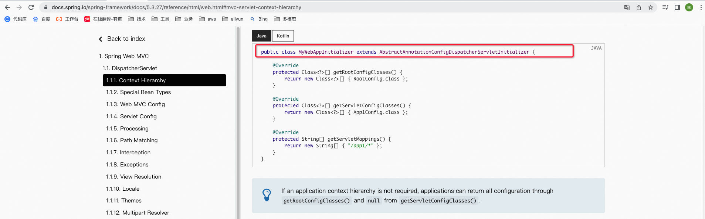
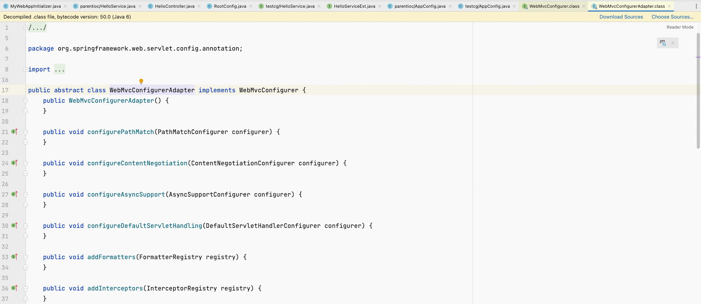

**<font style="color:#F5222D;">笔记来源：</font>**[**<font style="color:#F5222D;">尚硅谷Spring注解驱动教程(雷丰阳源码级讲解)</font>**](https://www.bilibili.com/video/BV1gW411W7wy/?p=2&spm_id_from=pageDriver&vd_source=e8046ccbdc793e09a75eb61fe8e84a30)

**<font style="color:#F5222D;"></font>**

[music163](https://music.163.com/outchain/player?type=2&id=2007069352&auto=0&height=66)

**<font style="color:#D22D8D;">前言</font>**

在前面，我们说了一下ServletContainerInitializer机制以及如何利用ServletContext向web容器中注册Servlet、Listener以及Filter这三大组件。而在这一讲中，我们就来详细分析下Servlet 3.0是如何利用ServletContainerInitializer机制来整合Spring MVC的。

注意，这儿还只是来研究分析整合Spring MVC的底层，并没有开始正式整合Spring MVC哟，这是下一讲的事情。

# 1 Servlet 3.0与SpringMVC的整合分析
导入相关的依赖。先导入对spring-webmvc的依赖，注意其版本是4.3.11.RELEASE。

```xml
<dependencies>
  <dependency>
    <groupId>org.springframework</groupId>
    spring-webmvc</artifactId>
    <version>4.3.11.RELEASE</version>
  </dependency>
</dependencies>
```

这样，我们就把Spring MVC的webmvc包，以及它所依赖的其他jar包，都一并导入进来了。


再来导入对servlet api的依赖，注意其版本是3.1.0，因为我们现在是在用Servlet 3.0以上的特性。

```xml
<dependencies>
  <dependency>
    <groupId>org.springframework</groupId>
    spring-webmvc</artifactId>
    <version>4.3.11.RELEASE</version>
  </dependency>
  <dependency>
    <groupId>javax.servlet</groupId>
    javax.servlet-api</artifactId>
    <version>3.1.0</version>
    <scope>provided</scope>
  </dependency>
</dependencies>

```

此外，还要注意<scope>provided</scope>配置哟！由于Tomcat服务器里面也有servlet api，即目标环境已经该jar包了，所以我们在这儿将以上servlet api的scope设置成provided。这样的话，我们的项目在被打成war包时，就不会带上该jar包了，否则就会引起jar包冲突。

依赖都导完以后，接下来我们来讲些什么呢？就讲一下Servlet 3.0整合Spring MVC的底层原理。

我们不妨去Spring官网看看Spring的官方文档，Spring的官网地址是

[Home](https://spring.io/)

进去之后，你能看到如下图所示的页面。


看到网页顶部导航栏中的Projects菜单没有，将鼠标光标放在它上面，你就能看到如下所示的下拉列表了，然后点击其中的Spring Framework选项。


点击箭头所指的Spring Framework，来到Spring框架的介绍页面，如下图所示，可以看到Spring框架的最新版本是6.0.8。


紧接着，点击箭头所指的LEARN切换到如下所示的选项卡中，点击Reference Doc.超链接，我们就能查看Spring Framework 版本的Spring官方文档了。本次看5.3.27版本


Spring官方文档分类是非常详细的，如下图所示，不过这儿我们只关注Web Servlet这一分类，因为它主要是来讲述Spring MVC、WebSocket等等的。


点击Web Servlet之后，你就应该能看到如下页面了。


从上图可以看到，在Spring Web MVC这一部分下有这样1.1. DispatcherServlet一个小节，这一小节主要是来讲述配置DispatcherServlet的，我们不妨看一看该小节中的内容，如下图所示。


你要是没有耐心看那些文字描述，不如集中精力看Java代码。这块的Java代码我得来好好说说，摘抄如下：

```java
// 我们可以编写一个类来实现WebApplicationInitializer接口哟，当然了，你也可以编写一个类来实现ServletContainerInitializer接口
public class MyWebApplicationInitializer implements WebApplicationInitializer {

	@Override
	public void onStartup(ServletContext servletContext) {

		// 然后，我们来创建一个AnnotationConfigWebApplicationContext对象，它应该代表的是web的IOC容器
		AnnotationConfigWebApplicationContext context = new AnnotationConfigWebApplicationContext();
		// 加载我们的配置类
		context.register(AppConfig.class);

		// 在容器启动的时候，我们自己来创建一个DispatcherServlet对象，并将其注册在ServletContext中
		DispatcherServlet servlet = new DispatcherServlet(context);
		ServletRegistration.Dynamic registration = servletContext.addServlet("app", servlet);
		registration.setLoadOnStartup(1);
		// 这儿是来配置DispatcherServlet的映射信息的
		registration.addMapping("/app/*");
	}
}

```

当然了，如果你使用以上这种编码方式来整合Spring MVC，那也不是不可以，只不过我们并不会用这种方式而已。

其实，这种方式类似于我们以前整合Spring MVC时在web.xml文件中写的如下配置，这你应该就很熟悉了吧！

```xml
<!-- 使用监听器启动Spring的配置（即spring/applicationContext-*.xml），加载Spring的配置来启动Spring容器，这个容器我们叫它父容器，也可以称之为根容器 -->
<listener>
	<listener-class>org.springframework.web.context.ContextLoaderListener</listener-class>
</listener>

<!-- 初始化Spring容器 -->
<context-param>
	<param-name>contextConfigLocation</param-name>
	<param-value>classpath:spring/applicationContext-*.xml</param-value>
</context-param>

<!-- 子容器，Spring MVC子容器-->
<!-- 前端控制器 -->
<servlet>
	<servlet-name>taotao-search-web</servlet-name>
	<servlet-class>org.springframework.web.servlet.DispatcherServlet</servlet-class>
	<!-- contextConfigLocation不是必须的，如果不配置contextConfigLocation， Spring MVC的配置文件默认在：WEB-INF/servlet的name+"-servlet.xml" -->
	<init-param>
		<param-name>contextConfigLocation</param-name>
		<!-- 指定Spring MVC配置文件的路径 -->
		<param-value>classpath:spring/springmvc.xml</param-value>
	</init-param>
	<load-on-startup>1</load-on-startup>
</servlet>

<!-- 配好映射 -->
<servlet-mapping>
	<servlet-name>taotao-search-web</servlet-name>
	<!-- 伪静态化 -->
	<url-pattern>*.html</url-pattern>
</servlet-mapping>

```

可以看到我们以前配置的是这种父子容器，而且Spring也推荐使用父子容器的概念。

既然我们不会用上述这种方式，那么得用哪种方式呢？不妨展开我们maven工程下的Maven Dependencies目录，发现我们导入了spring-web-4.3.11.RELEASE.jar这样一个jar包，如下图所示。


展开该jar包，发现它里面有一个META-INF/services/目录，而且在该目录下有一个名字叫javax.servlet.ServletContainerInitializer的文件，其内容如下所示。


哎呀，这不是我们熟悉的东东吗？小样，我还不认识你呀！

其实，我们以前就说过，Servlet容器在启动应用的时候，会扫描当前应用每一个jar包里面的META-INF/services/javax.servlet.ServletContainerInitializer文件中指定的实现类，然后加载该实现类并运行它里面的方法。

那我们就来看一下spring-web-4.3.11.RELEASE.jar中META-INF/services/目录里面的javax.servlet.ServletContainerInitializer文件中到底指定的哪一个类，从上图我们可以知道其指定的是org.springframework.web.SpringServletContainerInitializer这个类。

我们不妨查看一下该类的源码，如下图所示，它实现的就是ServletContainerInitializer接口。


它里面也只有一个onStartup方法，所以我们重点来看该方法的具体实现。我也只是粗浅地来说一下，如果有说的不对的地方，还请多多指正😁。


似乎说的是，Servlet容器在启动我们Spring应用之后，会传入一个我们感兴趣的类型的集合，然后在onStartup方法中拿到之后就会来挨个遍历，如果遍历出来的我们感兴趣的类型不是接口，也不是抽象类，但是WebApplicationInitializer接口旗下的，那么就会创建该类型的一个实例，并将其存储到名为initializers的LinkedList<WebApplicationInitializer>集合中。

也可以这样说，我们Spring的应用一启动就会加载感兴趣的WebApplicationInitializer接口旗下的所有组件，并且为这些WebApplicationInitializer组件创建对象，当然前提是这些组件即不是接口，也不是抽象类。

接下来，我们就来到咱们感兴趣的WebApplicationInitializer接口中，并查看该接口的继承树（快捷键Ctrl + T），发现它下面有三个抽象类，如下图所示。


因此，接下来，我们就得来好好研究一下以上这三个抽象类了。

第一层抽象类，即AbstractContextLoaderInitializer

我们先来研究WebApplicationInitializer接口下面的第一层抽象类，即AbstractContextLoaderInitializer。不妨点进该抽象类里面去看一看，如下图所示，我们主要来看其onStartUp方法。


发现在该方法中调用了一个registerContextLoaderListener方法，见名思意，应该是来注册ContextLoaderListener的。

我们继续点进registerContextLoaderListener方法里面去看一看，发现它里面调用了一个createRootApplicationContext方法，该方法是来创建根容器的，而且该方法是一个抽象方法，需要子类自己去实现。然后，根据创建的根容器创建上下文加载监听器（即ContextLoaderListener），接着，向ServletContext中注册这个监听器。

至此，以上这个抽象类，我们算是大概地分析完了。


接下来，我们来研究一下它下面的子类，即AbstractDispatcherServletInitializer，从名字上我们应该能知道它就是一个DispatcherServlet（即Spring MVC的前端控制器）的初始化器。


第二层抽象类，即AbstractDispatcherServletInitializer

我们也不妨点进该抽象类里面去看一看，并且主要来看其onStartUp方法，发现会注册DispatcherServlet，如下所示。

```java
@Override
public void onStartup(ServletContext servletContext) throws ServletException {
	// 调用父类（即AbstractContextLoaderInitializer）的onStartup方法，先把根容器创建出来
	super.onStartup(servletContext);
	// 往ServletContext中注册DispatcherServlet
	registerDispatcherServlet(servletContext);
}

```

然后，继续点进registerDispatcherServlet方法里面去看一看，看看究竟是怎么向ServletContext中注册DispatcherServlet的，如下所示。

```java
protected void registerDispatcherServlet(ServletContext servletContext) {
	String servletName = getServletName();
	Assert.hasLength(servletName, "getServletName() must not return empty or null");

	// 调用createServletApplicationContext方法来创建一个web的IOC容器，而且该方法还是一个抽象方法，需要子类去实现
	WebApplicationContext servletAppContext = createServletApplicationContext();
	Assert.notNull(servletAppContext,
			"createServletApplicationContext() did not return an application " +
			"context for servlet [" + servletName + "]");

	// 调用createDispatcherServlet方法来创建一个DispatcherServlet
	FrameworkServlet dispatcherServlet = createDispatcherServlet(servletAppContext);
	dispatcherServlet.setContextInitializers(getServletApplicationContextInitializers());

	// 将创建好的DispatcherServlet注册到ServletAppContext中
	ServletRegistration.Dynamic registration = servletContext.addServlet(servletName, dispatcherServlet);
	Assert.notNull(registration,
			"Failed to register servlet with name '" + servletName + "'." +
			"Check if there is another servlet registered under the same name.");

	registration.setLoadOnStartup(1);
	// 配置DispatcherServlet的映射映射信息，其中getServletMappings方法是一个抽象方法，需要由子类自己来重写
	registration.addMapping(getServletMappings());
	registration.setAsyncSupported(isAsyncSupported());

	Filter[] filters = getServletFilters();
	if (!ObjectUtils.isEmpty(filters)) {
		for (Filter filter : filters) {
			registerServletFilter(servletContext, filter);
		}
	}

	customizeRegistration(registration);
}

```

我们发现会先调用createServletApplicationContext方法来创建一个WebApplicationContext（即web的IOC容器），再调用createDispatcherServlet方法来创建一个DispatcherServlet，哎呦，你要是不信的话，那不妨点进createDispatcherServlet方法里面去看一看，如下所示，是不是在这儿new了一个DispatcherServlet啊？

```java
protected FrameworkServlet createDispatcherServlet(WebApplicationContext servletAppContext) {
	// 创建一个DispatcherServlet
	return new DispatcherServlet(servletAppContext);
}

```

此外，我们还发现在registerDispatcherServlet方法中还会将创建好的DispatcherServlet注册到ServletAppContext中，很显然，这时会返回一个ServletRegistration.Dynamic对象，自然地就要来配置该DispatcherServlet的映射信息了，好家伙，在配置该DispatcherServlet的映射信息时，还调用了一个getServletMapppings方法，不过该方法是一个抽象方法，需要由子类自己来重写。

至此，我们就算分析完了AbstractDispatcherServletInitializer抽象类了。


接下来，我们来研究一下它下面的子类，即AbstractAnnotationConfigDispatcherServletInitializer，从名字上我们应该能知道它就是一个注解方式配置的DispatcherServlet初始化器，它是我们本讲研究的重点。

第三层抽象类，即AbstractAnnotationConfigDispatcherServletInitializer

我们也不妨点进该抽象类里面去看一看，可以看到它重写了AbstractContextLoaderInitializer抽象父类里面的createRootApplicationContext方法，如下所示，而且我们知道该方法是来创建根容器的。


```java
@Override
protected WebApplicationContext createRootApplicationContext() {
	// 传入一个配置类（用户自定义）
	Class<?>[] configClasses = getRootConfigClasses();
	if (!ObjectUtils.isEmpty(configClasses)) {
		// 创建一个根容器
		AnnotationConfigWebApplicationContext rootAppContext = new AnnotationConfigWebApplicationContext();
		// 注册获取到的配置类，相当于注册配置类里面的组件
		rootAppContext.register(configClasses);
		return rootAppContext;
	}
	else {
		return null;
	}
}

```

那是怎样创建根容器的呢？首先获取到一个配置类，调用的可是getRootConfigClasses方法，调用该方法能传入一个配置类（其实就是我们自己写的），而且该方法还是一个抽象方法，需要由子类自己来重写。继续，要知道我们以前写的可是xml配置文件，获取到了之后，会new一个AnnotationConfigWebApplicationContext，这就相当于创建了一个根容器，然后将获取到的配置类注册进去，相当于是注册配置类里面的组件，最终返回创建的根容器。


此外，该抽象类里面还有一个createServletApplicationContext方法，如下所示，它是来创建web的IOC容器的，其实这个方法就是重写的AbstractDispatcherServletInitializer抽象类里面的createServletApplicationContext方法。

```java
@Override
protected WebApplicationContext createServletApplicationContext() {
	// 创建一个web容器
	AnnotationConfigWebApplicationContext servletAppContext = new AnnotationConfigWebApplicationContext();
	// 获取一个配置类
	Class<?>[] configClasses = getServletConfigClasses();
	if (!ObjectUtils.isEmpty(configClasses)) {
		// 注册获取到的配置类，相当于注册配置类里面的组件
		servletAppContext.register(configClasses);
	}
	return servletAppContext;
}

```

可以看到，在以上方法中首先会创建一个web的IOC容器（即AnnotationConfigWebApplicationContext对象），然后再获取一个配置类，调用的是getServletConfigClasses方法，我们不妨点进该方法里面去看一下，如下所示，发现它是一个抽象方法，需要由子类自己来重写。

```java
protected abstract Class<?>[] getServletConfigClasses();
```

获取到配置类之后，最终会将其注册进去。

至此，我们就算分析完了AbstractAnnotationConfigDispatcherServletInitializer抽象类了。


总结

如果我们想以注解方式（也可以说是以配置类的方式）来整合Spring MVC，即再也不要在web.xml文件中进行配置，那么我们只需要自己来继承AbstractAnnotationConfigDispatcherServletInitializer这个抽象类就行了。继承它之后，它里面会给我们预留一些抽象方法，例如getServletConfigClasses、getRootConfigClasses以及getServletMappings等抽象方法，我们只须重写这些抽象方法即可，这样就能指定DispatcherServlet的配置信息了，随即，DispatcherServlet就会被自动地注册到ServletContext对象中。

至此，Servlet 3.0整合Spring MVC的底层原理，我们就算是分析清楚了。下一讲，我们就来正式开始Servlet 3.0与Spring MVC的整合。

最后，要不我们再来看一下Spring的官方文档吧！在1.1.1. Context Hierarchy这一小节中，我们在最显眼的位置可以看到一张图，如下所示。


可以看到Spring官方也推荐使用父子容器的概念，分为根容器和web容器：

+ web容器：也即子容器，只来扫描controller控制层组件（一般不包含核心业务逻辑，只有数据校验和视图渲染等工作）与视图解析器等等
+ 根容器：扫描业务逻辑核心组件，包括不同的数据源等等

继续往下看1.1.1. Context Hierarchy这一小节中的内容，发现跟我们分析的一样，要想以注解方式（也可以说是以配置类的方式）来整合Spring MVC，那么只需要我们自己来继承AbstractAnnotationConfigDispatcherServletInitializer这个抽象类就行了，这样，web容器启动的时候就能处理我们实现的这个类的内容了。



# 2 整合流程
在上一讲中，我们分析清楚了Servlet 3.0整合Spring MVC的底层原理。接下来，我们就要以注解的方式将Spring MVC整合进来了。其实，大家完全可以参考Spring的官方文档的这一块的写法。


因为这块的写法跟我们的分析是一模一样的。


Servlet 3.0与Spring MVC的整合  
首先，我们来编写一个类，例如MyWebAppInitializer，来继承AbstractAnnotationConfigDispatcherServletInitializer这个抽象类，一开始我们写成下面这样。

```java
package com.meimeixia;

import org.springframework.web.servlet.support.AbstractAnnotationConfigDispatcherServletInitializer;

public class MyWebAppInitializer extends AbstractAnnotationConfigDispatcherServletInitializer {

	@Override
	protected Class<?>[] getRootConfigClasses() {
		// TODO Auto-generated method stub
		return null;
	}

	@Override
	protected Class<?>[] getServletConfigClasses() {
		// TODO Auto-generated method stub
		return null;
	}

	@Override
	protected String[] getServletMappings() {
		// TODO Auto-generated method stub
		return null;
	}

}

```

按照我们之前的分析，以上该类会在web容器启动的时候创建对象，而且在整个创建对象的过程中，会来调用相应方法来初始化容器以及前端控制器。

我们自己写的MyWebAppInitializer类继承了AbstractAnnotationConfigDispatcherServletInitializer抽象类之后，发现它里面需要重写三个抽象方法，下面我们就来详细说一下它们。

+ getRootConfigClasses方法：它是来获取根容器的配置类的，该配置类就类似于我们以前经常写的Spring的配置文件，而且我们以前是利用监听器的方式来读取Spring的配置文件的哟~，还记得吗？然后，就能创建出一个父容器了
+ getServletConfigClasses方法：它是来获取web容器的配置类的，该配置类就类似于我们以前经常写的Spring MVC的配置文件，而且我们以前是利用前端控制器来加载Spring MVC的配置文件的哟~，你还记得吗？然后，就能创建出一个子容器了
+ getServletMappings方法：它是来获取DispatcherServlet的映射信息的。该方法需要返回一个String[]，如果我们返回的是这样一个new String[]{"/"}东东，即：

```java
@Override
protected String[] getServletMappings() {
    // TODO Auto-generated method stub
    return new String[]{"/"};
}

```

那么DispatcherServlet就会来拦截所有请求，包括静态资源，比如xxx.js文件、xxx.png等等等等，但是不包括*.jsp，也即不会拦截所有的jsp页面。

如果我们返回的是这样一个`new String[]{"/*"}`东东，即：

```java
@Override
protected String[] getServletMappings() {
    // TODO Auto-generated method stub
    return new String[]{"/*"};
}

```

那么DispatcherServlet就是真正来拦截所有请求了，包括.jsp，也就是说就连jsp页面都拦截，所以，我们切忌不可写成这样（即/）。否则的话，jsp页面一旦被Spring MVC拦截，最终极有可能我们就看不到jsp页面了，因为jsp页面是由Tomcat服务器中的jsp引擎来解析的。

也就是说，我们最好是在getServletMappings方法中返回这样一个`new String[]{"/"}`东东，即：

```java
package com.meimeixia;

import org.springframework.web.servlet.support.AbstractAnnotationConfigDispatcherServletInitializer;

/**
 * 在web容器启动的时候创建对象，而且在整个创建对象的过程中，会调用相应方法来初始化容器以及前端控制器
 * 编写好该类之后，就相当于是在以前我们配置好了web.xml文件
 * @author liayun
 *
 */
public class MyWebAppInitializer extends AbstractAnnotationConfigDispatcherServletInitializer {

	/*
	 * 获取根容器的配置类，该配置类就类似于我们以前经常写的Spring的配置文件，然后创建出一个父容器
	 */
	@Override
	protected Class<?>[] getRootConfigClasses() {
		// TODO Auto-generated method stub
		return null;
	}

	/*
	 * 获取web容器的配置类，该配置类就类似于我们以前经常写的Spring MVC的配置文件，然后创建出一个子容器
	 */
	@Override
	protected Class<?>[] getServletConfigClasses() {
		// TODO Auto-generated method stub
		return null;
	}

	// 获取DispatcherServlet的映射信息
	/*
	 * /：拦截所有请求，包括静态资源，比如xxx.js文件、xxx.png等等等等，但是不包括*.jsp，也即不会拦截所有的jsp页面
	 * /*：真正来拦截所有请求了，包括*.jsp，也就是说就连jsp页面都拦截
	 */
	@Override
	protected String[] getServletMappings() {
		// TODO Auto-generated method stub
		return new String[]{"/"};
	}

}

```

由于我们还需要在getRootConfigClasses和getServletConfigClasses这俩方法中指定两个配置类的位置，所以我们来创建上两个配置类，分别如下：

+ 根容器的配置类，例如RootConfig

```java
package com.meimeixia.config;

public class RootConfig {

}

```

+ web容器的配置类，例如AppConfig

```java
package com.meimeixia.config;

public class AppConfig {

}
```

以上这两个配置类最终需要形成父子容器的效果。还要有一点，我需要重点来说明，即AppConfig配置类只来扫描所有的控制器（即Controller），以及和网站功能有关的那些逻辑组件；RootConfig配置类只来扫描所有的业务逻辑核心组件，包括dao层组件、不同的数据源等等，反正它只扫描和业务逻辑相关的组件就哦了。

接下来，我们来完善以上两个配置类。首先，先来完善RootConfig配置类，我们可以使用@ComponentScan注解来指定扫描com.meimeixia包以及子包下的所有组件，而且为了形成父子容器，还必须得排除掉一些组件，那排除掉哪些组件呢？很显然，应该排除掉controller控制层组件，即Controller。所以，我们得通过@ComponentScan注解的excludeFilters()方法按照注解的方式来排除掉所有标注了@Controller注解的组件。

```java
package com.meimeixia.config;

import org.springframework.context.annotation.ComponentScan;
import org.springframework.context.annotation.FilterType;
import org.springframework.context.annotation.ComponentScan.Filter;
import org.springframework.stereotype.Controller;

// 该配置类相当于Spring的配置文件
// Spring容器不扫描Controller，它是一个父容器
@ComponentScan(value="com.meimeixia",excludeFilters={
		@Filter(type=FilterType.ANNOTATION, classes={Controller.class})
})
public class RootConfig {

}

```

然后，再来完善AppConfig配置类，我们同样使用@ComponentScan注解来指定扫描com.meimeixia包以及子包下的所有组件，但是呢，与上面正好相反，这儿只扫描controller控制层组件，即Controller，如此一来就能与上面形成互补配置了。OK，那我们就通过@ComponentScan注解的includeFilters()方法按照注解的方式来指定只扫描controller控制层组件。

```java
package com.meimeixia.config;

import org.springframework.context.annotation.ComponentScan;
import org.springframework.context.annotation.FilterType;
import org.springframework.context.annotation.ComponentScan.Filter;
import org.springframework.stereotype.Controller;

// 该配置类相当于Spring MVC的配置文件
// Spring MVC容器只扫描Controller，它是一个子容器
// useDefaultFilters=false：禁用默认的过滤规则
@ComponentScan(value="com.meimeixia",includeFilters={
		@Filter(type=FilterType.ANNOTATION, classes={Controller.class})
},useDefaultFilters=false)
public class AppConfig {

}
```

尤其要注意这一点，在以上配置类中通过@ComponentScan注解的includeFilters()方法来指定只扫描controller控制层组件时，需要禁用掉默认的过滤规则，即必须得加上useDefaultFilters=false这样一个配置。千万记得必须要禁用掉默认的过滤规则哟，否则扫描就不会生效了。

但是，在RootConfig配置类中通过@ComponentScan注解的excludeFilters()方法来指定排除哪些组件时，是不需要对useDefaultFilters进行设置的，因为其默认值就是true，表示默认情况下标注了@Component、@Repository、@Service以及@Controller这些注解的组件都会被扫描，即扫描所有。

接下来，我们就要分别来编写一个controller控制层组件和service业务层组件来进行测试了。首先，编写一个service业务层组件，例如HelloService，如下所示。

```java
package com.meimeixia.service;

import org.springframework.stereotype.Service;

@Service
public class HelloService {
	
	public String sayHello(String name) {
		return "Hello, " + name;
	}
	
}
```

然后，编写一个controller控制层组件，例如HelloController，并且我们还可以在该HelloController中注入HelloService组件，来调用其方法。

```java
package com.meimeixia.controller;

import org.springframework.beans.factory.annotation.Autowired;
import org.springframework.stereotype.Controller;
import org.springframework.web.bind.annotation.RequestMapping;
import org.springframework.web.bind.annotation.ResponseBody;

import com.meimeixia.service.HelloService;

@Controller
public class HelloController {
	
	@Autowired
	HelloService helloService;

	@ResponseBody
	@RequestMapping("/hello")
	public String hello() {
		String hello = helloService.sayHello("tomcat...");
		return hello;
	}
}
```

从以上HelloController的代码中，我们可以看到它里面的hello方法是来处理hello请求的，而且通过@ResponseBody注解会直接将返回的结果（即字符串）写到浏览器页面中。

现在，我们能不能启动咱们的项目进行测试了呢？还不可以，因为我们还没有在我们自己编写的MyWebAppInitializer类中指定两个配置类的位置。OK，那我们来分别指定一下，如下所示。

```java
package com.meimeixia;

import org.springframework.web.servlet.support.AbstractAnnotationConfigDispatcherServletInitializer;

import com.meimeixia.config.AppConfig;
import com.meimeixia.config.RootConfig;

/**
 * 在web容器启动的时候创建对象，而且在整个创建对象的过程中，会调用相应方法来初始化容器以及前端控制器
 * 编写好该类之后，就相当于是在以前我们配置好了web.xml文件
 * @author liayun
 *
 */
public class MyWebAppInitializer extends AbstractAnnotationConfigDispatcherServletInitializer {

	/*
	 * 获取根容器的配置类，该配置类就类似于我们以前经常写的Spring的配置文件，然后创建出一个父容器
	 */
	@Override
	protected Class<?>[] getRootConfigClasses() {
		// TODO Auto-generated method stub
		return new Class<?>[]{RootConfig.class};
	}

	/*
	 * 获取web容器的配置类，该配置类就类似于我们以前经常写的Spring MVC的配置文件，然后创建出一个子容器
	 */
	@Override
	protected Class<?>[] getServletConfigClasses() {
		// TODO Auto-generated method stub
		return new Class<?>[]{AppConfig.class};
	}

	// 获取DispatcherServlet的映射信息
	/*
	 * /：拦截所有请求，包括静态资源，比如xxx.js文件、xxx.png等等等等，但是不包括*.jsp，也即不会拦截所有的jsp页面
	 * /*：真正来拦截所有请求了，包括*.jsp，也就是说就连jsp页面都拦截
	 */
	@Override
	protected String[] getServletMappings() {
		// TODO Auto-generated method stub
		return new String[]{"/"};
	}

}
```

这就相当于分别来指定Spring配置文件和Spring MVC配置文件的位置。

最后，我们就可以启动项目来进行测试了。项目启动成功之后，我们在浏览器地址栏中输入[http://localhost:8080/hello](http://localhost:8080/hello)进行访问，发现浏览器页面上确实打印出来了一串字符串，如下图所示。


这说明我们controller控制层组件和service业务层组件都起作用了。

至此，使用注解的方式（即配置类的方式）来整合Spring MVC，我们就算是彻底讲完了。

总结  
结合前两讲中的内容，我想在这儿做一点总结，不然感觉脑子始终一团浆糊。我们知道web容器（即Tomcat服务器）在启动应用的时候，会扫描当前应用每一个jar包里面的META-INF/services/javax.servlet.ServletContainerInitializer文件中指定的实现类，然后再运行该实现类中的方法。

恰好在spring-web-4.3.11.RELEASE.jar中的META-INF/services/目录里面有一个javax.servlet.ServletContainerInitializer文件，并且在该文件中指定的实现类就是org.springframework.web.SpringServletContainerInitializer，打开该实现类，发现它上面标注了@HandlesTypes(WebApplicationInitializer.class)这样一个注解。

因此，web容器在启动应用的时候，便会来扫描并加载org.springframework.web.SpringServletContainerInitializer实现类，而且会传入我们感兴趣的类型（即WebApplicationInitializer接口）的所有后代类型，最终再运行其onStartup方法。

```java
package org.springframework.web;

import java.lang.reflect.Modifier;
import java.util.LinkedList;
import java.util.List;
import java.util.ServiceLoader;
import java.util.Set;
import javax.servlet.ServletContainerInitializer;
import javax.servlet.ServletContext;
import javax.servlet.ServletException;
import javax.servlet.annotation.HandlesTypes;

import org.springframework.core.annotation.AnnotationAwareOrderComparator;

@HandlesTypes(WebApplicationInitializer.class)
public class SpringServletContainerInitializer implements ServletContainerInitializer {

	@Override
	public void onStartup(Set<Class<?>> webAppInitializerClasses, ServletContext servletContext)
			throws ServletException {

		List<WebApplicationInitializer> initializers = new LinkedList<WebApplicationInitializer>();

		if (webAppInitializerClasses != null) {
			for (Class<?> waiClass : webAppInitializerClasses) {
				// Be defensive: Some servlet containers provide us with invalid classes,
				// no matter what @HandlesTypes says...
				if (!waiClass.isInterface() && !Modifier.isAbstract(waiClass.getModifiers()) &&
						WebApplicationInitializer.class.isAssignableFrom(waiClass)) {
					try {
						initializers.add((WebApplicationInitializer) waiClass.newInstance());
					}
					catch (Throwable ex) {
						throw new ServletException("Failed to instantiate WebApplicationInitializer class", ex);
					}
				}
			}
		}

		if (initializers.isEmpty()) {
			servletContext.log("No Spring WebApplicationInitializer types detected on classpath");
			return;
		}

		servletContext.log(initializers.size() + " Spring WebApplicationInitializers detected on classpath");
		AnnotationAwareOrderComparator.sort(initializers);
		for (WebApplicationInitializer initializer : initializers) {
			initializer.onStartup(servletContext);
		}
	}

}
```

从以上onStartup方法中，我们可以看到它会遍历感兴趣的类型（即WebApplicationInitializer接口）的所有后代类型，然后利用反射技术创建WebApplicationInitializer类型的对象，而我们自定义的MyWebAppInitializer就是WebApplicationInitializer这种类型的。而且创建完之后，都会存储到名为initializers的LinkedList集合中。接着，又会遍历该集合，并调用每一个WebApplicationInitializer对象的onStartup方法。

遍历到每一个WebApplicationInitializer对象之后，调用其onStartup方法，实际上就是先调用其（例如我们自定义的MyWebAppInitializer）最高父类的onStartup方法，创建根容器；然后再调用其次高父类的onStartup方法，创建web容器以及DispatcherServlet；接着，根据其重写的getServletMappings方法来为DispatcherServlet配置映射信息，差不多就是这样了。

## 2.1 如何验证是父子容器呢？
```java
import org.springframework.context.annotation.ComponentScan;
import org.springframework.context.annotation.FilterType;
import org.springframework.stereotype.Controller;

// 该配置类相当于Spring MVC的配置文件
// Spring MVC容器只扫描Controller，它是一个子容器
// useDefaultFilters=false：禁用默认的过滤规则
@ComponentScan(value="com.testcg.parentioc",includeFilters={
        @ComponentScan.Filter(type= FilterType.ANNOTATION, classes={Controller.class})
},useDefaultFilters=false)
public class AppConfig {

}
```

```java
package com.testcg.parentioc;


import org.springframework.web.servlet.support.AbstractAnnotationConfigDispatcherServletInitializer;


/**
 * 在web容器启动的时候创建对象，而且在整个创建对象的过程中，会调用相应方法来初始化容器以及前端控制器
 * 编写好该类之后，就相当于是在以前我们配置好了web.xml文件
 * @author liayun
 *
 */
public class MyWebAppInitializer extends AbstractAnnotationConfigDispatcherServletInitializer {

    /*
     * 获取根容器的配置类，该配置类就类似于我们以前经常写的Spring的配置文件，然后创建出一个父容器
     */
    @Override
    protected Class<?>[] getRootConfigClasses() {
        // TODO Auto-generated method stub
        return new Class<?>[]{RootConfig.class};
    }

    /*
     * 获取web容器的配置类，该配置类就类似于我们以前经常写的Spring MVC的配置文件，然后创建出一个子容器
     */
    @Override
    protected Class<?>[] getServletConfigClasses() {
        // TODO Auto-generated method stub
        return new Class<?>[]{AppConfig.class};
    }

    // 获取DispatcherServlet的映射信息
    /*
     * /：拦截所有请求，包括静态资源，比如xxx.js文件、xxx.png等等等等，但是不包括*.jsp，也即不会拦截所有的jsp页面
     * /*：真正来拦截所有请求了，包括*.jsp，也就是说就连jsp页面都拦截
     */
    @Override
    protected String[] getServletMappings() {
        // TODO Auto-generated method stub
        return new String[]{"/"};
    }
}
```

```java
package com.testcg.parentioc;

import org.springframework.context.annotation.ComponentScan;
import org.springframework.context.annotation.FilterType;
import org.springframework.context.annotation.ComponentScan.Filter;
import org.springframework.stereotype.Controller;

// 该配置类相当于Spring的配置文件
// Spring容器不扫描Controller，它是一个父容器
@ComponentScan(value="com.testcg.parentioc",excludeFilters={
        @Filter(type=FilterType.ANNOTATION, classes={Controller.class})
})
public class RootConfig {

}
```

```java
package com.testcg.parentioc;

import org.springframework.beans.factory.annotation.Autowired;
import org.springframework.context.ApplicationContext;
import org.springframework.stereotype.Service;

@Service
public class HelloService {
	//当前组件所在的容器
    @Autowired
    ApplicationContext applicationContext;

    public String sayHello(String name) {
        return "Hello, " + name;
    }

}
```

```java
@Controller
public class HelloController {

    @Autowired
    HelloService helloService;
	//当前组件所在的容器
    @Autowired
    ApplicationContext applicationContext;

    @ResponseBody
    @RequestMapping("/hello2")
    public String hello() {
        String hello = helloService.sayHello("tomcat...");
        //helloService组件所在的容器
        ApplicationContext ac= helloService.applicationContext;


        //判断helloService和HelloController是否在同一个容器
        System.out.println(applicationContext==ac);     //false
        
        //判断HelloController的父容器是否是helloService所在的容器
        System.out.println(applicationContext.getParent()==ac);   //true
        return hello;
    }
}
```

启动项目，访问[http://localhost:8080/hello2](http://localhost:8080/hello2)，控制台输出


具体的父子容器相关知识可以参考这篇文章

[spring中的父子容器](https://www.jianshu.com/p/047d0f453373)

# 3 <font style="color:rgb(34, 34, 38);">定制与接管Spring MVC</font>
在前一讲中，我们使用注解的方式（即配置类的方式）来整合了Spring MVC。而在这一讲中，我就来教你如何来定制与接管Spring MVC。

试着回顾一下我们以前整合Spring MVC的开发，是不是应该有一个Spring MVC的配置文件啊？例如mvc.xml，在该配置文件中我们会写非常多的配置，你还记得吧😊！下面我就列举一下该配置文件中的一些常用配置，比如我们经常会写上这样的配置：

```xml
<mvc:default-servlet-handler/>
```

该配置的作用就是将Spring MVC处理不了的请求交给Tomcat服务器，它是专门来针对静态资源的。试想，如果Spring MVC拦截了所有请求，必然地，静态资源也被一起拦截了，那么静态资源就无法访问到了，而写上该配置之后，静态资源就可以被访问到了。

还有，我们还写过这样的配置：

```xml
<mvc:annotation-driven />
```

一般而言，以上配置经常会跟`mvc:default-servlet-handler/`配置成对出现，该配置更多的作用是来开启Spring MVC的高级功能。

还有，我们还配置过拦截器，就像下面这样：

```xml
<mvc:interceptors>
  ...
</mvc:interceptors>
```

此外，我们还有可能配置视图映射，就像下面这样：

```xml
<mvc:view-controller path=""  />
```

也就是说，我们以前会在Spring MVC的配置文件中配置非常多的东西，但是现在没有该配置文件了，那么我们该怎么做到上述的这些事情呢？其实非常简单，只要查看Spring MVC的官方文档就知道了，找到1.11.1. Enable MVC Configuration这一小节，映入眼帘的就是一个@EnableWebMvc注解，如下图所示。


这告诉我们首先要做的第一件事就是使用@EnableWebMvc注解，它的作用就相当于来启动Spring MVC的自定义配置。

接下来，我就来教大家如何定制与接管Spring MVC。


**定制与接管Spring MVC**  
现在，我们就要开始定制Spring MVC了哟，它分为两步，下面我们将会详细介绍这两步。


第一步，首先你得写一个配置类，然后将@EnableWebMvc注解标注在该配置类上。我们就以上一讲中的AppConfig配置类为例，将@EnableWebMvc注解标注在该配置类上，如下所示。

```java
package com.meimeixia.config;

import org.springframework.context.annotation.ComponentScan;
import org.springframework.context.annotation.FilterType;
import org.springframework.context.annotation.ComponentScan.Filter;
import org.springframework.stereotype.Controller;
import org.springframework.web.servlet.config.annotation.EnableWebMvc;

// 该配置类相当于Spring MVC的配置文件
// Spring MVC容器只扫描Controller，它是一个子容器
// useDefaultFilters=false：禁用默认的过滤规则
@ComponentScan(value="com.meimeixia",includeFilters={
		@Filter(type=FilterType.ANNOTATION, classes={Controller.class})
},useDefaultFilters=false)
@EnableWebMvc
public class AppConfig {

}

```

@EnableWebMvc注解的作用就是来开启Spring MVC的定制配置功能。我们查看Spring MVC官方文档中的1.11.1. Enable MVC Configuration这一小节的内容，发现在配置类上标注了@EnableWebMvc注解之后，相当于我们以前在xml配置文件中加上了`mvc:annotation-driven/`这样一个配置，它是来开启Spring MVC的一些高级功能的。


第二步，配置组件。嘿嘿，咱们要配置的组件还是挺多的，比如视图解析器、视图映射、静态资源映射以及拦截器等等，那这些东东我们要怎么配置呢？其实，还蛮简单的，直接参考Spring MVC的官方文档就哦了。

我们查看一下Spring MVC官方文档中1.11.2. MVC Config API这一小节的内容，发现只须让Java配置类实现WebMvcConfigurer接口，就可以来定制配置。OK，那我们不妨让AppConfig配置类来实现该接口，如下所示。

```java
package com.meimeixia.config;

import java.util.List;

import org.springframework.context.annotation.ComponentScan;
import org.springframework.context.annotation.FilterType;
import org.springframework.format.FormatterRegistry;
import org.springframework.http.converter.HttpMessageConverter;
import org.springframework.context.annotation.ComponentScan.Filter;
import org.springframework.stereotype.Controller;
import org.springframework.validation.MessageCodesResolver;
import org.springframework.validation.Validator;
import org.springframework.web.method.support.HandlerMethodArgumentResolver;
import org.springframework.web.method.support.HandlerMethodReturnValueHandler;
import org.springframework.web.servlet.HandlerExceptionResolver;
import org.springframework.web.servlet.config.annotation.AsyncSupportConfigurer;
import org.springframework.web.servlet.config.annotation.ContentNegotiationConfigurer;
import org.springframework.web.servlet.config.annotation.CorsRegistry;
import org.springframework.web.servlet.config.annotation.DefaultServletHandlerConfigurer;
import org.springframework.web.servlet.config.annotation.EnableWebMvc;
import org.springframework.web.servlet.config.annotation.InterceptorRegistry;
import org.springframework.web.servlet.config.annotation.PathMatchConfigurer;
import org.springframework.web.servlet.config.annotation.ResourceHandlerRegistry;
import org.springframework.web.servlet.config.annotation.ViewControllerRegistry;
import org.springframework.web.servlet.config.annotation.ViewResolverRegistry;
import org.springframework.web.servlet.config.annotation.WebMvcConfigurer;

// 该配置类相当于Spring MVC的配置文件
// Spring MVC容器只扫描Controller，它是一个子容器
// useDefaultFilters=false：禁用默认的过滤规则
@ComponentScan(value="com.meimeixia",includeFilters={
		@Filter(type=FilterType.ANNOTATION, classes={Controller.class})
},useDefaultFilters=false)
@EnableWebMvc
public class AppConfig implements WebMvcConfigurer {

    @Override
    public void configurePathMatch(PathMatchConfigurer configurer) {
        // TODO Auto-generated method stub
        
    }

    @Override
    public void configureAsyncSupport(AsyncSupportConfigurer configurer) {
        // TODO Auto-generated method stub
        
    }

    @Override
    public void configureDefaultServletHandling(DefaultServletHandlerConfigurer configurer) {
        // TODO Auto-generated method stub
        configurer.enable()
    }

    // 以下还有非常多的方法，在这里我就不一一写出来了
    // ......

}
```

我们发现这个WebMvcConfigurer接口里面定义了好多的方法啊！真的是好多啊！如下图所示，就问你多不多。


实现该接口之后，我们就得来实现其里面的每一个方法了，这就是来定制Spring MVC哟

来看一下其中的configurePathMatch方法，该方法的作用就是来配置路径映射规则的。

```java
@Override
public void configurePathMatch(PathMatchConfigurer configurer) {
    // TODO Auto-generated method stub
    
}
```

再来看一下其中的configureAsyncSupport方法，它的作用是来配置是否开启异步支持的。

```java
@Override
public void configureAsyncSupport(AsyncSupportConfigurer configurer) {
    // TODO Auto-generated method stub
    
}
```

再再来看一下其中的configureDefaultServletHandling方法，它的作用是来配置是否开启静态资源的。我们不妨实现一下该方法，如下所示。

```java
@Override
public void configureDefaultServletHandling(DefaultServletHandlerConfigurer configurer) {
    // TODO Auto-generated method stub
    configurer.enable()
}
```

实现以上方法之后，效果就相当于我们以前在xml配置文件中写上mvc:default-servlet-handler/这样一个配置。

继续往下看吧，来看一下其中的addFormatters方法，它的作用是可以来添加一些自定义的类型转换器以及格式化器哟~

```java
@Override
public void addFormatters(FormatterRegistry registry) {
    // TODO Auto-generated method stub
    
}
```

最后，看一下其中的addInterceptors方法，顾名思义，它是来添加拦截器的。

```java
@Override
public void addInterceptors(InterceptorRegistry registry) {
    // TODO Auto-generated method stub
    
}
```

后面还有非常多的方法我们就不一一看了，看也看不过来。这时，你会发现配置类只要实现了WebMvcConfigurer接口，那么你就得一个一个来实现其中的方法了，这不麻烦吗？还有没有天理了！

于是，我们就要看看WebMvcConfigurer接口的源码了，如下图所示，我们不妨查看一下该接口的继承树，发现它下面有一个叫WebMvcConfigurerAdapter的适配器。



我们点进去看一下它的源码，发现它是一个实现了WebMvcConfigurer接口的抽象类。

该抽象类把WebMvcConfigurer接口中的方法都实现了，只不过每一个方法里面都是空的而已，所以，我们的配置类继承WebMvcConfigurerAdapter抽象类会比较好一点。这是因为如果我们的配置类实现了WebMvcConfigurer接口，那么其中的每一个方法我们都得来具体实现，但是呢，大多数情况下我们并不需要实现这么多方法，再说了，你有那么无聊来实现这么多方法吗？你又不是傻子！

于是，我们就要修改一下AppConfig配置类了，让其继承WebMvcConfigurerAdapter抽象类，如下所示。

```java
package com.meimeixia.config;

import org.springframework.context.annotation.ComponentScan;
import org.springframework.context.annotation.ComponentScan.Filter;
import org.springframework.context.annotation.FilterType;
import org.springframework.stereotype.Controller;
import org.springframework.web.servlet.config.annotation.EnableWebMvc;
import org.springframework.web.servlet.config.annotation.WebMvcConfigurerAdapter;

// 该配置类相当于Spring MVC的配置文件
// Spring MVC容器只扫描Controller，它是一个子容器
// useDefaultFilters=false：禁用默认的过滤规则
@ComponentScan(value="com.meimeixia",includeFilters={
		@Filter(type=FilterType.ANNOTATION, classes={Controller.class})
},useDefaultFilters=false)
@EnableWebMvc
public class AppConfig extends WebMvcConfigurerAdapter {

}

```

接下来，我们可以来个性化定制Spring MVC了，因为只须复写WebMvcConfigurerAdapter抽象类中的某些方法就行了。这里，我们不妨先来定制一下视图解析器，要想达成这一目的，只须复写WebMvcConfigurerAdapter抽象类中的configureViewResolvers方法哟~

```java
package com.meimeixia.config;

import org.springframework.context.annotation.ComponentScan;
import org.springframework.context.annotation.ComponentScan.Filter;
import org.springframework.context.annotation.FilterType;
import org.springframework.stereotype.Controller;
import org.springframework.web.servlet.config.annotation.EnableWebMvc;
import org.springframework.web.servlet.config.annotation.ViewResolverRegistry;
import org.springframework.web.servlet.config.annotation.WebMvcConfigurerAdapter;

// 该配置类相当于Spring MVC的配置文件
// Spring MVC容器只扫描Controller，它是一个子容器
// useDefaultFilters=false：禁用默认的过滤规则
@ComponentScan(value="com.meimeixia",includeFilters={
		@Filter(type=FilterType.ANNOTATION, classes={Controller.class})
},useDefaultFilters=false)
@EnableWebMvc
public class AppConfig extends WebMvcConfigurerAdapter {
	
	// 定制视图解析器
	@Override
	public void configureViewResolvers(ViewResolverRegistry registry) {
		// TODO Auto-generated method stub
		// super.configureViewResolvers(registry); 注释掉这行代码，因为其父类中的方法都是空的
		
		// 如果直接调用jsp方法，那么默认所有的页面都从/WEB-INF/目录下开始找，即找所有的jsp页面
		// registry.jsp();
		
		/*
		 * 当然了，我们也可以自己来编写规则，比如指定一个前缀，即/WEB-INF/views/，再指定一个后缀，即.jsp，
		 * 很显然，此时，所有的jsp页面都会存放在/WEB-INF/views/目录下，自然地，程序就会去/WEB-INF/views/目录下面查找jsp页面了
		 */
		registry.jsp("/WEB-INF/views/", ".jsp");
	}
	
}
```

为了达到测试的目的，我们在项目的webapp目录下新建一个WEB-INF/views目录，该目录是专门用于存放jsp页面的，然后再在WEB-INF/views目录新建一个jsp页面，例如success.jsp，其内容如下所示。

```xml
<%@ page language="java" contentType="text/html; charset=UTF-8"
  pageEncoding="UTF-8"%>
  <!DOCTYPE html PUBLIC "-//W3C//DTD HTML 4.01 Transitional//EN" "http://www.w3.org/TR/html4/loose.dtd">
<html>
  <head>
    <meta http-equiv="Content-Type" content="text/html; charset=UTF-8">
      <title>Insert title here</title>
  </head>
  <body>
    <h1>success!</h1>
  </body>
</html>
```

<font style="color:rgb(77, 77, 77);">接着，我们在HelloController中新增一个如下success方法，以便来处理suc请求。</font>

```java
package com.meimeixia.controller;

import org.springframework.beans.factory.annotation.Autowired;
import org.springframework.stereotype.Controller;
import org.springframework.web.bind.annotation.RequestMapping;
import org.springframework.web.bind.annotation.ResponseBody;

import com.meimeixia.service.HelloService;

@Controller
public class HelloController {
	
	@Autowired
	HelloService helloService;

	@ResponseBody
	@RequestMapping("/hello")
	public String hello() {
		String hello = helloService.sayHello("tomcat...");
		return hello;
	}

	// 处理suc请求
	@RequestMapping("/suc")
	public String success() {
		// 这儿直接返回"success"，那么它就会跟我们视图解析器中指定的那个前后缀进行拼串，来到指定的页面
		return "success";
	}
	
}

```

当客户端发送过来一个suc请求，那么HelloController中的以上success方法就会来处理这个请求。由于该方法直接返回了一个success字符串，所以该字符串就会跟我们视图解析器中指定的那个前后缀进行拼串，并最终来到所指定的页面。

说人话就是，只要客户端发送过来一个suc请求，那么服务端就会响应/WEB-INF/views/目录下的success.jsp页面给客户端。


OK，我们启动项目，启动成功之后，在浏览器地址栏中输入http://localhost:8080/springmvc-annotation-liayun/suc进行访问，效果如下图所示。


这说明我们已经成功定制了视图解析器，因为定制的视图解析器起效果了。

然后，我们来定制一下静态资源的访问。假设我们项目的webapp目录下有一些静态资源，比如有一张图片，名字就叫test.jpg，打开发现它是一张风景图片。


此时，我们在项目的webapp目录下新建一个jsp页面，例如index.jsp，很显然，该页面是项目的首页，随即我们在首页中使用一个标签来引入上面那张美女图片，即在页面中引入静态资源。

```html
<%@ page language="java" contentType="text/html; charset=UTF-8"
    pageEncoding="UTF-8"%>
<!DOCTYPE html PUBLIC "-//W3C//DTD HTML 4.01 Transitional//EN" "http://www.w3.org/TR/html4/loose.dtd">
<html>
    <head>
        <meta http-equiv="Content-Type" content="text/html; charset=UTF-8">
        <title>Insert title here</title>
    </head>
    <body>
        
    </body>
</html>


```

为什么会报以上这样一个警告呢？这是因为请求被Spring MVC拦截处理了，这样，它就得要找@RequestMapping注解中写的映射了，但是实际上呢，test.jpg是一个静态资源，它得交给Tomcat服务器去处理，因此，我们就得来定制静态资源的访问了。


要想达成这一目的，我们只须复写WebMvcConfigurerAdapter抽象类中的configureDefaultServletHandling方法就可以了。

```java
package com.meimeixia.config;

import org.springframework.context.annotation.ComponentScan;
import org.springframework.context.annotation.ComponentScan.Filter;
import org.springframework.context.annotation.FilterType;
import org.springframework.stereotype.Controller;
import org.springframework.web.servlet.config.annotation.DefaultServletHandlerConfigurer;
import org.springframework.web.servlet.config.annotation.EnableWebMvc;
import org.springframework.web.servlet.config.annotation.ViewResolverRegistry;
import org.springframework.web.servlet.config.annotation.WebMvcConfigurerAdapter;

// 该配置类相当于Spring MVC的配置文件
// Spring MVC容器只扫描Controller，它是一个子容器
// useDefaultFilters=false：禁用默认的过滤规则
@ComponentScan(value="com.meimeixia",includeFilters={
		@Filter(type=FilterType.ANNOTATION, classes={Controller.class})
},useDefaultFilters=false)
@EnableWebMvc
public class AppConfig extends WebMvcConfigurerAdapter {
	
	// 定制视图解析器
	@Override
	public void configureViewResolvers(ViewResolverRegistry registry) {
		// TODO Auto-generated method stub
		// super.configureViewResolvers(registry); 注释掉这行代码，因为其父类中的方法都是空的
		
		// 如果直接调用jsp方法，那么默认所有的页面都从/WEB-INF/目录下开始找，即找所有的jsp页面
		// registry.jsp();
		
		/*
		 * 当然了，我们也可以自己来编写规则，比如指定一个前缀，即/WEB-INF/views/，再指定一个后缀，即.jsp，
		 * 很显然，此时，所有的jsp页面都会存放在/WEB-INF/views/目录下，自然地，程序就会去/WEB-INF/views/目录下面查找jsp页面了
		 */
		registry.jsp("/WEB-INF/views/", ".jsp");
	}
	
	// 定制静态资源的访问
	@Override
	public void configureDefaultServletHandling(DefaultServletHandlerConfigurer configurer) {
		configurer.enable();
	}
	
}

```

在以上configureDefaultServletHandling方法中调用configurer.enable()，其实就相当于我们以前在xml配置文件中写上`mvc:default-servlet-handler/`这样一个配置。

此时，我们重启项目，成功之后，再次来访问项目的首页，发现那张美女图片终于在浏览器页面中显示出来了，效果如下。


OK，静态资源就能访问了，完美😂

接着，我就来教大家如何定制拦截器，这还是稍微有点复杂的，你可要看仔细了哟😊！

先编写一个拦截器，例如MyFirstInterceptor，要知道一个类要想成为拦截器，那么它必须得实现Spring MVC提供的HandlerInterceptor接口，如下所示。

```java
package com.meimeixia.controller;

import javax.servlet.http.HttpServletRequest;
import javax.servlet.http.HttpServletResponse;

import org.springframework.web.servlet.HandlerInterceptor;
import org.springframework.web.servlet.ModelAndView;

public class MyFirstInterceptor implements HandlerInterceptor {

	// 在页面响应以后执行
	@Override
	public void afterCompletion(HttpServletRequest arg0, HttpServletResponse arg1, Object arg2, Exception arg3)
			throws Exception {
		// TODO Auto-generated method stub
		System.out.println("afterCompletion...");
	}

	// 在目标方法运行正确以后执行
	@Override
	public void postHandle(HttpServletRequest arg0, HttpServletResponse arg1, Object arg2, ModelAndView arg3)
			throws Exception {
		// TODO Auto-generated method stub
		System.out.println("postHandle...");
	}

	// 在目标方法运行之前执行
	@Override
	public boolean preHandle(HttpServletRequest request, HttpServletResponse arg1, Object arg2) throws Exception {
		// TODO Auto-generated method stub
		System.out.println("preHandle...");
		return true; // 返回true，表示放行（目标方法）
	}

}

```

编写好以上拦截器之后，如果要是搁以前，那么我们就得在xml配置文件里面像下面这样配置该拦截器。

```xml
<mvc:interceptors>
  <mvc:interceptor>
    <mvc:mapping path="/**"/>
    <bean class="com.meimeixia.controller.MyFirstInterceptor"/>
  </mvc:interceptor>
</mvc:interceptors>

```

而现在我们只须复写WebMvcConfigurerAdapter抽象类中的addInterceptors方法就行了，就像下面这样。

```java
package com.meimeixia.config;

import org.springframework.context.annotation.ComponentScan;
import org.springframework.context.annotation.ComponentScan.Filter;
import org.springframework.context.annotation.FilterType;
import org.springframework.stereotype.Controller;
import org.springframework.web.servlet.config.annotation.DefaultServletHandlerConfigurer;
import org.springframework.web.servlet.config.annotation.EnableWebMvc;
import org.springframework.web.servlet.config.annotation.InterceptorRegistry;
import org.springframework.web.servlet.config.annotation.ViewResolverRegistry;
import org.springframework.web.servlet.config.annotation.WebMvcConfigurerAdapter;

import com.meimeixia.controller.MyFirstInterceptor;

// 该配置类相当于Spring MVC的配置文件
// Spring MVC容器只扫描Controller，它是一个子容器
// useDefaultFilters=false：禁用默认的过滤规则
@ComponentScan(value="com.meimeixia",includeFilters={
		@Filter(type=FilterType.ANNOTATION, classes={Controller.class})
},useDefaultFilters=false)
@EnableWebMvc
public class AppConfig extends WebMvcConfigurerAdapter {
	
	// 定制视图解析器
	@Override
	public void configureViewResolvers(ViewResolverRegistry registry) {
		// TODO Auto-generated method stub
		// super.configureViewResolvers(registry); 注释掉这行代码，因为其父类中的方法都是空的
		
		// 如果直接调用jsp方法，那么默认所有的页面都从/WEB-INF/目录下开始找，即找所有的jsp页面
		// registry.jsp();
		
		/*
		 * 当然了，我们也可以自己来编写规则，比如指定一个前缀，即/WEB-INF/views/，再指定一个后缀，即.jsp，
		 * 很显然，此时，所有的jsp页面都会存放在/WEB-INF/views/目录下，自然地，程序就会去/WEB-INF/views/目录下面查找jsp页面了
		 */
		registry.jsp("/WEB-INF/views/", ".jsp");
	}
	
	// 定制静态资源的访问
	@Override
	public void configureDefaultServletHandling(DefaultServletHandlerConfigurer configurer) {
		configurer.enable();
	}
	
	// 定制拦截器
	@Override
	public void addInterceptors(InterceptorRegistry registry) {
		// TODO Auto-generated method stub
		// super.addInterceptors(registry);
		
		/*
		 * addInterceptor方法里面要传一个拦截器对象，该拦截器对象可以从容器中获取过来，也可以我们自己来new一个，
		 * 很显然，这儿我们是new了一个我们自定义的拦截器对象。
		 * 
		 * 虽然创建出了一个拦截器，但是最关键的一点还是指示拦截器要拦截哪些请求，因此还得继续使用addPathPatterns方法来配置一下，
		 * 若在addPathPatterns方法中传入了"/**"，则表示拦截器会拦截任意请求，而不管该请求是不是有任意多层路径
		 */
		registry.addInterceptor(new MyFirstInterceptor()).addPathPatterns("/**");
	}
	
}

```

OK，我们来看一下以上定制的拦截器能不能生效。重启项目，项目启动成功之后，在浏览器地址栏中输入[http://localhost:8080/hello2](http://localhost:8080/hello2)进行访问，即访问suc请求，发现控制台打印出了如下内容。


这依然说明咱们定制的拦截器生效了。

那么，剩余其他的对Spring MVC的个性化定制，相信你应该都会了吧！不就是照葫芦画瓢嘛，很简单的，而且你还可以参考Spring MVC的官方文档哟😁，比方说你要定制类型转换器，那么可以参考Spring MVC官方文档中的1.11.3. Type Conversion这一小节中的内容，主要是参考Java代码。

所以，大家有事没事都常看看人家官方写的文档，你看人家写得多清楚，多简洁明了啊！在每一小节中，上面都会先用一段Java代码告诉你应该复写哪个方法，下面则会告诉你复写之后相当于我们以前在xml配置文件中写的什么样的配置。

最后，我们总结一下，如果我们想要个性化定制Spring MVC，那么只须编写一个配置类来继承WebMvcConfigurerAdapter抽象类就行了，当然，前提是该配置类上得有@EnableWebMvc注解。这就是个性化定制Spring MVC的规则。

