**<font style="color:#F5222D;">笔记来源：</font>**[**<font style="color:#F5222D;">尚硅谷Spring注解驱动教程(雷丰阳源码级讲解)</font>**](https://www.bilibili.com/video/BV1gW411W7wy/?p=2&spm_id_from=pageDriver&vd_source=e8046ccbdc793e09a75eb61fe8e84a30)


**<font style="color:#4C16B1;">前言</font>**  
前面呢，我们利用ServletContainerInitializer机制，并通过无配置文件的方式整合了Spring MVC，而且还知道了如何来个性化定制Spring MVC。而在本讲中，我们就来说一下Servlet 3.0给我们带来的又一个重要的特性，即异步请求处理。

# 1 异步请求处理
Servlet 3.0的又一重要特性，即异步请求处理  
在没有Servlet 3.0之前，我们请求处理的方式都是Thread-Per-Request，也就是说，每一个Http请求进来，我们都会给你开一个线程来从头到尾负责处理。如果用一张图来表示的话，那么它就应该是下面这个样子。

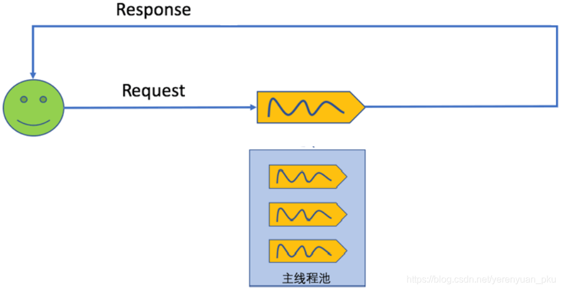

我们发一个请求进来，Tomcat服务器里面会有一个线程池来进行处理请求，请求一进来，Tomcat服务器就从线程池中拿到一个空闲的线程来帮我们处理请求。请求处理时，必然就会调用业务逻辑，调完之后，就代表请求已经处理完了，接着就会给客户端一个响应，响应结束以后，整个线程就会得到释放，线程又会进入空闲状态，等待接收下一个请求。

但是，Tomcat服务器中的线程池里面的线程数量是有限的，如果在没有异步处理的情况下，假设同时进来几百个请求，并且还假设线程池中的每一个线程都在处理请求，这时，正是由于没有异步处理，而服务器端的业务逻辑一旦调用很长一段的时间，那么下一个请求再要进来，Tomcat服务器中的主线程池里面就没有再多空闲的线程来处理了。请求没法得到处理的本质原因就是主线程没有及时得到释放，即没有更多的空闲线程来进行处理请求。

接下来，我们就编写一个简单案例来验证以上结论。

```java
public void sayHello() throws Exception {
    // 我们可以来打印一下究竟是哪些线程在工作
    System.out.println(Thread.currentThread() + " processing...");
    Thread.sleep(3000); // 睡上3秒
}

```

可以看到调用sayHello方法是一个非常耗时的操作，调用完它，需要执行很长的时间，其实也就3秒，不过这对程序来说就是很长的一段时间了。

如果是以前，我们要在HelloServlet的doGet方法中调用以上sayHello方法，那么就得写成下面这样子了。

```java
@Override
protected void doGet(HttpServletRequest req, HttpServletResponse resp) throws ServletException, IOException {
    // TODO Auto-generated method stub
    // super.doGet(req, resp);
    // 我们可以来打印一下都是哪些线程在工作，Thread.currentThread()就是来打印当前线程的
    System.out.println(Thread.currentThread() + " start...");
    try {
        sayHello();
    } catch (Exception e) {
        // TODO Auto-generated catch block
        e.printStackTrace();
    }
    resp.getWriter().write("hello ...");
    System.out.println(Thread.currentThread() + " end...");
}	

public void sayHello() throws Exception {
    // 我们可以来打印一下究竟是哪些线程在工作
    System.out.println(Thread.currentThread() + " processing...");
    Thread.sleep(3000); // 睡上3秒
}
```

可以看到以上方法来处理请求并完成响应，就得花费一段很长的时间，除此之外，我们还打印了一下究竟是哪些线程在工作。

以上两个方法都编写好之后，最终我们的HelloServlet就变成了下面这个样子。

```java
package com.meimeixia.servlet;

import java.io.IOException;

import javax.servlet.ServletException;
import javax.servlet.annotation.WebServlet;
import javax.servlet.http.HttpServlet;
import javax.servlet.http.HttpServletRequest;
import javax.servlet.http.HttpServletResponse;

@WebServlet("/hello")
public class HelloServlet extends HttpServlet {
	
	@Override
	protected void doGet(HttpServletRequest req, HttpServletResponse resp) throws ServletException, IOException {
		// TODO Auto-generated method stub
		// super.doGet(req, resp);
		// 我们可以来打印一下都是哪些线程在工作，Thread.currentThread()就是来打印当前线程的
		System.out.println(Thread.currentThread() + " start...");
		try {
			sayHello();
		} catch (Exception e) {
			// TODO Auto-generated catch block
			e.printStackTrace();
		}
		resp.getWriter().write("hello ...");
		System.out.println(Thread.currentThread() + " end...");
	}
	
	public void sayHello() throws Exception {
		// 我们可以来打印一下究竟是哪些线程在工作
		System.out.println(Thread.currentThread() + " processing...");
		Thread.sleep(3000); // 睡上3秒
	}

}

```

然后，我们就要启动项目进行测试了。项目启动成功之后，我们在浏览器地址栏中输入[http://localhost:8080/hello](http://localhost:8080/hello)进行访问，即访问hello请求，大概等上3秒之后，我们就能在浏览器页面中看到hello ...这样的字符串了。

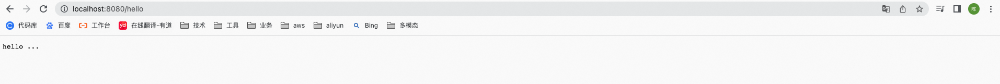

而且，控制台还打印了如下内容。

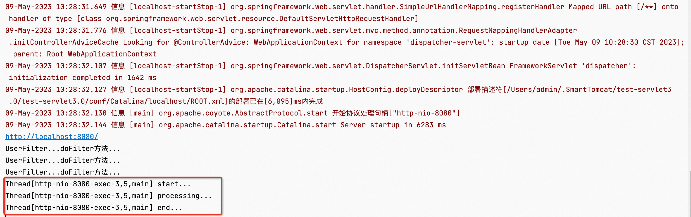

发现从始至终都是由`Thread[http-nio-8080-exec-3,5,main]`这个线程来处理请求的。

如果是以前没有异步处理的情况下，那么就会带来我们之前说的那个问题，即主线程得不到及时释放，下一个新的请求进来，就可能导致没法处理。

好了，那么在异步请求处理情况下又是什么样子呢？我们不妨查看一下Servlet 3.0标准规范文档，在该文档中找到Dispatching Requests这一大章节，然后在其下面找到Obtaining an AsyncContext这一小节，如下图所示。

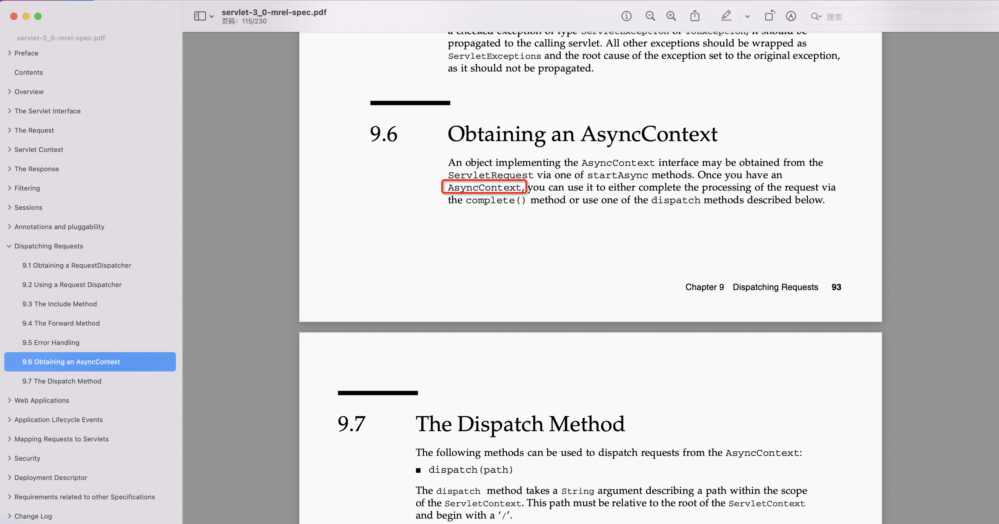

这一小节就是来讲述异步请求的。这一小节大概说了些啥呢？它说主要有一个异步的AsyncContext对象，该AsyncContext对象就可以来执行异步方法，执行完了之后，再通过complete方法通知我们Tomcat服务器请求已经处理完了。应该是就说了这些，不过我心里也拿不准。

于是，我们来编写一个新的Servlet，例如HelloAsyncServlet，来处理异步请求，而且一开始先写成下面这样。

```java
package com.meimeixia.servlet;

import java.io.IOException;

import javax.servlet.ServletException;
import javax.servlet.annotation.WebServlet;
import javax.servlet.http.HttpServlet;
import javax.servlet.http.HttpServletRequest;
import javax.servlet.http.HttpServletResponse;

// @WebServlet注解表明该Servlet应该处理哪个请求
@WebServlet(value="/async") 
public class HelloAsyncServlet extends HttpServlet {

	@Override
	protected void doGet(HttpServletRequest req, HttpServletResponse resp) throws ServletException, IOException {
		
	}
	
	public void sayHello() throws Exception {
		// 我们可以来打印一下究竟是哪些线程在工作
		System.out.println(Thread.currentThread() + " processing...");
		Thread.sleep(3000); // 睡上3秒
	}
	
}

```

如果还是像上面那样在doGet方法中调用很耗时的sayHello方法，那么很显然是行不通的。要想真正达到异步请求处理的效果，我们得按照如下步骤来做。

第一步，开启异步处理。因为我们自己写的HelloAsyncServlet必须要说明支持异步处理，所以就得开启异步处理了。那怎么开启异步处理呢？很简单，@WebServlet注解有一个asyncSupported属性，其值默认为false，我们只须将其值设置为true，HelloAsyncServlet就能支持异步处理了。

```java
package com.meimeixia.servlet;

import java.io.IOException;

import javax.servlet.ServletException;
import javax.servlet.annotation.WebServlet;
import javax.servlet.http.HttpServlet;
import javax.servlet.http.HttpServletRequest;
import javax.servlet.http.HttpServletResponse;

// @WebServlet注解表明该Servlet应该处理哪个请求
@WebServlet(value="/async", asyncSupported=true) 
public class HelloAsyncServlet extends HttpServlet {

	@Override
	protected void doGet(HttpServletRequest req, HttpServletResponse resp) throws ServletException, IOException {
		
	}
	
	public void sayHello() throws Exception {
		// 我们可以来打印一下究竟是哪些线程在工作
		System.out.println(Thread.currentThread() + " processing...");
		Thread.sleep(3000); // 睡上3秒
	}
	
}

```

第二步，开启异步模式。那怎么开启异步模式呢？很简单，通过HttpServletRequest对象的startAsync方法即可开启异步模式，并且最终该方法会返回一个异步的AsyncContext对象。

```java
package com.meimeixia.servlet;

import java.io.IOException;

import javax.servlet.AsyncContext;
import javax.servlet.ServletException;
import javax.servlet.annotation.WebServlet;
import javax.servlet.http.HttpServlet;
import javax.servlet.http.HttpServletRequest;
import javax.servlet.http.HttpServletResponse;

// @WebServlet注解表明该Servlet应该处理哪个请求
@WebServlet(value="/async", asyncSupported=true) 
public class HelloAsyncServlet extends HttpServlet {

	@Override
	protected void doGet(HttpServletRequest req, HttpServletResponse resp) throws ServletException, IOException {
		// 1. 先来让该Servlet支持异步处理，即asyncSupported=true
		// 2. 开启异步模式
		AsyncContext startAsync = req.startAsync();
	}
	
	public void sayHello() throws Exception {
		// 我们可以来打印一下究竟是哪些线程在工作
		System.out.println(Thread.currentThread() + " processing...");
		Thread.sleep(3000); // 睡上3秒
	}
	
}

```

第三步，我们可以给返回的异步的AsyncContext对象里面设置一些东西。例如设置异步的监听器，如下图所示。

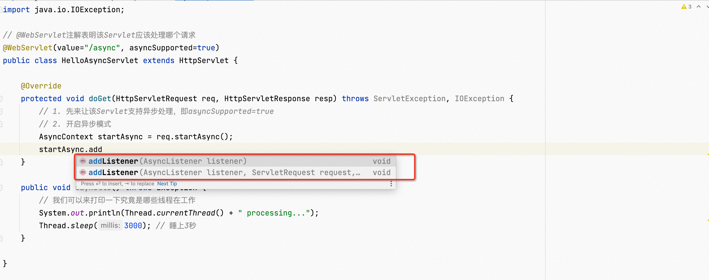

还能设置异步请求处理的超时时间，如下图所示。

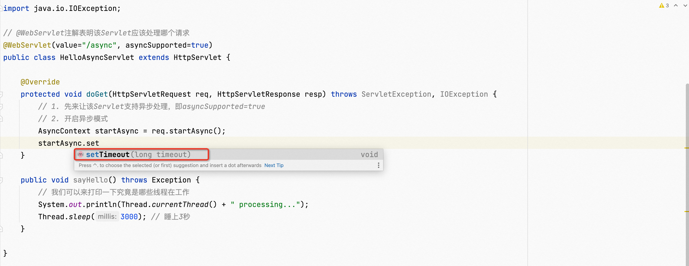

但是，在这儿我们就不进行设置了。

再仔细看，你会发现AsyncContext对象里面有一个start方法，而且该方法里面要传入一个Runnable对象，如下图所示。

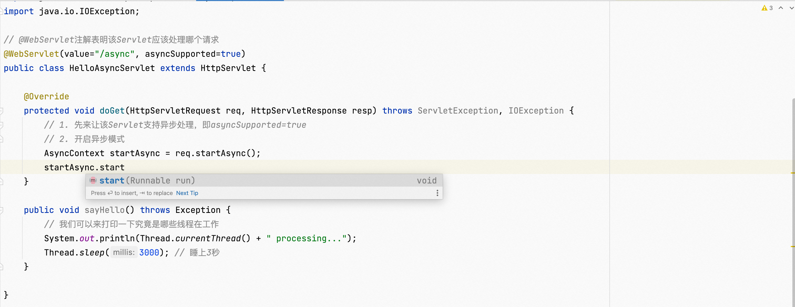

于是，我们来调用一下start方法，并传入一个我们自己new的一个简单的Runnable对象，继而通过Runnable对象里面的run方法来调用我们的业务逻辑，即sayHello方法，这样就是来进行异步处理了哟~

```java
package com.meimeixia.servlet;

import java.io.IOException;

import javax.servlet.AsyncContext;
import javax.servlet.ServletException;
import javax.servlet.annotation.WebServlet;
import javax.servlet.http.HttpServlet;
import javax.servlet.http.HttpServletRequest;
import javax.servlet.http.HttpServletResponse;

// @WebServlet注解表明该Servlet应该处理哪个请求
@WebServlet(value="/async", asyncSupported=true) 
public class HelloAsyncServlet extends HttpServlet {

	@Override
	protected void doGet(HttpServletRequest req, HttpServletResponse resp) throws ServletException, IOException {
		// 1. 先来让该Servlet支持异步处理，即asyncSupported=true
		// 2. 开启异步模式
		AsyncContext startAsync = req.startAsync();
		// 3. 调用业务逻辑，进行异步处理，这儿是开始异步处理
		startAsync.start(new Runnable() {
			
			@Override
			public void run() {
				// TODO Auto-generated method stub
				try {
					sayHello();
				} catch (Exception e) {
					// TODO Auto-generated catch block
					e.printStackTrace();
				}
			}
		});
	}
	
	public void sayHello() throws Exception {
		// 我们可以来打印一下究竟是哪些线程在工作
		System.out.println(Thread.currentThread() + " processing...");
		Thread.sleep(3000); // 睡上3秒
	}
	
}

```

第四步，异步处理完了之后，就要给客户端一个响应了。那怎么响应呢？首先，异步处理完了之后，我们就应该及时地说一下异步处理完了，即调用一下AsyncContext对象的complete方法；然后，给客户端一个响应，要做到这一点，得先通过AsyncContext对象的getResponse方法获取到ServletResponse响应对象，再通过该响应对象给客户端来写数据。

```java
package com.meimeixia.servlet;

import java.io.IOException;

import javax.servlet.AsyncContext;
import javax.servlet.ServletException;
import javax.servlet.ServletResponse;
import javax.servlet.annotation.WebServlet;
import javax.servlet.http.HttpServlet;
import javax.servlet.http.HttpServletRequest;
import javax.servlet.http.HttpServletResponse;

// @WebServlet注解表明该Servlet应该处理哪个请求
@WebServlet(value="/async", asyncSupported=true) 
public class HelloAsyncServlet extends HttpServlet {

	@Override
	protected void doGet(HttpServletRequest req, HttpServletResponse resp) throws ServletException, IOException {
		// 1. 先来让该Servlet支持异步处理，即asyncSupported=true
		// 2. 开启异步模式
		AsyncContext startAsync = req.startAsync();
		// 3. 调用业务逻辑，进行异步处理，这儿是开始异步处理
		startAsync.start(new Runnable() {
			
			@Override
			public void run() {
				// TODO Auto-generated method stub
				try {
					sayHello();
					
					startAsync.complete();
					/*
					 * 通过下面这种方式来获取响应对象是不可行的哟！否则，会报如下异常：
					 * java.lang.IllegalStateException: It is illegal to call this method if the current request is not in asynchronous mode (i.e. isAsyncStarted() returns false)
					 */
					// 获取到异步上下文
					//AsyncContext asyncContext = req.getAsyncContext();
					// ServletResponse response = asyncContext.getResponse();
					
					// 4. 获取响应
					ServletResponse response = startAsync.getResponse();
					// 然后，我们还是利用这个响应往客户端来写数据
					response.getWriter().write("hello async...");
				} catch (Exception e) {
					// TODO Auto-generated catch block
					e.printStackTrace();
				}
			}
		});
	}
	
	public void sayHello() throws Exception {
		// 我们可以来打印一下究竟是哪些线程在工作
		System.out.println(Thread.currentThread() + " processing...");
		Thread.sleep(3000); // 睡上3秒
	}
	
}

```

接下来，我们便来启动项目进行测试。启动成功之后，我们来访问async请求，从访问开始到看到响应结果，时间与上面是没有什么变化的，都得等上大概3、4秒钟，毕竟业务逻辑还得3、4秒才能运行完呢！而且，你会发现控制台打印出了如下内容。

这也看不出来啥啊！于是，我们在doGet方法中打印一下主线程，看主线程究竟是谁，然后，我们再在run方法里面（我们要知道，相关业务逻辑是要写在这个run方法里面的）打印一下副线程，看副线程究竟是谁，如下所示。

```java
package com.meimeixia.servlet;

import java.io.IOException;

import javax.servlet.AsyncContext;
import javax.servlet.ServletException;
import javax.servlet.ServletResponse;
import javax.servlet.annotation.WebServlet;
import javax.servlet.http.HttpServlet;
import javax.servlet.http.HttpServletRequest;
import javax.servlet.http.HttpServletResponse;

// @WebServlet注解表明该Servlet应该处理哪个请求
@WebServlet(value="/async", asyncSupported=true) 
public class HelloAsyncServlet extends HttpServlet {

	@Override
	protected void doGet(HttpServletRequest req, HttpServletResponse resp) throws ServletException, IOException {
		// 1. 先来让该Servlet支持异步处理，即asyncSupported=true
		// 2. 开启异步模式
		// 我们可以来打印一下主线程究竟是谁？
		System.out.println("主线程开始..." + Thread.currentThread());
		AsyncContext startAsync = req.startAsync();
		// 3. 调用业务逻辑，进行异步处理，这儿是开始异步处理
		startAsync.start(new Runnable() {
			
			@Override
			public void run() {
				// TODO Auto-generated method stub
				try {
					System.out.println("副线程开始..." + Thread.currentThread());
					sayHello();
					
					startAsync.complete();
					/*
					 * 通过下面这种方式来获取响应对象是不可行的哟！否则，会报如下异常：
					 * java.lang.IllegalStateException: It is illegal to call this method if the current request is not in asynchronous mode (i.e. isAsyncStarted() returns false)
					 */
					// 获取到异步上下文
					//AsyncContext asyncContext = req.getAsyncContext();
					// ServletResponse response = asyncContext.getResponse();
					
					// 4. 获取响应
					ServletResponse response = startAsync.getResponse();
					// 然后，我们还是利用这个响应往客户端来写数据
					response.getWriter().write("hello async...");
					System.out.println("副线程结束..." + Thread.currentThread());
				} catch (Exception e) {
					// TODO Auto-generated catch block
					e.printStackTrace();
				}
			}
		});
		System.out.println("主线程结束..." + Thread.currentThread());
	}
	
	public void sayHello() throws Exception {
		// 我们可以来打印一下究竟是哪些线程在工作
		System.out.println(Thread.currentThread() + " processing...");
		Thread.sleep(3000); // 睡上3秒
	}
	
}

```

接着，我们再来重启项目，成功之后，再来访问async请求，此时，除了能在浏览器页面中看到响应结果之外，我们还能在控制台中看到如下打印内容。

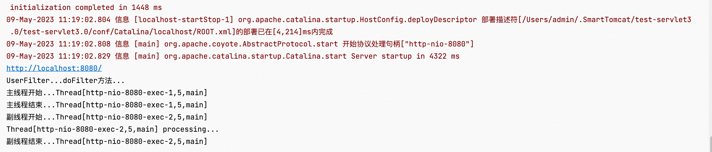

从上面可以看到主线程很快就开始跟结束了，时间几乎微乎其微。为了能够更加清楚地看到每一个线程开始与结束的时间，我们不妨将其打印出来，如下所示。

```java
package com.meimeixia.servlet;

import java.io.IOException;

import javax.servlet.AsyncContext;
import javax.servlet.ServletException;
import javax.servlet.ServletResponse;
import javax.servlet.annotation.WebServlet;
import javax.servlet.http.HttpServlet;
import javax.servlet.http.HttpServletRequest;
import javax.servlet.http.HttpServletResponse;

// @WebServlet注解表明该Servlet应该处理哪个请求
@WebServlet(value="/async", asyncSupported=true) 
public class HelloAsyncServlet extends HttpServlet {

	@Override
	protected void doGet(HttpServletRequest req, HttpServletResponse resp) throws ServletException, IOException {
		// 1. 先来让该Servlet支持异步处理，即asyncSupported=true
		// 2. 开启异步模式
		// 我们可以来打印一下主线程究竟是谁？
		System.out.println("主线程开始..." + Thread.currentThread() + "==>" + System.currentTimeMillis());
		AsyncContext startAsync = req.startAsync();
		// 3. 调用业务逻辑，进行异步处理，这儿是开始异步处理
		startAsync.start(new Runnable() {
			
			@Override
			public void run() {
				// TODO Auto-generated method stub
				try {
					System.out.println("副线程开始..." + Thread.currentThread() + "==>" + System.currentTimeMillis());
					sayHello();
					
					startAsync.complete();
					/*
					 * 通过下面这种方式来获取响应对象是不可行的哟！否则，会报如下异常：
					 * java.lang.IllegalStateException: It is illegal to call this method if the current request is not in asynchronous mode (i.e. isAsyncStarted() returns false)
					 */
					// 获取到异步上下文
					//AsyncContext asyncContext = req.getAsyncContext();
					// ServletResponse response = asyncContext.getResponse();
					
					// 4. 获取响应
					ServletResponse response = startAsync.getResponse();
					// 然后，我们还是利用这个响应往客户端来写数据
					response.getWriter().write("hello async...");
					System.out.println("副线程结束..." + Thread.currentThread() + "==>" + System.currentTimeMillis());
				} catch (Exception e) {
					// TODO Auto-generated catch block
					e.printStackTrace();
				}
			}
		});
		System.out.println("主线程结束..." + Thread.currentThread() + "==>" + System.currentTimeMillis());
	}
	
	public void sayHello() throws Exception {
		// 我们可以来打印一下究竟是哪些线程在工作
		System.out.println(Thread.currentThread() + " processing...");
		Thread.sleep(3000); // 睡上3秒
	}
	
}

```

紧接着，我们立马重启项目，启动成功之后，来访问async请求，这时你肯定是能够在浏览器页面中看到响应结果的，但我们不关注这个，重点关注控制台打印出来的内容，如下图所示。

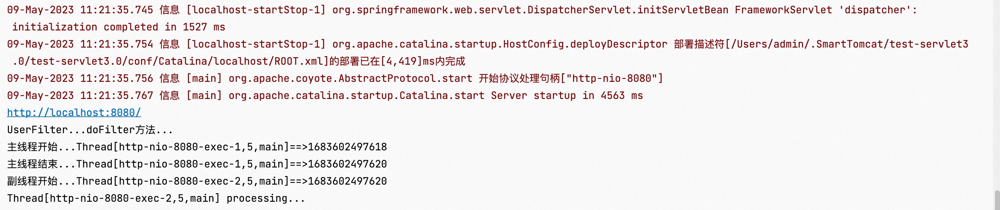

观察每一个线程开始与结束的时间，发现主线程从开始到结束，很快，间隔时间几乎不可计；而副线程从开始到结束，真的就耗了3秒钟的时间。而且，我们还可以很明显地看到副线程与我们业务逻辑用的是同一个线程，主线程也必然是这种情况，不过它一开始就立马结束了。

所以，我们看到的现象就是，doGet方法来处理请求时，主线程一开始就立马结束了，此时，主线程就会得到释放；而副线程就开始来处理业务逻辑，处理完了以后，给客户端进行响应。这就是Servlet 3.0中的一重要特性，即异步请求处理，用一张图表示出来，就应该是下面这个样子。

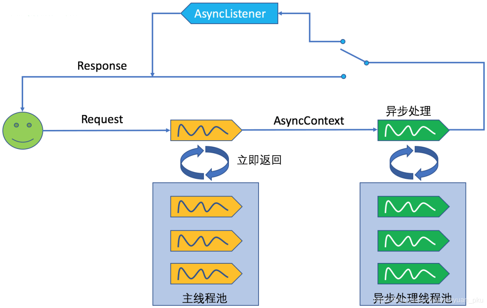

一个请求发过来，主线程就会来接收请求并进行处理，而且这个主线程是Tomcat服务器线程池里面分配出来的一个线程。当然，为了更加迅速地处理请求，在主线程处理请求的时候，我们会开启异步模式，这样，主线程就会立马结束，进入空闲状态，若有新的请求进来则就可以继续进行处理了。

而我们的业务逻辑是要异步处理的，因此就应交由异步处理的线程池进行处理。只不过现在主线程用的线程池跟异步处理的线程用的线程池都是http-nio-8080-exec，相当于并没有维护一个异步处理的线程池，所以，这就得我们自己来维护一个异步处理的线程池了。当然Spring MVC框架有来维护这个异步处理的线程池，使用它我们就不必这么麻烦了，还得自己来维护。

最重要的一点是，我们看到了Tomcat服务器线程池里面分配出来的主线程一开始就立马结束了，很快就会进入空闲状态，等待迎接新的请求。

以上就是Servlet 3.0中的重要特性——异步请求处理，下一讲，我们就来使用Spring MVC进行异步处理，敬请期待哟


# 2 Spring MVC里面的异步请求处理
在上一讲，我讲了一下Servlet 3.0里面的异步请求处理。而在这一讲中，我会基于Servlet 3.0中的异步请求处理机制来讲述一下Spring MVC里面的异步请求处理。

其实，我们完全可以参考Spring MVC的官方文档来掌握它里面的异步请求处理。打开Spring MVC的官方文档，找到1.6. Asynchronous Requests这一章节并打开，稍微浏览一下这一章节中的内容，如下图所示。

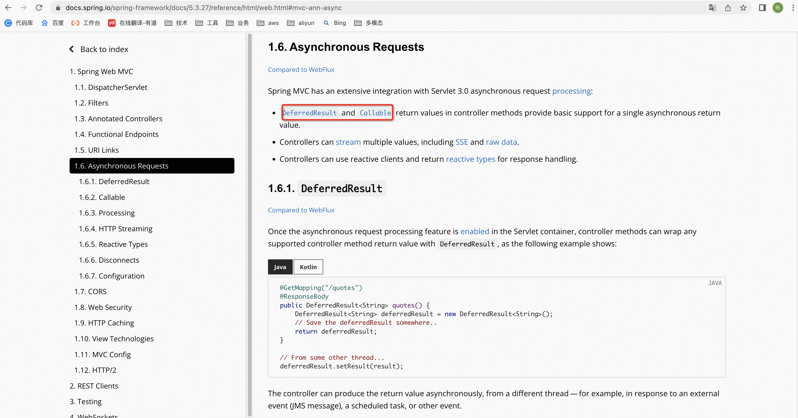

我们应该知道，Spring MVC中的异步请求处理是基于Servlet 3.0中的异步请求处理机制的，相当于做了一个简单的封装。也就是说，即使某人不知道Servlet里面的API，他也可以使用Spring MVC中的异步请求处理机制。

咋个来使用呢？继续往下看1.6. Asynchronous Requests这一章节中的内容，发现使用方式有两种，一种是将方法的返回值写成Callable，如下图所示。

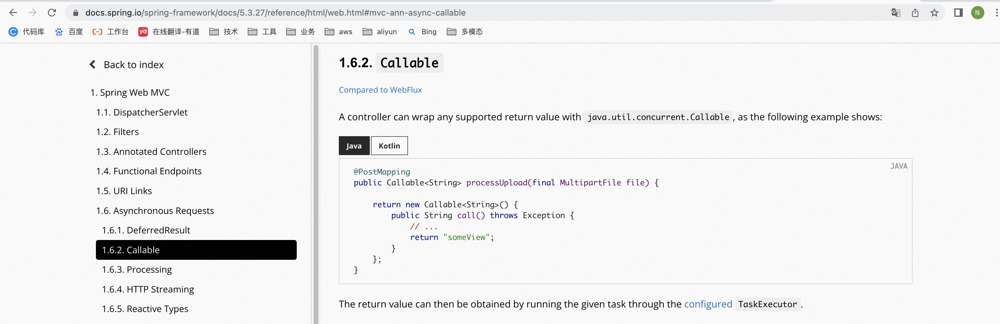

另一种是将方法的返回值写成DeferredResult，如下图所示。

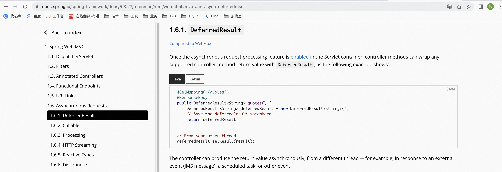

以上两种方式都是可行的，不过在这一讲中，我们先来讲解第一种使用方式，即将方法的返回值写成Callable。

## 2.1 Callable
**Spring MVC中的异步请求处理**

新建一个Controller，例如AsyncController，然后在该AsyncController中编写一个如下的async01方法来处理异步请求。

```java
package com.meimeixia.controller;

import java.util.concurrent.Callable;

import org.springframework.stereotype.Controller;
import org.springframework.web.bind.annotation.RequestMapping;
import org.springframework.web.bind.annotation.ResponseBody;

@Controller
public class AsyncController {

	@ResponseBody
	@RequestMapping("/async01")
	public Callable<String> async01() {
		Callable<String> callable = new Callable<String>() {

			@Override
			public String call() throws Exception {
				// 响应给客户端一串字符串，即"Callable<String> async01()"
				return "Callable<String> async01()";
			}
			
		};
		return callable;
	}
	
}

```

可以看到与我们写的常规方法不同，以上async01方法的返回值是Callable<String>，其中泛型String就是要响应给客户端的数据的数据类型。

为了让大家看到究竟是哪些线程在工作，我们先在async01方法中打印一下主线程，看主线程究竟是谁，并且还打印一下主线程开始与结束的时间，如下所示。

```java
package com.meimeixia.controller;

import java.util.concurrent.Callable;

import org.springframework.stereotype.Controller;
import org.springframework.web.bind.annotation.RequestMapping;
import org.springframework.web.bind.annotation.ResponseBody;

@Controller
public class AsyncController {

	@ResponseBody
	@RequestMapping("/async01")
	public Callable<String> async01() {
		System.out.println("主线程开始..." + Thread.currentThread() + "==>" + System.currentTimeMillis());
		Callable<String> callable = new Callable<String>() {

			@Override
			public String call() throws Exception {
				// 响应给客户端一串字符串，即"Callable<String> async01()"
				return "Callable<String> async01()";
			}
			
		};
		System.out.println("主线程结束..." + Thread.currentThread() + "==>" + System.currentTimeMillis());
		return callable;
	}
	
}

```

这里有一点需要我们注意，那就是我们的业务逻辑是要写在Callable对象中的call方法里面的，一般而言业务逻辑是非常复杂的，执行可能得花费一段时间，为了模拟这一点，我们在这儿不妨让线程睡上2秒，如下所示。

```java
package com.meimeixia.controller;

import java.util.concurrent.Callable;

import org.springframework.stereotype.Controller;
import org.springframework.web.bind.annotation.RequestMapping;
import org.springframework.web.bind.annotation.ResponseBody;

@Controller
public class AsyncController {

	@ResponseBody
	@RequestMapping("/async01")
	public Callable<String> async01() {
		System.out.println("主线程开始..." + Thread.currentThread() + "==>" + System.currentTimeMillis());
		Callable<String> callable = new Callable<String>() {

			@Override
			public String call() throws Exception {
				Thread.sleep(2000); // 我们来睡上2秒 
				// 响应给客户端一串字符串，即"Callable<String> async01()"
				return "Callable<String> async01()";
			}
			
		};
		System.out.println("主线程结束..." + Thread.currentThread() + "==>" + System.currentTimeMillis());
		return callable;
	}
	
}

```

同样地，我们再在以上call方法中打印一下副线程，看副线程究竟是谁，并且还打印一下副线程开始与结束的时间，如下所示。

```java
package com.meimeixia.controller;

import java.util.concurrent.Callable;

import org.springframework.stereotype.Controller;
import org.springframework.web.bind.annotation.RequestMapping;
import org.springframework.web.bind.annotation.ResponseBody;

@Controller
public class AsyncController {

	@ResponseBody
	@RequestMapping("/async01")
	public Callable<String> async01() {
		System.out.println("主线程开始..." + Thread.currentThread() + "==>" + System.currentTimeMillis());
		Callable<String> callable = new Callable<String>() {

			@Override
			public String call() throws Exception {
				System.out.println("副线程开始..." + Thread.currentThread() + "==>" + System.currentTimeMillis());
				Thread.sleep(2000); // 我们来睡上2秒 
				System.out.println("副线程结束..." + Thread.currentThread() + "==>" + System.currentTimeMillis());
				// 响应给客户端一串字符串，即"Callable<String> async01()"
				return "Callable<String> async01()";
			}
			
		};
		System.out.println("主线程结束..." + Thread.currentThread() + "==>" + System.currentTimeMillis());
		return callable;
	}
	
}

```

OK，编写完以上AsyncController之后，我们便来启动项目进行测试。项目启动成功之后，我们来访问async01请求，大概等上2秒之后，我们就能在浏览器页面中看到Callable async01()这样的字符串了。而且，控制台还打印了如下内容。

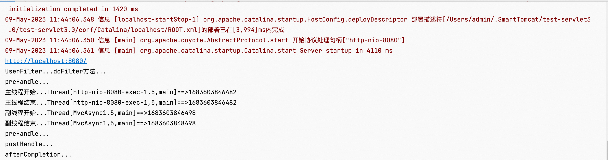

从上图中可以看到，主线程从开始到结束，很快，间隔时间几乎不可计，而且用的都是Thread[http-nio-8080-exec-1,5,main]这一个线程；而副线程从开始到结束，真的就差不多耗了2秒钟，而且用的都是MvcAsync1这一个线程，也就是说，以上call方法里面写的代码都是在另外一个线程（即MvcAsync1）里面执行的。

那为什么会打印成这个样子啊，其原理又是怎样的呢？不急，下面我会向大家解释。

其实，Spring MVC的官方文档就已经做了解释了，我们不妨看一下。打开Spring MVC的官方文档，找到1.6.3. Processing这一小节并打开，细心点看，发现若Controller中方法的返回值写成了Callable，则其处理流程就应该是下面这个样子的。

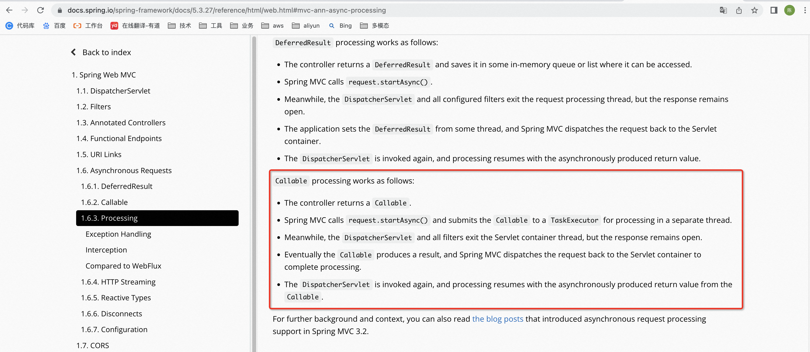

以上的每一步，我们不妨来逐步逐步来分析。

第一步，控制器返回Callable。其实，这里要说的是控制器中方法的返回值要写成Callable了，而再也不能是以前普通的字符串对象了。

第二步，控制器返回Callable以后，Spring MVC就会异步地启动一个处理方法（即Spring MVC异步处理），也即将Callable提交到TaskExecutor（任务执行器）里面，并使用一个隔离的线程进行处理。

注意，TaskExecutor（任务执行器）是JUC包中Executor旗下的，我们不妨点进去TaskExecutor源码里面看一看，如下图所示。

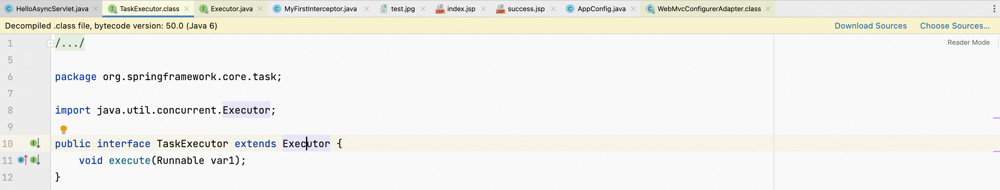

可以清楚地看到，TaskExecutor（任务执行器）是我们Spring MVC自己来定义的，只不过它继承了JUC包里面的Executor接口，它是来执行Runnable对象中的run方法里面的任务的。

第三步，与此同时，DispatcherServlet和所有的Filter将会退出Servlet容器的线程（即主线程），但是response仍然保持打开的状态。既然response依旧保持打开状态，那就表明还没有给浏览器以响应，因此我们还能给response里面写数据。

第四步，最终，Callable返回一个结果，并且Spring MVC会将请求重新派发给Servlet容器，恢复之前的处理。也就是说，之前的response依旧还保存着打开的状态，仍然还可以往其里面写数据。

第五步，如果还是把上一次的请求再发过来，假设上一次的请求是async01，那么DispatcherServlet依旧还是能接收到该请求，收到以后，DispatcherServlet便会再次执行，来恢复之前的处理。

那么它是如何来处理的呢？根据Callable返回的结果，该怎么处理还是怎么处理，即Spring MVC会继续进入视图渲染等等流程，也就是说，Spring MVC会从头开始再次执行其流程（收请求→视图渲染→给响应），这是因为请求会被再次发给Spring MVC。

上面我对Spring MVC的异步模式处理步骤说得够明白了吧！要是脑袋还是昏昏涨涨的，那我也没法了。

我们不妨再次看一下控制台中打印的如下内容，发现咱们自己编写的拦截器（即MyFirstInterceptor）也有相应内容打印。

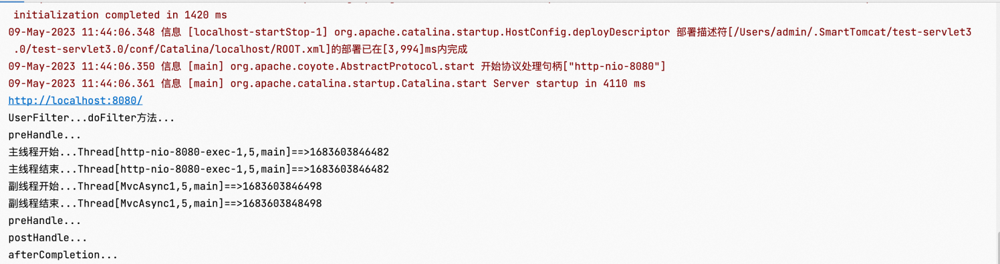

而且它还是这样打印的：首先在目标方法运行之前打印preHandle...，然后主线程和副线程相继开始与结束，接着再次在目标方法运行之前打印preHandle...，紧接着在目标方法运行正确以后打印postHandle...，最后在页面响应以后打印afterCompletion...。

不知你有没有发现preHandle...打印了两次哟~，这正是因为Callable线程处理完成后，Spring MVC会将请求重新派发给Servlet容器，并且由于我们配置的DispatcherServlet是拦截所有请求（即/），所以Spring MVC依然会接收到重新派发过来的请求，继而就能继续进行之前的处理了。

为了验证这一点，我们不妨在目标方法运行之前打印一下拦截器到底拦截的是哪一个请求，如下所示。

```java
package com.meimeixia.controller;

import javax.servlet.http.HttpServletRequest;
import javax.servlet.http.HttpServletResponse;

import org.springframework.web.servlet.HandlerInterceptor;
import org.springframework.web.servlet.ModelAndView;

public class MyFirstInterceptor implements HandlerInterceptor {

	// 在页面响应以后执行
	@Override
	public void afterCompletion(HttpServletRequest arg0, HttpServletResponse arg1, Object arg2, Exception arg3)
			throws Exception {
		// TODO Auto-generated method stub
		System.out.println("afterCompletion...");
	}

	// 在目标方法运行正确以后执行
	@Override
	public void postHandle(HttpServletRequest arg0, HttpServletResponse arg1, Object arg2, ModelAndView arg3)
			throws Exception {
		// TODO Auto-generated method stub
		System.out.println("postHandle...");
	}

	// 在目标方法运行之前执行
	@Override
	public boolean preHandle(HttpServletRequest request, HttpServletResponse arg1, Object arg2) throws Exception {
		// TODO Auto-generated method stub
		System.out.println("preHandle..." + request.getRequestURI());
		return true; // 返回true，表示放行（目标方法）
	}

}

```

然后，我们便来再次启动项目进行测试。项目启动成功之后，我们依旧来访问async01请求，大概等上2秒之后，我们依然能在浏览器页面中看到Callable async01()这样的字符串，只不过，控制台此时打印出了如下内容。

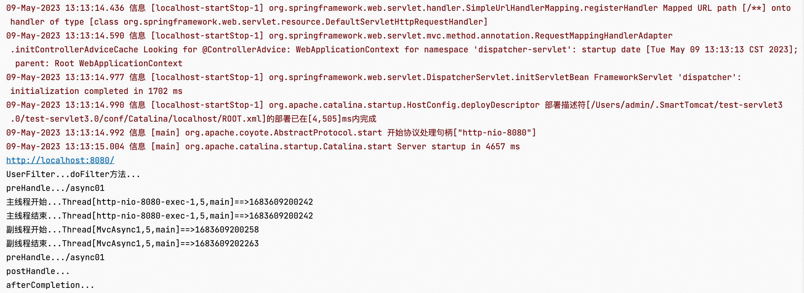

以上打印内容我们应该分为三段来看，第一段内容如下：

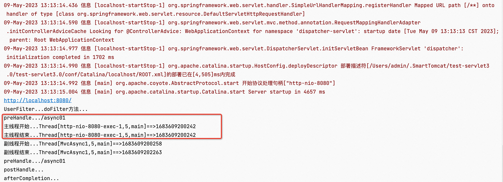

这一段除了打印主线程的开始与结束之外，还在目标方法运行之前打印了preHandle...。至此，DispatcherServlet以及所有的Filter都退出了主线程。

你应该知道的一点是，其实主线程中运行的目标方法就是AsyncController中的async01方法，如下所示，可以很明显地看到该方法的返回值是Callable，一旦该方法返回了Callable，主线程便结束了，相应地，DispatcherServlet也会退出该主线程。

```java
package com.meimeixia.controller;

import java.util.concurrent.Callable;

import org.springframework.stereotype.Controller;
import org.springframework.web.bind.annotation.RequestMapping;
import org.springframework.web.bind.annotation.ResponseBody;

@Controller
public class AsyncController {

	@ResponseBody
	@RequestMapping("/async01")
	public Callable<String> async01() {
		System.out.println("主线程开始..." + Thread.currentThread() + "==>" + System.currentTimeMillis());
		Callable<String> callable = new Callable<String>() {

			@Override
			public String call() throws Exception {
				System.out.println("副线程开始..." + Thread.currentThread() + "==>" + System.currentTimeMillis());
				Thread.sleep(2000); // 我们来睡上2秒 
				System.out.println("副线程结束..." + Thread.currentThread() + "==>" + System.currentTimeMillis());
				// 响应给客户端一串字符串，即"Callable<String> async01()"
				return "Callable<String> async01()";
			}
			
		};
		System.out.println("主线程结束..." + Thread.currentThread() + "==>" + System.currentTimeMillis());
		return callable;
	}
	
}

```

分析完第一段的内容之后，我们再来看第二段内容，如下所示：

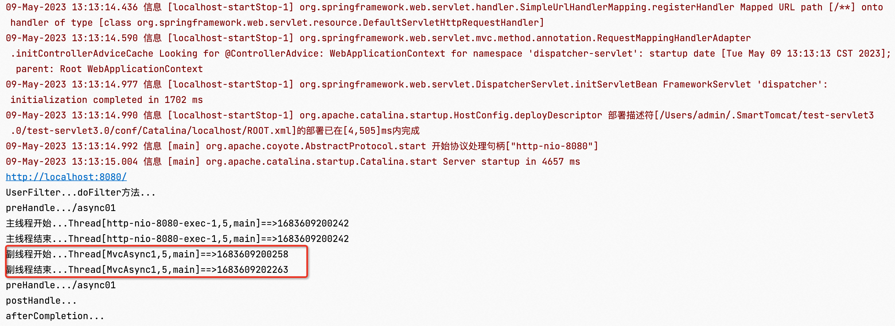

这儿是将Callable提交到TaskExecutor（任务执行器）里面，并使用一个隔离的线程来进行处理，所谓的处理应该就是执行Callable对象中的call方法里面的任务。

最后，我们来看看第三段内容，如下所示：

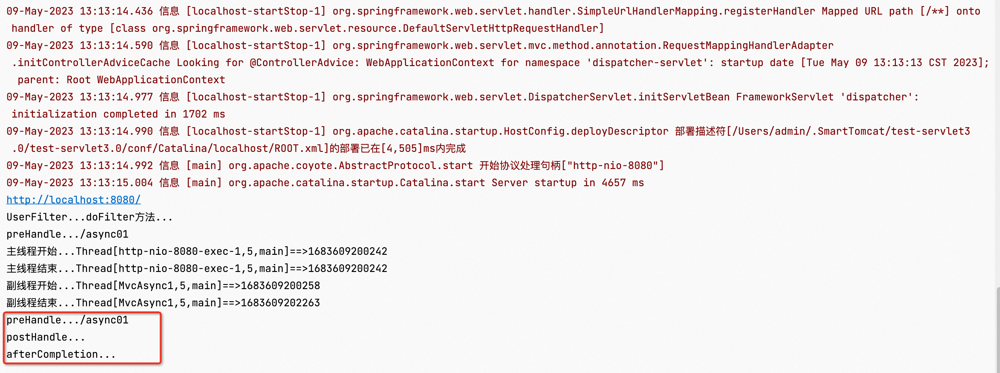

当Callable对象中的任务执行完成以后，Spring MVC会将请求重新派发给Servlet容器，以恢复之前的处理。此时，Spring MVC依旧会接收到重新派发过来的请求，即async01请求，这可以从以上打印结果中看出。

现在你该明白了吧！之前Spring MVC接收到的请求是async01，现在依然还是async01，只不过，此时收到请求之后，目标方法并不用被执行了，之前返回的Callable就是目标方法的返回值。接下来，postHandle...和afterCompletion...自然就要被依次打印了。

以上就是Spring MVC的异步处理过程。当然，我们要知道的一点是，在异步处理的情况下，Spring MVC并不能拦截到真正的业务逻辑的整个处理流程，而想要做到这一点，那就得使用异步的拦截器了，而且异步的拦截器有两种，它们分别是：

原生Servlet里面的AsyncListener。我们不妨看一下它的源码，如下图所示，发现它是一个接口。

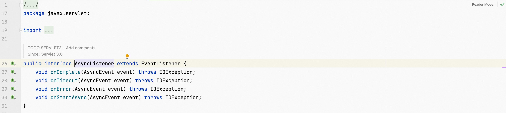

Spring MVC给提供的异步拦截器，即AsyncHandlerInterceptor。我们不妨看一下Spring MVC的官方文档，打开它，然后查看1.6.3. Processing这一小节下的Interception这一部分的内容，你会发现要想成为一个异步拦截器，那么它必须得实现AsyncHandlerInterceptor接口。

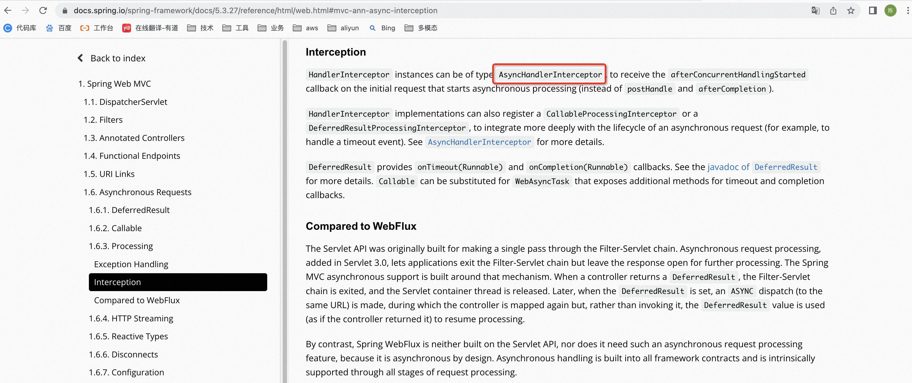

也就是说，如果在使用Spring MVC的情况下，那么你只须实现AsyncHandlerInterceptor接口即能编写一个异步拦截器了。

终于终于我们讲完了Spring MVC异步请求处理的第一种使用方式，即将方法的返回值写成Callable。如果使用这种方式，那么就会启动一个新的线程，而且Spring MVC还帮我们维护了一个异步处理的线程池，就像下面这张图所表示的那样，这张图我们在上一讲中就看过了。


从上图中我们可以看到，主线程会先进来执行，对于Spring MVC而言，如果这是一个异步任务，那么对应地就会有异步处理线程池中的线程来进行异步处理，这时主线程会立马进行释放，然后等待迎接下一个请求。而且，在异步处理完了以后，之前一直保持打开状态的response会将响应数据写出去。

## 2.2 DeferredResult
上一讲中，我们讲了一下Spring MVC异步请求处理的第一种使用方式，即将方法的返回值写成Callable。然而在实际的开发过程中，异步请求处理是绝不可能这么简单的，就拿下面这个实际的场景来说，如下图所示。

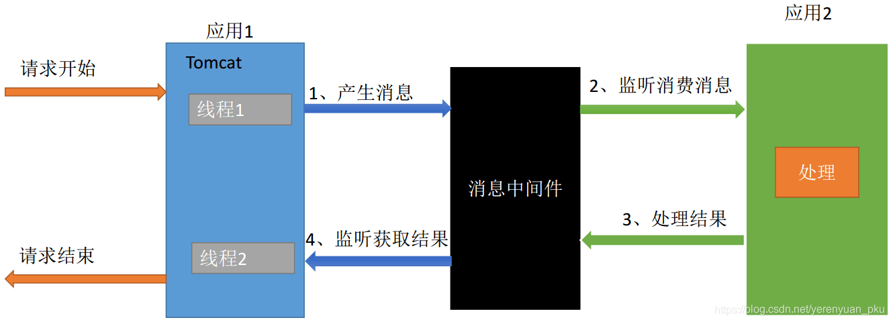

我们以创建订单为例，创建订单的请求一进来，应用1就要启动一个线程，来帮我们处理这个请求。如果假设应用1并不能创建订单，创建订单需要应用2来完成，那么此时应该怎么办呢？应用1可以把创建订单的消息存放在消息中间件中，比如RabbitMQ、Kafka等等，而应用2就来负责监听这些消息中间件里面的消息，一旦它发现有创建订单这个消息，那么它就进行相应处理，然后将处理完成后的结果，比如订单的订单号等等，再次存放在消息中间件中，接着应用1再启动一个线程，例如线程2，来监听消息中间件中的返回结果，只要订单创建完毕，它就会拿到返回的结果（即订单的订单号），最后将其响应给客户端。

不用说，你肯定会在实际开发中遇到类似的场景。


Spring MVC中的异步请求处理  
当然，我们不可能来完全编写出以上应用2以及那些消息中间件，因此在这儿我们就做一个大概的演示。

如果真遇到了以上那种实际场景，那么该怎么办呢？其实，Spring MVC也有结合消息中间件的使用场景，即利用DeferredResult。说得更具体一点就是，当客户端发送一个请求过来以后，即使该请求不能及时得到处理，那也没有关系，你可以先new一个DeferredResult对象，然后把该对象返回出去，并把该对象保存在其他的地方，此时请求依旧在等待处理的过程中，那什么时候这个请求能被处理完成呢？这得等到另外一个线程在其他的地方获取到DeferredResult对象，并调用其setResult方法设置了结果之后，此时请求才会被处理完成，并响应给客户端。

于是，接下来，我们就编写一个简单的案例来模拟一下这个简单的场景。

首先，我们在AsyncController里面编写一个方法，例如createOrder，该方法的名字看起来好像是专门用于创建订单的，但是它并不能真正地来处理创建订单的请求，要想真正地来处理创建订单的请求，那还需要另外一个线程。注意，createOrder方法的返回值类型要写成DeferredResult哟

```java
package com.meimeixia.controller;

import java.util.concurrent.Callable;

import org.springframework.stereotype.Controller;
import org.springframework.web.bind.annotation.RequestMapping;
import org.springframework.web.bind.annotation.ResponseBody;
import org.springframework.web.context.request.async.DeferredResult;

@Controller
public class AsyncController {
	
	@ResponseBody
	@RequestMapping("/createOrder")
	public DeferredResult<Object> createOrder() {
	    /*
	     * 在创建DeferredResult对象时，可以像下面这样传入一些参数哟！
	     * 
	     * 第一个参数（timeout）： 超时时间。限定（请求？）必须在该时间内执行完，如果超出时间限制，那么就会返回一段错误的提示信息（timeoutResult）
	     * 第二个参数（timeoutResult）：超出时间限制之后，返回的错误提示信息
	     */
		DeferredResult<Object> deferredResult = new DeferredResult<>((long)3000, "create fail...");
		return deferredResult;
	}

	@ResponseBody
	@RequestMapping("/async01")
	public Callable<String> async01() {
		System.out.println("主线程开始..." + Thread.currentThread() + "==>" + System.currentTimeMillis());
		Callable<String> callable = new Callable<String>() {

			@Override
			public String call() throws Exception {
				System.out.println("副线程开始..." + Thread.currentThread() + "==>" + System.currentTimeMillis());
				Thread.sleep(2000); // 我们来睡上2秒 
				System.out.println("副线程结束..." + Thread.currentThread() + "==>" + System.currentTimeMillis());
				// 响应给客户端一串字符串，即"Callable<String> async01()"
				return "Callable<String> async01()";
			}
			
		};
		System.out.println("主线程结束..." + Thread.currentThread() + "==>" + System.currentTimeMillis());
		return callable;
	}
	
}

```

从上可以看到，为了能够把消息直接写出去，我们使用的是@ResponseBody注解，这样就可以阻止跳转页面了。其实，我们还能看到，现在还没有另外一个线程来调用DeferredResult对象中的setResult方法为其设置结果。

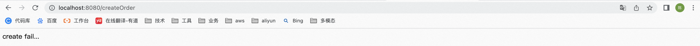

然后，我们来启动项目进行测试。项目启动成功之后，来访问createOrder请求，发现大概等了3秒钟之后，快速地响应给浏览器create fail...这样一串字符串，如下图所示。

很明显这是超出时间限制了，应该是相当于创建订单失败了吧！那接下来，我们应该怎么办呢？真令人头疼😭

OK，我们不妨来模拟一个队列。首先新建一个类，例如DeferredResultQueue，如下所示。

```java
package com.meimeixia.service;

import java.util.Queue;
import java.util.concurrent.ConcurrentLinkedQueue;

import org.springframework.web.context.request.async.DeferredResult;

public class DeferredResultQueue {
	
	// DeferredResult对象临时保存的地方
	private static Queue<DeferredResult<Object>> queue = new ConcurrentLinkedQueue<DeferredResult<Object>>();

	// 临时保存DeferredResult对象的方法
	public static void save(DeferredResult<Object> deferredResult) {
		queue.add(deferredResult);
	}
	
	// 获取DeferredResult对象的方法
	public static DeferredResult<Object> get() {
		/*
		 * poll()：检索并且移除，移除的是队列头部的元素
		 */
		return queue.poll();
	}
	
}

```

然后，修改一下AsyncController中的createOrder方法。上面我也已经说过了，该方法并不能真正地来处理创建订单的请求。即使如此，那也没关系，因为我们可以在该方法中先把new出来的DeferredResult对象临时保存起来。

```java
package com.meimeixia.controller;

import java.util.concurrent.Callable;

import org.springframework.stereotype.Controller;
import org.springframework.web.bind.annotation.RequestMapping;
import org.springframework.web.bind.annotation.ResponseBody;
import org.springframework.web.context.request.async.DeferredResult;

import com.meimeixia.service.DeferredResultQueue;

@Controller
public class AsyncController {
	
	@ResponseBody
	@RequestMapping("/createOrder")
	public DeferredResult<Object> createOrder() {
		/*
		* 在创建DeferredResult对象时，可以像下面这样传入一些参数哟！
		* 
		* 第一个参数（timeout）： 超时时间。限定（请求？）必须在该时间内执行完，如果超出时间限制，那么就会返回一段错误的提示信息（timeoutResult）
		* 第二个参数（timeoutResult）：超出时间限制之后，返回的错误提示信息
		*/
		DeferredResult<Object> deferredResult = new DeferredResult<>((long)3000, "create fail...");
		DeferredResultQueue.save(deferredResult);
		return deferredResult;
	}

	@ResponseBody
	@RequestMapping("/async01")
	public Callable<String> async01() {
		System.out.println("主线程开始..." + Thread.currentThread() + "==>" + System.currentTimeMillis());
		Callable<String> callable = new Callable<String>() {

			@Override
			public String call() throws Exception {
				System.out.println("副线程开始..." + Thread.currentThread() + "==>" + System.currentTimeMillis());
				Thread.sleep(2000); // 我们来睡上2秒 
				System.out.println("副线程结束..." + Thread.currentThread() + "==>" + System.currentTimeMillis());
				// 响应给客户端一串字符串，即"Callable<String> async01()"
				return "Callable<String> async01()";
			}
			
		};
		System.out.println("主线程结束..." + Thread.currentThread() + "==>" + System.currentTimeMillis());
		return callable;
	}
	
}

```

当然了，实际开发中应该有一个别的线程来专门监听这个事，啥事？我猜应该是在其他的地方临时保存DeferredResult对象这件事吧！不过，我们在这儿并不会这样做，而是再在AsyncController中编写一个方法，例如create，该方法才是真正来处理创建订单的请求的。

```java
@ResponseBody
@RequestMapping("/create")
public String create() {
    // 在这模拟创建订单
    String order = UUID.randomUUID().toString();
    /*
     * 如果我们想在上一个请求（即createOrder）中使用订单，那么该怎么办呢？从临时保存DeferredResult对象的地方获取
     * 到刚才保存的DeferredResult对象，然后调用其setResult方法设置结果，例如设置订单的订单号
     */
    DeferredResult<Object> deferredResult = DeferredResultQueue.get();
    deferredResult.setResult(order);
    // 这儿给客户端直接响应"success===>订单号"这样的字符串，不要再跳转页面了
    return "success===>" + order;
}

```

最后，我们来重启项目进行测试。重启成功之后，先来访问createOrder请求，以便来创建订单，但是订单必须得在3秒内创建完，所以一旦访问了createOrder请求后，你必须立即访问create请求来真正创建订单，而且至少得在3秒内完成。

这时，你会看到什么结果呢？可以看到访问create请求之后，直接给浏览器页面响应了一个这样的字符串，其中<font style="color:rgb(0, 0, 0);">a7e4a0f5-131b-4381-9c8c-6591cbfdc279</font>就是所创建订单的订单号，如下图所示。

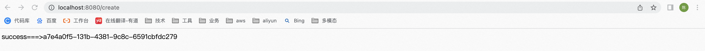

切到访问createOrder请求的浏览器窗口之后，你也可以在浏览器页面中看到所创建订单的订单号，即<font style="color:rgb(0, 0, 0);">a7e4a0f5-131b-4381-9c8c-6591cbfdc279</font>，如下图所示。

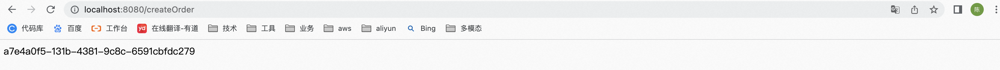

可以看到订单号都是一样的，测试完全通过！

至此，我们是不是可以得出这样的结论：另外一个线程拿到临时保存的DeferredResult对象之后，只要将最终处理的结果给该对象设置进去，那么另一边的线程就能立即得到返回结果了。

以上就是Spring MVC异步请求处理的第二种使用方式，即将方法的返回值写成DeferredResult。

