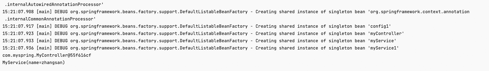
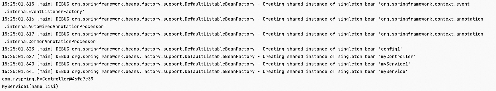

前言代码

```java
@Configuration
@ComponentScan("com.myspring")
public class Config1 {
}
```

```java
public interface IService{
}
```

```java
@Repository
@ToString
public class MyService implements IService{
    String name="zhangsan";
}
```

```java
@ToString
@Component("myService1")
public class MyService1 implements IService{
    String name="lisi";
}
```

# 49. @Autowired
## 案例一
```java
@Controller
public class MyController {

    @Autowired
    IService myService;
}
```

```java
public class Test {

    public static void main(String[] args) {
        AnnotationConfigApplicationContext an = new AnnotationConfigApplicationContext(Config1.class);
        MyController bean = an.getBean(MyController.class);
        System.out.println(bean);
        System.out.println(bean.myService);
    }
}
```

输出


原因：由于Autowired是按照类型`IService`找，由于此代码中IService的实现类有两个，所以需要继续按照属性名称`myService`找，找到了`MyService`这个实现类。

## 案例二
```java
@Controller
public class MyController {

    @Autowired
    IService myService1;
}
```

```java
public class Test {

    public static void main(String[] args) {
        AnnotationConfigApplicationContext an = new AnnotationConfigApplicationContext(Config1.class);
        MyController bean = an.getBean(MyController.class);
        System.out.println(bean);
        System.out.println(bean.myService1);
    }
}
```

输出：

原因：由于Autowired是按照类型`IService`找，由于此代码中IService的实现类有两个，所以需要继续按照属性名称`myService1`找，找到了`MyService1`这个实现类。

## 案例三
```java
@Controller
public class MyController {

    @Autowired
    IService myService1111111111;
}
```

```java
public class Test {

    public static void main(String[] args) {
        AnnotationConfigApplicationContext an = new AnnotationConfigApplicationContext(Config1.class);
        MyController bean = an.getBean(MyController.class);
        System.out.println(bean);
        System.out.println(bean.myService1111111111);
    }
}
```

输出


原因：由于Autowired是按照类型`IService`找，由于此代码中IService的实现类有两个，所以需要继续按照属性名称`myService1111111111`找，没有找到bean名称为这个的bean，所以报错。

## 案例四
```java
@Controller
public class MyController {

    @Autowired
    @Qualifier("myService")
    IService myService1111111111;
}
```

```java
public class Test {

    public static void main(String[] args) {
        AnnotationConfigApplicationContext an = new AnnotationConfigApplicationContext(Config1.class);
        MyController bean = an.getBean(MyController.class);
        System.out.println(bean);
        System.out.println(bean.myService1111111111);
    }
}
```

输出


此时，是按照`@Qualifier("myService")`这个去找的，跟属性名称是没有关系的，所以属性名称叫啥无所谓了。

## 案例五
```java
@Controller
public class MyController {

    @Autowired
    @Qualifier("myService1111111")
    IService myService;
}
```

```java
public class Test {

    public static void main(String[] args) {
        AnnotationConfigApplicationContext an = new AnnotationConfigApplicationContext(Config1.class);
        MyController bean = an.getBean(MyController.class);
        System.out.println(bean);
        System.out.println(bean.myService);
    }
}
```

输出


此时，是按照`@Qualifier("myService1111111")`这个去找的，跟属性名称是没有关系的，所以属性名称叫啥无所谓了。没有找到这个名称叫这个Bean，尽管属性名称叫做`myService`，也还是报错的。

## 案例六
```java
@Repository
@ToString
@Primary
public class MyService implements IService{
    String name="zhangsan";
}
```

```java
@Controller
public class MyController {

    @Autowired
    IService myService1;
}
```

```java
public class Test {

    public static void main(String[] args) {
        AnnotationConfigApplicationContext an = new AnnotationConfigApplicationContext(Config1.class);
        MyController bean = an.getBean(MyController.class);
        System.out.println(bean);
        System.out.println(bean.myService1);
    }
}
```

输出



当按照类型找的时候，发现`IService`的有多个的时候，`MyService`加了 @Primary 注解，默认优先级是最高的，所以尽管属性名叫做`myService1`，最后装配的还是`MyService`类型

## 案例七
```java
@Repository
@ToString
@Primary
public class MyService implements IService{
    String name="zhangsan";
}
```

```java
@ToString
@Component("myService1")
public class MyService1 implements IService{
    String name="lisi";
}
```

```java
@Controller
public class MyController {

    @Autowired
    @Qualifier("myService1")
    IService myService;
}
```

```java
public class Test {

    public static void main(String[] args) {
        AnnotationConfigApplicationContext an = new AnnotationConfigApplicationContext(Config1.class);
        MyController bean = an.getBean(MyController.class);
        System.out.println(bean);
        System.out.println(bean.myService);
    }
}
```

输出



由于指定了`@Qualifier("myService1")`，尽管`MyService`加了 @Primary，默认的优先级也会被打破，最后注入的还是`MyService1`。

## 案例八
```java
@Controller
public class MyController {
    @Autowired
    IService myService222222;
}
```

```java
@Repository
@ToString
@Primary
public class MyService implements IService{
    String name="zhangsan";
}
```

```java
public class Test {

    public static void main(String[] args) {
        AnnotationConfigApplicationContext an = new AnnotationConfigApplicationContext(Config1.class);
        MyController bean = an.getBean(MyController.class);
        System.out.println(bean);
        System.out.println(bean.myService222222);
    }
}
```

当按照类型找的时候，发现`IService`的有多个的时候，由于`MyService`加了@Primary，直接注入，尽管属性名是胡乱写的，也不影响。


总结：

1. Autowired是按照类型去找的，如果找到多个的话，如果其中某一个被加了@Qualifier，则优先级最高，否则按照属性名去找。找不到则报错。
2. 加了@Qualifier之后，则直接按照@Qualifier去找，找到则注入，找不到则报错。


# 50. @Resource
```java
@Repository
@ToString
public class MyService implements IService{
    String name="zhangsan";
}
```

```java
@ToString
@Component("myService1")
public class MyService1 implements IService{
    String name="lisi";
}
```

## 案例一
```java
@Controller
public class MyController {
    @Resource
    IService myService;
}
```

```java
public class Test {

    public static void main(String[] args) {
        AnnotationConfigApplicationContext an = new AnnotationConfigApplicationContext(Config1.class);
        MyController bean = an.getBean(MyController.class);
        System.out.println(bean);
        System.out.println(bean.myService);
    }
}
```

输出


默认直接按照属性名称`myService`去找，找到`MyService`

## 案例二
```java
@Controller
public class MyController {
    @Resource
    IService myService111111;
}
```

```java
public class Test {

    public static void main(String[] args) {
        AnnotationConfigApplicationContext an = new AnnotationConfigApplicationContext(Config1.class);
        MyController bean = an.getBean(MyController.class);
        System.out.println(bean);
        System.out.println(bean.myService111111);
    }
}
```

默认直接按照属性名称`myService111111`去找，找不到，继续按类型找，却有多个同类型的bean，所以则直接报错


## 案例三
```java
@Controller
public class MyController {
    @Resource(name = "myService")
    IService myService111111;
}
```

```java
public class Test {

    public static void main(String[] args) {
        AnnotationConfigApplicationContext an = new AnnotationConfigApplicationContext(Config1.class);
        MyController bean = an.getBean(MyController.class);
        System.out.println(bean);
        System.out.println(bean.myService111111);
    }
}
```


直接按照`@Resource(name = "myService")`，找到`MyService`，直接注入

## 案例四
```java
@Controller
public class MyController {
    @Resource(name = "myService111111")
    IService myService;
}
```

```java
public class Test {

    public static void main(String[] args) {
        AnnotationConfigApplicationContext an = new AnnotationConfigApplicationContext(Config1.class);
        MyController bean = an.getBean(MyController.class);
        System.out.println(bean);
        System.out.println(bean.myService);
    }
}
```

输出


案例五

```java
@Controller
public class MyController {
    @Resource(type = IService.class)

    IService myService1;
}
```

```java
public class Test {

    public static void main(String[] args) {
        AnnotationConfigApplicationContext an = new AnnotationConfigApplicationContext(Config1.class);
        MyController bean = an.getBean(MyController.class);
        System.out.println(bean);
        System.out.println(bean.myService1);
    }
}
```

输出


先按照类型，再按照属性名

## 案例五
```java
@Controller
public class MyController {
    @Resource(type = MyService.class)
    IService myService1;
}
```

```java
public class Test {

    public static void main(String[] args) {
        AnnotationConfigApplicationContext an = new AnnotationConfigApplicationContext(Config1.class);
        MyController bean = an.getBean(MyController.class);
        System.out.println(bean);
        System.out.println(bean.myService1);
    }
}
```

输出


## 案例六
```java
@Controller
public class MyController {
    @Resource
    IService myService11111;
}
```

```java
@Repository
@ToString
public class MyService implements IService{
    String name="zhangsan";
}
```

```java
@ToString
@Component("myService1")
public class MyService1{
    String name="lisi";
}

```

```java
public class Test {

    public static void main(String[] args) {
        AnnotationConfigApplicationContext an = new AnnotationConfigApplicationContext(Config1.class);
        MyController bean = an.getBean(MyController.class);
        System.out.println(bean);
        System.out.println(bean.myService11111);
    }
}
```

输出


既没有指定name，又没有指定type，则自动按照byName方式进行装配；寻找一个名字为`myService11111`的bean，没有找到，则再按照`IService`类型去找，此时只有一个实现类，则可以找到，如果有两个及以上的同类型Bean，则报错，参考案例二


总结：

1. 如果不指定Type，则先找属性名称去找，找到就注入，找不到就报错
2. 如果指定Type，**则需要Type和属性名称或者name字段确定唯一Bean**，如果二者合一，能找到则注入，找不到则报错。
3. 如果既没有指定name，又没有指定type，则自动按照byName方式进行装配；如果没有匹配，则回退为一个原始类型进行匹配，如果匹配则自动装配；


# 51. 总结
spring不但支持自己定义的@Autowired注解，还支持几个由JSR-250规范定义的注解，它们分别是@Resource、@PostConstruct以及@PreDestroy。

@Resource和@Autowired都是向Spring容器中注入Bean，@Autowired按byType自动注入，@Resource默认按 byName自动注入。

@Resource有两个属性是比较重要的，分是name和type，Spring将@Resource注解的name属性解析为bean的名字，而type属性则解析为bean的类型。

**@Resource装配顺序**　　

1. 如果同时指定了name和type，则从Spring上下文中找到唯一匹配的bean进行装配，找不到则抛出异常；
2. 如果指定了name，则从上下文中查找名称（id）匹配的bean进行装配，找不到则抛出异常；
3. 如果指定了type，则从上下文中找到类型匹配的唯一bean进行装配，找不到或者找到多个，都会抛出异常；
4. 如果既没有指定name，又没有指定type，则自动按照byName方式进行装配；如果没有匹配，则回退为一个原始类型进行匹配，如果匹配则自动装配；

**@Autowired装配顺序**

默认按类型装配，默认情况下要求依赖对象必须存在，如果要允许null值，可以设置它的required属性为false，如：`@Autowired(required=false)` ，如果我们想使用名称装配可以结合`@Qualifier`注解进行使用

