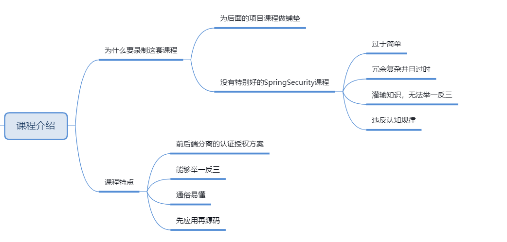

**笔记来源：**[**SpringSecurity框架教程-Spring Security+JWT实现项目级前端分离认证授权-B站最通俗易懂的Spring Security课程**](https://www.bilibili.com/video/BV1mm4y1X7Hc/?p=4&spm_id_from=pageDriver&vd_source=e8046ccbdc793e09a75eb61fe8e84a30)

前言



简介

**Spring Security** 是 Spring 家族中的一个安全管理框架。相比与另外一个安全框架**Shiro**，它提供了更丰富的功能，社区资源也比Shiro丰富。

一般来说中大型的项目都是使用**SpringSecurity** 来做安全框架。小项目有Shiro的比较多，因为相比与SpringSecurity，Shiro的上手更加的简单。

一般Web应用的需要进行**认证**和**授权**。

+ **认证：验证当前访问系统的是不是本系统的用户，并且要确认具体是哪个用户**
+ **授权：经过认证后判断当前用户是否有权限进行某个操作**

而认证和授权也是SpringSecurity作为安全框架的核心功能。

# 1 准备工作
我们先要搭建一个简单的SpringBoot工程

1. 设置父工程 添加依赖

```xml
    <parent>
        <groupId>org.springframework.boot</groupId>
        spring-boot-starter-parent</artifactId>
        <version>2.5.0</version>
    </parent>
    <dependencies>
        <dependency>
            <groupId>org.springframework.boot</groupId>
            spring-boot-starter-web</artifactId>
        </dependency>
        <dependency>
            <groupId>org.projectlombok</groupId>
            lombok</artifactId>
            <optional>true</optional>
        </dependency>
    </dependencies>
```

2. 创建启动类

```java
@SpringBootApplication
public class SecurityApplication {

    public static void main(String[] args) {
        SpringApplication.run(SecurityApplication.class,args);
    }
}
```

3. 创建Controller

```java

import org.springframework.web.bind.annotation.RequestMapping;
import org.springframework.web.bind.annotation.RestController;

@RestController
public class HelloController {

    @RequestMapping("/hello")
    public String hello(){
        return "hello";
    }
}
```

# 2 引入SpringSecurity
在SpringBoot项目中使用SpringSecurity我们只需要引入依赖即可实现入门案例。

```xml
<dependency>
     <groupId>org.springframework.boot</groupId>
     spring-boot-starter-security</artifactId>
</dependency>
```

引入依赖后我们在尝试去访问之前的接口就会自动跳转到一个SpringSecurity的默认登陆页面，默认用户名是user,密码会输出在控制台。

必须登陆之后才能对接口进行访问。

