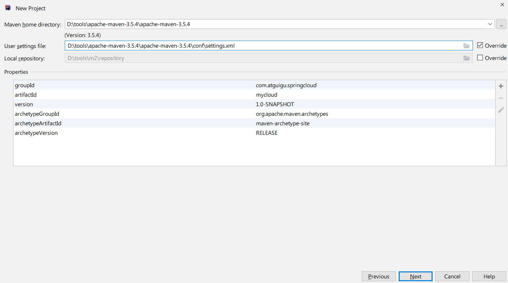
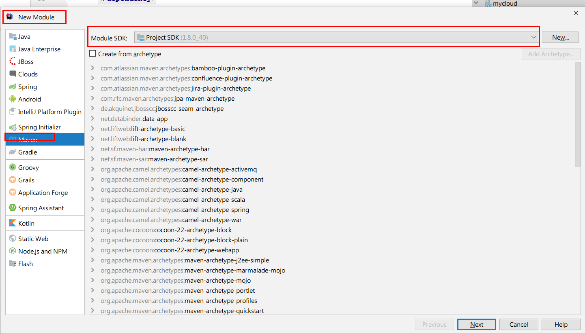
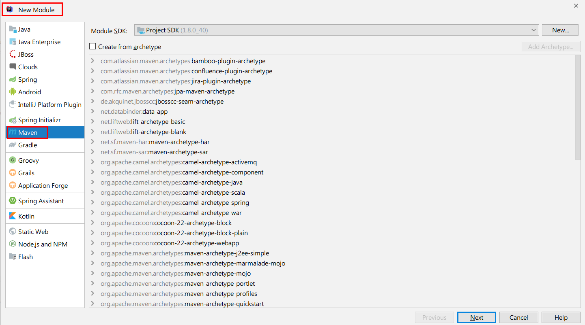
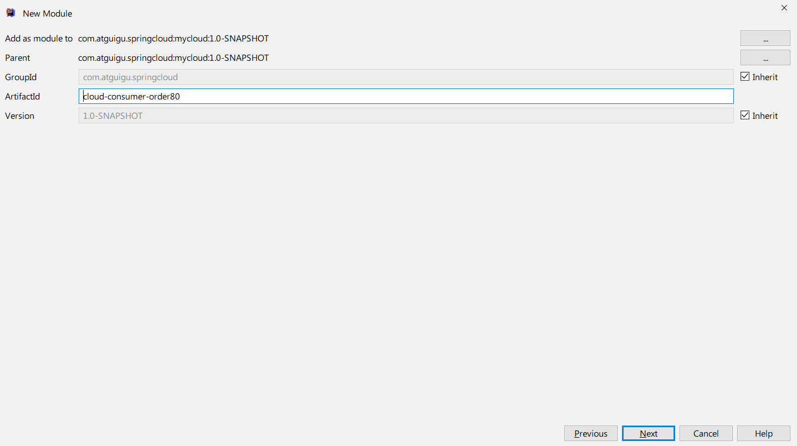

**笔记来源：**[**尚硅谷SpringCloud框架开发教程(SpringCloudAlibaba微服务分布式架构丨Spring Cloud)**](https://www.bilibili.com/video/BV18E411x7eT/?spm_id_from=333.337.search-card.all.click&vd_source=e8046ccbdc793e09a75eb61fe8e84a30)

**一句话：约定 > 配置 > 编码**

# 1 父工程的创建
## 1.1 父工程的创建步骤
1. New Project

   

2. 聚合总父工程名字

   

3. Maven选版本

   

4. 工程名字

   

5. 字符编码

   

6. 注解生效激活

   

7. java编译版本选8

   

8. File Type过滤

   

## 1.2 父工程POM
```xml
<?xml version="1.0" encoding="UTF-8"?>

<project xmlns="http://maven.apache.org/POM/4.0.0" xmlns:xsi="http://www.w3.org/2001/XMLSchema-instance"
  xsi:schemaLocation="http://maven.apache.org/POM/4.0.0 http://maven.apache.org/xsd/maven-4.0.0.xsd">
  <modelVersion>4.0.0</modelVersion>

  <groupId>com.atguigu.springcloud</groupId>
  <artifactId>mycloud</artifactId>
  <version>1.0-SNAPSHOT</version>
  <packaging>pom</packaging>

  <!-- 统一管理jar包版本 -->
  <properties>
    <project.build.sourceEncoding>UTF-8</project.build.sourceEncoding>
    <maven.compiler.source>1.8</maven.compiler.source>
    <maven.compiler.target>1.8</maven.compiler.target>
    <junit.version>4.12</junit.version>
    <log4j.version>1.2.17</log4j.version>
    <lombok.version>1.16.18</lombok.version>
    <mysql.version>5.1.47</mysql.version>
    <druid.version>1.1.16</druid.version>
    <mybatis.spring.boot.version>1.3.0</mybatis.spring.boot.version>
  </properties>

  <!-- 子模块继承之后，提供作用：锁定版本+子modlue不用写groupId和version  -->
  <dependencyManagement>
    <dependencies>
      <!--spring boot 2.2.2-->
      <dependency>
        <groupId>org.springframework.boot</groupId>
        <artifactId>spring-boot-dependencies</artifactId>
        <version>2.2.2.RELEASE</version>
        <type>pom</type>
        <scope>import</scope>
      </dependency>
      <!--spring cloud Hoxton.SR1-->
      <dependency>
        <groupId>org.springframework.cloud</groupId>
        <artifactId>spring-cloud-dependencies</artifactId>
        <version>Hoxton.SR1</version>
        <type>pom</type>
        <scope>import</scope>
      </dependency>
      <!--spring cloud alibaba 2.1.0.RELEASE-->
      <dependency>
        <groupId>com.alibaba.cloud</groupId>
        <artifactId>spring-cloud-alibaba-dependencies</artifactId>
        <version>2.1.0.RELEASE</version>
        <type>pom</type>
        <scope>import</scope>
      </dependency>
      <dependency>
        <groupId>mysql</groupId>
        <artifactId>mysql-connector-java</artifactId>
        <version>${mysql.version}</version>
      </dependency>
      <dependency>
        <groupId>com.alibaba</groupId>
        <artifactId>druid</artifactId>
        <version>${druid.version}</version>
      </dependency>
      <dependency>
        <groupId>org.mybatis.spring.boot</groupId>
        <artifactId>mybatis-spring-boot-starter</artifactId>
        <version>${mybatis.spring.boot.version}</version>
      </dependency>
      <dependency>
        <groupId>junit</groupId>
        <artifactId>junit</artifactId>
        <version>${junit.version}</version>
      </dependency>
      <dependency>
        <groupId>log4j</groupId>
        <artifactId>log4j</artifactId>
        <version>${log4j.version}</version>
      </dependency>
      <dependency>
        <groupId>org.projectlombok</groupId>
        <artifactId>lombok</artifactId>
        <version>${lombok.version}</version>
        <optional>true</optional>
      </dependency>
    </dependencies>
  </dependencyManagement>

  <build>
    <plugins>
      <plugin>
        <groupId>org.springframework.boot</groupId>
        <artifactId>spring-boot-maven-plugin</artifactId>
        <configuration>
          <fork>true</fork>
          <addResources>true</addResources>
        </configuration>
      </plugin>
    </plugins>
  </build>

</project>

```

**dependencyManagement的作用：**

Maven 使用 dependencyManagement 元素来提供了一种管理依赖版本号的方式。通常会在一个组织或者项目的最顶层的父POM 中看到dependencyManagement 元素。

使用pom.xml 中的dependencyManagement 元素能让所有在子项目中引用一个依赖而不用显式的列出版本号。  

Maven 会沿着父子层次向上走，直到找到一个拥有dependencyManagement 元素的项目，然后它就会使用这个dependencyManagement 元素中指定的版本号。


这样做的好处就是：如果有多个子项目都引用同一样依赖，则可以避免在每个使用的子项目里都声明一个版本号，这样当想升级或切换到另一个版本时，只需要在顶层父容器里更新，而不需要一个一个子项目的修改 ；另外如果某个子项目需要另外的一个版本，只需要声明version就可。

+ dependencyManagement里只是声明依赖，并不实现引入，因此子项目需要显示的声明需要用的依赖。
+ 如果不在子项目中声明依赖，是不会从父项目中继承下来的；只有在子项目中写了该依赖项，并且没有指定具体版本，才会从父项目中继承该项，并且version和scope都读取自父pom；
+ 如果子项目中指定了版本号，那么会使用子项目中指定的jar版本。


**maven中跳过单元测试：**  

1.  配置

    ```xml
    <build><!-- maven中跳过单元测试 -->
        <plugins>
            <plugin>
                <groupId>org.apache.maven.plugins</groupId>
                <artifactId>maven-surefire-plugin</artifactId>
                <configuration>
                    <skip>true</skip>
                </configuration>
            </plugin>
        </plugins>
    </build>
    ```

2.  IDEA工具支持(推荐)

    

# 2 服务提供者创建
1. 创建服务提供者的工程
    1. 创建Module

       

    2. 填写服务名

       

    3. 点击完成

       

2. 改POM

    ```xml
    <?xml version="1.0" encoding="UTF-8"?>
    <project xmlns="http://maven.apache.org/POM/4.0.0"
             xmlns:xsi="http://www.w3.org/2001/XMLSchema-instance"
             xsi:schemaLocation="http://maven.apache.org/POM/4.0.0 http://maven.apache.org/xsd/maven-4.0.0.xsd">
        <parent>
            <artifactId>mycloud</artifactId>
            <groupId>com.atguigu.springcloud</groupId>
            <version>1.0-SNAPSHOT</version>
        </parent>
        <modelVersion>4.0.0</modelVersion>

        <artifactId>cloud-provider-payment8001</artifactId>

        <dependencies>
            <dependency>
                <groupId>org.springframework.boot</groupId>
                <artifactId>spring-boot-starter-web</artifactId>
            </dependency>
            <dependency>
                <groupId>org.springframework.boot</groupId>
                <artifactId>spring-boot-starter-actuator</artifactId>
            </dependency>
            <dependency>
                <groupId>org.mybatis.spring.boot</groupId>
                <artifactId>mybatis-spring-boot-starter</artifactId>
            </dependency>
            <dependency>
                <groupId>com.alibaba</groupId>
                <artifactId>druid-spring-boot-starter</artifactId>
                <version>1.1.10</version>
            </dependency>
            <!--mysql-connector-java-->
            <dependency>
                <groupId>mysql</groupId>
                <artifactId>mysql-connector-java</artifactId>
            </dependency>
            <!--jdbc-->
            <dependency>
                <groupId>org.springframework.boot</groupId>
                <artifactId>spring-boot-starter-jdbc</artifactId>
            </dependency>
            <dependency>
                <groupId>org.springframework.boot</groupId>
                <artifactId>spring-boot-devtools</artifactId>
                <scope>runtime</scope>
                <optional>true</optional>
            </dependency>
            <dependency>
                <groupId>org.projectlombok</groupId>
                <artifactId>lombok</artifactId>
                <optional>true</optional>
            </dependency>
            <dependency>
                <groupId>org.springframework.boot</groupId>
                <artifactId>spring-boot-starter-test</artifactId>
                <scope>test</scope>
            </dependency>
        </dependencies>

    </project>
    ```


3. 写application.yaml

   ```yaml
   server:
     port: 8001

   spring:
     application:
       name: cloud-payment-service
     datasource:
       type: com.alibaba.druid.pool.DruidDataSource            # 当前数据源操作类型
       driver-class-name: org.gjt.mm.mysql.Driver              # mysql驱动包 com.mysql.jdbc.Driver
       url: jdbc:mysql://localhost:3306/db2019?useUnicode=true&characterEncoding=utf-8&useSSL=false
       username: root
       password: 123456

   mybatis:
     mapperLocations: classpath:mapper/*.xml
     type-aliases-package: com.atguigu.springcloud.entities    # 所有Entity别名类所在包
   ```


4. 写主启动

   ```java
   package com.atguigu.springcloud;

   import org.springframework.boot.SpringApplication;
   import org.springframework.boot.autoconfigure.SpringBootApplication;

   /**
    * @auther zzyy
    * @create 2020-01-27 19:50
    */
   @SpringBootApplication
   public class PaymentMain8001
   {
       public static void main(String[] args)
       {
           SpringApplication.run(PaymentMain8001.class,args);
       }
   }
   ```

   ​


5. 业务类
    1. 建表sql

       ```mysql
       CREATE TABLE `payment` (
         `id` bigint(20) NOT NULL AUTO_INCREMENT COMMENT 'ID',
         `serial` varchar(200) DEFAULT '',
         PRIMARY KEY (`id`)
       ) ENGINE=InnoDB AUTO_INCREMENT=1 DEFAULT CHARSET=utf8
       ```

    2. entities

       ```java
       package com.atguigu.springcloud.entities;

       import lombok.AllArgsConstructor;
       import lombok.Data;
       import lombok.NoArgsConstructor;

       import java.io.Serializable;

       /**
        * @auther zzyy
        * @create 2020-01-27 20:01
        */
       @Data
       @AllArgsConstructor
       @NoArgsConstructor
       public class Payment implements Serializable
       {
           private Long id;
           private String serial;
       }
       ```

       ```java
       package com.atguigu.springcloud.entities;

       import lombok.AllArgsConstructor;
       import lombok.Data;
       import lombok.NoArgsConstructor;

       /**
        * @auther zzyy
        * @create 2020-01-27 20:17
        */
       @Data
       @AllArgsConstructor
       @NoArgsConstructor
       public class CommonResult<T>
       {
           private Integer code;
           private String  message;
           private T data;

           public CommonResult(Integer code, String message)
           {
               this(code,message,null);
           }
       }
       ```

    3. dao

       ```java
       package com.atguigu.springcloud.dao;

       import com.atguigu.springcloud.entities.Payment;
       import org.apache.ibatis.annotations.Mapper;

       /**
        * @auther zzyy
        * @create 2020-01-27 20:21
        */
       @Mapper  //import org.apache.ibatis.annotations.Mapper;
       public interface PaymentDao
       {
           public int create(Payment payment);

           public Payment getPaymentById(@Param("id") Long id);
       }
       ```

       ```xml
       <?xml version="1.0" encoding="UTF-8" ?>
       <!DOCTYPE mapper PUBLIC "-//mybatis.org//DTD Mapper 3.0//EN" "http://mybatis.org/dtd/mybatis-3-mapper.dtd" >

       <mapper namespace="com.atguigu.springcloud.dao.PaymentDao">

           <resultMap id="BaseResultMap" type="com.atguigu.springcloud.entities.Payment">
               <id column="id" property="id" jdbcType="BIGINT"/>
               <result column="serial" property="serial" jdbcType="VARCHAR"/>
           </resultMap>

           <insert id="create" parameterType="Payment" useGeneratedKeys="true" keyProperty="id">
               INSERT INTO payment(SERIAL) VALUES(#{serial});
           </insert>

           <select id="getPaymentById" parameterType="Long" resultMap="BaseResultMap" >
               SELECT * FROM payment WHERE id=#{id};
           </select>

       </mapper>
       ```

    4. service

       ```java
       package com.atguigu.springcloud.service;

       import com.atguigu.springcloud.entities.Payment;
       import org.apache.ibatis.annotations.Param;

       /**
        * @auther zzyy
        * @create 2020-01-27 21:11
        */
       public interface PaymentService
       {
           public int create(Payment payment);

           public Payment getPaymentById(@Param("id") Long id);

       }
       ```

       ```java
       package com.atguigu.springcloud.service.impl;

       import com.atguigu.springcloud.dao.PaymentDao;
       import com.atguigu.springcloud.entities.Payment;
       import com.atguigu.springcloud.service.PaymentService;
       import org.springframework.stereotype.Service;

       import javax.annotation.Resource;

       /**
        * @auther zzyy
        * @create 2020-01-27 21:12
        */
       @Service
       public class PaymentServiceImpl implements PaymentService
       {
           @Resource
           private PaymentDao paymentDao;
       ```


           @Override
           public int create(Payment payment)
           {
               return paymentDao.create(payment);
           }
    
           @Override
           public Payment getPaymentById(Long id)
           {
               return paymentDao.getPaymentById(id);
           }
       }
       ```
    
    5. controller
    
       ```java
       package com.atguigu.springcloud.controller;
    
       import com.atguigu.springcloud.entities.CommonResult;
       import com.atguigu.springcloud.entities.Payment;
       import com.atguigu.springcloud.service.PaymentService;
       import com.sun.media.jfxmedia.logging.Logger;
       import lombok.extern.slf4j.Slf4j;
       import org.springframework.web.bind.annotation.*;
    
       import javax.annotation.Resource;
    
       /**
        * @auther zzyy
        * @create 2020-01-27 21:17
        */
       @RestController
       @Slf4j
       public class PaymentController
       {
           @Resource
           private PaymentService paymentService;
    
           @PostMapping(value = "/payment/create")
           public CommonResult create(@RequestBody Payment payment)
           {
               int result = paymentService.create(payment);
               log.info("*****插入操作返回结果:" + result);
    
               if(result > 0)
               {
                   return new CommonResult(200,"插入数据库成功",result);
               }else{
                   return new CommonResult(444,"插入数据库失败",null);
               }
           }
    
           @GetMapping(value = "/payment/get/{id}")
           public CommonResult<Payment> getPaymentById(@PathVariable("id") Long id)
           {
               Payment payment = paymentService.getPaymentById(id);
               log.info("*****查询结果:{}",payment);
               if (payment != null) {
                   return new CommonResult(200,"查询成功",payment);
               }else{
                   return new CommonResult(444,"没有对应记录,查询ID: "+id,null);
               }
           }
       }
       ```


6. 测试

# 3 服务消费者创建
1. 创建Module
    1. 创建module

       

    2. 填写服务名

       

    3. 点击完成

        


2. 改写POM

   ```xml
   <?xml version="1.0" encoding="UTF-8"?>
   <project xmlns="http://maven.apache.org/POM/4.0.0"
            xmlns:xsi="http://www.w3.org/2001/XMLSchema-instance"
            xsi:schemaLocation="http://maven.apache.org/POM/4.0.0 http://maven.apache.org/xsd/maven-4.0.0.xsd">
       <parent>
           <artifactId>mycloud</artifactId>
           <groupId>com.atguigu.springcloud</groupId>
           <version>1.0-SNAPSHOT</version>
       </parent>
       <modelVersion>4.0.0</modelVersion>

       <artifactId>cloud-consumer-order80</artifactId>
       <dependencies>
           <dependency>
               <groupId>org.springframework.boot</groupId>
               <artifactId>spring-boot-starter-web</artifactId>
           </dependency>
           <dependency>
               <groupId>org.springframework.boot</groupId>
               <artifactId>spring-boot-starter-actuator</artifactId>
           </dependency>

           <dependency>
               <groupId>org.springframework.boot</groupId>
               <artifactId>spring-boot-devtools</artifactId>
               <scope>runtime</scope>
               <optional>true</optional>
           </dependency>
           <dependency>
               <groupId>org.projectlombok</groupId>
               <artifactId>lombok</artifactId>
               <optional>true</optional>
           </dependency>
           <dependency>
               <groupId>org.springframework.boot</groupId>
               <artifactId>spring-boot-starter-test</artifactId>
               <scope>test</scope>
           </dependency>
       </dependencies>

   </project>
   ```


3. 写YML

   ```yaml
   server:
     port: 80
   ```


4. 主启动

   ```java
    
   package com.atguigu.springcloud;

   import org.springframework.boot.SpringApplication;
   import org.springframework.boot.autoconfigure.SpringBootApplication;

   /**
    * @auther zzyy
    * @create 2019-12-27 12:09
    */
   @SpringBootApplication
   public class MainApp80
   {
       public static void main(String[] args)
       {
           SpringApplication.run(MainApp80.class,args);
       }
   }
    
   ```


5. 业务类
    1. entities

       ```java
        
       package com.atguigu.springcloud.entities;

       import lombok.AllArgsConstructor;
       import lombok.Data;
       import lombok.NoArgsConstructor;

       import java.io.Serializable;

       /**
        * @auther zzyy
        * @create 2019-12-05 11:50
        */
       @Data
       @AllArgsConstructor
       @NoArgsConstructor
       public class Payment implements Serializable
       {
           private Long id;
           private String serial;
       }
       ```

       ```java
        
       package com.atguigu.springcloud.entities;

       import lombok.AllArgsConstructor;
       import lombok.Data;
       import lombok.NoArgsConstructor;

       /**
        * @auther zzyy
        * @create 2019-12-05 11:53
        */
       public class CommonResult<T>
       {
           private Integer code;
           private String message;
           private T data;

           public CommonResult()
           {
           }

           public CommonResult(Integer code, String message, T data)
           {
               this.code = code;
               this.message = message;
               this.data = data;
           }
           public CommonResult( Integer code,String message) {
               this( code, message,null);
           }

           public CommonResult(T data) {
               this(200, "操作成功", data);
           }

           //setter--getter
           public T getData() {
               return data;
           }

           public void setData(T data) {
               this.data = data;
           }

           public String getMessage() {
               return message;
           }

           public void setMessage(String message) {
               this.message = message;
           }

           public Integer getCode() {
               return code;
           }

           public void setCode(Integer code) {
               this.code = code;
           }
       }
       ```

    2. restTemplate

       - RestTemplate提供了多种便捷访问远程Http服务的方法，是一种简单便捷的访问restful服务模板类，是Spring提供的用于访问Rest服务的客户端模板工具集
       - 官网地址：[https://docs.spring.io/spring-framework/docs/5.2.2.RELEASE/javadoc-api/org/springframework/web/client/RestTemplate.html](https://docs.spring.io/spring-framework/docs/5.2.2.RELEASE/javadoc-api/org/springframework/web/client/RestTemplate.html)
       - 使用：使用restTemplate访问restful接口非常的简单粗暴无脑。(url, requestMap, ResponseBean.class)这三个参数分别代表REST请求地址、请求参数、HTTP响应转换被转换成的对象类型。

    3. config配置类

       ```java
        
       package com.atguigu.springcloud.config;

       import org.springframework.context.annotation.Bean;
       import org.springframework.context.annotation.Configuration;
       import org.springframework.web.client.RestTemplate;

       /**
        * @auther zzyy
        * @create 2019-12-27 12:50
        */
       @Configuration
       public class ApplicationContextConfig
       {
           @Bean
           public RestTemplate restTemplate()
           {
               return new RestTemplate();
           }
       }
       ```

    4. controller

       ```java
        
       package com.atguigu.springcloud.controller;

       import com.atguigu.springcloud.entities.CommonResult;
       import com.atguigu.springcloud.entities.Payment;
       import org.springframework.beans.factory.annotation.Autowired;
       import org.springframework.web.bind.annotation.GetMapping;
       import org.springframework.web.bind.annotation.PathVariable;
       import org.springframework.web.bind.annotation.RestController;
       import org.springframework.web.client.RestTemplate;

       /**
        * @auther zzyy
        * @create 2019-12-27 12:16
        */
       @RestController
       public class OrderController
       {

           public static final String PaymentSrv_URL = "http://localhost:8001";

           @Autowired
           private RestTemplate restTemplate;

           @GetMapping("/consumer/payment/create") //客户端用浏览器是get请求，但是底层实质发送post调用服务端8001
           public CommonResult create(Payment payment)
           {
               return restTemplate.postForObject(PaymentSrv_URL + "/payment/create",payment,CommonResult.class);
           }


           @GetMapping("/consumer/payment/get/{id}")
           public CommonResult getPayment(@PathVariable Long id)
           {
               return restTemplate.getForObject(PaymentSrv_URL + "/payment/get/"+id, CommonResult.class, id);
           }
       }
       ```


6. 测试

# 4 工程重构
问题：系统中有重复部分，代码需要重构


重构步骤

1. 新建Module
    1. 创建Module

       

    2. 填写Module名称


       

    3. 点击完成

2. 修改POM

    ```xml
    <?xml version="1.0" encoding="UTF-8"?>
    <project xmlns="http://maven.apache.org/POM/4.0.0"
             xmlns:xsi="http://www.w3.org/2001/XMLSchema-instance"
             xsi:schemaLocation="http://maven.apache.org/POM/4.0.0 http://maven.apache.org/xsd/maven-4.0.0.xsd">
        <parent>
            <artifactId>cloud2020</artifactId>
            <groupId>com.atguigu.springcloud</groupId>
            <version>1.0-SNAPSHOT</version>
        </parent>
        <modelVersion>4.0.0</modelVersion>

        <artifactId>cloud-api-commons</artifactId>

        <properties>
            <maven.compiler.source>8</maven.compiler.source>
            <maven.compiler.target>8</maven.compiler.target>
        </properties>

        <dependencies>
            <dependency>
                <groupId>org.springframework.boot</groupId>
                <artifactId>spring-boot-devtools</artifactId>
                <scope>runtime</scope>
                <optional>true</optional>
            </dependency>
            <dependency>
                <groupId>org.projectlombok</groupId>
                <artifactId>lombok</artifactId>
                <optional>true</optional>
            </dependency>
            <dependency>
                <groupId>cn.hutool</groupId>
                <artifactId>hutool-all</artifactId>
                <version>5.1.0</version>
            </dependency>
        </dependencies>
    </project>
    ```


3. 提取公共代码

   ```java
   package com.atguigu.springcloud.entities;

   import lombok.AllArgsConstructor;
   import lombok.Data;
   import lombok.NoArgsConstructor;

   @Data
   @AllArgsConstructor
   @NoArgsConstructor
   public class CommonResult<T> {

       private Integer code;
       private String message;
       private T data;

       public CommonResult(Integer code,String message){
           this(code,message,null);
       }

   }
   ```

   ```java
   package com.atguigu.springcloud.entities;


   import lombok.AllArgsConstructor;
   import lombok.Data;
   import lombok.NoArgsConstructor;

   import java.io.Serializable;

   @Data
   @AllArgsConstructor
   @NoArgsConstructor
   public class Payment implements Serializable {
       private Long id;
       private String serial;
   }
   ```


4. 执行Maven命令

   

5. 服务提供者和服务消费者分别改造
    1. 删除各自原有的entities文件夹

    2. 在各自的pom中加入一下内容

       ```xml
       <dependency>
         <groupId>com.atguigu.springcloud</groupId>
         <artifactId>cloud-api-commons</artifactId>
         <version>1.0-SNAPSHOT</version>
       </dependency>
       ```

       ​

目前的项目架构图：

  

  


