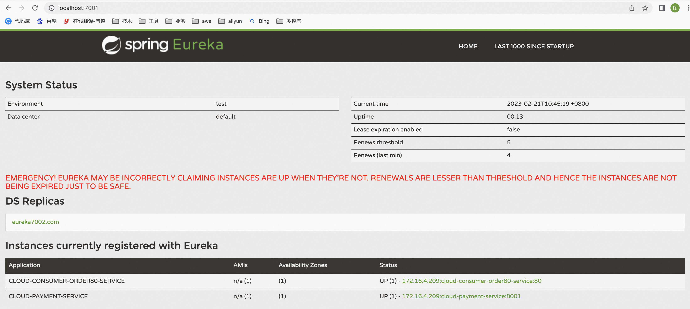

**<font style="color:#DF2A3F;">笔记来源：</font>**[**<font style="color:#DF2A3F;">尚硅谷SpringCloud框架开发教程(SpringCloudAlibaba微服务分布式架构丨Spring Cloud)</font>**](https://www.bilibili.com/video/BV18E411x7eT/?spm_id_from=333.337.search-card.all.click&vd_source=e8046ccbdc793e09a75eb61fe8e84a30)

# 1 Eureka基础知识
**<font style="color:#DF2A3F;">什么是服务治理？</font>**　

Spring Cloud 封装了 Netflix 公司开发的 Eureka 模块来实现服务治理

在传统的rpc远程调用框架中，管理每个服务与服务之间依赖关系比较复杂，管理比较复杂，所以需要使用服务治理，管理服务于服务之间依赖关系，可以实现服务调用、负载均衡、容错等，实现服务发现与注册。


**<font style="color:#DF2A3F;">什么是服务注册与发现？</font>**

Eureka采用了CS的设计架构，Eureka Server 作为服务注册功能的服务器，它是服务注册中心。而系统中的其他微服务，使用 Eureka的客户端连接到 Eureka Server并维持心跳连接。这样系统的维护人员就可以通过 Eureka Server 来监控系统中各个微服务是否正常运行。

在服务注册与发现中，有一个注册中心。当服务器启动的时候，会把当前自己服务器的信息 比如 服务地址通讯地址等以别名方式注册到注册中心上。另一方（消费者|服务提供者），以该别名的方式去注册中心上获取到实际的服务通讯地址，然后再实现本地RPC调用RPC远程调用框架核心设计思想：在于注册中心，因为使用注册中心管理每个服务与服务之间的一个依赖关系(服务治理概念)。在任何rpc远程框架中，都会有一个注册中心(存放服务地址相关信息(接口地址))

**下左图是Eureka系统架构，右图是Dubbo的架构，请对比**


 

Eureka包含两个组件：Eureka Server和Eureka Client

+ Eureka Server提供服务注册服务
    - 各个微服务节点通过配置启动后，会在EurekaServer中进行注册，这样EurekaServer中的服务注册表中将会存储所有可用服务节点的信息，服务节点的信息可以在界面中直观看到。
+ EurekaClient通过注册中心进行访问
    - 是一个Java客户端，用于简化Eureka Server的交互，客户端同时也具备一个内置的、使用轮询(round-robin)负载算法的负载均衡器。在应用启动后，将会向Eureka Server发送心跳(默认周期为30秒)。如果Eureka Server在多个心跳周期内没有接收到某个节点的心跳，EurekaServer将会从服务注册表中把这个服务节点移除（默认90秒）

# 2 单机Eureka构建步骤
## 2.1 Eureka服务端
创建步骤

1. 创建Module
    1. 创建Module


    2. 填写Module名称


    3. 点击完成
2. 改写POM

```xml
<?xml version="1.0" encoding="UTF-8"?>
<project xmlns="http://maven.apache.org/POM/4.0.0"
         xmlns:xsi="http://www.w3.org/2001/XMLSchema-instance"
         xsi:schemaLocation="http://maven.apache.org/POM/4.0.0 http://maven.apache.org/xsd/maven-4.0.0.xsd">
    <parent>
        cloud2020</artifactId>
        <groupId>com.atguigu.springcloud</groupId>
        <version>1.0-SNAPSHOT</version>
    </parent>
    <modelVersion>4.0.0</modelVersion>

    cloud-eureka-server7001</artifactId>

    <properties>
        <maven.compiler.source>8</maven.compiler.source>
        <maven.compiler.target>8</maven.compiler.target>
    </properties>

    <dependencies>
        <!--eureka-server-->
        <dependency>
            <groupId>org.springframework.cloud</groupId>
            spring-cloud-starter-netflix-eureka-server</artifactId>
        </dependency>
        <!-- 引入自己定义的api通用包，可以使用Payment支付Entity -->
        <dependency>
            <groupId>com.atguigu.springcloud</groupId>
            cloud-api-commons</artifactId>
            <version>${project.version}</version>
        </dependency>
        <!--boot web actuator-->
        <dependency>
            <groupId>org.springframework.boot</groupId>
            spring-boot-starter-web</artifactId>
        </dependency>
        <dependency>
            <groupId>org.springframework.boot</groupId>
            spring-boot-starter-actuator</artifactId>
        </dependency>
        <!--一般通用配置-->
        <dependency>
            <groupId>org.springframework.boot</groupId>
            spring-boot-devtools</artifactId>
            <scope>runtime</scope>
            <optional>true</optional>
        </dependency>
        <dependency>
            <groupId>org.projectlombok</groupId>
            lombok</artifactId>
        </dependency>
        <dependency>
            <groupId>org.springframework.boot</groupId>
            spring-boot-starter-test</artifactId>
            <scope>test</scope>
        </dependency>
        <dependency>
            <groupId>junit</groupId>
            junit</artifactId>
        </dependency>
    </dependencies>
</project>
```

**<font style="color:#4b4b4b;">1.X和2.X的对比说明</font>**

```xml
<!-- 以前的老版本（当前使用2018） -->
<dependency>
  <groupId>org.springframework.cloud</groupId>
	spring-cloud-starter-eurekaartifactId>
</dependency>

<!-- 现在新版本（当前使用2020.2） -->
<dependency>
  <groupId>org.springframework.cloud</groupId>
  spring-cloud-starter-netflix-eureka-server</artifactId>
</dependency>

```

3. 写YML

```yaml
server:
  port: 7001


eureka:
  instance:
    hostname: localhost #eureka服务端的实例名称
  client:
    register-with-eureka: false     #false表示不向注册中心注册自己。
    fetch-registry: false     #false表示自己端就是注册中心，我的职责就是维护服务实例，并不需要去检索服务
    service-url:
      #集群指向其它eureka
      #defaultZone: http://eureka7002.com:7002/eureka/
      #单机就是7001自己
      defaultZone: http://eureka7001.com:7001/eureka/

```

4. 主启动

```java
package com.atguigu.springcloud;


import org.springframework.boot.SpringApplication;
import org.springframework.boot.autoconfigure.SpringBootApplication;
import org.springframework.cloud.netflix.eureka.server.EnableEurekaServer;

@SpringBootApplication
@EnableEurekaServer
public class EurekaMain7001 {

    public static void main(String[] args) {
        SpringApplication.run(EurekaMain7001.class);
    }
}


```

5. 测试


没有服务被发现和注册

## 2.2 Eureka客户端
将<font style="color:#282828;">cloud-provider-payment8001服务注册到Eureka服务端</font>

1. <font style="color:#282828;">改POM</font>

```xml
<dependency>
    <groupId>org.springframework.cloud</groupId>
    spring-cloud-starter-netflix-eureka-client</artifactId>
</dependency>
```

**<font style="color:#4b4b4b;">1.X和2.X的对比说明</font>**

```xml
<!-- 以前老版本，别再使用 -->
<dependency>
    <groupId>org.springframework.cloud</groupId>
    spring-cloud-starter-eureka</artifactId>
</dependency>

<!--   现在新版本,当前使用 -->
<dependency>
    <groupId>org.springframework.cloud</groupId>
    spring-cloud-starter-netflix-eureka-client</artifactId>
</dependency>
```

2. <font style="color:#282828;">写YML</font>

```yaml
eureka:
  client:
    #表示是否将自己注册进EurekaServer默认为true。
    register-with-eureka: true
    #是否从EurekaServer抓取已有的注册信息，默认为true。单节点无所谓，集群必须设置为true才能配合ribbon使用负载均衡
    fetchRegistry: true
    service-url:
      #单机版
      defaultZone: http://localhost:7001/eureka
      # 集群版
      #defaultZone: http://eureka7001.com:7001/eureka,http://eureka7002.com:7002/eureka

```

3. <font style="color:#282828;">主启动</font>

```java
@SpringBootApplication
@EnableEurekaClient
public class PaymentMain8001 {
    public static void main(String[] args) {
        SpringApplication.run(PaymentMain8001.class);
    }
}

```

4. <font style="color:#282828;">测试</font>


将**<font style="color:#4b4b4b;">cloud-consumer-order80</font>**<font style="color:#282828;">服务注册到Eureka服务端</font>

1. <font style="color:#282828;">改POM</font>

```xml
<dependency>
      <groupId>org.springframework.cloud</groupId>
      spring-cloud-starter-netflix-eureka-client</artifactId>
</dependency>
```

2. <font style="color:#282828;">改YML</font>

```yaml
spring:
  application:
    name: cloud-consumer-order80-service

eureka:
  client:
    #表示是否将自己注册进EurekaServer默认为true。
    register-with-eureka: true
    #是否从EurekaServer抓取已有的注册信息，默认为true。单节点无所谓，集群必须设置为true才能配合ribbon使用负载均衡
    fetchRegistry: true
    service-url:
      #单机版
      defaultZone: http://localhost:7001/eureka
      # 集群版
      #defaultZone: http://eureka7001.com:7001/eureka,http://eureka7002.com:7002/eureka
```

3. <font style="color:#282828;">主启动</font>

```java
@SpringBootApplication
@EnableEurekaClient
public class OrderMain80 {
    public static void main(String[] args) {
        SpringApplication.run(OrderMain80.class);
    }
}
```

4. <font style="color:#282828;">测试</font>


常见的bug：


# 3 集群Eureka构建步骤
## 3.1 集群原理说明


流程：

1. 先启动eureka注册中心
2. 启动服务提供者payment支付服务
3. 支付服务启动后会把自身信息（比如服务地址以别名方式注册进eureka）
4. 消费者order服务在需要调用接口时，使用服务别名去注册中心获取实际的RPC远程调用地址
5. 消费者获得远程调用地址后，底层实际是利用HttpClient技术实现远程调用
6. 消费者获得服务地址后会缓存在本地JVM内存中，默认每隔30s更新一次服务调用地址


问题：微服务RPC远程服务调用最核心的是什么？

高可用，试想你的注册中心只有一个，它出故障了，会导致整个微服务环境不可用，所以解决办法：搭建Eureka注册中心集群，实现负载均衡和容错故障。

## 3.2 EurekaServer集群构建步骤
构建步骤：参考<font style="color:#282828;">cloud-eureka-server7001</font>

1. <font style="color:#282828;">创建Module</font>
    1. <font style="color:#282828;">创建Module</font>


    2. 填写Module名称


    3. 点击完成
2. <font style="color:#282828;">改POM</font>

```xml
<?xml version="1.0" encoding="UTF-8"?>
<project xmlns="http://maven.apache.org/POM/4.0.0"
         xmlns:xsi="http://www.w3.org/2001/XMLSchema-instance"
         xsi:schemaLocation="http://maven.apache.org/POM/4.0.0 http://maven.apache.org/xsd/maven-4.0.0.xsd">
    <parent>
        cloud2020</artifactId>
        <groupId>com.atguigu.springcloud</groupId>
        <version>1.0-SNAPSHOT</version>
    </parent>
    <modelVersion>4.0.0</modelVersion>

    cloud-eureka-server7002</artifactId>

    <properties>
        <maven.compiler.source>8</maven.compiler.source>
        <maven.compiler.target>8</maven.compiler.target>
    </properties>

    <dependencies>
        <!--eureka-server-->
        <dependency>
            <groupId>org.springframework.cloud</groupId>
            spring-cloud-starter-netflix-eureka-server</artifactId>
        </dependency>
        <!-- 引入自己定义的api通用包，可以使用Payment支付Entity -->
        <dependency>
            <groupId>com.atguigu.springcloud</groupId>
            cloud-api-commons</artifactId>
            <version>${project.version}</version>
        </dependency>
        <!--boot web actuator-->
        <dependency>
            <groupId>org.springframework.boot</groupId>
            spring-boot-starter-web</artifactId>
        </dependency>
        <dependency>
            <groupId>org.springframework.boot</groupId>
            spring-boot-starter-actuator</artifactId>
        </dependency>
        <!--一般通用配置-->
        <dependency>
            <groupId>org.springframework.boot</groupId>
            spring-boot-devtools</artifactId>
            <scope>runtime</scope>
            <optional>true</optional>
        </dependency>
        <dependency>
            <groupId>org.projectlombok</groupId>
            lombok</artifactId>
        </dependency>
        <dependency>
            <groupId>org.springframework.boot</groupId>
            spring-boot-starter-test</artifactId>
            <scope>test</scope>
        </dependency>
        <dependency>
            <groupId>junit</groupId>
            junit</artifactId>
        </dependency>
    </dependencies>
</project>
```

3. <font style="color:#282828;">修改映射配置</font>

<font style="color:#282828;">找到</font>`<font style="color:#282828;">C:\Windows\System32\drivers\etc</font>`<font style="color:#282828;">路径下的hosts文件</font>

```xml
127.0.0.1  eureka7001.com
127.0.0.1  eureka7002.com
```

4. <font style="color:#282828;">写YML</font>
    1. 7001

```yaml
server:
  port: 7001

eureka:
  instance:
    hostname: eureka7001.com #eureka服务端的实例名称
  client:
    register-with-eureka: false     #false表示不向注册中心注册自己。
    fetch-registry: false     #false表示自己端就是注册中心，我的职责就是维护服务实例，并不需要去检索服务
    service-url:
      #集群指向其它eureka
      defaultZone: http://eureka7002.com:7002/eureka/
      #单机就是7001自己
      #defaultZone: http://eureka7001.com:7001/eureka/
```

    2. 7002

```yaml
server:
  port: 7002

eureka:
  instance:
    hostname: eureka7002.com #eureka服务端的实例名称
  client:
    register-with-eureka: false     #false表示不向注册中心注册自己。
    fetch-registry: false     #false表示自己端就是注册中心，我的职责就是维护服务实例，并不需要去检索服务
    service-url:
      #集群指向其它eureka
      defaultZone: http://eureka7001.com:7001/eureka/
```

5. <font style="color:#282828;">主启动</font>

```java
@SpringBootApplication
@EnableEurekaServer
public class EurekaMain7002 {

    public static void main(String[] args) {
        SpringApplication.run(EurekaMain7002.class);
    }
}

```

6. 测试


## 3.3 将EurekaClient注册到Eureka集群中
<font style="color:#282828;">将支付服务8001微服务发布到上面2台Eureka集群配置中</font>

```yaml
eureka:
  client:
    #表示是否将自己注册进EurekaServer默认为true。
    register-with-eureka: true
    #是否从EurekaServer抓取已有的注册信息，默认为true。单节点无所谓，集群必须设置为true才能配合ribbon使用负载均衡
    fetchRegistry: true
    service-url:
      #单机版
      #defaultZone: http://localhost:7001/eureka
      # 集群版
      defaultZone: http://eureka7001.com:7001/eureka,http://eureka7002.com:7002/eureka
```

<font style="color:#282828;">将订单服务80微服务发布到上面2台Eureka集群配置中</font>

```yaml
eureka:
  client:
    #表示是否将自己注册进EurekaServer默认为true。
    register-with-eureka: true
    #是否从EurekaServer抓取已有的注册信息，默认为true。单节点无所谓，集群必须设置为true才能配合ribbon使用负载均衡
    fetchRegistry: true
    service-url:
      #单机版
      #defaultZone: http://localhost:7001/eureka
      # 集群版
      defaultZone: http://eureka7001.com:7001/eureka,http://eureka7002.com:7002/eureka
```

测试：




## 3.4 服务提供者搭建集群
<font style="color:#282828;">参考cloud-provider-payment8001</font>

<font style="color:#282828;">搭建步骤：</font>

1. <font style="color:#282828;">创建Module</font>
    1. <font style="color:#282828;">创建Module</font>


    2. 填写Module名称


    3. 点击完成
2. <font style="color:#282828;">改写POM</font>

```xml
<?xml version="1.0" encoding="UTF-8"?>
<project xmlns="http://maven.apache.org/POM/4.0.0"
         xmlns:xsi="http://www.w3.org/2001/XMLSchema-instance"
         xsi:schemaLocation="http://maven.apache.org/POM/4.0.0 http://maven.apache.org/xsd/maven-4.0.0.xsd">
    <parent>
        cloud2020</artifactId>
        <groupId>com.atguigu.springcloud</groupId>
        <version>1.0-SNAPSHOT</version>
    </parent>
    <modelVersion>4.0.0</modelVersion>

    cloud-provider-payment8002</artifactId>

    <properties>
        <maven.compiler.source>8</maven.compiler.source>
        <maven.compiler.target>8</maven.compiler.target>
    </properties>

    <dependencies>
        <dependency>
            <groupId>org.springframework.cloud</groupId>
            spring-cloud-starter-netflix-eureka-client</artifactId>
        </dependency>
        
        <dependency>
            <groupId>org.springframework.boot</groupId>
            spring-boot-starter-web</artifactId>
        </dependency>
        <dependency>
            <groupId>org.springframework.boot</groupId>
            spring-boot-starter-actuator</artifactId>
        </dependency>
        <dependency>
            <groupId>org.mybatis.spring.boot</groupId>
            mybatis-spring-boot-starter</artifactId>
        </dependency>
        <dependency>
            <groupId>com.alibaba</groupId>
            druid-spring-boot-starter</artifactId>
            <version>1.1.10</version>
        </dependency>
        <!--mysql-connector-java-->
        <dependency>
            <groupId>mysql</groupId>
            mysql-connector-java</artifactId>
        </dependency>
        <!--jdbc-->
        <dependency>
            <groupId>org.springframework.boot</groupId>
            spring-boot-starter-jdbc</artifactId>
        </dependency>
        <dependency>
            <groupId>org.springframework.boot</groupId>
            spring-boot-devtools</artifactId>
            <scope>runtime</scope>
            <optional>true</optional>
        </dependency>
        <dependency>
            <groupId>org.projectlombok</groupId>
            lombok</artifactId>
            <optional>true</optional>
        </dependency>
        <dependency>
            <groupId>org.springframework.boot</groupId>
            spring-boot-starter-test</artifactId>
            <scope>test</scope>
        </dependency>
        <dependency>
            <groupId>com.atguigu.springcloud</groupId>
            cloud-api-commons</artifactId>
            <version>1.0-SNAPSHOT</version>
        </dependency>
    </dependencies>
</project>
```

3. <font style="color:#282828;">改写YML</font>

```yaml
server:
  port: 8002

spring:
  application:
    name: cloud-payment-service
  datasource:
    type: com.alibaba.druid.pool.DruidDataSource            # 当前数据源操作类型
    driver-class-name: org.gjt.mm.mysql.Driver              # mysql驱动包
    url: jdbc:mysql://localhost:3306/db2019?useUnicode=true&characterEncoding=utf-8&useSSL=false&allowPublicKeyRetrieval=true
    username: root
    password: 123456

eureka:
  client:
    #表示是否将自己注册进EurekaServer默认为true。
    register-with-eureka: true
    #是否从EurekaServer抓取已有的注册信息，默认为true。单节点无所谓，集群必须设置为true才能配合ribbon使用负载均衡
    fetchRegistry: true
    service-url:
      #单机版
      #defaultZone: http://localhost:7001/eureka
      # 集群版
      defaultZone: http://eureka7001.com:7001/eureka,http://eureka7002.com:7002/eureka


mybatis:
  mapperLocations: classpath:mapper/*.xml
  type-aliases-package: com.atguigu.springcloud.entities    # 所有Entity别名类所在包

```

4. <font style="color:#282828;">主启动</font>

```java
package com.atguigu.springcloud;

import org.springframework.boot.SpringApplication;
import org.springframework.boot.autoconfigure.SpringBootApplication;
import org.springframework.cloud.netflix.eureka.EnableEurekaClient;

@SpringBootApplication
@EnableEurekaClient
public class PaymentMain8002 {
    public static void main(String[] args) {
        SpringApplication.run(PaymentMain8002.class);
    }
}

```

5. <font style="color:#282828;">业务类</font>

直接copy8001的就可以

6. <font style="color:#282828;">修改Controller</font>
    - 8002

```java
package com.atguigu.springcloud.controller;


import com.atguigu.springcloud.entities.CommonResult;
import com.atguigu.springcloud.entities.Payment;
import com.atguigu.springcloud.service.PaymentService;
import lombok.extern.slf4j.Slf4j;
import org.springframework.beans.factory.annotation.Autowired;
import org.springframework.beans.factory.annotation.Value;
import org.springframework.web.bind.annotation.*;

@RestController
@Slf4j
public class PaymentController {


    @Autowired
    PaymentService paymentService;

    @Value("${server.port}")
    String port;

    @PostMapping("/payment/create")
    public CommonResult create(@RequestBody Payment payment){
        int i = paymentService.create(payment);
        if (i > 0){
            return new CommonResult(200,"插入数据库成功",payment);
        }else {
            return new CommonResult(444,"插入数据失败",null);
        }
    }

    @GetMapping("/payment/get/{id}")
    public CommonResult create(@PathVariable("id") Long id){
        Payment payment = paymentService.getPaymentById(id);
        if (payment != null){
            return new CommonResult(200,"查询成功,port="+port,payment);
        }else {
            return new CommonResult(4444,"没有对应记录，id="+id,null);
        }
    }

}

```

    - 8001

```java
package com.atguigu.springcloud.controller;


import com.atguigu.springcloud.entities.CommonResult;
import com.atguigu.springcloud.entities.Payment;
import com.atguigu.springcloud.service.PaymentService;
import lombok.extern.slf4j.Slf4j;
import org.springframework.beans.factory.annotation.Autowired;
import org.springframework.beans.factory.annotation.Value;
import org.springframework.web.bind.annotation.*;

@RestController
@Slf4j
public class PaymentController {


    @Autowired
    PaymentService paymentService;

    @Value("${server.port}")
    String port;

    @PostMapping("/payment/create")
    public CommonResult create(@RequestBody Payment payment){
        int i = paymentService.create(payment);
        if (i > 0){
            return new CommonResult(200,"插入数据库成功",payment);
        }else {
            return new CommonResult(444,"插入数据失败",null);
        }
    }

    @GetMapping("/payment/get/{id}")
    public CommonResult create(@PathVariable("id") Long id){
        Payment payment = paymentService.getPaymentById(id);
        if (payment != null){
            return new CommonResult(200,"查询成功,port="+port,payment);
        }else {
            return new CommonResult(4444,"没有对应记录，id="+id,null);
        }
    }

}

```

7. <font style="color:#282828;">测试</font>
    - 7001


    - 7002


    - 直接访问8001


    - 直接访问8002

 

    - 访问消费者的80接口


我们发现，不论访问多少次，最终访问的都是8001，这与我们最初搭建服务提供者集群相违背，我们希望的是集群里面的服务都能够被访问到。

原因是因为，我们在消费者里面的controller里将服务的ip和端口号固定死了，所以这块还需要修改


8. 提供负载均衡能力
    - 消费者的controller里面

```java
package com.atguigu.springcloud.controller;

import com.atguigu.springcloud.entities.CommonResult;
import com.atguigu.springcloud.entities.Payment;
import lombok.extern.slf4j.Slf4j;
import org.springframework.beans.factory.annotation.Autowired;
import org.springframework.web.bind.annotation.GetMapping;
import org.springframework.web.bind.annotation.PathVariable;
import org.springframework.web.bind.annotation.RestController;
import org.springframework.web.client.RestTemplate;

@RestController
@Slf4j
public class OrderController {

    // public static final String PAYMENT_URL="http://localhost:8001";
    // 通过在eureka上注册过的微服务名称调用
    public static final String PAYMENT_URL = "http://CLOUD-PAYMENT-SERVICE";

    @Autowired
    RestTemplate restTemplate;

    @GetMapping("consumer/payment/create")
    public CommonResult<Payment> create(Payment payment){
        return restTemplate.postForObject(PAYMENT_URL+"/payment/create",payment,CommonResult.class);
    }

    @GetMapping("consumer/payment/get/{id}")
    public CommonResult<Payment> getPayment(@PathVariable("id") Long id){
        return restTemplate.getForObject(PAYMENT_URL+"/payment/get/"+id,CommonResult.class);
    }
}

```

    - <font style="color:#ff0000;">使用	</font>`<font style="color:#ff0000;">@LoadBalanced</font>`<font style="color:#ff0000;">注解赋予RestTemplate负载均衡的能力</font>

```java
@Configuration
public class ApplicationContextConfig {

    @Bean
    @LoadBalanced
    public RestTemplate getRestTemplate(){
        return new RestTemplate();
    }
}
```

    - <font style="color:#ff0000;">测试</font>


 

最终8002和8001是交替访问，实现了我们想要的负载均衡的效果。

# 4 Actuator微服务信息完善
# 5 服务发现Discovery
<font style="color:#282828;">对于注册进eureka里面的微服务，可以通过服务发现来获得该服务的信息</font>

1. <font style="color:#282828;"> 修改cloud-provider-payment8001的Controlle</font>

```java
@Autowired
DiscoveryClient discoveryClient;

@GetMapping(value = "/payment/discovery")
public Object discovery(){
    List<String> services = discoveryClient.getServices();
    for (String element : services) {
        System.out.println(element);
    }

    List<ServiceInstance> instances = discoveryClient.getInstances("CLOUD-PAYMENT-SERVICE");
    for (ServiceInstance element : instances) {
        System.out.println(element.getServiceId() + "\t" + element.getHost() + "\t" + element.getPort() + "\t"
                           + element.getUri());
    }
    return this.discoveryClient;
}

```

2. 主启动类

```java
@SpringBootApplication
@EnableEurekaClient
@EnableDiscoveryClient
public class PaymentMain8001 {
    public static void main(String[] args) {
        SpringApplication.run(PaymentMain8001.class);
    }
}

```

3. 测试

     [http://localhost:8001/payment/discovery](http://localhost:8001/payment/discovery)

```json
{
    "discoveryClients": [
        {
            "services": [
                "cloud-consumer-order80-service",
                "cloud-payment-service"
            ],
            "order": 0
        },
        {
            "services": [],
            "order": 0
        }
    ],
    "services": [
        "cloud-consumer-order80-service",
        "cloud-payment-service"
    ],
    "order": 0
}
```

# 6 Eureka自我保护
概述：保护模式主要用于一组客户端和Eureka Server之间存在网络分区场景下的保护。一旦进入保护模式，<font style="color:#ff0000;">Eureka Server将会尝试保护其服务注册表中的信息，不再删除服务注册表中的数据，也就是不会注销任何微服务。</font>

如果在Eureka Server的首页看到以下这段提示，则说明Eureka进入了保护模式：

**<font style="color:#DF2A3F;background-color:rgb(241, 241, 241);">EMERGENCY! EUREKA MAY BE INCORRECTLY CLAIMING INSTANCES ARE UP WHEN THEY'RE NOT. RENEWALS ARE LESSER THAN THRESHOLD AND HENCE THE INSTANCES ARE NOT BEING EXPIRED JUST TO BE SAFE.</font>**

 

 <font style="color:#0000ff;">为什么会产生Eureka自我保护机制？</font>

为了防止EurekaClient可以正常运行，但是与EurekaServer网络不通情况下，EurekaServer<font style="color:#ff0000;">不会立刻</font>将EurekaClient服务剔除

<font style="color:#0000ff;">什么是自我保护模式？</font>

默认情况下，如果EurekaServer在一定时间内没有接收到某个微服务实例的心跳，EurekaServer将会注销该实例（默认90秒）。但是当网络分区故障发生(延时、卡顿、拥挤)时，微服务与EurekaServer之间无法正常通信，以上行为可能变得非常危险了——因为微服务本身其实是健康的，<font style="color:#ff0000;">此时本不应该注销这个微服务</font>。Eureka通过“自我保护模式”来解决这个问题——当EurekaServer节点在短时间内丢失过多客户端时（可能发生了网络分区故障），那么这个节点就会进入自我保护模式。

<font style="color:#ff0000;">在自我保护模式中，Eureka Server会保护服务注册表中的信息，不再注销任何服务实例。</font>

它的设计哲学就是宁可保留错误的服务注册信息，也不盲目注销任何可能健康的服务实例<font style="color:#ff0000;">。一句话讲解：好死不如赖活着</font>

综上，自我保护模式是一种应对网络异常的安全保护措施。它的架构哲学是宁可同时保留所有微服务（健康的微服务和不健康的微服务都会保留）也不盲目注销任何健康的微服务。使用自我保护模式，可以让Eureka集群更加的健壮、稳定。

<font style="color:#282828;">一句话：某时刻某一个微服务不可用了，Eureka不会立刻清理，依旧会对该微服务的信息进行保存</font>

<font style="color:#282828;">属于CAP里面的AP分支</font>

## <font style="color:#282828;">6.1 如何禁止自我保护</font>
操作步骤

1. <font style="color:#282828;">注册中心EureakeServer端</font>
    - <font style="color:#282828;">出厂默认，自我保护机制是开启的。</font>`**<font style="color:#000080;">eureka.server.enable-self-preservation</font>**<font style="color:#000000;">=</font>**<font style="color:#000080;">true</font>**`
    - <font style="color:#282828;">使用</font>`<font style="color:#282828;">eureka.server.enable-self-preservation = false</font>`<font style="color:#282828;"> 可以禁用自我保护模式</font>
    - <font style="color:#282828;">关闭效果</font>


2. <font style="color:#282828;">eureakeClient端</font>
    - `**<font style="color:#000080;">eureka.instance.lease-renewal-interval-in-seconds</font>**<font style="color:#000000;">=</font>**<font style="color:#0000ff;">30</font>**`<font style="color:#282828;">单位为秒(默认是30秒)</font>
    - `**<font style="color:#000080;">eureka.instance.lease-expiration-duration-in-seconds</font>**<font style="color:#000000;">=</font>**<font style="color:#0000ff;">90</font>**`<font style="color:#282828;">单位为秒(默认是90秒)</font>
    - <font style="color:#282828;">修改配置</font>

```yaml
eureka:
  client:
    #表示是否将自己注册进EurekaServer默认为true。
    register-with-eureka: true
    #是否从EurekaServer抓取已有的注册信息，默认为true。单节点无所谓，集群必须设置为true才能配合ribbon使用负载均衡
    fetchRegistry: true
    service-url:
      #单机版
      defaultZone: http://localhost:7001/eureka
      # 集群版
      #defaultZone: http://eureka7001.com:7001/eureka,http://eureka7002.com:7002/eureka
  instance:
      instance-id: payment8001
      #访问路径可以显示IP地址
      prefer-ip-address: true
      #Eureka客户端向服务端发送心跳的时间间隔，单位为秒(默认是30秒)
      lease-renewal-interval-in-seconds: 1
      #Eureka服务端在收到最后一次心跳后等待时间上限，单位为秒(默认是90秒)，超时将剔除服务
      lease-expiration-duration-in-seconds: 2
```


 

 


