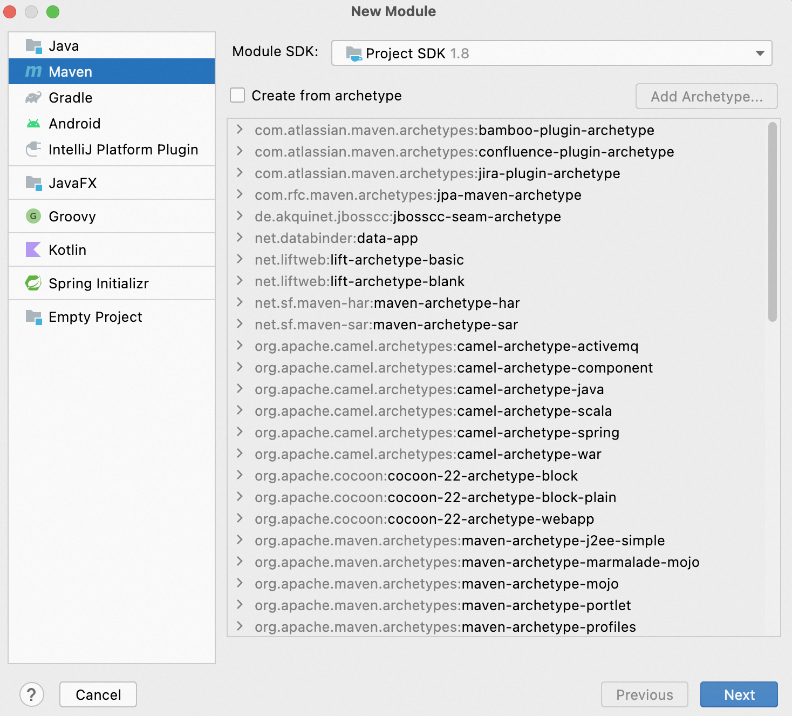
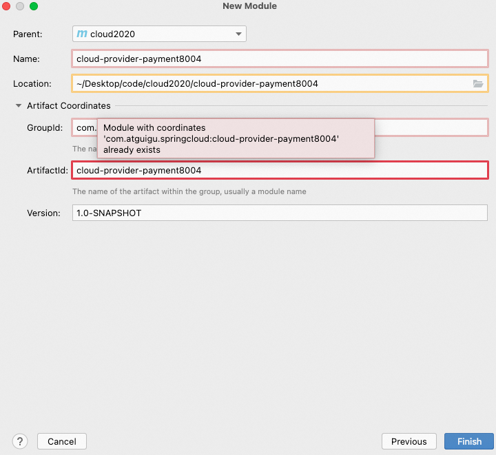
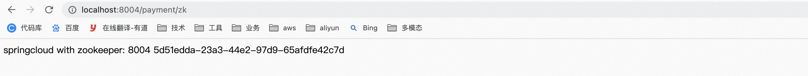
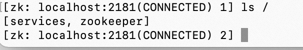
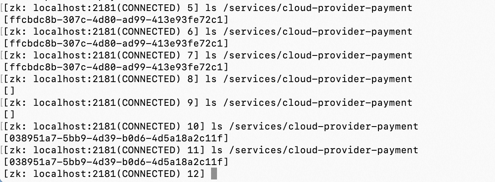
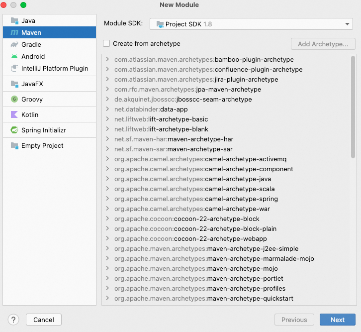
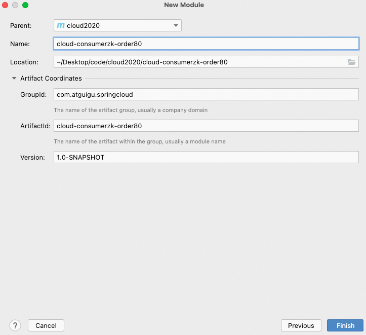
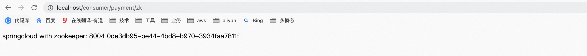

**笔记来源：**[**尚硅谷SpringCloud框架开发教程(SpringCloudAlibaba微服务分布式架构丨Spring Cloud)**](https://www.bilibili.com/video/BV18E411x7eT/?spm_id_from=333.337.search-card.all.click&vd_source=e8046ccbdc793e09a75eb61fe8e84a30)


# 1 注册中心Zookeeper
zookeeper是一个分布式协调工具，可以实现注册中心功能

zookeeper服务器取代Eureka服务器，zk作为服务注册中心

zookeeper具体的学习可以参考zookeeper得章节

[zookeeper入门](https://www.yuque.com/u21918439/vg7knb/thds96)

# 2 服务提供者
操作步骤

1. 创建Module
    1. 创建Module

       

    2. 填写Module名称


       

    3. 点击完成

2. 修改POM

    ```xml
    <?xml version="1.0" encoding="UTF-8"?>
    <project xmlns="http://maven.apache.org/POM/4.0.0"
             xmlns:xsi="http://www.w3.org/2001/XMLSchema-instance"
             xsi:schemaLocation="http://maven.apache.org/POM/4.0.0 http://maven.apache.org/xsd/maven-4.0.0.xsd">
        <parent>
            <artifactId>cloud2020</artifactId>
            <groupId>com.atguigu.springcloud</groupId>
            <version>1.0-SNAPSHOT</version>
        </parent>
        <modelVersion>4.0.0</modelVersion>

        <artifactId>cloud-provider-payment8004</artifactId>

        <properties>
            <maven.compiler.source>8</maven.compiler.source>
            <maven.compiler.target>8</maven.compiler.target>
        </properties>
    ```


        <dependencies>
            <!-- SpringBoot整合Web组件 -->
            <dependency>
                <groupId>org.springframework.boot</groupId>
                <artifactId>spring-boot-starter-web</artifactId>
            </dependency>
            <dependency><!-- 引入自己定义的api通用包，可以使用Payment支付Entity -->
                <groupId>com.atguigu.springcloud</groupId>
                <artifactId>cloud-api-commons</artifactId>
                <version>${project.version}</version>
            </dependency>
            <!-- SpringBoot整合zookeeper客户端 -->
            <dependency>
                <groupId>org.springframework.cloud</groupId>
                <artifactId>spring-cloud-starter-zookeeper-discovery</artifactId>
                <!--先排除自带的zookeeper3.5.3-->
                <exclusions>
                    <exclusion>
                        <groupId>org.apache.zookeeper</groupId>
                        <artifactId>zookeeper</artifactId>
                    </exclusion>
                </exclusions>
            </dependency>
            <!--添加zookeeper3.4.9版本-->
            <dependency>
                <groupId>org.apache.zookeeper</groupId>
                <artifactId>zookeeper</artifactId>
                <version>3.4.9</version>
            </dependency>
            <dependency>
                <groupId>org.springframework.boot</groupId>
                <artifactId>spring-boot-devtools</artifactId>
                <scope>runtime</scope>
                <optional>true</optional>
            </dependency>
            <dependency>
                <groupId>org.projectlombok</groupId>
                <artifactId>lombok</artifactId>
                <optional>true</optional>
            </dependency>
            <dependency>
                <groupId>org.springframework.boot</groupId>
                <artifactId>spring-boot-starter-test</artifactId>
                <scope>test</scope>
            </dependency>
        </dependencies>
    </project>
    ​```


3. 写YML

   ```yaml
   #8004表示注册到zookeeper服务器的支付服务提供者端口号
   server:
     port: 8004
   #服务别名----注册zookeeper到注册中心名称
   spring:
     application:
       name: cloud-provider-payment
   cloud:
     zookeeper:
       connect-string: localhost:2181
   ```


4. 主启动

   ```java
   package com.atguigu.springcloud;
   ```


   import org.springframework.boot.SpringApplication;
   import org.springframework.boot.autoconfigure.SpringBootApplication;
   import org.springframework.cloud.client.discovery.EnableDiscoveryClient;

   @SpringBootApplication
   @EnableDiscoveryClient //该注解用于向使用consul或者zookeeper作为注册中心时注册服务
   public class PaymentMain8004 {

       public static void main(String[] args) {
           SpringApplication.run(PaymentMain8004.class);
       }
   }
   ```


5. Controller

   ```java
   package com.atguigu.springcloud.controller;


   import org.springframework.beans.factory.annotation.Value;
   import org.springframework.web.bind.annotation.RequestMapping;
   import org.springframework.web.bind.annotation.RestController;

   import java.util.UUID;

   @RestController
   public class PaymentController {
       @Value("${server.port}")
       private String serverPort;

       @RequestMapping(value = "/payment/zk")
       public String paymentzk()
       {
           return "springcloud with zookeeper: "+serverPort+"\t"+ UUID.randomUUID().toString();
       }
   }
   ```


6. 验证测试

   

   ​

     

   ​

   ​

思考：服务节点是临时节点还是持久节点？关掉服务后



关掉服务后，发现节点清除了，重新后，又回重新创建一个新节点

# 3 服务消费者
操作步骤：

1. 创建Module
    1. 创建Module

       

    2. 填写Module名称


       

    3. 点击完成

2. 改POM

    ```xml
    <?xml version="1.0" encoding="UTF-8"?>
    <project xmlns="http://maven.apache.org/POM/4.0.0"
             xmlns:xsi="http://www.w3.org/2001/XMLSchema-instance"
             xsi:schemaLocation="http://maven.apache.org/POM/4.0.0 http://maven.apache.org/xsd/maven-4.0.0.xsd">
        <parent>
            <artifactId>cloud2020</artifactId>
            <groupId>com.atguigu.springcloud</groupId>
            <version>1.0-SNAPSHOT</version>
        </parent>
        <modelVersion>4.0.0</modelVersion>

        <artifactId>cloud-consumerzk-order80</artifactId>

        <properties>
            <maven.compiler.source>8</maven.compiler.source>
            <maven.compiler.target>8</maven.compiler.target>
        </properties>

        <dependencies>
            <!-- SpringBoot整合Web组件 -->
            <dependency>
                <groupId>org.springframework.boot</groupId>
                <artifactId>spring-boot-starter-web</artifactId>
            </dependency>
            <!-- SpringBoot整合zookeeper客户端 -->
            <dependency>
                <groupId>org.springframework.cloud</groupId>
                <artifactId>spring-cloud-starter-zookeeper-discovery</artifactId>
                <!--先排除自带的zookeeper-->
                <exclusions>
                    <exclusion>
                        <groupId>org.apache.zookeeper</groupId>
                        <artifactId>zookeeper</artifactId>
                    </exclusion>
                </exclusions>
            </dependency>
            <!--添加zookeeper3.4.9版本-->
            <dependency>
                <groupId>org.apache.zookeeper</groupId>
                <artifactId>zookeeper</artifactId>
                <version>3.4.9</version>
            </dependency>
            <dependency>
                <groupId>org.springframework.boot</groupId>
                <artifactId>spring-boot-devtools</artifactId>
                <scope>runtime</scope>
                <optional>true</optional>
            </dependency>
            <dependency>
                <groupId>org.projectlombok</groupId>
                <artifactId>lombok</artifactId>
                <optional>true</optional>
            </dependency>
            <dependency>
                <groupId>org.springframework.boot</groupId>
                <artifactId>spring-boot-starter-test</artifactId>
                <scope>test</scope>
            </dependency>
        </dependencies>

    </project>
    ```


3. 写YML

   ```yaml
   server:
     port: 80

   spring:
     application:
       name: cloud-consumer-order
     cloud:
       #注册到zookeeper地址
       zookeeper:
         connect-string: localhost:2181
   ```


4. 主启动

   ```java
   package com.atguigu.springcloud;

   import org.springframework.boot.SpringApplication;
   import org.springframework.boot.autoconfigure.SpringBootApplication;
   import org.springframework.cloud.client.discovery.EnableDiscoveryClient;

   /**
    * @auther zzyy
    * @create 2020-02-19 15:19
    */
   @SpringBootApplication
   @EnableDiscoveryClient
   public class OrderZKMain80
   {
       public static void main(String[] args) {
               SpringApplication.run(OrderZKMain80.class, args);
       }
   }
   ```


5. 业务类

   ```java
   package com.atguigu.springcloud.config;

   import org.springframework.cloud.client.loadbalancer.LoadBalanced;
   import org.springframework.context.annotation.Bean;
   import org.springframework.context.annotation.Configuration;
   import org.springframework.web.client.RestTemplate;

   /**
    * @auther zzyy
    * @create 2020-02-19 15:20
    */
   @Configuration
   public class ApplicationContextConfig
   {
       @Bean
       @LoadBalanced
       public RestTemplate getRestTemplate()
       {
           return new RestTemplate();
       }
   }
   ```

   ```java
   package com.atguigu.springcloud.controller;

   import lombok.extern.slf4j.Slf4j;
   import org.springframework.web.bind.annotation.GetMapping;
   import org.springframework.web.bind.annotation.RestController;
   import org.springframework.web.client.RestTemplate;

   import javax.annotation.Resource;

   /**
    * @auther zzyy
    * @create 2020-02-19 15:21
    */
   @RestController
   @Slf4j
   public class OrderZKController
   {
       public static final String INVOKE_URL = "http://cloud-provider-payment";

       @Resource
       private RestTemplate restTemplate;

       @GetMapping(value = "/consumer/payment/zk")
       public String paymentInfo()
       {
           String result = restTemplate.getForObject(INVOKE_URL+"/payment/zk",String.class);
           return result;
       }
   }
   ```


6. 验证测试

   

   

